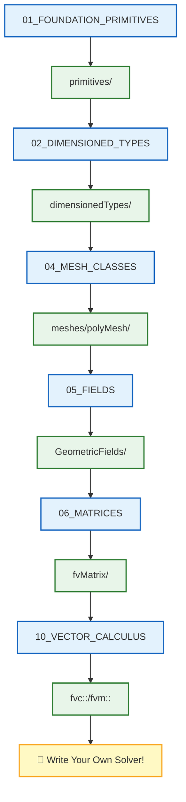

# 🗺️ Learning Navigator: OpenFOAM Programming

> **วัตถุประสงค์**: เอกสารนี้เป็น **เส้นทางการเรียนรู้แบบคู่ขนาน** ที่เชื่อมโยงเนื้อหาการเขียนโปรแกรม OpenFOAM กับ Source Code จริงของไลบรารีหลัก

---

## 📋 สารบัญ

1. [Foundation Primitives](#1-foundation-primitives-ประเภทข้อมูลพื้นฐาน)
2. [Dimensioned Types](#2-dimensioned-types-ประเภทที่มีมิติ)
3. [Containers & Memory](#3-containers--memory-คอนเทนเนอร์และหน่วยความจำ)
4. [Mesh Classes](#4-mesh-classes-คลาสเมช)
5. [Fields & GeometricFields](#5-fields--geometricfields-ฟิลด์)
6. [Matrices & Linear Algebra](#6-matrices--linear-algebra-เมทริกซ์และพีชคณิตเชิงเส้น)
7. [Time & Databases](#7-time--databases-เวลาและฐานข้อมูล)
8. [Field Types](#8-field-types-ประเภทฟิลด์)
9. [Field Algebra](#9-field-algebra-พีชคณิตฟิลด์)
10. [Vector Calculus](#10-vector-calculus-แคลคูลัสเวกเตอร์)
11. [Tensor Algebra](#11-tensor-algebra-พีชคณิตเทนเซอร์)
12. [Dimensional Analysis](#12-dimensional-analysis-การวิเคราะห์มิติ)

---

## 1. Foundation Primitives (ประเภทข้อมูลพื้นฐาน)

| 📖 เนื้อหา | 📝 คำอธิบาย | 🔧 Source Code ที่เกี่ยวข้อง |
|-----------|------------|---------------------------|
| [[01_FOUNDATION_PRIMITIVES/00_Overview]] | ภาพรวม Primitives | `src/OpenFOAM/primitives/` |
| [[01_FOUNDATION_PRIMITIVES/01_Introduction]] | แนะนำ Primitives | `src/OpenFOAM/primitives/Scalar/` |
| [[01_FOUNDATION_PRIMITIVES/02_Basic_Primitives]] | Primitives พื้นฐาน | `src/OpenFOAM/primitives/` |
| [[01_FOUNDATION_PRIMITIVES/03_Dimensioned_Types_Intro]] | แนะนำ Dimensioned Types | `src/OpenFOAM/dimensionedTypes/` |
| [[01_FOUNDATION_PRIMITIVES/04_Smart_Pointers]] | Smart Pointers | `src/OpenFOAM/memory/autoPtr/` |
| [[01_FOUNDATION_PRIMITIVES/05_Containers]] | Containers | `src/OpenFOAM/containers/` |
| [[01_FOUNDATION_PRIMITIVES/06_Summary]] | สรุป | - |
| [[01_FOUNDATION_PRIMITIVES/07_Exercises]] | แบบฝึกหัด | - |

---

## 2. Dimensioned Types (ประเภทที่มีมิติ)

| 📖 เนื้อหา | 📝 คำอธิบาย | 🔧 Source Code ที่เกี่ยวข้อง |
|-----------|------------|---------------------------|
| [[02_DIMENSIONED_TYPES/00_Overview]] | ภาพรวม | `src/OpenFOAM/dimensionedTypes/` |
| [[02_DIMENSIONED_TYPES/01_Introduction]] | แนะนำ Dimensioned Types | `src/OpenFOAM/dimensionedTypes/dimensionedScalar/` |
| [[02_DIMENSIONED_TYPES/02_Physics_Aware_Type_System]] | ระบบ Type รู้ฟิสิกส์ | `src/OpenFOAM/dimensionSet/` |
| [[02_DIMENSIONED_TYPES/03_Implementation_Mechanisms]] | กลไกการ Implement | `src/OpenFOAM/dimensionedTypes/` |
| [[02_DIMENSIONED_TYPES/04_Template_Metaprogramming]] | Template Metaprogramming | `src/OpenFOAM/` |
| [[02_DIMENSIONED_TYPES/05_Pitfalls_and_Solutions]] | ปัญหาและแนวทางแก้ | - |
| [[02_DIMENSIONED_TYPES/06_Engineering_Benefits]] | ประโยชน์ทางวิศวกรรม | - |

---

## 3. Containers & Memory (คอนเทนเนอร์และหน่วยความจำ)

| 📖 เนื้อหา | 📝 คำอธิบาย | 🔧 Source Code ที่เกี่ยวข้อง |
|-----------|------------|---------------------------|
| [[03_CONTAINERS_MEMORY/00_Overview]] | ภาพรวม | `src/OpenFOAM/containers/` |
| [[03_CONTAINERS_MEMORY/01_Introduction]] | แนะนำ | `src/OpenFOAM/containers/Lists/` |
| [[03_CONTAINERS_MEMORY/02_Memory_Management_Fundamentals]] | พื้นฐานการจัดการหน่วยความจำ | `src/OpenFOAM/memory/` |
| [[03_CONTAINERS_MEMORY/03_Container_System]] | ระบบ Container | `src/OpenFOAM/containers/` |
| [[03_CONTAINERS_MEMORY/04_Integration_and_Best_Practices]] | แนวปฏิบัติที่ดี | - |

---

## 4. Mesh Classes (คลาสเมช)

| 📖 เนื้อหา | 📝 คำอธิบาย | 🔧 Source Code ที่เกี่ยวข้อง |
|-----------|------------|---------------------------|
| [[04_MESH_CLASSES/00_Overview]] | ภาพรวม Mesh Classes | `src/OpenFOAM/meshes/` |
| [[04_MESH_CLASSES/01_Introduction]] | แนะนำ | `src/OpenFOAM/meshes/primitiveMesh/` |
| [[04_MESH_CLASSES/02_Mesh_Hierarchy]] | ลำดับชั้นของ Mesh | `src/OpenFOAM/meshes/` |
| [[04_MESH_CLASSES/03_primitiveMesh]] | primitiveMesh | `src/OpenFOAM/meshes/primitiveMesh/` |
| [[04_MESH_CLASSES/04_polyMesh]] | polyMesh | `src/OpenFOAM/meshes/polyMesh/` |
| [[04_MESH_CLASSES/05_fvMesh]] | fvMesh | `src/finiteVolume/fvMesh/` |
| [[04_MESH_CLASSES/06_Common_Pitfalls]] | ปัญหาที่พบบ่อย | - |

---

## 5. Fields & GeometricFields (ฟิลด์)

| 📖 เนื้อหา | 📝 คำอธิบาย | 🔧 Source Code ที่เกี่ยวข้อง |
|-----------|------------|---------------------------|
| [[05_FIELDS_GEOMETRICFIELDS/00_Overview]] | ภาพรวม Fields | `src/OpenFOAM/fields/` |
| [[05_FIELDS_GEOMETRICFIELDS/01_Introduction]] | แนะนำ | `src/OpenFOAM/fields/Fields/` |
| [[05_FIELDS_GEOMETRICFIELDS/02_Design_Philosophy]] | ปรัชญาการออกแบบ | `src/OpenFOAM/fields/GeometricFields/` |
| [[05_FIELDS_GEOMETRICFIELDS/03_Inheritance_Hierarchy]] | ลำดับชั้นการสืบทอด | `src/finiteVolume/fields/` |
| [[05_FIELDS_GEOMETRICFIELDS/04_Field_Lifecycle]] | วงจรชีวิตของ Field | `src/OpenFOAM/fields/` |
| [[05_FIELDS_GEOMETRICFIELDS/05_Mathematical_Type_Theory]] | ทฤษฎี Type ทางคณิตศาสตร์ | - |
| [[05_FIELDS_GEOMETRICFIELDS/06_Common_Pitfalls]] | ปัญหาที่พบบ่อย | - |

---

## 6. Matrices & Linear Algebra (เมทริกซ์และพีชคณิตเชิงเส้น)

| 📖 เนื้อหา | 📝 คำอธิบาย | 🔧 Source Code ที่เกี่ยวข้อง |
|-----------|------------|---------------------------|
| [[06_MATRICES_LINEARALGEBRA/00_Overview]] | ภาพรวม | `src/OpenFOAM/matrices/` |
| [[06_MATRICES_LINEARALGEBRA/01_Introduction]] | แนะนำ | `src/OpenFOAM/matrices/lduMatrix/` |
| [[06_MATRICES_LINEARALGEBRA/02_Dense_vs_Sparse_Matrices]] | Dense vs Sparse | `src/OpenFOAM/matrices/` |
| [[06_MATRICES_LINEARALGEBRA/03_fvMatrix_Architecture]] | สถาปัตยกรรม fvMatrix | `src/finiteVolume/fvMatrices/` |
| [[06_MATRICES_LINEARALGEBRA/04_Linear_Solvers_Hierarchy]] | ลำดับชั้น Linear Solvers | `src/OpenFOAM/matrices/lduMatrix/solvers/` |
| [[06_MATRICES_LINEARALGEBRA/05_Parallel_Linear_Algebra]] | พีชคณิตเชิงเส้นแบบขนาน | `src/OpenFOAM/matrices/lduMatrix/` |
| [[06_MATRICES_LINEARALGEBRA/06_Common_Pitfalls]] | ปัญหาที่พบบ่อย | - |

---

## 7. Time & Databases (เวลาและฐานข้อมูล)

| 📖 เนื้อหา | 📝 คำอธิบาย | 🔧 Source Code ที่เกี่ยวข้อง |
|-----------|------------|---------------------------|
| [[07_TIME_DATABASES/00_Overview]] | ภาพรวม | `src/OpenFOAM/db/Time/` |
| [[07_TIME_DATABASES/01_Introduction]] | แนะนำ | `src/OpenFOAM/db/` |
| [[07_TIME_DATABASES/02_Time_Architecture]] | สถาปัตยกรรม Time | `src/OpenFOAM/db/Time/` |

---

## 8. Field Types (ประเภทฟิลด์)

| 📖 เนื้อหา | 📝 คำอธิบาย | 🔧 Source Code ที่เกี่ยวข้อง |
|-----------|------------|---------------------------|
| [[08_FIELD_TYPES/00_Overview]] | ภาพรวม | `src/finiteVolume/fields/volFields/` |
| volScalarField | สนามสเกลาร์ | `src/finiteVolume/fields/volFields/` |
| volVectorField | สนามเวกเตอร์ | `src/finiteVolume/fields/volFields/` |
| surfaceScalarField | สนามบนพื้นผิว | `src/finiteVolume/fields/surfaceFields/` |

---

## 9. Field Algebra (พีชคณิตฟิลด์)

| 📖 เนื้อหา | 📝 คำอธิบาย | 🔧 Source Code ที่เกี่ยวข้อง |
|-----------|------------|---------------------------|
| [[09_FIELD_ALGEBRA/00_Overview]] | ภาพรวม | `src/OpenFOAM/fields/` |
| Field Operations | การดำเนินการกับฟิลด์ | `src/finiteVolume/` |

---

## 10. Vector Calculus (แคลคูลัสเวกเตอร์)

| 📖 เนื้อหา | 📝 คำอธิบาย | 🔧 Source Code ที่เกี่ยวข้อง |
|-----------|------------|---------------------------|
| [[10_VECTOR_CALCULUS/00_Overview]] | ภาพรวม | `src/finiteVolume/finiteVolume/` |
| fvc::grad | Gradient | `src/finiteVolume/finiteVolume/fvc/` |
| fvc::div | Divergence | `src/finiteVolume/finiteVolume/fvc/` |
| fvc::laplacian | Laplacian | `src/finiteVolume/finiteVolume/fvc/` |

---

## 11. Tensor Algebra (พีชคณิตเทนเซอร์)

| 📖 เนื้อหา | 📝 คำอธิบาย | 🔧 Source Code ที่เกี่ยวข้อง |
|-----------|------------|---------------------------|
| [[11_TENSOR_ALGEBRA/00_Overview]] | ภาพรวม | `src/OpenFOAM/primitives/Tensor/` |
| tensor | Tensor Class | `src/OpenFOAM/primitives/Tensor/` |
| symmTensor | Symmetric Tensor | `src/OpenFOAM/primitives/SymmTensor/` |

---

## 12. Dimensional Analysis (การวิเคราะห์มิติ)

| 📖 เนื้อหา | 📝 คำอธิบาย | 🔧 Source Code ที่เกี่ยวข้อง |
|-----------|------------|---------------------------|
| [[12_DIMENSIONAL_ANALYSIS/00_Overview]] | ภาพรวม | `src/OpenFOAM/dimensionSet/` |
| dimensionSet | ระบบมิติ | `src/OpenFOAM/dimensionSet/` |
| dimensionedScalar | สเกลาร์ที่มีมิติ | `src/OpenFOAM/dimensionedTypes/` |

---

## 📁 OpenFOAM Source Code Structure

```
src/
├── OpenFOAM/
│   ├── primitives/           ← 🌟 ประเภทข้อมูลพื้นฐาน
│   │   ├── Scalar/
│   │   ├── Vector/
│   │   └── Tensor/
│   │
│   ├── dimensionedTypes/     ← 🌟 ประเภทที่มีมิติ
│   │   ├── dimensionedScalar/
│   │   └── dimensionedVector/
│   │
│   ├── containers/           ← 🌟 Containers
│   │   └── Lists/
│   │
│   ├── meshes/               ← 🌟 Mesh Classes
│   │   ├── primitiveMesh/
│   │   └── polyMesh/
│   │
│   ├── fields/               ← 🌟 Field Classes
│   │   ├── Fields/
│   │   └── GeometricFields/
│   │
│   ├── matrices/             ← 🌟 Matrix Classes
│   │   └── lduMatrix/
│   │
│   ├── memory/               ← Memory Management
│   │   └── autoPtr/
│   │
│   └── db/                   ← Databases
│       └── Time/
│
└── finiteVolume/
    ├── fvMesh/               ← Finite Volume Mesh
    ├── fields/               ← FV Fields
    │   ├── volFields/
    │   └── surfaceFields/
    ├── fvMatrices/           ← FV Matrices
    └── finiteVolume/
        └── fvc/              ← 🌟 Calculus Operations
```

---

## 🎓 Learning Path



---

## 🔗 Quick Links

| ต้องการทำ | เนื้อหา | Source Code |
|----------|--------|-------------|
| **สร้าง Field ใหม่** | [[05_FIELDS_GEOMETRICFIELDS]] | `fields/GeometricFields/` |
| **ใช้ fvm/fvc** | [[10_VECTOR_CALCULUS]] | `finiteVolume/fvc/` |
| **สร้าง Matrix** | [[06_MATRICES_LINEARALGEBRA]] | `fvMatrices/` |
| **เข้าใจ Mesh** | [[04_MESH_CLASSES]] | `meshes/polyMesh/` |

---

*Last Updated: 2025-12-26*
