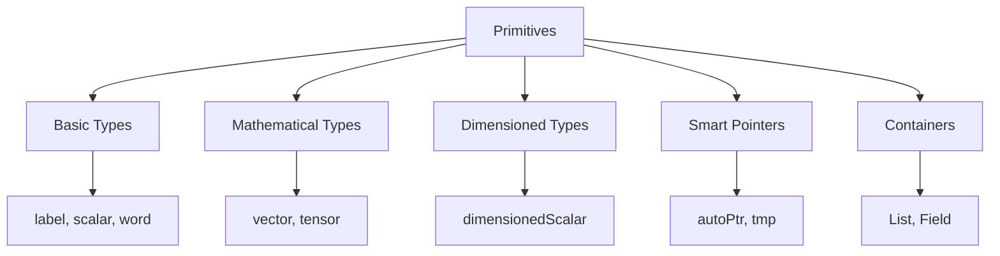
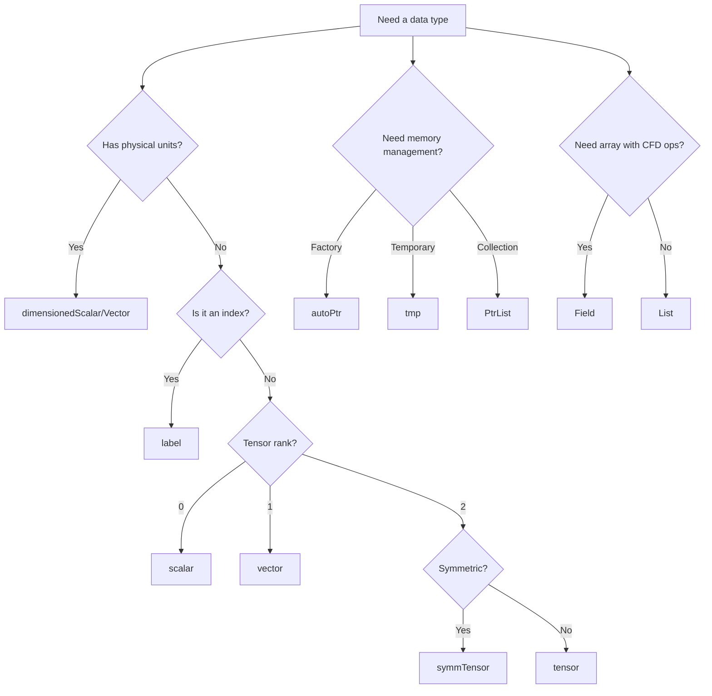
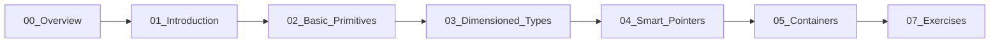

# Foundation Primitives - Overview

ภาพรวม OpenFOAM Primitives — Building blocks สำหรับ CFD programming

---

## 🎯 Learning Objectives

**Learning Objectives:**
- Identify the six categories of OpenFOAM primitives and their purposes
- Understand the hierarchy from basic types to complex containers
- Select appropriate primitive types for common CFD programming tasks
- Recognize how dimension checking prevents physics errors
- Apply smart pointers for safe memory management in OpenFOAM

**เป้าหมายการเรียนรู้:**
- จำแนกประเภทของ OpenFOAM primitives ทั้ง 6 หมวดและวัตถุประสงค์การใช้งาน
- เข้าใจลำดับชั้นจาก basic types ถึง complex containers
- เลือกประเภท primitive ที่เหมาะสมสำหรับงาน CFD programming
- ใช้ dimension checking เพื่อป้องกัน physics errors
- ใช้งาน smart pointers สำหรับ memory management ที่ปลอดภัย

---

## What are OpenFOAM Primitives?

> **💡 คิดแบบนี้:**
> OpenFOAM Primitives = **LEGO blocks สำหรับ CFD**
> 
> - `scalar`, `vector`, `tensor` = รูปทรงพื้นฐาน
> - `dimensionedScalar` = LEGO ที่มี label บอกขนาด
> - `autoPtr`, `tmp` = กล่องเก็บ LEGO อัตโนมัติ

**What:** OpenFOAM primitives are fundamental data types specifically designed for computational fluid dynamics. They form the foundation upon which all OpenFOAM fields, matrices, boundary conditions, and solvers are built.

**Why Primitives Matter:**
- **ทุกอย่างใน OpenFOAM สร้างจาก primitives เหล่านี้** — Fields, Matrices, BCs
- เข้าใจ primitives = อ่าน/แก้ไข OpenFOAM source code ได้
- ใช้ผิด type = bugs ที่หายาก (แม้ compile ผ่าน)

**How They're Organized:**



---

## 1. Basic Types

**What:** Fundamental types that replace or enhance standard C++ types for CFD applications.

| Type | ใช้เมื่อ | ทำไมไม่ใช้ C++ ตรงๆ |
|------|---------|-------------------|
| `label` | Cell/face indices | Portable 32/64-bit |
| `scalar` | Temperature, pressure | มี CFD functions (mag, sqr) |
| `word` | Field names | มี validation + operations |
| `fileName` | File paths | Path operations built-in |
| `Switch` | Solver options | รองรับ "yes/no/on/off" |

**Why:** These types provide consistency across platforms, CFD-specific functionality, and integration with OpenFOAM's I/O system.

**How:**
```cpp
label cellI = 0;       // Cell index
scalar T = 300.0;      // Temperature
word fieldName = "p";  // Field name
```

---

## 2. Mathematical Types

**What:** Tensor-based types for representing physical quantities with different ranks.

| Type | Rank | Components | ใช้สำหรับ | Physics |
|------|------|------------|----------|---------|
| `scalar` | 0 | 1 | p, T, k | ค่าเดี่ยว |
| `vector` | 1 | 3 | U, F | ทิศทาง + magnitude |
| `tensor` | 2 | 9 | σ, ∇U | Transformation |
| `symmTensor` | 2 | 6 | R (Reynolds stress) | Symmetric ประหยัด memory |
| `sphericalTensor` | 2 | 1 | pI | Isotropic part |

**Why:** Different physical quantities require different tensor ranks. Using specialized types saves memory and makes code intentions clear.

> **ทำไมมีหลาย tensor types?**
> - `tensor` (9) → เก็บครบ เช่น velocity gradient
> - `symmTensor` (6) → ประหยัด 33% เมื่อ symmetric
> - `sphericalTensor` (1) → pressure part เท่านั้น

**How:** Choose based on the mathematical nature of your physical quantity.

---

## 3. Dimensioned Types

**What:** Types that carry physical unit information alongside numerical values.

> **ทำไม dimensioned types สำคัญมาก?**
> - **ป้องกัน physics errors ที่ compiler จับไม่ได้**
> - บวก pressure + velocity → Error! (ไม่ใช่ bug ที่ซ่อน)

**Why:** Dimension checking catches unit mismatches at compile-time or run-time, preventing costly physics mistakes.

**How:**
```cpp
// Scalar with units
dimensionedScalar rho("rho", dimDensity, 1000);  // 1000 kg/m³

// Vector with units
dimensionedVector g("g", dimAcceleration, vector(0, 0, -9.81));
```

### Dimension Checking

```cpp
// ✅ Valid: dimensions match
volScalarField dynP = 0.5 * rho * magSqr(U);  // [M L^-1 T^-2]

// ❌ Invalid: dimension error (won't compile/run)
// p + U;  // Error! Cannot add pressure + velocity
```

---

## 4. Smart Pointers

**What:** Memory management classes that automatically handle object allocation and deallocation.

> **ทำไมต้องใช้ smart pointers?**
> - **ป้องกัน memory leaks** — delete อัตโนมัติ
> - CFD ใช้ memory มาก → leak = crash

**Why:** CFD simulations allocate large amounts of memory. Smart pointers prevent leaks and improve code safety.

| Type | ใช้เมื่อ | ตัวอย่าง |
|------|---------|---------|
| `autoPtr` | Unique ownership (1 เจ้าของ) | Factory pattern |
| `tmp` | Temporary results | `fvc::grad(p)` |
| `PtrList` | List of pointers | Collection of BCs |

**How:**
```cpp
// tmp example: fvc:: returns tmp
tmp<volVectorField> tGradP = fvc::grad(p);
volVectorField gradP = tGradP();  // Access value
// tGradP auto-deleted when out of scope
```

---

## 5. Containers

**What:** Specialized data structures optimized for CFD operations and OpenFOAM I/O.

**Why:** Standard STL containers lack OpenFOAM-specific features like field operations and case file integration.

| Container | ใช้เมื่อ | ต่างจาก std::vector อย่างไร |
|-----------|---------|---------------------------|
| `List<T>` | Dynamic array | OpenFOAM I/O compatible |
| `Field<T>` | Arrays with CFD ops | มี max(), sum(), average() |
| `HashTable` | Key-value map | Case-insensitive keys |
| `DynamicList` | Growable list | Pre-allocated growth |

**How:**
```cpp
Field<scalar> T(100, 300.0);

// Field has CFD operations
scalar Tmax = max(T);
scalar Tavg = average(T);
scalar Tsum = sum(T);

// List doesn't have these
```

**Field vs List:**
- Use `Field` when you need CFD mathematical operations
- Use `List` for general-purpose storage

---

## 🚦 Decision Guide: Choosing the Right Primitive



**Quick Reference:**

| Need | Use | ทำไม |
|------|-----|------|
| Index | `label` | Portable integer |
| Value | `scalar` | CFD math functions |
| 3D direction | `vector` | Built-in dot/cross |
| With units | `dimensionedScalar` | Dimension checking |
| Temporary result | `tmp<T>` | Auto memory management |
| Array with ops | `Field<T>` | max/sum/average |

---

## 🧠 Concept Check

<details>
<summary><b>1. ทำไมต้องใช้ dimensioned types?</b></summary>

**ตรวจสอบหน่วยอัตโนมัติ:**
- Compile-time: ตรวจบาง operations
- Run-time: ตรวจทุก operation

**ตัวอย่าง:**
```cpp
dimensionedScalar p("p", dimPressure, 1000);
dimensionedScalar U("U", dimVelocity, 10);
// p + U → ERROR! Dimension mismatch
```

ป้องกัน physics errors ที่ compiler จับไม่ได้
</details>

<details>
<summary><b>2. autoPtr vs tmp ใช้เมื่อไหร่?</b></summary>

| | autoPtr | tmp |
|-|---------|-----|
| Ownership | Unique (1 เจ้าของ) | Reference counted |
| ใช้กับ | Factory objects | Temporary calculations |
| ตัวอย่าง | `autoPtr<turbulenceModel>` | `tmp<volVectorField>` |

**กฎ:**
- Factory return → `autoPtr`
- `fvc::`/`fvm::` return → `tmp`
</details>

<details>
<summary><b>3. Field กับ List ต่างกันอย่างไร?</b></summary>

| | List | Field |
|-|------|-------|
| CFD operations | ❌ | ✅ max, sum, average |
| Math operations | ❌ | ✅ +, -, *, / |
| Memory | Same | Same |

**กฎ:** ถ้าต้องการ CFD math → ใช้ `Field`
</details>

---

## 🔧 Common Pitfalls

| Pitfall | Consequence | Solution |
|---------|-------------|----------|
| Using `int` instead of `label` | Non-portable code | Always use `label` for indices |
| Mixing dimensioned types with raw types | Lost dimension checking | Use `dimensionedScalar` consistently |
| Deleting `tmp` manually | Double-free crashes | Let `tmp` auto-delete |
| Using `std::vector` for fields | No CFD operations | Use `Field<T>` instead |
| Forgetting `const ref` parameters | Unnecessary copying | Pass fields as `const Field<T>&` |

---

## 🎯 Key Takeaways

**Core Concepts:**
- OpenFOAM primitives are LEGO blocks for CFD — everything builds on them
- Six categories: Basic Types, Mathematical Types, Dimensioned Types, Smart Pointers, Containers, and Fields
- Each primitive serves a specific purpose in the CFD workflow

**Critical Points:**
- **Dimensioned types** prevent unit errors that would otherwise cause silent bugs
- **Smart pointers** (autoPtr, tmp) manage memory automatically in large CFD simulations
- **Mathematical types** (vector, tensor, symmTensor) match physical quantities precisely
- **Field vs List:** Choose Field when you need CFD operations (max, sum, average)

**Best Practices:**
- Always use `label` for mesh indices (portability)
- Use `dimensioned<Type>` for physical quantities (safety)
- Leverage `tmp<T>` for temporary calculations (efficiency)
- Choose `Field<T>` over `List<T>` for CFD operations (convenience)

---

## 📍 Where to Go From Here

**Learning Path:**



**แนะนำ:** อ่านตามลำดับ เพราะแต่ละบทสร้างบนความรู้ก่อนหน้า

**Recommended Sequence:**
1. **01_Introduction** — Deep dive into primitive concepts and examples
2. **02_Basic_Primitives** — Detailed coverage of label, scalar, word types
3. **03_Dimensioned_Types** — Understanding units and dimension checking
4. **04_Smart_Pointers** — Memory management in OpenFOAM
5. **05_Containers** — Lists, Fields, and data structures
6. **07_Exercises** — Practice your understanding with hands-on problems

---

## 📖 Related Documentation

**Within This Module:**
- **บทถัดไป:** [01_Introduction.md](01_Introduction.md) — รายละเอียดเพิ่มเติม
- **Basic Primitives:** [02_Basic_Primitives.md](02_Basic_Primitives.md)
- **Dimensioned Types:** [03_Dimensioned_Types_Intro.md](03_Dimensioned_Types_Intro.md)
- **Smart Pointers:** [04_Smart_Pointers.md](04_Smart_Pointers.md)

**Cross-Module References:**
- **Mesh Structures:** See `MODULE_02_MESHING_AND_CASE_SETUP/CONTENT/01_MESHING_FUNDAMENTALS/02_OpenFOAM_Mesh_Structure.md` for primitive usage in mesh data
- **Field Operations:** Refer to `MODULE_03_SINGLE_PHASE_FLOW/CONTENT/01_INCOMPRESSIBLE_FLOW_SOLVERS/02_Standard_Solvers.md` for practical field applications