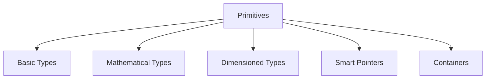

# Foundation Primitives - Overview

ภาพรวม OpenFOAM Primitives

---

## Overview

> **OpenFOAM Primitives** = Building blocks for CFD programming



---

## 1. Basic Types

| Type | Description | Example |
|------|-------------|---------|
| `label` | Integer index | Cell/face indices |
| `scalar` | Floating point | Temperature, pressure |
| `word` | String identifier | Field names |
| `fileName` | File path | Case directories |
| `Switch` | Boolean flag | Solver options |

---

## 2. Mathematical Types

| Type | Rank | Components | Use |
|------|------|------------|-----|
| `scalar` | 0 | 1 | p, T, k |
| `vector` | 1 | 3 | U, F |
| `tensor` | 2 | 9 | σ, ∇U |
| `symmTensor` | 2 | 6 | R (symmetric) |
| `sphericalTensor` | 2 | 1 | pI |

---

## 3. Dimensioned Types

```cpp
// Scalar with units
dimensionedScalar rho("rho", dimDensity, 1000);

// Vector with units
dimensionedVector g("g", dimAcceleration, vector(0, 0, -9.81));
```

### Dimension Checking

```cpp
// Valid: dimensions match
volScalarField dynP = 0.5 * rho * magSqr(U);

// Invalid: dimension error
// p + U;  // Error!
```

---

## 4. Smart Pointers

| Type | Purpose |
|------|---------|
| `autoPtr` | Unique ownership |
| `tmp` | Reference counted temporary |
| `PtrList` | List of pointers |

---

## 5. Containers

| Container | Use |
|-----------|-----|
| `List<T>` | Dynamic array |
| `Field<T>` | List with CFD operations |
| `HashTable` | Key-value map |
| `DynamicList` | Growable list |

---

## 6. Learning Path


---

## Quick Reference

| Need | Use |
|------|-----|
| Index | `label` |
| Value | `scalar` |
| 3D vector | `vector` |
| With units | `dimensionedScalar` |
| Memory managed | `autoPtr`, `tmp` |
| Array | `List`, `Field` |

---

## Concept Check

<details>
<summary><b>1. ทำไมต้องใช้ dimensioned types?</b></summary>

เพื่อ **ตรวจสอบหน่วย** อัตโนมัติ — ป้องกัน physics errors
</details>

<details>
<summary><b>2. autoPtr vs tmp ใช้เมื่อไหร่?</b></summary>

- **autoPtr**: Unique ownership (factories)
- **tmp**: Temporary calculations (fvc::)
</details>

<details>
<summary><b>3. Field กับ List ต่างกันอย่างไร?</b></summary>

**Field** มี CFD operations เช่น `max()`, `average()`, `sum()`
</details>

---

## Related Documents

- **Introduction:** [01_Introduction.md](01_Introduction.md)
- **Basic Primitives:** [02_Basic_Primitives.md](02_Basic_Primitives.md)
- **Dimensioned Types:** [03_Dimensioned_Types_Intro.md](03_Dimensioned_Types_Intro.md)