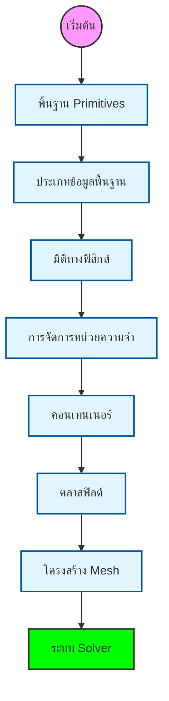

# พื้นฐาน Primitives: องค์ประกอบหลักของ OpenFOAM

## ภาพรวม

สถาปัตยกรรมของ OpenFOAM สร้างขึ้นบนพื้นฐานของคลาส primitive หลักที่ซับซ้อน ซึ่งเป็นองค์ประกอบพื้นฐานสำหรับการคำนวณ CFD ทั้งหมด พื้นฐาน primitives เหล่านี้ให้โครงสร้างข้อมูลและอัลกอริทึมพื้นฐานที่เปิดให้สามารถจำลองทางตัวเลขของพลศาสตร์ของไหลและปรากฏการณ์ทางกายภาพที่เกี่ยวข้องได้อย่างมีประสิทธิภาพ



## ทำไมต้อง Redefine ประเภทข้อมูลพื้นฐานของ C++?

OpenFOAM ไม่ได้ใช้ standard C++ types เช่น `int` และ `double` โดยตรง แต่จะ define primitives ของตัวเอง: `label`, `scalar` และอื่นๆ การเลือกแบบนี้มีจุดประสงค์สำคัญ 3 ประการ:

### 1. **Portability** (การพกพา)

การจำลอง CFD ทำงานได้บนอุปกรณ์ต่างๆ ตั้งแต่ laptop ไปจนถึง supercomputer ที่มีสถาปัตยกรรมแตกต่างกัน (32-bit vs 64-bit, single vs double precision)

> [!INFO] ความสำคัญของ Portable Types
> Primitives ของ OpenFOAM มี consistent behavior บนทุก platform:
> - เมื่อ compile OpenFOAM บนระบบต่างๆ underlying primitive types จะปรับเปลี่ยนโดยอัตโนมัติ
> - เพื่อ optimal representation สำหรับ hardware นั้นๆ
> - ทำให้ CFD code ของคุณทำงานเหมือนเดิมไม่ว่าจะรันบน development laptop หรือ production cluster

### 2. **Precision Control** (การควบคุมความแม่นยำ)

ปัญหา CFD ที่แตกต่างกันต้องการ numerical precision ที่แตกต่างกัน

| ระดับความแม่นยำ | Use Case | ผลกระทบด้านประสิทธิภาพ |
|-------------------|----------|----------------------|
| Single | Rapid prototyping, educational purposes | เร็วกว่า ~2x, ใช้หน่วยความจำลดลง ~50% |
| Double | High-fidelity simulations, production | มาตรฐาน, สมดุลระหว่างความเร็วและความแม่นยำ |
| Extended | Research requiring extreme accuracy | ช้าที่สุด แต่ความแม่นยำสูงสุด |

### 3. **Physics Safety** (ความปลอดภัยทางฟิสิกส์)

Primitives ของ OpenFOAM บังคับให้มี dimensional consistency และป้องกันการดำเนินการที่ไม่มีความหมายทางฟิสิกส์

> [!WARNING] ตัวอย่างการป้องกันข้อผิดพลาด
> ```cpp
> // การบวก pressure กับ velocity - ไม่ได้รับอนุญาต!
> volScalarField p = ...;      // [kg/(m·s²)]
> volVectorField U = ...;      // [m/s]
> volScalarField error = p + U; // Compile error: dimensional inconsistency
> ```
>
> ประโยชน์ใน CFD:
> - ป้องกัน dimensional errors ที่นำไปสู่ simulation crashes
> - หลีกเลี่ยง physically incorrect results ที่ดูเหมือนสมเหตุสมผล
> - Type system ทำหน้าที่เป็น first line of defense ต่อ implementation mistakes

## ประเภทข้อมูลพื้นฐาน

### คลาสเวกเตอร์และเทนเซอร์

ใจกลางของเครื่องมือคำนวณของ OpenFOAM คือคลาส geometric primitive ที่จัดการกับคณิตศาสตร์เวกเตอร์และเทนเซอร์

**คลาสเวกเตอร์ (`Vector<Type>`)**:
คลาสเทมเพลต Vector ให้การดำเนินการเวกเตอร์พื้นฐานสำหรับปริมาณมิติและไร้มิติ

- `Vector<scalar>`: เวกเตอร์ 3 มิติของค่าสเกลาร์ (typedef'd ว่า `vector`)
- `Vector<label>`: เวกเตอร์ 3 มิติของดัชนีจำนวนเต็ม (typedef'd ว่า `labelVector`)

**การดำเนินการหลัก:**
```cpp
vector a(1, 2, 3);
vector b(4, 5, 6);
vector c = a + b;          // การบวกเวกเตอร์
scalar mag = a.mag();      // ขนาด: $\sqrt{a_x^2 + a_y^2 + a_z^2}$
scalar dot = a & b;        // ผลคูณจุด: $\vec{a} \cdot \vec{b}$
vector cross = a ^ b;      // ผลคูณไขว้: $\vec{a} \times \vec{b}$
```

**คลาสเทนเซอร์:**
OpenFOAM ใช้ลำดับชั้นเทนเซอร์ที่ครอบคลุม:

| คลาสเทนเซอร์ | คำอธิบาย | จำนวนส่วนประกอบ |
|---------------|------------|------------------|
| `Tensor<Type>` | เทนเซอร์อันดับสอง | 9 ส่วนประกอบ |
| `SymmTensor<Type>` | เทนเซอร์สมมาตร | 6 ส่วนประกอบอิสระ |
| `SphericalTensor<Type>` | เทนเซอร์ทรงกลม | ส่วนประกอบแนวทแยงเดียว |

**การดำเนินการทางคณิตศาสตร์ตามกฎของพีชคณิตเทนเซอร์:**
$$\boldsymbol{\tau}_{ij} = \mu \left(\frac{\partial u_i}{\partial x_j} + \frac{\partial u_j}{\partial x_i}\right)$$

โดยที่:
- $\boldsymbol{\tau}_{ij}$: เทนเซอร์ความเค้น
- $\mu$: ความหนืดไดนามิก
- $u_i$, $u_j$: ส่วนประกอบความเร็ว
- $x_i$, $x_j$: พิกัดทิศทาง

### คลาสฟิลด์

คลาสฟิลด์เป็นศูนย์กลางของการจัดการข้อมูลของ OpenFOAM โดยให้คอนเทนเนอร์สำหรับปริมาณทางกายภาพที่กำหนดไว้บนโดเมนการคำนวณ

**ฟิลด์เรขาคณิต:**
- `GeometricField<Type, PatchField, GeoMesh>`: คลาสเทมเพลตสำหรับฟิลด์
- `volScalarField`: ฟิลด์สเกลาร์ที่กำหนดไว้ที่ศูนย์กลางเซลล์
- `volVectorField`: ฟิลด์เวกเตอร์ที่กำหนดไว้ที่ศูนย์กลางเซลล์
- `surfaceScalarField`: ฟิลด์สเกลาร์ที่กำหนดไว้ที่ศูนย์กลางหน้า

**การดำเนินการฟิลด์ใช้ประโยชน์จากเทมเพลตนิพจน์เพื่อประสิทธิภาพการคำนวณ:**
```cpp
volScalarField p(mesh);                    // ฟิลด์ความดัน
volVectorField U(mesh);                    // ฟิลด์ความเร็ว
volVectorField UgradU = fvc::grad(U) & U;  // เทอม convection: $(\mathbf{U} \cdot \nabla)\mathbf{U}$
```

## โครงสร้างพื้นฐาน Mesh

### คลาส fvMesh

คลาส `fvMesh` ให้โครงสร้าง mesh ปริมาตรจำกัดพื้นฐาน:

```cpp
class fvMesh : public polyMesh
{
    // เรขาคณิตเซลล์
    const volScalarField& V() const;        // ปริมาตรเซลล์
    const surfaceScalarField& Sf() const;   // เวกเตอร์พื้นที่หน้า
    const surfaceScalarField& magSf() const; // พื้นที่หน้า

    // โทโพโลยี mesh
    const labelList& owner() const;         // เซลล์เจ้าของหน้า
    const labelList& neighbour() const;     // เซลล์ข้างเคียงหน้า
};
```

### การดำเนินการ Mesh

การดำเนินการ mesh หลัก ได้แก่ การคำนวณเรขาคณิตและการประมาณค่า

**การคำนวณ Gradient:**
$$\nabla \phi_f = \frac{\phi_N - \phi_P}{d_{PN}}$$

**การคำนวณ Divergence:**
$$\nabla \cdot \mathbf{u} = \frac{1}{V_P} \sum_f \mathbf{S}_f \cdot \mathbf{u}_f$$

**การคำนวณ Laplacian:**
$$\nabla^2 \phi = \nabla \cdot (\Gamma \nabla \phi)$$

โดยที่:
- $\phi_f$: ค่าของฟิลด์ที่หน้า f
- $\phi_P$, $\phi_N$: ค่าของฟิลด์ที่เซลล์เจ้าของ (P) และเซลล์ข้างเคียง (N)
- $d_{PN}$: ระยะห่างระหว่างเซลล์
- $V_P$: ปริมาตรของเซลล์ P
- $\mathbf{S}_f$: เวกเตอร์พื้นที่หน้า f
- $\Gamma$: สัมประสิทธิ์การแพร่กระจาย

## การจัดการหน่วยความจำ

### Smart Pointers

OpenFOAM ใช้ smart pointers ที่นับการอ้างอิงสำหรับการจัดการหน่วยความจำอัตโนมัติ

**autoPtr:**
```cpp
autoPtr<volScalarField> pField
(
    new volScalarField
    (
        IOobject("p", runTime.timeName(), mesh),
        mesh
    )
);
```

**tmp:**
```cpp
tmp<volVectorField> gradP = fvc::grad(p);
volVectorField& gradPRef = gradP();  // การนับการอ้างอิงอัตโนมัติ
```

> [!TIP] ประโยชน์ของ Smart Pointers
> - **ป้องกัน memory leaks**: การทำลายออบเจกต์อัตโนมัติเมื่อไม่มีการอ้างอิง
> - **การแชร์ข้อมูลอย่างปลอดภัย**: การนับการอ้างอิงป้องกันการเข้าถึงข้อมูลที่ถูกทำลาย
> - **ประสิทธิภาพ**: การส่งผ่านออบเจกต์โดยไม่ต้องคัดลอกข้อมูล

## ระบบพีชคณิตเชิงเส้น

### คลาส LduMatrix

คลาส `LduMatrix` ใช้ระบบเชิงเส้นเบาบางโดยใช้รูปแบบ Lower-Diagonal-Upper:

```cpp
template<class Type, class DType, class LUType>
class LduMatrix
{
    // สัมประสิทธิ์เมทริกซ์
    const Field<DType>& diag() const;      // เส้นทแยงมุม
    const Field<LUType>& upper() const;    // ส่วนบน
    const Field<LUType>& lower() const;    // ส่วนล่าง

    // อินเทอร์เฟซ solver
    SolverPerformance<Type> solve
    (
        Field<Type>& psi,
        const Field<Type>& source,
        const dictionary& solverControls
    ) const;
};
```

### การประกอบเมทริกซ์

สัมประสิทธิ์เมทริกซ์ถูกประกอบโดยใช้การกระจายตามปริมาตรจำกัด

**สมการ Convection-Diffusion:**
$$\frac{\partial \phi}{\partial t} + \nabla \cdot (\mathbf{u} \phi) = \nabla \cdot (\Gamma \nabla \phi) + S_\phi$$

**รูปแบบกระจาย:**
$$a_P \phi_P + \sum_N a_N \phi_N = b_P$$

โดยที่:
- $a_P$: สัมประสิทธิ์เส้นทแยงมุม (เซลล์ P)
- $a_N$: สัมประสิทธิ์ข้างเคียง
- $b_P$: เทอมต้นทาง
- $\phi_P$, $\phi_N$: ค่าของฟิลด์ที่เซลล์ P และ N

**OpenFOAM Code Implementation:**
```cpp
// การประกอบเมทริกซ์สำหรับสมการ convection-diffusion
fvScalarMatrix phiEqn
(
    fvm::ddt(phi)                    // เทอม temporal: ∂φ/∂t
  + fvm::div(phi, U)                 // เทอม convection: ∇·(uφ)
  - fvm::laplacian(Diffusivity, phi) // เทอม diffusion: ∇·(Γ∇φ)
 ==
    Source                           // เทอมต้นทาง: S_φ
);
```

## ระบบ Input/Output

### คลาส IO

OpenFOAM ให้ระบบ I/O ที่ครอบคลุมสำหรับการอ่าน/เขียนข้อมูลการจำลอง

**คลาส IOobject:**
```cpp
IOobject pHeader
(
    "p",                          // ชื่อ
    runTime.timeName(),           // ตัวอย่าง
    mesh,                         // Registry
    IOobject::MUST_READ,          // ตัวเลือกการอ่าน
    IOobject::AUTO_WRITE          // ตัวเลือกการเขียน
);
```

**ฟิลด์ I/O:**
```cpp
volScalarField p(pHeader, mesh);
p.write();                       // เขียนไปยังไฟล์
```

### ระบบ Dictionary

คลาส `dictionary` ให้การจัดเก็บพารามิเตอร์แบบลำดับชั้น:

```cpp
dictionary transportProperties
(
    IOobject("transportProperties", runTime.constant(), mesh)
);

scalar nu = transportProperties.lookupOrDefault<scalar>("nu", 1e-5);
word turbulenceModel = transportProperties.lookup<word>("turbulenceModel");
```

**ตัวเลือกการอ่าน/เขียน IOobject:**

| ค่า | ความหมาย | การใช้งาน |
|------|------------|------------|
| `MUST_READ` | ต้องอ่านไฟล์ | ฟิลด์เริ่มต้นที่จำเป็น |
| `READ_IF_PRESENT` | อ่านถ้ามี | ฟิลด์ที่มีหรือไม่มีก็ได้ |
| `NO_READ` | ไม่อ่าน | สร้างฟิลด์ใหม่ |
| `AUTO_WRITE` | เขียนอัตโนมัติ | บันทึกผลลัพธ์ |
| `NO_WRITE` | ไม่เขียน | ฟิลด์ชั่วคราว |

---

พื้นฐาน primitives เหล่านี้เป็นหลักมูลของเฟรมเวิร์กการคำนวณของ OpenFOAM ซึ่งเปิดให้สามารถพัฒนา CFD solvers ที่ซับซ้อนผ่านการประกอบและการขยายองค์ประกอบหลักเหล่านี้

ในหัวข้อถัดไป เราจะเจาะลึกแต่ละ primitive type เพื่อความเข้าใจที่ลึกซึ้งยิ่งขึ้น:
- [[01_Introduction|บทนาย]] - แนะนำระบบประเภทข้อมูล
- [[02_Topic_1_Basic_Primitives_(`label`,_`scalar`,_`word`)|Primitive พื้นฐาน]] - label, scalar, word
- [[03_Topic_2_Dimensioned_Types_(`dimensionedType`)|ประเภทที่มีมิติ]] - dimensionedType
- [[04_Topic_3_Smart_Pointers_(`autoPtr`,_`tmp`)|Smart Pointers]] - autoPtr, tmp
- [[05_Topic_4_Containers_(`List`)|คอนเทนเนอร์]] - List, PtrList
- [[06_Summary_&_Reference|สรุปและอ้างอิง]] - ภาพรวมและตารางอ้างอิง
