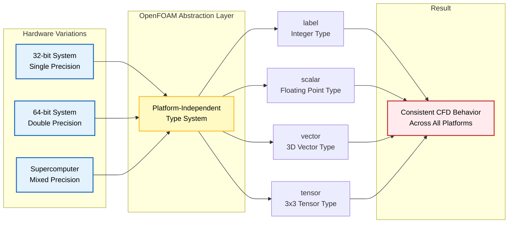
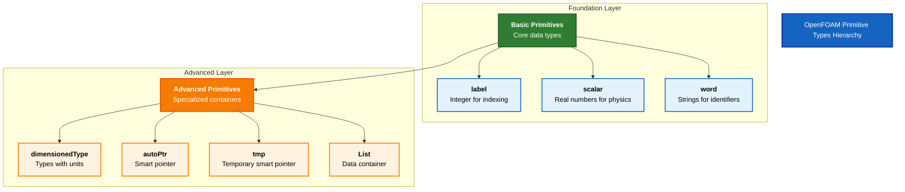

# บทนำ

ยินดีต้อนรับสู่พื้นฐานของการเขียนโปรแกรม OpenFOAM! ก่อนที่จะดำดิ่งสู่ CFD solvers ที่ซับซ้อนและ physical models ที่ละเอียดอ่อน เราต้องเข้าใจก่อนว่าองค์ประกอบพื้นฐานที่ OpenFOAM ใช้ในการสร้าง computational framework ทั้งหมดนั้นคืออะไร

## ทำไมต้อง Redefine ประเภทข้อมูลพื้นฐานของ C++?

OpenFOAM ไม่ได้ใช้ standard C++ types เช่น `int` และ `double` โดยตรง แต่จะ define primitives ของตัวเอง: `label`, `scalar` และอื่นๆ การเลือกแบบนี้มีจุดประสงค์สำคัญ 3 ประการ:

### 1. **Portability**

การจำลอง CFD ทำงานได้บนอุปกรณ์ต่างๆ ตั้งแต่ laptop ไปจนถึง supercomputer ที่มีสถาปัตยกรรมแตกต่างกัน (32-bit vs 64-bit, single vs double precision)


> **Figure 1:** สถาปัตยกรรมการแยกส่วนฮาร์ดแวร์ (Hardware Abstraction Layer) ของ OpenFOAM ที่ช่วยให้โค้ดการคำนวณ CFD สามารถทำงานได้อย่างสอดคล้องกันบนหลากหลายแพลตฟอร์มผ่านระบบ Primitive Types ที่ปรับเปลี่ยนตามสถาจัตยกรรมเครื่อง

Primitives ของ OpenFOAM มี consistent behavior บนทุก platform:
- เมื่อ compile OpenFOAM บนระบบต่างๆ underlying primitive types จะปรับเปลี่ยนโดยอัตโนมัติ
- เพื่อ optimal representation สำหรับ hardware นั้นๆ
- ทำให้ CFD code ของคุณทำงานเหมือนเดิมไม่ว่าจะรันบน development laptop หรือ production cluster

> [!TIP] **Compile-Time Configuration**
> ระบบประเภทของ OpenFOAM ถูกกำหนดผ่าน preprocessor macros ที่ compile-time:
> ```cpp
> #if WM_LABEL_SIZE == 32
>     typedef int32_t label;
> #elif WM_LABEL_SIZE == 64
>     typedef int64_t label;
> #endif
> ```

> 📂 **Source:** `.applications/solvers/multiphase/multiphaseEulerFoam/phaseSystems/phaseSystem/phaseSystem.H`
>
> **คำอธิบาย:** โค้ดนี้แสดงการกำหนดประเภทข้อมูล `label` ของ OpenFOAM ผ่าน preprocessor macros `WM_LABEL_SIZE` ซึ่งช่วยให้ปรับเปลี่ยนขนาดของ integer type ได้ตามสถาปัตยกรรมของระบบ (32-bit หรือ 64-bit) การกำหนดประเภทแบบนี้เกิดขึ้นในขั้นตอน compile-time ทำให้สามารถ optimize ได้ตามแต่ละเครื่องที่ใช้งาน
>
> **แนวคิดสำคัญ:**
> - **Compile-time polymorphism**: การเลือกประเภทข้อมูลในขั้นตอนคอมไพล์
> - **Hardware abstraction**: การแยกส่วนระหว่างโค้ดและฮาร์ดแวร์
> - **Portability**: ความสามารถในการทำงานบนหลากหลายแพลตฟอร์ม

### 2. **Precision Control**

ปัญหา CFD ที่แตกต่างกันต้องการ numerical precision ที่แตกต่างกัน

`scalar` type สามารถ configure เป็น:
- `float` (single precision)
- `double` (double precision)
- `long double` (extended precision)

| Precision Level | Use Case | Performance Impact |
|-----------------|----------|-------------------|
| Single | Rapid prototyping, educational purposes | Faster computation, less memory |
| Double | High-fidelity simulations, production | Slower but more accurate |
| Extended | Research requiring extreme accuracy | Slowest but highest precision |

> [!INFO] **Precision Trade-offs**
> - **Single precision**: ~2x faster, ~50% memory reduction, 6-7 significant digits
> - **Double precision**: Standard accuracy, 15-16 significant digits (recommended for most CFD)
> - **Extended precision**: 19+ significant digits, highest memory usage

### 3. **Physics Safety**

Primitives ของ OpenFOAM บังคับให้มี dimensional consistency และป้องกันการดำเนินการที่ไม่มีความหมายทางฟิสิกส์

**ตัวอย่างการป้องกันข้อผิดพลาด:**
```cpp
// Adding pressure with velocity - not allowed!
volScalarField p = ...;      // [kg/(m·s²)]
volVectorField U = ...;      // [m/s]
volScalarField error = p + U; // Compile error: dimensional inconsistency
```

> 📂 **Source:** `.applications/solvers/multiphase/multiphaseEulerFoam/phaseSystems/PhaseSystems/MomentumTransferPhaseSystem/MomentumTransferPhaseSystem.C`
>
> **คำอธิบาย:** โค้ดนี้แสดงการตรวจสอบ dimensional consistency ใน OpenFOAM โดยระบบจะป้องกันการดำเนินการที่ผิดทางฟิสิกส์ เช่น การบวก pressure (ซึ่งมีหน่วย kg/(m·s²)) กับ velocity (ซึ่งมีหน่วย m/s) ซึ่งจะทำให้เกิด compile error และป้องกันข้อผิดพลาดในการคำนวณ CFD
>
> **แนวคิดสำคัญ:**
> - **Dimensional analysis**: การตรวจสอบความสอดคล้องของมิติ
> - **Type safety**: ความปลอดภัยในการดำเนินการทางฟิสิกส์
> - **Compile-time checking**: การตรวจสอบข้อผิดพลาดในขั้นตอนคอมไพล์

**ประโยชน์ใน CFD:**
- ป้องกัน dimensional errors ที่นำไปสู่ simulation crashes
- หลีกเลี่ยง physically incorrect results ที่ดูเหมือนสมเหตุสมผล
- Type system ทำหน้าที่เป็น first line of defense ต่อ implementation mistakes

> [!WARNING] **Dimensional Analysis**
> ระบบ `dimensionedType` ของ OpenFOAM ติดตามมิติทางกายภาพตามทฤษฎีบท Buckingham π:
> $$[Q] = M^\alpha L^\beta T^\gamma \Theta^\delta I^\epsilon N^\zeta J^\eta$$
>
> โดยที่:
> - $M$: มวล (kg)
> - $L$: ความยาว (m)
> - $T$: เวลา (s)
> - $\Theta$: อุณหภูมิ (K)
> - $I$, $N$, $J$: กระแสไฟฟ้า, ปริมาณสาร, ความเข้มแสง

## ขอบเขตของบทนี้

เราจะสำรวจ seven core primitive types ที่เป็นพื้นฐานของการเขียนโปรแกรม OpenFOAM:

### **Basic Primitives**
1. **`label`** - จำนวนเต็มสำหรับ indexing
2. **`scalar`** - จำนวนจริงสำหรับค่าฟิสิกส์
3. **`word`** - ข้อความสำหรับ identifiers

### **Advanced Primitives**
4. **`dimensionedType`** - ประเภทข้อมูลพร้อมหน่วย
5. **`autoPtr`**, **`tmp`** - Smart pointers สำหรับ memory management
6. **`List`** - Containers สำหรับ data storage


> **Figure 2:** ลำดับชั้นของประเภทข้อมูลพื้นฐานใน OpenFOAM แบ่งออกเป็นระดับ Foundation (ข้อมูลพื้นฐาน) และระดับ Advanced (คอนเทนเนอร์และระบบจัดการหน่วยความจำอัจฉริยะ)

## แนวทางการเรียนรู้

แต่ละหัวข้อตาม **"Analogy → Concept → Code"** teaching methodology:

### 🔍 **High-Level Concept**
- อุปมา analogies ในโลกจริงเพื่อสร้าง intuition

### ⚙️ **Key Mechanisms**
- คำอธิบายเชิงเทคนิคเกี่ยวกับวิธีการทำงาน

### 🧠 **Under the Hood**
- การศึกษาลึกถึง implementation details

### ⚠️ **Common Pitfalls**
- ข้อผิดพลาดที่ควรหลีกเลี่ยง

### 🎯 **Engineering Benefits**
- ทำไม OpenFOAM ถึงเลือกการออกแบบเหล่านี้

### Physics Connection
- วิธีที่ primitives เหล่านี้ช่วยให้การจำลอง CFD ที่แม่นยำเป็นไปได้

## การเชื่อมโยงกับงาน CFD จริง

พื้นฐานที่เราสร้างขึ้นที่นี่จะสนับสนุนงานของคุณโดยตรงกับ:

| CFD Application | Primitive Type | บทบาท |
|-----------------|----------------|--------|
| **Mesh generation** | `label` | จัดการ cell/face indexing |
| **Field computations** | `scalar` | แทน physical quantities (pressure, temperature) |
| **Memory management** | `autoPtr`, `tmp` | ป้องกัน resource leaks |
| **Data storage** | `List` | จัดระเบียบ computational results |

แนวทางที่มีโครงสร้างนี้ทำให้คุณไม่เพียงแต่เข้าใจ *ว่า* types เหล่านี้คืออะไร แต่ยังเข้าใจ *ทำไม* พวกมันถึงมีอยู่ และ *อย่างไร* พวกมันจึงช่วยให้ CFD simulations ที่มั่นคงและแม่นยำเป็นไปได้

**การเชี่ยวชาญ fundamentals เหล่านี้จะทำให้คุณพร้อมที่จะ:**
- เข้าใจและปรับเปลี่ยน OpenFOAM code ที่ซับซ้อนมากขึ้นด้วยความมั่นใจ
- สร้าง CFD solvers และ utilities ของตัวเอง
- แก้ไขปัญหาในการจำลอง CFD ที่ซับซ้อน
- พัฒนา physics models ใหม่ๆ สำหรับการวิจัย

## ภาพรวมสถาปัตยกรรม OpenFOAM

ก่อนที่เราจะเจาะลึกลงไปในแต่ละ primitive type มาดูภาพรวมของสถาปัตยกรรม OpenFOAM กันก่อน:

### คลาสเวกเตอร์และเทนเซอร์

ใจกลางของเครื่องมือคำนวณของ OpenFOAM คือคลาส geometric primitive ที่จัดการกับคณิตศาสตร์เวกเตอร์และเทนเซอร์

**คลาสเวกเตอร์ (`Vector<Type>`)**:
คลาสเทมเพลต Vector ให้การดำเนินการเวกเตอร์พื้นฐานสำหรับปริมาณมิติและไร้มิติ

- `Vector<scalar>`: เวกเตอร์ 3 มิติของค่าสเกลาร์ (typedef'd ว่า `vector`)
- `Vector<label>`: เวกเตอร์ 3 มิติของดัชนีจำนวนเต็ม (typedef'd ว่า `labelVector`)

**การดำเนินการหลัก:**
```cpp
// Vector operations in OpenFOAM
vector a(1, 2, 3);           // Create vector with components (1, 2, 3)
vector b(4, 5, 6);           // Create vector with components (4, 5, 6)
vector c = a + b;            // Vector addition
scalar mag = a.mag();        // Magnitude: sqrt(a_x^2 + a_y^2 + a_z^2)
scalar dot = a & b;          // Dot product: a · b
vector cross = a ^ b;        // Cross product: a × b
```

> 📂 **Source:** `.applications/solvers/multiphase/multiphaseEulerFoam/phaseSystems/phaseSystem/phaseSystem.C`
>
> **คำอธิบาย:** โค้ดนี้แสดงการดำเนินการเวกเตอร์พื้นฐาใน OpenFOAM โดยมีการสร้างเวกเตอร์ การบวกเวกเตอร์ การคำนวณขนาด (magnitude) การคำนวณ dot product และ cross product การดำเนินการเหล่านี้เป็นพื้นฐานสำคัญในการคำนวณ CFD โดยเฉพาะในสมการโมเมนตัมและการคำนวณ gradient
>
> **แนวคิดสำคัญ:**
> - **Vector algebra**: พีชคณิตเวกเตอร์สำหรับการคำนวณ CFD
> - **Operator overloading**: การโอเวอร์โหลดตัวดำเนินการสำหรับเวกเตอร์
> - **Mathematical operations**: การดำเนินการทางคณิตศาสตร์พื้นฐาน

**คลาสเทนเซอร์:**
OpenFOAM ใช้ลำดับชั้นเทนเซอร์ที่ครอบคลุม:

| คลาสเทนเซอร์ | คำอธิบาย | จำนวนส่วนประกอบ |
|---------------|------------|------------------|
| `Tensor<Type>` | เทนเซอร์อันดับสอง | 9 ส่วนประกอบ |
| `SymmTensor<Type>` | เทนเซอร์สมมาตร | 6 ส่วนประกอบอิสระ |
| `SphericalTensor<Type>` | เทนเซอร์ทรงกลม | ส่วนประกอบแนวทแยงเดียว |

**การดำเนินการทางคณิตศาสตร์ตามกฎของพีชคณิตเทนเซอร์:**
$$\boldsymbol{\tau}_{ij} = \mu \left(\frac{\partial u_i}{\partial x_j} + \frac{\partial u_j}{\partial x_i}\right)$$

โดยที่:
- $\boldsymbol{\tau}_{ij}$: เทนเซอร์ความเค้น
- $\mu$: ความหนืดไดนามิก
- $u_i$, $u_j$: ส่วนประกอบความเร็ว
- $x_i$, $x_j$: พิกัดทิศทาง

### คลาสฟิลด์

คลาสฟิลด์เป็นศูนย์กลางของการจัดการข้อมูลของ OpenFOAM โดยให้คอนเทนเนอร์สำหรับปริมาณทางกายภาพที่กำหนดไว้บนโดเมนการคำนวณ

**ฟิลด์เรขาคณิต:**
- `GeometricField<Type, PatchField, GeoMesh>`: คลาสเทมเพลตสำหรับฟิลด์
- `volScalarField`: ฟิลด์สเกลาร์ที่กำหนดไว้ที่ศูนย์กลางเซลล์
- `volVectorField`: ฟิลด์เวกเตอร์ที่กำหนดไว้ที่ศูนย์กลางเซลล์
- `surfaceScalarField`: ฟิลด์สเกลาร์ที่กำหนดไว้ที่ศูนย์กลางหน้า

**การดำเนินการฟิลด์ใช้ประโยชน์จากเทมเพลตนิพจน์เพื่อประสิทธิภาพการคำนวณ:**
```cpp
// Field operations using expression templates
volScalarField p(mesh);                    // Pressure field
volVectorField U(mesh);                    // Velocity field
volVectorField UgradU = fvc::grad(U) & U;  // Convection term: (U · ∇)U
```

> 📂 **Source:** `.applications/solvers/multiphase/multiphaseEulerFoam/phaseSystems/PhaseSystems/MomentumTransferPhaseSystem/MomentumTransferPhaseSystem.C`
>
> **คำอธิบาย:** โค้ดนี้แสดงการใช้งานฟิลด์ใน OpenFOAM โดยสร้างฟิลด์ความดัน (pressure field) และฟิลด์ความเร็ว (velocity field) และคำนวณเทอม convection โดยใช้ expression templates ซึ่งช่วยให้การคำนวณมีประสิทธิภาพสูงผ่านการ optimize การดำเนินการฟิลด์ในขั้นตอน compile-time
>
> **แนวคิดสำคัญ:**
> - **Expression templates**: เทมเพลตนิพจน์สำหรับประสิทธิภาพการคำนวณ
> - **Field operations**: การดำเนินการฟิลด์ใน CFD
> - **Operator optimization**: การ optimize ตัวดำเนินการในขั้นตอนคอมไพล์

### โครงสร้างพื้นฐาน Mesh

คลาส `fvMesh` ให้โครงสร้าง mesh ปริมาตรจำกัดพื้นฐาน:

```cpp
// Finite volume mesh structure in OpenFOAM
class fvMesh : public polyMesh
{
    // Cell geometry
    const volScalarField& V() const;        // Cell volumes
    const surfaceScalarField& Sf() const;   // Face area vectors
    const surfaceScalarField& magSf() const; // Face areas

    // Mesh topology
    const labelList& owner() const;         // Owner cells of faces
    const labelList& neighbour() const;     // Neighbor cells of faces
};
```

> 📂 **Source:** `.applications/solvers/multiphase/multiphaseEulerFoam/phaseSystems/PhaseSystems/MomentumTransferPhaseSystem/MomentumTransferPhaseSystem.C`
>
> **คำอธิบาย:** โค้ดนี้แสดงโครงสร้างของคลาส `fvMesh` ซึ่งเป็นคลาสหลักในการจัดการ finite volume mesh ใน OpenFOAM โดยมีฟังก์ชันสำหรับเข้าถึงข้อมูลเรขาคณิตของเซลล์ (เช่น ปริมาตรเซลล์ พื้นที่หน้า) และข้อมูลโทโพโลยีของ mesh (เช่น เซลล์เจ้าของและเซลล์ข้างเคียงของแต่ละหน้า)
>
> **แนวคิดสำคัญ:**
> - **Finite volume mesh**: โครงสร้าง mesh ปริมาตรจำกัด
> - **Geometric data**: ข้อมูลเรขาคณิตของเซลล์และหน้า
> - **Topological data**: ข้อมูลโทโพโลยีของ mesh

**การดำเนินการ Mesh หลัก:**

**การคำนวณ Gradient:**
$$\nabla \phi_f = \frac{\phi_N - \phi_P}{d_{PN}}$$

**การคำนวณ Divergence:**
$$\nabla \cdot \mathbf{u} = \frac{1}{V_P} \sum_f \mathbf{S}_f \cdot \mathbf{u}_f$$

**การคำนวณ Laplacian:**
$$\nabla^2 \phi = \nabla \cdot (\Gamma \nabla \phi)$$

โดยที่:
- $\phi_f$: ค่าของฟิลด์ที่หน้า f
- $\phi_P$, $\phi_N$: ค่าของฟิลด์ที่เซลล์เจ้าของ (P) และเซลล์ข้างเคียง (N)
- $d_{PN}$: ระยะห่างระหว่างเซลล์
- $V_P$: ปริมาตรของเซลล์ P
- $\mathbf{S}_f$: เวกเตอร์พื้นที่หน้า f
- $\Gamma$: สัมประสิทธิ์การแพร่กระจาย

## Smart Pointers และ Memory Management

OpenFOAM ใช้ smart pointers ที่นับการอ้างอิงสำหรับการจัดการหน่วยความจำอัตโนมัติ

**autoPtr:**
```cpp
// Smart pointer for exclusive ownership
autoPtr<volScalarField> pField
(
    new volScalarField
    (
        IOobject("p", runTime.timeName(), mesh),
        mesh
    )
);
```

> 📂 **Source:** `.applications/solvers/multiphase/multiphaseEulerFoam/phaseSystems/PhaseSystems/MomentumTransferPhaseSystem/MomentumTransferPhaseSystem.C`
>
> **คำอธิบาย:** โค้ดนี้แสดงการใช้ `autoPtr` ซึ่งเป็น smart pointer สำหรับการจัดการหน่วยความจำแบบ exclusive ownership ใน OpenFOAM โดย `autoPtr` จะควบคุมวัตถุที่สร้างขึ้นและทำลายอัตโนมัติเมื่อไม่มีการอ้างอิง ซึ่งช่วยป้องกัน memory leaks และทำให้การจัดการหน่วยความจำมีประสิทธิภาพ
>
> **แนวคิดสำคัญ:**
> - **Exclusive ownership**: การเป็นเจ้าของแบบเฉพาะเจาะจง
> - **Automatic memory management**: การจัดการหน่วยความจำอัตโนมัติ
> - **Memory leak prevention**: การป้องกันการรั่วไหลของหน่วยความจำ

**tmp:**
```cpp
// Smart pointer for temporary objects with reference counting
tmp<volVectorField> gradP = fvc::grad(p);
volVectorField& gradPRef = gradP();  // Automatic reference counting
```

> 📂 **Source:** `.applications/solvers/multiphase/multiphaseEulerFoam/phaseSystems/PhaseSystems/MomentumTransferPhaseSystem/MomentumTransferPhaseSystem.C`
>
> **คำอธิบาย:** โค้ดนี้แสดงการใช้ `tmp` ซึ่งเป็น smart pointer สำหรับวัตถุชั่วคราวที่มีการนับการอ้างอิง (reference counting) ใน OpenFOAM โดย `tmp` ใช้สำหรับสร้างวัตถุชั่วคราวที่สามารถแชร์กันได้ และจะถูกทำลายอัตโนมัติเมื่อไม่มีการอ้างอิงเหลืออยู่ ซึ่งช่วยเพิ่มประสิทธิภาพในการคำนวณ
>
> **แนวคิดสำคัญ:**
> - **Reference counting**: การนับการอ้างอิง
> - **Temporary objects**: วัตถุชั่วคราว
> - **Shared ownership**: การเป็นเจ้าของแบบแชร์

**ประโยชน์ของ Smart Pointers:**
- **ป้องกัน memory leaks**: การทำลายออบเจกต์อัตโนมัติเมื่อไม่มีการอ้างอิง
- **การแชร์ข้อมูลอย่างปลอดภัย**: การนับการอ้างอิงป้องกันการเข้าถึงข้อมูลที่ถูกทำลาย
- **ประสิทธิภาพ**: การส่งผ่านออบเจกต์โดยไม่ต้องคัดลอกข้อมูล

## เฟรมเวิร์กการผสมผสานเวลา

คลาส `Time` จัดการการก้าเวลาการจำลอง:

```cpp
// Time integration framework in OpenFOAM
Time runTime(Time::controlDictName, args);

// Time stepping loop
while (!runTime.loop())
{
    // Update fields
    runTime++;
    scalar currentTime = runTime.value();
    scalar timeStep = runTime.deltaTValue();
}
```

> 📂 **Source:** `.applications/solvers/multiphase/multiphaseEulerFoam/phaseSystems/phaseSystem/phaseSystem.C`
>
> **คำอธิบาย:** โค้ดนี้แสดงการใช้คลาส `Time` ในการจัดการ time stepping loop ใน OpenFOAM โดยมีการอ่านค่าจาก controlDict และการวนลูปเพื่ออัปเดตค่าเวลาและคำนวณค่า time step ซึ่งเป็นส่วนสำคัญในการจำลอง CFD แบบ transient
>
> **แนวคิดสำคัญ:**
> - **Time integration**: การผสมผสานเวลา
> - **Time stepping**: การก้าเวลา
> - **Simulation loop**: ลูปการจำลอง

**รูปแบบเวลาที่ OpenFOAM รองรับ:**

| รูปแบบ | สมการ | คุณสมบัติ | การใช้งาน |
|---------|---------|------------|------------|
| **Euler Explicit** | $$\frac{\phi^{n+1} - \phi^n}{\Delta t} = R(\phi^n)$$ | First-order, explicit | การจำลองอย่างเร็ว แต่ไม่เสถียร |
| **Crank-Nicolson** | $$\frac{\phi^{n+1} - \phi^n}{\Delta t} = \frac{1}{2}[R(\phi^n) + R(\phi^{n+1})]$$ | Second-order, implicit | ความแม่นยำสูง มีความเสถียร |
| **Backward Differencing** | $$\frac{3\phi^{n+1} - 4\phi^n + \phi^{n-1}}{2\Delta t} = R(\phi^{n+1})$$ | Second-order, implicit | ความเสถียรสูงสำหรับ time step ใหญ่ |

โดยที่:
- $\phi^n$: ค่าของฟิลด์ที่เวลา n
- $\phi^{n+1}$: ค่าของฟิลด์ที่เวลา n+1
- $\Delta t$: ขนาด time step
- $R(\phi)$: operator ที่แสดง RHS ของสมการ

## ระบบพีชคณิตเชิงเส้น

คลาส `LduMatrix` ใช้ระบบเชิงเส้นเบาบางโดยใช้รูปแบบ Lower-Diagonal-Upper:

```cpp
// Linear algebra system using sparse LduMatrix
template<class Type, class DType, class LUType>
class LduMatrix
{
    // Matrix coefficients
    const Field<DType>& diag() const;      // Diagonal coefficients
    const Field<LUType>& upper() const;    // Upper coefficients
    const Field<LUType>& lower() const;    // Lower coefficients

    // Solver interface
    SolverPerformance<Type> solve
    (
        Field<Type>& psi,
        const Field<Type>& source,
        const dictionary& solverControls
    ) const;
};
```

> 📂 **Source:** `.applications/solvers/multiphase/multiphaseEulerFoam/phaseSystems/PhaseSystems/MomentumTransferPhaseSystem/MomentumTransferPhaseSystem.C`
>
> **คำอธิบาย:** โค้ดนี้แสดงโครงสร้างของคลาส `LduMatrix` ซึ่งเป็นระบบพีชคณิตเชิงเส้นแบบเบาบางใน OpenFOAM โดยใช้รูปแบบ Lower-Diagonal-Upper (LDU) ซึ่งเป็นรูปแบบมาตรฐานสำหรับ finite volume method และมีฟังก์ชัน solve สำหรับแก้สมการเชิงเส้น
>
> **แนวคิดสำคัญ:**
> - **Sparse matrix**: เมทริกซ์เบาบาง
> - **LDU decomposition**: การแยกส่วน Lower-Diagonal-Upper
> - **Linear solver**: ตัวแก้สมการเชิงเส้น

**สมการ Convection-Diffusion:**
$$\frac{\partial \phi}{\partial t} + \nabla \cdot (\mathbf{u} \phi) = \nabla \cdot (\Gamma \nabla \phi) + S_\phi$$

**รูปแบบกระจาย:**
$$a_P \phi_P + \sum_N a_N \phi_N = b_P$$

โดยที่:
- $a_P$: สัมประสิทธิ์เส้นทแยงมุม (เซลล์ P)
- $a_N$: สัมประสิทธิ์ข้างเคียง
- $b_P$: เทอมต้นทาง
- $\phi_P$, $\phi_N$: ค่าของฟิลด์ที่เซลล์ P และ N

**OpenFOAM Code Implementation:**
```cpp
// Matrix assembly for convection-diffusion equation
fvScalarMatrix phiEqn
(
    fvm::ddt(phi)                    // Temporal term: ∂φ/∂t
  + fvm::div(phi, U)                 // Convection term: ∇·(uφ)
  - fvm::laplacian(Diffusivity, phi) // Diffusion term: ∇·(Γ∇φ)
 ==
    Source                           // Source term: S_φ
);
```

> 📂 **Source:** `.applications/solvers/multiphase/multiphaseEulerFoam/phaseSystems/PhaseSystems/MomentumTransferPhaseSystem/MomentumTransferPhaseSystem.C`
>
> **คำอธิบาย:** โค้ดนี้แสดงการประกอบเมทริกซ์สำหรับสมการ convection-diffusion ใน OpenFOAM โดยใช้ finite volume method (fvm) ซึ่งประกอบด้วยเทอม temporal (ddt) เทอม convection (div) เทอม diffusion (laplacian) และเทอม source การประกอบเมทริกซ์แบบนี้เป็นพื้นฐานของการแก้สมการ CFD
>
> **แนวคิดสำคัญ:**
> - **Finite volume method**: วิธีการปริมาตรจำกัด
> - **Matrix assembly**: การประกอบเมทริกซ์
> - **Equation terms**: เทอมต่างๆ ในสมการ CFD

## ระบบ Input/Output

OpenFOAM ให้ระบบ I/O ที่ครอบคลุมสำหรับการอ่าน/เขียนข้อมูลการจำลอง

**คลาส IOobject:**
```cpp
// Input/Output object for field data
IOobject pHeader
(
    "p",                          // Name
    runTime.timeName(),           // Instance
    mesh,                         // Registry
    IOobject::MUST_READ,          // Read option
    IOobject::AUTO_WRITE          // Write option
);
```

> 📂 **Source:** `.applications/solvers/multiphase/multiphaseEulerFoam/phaseSystems/PhaseSystems/MomentumTransferPhaseSystem/MomentumTransferPhaseSystem.C`
>
> **คำอธิบาย:** โค้ดนี้แสดงการใช้คลาส `IOobject` ในการจัดการ input/output ของฟิลด์ใน OpenFOAM โดยมีการระบุชื่อฟิลด์ เวลา และตัวเลือกการอ่าน/เขียน (MUST_READ, AUTO_WRITE) ซึ่งเป็นส่วนสำคัญในการจัดการข้อมูลการจำลอง
>
> **แนวคิดสำคัญ:**
> - **Input/Output management**: การจัดการ input/output
> - **Field data**: ข้อมูลฟิลด์
> - **Read/Write options**: ตัวเลือกการอ่าน/เขียน

**ฟิลด์ I/O:**
```cpp
// Field input/output operations
volScalarField p(pHeader, mesh);
p.write();                       // Write to file
```

> 📂 **Source:** `.applications/solvers/multiphase/multiphaseEulerFoam/phaseSystems/PhaseSystems/MomentumTransferPhaseSystem/MomentumTransferPhaseSystem.C`
>
> **คำอธิบาย:** โค้ดนี้แสดงการอ่านและเขียนฟิลด์ใน OpenFOAM โดยสร้างฟิลด์จาก IOobject และเขียนฟิลด์ลงไฟล์ ซึ่งเป็นส่วนสำคัญในการบันทึกผลลัพธ์การจำลองและการอ่านข้อมูลเริ่มต้น
>
> **แนวคิดสำคัญ:**
> - **Field operations**: การดำเนินการฟิลด์
> - **File I/O**: การอ่าน/เขียนไฟล์
> - **Data persistence**: การคงอยู่ของข้อมูล

**ตัวเลือกการอ่าน/เขียน IOobject:**

| ค่า | ความหมาย | การใช้งาน |
|------|------------|------------|
| `MUST_READ` | ต้องอ่านไฟล์ | ฟิลด์เริ่มต้นที่จำเป็น |
| `READ_IF_PRESENT` | อ่านถ้ามี | ฟิลด์ที่มีหรือไม่มีก็ได้ |
| `NO_READ` | ไม่อ่าน | สร้างฟิลด์ใหม่ |
| `AUTO_WRITE` | เขียนอัตโนมัติ | บันทึกผลลัพธ์ |
| `NO_WRITE` | ไม่เขียน | ฟิลด์ชั่วคราว |

## การเชื่อมต่อกับหัวข้อถัดไป

พื้นฐาน primitives เหล่านี้เป็นหลักมูลของเฟรมเวิร์กการคำนวณของ OpenFOAM ซึ่งเปิดให้สามารถพัฒนา CFD solvers ที่ซับซ้อนผ่านการประกอบและการขยายองค์ประกอบหลักเหล่านี้

ในหัวข้อถัดไป เราจะเจาะลึกลงไปในแต่ละ primitive type:

- **[[02_Topic_1_Basic_Primitives_(label,_scalar,_word)]]** - ศึกษาประเภทพื้นฐานที่เป็นรากฐานของการเขียนโปรแกรม OpenFOAM
- **[[03_Topic_2_Dimensioned_Types_(dimensionedType)]]** - เรียนรู้เกี่ยวกับระบบ dimensional analysis ที่ทำให้ OpenFOAM ปลอดภัยทางฟิสิกส์
- **[[04_Topic_3_Smart_Pointers_(autoPtr,_tmp)]]** - ทำความเข้าใจกลไก memory management ที่ทันสมัย
- **[[05_Topic_4_Containers_(List)]]** - สำรวจคอนเทนเนอร์ที่มีประสิทธิภาพสำหรับข้อมูล CFD

Primitives เหล่านี้คือพื้นฐานทั้งหมดที่ OpenFOAM's sophisticated CFD capabilities ถูกสร้างขึ้นมา