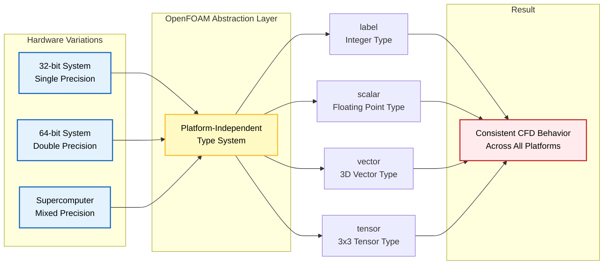
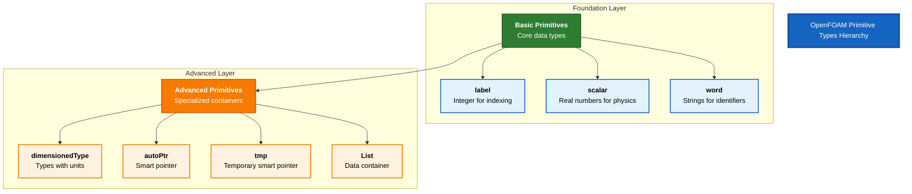

# บทนำ

ยินดีต้อนรับสู่พื้นฐานของการเขียนโปรแกรม OpenFOAM! ก่อนที่จะดำดิ่งสู่ CFD solvers ที่ซับซ้อนและ physical models ที่ละเอียดอ่อน เราต้องเข้าใจก่อนว่าองค์ประกอบพื้นฐานที่ OpenFOAM ใช้ในการสร้าง computational framework ทั้งหมดนั้นคืออะไร

## ทำไมต้อง Redefine ประเภทข้อมูลพื้นฐานของ C++?

OpenFOAM ไม่ได้ใช้ standard C++ types เช่น `int` และ `double` โดยตรง แต่จะ define primitives ของตัวเอง: `label`, `scalar` และอื่นๆ การเลือกแบบนี้มีจุดประสงค์สำคัญ 3 ประการ:

### 1. **Portability**

การจำลอง CFD ทำงานได้บนอุปกรณ์ต่างๆ ตั้งแต่ laptop ไปจนถึง supercomputer ที่มีสถาปัตยกรรมแตกต่างกัน (32-bit vs 64-bit, single vs double precision)



Primitives ของ OpenFOAM มี consistent behavior บนทุก platform:
- เมื่อ compile OpenFOAM บนระบบต่างๆ underlying primitive types จะปรับเปลี่ยนโดยอัตโนมัติ
- เพื่อ optimal representation สำหรับ hardware นั้นๆ
- ทำให้ CFD code ของคุณทำงานเหมือนเดิมไม่ว่าจะรันบน development laptop หรือ production cluster

> [!TIP] **Compile-Time Configuration**
> ระบบประเภทของ OpenFOAM ถูกกำหนดผ่าน preprocessor macros ที่ compile-time:
> ```cpp
> #if WM_LABEL_SIZE == 32
>     typedef int32_t label;
> #elif WM_LABEL_SIZE == 64
>     typedef int64_t label;
> #endif
> ```

### 2. **Precision Control**

ปัญหา CFD ที่แตกต่างกันต้องการ numerical precision ที่แตกต่างกัน

`scalar` type สามารถ configure เป็น:
- `float` (single precision)
- `double` (double precision)
- `long double` (extended precision)

| Precision Level | Use Case | Performance Impact |
|-----------------|----------|-------------------|
| Single | Rapid prototyping, educational purposes | Faster computation, less memory |
| Double | High-fidelity simulations, production | Slower but more accurate |
| Extended | Research requiring extreme accuracy | Slowest but highest precision |

> [!INFO] **Precision Trade-offs**
> - **Single precision**: ~2x faster, ~50% memory reduction, 6-7 significant digits
> - **Double precision**: Standard accuracy, 15-16 significant digits (recommended for most CFD)
> - **Extended precision**: 19+ significant digits, highest memory usage

### 3. **Physics Safety**

Primitives ของ OpenFOAM บังคับให้มี dimensional consistency และป้องกันการดำเนินการที่ไม่มีความหมายทางฟิสิกส์

**ตัวอย่างการป้องกันข้อผิดพลาด:**
```cpp
// การบวก pressure กับ velocity - ไม่ได้รับอนุญาต!
volScalarField p = ...;      // [kg/(m·s²)]
volVectorField U = ...;      // [m/s]
volScalarField error = p + U; // Compile error: dimensional inconsistency
```

**ประโยชน์ใน CFD:**
- ป้องกัน dimensional errors ที่นำไปสู่ simulation crashes
- หลีกเลี่ยง physically incorrect results ที่ดูเหมือนสมเหตุสมผล
- Type system ทำหน้าที่เป็น first line of defense ต่อ implementation mistakes

> [!WARNING] **Dimensional Analysis**
> ระบบ `dimensionedType` ของ OpenFOAM ติดตามมิติทางกายภาพตามทฤษฎีบท Buckingham π:
> $$[Q] = M^\alpha L^\beta T^\gamma \Theta^\delta I^\epsilon N^\zeta J^\eta$$
>
> โดยที่:
> - $M$: มวล (kg)
> - $L$: ความยาว (m)
> - $T$: เวลา (s)
> - $\Theta$: อุณหภูมิ (K)
> - $I$, $N$, $J$: กระแสไฟฟ้า, ปริมาณสาร, ความเข้มแสง

## ขอบเขตของบทนี้

เราจะสำรวจ seven core primitive types ที่เป็นพื้นฐานของการเขียนโปรแกรม OpenFOAM:

### **Basic Primitives**
1. **`label`** - จำนวนเต็มสำหรับ indexing
2. **`scalar`** - จำนวนจริงสำหรับค่าฟิสิกส์
3. **`word`** - ข้อความสำหรับ identifiers

### **Advanced Primitives**
4. **`dimensionedType`** - ประเภทข้อมูลพร้อมหน่วย
5. **`autoPtr`**, **`tmp`** - Smart pointers สำหรับ memory management
6. **`List`** - Containers สำหรับ data storage



## แนวทางการเรียนรู้

แต่ละหัวข้อตาม **"Analogy → Concept → Code"** teaching methodology:

### 🔍 **High-Level Concept**
- อุปมา analogies ในโลกจริงเพื่อสร้าง intuition

### ⚙️ **Key Mechanisms**
- คำอธิบายเชิงเทคนิคเกี่ยวกับวิธีการทำงาน

### 🧠 **Under the Hood**
- การศึกษาลึกถึง implementation details

### ⚠️ **Common Pitfalls**
- ข้อผิดพลาดที่ควรหลีกเลี่ยง

### 🎯 **Engineering Benefits**
- ทำไม OpenFOAM ถึงเลือกการออกแบบเหล่านี้

### Physics Connection
- วิธีที่ primitives เหล่านี้ช่วยให้การจำลอง CFD ที่แม่นยำเป็นไปได้

## การเชื่อมโยงกับงาน CFD จริง

พื้นฐานที่เราสร้างขึ้นที่นี่จะสนับสนุนงานของคุณโดยตรงกับ:

| CFD Application | Primitive Type | บทบาท |
|-----------------|----------------|--------|
| **Mesh generation** | `label` | จัดการ cell/face indexing |
| **Field computations** | `scalar` | แทน physical quantities (pressure, temperature) |
| **Memory management** | `autoPtr`, `tmp` | ป้องกัน resource leaks |
| **Data storage** | `List` | จัดระเบียบ computational results |

แนวทางที่มีโครงสร้างนี้ทำให้คุณไม่เพียงแต่เข้าใจ *ว่า* types เหล่านี้คืออะไร แต่ยังเข้าใจ *ทำไม* พวกมันถึงมีอยู่ และ *อย่างไร* พวกมันจึงช่วยให้ CFD simulations ที่มั่นคงและแม่นยำเป็นไปได้

**การเชี่ยวชาญ fundamentals เหล่านี้จะทำให้คุณพร้อมที่จะ:**
- เข้าใจและปรับเปลี่ยน OpenFOAM code ที่ซับซ้อนมากขึ้นด้วยความมั่นใจ
- สร้าง CFD solvers และ utilities ของตัวเอง
- แก้ไขปัญหาในการจำลอง CFD ที่ซับซ้อน
- พัฒนา physics models ใหม่ๆ สำหรับการวิจัย

## ภาพรวมสถาปัตยกรรม OpenFOAM

ก่อนที่เราจะเจาะลึกลงไปในแต่ละ primitive type มาดูภาพรวมของสถาปัตยกรรม OpenFOAM กันก่อน:

### คลาสเวกเตอร์และเทนเซอร์

ใจกลางของเครื่องมือคำนวณของ OpenFOAM คือคลาส geometric primitive ที่จัดการกับคณิตศาสตร์เวกเตอร์และเทนเซอร์

**คลาสเวกเตอร์ (`Vector<Type>`)**:
คลาสเทมเพลต Vector ให้การดำเนินการเวกเตอร์พื้นฐานสำหรับปริมาณมิติและไร้มิติ

- `Vector<scalar>`: เวกเตอร์ 3 มิติของค่าสเกลาร์ (typedef'd ว่า `vector`)
- `Vector<label>`: เวกเตอร์ 3 มิติของดัชนีจำนวนเต็ม (typedef'd ว่า `labelVector`)

**การดำเนินการหลัก:**
```cpp
vector a(1, 2, 3);
vector b(4, 5, 6);
vector c = a + b;          // การบวกเวกเตอร์
scalar mag = a.mag();      // ขนาด: $\sqrt{a_x^2 + a_y^2 + a_z^2}$
scalar dot = a & b;        // ผลคูณจุด: $\vec{a} \cdot \vec{b}$
vector cross = a ^ b;      // ผลคูณไขว้: $\vec{a} \times \vec{b}$
```

**คลาสเทนเซอร์:**
OpenFOAM ใช้ลำดับชั้นเทนเซอร์ที่ครอบคลุม:

| คลาสเทนเซอร์ | คำอธิบาย | จำนวนส่วนประกอบ |
|---------------|------------|------------------|
| `Tensor<Type>` | เทนเซอร์อันดับสอง | 9 ส่วนประกอบ |
| `SymmTensor<Type>` | เทนเซอร์สมมาตร | 6 ส่วนประกอบอิสระ |
| `SphericalTensor<Type>` | เทนเซอร์ทรงกลม | ส่วนประกอบแนวทแยงเดียว |

**การดำเนินการทางคณิตศาสตร์ตามกฎของพีชคณิตเทนเซอร์:**
$$\boldsymbol{\tau}_{ij} = \mu \left(\frac{\partial u_i}{\partial x_j} + \frac{\partial u_j}{\partial x_i}\right)$$

โดยที่:
- $\boldsymbol{\tau}_{ij}$: เทนเซอร์ความเค้น
- $\mu$: ความหนืดไดนามิก
- $u_i$, $u_j$: ส่วนประกอบความเร็ว
- $x_i$, $x_j$: พิกัดทิศทาง

### คลาสฟิลด์

คลาสฟิลด์เป็นศูนย์กลางของการจัดการข้อมูลของ OpenFOAM โดยให้คอนเทนเนอร์สำหรับปริมาณทางกายภาพที่กำหนดไว้บนโดเมนการคำนวณ

**ฟิลด์เรขาคณิต:**
- `GeometricField<Type, PatchField, GeoMesh>`: คลาสเทมเพลตสำหรับฟิลด์
- `volScalarField`: ฟิลด์สเกลาร์ที่กำหนดไว้ที่ศูนย์กลางเซลล์
- `volVectorField`: ฟิลด์เวกเตอร์ที่กำหนดไว้ที่ศูนย์กลางเซลล์
- `surfaceScalarField`: ฟิลด์สเกลาร์ที่กำหนดไว้ที่ศูนย์กลางหน้า

**การดำเนินการฟิลด์ใช้ประโยชน์จากเทมเพลตนิพจน์เพื่อประสิทธิภาพการคำนวณ:**
```cpp
volScalarField p(mesh);                    // ฟิลด์ความดัน
volVectorField U(mesh);                    // ฟิลด์ความเร็ว
volVectorField UgradU = fvc::grad(U) & U;  // เทอม convection: $(\mathbf{U} \cdot \nabla)\mathbf{U}$
```

### โครงสร้างพื้นฐาน Mesh

คลาส `fvMesh` ให้โครงสร้าง mesh ปริมาตรจำกัดพื้นฐาน:

```cpp
class fvMesh : public polyMesh
{
    // เรขาคณิตเซลล์
    const volScalarField& V() const;        // ปริมาตรเซลล์
    const surfaceScalarField& Sf() const;   // เวกเตอร์พื้นที่หน้า
    const surfaceScalarField& magSf() const; // พื้นที่หน้า

    // โทโพโลยี mesh
    const labelList& owner() const;         // เซลล์เจ้าของหน้า
    const labelList& neighbour() const;     // เซลล์ข้างเคียงหน้า
};
```

**การดำเนินการ Mesh หลัก:**

**การคำนวณ Gradient:**
$$\nabla \phi_f = \frac{\phi_N - \phi_P}{d_{PN}}$$

**การคำนวณ Divergence:**
$$\nabla \cdot \mathbf{u} = \frac{1}{V_P} \sum_f \mathbf{S}_f \cdot \mathbf{u}_f$$

**การคำนวณ Laplacian:**
$$\nabla^2 \phi = \nabla \cdot (\Gamma \nabla \phi)$$

โดยที่:
- $\phi_f$: ค่าของฟิลด์ที่หน้า f
- $\phi_P$, $\phi_N$: ค่าของฟิลด์ที่เซลล์เจ้าของ (P) และเซลล์ข้างเคียง (N)
- $d_{PN}$: ระยะห่างระหว่างเซลล์
- $V_P$: ปริมาตรของเซลล์ P
- $\mathbf{S}_f$: เวกเตอร์พื้นที่หน้า f
- $\Gamma$: สัมประสิทธิ์การแพร่กระจาย

## Smart Pointers และ Memory Management

OpenFOAM ใช้ smart pointers ที่นับการอ้างอิงสำหรับการจัดการหน่วยความจำอัตโนมัติ

**autoPtr:**
```cpp
autoPtr<volScalarField> pField
(
    new volScalarField
    (
        IOobject("p", runTime.timeName(), mesh),
        mesh
    )
);
```

**tmp:**
```cpp
tmp<volVectorField> gradP = fvc::grad(p);
volVectorField& gradPRef = gradP();  // การนับการอ้างอิงอัตโนมัติ
```

**ประโยชน์ของ Smart Pointers:**
- **ป้องกัน memory leaks**: การทำลายออบเจกต์อัตโนมัติเมื่อไม่มีการอ้างอิง
- **การแชร์ข้อมูลอย่างปลอดภัย**: การนับการอ้างอิงป้องกันการเข้าถึงข้อมูลที่ถูกทำลาย
- **ประสิทธิภาพ**: การส่งผ่านออบเจกต์โดยไม่ต้องคัดลอกข้อมูล

## เฟรมเวิร์กการผสมผสานเวลา

คลาส `Time` จัดการการก้าเวลาการจำลอง:

```cpp
Time runTime(Time::controlDictName, args);

// การก้าเวลา
while (!runTime.loop())
{
    // อัปเดตฟิลด์
    runTime++;
    scalar currentTime = runTime.value();
    scalar timeStep = runTime.deltaTValue();
}
```

**รูปแบบเวลาที่ OpenFOAM รองรับ:**

| รูปแบบ | สมการ | คุณสมบัติ | การใช้งาน |
|---------|---------|------------|------------|
| **Euler Explicit** | $$\frac{\phi^{n+1} - \phi^n}{\Delta t} = R(\phi^n)$$ | First-order, explicit | การจำลองอย่างเร็ว แต่ไม่เสถียร |
| **Crank-Nicolson** | $$\frac{\phi^{n+1} - \phi^n}{\Delta t} = \frac{1}{2}[R(\phi^n) + R(\phi^{n+1})]$$ | Second-order, implicit | ความแม่นยำสูง มีความเสถียร |
| **Backward Differencing** | $$\frac{3\phi^{n+1} - 4\phi^n + \phi^{n-1}}{2\Delta t} = R(\phi^{n+1})$$ | Second-order, implicit | ความเสถียรสูงสำหรับ time step ใหญ่ |

โดยที่:
- $\phi^n$: ค่าของฟิลด์ที่เวลา n
- $\phi^{n+1}$: ค่าของฟิลด์ที่เวลา n+1
- $\Delta t$: ขนาด time step
- $R(\phi)$: operator ที่แสดง RHS ของสมการ

## ระบบพีชคณิตเชิงเส้น

คลาส `LduMatrix` ใช้ระบบเชิงเส้นเบาบางโดยใช้รูปแบบ Lower-Diagonal-Upper:

```cpp
template<class Type, class DType, class LUType>
class LduMatrix
{
    // สัมประสิทธิ์เมทริกซ์
    const Field<DType>& diag() const;      // เส้นทแยงมุม
    const Field<LUType>& upper() const;    // ส่วนบน
    const Field<LUType>& lower() const;    // ส่วนล่าง

    // อินเทอร์เฟซ solver
    SolverPerformance<Type> solve
    (
        Field<Type>& psi,
        const Field<Type>& source,
        const dictionary& solverControls
    ) const;
};
```

**สมการ Convection-Diffusion:**
$$\frac{\partial \phi}{\partial t} + \nabla \cdot (\mathbf{u} \phi) = \nabla \cdot (\Gamma \nabla \phi) + S_\phi$$

**รูปแบบกระจาย:**
$$a_P \phi_P + \sum_N a_N \phi_N = b_P$$

โดยที่:
- $a_P$: สัมประสิทธิ์เส้นทแยงมุม (เซลล์ P)
- $a_N$: สัมประสิทธิ์ข้างเคียง
- $b_P$: เทอมต้นทาง
- $\phi_P$, $\phi_N$: ค่าของฟิลด์ที่เซลล์ P และ N

**OpenFOAM Code Implementation:**
```cpp
// การประกอบเมทริกซ์สำหรับสมการ convection-diffusion
fvScalarMatrix phiEqn
(
    fvm::ddt(phi)                    // เทอม temporal: ∂φ/∂t
  + fvm::div(phi, U)                 // เทอม convection: ∇·(uφ)
  - fvm::laplacian(Diffusivity, phi) // เทอม diffusion: ∇·(Γ∇φ)
 ==
    Source                           // เทอมต้นทาง: S_φ
);
```

## ระบบ Input/Output

OpenFOAM ให้ระบบ I/O ที่ครอบคลุมสำหรับการอ่าน/เขียนข้อมูลการจำลอง

**คลาส IOobject:**
```cpp
IOobject pHeader
(
    "p",                          // ชื่อ
    runTime.timeName(),           // ตัวอย่าง
    mesh,                         // Registry
    IOobject::MUST_READ,          // ตัวเลือกการอ่าน
    IOobject::AUTO_WRITE          // ตัวเลือกการเขียน
);
```

**ฟิลด์ I/O:**
```cpp
volScalarField p(pHeader, mesh);
p.write();                       // เขียนไปยังไฟล์
```

**ตัวเลือกการอ่าน/เขียน IOobject:**

| ค่า | ความหมาย | การใช้งาน |
|------|------------|------------|
| `MUST_READ` | ต้องอ่านไฟล์ | ฟิลด์เริ่มต้นที่จำเป็น |
| `READ_IF_PRESENT` | อ่านถ้ามี | ฟิลด์ที่มีหรือไม่มีก็ได้ |
| `NO_READ` | ไม่อ่าน | สร้างฟิลด์ใหม่ |
| `AUTO_WRITE` | เขียนอัตโนมัติ | บันทึกผลลัพธ์ |
| `NO_WRITE` | ไม่เขียน | ฟิลด์ชั่วคราว |

## การเชื่อมต่อกับหัวข้อถัดไป

พื้นฐาน primitives เหล่านี้เป็นหลักมูลของเฟรมเวิร์กการคำนวณของ OpenFOAM ซึ่งเปิดให้สามารถพัฒนา CFD solvers ที่ซับซ้อนผ่านการประกอบและการขยายองค์ประกอบหลักเหล่านี้

ในหัวข้อถัดไป เราจะเจาะลึกลงไปในแต่ละ primitive type:

- **[[02_Topic_1_Basic_Primitives_(label,_scalar,_word)]]** - ศึกษาประเภทพื้นฐานที่เป็นรากฐานของการเขียนโปรแกรม OpenFOAM
- **[[03_Topic_2_Dimensioned_Types_(dimensionedType)]]** - เรียนรู้เกี่ยวกับระบบ dimensional analysis ที่ทำให้ OpenFOAM ปลอดภัยทางฟิสิกส์
- **[[04_Topic_3_Smart_Pointers_(autoPtr,_tmp)]]** - ทำความเข้าใจกลไก memory management ที่ทันสมัย
- **[[05_Topic_4_Containers_(List)]]** - สำรวจคอนเทนเนอร์ที่มีประสิทธิภาพสำหรับข้อมูล CFD

Primitives เหล่านี้คือพื้นฐานทั้งหมดที่ OpenFOAM's sophisticated CFD capabilities ถูกสร้างขึ้นมา
