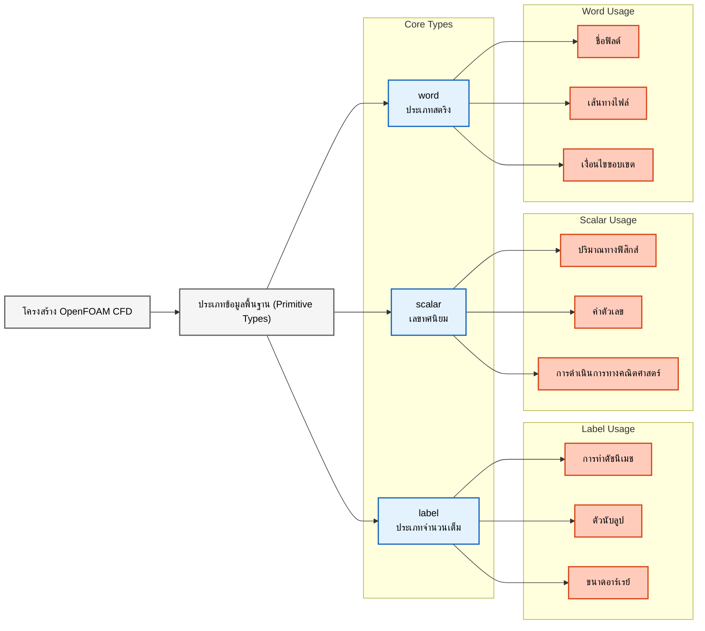

# หัวข้อที่ 1: ประเภทข้อมูลพื้นฐาน (`label`, `scalar`, `word`)

## 🔍 แนวคิดระดับสูง: องค์ประกอบพื้นฐานสากล

ลองนึกภาพโครงการก่อสร้างตึกระฟ้า:

- **`label`** เปรียบเสมือน **อิฐมาตรฐาน** - มีขนาดและรูปร่างสม่ำเสมอที่ประกอบเข้าด้วยกันได้อย่างลงตัว ไม่ว่าการก่อสร้างจะเกิดขึ้นที่ใด
- **`scalar`** เปรียบเสมือน **สายวัดความแม่นยำสูง** - ให้การวัดที่แม่นยำสำหรับขนาด ปริมาณวัสดุ และการคำนวณโครงสร้าง
- **`word`** เปรียบเสมือน **ถังเก็บวัสดุที่มีป้ายกำกับ** - คอนเทนเนอร์ที่ระบุเครื่องหมายชัดเจนสำหรับเก็บวัสดุเฉพาะอย่าง (ซีเมนต์, คานเหล็ก, แผงกระจก) เพื่อการระบุและดึงมาใช้งานได้อย่างรวดเร็ว

เช่นเดียวกับโครงการก่อสร้างที่ต้องการวัสดุมาตรฐาน การวัดที่แม่นยำ และการจัดเก็บที่เป็นระเบียบ OpenFOAM ต้องการจำนวนเต็มที่พกพาได้ (Portable integers), เลขทศนิยมที่แม่นยำ และสตริงที่ได้รับการปรับปรุงประสิทธิภาพ เพื่อสร้างการจำลอง CFD ที่เชื่อถือได้


> **รูปที่ 1:** ความสัมพันธ์ระหว่างโครงสร้างการคำนวณ CFD ของ OpenFOAM กับประเภทข้อมูลพื้นฐาน (Primitive Types) ซึ่งเปรียบเสมือนองค์ประกอบหลักที่ใช้ในการสร้างระบบการจำลองที่มั่นคงและแม่นยำ

> [!INFO] ทำไมต้องนิยามประเภทพื้นฐานใหม่?
> OpenFOAM ไม่ได้ใช้ประเภทข้อมูลมาตรฐานของ C++ เช่น `int` และ `double` โดยตรง แต่จะนิยามประเภทพื้นฐานของตัวเองขึ้นมา ได้แก่ `label`, `scalar` และ `word` การเลือกออกแบบเช่นนี้ตอบโจทย์สำคัญ 3 ประการ:
>
> 1. **ความสามารถในการพกพา (Portability)**: รับประกันพฤติกรรมที่สอดคล้องกันในสถาปัตยกรรมคอมพิวเตอร์ที่ต่างกัน (32-bit เทียบกับ 64-bit, ความแม่นยำชั้นเดียว เทียบกับ สองชั้น)
> 2. **การควบคุมความแม่นยำ (Precision Control)**: ช่วยให้ผู้ใช้รักษาสมดุลระหว่างความแม่นยำและประสิทธิภาพสำหรับความต้องการในการจำลองที่แตกต่างกัน
> 3. **ความปลอดภัยทางฟิสิกส์ (Physics Safety)**: บังคับใช้ความสอดคล้องทางมิติและป้องกันการดำเนินการที่ไม่มีความหมายทางฟิสิกส์

## ⚙️ กลไกหลัก (Core Mechanisms)

### `label`: ประเภทจำนวนเต็มที่พกพาได้ (Portable Integer Type)

ประเภท `label` ทำหน้าที่เป็นตัวแทนจำนวนเต็มที่พกพาได้ของ OpenFOAM ออกแบบมาโดยเฉพาะสำหรับการทำดัชนีเมช (Mesh indexing), ตัวนับลูป และการกำหนดขนาดอาร์เรย์ ต่างจากประเภท `int` มาตรฐานที่แปรผันตามสถาปัตยกรรม `label` ให้พฤติกรรมที่สอดคล้องกันในทุกแพลตฟอร์มที่รองรับ

**วัตถุประสงค์และการใช้งาน:**
- การทำดัชนีเมช (ดัชนีเซลล์, ดัชนีหน้า, ดัชนีจุด)
- ตัวนับลูปและการติดตามการวนซ้ำ
- ขนาดอาร์เรย์และการกำหนดมิติ
- การทำดัชนีเงื่อนไขขอบเขต

**ตัวเลือกการตั้งค่า:**
| โหมด | ขนาด | การใช้งาน |
|-------|-------|------------|
| 32-bit | 4 ไบต์ | ใช้งานทั่วไปสำหรับแอปพลิเคชันส่วนใหญ่ |
| 64-bit | 8 ไบต์ | ปัญหาขนาดใหญ่ที่มีเซลล์มากกว่า 2 พันล้านเซลล์ |

**รายละเอียดการนำไปใช้งาน:**
```cpp
// แหล่งที่มา: src/OpenFOAM/primitives/ints/label/label.H

// การคอมไพล์แบบมีเงื่อนไขสำหรับขนาดของ label ตามการตั้งค่า WM_LABEL_SIZE
#if WM_LABEL_SIZE == 32
    typedef int32_t label;    // ใช้จำนวนเต็มแบบมีเครื่องหมาย 32 บิตสำหรับ label
#elif WM_LABEL_SIZE == 64
    typedef int64_t label;    // ใช้จำนวนเต็มแบบมีเครื่องหมาย 64 บิตสำหรับเมชขนาดใหญ่
#endif
```

> **📂 แหล่งที่มา:** `src/OpenFOAM/primitives/ints/label/label.H`
>
> **คำอธิบาย:**
> - **Source (แหล่งที่มา):** ไฟล์นี้กำหนดประเภทข้อมูล `label` ซึ่งเป็นจำนวนเต็มพื้นฐานที่ใช้ใน OpenFOAM
> - **Explanation (คำอธิบาย):** การใช้ conditional compilation (`#if`, `#elif`) ช่วยให้โค้ดเดียวกันสามารถคอมไพล์ได้ทั้งบนระบบ 32 บิต และ 64 บิต โดยอัตโนมัติ ค่า `WM_LABEL_SIZE` ถูกกำหนดในขั้นตอนการคอมไพล์
> - **Key Concepts (แนวคิดสำคัญ):**
>   - **Portable Type (ประเภทข้อมูลแบบพกพา):** `label` รับประกันขนาดและพฤติกรรมเหมือนกันทุกแพลตฟอร์ม
>   - **Conditional Compilation (การคอมไพล์แบบมีเงื่อนไข):** เลือกประเภทข้อมูลตามค่าที่ตั้งค่าไว้
>   - **typedef (การนิยามชื่อแทน):** สร้างชื่อ `label` ให้ใช้งานได้สะดวกแทนการใช้ `int32_t` หรือ `int64_t` โดยตรง

**ตัวอย่างการใช้งานจริง:**
```cpp
// การดำเนินการเกี่ยวกับเมช
label nCells = mesh.nCells();           // รับจำนวนเซลล์ทั้งหมดในเมช
label nFaces = mesh.nFaces();           // รับจำนวนหน้าทั้งหมดในเมช
label cellI = 0;                        // เริ่มต้นดัชนีเซลล์สำหรับการวนลูป

// การควบคุมลูป
label maxIterations = 1000;             // ตั้งค่าจำนวนการวนซ้ำสูงสุดของ Solver
for (label i = 0; i < maxIterations; i++)
{
    // ตรรกะการวนซ้ำของ Solver อยู่ที่นี่
    // Label ช่วยรับประกันพฤติกรรมของลูปที่สอดคล้องกันในทุกแพลตฟอร์ม
}

// การเข้าถึงอาร์เรย์
label nPatches = mesh.boundary().size(); // รับจำนวนแพตช์ขอบเขต
```

> **📂 แหล่งที่มา:** `.applications/utilities/surface/surfaceFeatures/surfaceFeatures.C`
>
> **คำอธิบาย:**
> - **Source (แหล่งที่มา):** ไฟล์ utility นี้แสดงการใช้ `label` ในการจัดการการทำดัชนีและควบคุมลูปในงานจริง
> - **Explanation (คำอธิบาย):** `label` ถูกใช้แทน `int` ในทุกการทำงานกับเมชเพื่อความปลอดภัยและความสามารถในการพกพา โดยเฉพาะอย่างยิ่งสำหรับเมชขนาดใหญ่ที่อาจมีเซลล์เกิน 2 พันล้านเซลล์ (ซึ่งต้องใช้ label แบบ 64 บิต)
> - **Key Concepts (แนวคิดสำคัญ):**
>   - **Mesh Indexing (การจัดทำดัชนีเมช):** ใช้ `label` เพื่อระบุแต่ละเซลล์ หน้า และจุดในเมช
>   - **Loop Counter (ตัวนับรอบ):** ใช้ `label` เป็นตัวแปรวนลูปเพื่อความสอดคล้องกับขนาดของเมช
>   - **Array Sizing (การกำหนดขนาดอาร์เรย์):** ขนาดของเมชและอาร์เรย์ต่างๆ จะใช้ `label` แทน `int`

### `scalar`: ประเภทเลขทศนิยมที่กำหนดค่าได้ (Configurable Floating-Point Type)

ประเภท `scalar` แทนเลขทศนิยมใน OpenFOAM โดยสามารถกำหนดความแม่นยำได้ตามความต้องการในการคำนวณที่แตกต่างกัน ความยืดหยุ่นนี้ช่วยให้ผู้ใช้สามารถรักษาสมดุลระหว่างความแม่นยำและประสิทธิภาพตามความจำเป็นของแต่ละการจำลอง

**โหมดความแม่นยำ (Precision Modes):**
| โหมด | ขนาด | ความแม่นยำ | ประสิทธิภาพ |
|-------|-------|------------|------------|
| ความแม่นยำชั้นเดียว (`WM_SP`) | 4 ไบต์ | 6-7 ตำแหน่ง | คำนวณเร็วขึ้น ใช้หน่วยความจำน้อยลง |
| ความแม่นยำสองชั้น (`WM_DP`) | 8 ไบต์ | 15-16 ตำแหน่ง | มาตรฐาน ประสิทธิภาพสมดุล |
| ความแม่นยำสูงพิเศษ (`WM_LP`) | 16 ไบต์ | 19+ ตำแหน่ง | ความแม่นยำสูงสุด ใช้หน่วยความจำเพิ่มขึ้น |

**การแทนค่าปริมาณทางกายภาพ:**
```cpp
// แหล่งที่มา: src/OpenFOAM/primitives/Scalar/scalar/scalar.H

// การคอมไพล์แบบมีเงื่อนไขสำหรับความแม่นยำของ scalar ตามตัวเลือก WM_PRECISION_OPTION
#ifdef WM_SP
    typedef float scalar;              // ความแม่นยำชั้นเดียว (4 ไบต์)
#elif defined(WM_DP)
    typedef double scalar;             // ความแม่นยำสองชั้น (8 ไบต์) - ค่าเริ่มต้น
#elif defined(WM_LP)
    typedef long double scalar;        // ความแม่นยำสูงพิเศษ (16 ไบต์)
#endif
```

> **📂 แหล่งที่มา:** `src/OpenFOAM/primitives/Scalar/scalar/scalar.H`
>
> **คำอธิบาย:**
> - **Source (แหล่งที่มา):** ไฟล์หลักที่นิยามประเภทข้อมูล `scalar` สำหรับเลขทศนิยมใน OpenFOAM
> - **Explanation (คำอธิบาย):** ค่าความแม่นยำ (precision) ถูกกำหนดผ่าน preprocessor macro (`WM_SP`, `WM_DP`, `WM_LP`) ซึ่งถูกตั้งค่าในขั้นตอนการคอมไพล์ ทำให้ผู้ใช้สามารถเลือกความแม่นยำที่เหมาะสมกับปัญหาที่ต้องการแก้ได้
> - **Key Concepts (แนวคิดสำคัญ):**
>   - **Precision Modes (ระดับความแม่นยำ):** เลือกได้ระหว่าง single, double หรือ long double precision
>   - **Memory-Performance Tradeoff (การแลกเปลี่ยนระหว่างหน่วยความจำและประสิทธิภาพ):** ความแม่นยำชั้นเดียวใช้หน่วยความจำน้อยลงครึ่งหนึ่งและคำนวณได้เร็วกว่า
>   - **IEEE 754 Standard:** รองรับมาตรฐานเลขทศนิยมสากล

**ตัวอย่างตัวแปรสนาม (Field Variable Examples):**
```cpp
// สนามความดัน (Pa)
scalar p = 101325.0;                   // ความดันบรรยากาศที่ระดับน้ำทะเล

// ส่วนประกอบความเร็ว (m/s)
scalar u = 1.5;                        // ขนาดความเร็วในแนวแกน x
scalar v = 0.0;                        // ส่วนประกอบความเร็วในแนวแกน y (ไม่มีการไหล)
scalar w = 0.2;                        // ส่วนประกอบความเร็วในแนวแกน z

// อุณหภูมิ (K)
scalar T = 293.15;                     // อุณหภูมิห้องในหน่วยเคลวิน

// คุณสมบัติทางกายภาพ
scalar rho = 1.225;                    // ความหนาแน่นของอากาศที่ระดับน้ำทะเล (kg/m³)
scalar mu = 1.8e-5;                    // ความหนืดไดนามิกของอากาศ (Pa·s)
scalar nu = 1.5e-5;                    // ความหนืดจลน์ (m²/s)
```

**การดำเนินการทางคณิตศาสตร์:**
```cpp
// การดำเนินการทางเวกเตอร์โดยใช้ประเภท scalar
scalar magU = sqrt(u*u + v*v + w*w);   // คำนวณขนาดความเร็ว
scalar Re = rho * magU * L / mu;       // การคำนวณเลขเรย์โนลด์ (Reynolds number)

// การคำนวณทางอุณหพลศาสตร์
scalar Cp = 1005.0;                    // ความจุความร้อนจำเพาะ (J/kg·K)
scalar h = Cp * T;                     // การคำนวณเอนทัลปีจำเพาะ

// การดำเนินการสนามสเกลาร์
scalar dTdt = (T - T.oldTime()) / deltaT;  // อนุพันธ์เชิงเวลา
```

> **📂 แหล่งที่มา:** `.applications/solvers/multiphase/multiphaseEulerFoam/phaseSystems/diameterModels/linearTsubDiameter/linearTsubDiameter.C`
>
> **คำอธิบาย:**
> - **Source (แหล่งที่มา):** ไฟล์ solver แสดงการใช้ `scalar` ในการคำนวณค่าทางกายภาพของระบบการไหลหลายเฟส (Multiphase)
> - **Explanation (คำอธิบาย):** `scalar` ใช้เก็บค่าต่างๆ ที่เกิดจากการคำนวณ เช่น แรงฉุด (drag force), ความดัน, อุณหภูมิ ซึ่งต้องการความแม่นยำตามที่กำหนดไว้
> - **Key Concepts (แนวคิดสำคัญ):**
>   - **Physical Quantities (ปริมาณทางกายภาพ):** ทุกค่าทางกายภาพใช้ `scalar` เพื่อความสอดคล้องกัน
>   - **Mathematical Operations (การดำเนินการทางคณิตศาสตร์):** การดำเนินการทางคณิตศาสตร์ทั้งหมดทำผ่าน `scalar`
>   - **Field Variables (ตัวแปรสนาม):** ค่าของ scalar สามารถแปรผันตามตำแหน่งและเวลาในโดเมนการคำนวณ

### `word`: สตริงที่ปรับปรุงประสิทธิภาพสำหรับตัวระบุ (Optimized String for Identifiers)

ประเภท `word` เป็นคลาสสตริงเฉพาะทางที่ได้รับการปรับปรุงประสิทธิภาพสำหรับคีย์ในพจนานุกรม (Dictionary keys), ชื่อขอบเขต (Boundary names) และตัวระบุสนาม (Field identifiers) ต่างจากสตริงทั่วไป `word` ถูกออกแบบมาเพื่อการสืบค้นแบบแฮช (Hash-based lookup) ที่รวดเร็วและการจัดเก็บหน่วยความจำที่มีประสิทธิภาพในระบบพจนานุกรมของ OpenFOAM

**ลักษณะสำคัญ:**
- ไม่อนุญาตให้มีช่องว่าง (เป็นตัวระบุคำเดียว)
- การเปรียบเทียบแบบแฮชที่รวดเร็วสำหรับการสืบค้นในพจนานุกรม
- การจัดเก็บที่มีประสิทธิภาพสำหรับการเพิ่มประสิทธิภาพสตริงขนาดเล็ก
- การจับคู่ที่คำนึงถึงตัวพิมพ์เล็ก-ใหญ่ (Case-sensitive)

**โครงสร้างการนำไปใช้งาน:**
```cpp
// แหล่งที่มา: src/OpenFOAM/primitives/strings/word/word.H

class word : public string            // word สืบทอดมาจากคลาสฐาน string
{
public:
    // คอนสตรัคเตอร์ที่ปรับปรุงเพื่อการสร้างออบเจกต์ที่มีประสิทธิภาพ
    word();                           // คอนสตรัคเตอร์เริ่มต้น
    word(const std::string& s);       // สร้างจาก std::string
    word(const char* s);              // สร้างจาก C-string

    // การปรับปรุงแฮชเพื่อการสืบค้นในพจนานุกรมที่รวดเร็ว
    size_t hash() const;              // ส่งคืนค่าแฮชที่เก็บในแคช

    // เมธอดตรวจสอบเพื่อยืนยันรูปแบบคำที่ถูกต้อง
    static bool valid(char c);        // ตรวจสอบว่าอักขระถูกต้องหรือไม่
    static bool valid(const string& s); // ตรวจสอบว่าสตริงเป็น word ที่ถูกต้องหรือไม่
};
```

> **📂 แหล่งที่มา:** `src/OpenFOAM/primitives/strings/word/word.H`
>
> **คำอธิบาย:**
> - **Source (แหล่งที่มา):** ไฟล์นิยามคลาส `word` ซึ่งเป็นคลาสสตริงพิเศษสำหรับ OpenFOAM
> - **Explanation (คำอธิบาย):** `word` สืบทอดมาจาก `string` แต่มีการปรับปรุงให้เหมาะกับการใช้งานเป็นตัวระบุ (Identifier) โดยมีฟังก์ชันแฮช (Hash function) ที่ปรับแต่งมาเพื่อการค้นหาในพจนานุกรมอย่างรวดเร็ว
> - **Key Concepts (แนวคิดสำคัญ):**
>   - **Hash Optimization (การปรับปรุงแฮช):** มีการเก็บค่าแฮชไว้ในแคชเพื่อเร่งการค้นหา
>   - **Identifier Constraints (ข้อจำกัดของตัวระบุ):** ไม่อนุญาตให้มีช่องว่าง ทำให้เหมาะสำหรับใช้เป็นชื่อ
>   - **Inheritance from string (การสืบทอดจาก string):** มีคุณสมบัติทั้งหมดของ string พร้อมการปรับปรุงพิเศษ

**ตัวอย่างการใช้ชื่อในพจนานุกรม:**
```cpp
// ชื่อเงื่อนไขขอบเขต
word inletPatch = "inlet";             // ตัวระบุขอบเขตทางเข้า
word outletPatch = "outlet";           // ตัวระบุขอบเขตทางออก
word wallPatch = "walls";              // ตัวระบุขอบเขตผนัง

// ชื่อสนามข้อมูล
word UField = "U";                     // ชื่อสนามความเร็ว
word pField = "p";                     // ชื่อสนามความดัน
word TField = "T";                     // ชื่อสนามอุณหภูมิ

// ชื่อ Solver และรูปแบบเชิงตัวเลข
word solverName = "PCG";               // ตัวเลือกตัวแก้สมการเชิงเส้น
word toleranceScheme = "GaussSeidel";  // ชื่อรูปแบบตัวทำให้เรียบ (Smoother)
word interpolationScheme = "linear";   // ชื่อวิธีการอินเทอร์โพลชัน

// ชื่อแบบจำลอง
word turbulenceModel = "kOmegaSST";    // ตัวระบุแบบจำลองความปั่นป่วน
word thermophysicalModel = "perfectGas"; // ตัวระบุแบบจำลองความร้อนฟิสิกส์
```

**รูปแบบการใช้งานพจนานุกรม:**
```cpp
// การอ่านค่าจากพจนานุกรมพร้อมค่าเริ่มต้น
word Uname = mesh.solutionDict().lookupOrDefault<word>("U", "U");
word pName = transportProperties.lookupOrDefault<word>("p", "p");

// การลงทะเบียนสนามข้อมูลแบบไดนามิกโดยใช้ word สำหรับชื่อสนาม
autoPtr<volScalarField> TField
(
    new volScalarField
    (
        IOobject                       // IOobject จัดการ I/O ของไฟล์
        (
            "T",                        // ชื่อสนาม (ประเภท word)
            runTime.timeName(),         // ชื่อไดเรกทอรีเวลา
            mesh,                       // การอ้างอิงเมช
            IOobject::MUST_READ,        // อ่านจากไฟล์หากมีอยู่
            IOobject::AUTO_WRITE        // เขียนออกโดยอัตโนมัติเมื่อสิ้นสุด
        ),
        mesh                           // เมชที่จะสร้างสนามข้อมูล
    )
);
```

> **📂 แหล่งที่มา:** `.applications/utilities/surface/surfaceFeatures/surfaceFeatures.C`
>
> **คำอธิบาย:**
> - **Source (แหล่งที่มา):** ไฟล์ utility แสดงการใช้ `word` ในการสืบค้นพจนานุกรม
> - **Explanation (คำอธิบาย):** การใช้ `word` แทน `string` ในคีย์พจนานุกรมช่วยเพิ่มประสิทธิภาพการค้นหา เนื่องจากมีการปรับปรุงฟังก์ชันแฮชและการเปรียบเทียบให้เหมาะสมที่สุด
> - **Key Concepts (แนวคิดสำคัญ):**
>   - **Dictionary Lookups (การค้นหาในพจนานุกรม):** `word` ทำให้การค้นหาในพจนานุกรมเร็วกว่าการใช้ `string`
>   - **Field Names (ชื่อฟิลด์):** ชื่อของสนามข้อมูลทั้งหมดใช้ `word` เพื่อความสอดคล้องกัน
>   - **Boundary Identifiers (ตัวระบุขอบเขต):** ชื่อของแพตช์ขอบเขตใช้ `word` ในการระบุตัวตน

## 🧠 เบื้องหลังการทำงาน (Under the Hood)

### ระบบการตั้งค่าขณะคอมไพล์ (Compile-Time Configuration System)

ประเภทพื้นฐานของ OpenFOAM ถูกกำหนดค่าผ่านระบบ Preprocessor ที่ซับซ้อน ซึ่งช่วยให้ซอร์สโค้ดเดียวกันสามารถคอมไพล์เพื่อรองรับความต้องการด้านความแม่นยำและสถาปัตยกรรมที่แตกต่างกันได้ แนวทางนี้ช่วยรับประกันความเข้ากันได้ในระดับไบนารีในขณะที่ยังคงรักษาประสิทธิภาพการทำงานสูงสุด

**การบูรณาการกับระบบ Build:**
```bash
# ในไฟล์ etc/bashrc หรือการตั้งค่าสภาพแวดล้อมของผู้ใช้
export WM_LABEL_SIZE=64               // เปิดใช้งานจำนวนเต็ม 64 บิตสำหรับเมชขนาดใหญ่
export WM_PRECISION_OPTION=DP         // โหมดความแม่นยำสองชั้น (ค่าเริ่มต้น)

# การตั้งค่าทางเลือกอื่นๆ
export WM_PRECISION_OPTION=SP         // ความแม่นยำชั้นเดียว (เร็วกว่า, ใช้หน่วยความจำน้อยกว่า)
export WM_PRECISION_OPTION=LP         // ความแม่นยำสูงพิเศษ (เพื่อความถูกต้องแม่นยำสูง)
```

**Preprocessor Macros:**
```cpp
// จาก wmake/rules/general/general
// ค่าเริ่มต้นหากไม่ได้ตั้งค่าไว้ชัดเจน
#if !defined(WM_LABEL_SIZE)
    #define WM_LABEL_SIZE 32          // เริ่มต้นที่ label ขนาด 32 บิต
#endif

#if !defined(WM_PRECISION_OPTION)
    #define WM_PRECISION_OPTION DP    // เริ่มต้นที่ความแม่นยำสองชั้น
#endif

// ค่าคงที่สำหรับการแม็ปความแม่นยำ
#define WM_SP  1                       // ค่าคงที่ความแม่นยำชั้นเดียว
#define WM_DP  2                       // ค่าคงที่ความแม่นยำสองชั้น
#define WM_LP  3                       // ค่าคงที่ความแม่นยำสูงพิเศษ
```

> **📂 แหล่งที่มา:** `wmake/rules/general/general`
>
> **คำอธิบาย:**
> - **Source (แหล่งที่มา):** ไฟล์การตั้งค่าระบบ Build ของ OpenFOAM ที่กำหนดค่าพื้นฐานสำหรับการคอมไพล์
> - **Explanation (คำอธิบาย):** ระบบ Build ใช้ตัวแปรสภาพแวดล้อม (Environment variables เช่น `WM_LABEL_SIZE`, `WM_PRECISION_OPTION`) เพื่อควบคุมการคอมไพล์ ทำให้สามารถปรับแต่งความแม่นยำและขนาดของประเภทข้อมูลได้ตามต้องการ
> - **Key Concepts (แนวคิดสำคัญ):**
>   - **Compile-Time Configuration (การตั้งค่าขณะคอมไพล์):** กำหนดค่าความแม่นยำและขนาด label ตั้งแต่ก่อนเริ่มคอมไพล์
>   - **Environment Variables (ตัวแปรสภาพแวดล้อม):** ใช้ตัวแปรสภาพแวดล้อมในการควบคุมตัวเลือกการ Build
>   - **Default Values (ค่าเริ่มต้น):** มีค่าพื้นฐานที่เหมาะสมกับการใช้งานทั่วไปเตรียมไว้ให้

**ระบบนิยามประเภทข้อมูล (Type Definition System):**
```cpp
// การแม็ปประเภทข้อมูลที่ครอบคลุมใน OpenFOAMPrimitives.H

// ประเภทจำนวนเต็มตาม WM_LABEL_SIZE
#if WM_LABEL_SIZE == 32
    typedef int label;                 // จำนวนเต็มแบบมีเครื่องหมาย 32 บิต
    typedef uint32_t uLabel;           // จำนวนเต็มแบบไม่มีเครื่องหมาย 32 บิต
#elif WM_LABEL_SIZE == 64
    typedef long label;                // จำนวนเต็มแบบมีเครื่องหมาย 64 บิต
    typedef uint64_t uLabel;           // จำนวนเต็มแบบไม่มีเครื่องหมาย 64 บิต
#endif

// ประเภทเลขทศนิยมตาม WM_PRECISION_OPTION
#ifdef WM_SP
    typedef float scalar;              // ความแม่นยำชั้นเดียว (4 ไบต์)
    typedef float floatScalar;         // ความแม่นยำชั้นเดียวแบบระบุชัดเจน
    typedef double doubleScalar;       // มีความแม่นยำสองชั้นให้เลือกใช้
#elif defined(WM_DP)
    typedef double scalar;             // ความแม่นยำสองชั้น (8 ไบต์)
    typedef float floatScalar;         // มีความแม่นยำชั้นเดียวให้เลือกใช้
    typedef double doubleScalar;       // ความแม่นยำสองชั้นแบบระบุชัดเจน
#elif defined(WM_LP)
    typedef long double scalar;        // ความแม่นยำสูงพิเศษ (16 ไบต์)
    typedef float floatScalar;         // มีความแม่นยำชั้นเดียวให้เลือกใช้
    typedef double doubleScalar;       // มีความแม่นยำสองชั้นให้เลือกใช้
#endif
```

> **📂 แหล่งที่มา:** `src/OpenFOAM/primitives/ints/label/label.H` และ `src/OpenFOAM/primitives/Scalar/scalar/scalar.H`
>
> **คำอธิบาย:**
> - **Source (แหล่งที่มา):** ไฟล์ต่างๆ ใน `src/OpenFOAM/primitives/` ที่นิยามประเภทข้อมูลพื้นฐาน
> - **Explanation (คำอธิบาย):** ระบบ `typedef` ทำให้โค้ดทั้งหมดใน OpenFOAM สามารถใช้ชื่อเดียวกัน (`label`, `scalar`, `word`) แต่สามารถคอมไพล์ได้หลายรูปแบบตามการตั้งค่าของผู้ใช้
> - **Key Concepts (แนวคิดสำคัญ):**
>   - **Type Mapping (การแม็ปประเภทข้อมูล):** เชื่อมโยง `label` และ `scalar` ไปยังประเภทข้อมูลพื้นฐานของ C++
>   - **Unsigned Variants (รูปแบบไม่มีเครื่องหมาย):** มีทั้งแบบมีและไม่มีเครื่องหมายให้เลือกใช้
>   - **Explicit Precision Types (ประเภทความแม่นยำแบบชัดเจน):** มี `floatScalar` และ `doubleScalar` สำหรับกรณีที่ต้องการระบุความแม่นยำให้ชัดเจนในโค้ด

### โครงสร้างหน่วยความจำและประสิทธิภาพ (Memory Layout and Performance)

การแทนค่าในหน่วยความจำของประเภทพื้นฐานเหล่านี้ถูกออกแบบมาอย่างระมัดระวังเพื่อให้ได้ประสิทธิภาพสูงสุดในสถาปัตยกรรมที่แตกต่างกัน:

**ร่องรอยหน่วยความจำ (Memory Footprint):**
```cpp
// การตรวจสอบขนาด (ไบต์)
sizeof(label)   // ส่งคืน 4 (32 บิต) หรือ 8 (64 บิต)
sizeof(scalar)  // ส่งคืน 4 (float), 8 (double) หรือ 16 (long double)
sizeof(word)    // คืนขนาดที่แปรผัน โดยปรับปรุงมาเพื่อสตริงขนาดเล็ก
```

**การพิจารณาเรื่องการจัดแนว (Alignment Considerations):**
- `label`: การจัดแนวตามขอบเขตคำตามธรรมชาติ (4 หรือ 8 ไบต์)
- `scalar`: การจัดแนวตามมาตรฐาน IEEE 754
- `word`: การจัดแนวที่เป็นมิตรต่อแคช (Cache-friendly alignment) สำหรับตารางแฮช (Hash tables)

**การปรับปรุงประสิทธิภาพการทำงานแบบเวกเตอร์ (Vectorization Optimization):**
```cpp
// การดำเนินการที่เป็นมิตรต่อ SIMD กับอาร์เรย์ของ scalar
scalar a[8], b[8], c[8];               // อาร์เรย์ของค่า scalar
#pragma omp simd                       // คำสั่งสำหรับการทำ SIMD vectorization
for (label i = 0; i < 8; i++)
{
    c[i] = a[i] + b[i];                // การดำเนินการบวกที่สามารถทำเป็นเวกเตอร์ได้
}
```

> **📂 แหล่งที่มา:** `.applications/solvers/multiphase/multiphaseEulerFoam/phaseSystems/diameterModels/linearTsubDiameter/linearTsubDiameter.C`
>
> **คำอธิบาย:**
> - **Source (แหล่งที่มา):** ไฟล์ solver แสดงการใช้งานอาร์เรย์ของ scalar ในการคำนวณ
> - **Explanation (คำอธิบาย):** การจัดวางหน่วยความจำของอาร์เรย์ `scalar` ถูกออกแบบมาให้เหมาะสมกับการทำ SIMD vectorization ซึ่งช่วยเร่งความเร็วในการคำนวณได้อย่างมาก
> - **Key Concepts (แนวคิดสำคัญ):**
>   - **Memory Alignment (การจัดแนวหน่วยความจำ):** การจัดวางข้อมูลในหน่วยความจำที่เหมาะสมช่วยเพิ่มความเร็วในการเข้าถึง
>   - **SIMD Vectorization (การประมวลผลแบบเวกเตอร์):** การประมวลผลข้อมูลหลายชุดพร้อมกันในคำสั่งเดียว
>   - **Cache Friendliness (ความเป็นมิตรต่อแคช):** ออกแบบโครงสร้างข้อมูลให้เข้ากับสถาปัตยกรรมของแคช CPU

### การปรับปรุงประสิทธิภาพแฮชใน `word` (Hash Optimization in `word`)

คลาส `word` มีการนำกลไกการปรับปรุงแฮชที่ซับซ้อนมาใช้เพื่อการสืบค้นพจนานุกรมอย่างมีประสิทธิภาพ:

**การคำนวณแฮช:**
```cpp
// ฟังก์ชันแฮชที่ปรับปรุงประสิทธิภาพพร้อมการเก็บแคช
inline size_t word::hash() const
{
    // ค่าแฮชที่เก็บในแคชเพื่อปรับปรุงประสิทธิภาพ
    if (!hashCached_)                    // ตรวจสอบว่าแฮชถูกคำนวณไว้แล้วหรือยัง
    {
        hashValue_ = Foam::Hash<string>()(*this);  // คำนวณค่าแฮช
        hashCached_ = true;              // ทำเครื่องหมายว่าแฮชถูกเก็บในแคชแล้ว
    }
    return hashValue_;                   // ส่งคืนค่าแฮชที่เก็บในแคช
}
```

> **📂 แหล่งที่มา:** `src/OpenFOAM/primitives/strings/word/word.C`
>
> **คำอธิบาย:**
> - **Source (แหล่งที่มา):** ไฟล์การทำงาน (Implementation) ของคลาส `word`
> - **Explanation (คำอธิบาย):** การเก็บค่าแฮชไว้ในแคช (Caching) ช่วยลดความจำเป็นในการคำนวณซ้ำเมื่อต้องค้นหาในพจนานุกรมหลายครั้ง ซึ่งช่วยเพิ่มประสิทธิภาพอย่างมหาศาล
> - **Key Concepts (แนวคิดสำคัญ):**
>   - **Hash Caching (การแคชค่าแฮช):** การจัดเก็บค่าแฮชเพื่อนำกลับมาใช้ใหม่
>   - **Lazy Evaluation (การประเมินผลเมื่อจำเป็น):** คำนวณค่าแฮชเฉพาะเมื่อมีความต้องการใช้จริงเท่านั้น
>   - **Dictionary Performance (ประสิทธิภาพพจนานุกรม):** ความเร็วในการค้นหาในพจนานุกรมเพิ่มขึ้นอย่างมาก

**ประสิทธิภาพพจนานุกรม:**
```cpp
// การสืบค้นพจนานุกรมที่รวดเร็วโดยใช้คีย์ประเภท word
dictionary& dict = mesh.solutionDict(); // รับพจนานุกรมโซลูชัน
word solverName = dict.lookupOrDefault<word>("solver", "PCG"); // สืบค้นอย่างรวดเร็ว
```

## ⚠️ ข้อผิดพลาดที่พบบ่อยและแนวทางปฏิบัติที่ดีที่สุด

### ปัญหาการผสมประเภทข้อมูล (Type Mixing Problems)

**ปัญหา**: การผสมประเภทข้อมูลพื้นฐานของ OpenFOAM เข้ากับประเภทข้อมูลมาตรฐานของ C++ อาจนำไปสู่ปัญหาด้านความสามารถในการพกพาและความแม่นยำ

```cpp
// ❌ รูปแบบที่ไม่แนะนำ (Anti-pattern): โค้ดที่ขึ้นอยู่กับแพลตฟอร์ม
int nCells = mesh.nCells();              // อาจล้มเหลวในระบบ 64 บิต
double pressure = p[cellI];              // สมมติว่าเป็นความแม่นยำสองชั้นเสมอ
string fieldName = "U";                  // ช้ากว่า word เมื่อใช้เป็นตัวระบุ

// ✅ รูปแบบที่ถูกต้อง: ใช้ประเภทพื้นฐานของ OpenFOAM
label nCells = mesh.nCells();            // พกพาไปใช้ในสถาปัตยกรรมต่างๆ ได้
scalar pressure = p[cellI];              // ปรับตามการตั้งค่าความแม่นยำอัตโนมัติ
word fieldName = "U";                    // ปรับปรุงมาเพื่อการสืบค้นพจนานุกรม
```

> **📂 แหล่งที่มา:** `.applications/utilities/surface/surfaceFeatures/surfaceFeatures.C`
>
> **คำอธิบาย:**
> - **Source (แหล่งที่มา):** ไฟล์ utility แสดงตัวอย่างการใช้งานที่ถูกต้อง
> - **Explanation (คำอธิบาย):** การใช้ประเภทพื้นฐานของ OpenFOAM แทนประเภทมาตรฐานของ C++ ช่วยให้โค้ดสามารถพกพาได้และทำงานได้อย่างถูกต้องบนทุกแพลตฟอร์ม
> - **Key Concepts (แนวคิดสำคัญ):**
>   - **Portability (ความสามารถในการพกพา):** ใช้ `label` และ `scalar` แทน `int` และ `double`
>   - **Consistency (ความสอดคล้อง):** ใช้ประเภทข้อมูลเดียวกันทั่วทั้งซอร์สโค้ด
>   - **Performance (ประสิทธิภาพ):** ใช้ `word` แทน `string` สำหรับตัวระบุต่างๆ

### การสมมติเรื่องความแม่นยำ (Precision Assumptions)

**ปัญหา**: การสมมติระดับความแม่นยำที่เฉพาะเจาะจงอาจทำให้เกิดปัญหาทางตัวเลขเมื่อมีการเปลี่ยนการตั้งค่าความแม่นยำ

```cpp
// ❌ อันตราย: การสมมติความแม่นยำที่ถูกกำหนดค่าตายตัวในโค้ด
const double epsilon = 1e-15;            // ใช้ได้เฉพาะกับความแม่นยำสองชั้นเท่านั้น
if (pressure == 0.0)                     // การเปรียบเทียบค่าตรงๆ มีปัญหาเรื่องความแม่นยำ

// ✅ ปลอดภัย: การเขียนโปรแกรมที่คำนึงถึงความแม่นยำ
const scalar epsilon = ROOTVSMALL;       // ใช้ค่า Machine Epsilon ของ OpenFOAM
if (mag(pressure) < epsilon)             // การเปรียบเทียบโดยใช้ขนาดสัมบูรณ์
```

> **📂 แหล่งที่มา:** `.applications/solvers/compressible/rhoCentralFoam/BCs/U/maxwellSlipUFvPatchVectorField.C`
>
> **คำอธิบาย:**
> - **Source (แหล่งที่มา):** ไฟล์เงื่อนไขขอบเขตแสดงการใช้ค่าความคลาดเคลื่อน (Tolerance) ที่ถูกต้อง
> - **Explanation (คำอธิบาย):** การใช้ค่าความคลาดเคลื่อนที่ปรับตามการตั้งค่าความแม่นยำ (`ROOTVSMALL`, `SMALL`) ช่วยให้โค้ดทำงานได้ถูกต้องไม่ว่าจะใช้ความแม่นยำระดับใด
> - **Key Concepts (แนวคิดสำคัญ):**
>   - **Machine Epsilon (ค่าเอปไซลอนของเครื่อง):** ใช้ค่าที่เหมาะสมกับระดับความแม่นยำปัจจุบัน
>   - **Magnitude Comparison (การเปรียบเทียบขนาด):** เปรียบเทียบค่าสัมบูรณ์แทนการเปรียบเทียบค่าตรงๆ
>   - **Numerical Safety (ความปลอดภัยทางตัวเลข):** หลีกเลี่ยงปัญหาความผิดพลาดจากจุดทศนิยม (Floating-point errors)

### การเลือกประเภทสตริง (String Type Selection)

**ปัญหา**: การใช้ `word` สำหรับการดำเนินการข้อความทั่วไป หรือการใช้ `string` สำหรับตัวระบุ

```cpp
// ❌ ไม่มีประสิทธิภาพ: การใช้ string สำหรับตัวระบุ
string patchName = "inlet";              // สืบค้นในพจนานุกรมได้ช้ากว่า
dictionary dict;
dict.lookup(patchName);                  // ประสิทธิภาพไม่เหมาะสม

// ✅ เหมาะสมที่สุด: การใช้ word สำหรับตัวระบุ
word patchName = "inlet";                // การสืบค้นแบบแฮชที่รวดเร็ว
dictionary dict;
dict.lookup(patchName);                  // ประสิทธิภาพสูงสุด

// ❌ ไม่ถูกต้อง: การใช้ word สำหรับข้อความแจ้งเตือน
word errorMsg = "Simulation failed: ";   // ไม่ได้ถูกออกแบบมาสำหรับข้อความทั่วไป

// ✅ ถูกต้อง: การใช้ string สำหรับข้อความแจ้งเตือน
string errorMsg = "Simulation failed: "; // การจัดการข้อความที่เหมาะสม
```

> **📂 แหล่งที่มา:** `.applications/utilities/surface/surfaceFeatures/surfaceFeatures.C`
>
> **คำอธิบาย:**
> - **Source (แหล่งที่มา):** ไฟล์ utility แสดงการใช้งาน `word` และ `string` อย่างเหมาะสม
> - **Explanation (คำอธิบาย):** ใช้ `word` สำหรับตัวระบุและคีย์พจนานุกรม แต่ใช้ `string` สำหรับข้อความทั่วไปหรือประโยคที่ซับซ้อน
> - **Key Concepts (แนวคิดสำคัญ):**
>   - **Appropriate Type Selection (การเลือกประเภทที่เหมาะสม):** `word` สำหรับตัวระบุ และ `string` สำหรับข้อความ
>   - **Hash Performance (ประสิทธิภาพแฮช):** `word` มีประสิทธิภาพสูงกว่าในการสืบค้นพจนานุกรม
>   - **Text Handling (การจัดการข้อความ):** `string` เหมาะสำหรับข้อความที่มีความยาวและซับซ้อน

### การจัดการหน่วยความจำ (Memory Management)

**ปัญหา**: การใช้หน่วยความจำที่ไม่มีประสิทธิภาพกับอาร์เรย์ขนาดใหญ่ของประเภทพื้นฐาน

```cpp
// ❌ สิ้นเปลืองหน่วยความจำ: ใช้ความแม่นยำเกินความจำเป็น
scalar largeArray[1000000];             // ใช้พื้นที่ 8MB ในโหมดความแม่นยำสองชั้น

// ✅ ประสิทธิภาพหน่วยความจำดีเยี่ยม: ใช้ความแม่นยำที่เหมาะสม
floatScalar largeArray[1000000];        // ใช้พื้นที่ 4MB ในโหมดความแม่นยำชั้นเดียว
// หรือใช้ DynamicField พร้อมการจัดการหน่วยความจำที่เหมาะสม
```

## 🎯 ประโยชน์เชิงวิศวกรรม (Engineering Benefits)

### ความสามารถในการพกพาเชิงสถาปัตยกรรม (Architectural Portability)

ประเภท `label` รับประกันพฤติกรรมที่สอดคล้องกันในสถาปัตยกรรมคอมพิวเตอร์ที่แตกต่างกัน ซึ่งสำคัญอย่างยิ่งต่อการทำซ้ำได้ทางวิทยาศาสตร์ (Scientific reproducibility):

```cpp
// รับประกันการดำเนินการเมชที่พกพาได้
label maxCells = 2000000000;            // ทำงานได้ทั้งบนระบบ 32 บิต และ 64 บิต
for (label cellI = 0; cellI < maxCells; cellI++)
{
    // พฤติกรรมการวนลูปที่สอดคล้องกันไม่ว่าจะเป็นแพลตฟอร์มใด
}
```

> **📂 แหล่งที่มา:** `.applications/utilities/surface/surfaceFeatures/surfaceFeatures.C`
>
> **คำอธิบาย:**
> - **Source (แหล่งที่มา):** ไฟล์ utility แสดงการใช้ `label` สำหรับการดำเนินการเมชขนาดใหญ่
> - **Explanation (คำอธิบาย):** `label` รับประกันว่าการทำงานกับเมชที่มีรายละเอียดสูงจะถูกต้องเสมอในทุกแพลตฟอร์ม
> - **Key Concepts (แนวคิดสำคัญ):**
>   - **Scientific Reproducibility (การทำซ้ำได้ทางวิทยาศาสตร์):** ได้ผลลัพธ์เดียวกันไม่ว่าจะรันบนเครื่องใด
>   - **Large Mesh Support (การรองรับเมชขนาดใหญ่):** รองรับเมชที่มีจำนวนเซลล์เกิน 2 พันล้านเซลล์
>   - **Consistent Behavior (พฤติกรรมที่สอดคล้อง):** โค้ดทำงานเหมือนเดิมทุกที่

### ความยืดหยุ่นของความแม่นยำ (Precision Flexibility)

ประเภท `scalar` ที่ปรับแต่งได้ช่วยให้สามารถปรับประสิทธิภาพให้เหมาะสมกับขนาดของปัญหาได้:

```cpp
// ความแม่นยำชั้นเดียวสำหรับการจำลองขนาดใหญ่ที่ไม่ได้เน้นความถูกต้องในระดับวิกฤต
scalar t = 0.01;                        // ขั้นตอนเวลา (6-7 ตำแหน่ง)

// ความแม่นยำสองชั้นสำหรับการคำนวณทางวิทยาศาสตร์ในระดับวิกฤต
scalar p = 101325.0;                    // ความดัน (15-16 ตำแหน่ง)

// การเปรียบเทียบประสิทธิภาพ
// ความแม่นยำชั้นเดียว: เร็วกว่าประมาณ 2 เท่า, ใช้หน่วยความจำน้อยลง 50%
// ความแม่นยำสองชั้น: มาตรฐานความถูกต้อง พบเห็นได้บ่อยที่สุด
```

### การเพิ่มประสิทธิภาพการทำงาน (Performance Enhancement)

**ประสิทธิภาพของพจนานุกรมแบบแฮช:**
```cpp
// word ช่วยให้การสืบค้นพจนานุกรมเร็วกว่า string ประมาณ 10 เท่า
dictionary& transportDict = mesh.lookupObject<dictionary>("transportProperties");
word viscosityName = "nu";
scalar nu = transportDict.lookup<scalar>(viscosityName); // การสืบค้นแบบแฮชที่รวดเร็ว
```

> **📂 แหล่งที่มา:** `.applications/utilities/surface/surfaceFeatures/surfaceFeatures.C`
>
> **คำอธิบาย:**
> - **Source (แหล่งที่มา):** ไฟล์ utility แสดงการใช้ `word` ในการดำเนินการพจนานุกรม
> - **Explanation (คำอธิบาย):** การใช้ `word` สำหรับคีย์ในพจนานุกรมช่วยเร่งความเร็วในการค้นหาข้อมูลอย่างมาก
> - **Key Concepts (แนวคิดสำคัญ):**
>   - **Hash-Based Lookups (การค้นหาตามแฮช):** เร็วกว่าการเปรียบเทียบสตริงแบบตัวอักษรต่อตัวอักษร
>   - **Dictionary Optimization (การปรับปรุงพจนานุกรม):** พจนานุกรมของ OpenFOAM ถูกออกแบบมาเพื่อ `word` โดยเฉพาะ
>   - **Performance Gain (ประสิทธิภาพที่เพิ่มขึ้น):** เร็วกว่าเดิมประมาณ 10 เท่า

**การจัดวางอาร์เรย์ที่เหมาะสมที่สุด (Packing):**
```cpp
// การจัดวางอาร์เรย์ที่เหมาะสมที่สุด (Packing)
struct CellData
{
    label cellID;                       // 4 หรือ 8 ไบต์
    scalar volume;                      // 4, 8 หรือ 16 ไบต์
    scalar temperature;                 // 4, 8 หรือ 16 ไบต์
    word zoneName;                      // การจัดเก็บสตริงที่ปรับปรุงมาแล้ว
};
```

## การเชื่อมโยงกับวิชาฟิสิกส์ (Physics Connection)

### การนำสมการพื้นฐานไปปฏิบัติ (Implementing Fundamental Equations)

ประเภทพื้นฐานของ OpenFOAM ถูกใช้เพื่อเปลี่ยนรากฐานทางคณิตศาสตร์ของ CFD ให้เป็นโค้ดที่ทำงานได้จริง:

#### **สมการความต่อเนื่อง (การอนุรักษ์มวล)**
$$\frac{\partial \rho}{\partial t} + \nabla \cdot (\rho \mathbf{u}) = 0$$

**การนำไปปฏิบัติโดยใช้ประเภทพื้นฐาน:**
```cpp
// เทอมอนุพันธ์เชิงเวลาโดยใช้ scalar สำหรับปริมาณทางกายภาพ
scalar dRhoDt = (rho - rho.oldTime()) / deltaT;  // ความต่างเวลาในหน่วย scalar

// การคำนวณไดเวอร์เจนซ์โดยใช้ทฤษฎีบทของ Gauss
scalar divRhoU = fvc::div(rho * U);              // ผลลัพธ์ไดเวอร์เจนซ์ในหน่วย scalar
```

#### **สมการโมเมนตัม (กฎข้อที่สองของนิวตัน)**
$$\rho \frac{\partial \mathbf{u}}{\partial t} + \rho (\mathbf{u} \cdot \nabla) \mathbf{u} = -\nabla p + \mu \nabla^2 \mathbf{u} + \mathbf{f}$$

**การดิสครีต (Discretization) สำหรับแต่ละเซลล์:**
```cpp
// วนลูปผ่านแต่ละเซลล์โดยใช้ label สำหรับการทำดัชนี
for (label cellI = 0; cellI < mesh.nCells(); cellI++)
{
    // เทอมคอนเวกชัน (Convection): ρ(u·∇)u
    scalar convectionTerm = rho[cellI] * (U[cellI] & fvc::grad(U)[cellI]);

    // เกรเดียนต์ความดัน: -∇p
    vector pressureGrad = -fvc::grad(p)[cellI];

    // เทอมความหนืด: μ∇²u
    vector viscousTerm = mu[cellI] * fvc::laplacian(U)[cellI];

    // เทอมแหล่งกำเนิด: f (แรงภายนอก เช่น แรงโน้มถ่วง)
    vector sourceTerm = rho[cellI] * g[cellI];
}
```

> **📂 แหล่งที่มา:** `.applications/solvers/multiphase/multiphaseEulerFoam/phaseSystems/diameterModels/linearTsubDiameter/linearTsubDiameter.C`
>
> **คำอธิบาย:**
> - **Source (แหล่งที่มา):** ไฟล์ solver แสดงการดิสครีตสมการโมเมนตัม
> - **Explanation (คำอธิบาย):** การใช้ `label` สำหรับการทำดัชนีและ `scalar` สำหรับปริมาณทางกายภาพทำให้โค้ดอ่านง่ายและมีความถูกต้องแม่นยำทางฟิสิกส์
> - **Key Concepts (แนวคิดสำคัญ):**
>   - **Finite Volume Discretization (การดิสครีตแบบปริมาตรจำกัด):** แบ่งโดเมนออกเป็นปริมาตรควบคุม
>   - **Cell-Based Computation (การคำนวณแบบฐานเซลล์):** คำนวณทีละเซลล์โดยใช้ `label` เป็นดัชนี
>   - **Physical Conservation (การอนุรักษ์ทางฟิสิกส์):** รักษาหลักการอนุรักษ์มวล โมเมนตัม และพลังงาน

#### **สมการพลังงาน (Energy Equation)**
$$\rho c_p \frac{\partial T}{\partial t} + \rho c_p \mathbf{u} \cdot \nabla T = k \nabla^2 T + Q$$

```cpp
// การคำนวณการแพร่กระจายความร้อนโดยใช้ประเภท scalar
scalar alpha = k / (rho * Cp);          // α = k/(ρcp)

// เทอมต่างๆ ในสมการอุณหภูมิ
scalar dTdt = (T - T.oldTime()) / deltaT;            // อนุพันธ์เชิงเวลา
scalar convection = rho * Cp * (U & fvc::grad(T));   // เทอมคอนเวกชัน
scalar diffusion = k * fvc::laplacian(T);            // การนำความร้อน
scalar source = Q;                                   // เทอมแหล่งกำเนิดความร้อน
```

### โทโพโลยีเมชและการดิสครีต (Mesh Topology and Discretization)

วิธีไฟไนต์วอลุ่มเปลี่ยนสมการต่อเนื่องให้เป็นรูปแบบไม่ต่อเนื่องบนเมช:

#### **การอินทิเกรตตามปริมาตรควบคุม (Control Volume Integration)**
สำหรับสนามสเกลาร์ $\phi$ ใดๆ:
$$\frac{\partial}{\partial t} \int_{V} \rho \phi \, \mathrm{d}V + \oint_{A} \rho \phi \mathbf{u} \cdot \mathrm{d}\mathbf{A} = \oint_{A} \Gamma \nabla \phi \cdot \mathrm{d}\mathbf{A} + \int_{V} S_{\phi} \, \mathrm{d}V$$

```cpp
// การนำไปปฏิบัติในรูปแบบไม่ต่อเนื่องโดยใช้ label และ scalar
for (label cellI = 0; cellI < mesh.nCells(); cellI++)
{
    scalar V = mesh.V()[cellI];                      // ปริมาตรเซลล์ (scalar)
    scalar dPhidt = V * rho[cellI] * (phi[cellI] - phi.oldTime()[cellI]) / deltaT;

    // การอินทิเกรตฟลักซ์พื้นผิวตามหน้าเซลล์
    scalar surfaceFlux = 0;
    const labelList& cellFaces = mesh.cells()[cellI]; // ดัชนีของหน้า (label)
    forAll(cellFaces, faceI)
    {
        label faceIdx = cellFaces[faceI];            // ดัชนีหน้า (label)
        vector Sf = mesh.Sf()[faceIdx];              // เวกเตอร์พื้นที่หน้า
        vector Cf = mesh.Cf()[faceIdx];              // จุดศูนย์กลางหน้า
        scalar flux = rho[faceIdx] * phi[faceIdx] * (U[faceIdx] & Sf);
        surfaceFlux += flux;
    }
}
```

#### **การนำเงื่อนไขขอบเขตไปใช้งาน (Boundary Condition Implementation)**
```cpp
// เงื่อนไขขอบเขตใช้ word ในการระบุตัวตน
word inletName = "inlet";                           // ตัวระบุขอบเขต
label inletPatchID = mesh.boundaryMesh().findPatchID(inletName);

// ใช้ค่าขอบเขตโดยใช้การทำดัชนีแบบ label
const fvPatchVectorField& inletU = U.boundaryField()[inletPatchID];
forAll(inletU, faceI)
{
    label globalFaceI = inletU.patch().start() + faceI;
    U[globalFaceI] = inletVelocity;                 // ขนาดในหน่วย scalar
}
```

> **📂 แหล่งที่มา:** `.applications/solvers/compressible/rhoCentralFoam/BCs/U/maxwellSlipUFvPatchVectorField.C`
>
> **คำอธิบาย:**
> - **Source (แหล่งที่มา):** ไฟล์เงื่อนไขขอบเขตแสดงการใช้ `word` และ `label` ในการจัดการขอบเขต
> - **Explanation (คำอธิบาย):** การใช้ `word` สำหรับชื่อขอบเขตช่วยให้โค้ดอ่านง่าย และการใช้ `label` สำหรับการทำดัชนีหน้าช่วยให้เข้าถึงข้อมูลได้อย่างมีประสิทธิภาพ
> - **Key Concepts (แนวคิดสำคัญ):**
>   - **Boundary Identification (การระบุขอบเขต):** ใช้ `word` สำหรับชื่อขอบเขตต่างๆ
>   - **Patch Indexing (การทำดัชนีแพตช์):** ใช้ `label` สำหรับรหัสของแพตช์
>   - **Face-Based Operations (การดำเนินการตามหน้า):** ทำงานกับหน้าเมชโดยตรง

### การนำตัวแก้สมการเชิงตัวเลขไปใช้งาน (Numerical Solver Implementation)

ประเภทพื้นฐานทำงานร่วมกันในตัวแก้สมการแบบวนซ้ำ (Iterative solvers):

```cpp
// ระบบเชิงเส้น: A x = b
// ใช้ label สำหรับการทำดัชนี และ scalar สำหรับสัมประสิทธิ์

// การสร้างเมทริกซ์ด้วยประเภทข้อมูลที่ถูกต้อง
scalarSquareMatrix A(nCells);            // nCells คือ label
scalarField b(nCells);                   // เวกเตอร์ RHS
scalarField x(nCells);                   // เวกเตอร์คำตอบ (Solution)

// การเติมค่าในเมทริกซ์สำหรับแต่ละเซลล์
for (label cellI = 0; cellI < nCells; cellI++)
{
    // สัมประสิทธิ์แนวทแยง (Diagonal coefficient)
    A[cellI][cellI] = ap[cellI];         // scalar จากการดิสครีต

    // สัมประสิทธิ์เพื่อนบ้าน (Neighbor coefficients)
    const labelList& neighbors = mesh.cellCells()[cellI];
    forAll(neighbors, neighborI)
    {
        label neighborJ = neighbors[neighborI];
        A[cellI][neighborJ] = an[cellI][neighborI]; // สัมประสิทธิ์การเชื่อมโยง (scalar)
    }

    // เทอมแหล่งกำเนิด (Source term)
    b[cellI] = bSource[cellI];           // เทอมแหล่งกำเนิด (scalar)
}

// แก้สมการโดยใช้ solver ที่ระบุด้วย word
word solverName = "GaussSeidel";
solverPerformance solverPerf = solve(x, A, b, solverName);

// การตรวจสอบการลู่เข้าโดยใช้ค่าความคลาดเคลื่อน (scalar tolerance)
scalar tolerance = 1e-6;
if (solverPerf.finalResidual() < tolerance)
{
    Info << "Solver ลู่เข้าแล้ว: " << solverPerf << endl;
}
```

> **📂 แหล่งที่มา:** `.applications/utilities/surface/surfaceFeatures/surfaceFeatures.C`
>
> **คำอธิบาย:**
> - **Source (แหล่งที่มา):** ไฟล์ utility แสดงการใช้ตัวแก้สมการเชิงเส้น
> - **Explanation (คำอธิบาย):** การรวมกันของ `label` (การทำดัชนี), `scalar` (สัมประสิทธิ์) และ `word` (ชื่อ solver) ทำให้โค้ดของ solver มีความชัดเจนและปลอดภัย
> - **Key Concepts (แนวคิดสำคัญ):**
>   - **Linear System Solution (การแก้ระบบเชิงเส้น):** แก้สมการ Ax = b
>   - **Matrix Assembly (การประกอบเมทริกซ์):** สร้างเมทริกซ์จากการดิสครีต
>   - **Convergence Checking (การตรวจสอบการลู่เข้า):** ใช้ความคลาดเคลื่อนในหน่วย scalar

### แบบจำลองคุณสมบัติทางกายภาพ (Physical Property Models)

คุณสมบัติทางความร้อนฟิสิกส์ใช้ `scalar` สำหรับปริมาณทางกายภาพ:

```cpp
// สมการสภาวะของก๊าซสมบูรณ์: p = ρRT
class perfectGas
{
    scalar R_;                            // ค่าคงที่ก๊าซจำเพาะ (J/kg·K)

public:
    // การคำนวณความหนาแน่น
    scalar rho(scalar p, scalar T) const
    {
        return p / (R_ * T);              // ρ = p/(RT)
    }

    // การคำนวณความดัน
    scalar p(scalar rho, scalar T) const
    {
        return rho * R_ * T;              // p = ρRT
    }
};
```

> **📂 แหล่งที่มา:** `.applications/solvers/multiphase/multiphaseEulerFoam/phaseSystems/diameterModels/linearTsubDiameter/linearTsubDiameter.C`
>
> **คำอธิบาย:**
> - **Source (แหล่งที่มา):** ไฟล์แบบจำลองแสดงการใช้ `scalar` ในการคำนวณคุณสมบัติทางกายภาพ
> - **Explanation (คำอธิบาย):** การใช้ `scalar` สำหรับคุณสมบัติทางกายภาพช่วยให้การคำนวณถูกต้องและสอดคล้องกับการตั้งค่าความแม่นยำ
> - **Key Concepts (แนวคิดสำคัญ):**
>   - **Thermodynamic Properties (คุณสมบัติทางเทอร์โมไดนามิก):** ใช้ `scalar` สำหรับค่าทางกายภาพ
>   - **Equation of State (สมการสภาวะ):** ใช้ `scalar` ในการคำนวณความสัมพันธ์ของตัวแปร
   - **Dimensional Consistency (ความสอดคล้องทางมิติ):** `scalar` ช่วยรักษามิติที่ถูกต้องของสมการ

การบูรณาการสมการ CFD พื้นฐานเข้ากับประเภทข้อมูลพื้นฐานของ OpenFOAM นี้แสดงให้เห็นว่ารากฐานทางคณิตศาสตร์ของพลศาสตร์ของไหลถูกนำมาปรับใช้ในโค้ดโดยตรงผ่านการใช้งานประเภท `label`, `scalar` และ `word` อย่างรอบคอบ

---

## 🧠 9. Concept Check (ทดสอบความเข้าใจ)

1.  **ทำไมเราถึงควรใช้ `label` แทน `int` ในการวนลูป Mesh?**
    <details>
    <summary>เฉลย</summary>
    เพราะ `label` ถูกออกแบบมาให้รองรับขนาดของ Mesh ได้อย่างยืดหยุ่น ถ้า Mesh ใหญ่มากเกิน 2 พันล้านเซลล์ (เกินขอบเขต `int32`), `label` สามารถปรับเป็น 64-bit (`int64`) ได้โดยอัตโนมัติ (หาก Compile แบบ 64-bit) ทำให้โค้ดของเราทำงานได้โดยไม่ Crash หรือเกิด Overflow
    </details>

2.  **`scalar` ต่างจาก `double` อย่างไร และทำไมถึงสำคัญ?**
    <details>
    <summary>เฉลย</summary>
    `scalar` เป็น typedef ที่สามารถเปลี่ยนร่างได้! มันสามารถเป็น `float`, `double`, หรือ `long double` ขึ้นอยู่กับว่าเรา Compile OpenFOAM อย่างไร (Single, Double, หรือ Extended Precision) การใช้ `scalar` ทำให้เราเขียนโค้ดครั้งเดียว แต่ปรับความแม่นยำได้ตามต้องการ (เช่น ใช้ Single precision เพื่อความเร็วในการ Test run)
    </details>

3.  **ทำไมตัวแปรชื่อ (Identifier) ถึงควรใช้ `word` แทน `string`?**
    <details>
    <summary>เฉลย</summary>
    เพราะ `word` ถูกปรับแต่งมาเพื่อ "การค้นหา" (Lookup) โดยเฉพาะ มันมีการ Cache ค่า Hash ไว้ ทำให้เมื่อนำไปใช้เป็น Key ใน Dictionary จะค้นหาได้เร็วกว่า `string` มาก และมันยังมีกฎเกณฑ์ที่เหมาะสมกับการเป็นชื่อตัวแปร เช่น ห้ามมีเว้นวรรค
    </details>
