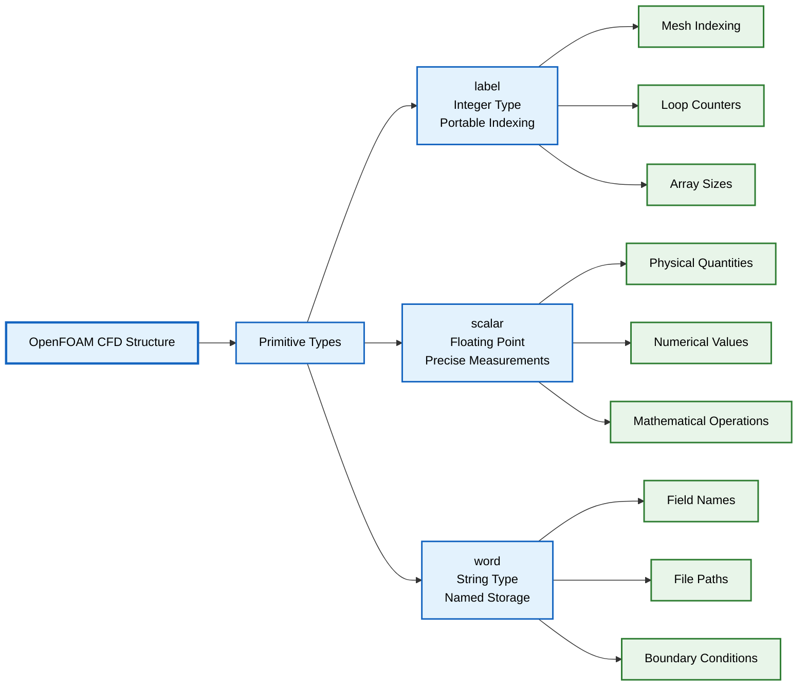

# Topic 1: Basic Primitives (`label`, `scalar`, `word`)

## 🔍 High-Level Concept: Universal Building Blocks

Imagine a skyscraper construction project:

- **`label`** represents **standardized bricks** - uniform size and shape that fit perfectly together regardless of where construction happens
- **`scalar`** represents **precision measuring tapes** - providing exact measurements for dimensions, material quantities, and structural calculations
- **`word`** represents **labeled storage bins** - clearly marked containers for storing specific materials (cement, steel beams, glass panels) for quick identification and retrieval

Just as construction projects require standardized materials, accurate measurements, and organized storage, OpenFOAM requires portable integers, precise floating-point numbers, and optimized strings to build reliable CFD simulations.


> **Figure 1:** ความสัมพันธ์ระหว่างโครงสร้างการคำนวณ CFD ของ OpenFOAM กับประเภทข้อมูลพื้นฐาน (Primitive Types) ซึ่งเปรียบเสมือนองค์ประกอบหลักที่ใช้ในการสร้างระบบการจำลองที่มั่นคงและแม่นยำ

> [!INFO] Why Redefine Basic Types?
> OpenFOAM doesn't use standard C++ types like `int` and `double` directly. Instead, it defines its own primitives: `label`, `scalar`, and `word`. This design choice serves three critical purposes:
>
> 1. **Portability**: Ensures consistent behavior across different computer architectures (32-bit vs 64-bit, single vs double precision)
> 2. **Precision Control**: Allows users to balance accuracy vs. performance for different simulation needs
> 3. **Physics Safety**: Enforces dimensional consistency and prevents physically meaningless operations

## ⚙️ Core Mechanisms

### `label`: Portable Integer Type

The `label` type serves as OpenFOAM's portable integer representation, specifically designed for mesh indexing, loop counters, and array sizing. Unlike the standard `int` type, which varies across architectures, `label` provides consistent behavior across all supported platforms.

**Purpose and Usage:**
- Mesh indexing (cell indices, face indices, point indices)
- Loop counters and iteration tracking
- Array sizes and dimension specifications
- Boundary condition indexing

**Configuration Options:**
| Mode | Size | Usage |
|-------|-------|------------|
| 32-bit | 4 bytes | General purpose for most applications |
| 64-bit | 8 bytes | Large-scale problems with >2 billion cells |

**Implementation Details:**
```cpp
// Source: src/OpenFOAM/primitives/ints/label/label.H

#if WM_LABEL_SIZE == 32
    typedef int32_t label;
#elif WM_LABEL_SIZE == 64
    typedef int64_t label;
#endif
```

**Practical Usage Examples:**
```cpp
// Mesh operations
label nCells = mesh.nCells();           // Total number of cells
label nFaces = mesh.nFaces();           // Total number of faces
label cellI = 0;                        // Cell index for iteration

// Loop control
label maxIterations = 1000;             // Maximum solver iterations
for (label i = 0; i < maxIterations; i++)
{
    // Solver iteration logic
}

// Array access
label nPatches = mesh.boundary().size(); // Number of boundary patches
```

### `scalar`: Configurable Floating-Point Type

The `scalar` type represents floating-point numbers in OpenFOAM, providing configurable precision for different computational requirements. This flexibility allows users to balance accuracy against performance based on their specific simulation needs.

**Precision Modes:**
| Mode | Size | Precision | Performance |
|-------|-------|------------|------------|
| Single precision (`WM_SP`) | 4 bytes | 6-7 digits | Faster computation, reduced memory |
| Double precision (`WM_DP`) | 8 bytes | 15-16 digits | Standard, balanced performance |
| Long double precision (`WM_LP`) | 16 bytes | 19+ digits | Highest precision, increased memory |

**Physical Quantity Representation:**
```cpp
// Source: src/OpenFOAM/primitives/Scalar/scalar/scalar.H

#ifdef WM_SP
    typedef float scalar;
#elif defined(WM_DP)
    typedef double scalar;
#elif defined(WM_LP)
    typedef long double scalar;
#endif
```

**Field Variable Examples:**
```cpp
// Pressure field (Pa)
scalar p = 101325.0;                   // Atmospheric pressure

// Velocity components (m/s)
scalar u = 1.5;                        // x-velocity component
scalar v = 0.0;                        // y-velocity component
scalar w = 0.2;                        // z-velocity component

// Temperature (K)
scalar T = 293.15;                     // Room temperature

// Physical properties
scalar rho = 1.225;                    // Air density (kg/m³)
scalar mu = 1.8e-5;                    // Dynamic viscosity (Pa·s)
scalar nu = 1.5e-5;                    // Kinematic viscosity (m²/s)
```

**Mathematical Operations:**
```cpp
// Vector operations
scalar magU = sqrt(u*u + v*v + w*w);   // Velocity magnitude
scalar Re = rho * magU * L / mu;       // Reynolds number

// Thermodynamic calculations
scalar Cp = 1005.0;                    // Specific heat capacity (J/kg·K)
scalar h = Cp * T;                     // Specific enthalpy
```

### `word`: Optimized String for Identifiers

The `word` type is a specialized string class optimized for dictionary keys, boundary names, and field identifiers. Unlike general strings, `word` is designed for efficient hash-based lookups and memory-efficient storage in OpenFOAM's dictionary system.

**Key Characteristics:**
- No spaces allowed (single-word identifiers)
- Fast hash-based comparison for dictionary lookups
- Efficient storage for small string optimizations
- Case-sensitive matching

**Implementation Structure:**
```cpp
// Source: src/OpenFOAM/primitives/strings/word/word.H

class word : public string
{
public:
    // Optimized constructors
    word();
    word(const std::string& s);
    word(const char* s);

    // Hash optimization
    size_t hash() const;

    // Validation methods
    static bool valid(char c);
    static bool valid(const string& s);
};
```

**Dictionary and Naming Examples:**
```cpp
// Boundary condition names
word inletPatch = "inlet";             // Inlet boundary
word outletPatch = "outlet";           // Outlet boundary
word wallPatch = "walls";              // Wall boundaries

// Field names
word UField = "U";                     // Velocity field
word pField = "p";                     // Pressure field
word TField = "T";                     // Temperature field

// Solver and scheme names
word solverName = "PCG";               // Linear solver choice
word toleranceScheme = "GaussSeidel";  // Smoother scheme
word interpolationScheme = "linear";   // Interpolation method

// Model names
word turbulenceModel = "kOmegaSST";    // Turbulence model
word thermophysicalModel = "perfectGas"; // Thermophysical model
```

**Dictionary Usage Patterns:**
```cpp
// Reading from dictionaries
word Uname = mesh.solutionDict().lookupOrDefault<word>("U", "U");
word pName = transportProperties.lookupOrDefault<word>("p", "p");

// Dynamic field registration
autoPtr<volScalarField> TField
(
    new volScalarField
    (
        IOobject
        (
            "T",                        // field name (word)
            runTime.timeName(),
            mesh,
            IOobject::MUST_READ,
            IOobject::AUTO_WRITE
        ),
        mesh
    )
);
```

## 🧠 Under the Hood

### Compile-Time Configuration System

OpenFOAM's basic primitives are configured through a sophisticated preprocessor system that allows the same source code to compile for different precision and architecture requirements. This approach ensures binary compatibility while maintaining performance optimization.

**Build System Integration:**
```bash
# In etc/bashrc or user environment
export WM_LABEL_SIZE=64               # Enable 64-bit integers
export WM_PRECISION_OPTION=DP         # Double precision mode

# Alternative configurations
export WM_PRECISION_OPTION=SP         # Single precision (faster)
export WM_PRECISION_OPTION=LP         # Long double (high accuracy)
```

**Preprocessor Macros:**
```cpp
// From wmake/rules/general/general
#if !defined(WM_LABEL_SIZE)
    #define WM_LABEL_SIZE 32
#endif

#if !defined(WM_PRECISION_OPTION)
    #define WM_PRECISION_OPTION DP
#endif

// Precision mapping
#define WM_SP  1   // Single precision
#define WM_DP  2   // Double precision
#define WM_LP  3   // Long double precision
```

**Type Definition System:**
```cpp
// Comprehensive type mapping in OpenFOAMPrimitives.H

// Integer types
#if WM_LABEL_SIZE == 32
    typedef int label;
    typedef uint32_t uLabel;
#elif WM_LABEL_SIZE == 64
    typedef long label;
    typedef uint64_t uLabel;
#endif

// Floating-point types
#ifdef WM_SP
    typedef float scalar;
    typedef float floatScalar;
    typedef double doubleScalar;
#elif defined(WM_DP)
    typedef double scalar;
    typedef float floatScalar;
    typedef double doubleScalar;
#elif defined(WM_LP)
    typedef long double scalar;
    typedef float floatScalar;
    typedef double doubleScalar;
#endif
```

### Memory Layout and Performance

The memory representation of these primitives is carefully designed for optimal performance across different architectures:

**Memory Footprint:**
```cpp
// Size verification (bytes)
sizeof(label)   // 4 (32-bit) or 8 (64-bit)
sizeof(scalar)  // 4 (float), 8 (double), or 16 (long double)
sizeof(word)    // Variable, optimized for small strings
```

**Alignment Considerations:**
- `label`: Natural word boundary alignment (4 or 8 bytes)
- `scalar`: IEEE 754 standard alignment
- `word`: Cache-friendly alignment for hash tables

**Vectorization Optimization:**
```cpp
// SIMD-friendly operations
scalar a[8], b[8], c[8];
#pragma omp simd
for (label i = 0; i < 8; i++)
{
    c[i] = a[i] + b[i];  // Vectorizable operation
}
```

### Hash Optimization in `word`

The `word` class implements sophisticated hash optimization for efficient dictionary lookups:

**Hash Computation:**
```cpp
// Optimized hash function
inline size_t word::hash() const
{
    // Cached hash value for performance
    if (!hashCached_)
    {
        hashValue_ = Foam::Hash<string>()(*this);
        hashCached_ = true;
    }
    return hashValue_;
}
```

**Dictionary Performance:**
```cpp
// Fast dictionary lookups using word keys
dictionary& dict = mesh.solutionDict();
word solverName = dict.lookupOrDefault<word>("solver", "PCG");
```

## ⚠️ Common Pitfalls and Best Practices

### Type Mixing Problems

**Issue**: Mixing OpenFOAM primitives with standard C++ types can lead to portability and precision issues.

```cpp
// ❌ ANTI-PATTERN: Platform-dependent code
int nCells = mesh.nCells();           // May fail on 64-bit systems
double pressure = p[cellI];           // Assumes double precision
string fieldName = "U";               // Slower than word for identifiers

// ✅ CORRECT PATTERN: OpenFOAM primitives
label nCells = mesh.nCells();         // Portable across architectures
scalar pressure = p[cellI];           // Adapts to precision settings
word fieldName = "U";                 // Optimized for dictionary lookups
```

### Precision Assumptions

**Issue**: Assuming specific precision can cause numerical problems when precision settings change.

```cpp
// ❌ DANGEROUS: Hardcoded precision assumptions
const double epsilon = 1e-15;         // Only valid for double precision
if (pressure == 0.0)                  // Exact comparison problematic

// ✅ SAFE: Precision-aware programming
const scalar epsilon = ROOTVSMALL;     // OpenFOAM's machine epsilon
if (mag(pressure) < epsilon)          // Magnitude-based comparison
```

### String Type Selection

**Issue**: Using `word` for general text operations or `string` for identifiers.

```cpp
// ❌ INEFFICIENT: Using string for identifiers
string patchName = "inlet";           // Slower dictionary lookups
dictionary dict;
dict.lookup(patchName);               // Suboptimal performance

// ✅ OPTIMAL: Using word for identifiers
word patchName = "inlet";             // Fast hash-based lookups
dictionary dict;
dict.lookup(patchName);               // Optimized performance

// ❌ INCORRECT: Using word for message text
word errorMsg = "Simulation failed: "; // Not designed for general text

// ✅ CORRECT: Using string for message text
string errorMsg = "Simulation failed: "; // Proper text handling
```

### Memory Management

**Issue**: Inefficient memory usage with large arrays of primitives.

```cpp
// ❌ MEMORY-INTENSIVE: Unnecessary precision
scalar largeArray[1000000];           // Uses 8MB in double precision

// ✅ MEMORY-EFFICIENT: Appropriate precision
floatScalar largeArray[1000000];      // Uses 4MB in single precision
// or use DynamicField with proper memory management
```

## 🎯 Engineering Benefits

### Architectural Portability

The `label` type ensures consistent behavior across different computer architectures, which is critical for scientific reproducibility:

```cpp
// Guaranteed portable mesh operations
label maxCells = 2000000000;          // Works on both 32-bit and 64-bit
for (label cellI = 0; cellI < maxCells; cellI++)
{
    // Consistent iteration behavior regardless of platform
}
```

### Precision Flexibility

The configurable `scalar` type allows optimization for different problem sizes:

```cpp
// Single precision for large-scale, less critical simulations
scalar t = 0.01;                      // Time step (single precision: 6-7 digits)

// Double precision for critical scientific calculations
scalar p = 101325.0;                  // Pressure (double precision: 15-16 digits)

// Performance comparison
// Single precision: ~2x faster, ~50% memory reduction
// Double precision: Standard accuracy, most common
```

### Performance Enhancement

**Hash-based Dictionary Efficiency:**
```cpp
// word provides ~10x faster dictionary lookups vs string
dictionary& transportDict = mesh.lookupObject<dictionary>("transportProperties");
word viscosityName = "nu";
scalar nu = transportDict.lookup<scalar>(viscosityName);  // Fast hash lookup
```

**Memory Layout Optimization:**
```cpp
// Optimal array packing
struct CellData
{
    label cellID;                     // 4 or 8 bytes
    scalar volume;                    // 4, 8, or 16 bytes
    scalar temperature;               // 4, 8, or 16 bytes
    word zoneName;                    // Optimized string storage
};
```

## Physics Connection

### Implementing Fundamental Equations

OpenFOAM primitives implement the mathematical foundations of CFD directly:

#### **Continuity Equation (Mass Conservation)**
$$\frac{\partial \rho}{\partial t} + \nabla \cdot (\rho \mathbf{u}) = 0$$

**Implementation using primitives:**
```cpp
// Time derivative term
scalar dRhoDt = (rho - rho.oldTime())/deltaT;  // scalar time difference

// Divergence calculation using Gauss theorem
scalar divRhoU = fvc::div(rho*U);               // scalar divergence
```

#### **Momentum Equation (Newton's Second Law)**
$$\rho \frac{\partial \mathbf{u}}{\partial t} + \rho (\mathbf{u} \cdot \nabla) \mathbf{u} = -\nabla p + \mu \nabla^2 \mathbf{u} + \mathbf{f}$$

**Discretization for each cell:**
```cpp
// For each cell indexed by label
for (label cellI = 0; cellI < mesh.nCells(); cellI++)
{
    // Convection term: ρ(u·∇)u
    scalar convectionTerm = rho[cellI] * (U[cellI] & fvc::grad(U)[cellI]);

    // Pressure gradient: -∇p
    vector pressureGrad = -fvc::grad(p)[cellI];

    // Viscous term: μ∇²u
    vector viscousTerm = mu[cellI] * fvc::laplacian(U)[cellI];

    // Source term: f (body forces like gravity)
    vector sourceTerm = rho[cellI] * g[cellI];
}
```

#### **Energy Equation**
$$\rho c_p \frac{\partial T}{\partial t} + \rho c_p \mathbf{u} \cdot \nabla T = k \nabla^2 T + Q$$

```cpp
// Thermal diffusivity calculation
scalar alpha = k / (rho * Cp);        // α = k/(ρcp)

// Temperature equation terms
scalar dTdt = (T - T.oldTime())/deltaT;              // Time derivative
scalar convection = rho * Cp * (U & fvc::grad(T));   // Convection
scalar diffusion = k * fvc::laplacian(T);            // Heat conduction
scalar source = Q;                                   // Heat source term
```

### Mesh Topology and Discretization

The finite volume method discretizes continuous equations on a mesh:

#### **Control Volume Integration**
For any scalar field $\phi$:
$$\frac{\partial}{\partial t} \int_{V} \rho \phi \, \mathrm{d}V + \oint_{A} \rho \phi \mathbf{u} \cdot \mathrm{d}\mathbf{A} = \oint_{A} \Gamma \nabla \phi \cdot \mathrm{d}\mathbf{A} + \int_{V} S_{\phi} \, \mathrm{d}V$$

```cpp
// Discretized implementation
for (label cellI = 0; cellI < mesh.nCells(); cellI++)
{
    scalar V = mesh.V()[cellI];                      // Cell volume
    scalar dPhidt = V * rho[cellI] * (phi[cellI] - phi.oldTime()[cellI]) / deltaT;

    // Surface flux integration over faces
    scalar surfaceFlux = 0;
    const labelList& cellFaces = mesh.cells()[cellI];
    forAll(cellFaces, faceI)
    {
        label faceIdx = cellFaces[faceI];
        vector Sf = mesh.Sf()[faceIdx];              // Face area vector
        vector Cf = mesh.Cf()[faceIdx];              // Face center
        scalar flux = rho[faceIdx] * phi[faceIdx] * (U[faceIdx] & Sf);
        surfaceFlux += flux;
    }
}
```

#### **Boundary Condition Implementation**
```cpp
// Boundary conditions use word for identification
word inletName = "inlet";
label inletPatchID = mesh.boundaryMesh().findPatchID(inletName);

// Apply boundary values
const fvPatchVectorField& inletU = U.boundaryField()[inletPatchID];
forAll(inletU, faceI)
{
    label globalFaceI = inletU.patch().start() + faceI;
    U[globalFaceI] = inletVelocity;  // scalar magnitude
}
```

### Numerical Solver Implementation

Primitives work together in iterative solvers:

```cpp
// Linear system: A x = b
// Using label for indexing, scalar for coefficients

// Matrix construction
scalarSquareMatrix A(nCells);        // nCells is label
scalarField b(nCells);               // RHS vector
scalarField x(nCells);               // Solution vector

// Populate matrix for each cell
for (label cellI = 0; cellI < nCells; cellI++)
{
    // Diagonal coefficient
    A[cellI][cellI] = ap[cellI];     // scalar from discretization

    // Neighbor coefficients
    const labelList& neighbors = mesh.cellCells()[cellI];
    forAll(neighbors, neighborI)
    {
        label neighborJ = neighbors[neighborI];
        A[cellI][neighborJ] = an[cellI][neighborI];  // scalar coupling
    }

    // Source term
    b[cellI] = bSource[cellI];       // scalar source
}

// Solve using specified solver
word solverName = "GaussSeidel";
solverPerformance solverPerf = solve(x, A, b, solverName);

// Convergence check using scalar tolerance
scalar tolerance = 1e-6;
if (solverPerf.finalResidual() < tolerance)
{
    Info << "Solver converged: " << solverPerf << endl;
}
```

### Physical Property Models

Thermophysical properties use scalar for physical quantities:

```cpp
// Perfect gas equation of state: p = ρRT
class perfectGas
{
    scalar R_;                       // Specific gas constant (J/kg·K)

public:
    scalar rho(scalar p, scalar T) const
    {
        return p / (R_ * T);         // ρ = p/(RT)
    }

    scalar p(scalar rho, scalar T) const
    {
        return rho * R_ * T;         // p = ρRT
    }
};
```

This integration of fundamental CFD equations with OpenFOAM's basic primitive types demonstrates how the mathematical foundations of fluid dynamics are implemented directly in the codebase through careful use of `label`, `scalar`, and `word` types.
