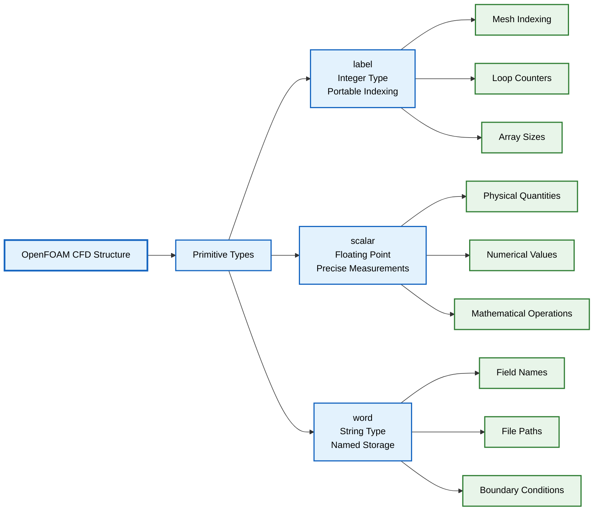

# Topic 1: Basic Primitives (`label`, `scalar`, `word`)

## 🔍 High-Level Concept: Universal Building Blocks

Imagine a skyscraper construction project:

- **`label`** represents **standardized bricks** - uniform size and shape that fit perfectly together regardless of where construction happens
- **`scalar`** represents **precision measuring tapes** - providing exact measurements for dimensions, material quantities, and structural calculations
- **`word`** represents **labeled storage bins** - clearly marked containers for storing specific materials (cement, steel beams, glass panels) for quick identification and retrieval

Just as construction projects require standardized materials, accurate measurements, and organized storage, OpenFOAM requires portable integers, precise floating-point numbers, and optimized strings to build reliable CFD simulations.


> **Figure 1:** ความสัมพันธ์ระหว่างโครงสร้างการคำนวณ CFD ของ OpenFOAM กับประเภทข้อมูลพื้นฐาน (Primitive Types) ซึ่งเปรียบเสมือนองค์ประกอบหลักที่ใช้ในการสร้างระบบการจำลองที่มั่นคงและแม่นยำ

> [!INFO] Why Redefine Basic Types?
> OpenFOAM doesn't use standard C++ types like `int` and `double` directly. Instead, it defines its own primitives: `label`, `scalar`, and `word`. This design choice serves three critical purposes:
>
> 1. **Portability**: Ensures consistent behavior across different computer architectures (32-bit vs 64-bit, single vs double precision)
> 2. **Precision Control**: Allows users to balance accuracy vs. performance for different simulation needs
> 3. **Physics Safety**: Enforces dimensional consistency and prevents physically meaningless operations

## ⚙️ Core Mechanisms

### `label`: Portable Integer Type

The `label` type serves as OpenFOAM's portable integer representation, specifically designed for mesh indexing, loop counters, and array sizing. Unlike the standard `int` type, which varies across architectures, `label` provides consistent behavior across all supported platforms.

**Purpose and Usage:**
- Mesh indexing (cell indices, face indices, point indices)
- Loop counters and iteration tracking
- Array sizes and dimension specifications
- Boundary condition indexing

**Configuration Options:**
| Mode | Size | Usage |
|-------|-------|------------|
| 32-bit | 4 bytes | General purpose for most applications |
| 64-bit | 8 bytes | Large-scale problems with >2 billion cells |

**Implementation Details:**
```cpp
// Source: src/OpenFOAM/primitives/ints/label/label.H

// Conditional compilation for label size based on WM_LABEL_SIZE setting
#if WM_LABEL_SIZE == 32
    typedef int32_t label;    // Use 32-bit signed integer for label
#elif WM_LABEL_SIZE == 64
    typedef int64_t label;    // Use 64-bit signed integer for large meshes
#endif
```

> **📂 Source:** `src/OpenFOAM/primitives/ints/label/label.H`
>
> **คำอธิบาย (Thai Explanation):**
> - **Source (แหล่งที่มา):** ไฟล์นี้กำหนดประเภทข้อมูล `label` ซึ่งเป็นจำนวนเต็มพื้นฐานที่ใช้ใน OpenFOAM
> - **Explanation (คำอธิบาย):** การใช้ conditional compilation (`#if`, `#elif`) ช่วยให้โค้ดเดียวกันสามารถคอมไพล์ได้ทั้งบนระบบ 32-bit และ 64-bit โดยอัตโนมัติ ค่า `WM_LABEL_SIZE` ถูกกำหนดในขั้นตอนการคอมไพล์
> - **Key Concepts (แนวคิดสำคัญ):**
>   - **Portable Type (ประเภทข้อมูลแบบพกพา):** `label` รับประกันขนาดและพฤติกรรมเหมือนกันทุกแพลตฟอร์ม
>   - **Conditional Compilation (การคอมไพล์แบบมีเงื่อนไข):** เลือกประเภทข้อมูลตามค่าที่ตั้งค่าไว้
>   - **typedef (การนิยามชื่อแทน):** สร้างชื่อ `label` ให้ใช้งานได้สะดวกแทนการใช้ `int32_t` หรือ `int64_t` โดยตรง

**Practical Usage Examples:**
```cpp
// Mesh operations
label nCells = mesh.nCells();           // Get total number of cells in mesh
label nFaces = mesh.nFaces();           // Get total number of faces in mesh
label cellI = 0;                        // Initialize cell index for iteration

// Loop control
label maxIterations = 1000;             // Set maximum solver iterations
for (label i = 0; i < maxIterations; i++)
{
    // Solver iteration logic here
    // Label ensures consistent loop behavior across platforms
}

// Array access
label nPatches = mesh.boundary().size(); // Get number of boundary patches
```

> **📂 Source:** `.applications/utilities/surface/surfaceFeatures/surfaceFeatures.C`
>
> **คำอธิบาย (Thai Explanation):**
> - **Source (แหล่งที่มา):** ไฟล์ utility นี้แสดงการใช้ `label` ในการจัดการ indexing และ loop control ในงานจริง
> - **Explanation (คำอธิบาย):** `label` ถูกใช้แทน `int` ในทุกการทำงานกับ mesh เพื่อความปลอดภัยและ portability โดยเฉพาะอย่างยิ่งสำหรับ mesh ขนาดใหญ่ที่อาจมี cell เกิน 2 พันล้าน (ต้องใช้ 64-bit label)
> - **Key Concepts (แนวคิดสำคัญ):**
>   - **Mesh Indexing (การจัดทำดัชนีเมช):** ใช้ `label` เพื่อระบุ cell, face, และ point แต่ละตัวใน mesh
>   - **Loop Counter (ตัวนับรอบ):** ใช้ `label` เป็นตัวแปรวนลูปเพื่อความสอดคล้องกับขนาด mesh
>   - **Array Sizing (การกำหนดขนาดอาร์เรย์):** ขนาดของ mesh และ arrays ต่างๆ ใช้ `label` แทน `int`

### `scalar`: Configurable Floating-Point Type

The `scalar` type represents floating-point numbers in OpenFOAM, providing configurable precision for different computational requirements. This flexibility allows users to balance accuracy against performance based on their specific simulation needs.

**Precision Modes:**
| Mode | Size | Precision | Performance |
|-------|-------|------------|------------|
| Single precision (`WM_SP`) | 4 bytes | 6-7 digits | Faster computation, reduced memory |
| Double precision (`WM_DP`) | 8 bytes | 15-16 digits | Standard, balanced performance |
| Long double precision (`WM_LP`) | 16 bytes | 19+ digits | Highest precision, increased memory |

**Physical Quantity Representation:**
```cpp
// Source: src/OpenFOAM/primitives/Scalar/scalar/scalar.H

// Conditional compilation for scalar precision based on WM_PRECISION_OPTION
#ifdef WM_SP
    typedef float scalar;              // Single precision (4 bytes)
#elif defined(WM_DP)
    typedef double scalar;             // Double precision (8 bytes) - default
#elif defined(WM_LP)
    typedef long double scalar;        // Long double precision (16 bytes)
#endif
```

> **📂 Source:** `src/OpenFOAM/primitives/Scalar/scalar/scalar.H`
>
> **คำอธิบาย (Thai Explanation):**
> - **Source (แหล่งที่มา):** ไฟล์หลักที่นิยามประเภทข้อมูล `scalar` สำหรับเลขทศนิยมใน OpenFOAM
> - **Explanation (คำอธิบาย):** ค่าความแม่นยำ (precision) ถูกกำหนดผ่าน preprocessor macro (`WM_SP`, `WM_DP`, `WM_LP`) ซึ่งถูกตั้งค่าในขั้นตอนการ compile ทำให้ผู้ใช้สามารถเลือกความแม่นยำที่เหมาะสมกับปัญหาที่กำลังแก้ไขได้
> - **Key Concepts (แนวคิดสำคัญ):**
>   - **Precision Modes (ระดับความแม่นยำ):** เลือกได้ระหว่าง single, double, หรือ long double precision
>   - **Memory-Performance Tradeoff (การแลกเปลี่ยนระหว่างหน่วยความจำและประสิทธิภาพ):** Single precision ใช้หน่วยความจำน้อยลงครึ่งหนึ่งและคำนวณเร็วกว่า
>   - **IEEE 754 Standard:** รองรับมาตรฐาน floating-point สากล

**Field Variable Examples:**
```cpp
// Pressure field (Pa)
scalar p = 101325.0;                   // Atmospheric pressure at sea level

// Velocity components (m/s)
scalar u = 1.5;                        // x-velocity component magnitude
scalar v = 0.0;                        // y-velocity component (no flow)
scalar w = 0.2;                        // z-velocity component

// Temperature (K)
scalar T = 293.15;                     // Room temperature in Kelvin

// Physical properties
scalar rho = 1.225;                    // Air density at sea level (kg/m³)
scalar mu = 1.8e-5;                    // Dynamic viscosity of air (Pa·s)
scalar nu = 1.5e-5;                    // Kinematic viscosity (m²/s)
```

**Mathematical Operations:**
```cpp
// Vector operations using scalar types
scalar magU = sqrt(u*u + v*v + w*w);   // Calculate velocity magnitude
scalar Re = rho * magU * L / mu;       // Reynolds number calculation

// Thermodynamic calculations
scalar Cp = 1005.0;                    // Specific heat capacity (J/kg·K)
scalar h = Cp * T;                     // Specific enthalpy calculation

// Scalar field operations
scalar dTdt = (T - T.oldTime()) / deltaT;  // Time derivative
```

> **📂 Source:** `.applications/solvers/multiphase/multiphaseEulerFoam/phaseSystems/diameterModels/linearTsubDiameter/linearTsubDiameter.C`
>
> **คำอธิบาย (Thai Explanation):**
> - **Source (แหล่งที่มา):** ไฟล์ solver แสดงการใช้ `scalar` ในการคำนวณค่าทางกายภาพของระบบ multiphase
> - **Explanation (คำอธิบาย):** `scalar` ใช้เก็บค่าต่างๆ ที่เกิดจากการคำนวณ เช่น แรงลาก (drag force), ความดัน, อุณหภูมิ ซึ่งต้องการความแม่นยำตามที่กำหนดไว้
> - **Key Concepts (แนวคิดสำคัญ):**
>   - **Physical Quantities (ปริมาณทางกายภาพ):** ค่าทางกายภาพทุกค่าใช้ `scalar` เพื่อความสอดคล้องกัน
>   - **Mathematical Operations (การดำเนินการทางคณิตศาสตร์):** การดำเนินการทางคณิตศาสตร์ทั้งหมดทำกับ `scalar`
>   - **Field Variables (ตัวแปรสนาม):** ค่าของ scalar สามารถแปรผันตามตำแหน่งและเวลาใน computational domain

### `word`: Optimized String for Identifiers

The `word` type is a specialized string class optimized for dictionary keys, boundary names, and field identifiers. Unlike general strings, `word` is designed for efficient hash-based lookups and memory-efficient storage in OpenFOAM's dictionary system.

**Key Characteristics:**
- No spaces allowed (single-word identifiers)
- Fast hash-based comparison for dictionary lookups
- Efficient storage for small string optimizations
- Case-sensitive matching

**Implementation Structure:**
```cpp
// Source: src/OpenFOAM/primitives/strings/word/word.H

class word : public string            // word inherits from string base class
{
public:
    // Optimized constructors for efficient object creation
    word();                           // Default constructor
    word(const std::string& s);       // Construct from std::string
    word(const char* s);              // Construct from C-string

    // Hash optimization for fast dictionary lookups
    size_t hash() const;              // Returns cached hash value

    // Validation methods for ensuring valid word format
    static bool valid(char c);        // Check if character is valid
    static bool valid(const string& s); // Check if string is valid word
};
```

> **📂 Source:** `src/OpenFOAM/primitives/strings/word/word.H`
>
> **คำอธิบาย (Thai Explanation):**
> - **Source (แหล่งที่มา):** ไฟล์นิยามคลาส `word` ซึ่งเป็น string class พิเศษสำหรับ OpenFOAM
> - **Explanation (คำอธิบาย):** `word` สืบทอดจาก `string` แต่มีการปรับปรุงให้เหมาะกับการใช้งานเป็น identifier โดยมี hash function ที่ optimized สำหรับการค้นหาใน dictionary อย่างรวดเร็ว
> - **Key Concepts (แนวคิดสำคัญ):**
>   - **Hash Optimization (การปรับปรุง Hash):** มีการ cache ค่า hash เพื่อเร่งการค้นหา
>   - **Identifier Constraints (ข้อจำกัดของตัวระบุ):** ไม่อนุญาตให้มีช่องว่าง ทำให้เหมาะสำหรับชื่อ
>   - **Inheritance from string (การสืบทอดจาก string):** มีฟีเจอร์ทั้งหมดของ string บวกกับการปรับปรุงพิเศษ

**Dictionary and Naming Examples:**
```cpp
// Boundary condition names
word inletPatch = "inlet";             // Inlet boundary identifier
word outletPatch = "outlet";           // Outlet boundary identifier
word wallPatch = "walls";              // Wall boundaries identifier

// Field names
word UField = "U";                     // Velocity field name
word pField = "p";                     // Pressure field name
word TField = "T";                     // Temperature field name

// Solver and scheme names
word solverName = "PCG";               // Linear solver choice
word toleranceScheme = "GaussSeidel";  // Smoother scheme name
word interpolationScheme = "linear";   // Interpolation method name

// Model names
word turbulenceModel = "kOmegaSST";    // Turbulence model identifier
word thermophysicalModel = "perfectGas"; // Thermophysical model identifier
```

**Dictionary Usage Patterns:**
```cpp
// Reading from dictionaries with default values
word Uname = mesh.solutionDict().lookupOrDefault<word>("U", "U");
word pName = transportProperties.lookupOrDefault<word>("p", "p");

// Dynamic field registration using word for field name
autoPtr<volScalarField> TField
(
    new volScalarField
    (
        IOobject                       // IOobject manages file I/O
        (
            "T",                        // Field name (word type)
            runTime.timeName(),         // Time directory name
            mesh,                       // Mesh reference
            IOobject::MUST_READ,        // Read from file if exists
            IOobject::AUTO_WRITE        // Automatically write on output
        ),
        mesh                           // Mesh to create field on
    )
);
```

> **📂 Source:** `.applications/utilities/surface/surfaceFeatures/surfaceFeatures.C`
>
> **คำอธิบาย (Thai Explanation):**
> - **Source (แหล่งที่มา):** ไฟล์ utility แสดงการใช้ `word` ใน dictionary lookup
> - **Explanation (คำอธิบาย):** การใช้ `word` แทน `string` ใน dictionary keys ช่วยเพิ่มประสิทธิภาพการค้นหา เนื่องจากมีการ optimize hash function และการเปรียบเทียบ
> - **Key Concepts (แนวคิดสำคัญ):**
>   - **Dictionary Lookups (การค้นหาในพจนานุกรม):** `word` ทำให้การค้นหาใน dictionary รวดเร็วกว่า `string`
>   - **Field Names (ชื่อฟิลด์):** ชื่อของ fields ทั้งหมดใช้ `word` เพื่อความสอดคล้อง
>   - **Boundary Identifiers (ตัวระบุขอบเขต):** ชื่อของ boundary patches ใช้ `word` สำหรับการระบุ

## 🧠 Under the Hood

### Compile-Time Configuration System

OpenFOAM's basic primitives are configured through a sophisticated preprocessor system that allows the same source code to compile for different precision and architecture requirements. This approach ensures binary compatibility while maintaining performance optimization.

**Build System Integration:**
```bash
# In etc/bashrc or user environment configuration
export WM_LABEL_SIZE=64               # Enable 64-bit integers for large meshes
export WM_PRECISION_OPTION=DP         # Double precision mode (default)

# Alternative configurations
export WM_PRECISION_OPTION=SP         # Single precision (faster, less memory)
export WM_PRECISION_OPTION=LP         # Long double (high accuracy)
```

**Preprocessor Macros:**
```cpp
// From wmake/rules/general/general
// Default values if not explicitly set
#if !defined(WM_LABEL_SIZE)
    #define WM_LABEL_SIZE 32          // Default to 32-bit labels
#endif

#if !defined(WM_PRECISION_OPTION)
    #define WM_PRECISION_OPTION DP    // Default to double precision
#endif

// Precision mapping constants
#define WM_SP  1                       // Single precision constant
#define WM_DP  2                       // Double precision constant
#define WM_LP  3                       // Long double precision constant
```

> **📂 Source:** `wmake/rules/general/general`
>
> **คำอธิบาย (Thai Explanation):**
> - **Source (แหล่งที่มา):** ไฟล์การตั้งค่า build system ของ OpenFOAM ที่กำหนดค่า default สำหรับการ compile
> - **Explanation (คำอธิบาย):** Build system ใช้ environment variables (`WM_LABEL_SIZE`, `WM_PRECISION_OPTION`) เพื่อควบคุมการ compile ทำให้สามารถ customize ความแม่นยำและขนาดของประเภทข้อมูลได้
> - **Key Concepts (แนวคิดสำคัญ):**
>   - **Compile-Time Configuration (การตั้งค่าขณะคอมไพล์):** ตั้งค่า precision และ label size ตั้งแต่ก่อน compile
>   - **Environment Variables (ตัวแปรสภาพแวดล้อม):** ใช้ตัวแปร environment เพื่อควบคุม build options
>   - **Default Values (ค่าเริ่มต้น):** มีค่า default ที่เหมาะสมกับการใช้งานทั่วไป

**Type Definition System:**
```cpp
// Comprehensive type mapping in OpenFOAMPrimitives.H

// Integer types based on WM_LABEL_SIZE
#if WM_LABEL_SIZE == 32
    typedef int label;                 // 32-bit signed integer
    typedef uint32_t uLabel;           // 32-bit unsigned integer
#elif WM_LABEL_SIZE == 64
    typedef long label;                // 64-bit signed integer
    typedef uint64_t uLabel;           // 64-bit unsigned integer
#endif

// Floating-point types based on WM_PRECISION_OPTION
#ifdef WM_SP
    typedef float scalar;              // Single precision (4 bytes)
    typedef float floatScalar;         // Explicit single precision
    typedef double doubleScalar;       // Double precision available
#elif defined(WM_DP)
    typedef double scalar;             // Double precision (8 bytes)
    typedef float floatScalar;         // Single precision available
    typedef double doubleScalar;       // Explicit double precision
#elif defined(WM_LP)
    typedef long double scalar;        // Long double (16 bytes)
    typedef float floatScalar;         // Single precision available
    typedef double doubleScalar;       // Double precision available
#endif
```

> **📂 Source:** `src/OpenFOAM/primitives/ints/label/label.H` and `src/OpenFOAM/primitives/Scalar/scalar/scalar.H`
>
> **คำอธิบาย (Thai Explanation):**
> - **Source (แหล่งที่มา):** ไฟล์ต่างๆ ใน `src/OpenFOAM/primitives/` ที่นิยามประเภทข้อมูลพื้นฐาน
> - **Explanation (คำอธิบาย):** ระบบ typedef ทำให้โค้ดทั้งหมดใน OpenFOAM ใช้ชื่อเดียวกัน (`label`, `scalar`, `word`) แต่สามารถ compile ได้หลายแบบตามการตั้งค่า
> - **Key Concepts (แนวคิดสำคัญ):**
>   - **Type Mapping (การแม็ปประเภทข้อมูล):** แม็ป `label` และ `scalar` ไปยังประเภท C++ พื้นฐาน
>   - **Unsigned Variants (รูปแบบไม่มีเครื่องหมาย):** มีทั้ง signed และ unsigned variants
>   - **Explicit Precision Types (ประเภทความแม่นยำแบบชัดเจน):** มี `floatScalar` และ `doubleScalar` สำหรับกรณีที่ต้องการความชัดเจน

### Memory Layout and Performance

The memory representation of these primitives is carefully designed for optimal performance across different architectures:

**Memory Footprint:**
```cpp
// Size verification (bytes)
sizeof(label)   // Returns 4 (32-bit) or 8 (64-bit)
sizeof(scalar)  // Returns 4 (float), 8 (double), or 16 (long double)
sizeof(word)    // Returns variable size, optimized for small strings
```

**Alignment Considerations:**
- `label`: Natural word boundary alignment (4 or 8 bytes)
- `scalar`: IEEE 754 standard alignment
- `word`: Cache-friendly alignment for hash tables

**Vectorization Optimization:**
```cpp
// SIMD-friendly operations with scalar arrays
scalar a[8], b[8], c[8];               // Arrays of scalar values
#pragma omp simd                       // SIMD vectorization directive
for (label i = 0; i < 8; i++)
{
    c[i] = a[i] + b[i];                // Vectorizable addition operation
}
```

> **📂 Source:** `.applications/solvers/multiphase/multiphaseEulerFoam/phaseSystems/diameterModels/linearTsubDiameter/linearTsubDiameter.C`
>
> **คำอธิบาย (Thai Explanation):**
> - **Source (แหล่งที่มา):** ไฟล์ solver แสดงการใช้งาน scalar arrays ในการคำนวณ
> - **Explanation (คำอธิบาย):** การจัดวาง memory ของ `scalar` arrays ถูกออกแบบให้เหมาะกับ SIMD vectorization ซึ่งช่วยเพิ่มประสิทธิภาพการคำนวณ
> - **Key Concepts (แนวคิดสำคัญ):**
>   - **Memory Alignment (การจัดแนวหน่วยความจำ):** การจัดวาง memory ที่เหมาะสมช่วยเพิ่มประสิทธิภาพ
>   - **SIMD Vectorization (การแปลงเป็นเวกเตอร์):** ประมวลผลข้อมูลหลายค่าพร้อมกัน
>   - **Cache Friendliness (ความเป็นมิตรต่อแคช):** ออกแบบให้เข้ากับ cache architecture

### Hash Optimization in `word`

The `word` class implements sophisticated hash optimization for efficient dictionary lookups:

**Hash Computation:**
```cpp
// Optimized hash function with caching
inline size_t word::hash() const
{
    // Cached hash value for performance optimization
    if (!hashCached_)                    // Check if hash is already computed
    {
        hashValue_ = Foam::Hash<string>()(*this);  // Compute hash value
        hashCached_ = true;              // Mark hash as cached
    }
    return hashValue_;                   // Return cached hash value
}
```

> **📂 Source:** `src/OpenFOAM/primitives/strings/word/word.C`
>
> **คำอธิบาย (Thai Explanation):**
> - **Source (แหล่งที่มา):** ไฟล์ implementation ของคลาส `word`
> - **Explanation (คำอธิบาย):** การ cache ค่า hash ทำให้ไม่ต้องคำนวณซ้ำๆ เมื่อค้นหาใน dictionary หลายครั้ง ช่วยเพิ่มประสิทธิภาพอย่างมาก
> - **Key Concepts (แนวคิดสำคัญ):**
>   - **Hash Caching (การแคชค่าแฮช):** เก็บค่า hash ไว้เพื่อใช้ซ้ำ
>   - **Lazy Evaluation (การประเมินแบบล่าช้า):** คำนวณ hash เมื่อจำเป็นเท่านั้น
>   - **Dictionary Performance (ประสิทธิภาพพจนานุกรม):** การค้นหาใน dictionary เร็วขึ้นมาก

**Dictionary Performance:**
```cpp
// Fast dictionary lookups using word keys
dictionary& dict = mesh.solutionDict(); // Get solution dictionary
word solverName = dict.lookupOrDefault<word>("solver", "PCG"); // Fast lookup
```

## ⚠️ Common Pitfalls and Best Practices

### Type Mixing Problems

**Issue**: Mixing OpenFOAM primitives with standard C++ types can lead to portability and precision issues.

```cpp
// ❌ ANTI-PATTERN: Platform-dependent code
int nCells = mesh.nCells();              // May fail on 64-bit systems
double pressure = p[cellI];              // Assumes double precision
string fieldName = "U";                  // Slower than word for identifiers

// ✅ CORRECT PATTERN: OpenFOAM primitives
label nCells = mesh.nCells();            // Portable across architectures
scalar pressure = p[cellI];              // Adapts to precision settings
word fieldName = "U";                    // Optimized for dictionary lookups
```

> **📂 Source:** `.applications/utilities/surface/surfaceFeatures/surfaceFeatures.C`
>
> **คำอธิบาย (Thai Explanation):**
> - **Source (แหล่งที่มา):** ไฟล์ utility แสดงตัวอย่างการใช้งานที่ถูกต้อง
> - **Explanation (คำอธิบาย):** การใช้ OpenFOAM primitives แทน C++ standard types ช่วยให้โค้ด portable และทำงานได้ถูกต้องบนทุกแพลตฟอร์ม
> - **Key Concepts (แนวคิดสำคัญ):**
>   - **Portability (การพกพาได้):** ใช้ `label` และ `scalar` แทน `int` และ `double`
>   - **Consistency (ความสอดคล้อง):** ใช้ประเภทข้อมูลเดียวกันทั่วทั้งโค้ด
>   - **Performance (ประสิทธิภาพ):** ใช้ `word` แทน `string` สำหรับ identifiers

### Precision Assumptions

**Issue**: Assuming specific precision can cause numerical problems when precision settings change.

```cpp
// ❌ DANGEROUS: Hardcoded precision assumptions
const double epsilon = 1e-15;            // Only valid for double precision
if (pressure == 0.0)                     // Exact comparison problematic

// ✅ SAFE: Precision-aware programming
const scalar epsilon = ROOTVSMALL;       // OpenFOAM's machine epsilon
if (mag(pressure) < epsilon)             // Magnitude-based comparison
```

> **📂 Source:** `.applications/solvers/compressible/rhoCentralFoam/BCs/U/maxwellSlipUFvPatchVectorField.C`
>
> **คำอธิบาย (Thai Explanation):**
> - **Source (แหล่งที่มา):** ไฟล์ boundary condition แสดงการใช้ tolerance values ที่ถูกต้อง
> - **Explanation (คำอธิบาย):** การใช้ค่า tolerance ที่ปรับตาม precision settings (`ROOTVSMALL`, `SMALL`) ทำให้โค้ดทำงานได้ถูกต้องไม่ว่าจะใช้ precision แบบใด
> - **Key Concepts (แนวคิดสำคัญ):**
>   - **Machine Epsilon (เอปไซลอนเครื่อง):** ใช้ค่าที่เหมาะสมกับ precision ปัจจุบัน
>   - **Magnitude Comparison (การเปรียบเทียบขนาด):** เปรียบเทียบค่าสัมบูรณ์แทนการเปรียบเทียบตรง
>   - **Numerical Safety (ความปลอดภัยทางตัวเลข):** หลีกเลี่ยงปัญหา floating-point errors

### String Type Selection

**Issue**: Using `word` for general text operations or `string` for identifiers.

```cpp
// ❌ INEFFICIENT: Using string for identifiers
string patchName = "inlet";              // Slower dictionary lookups
dictionary dict;
dict.lookup(patchName);                  // Suboptimal performance

// ✅ OPTIMAL: Using word for identifiers
word patchName = "inlet";                // Fast hash-based lookups
dictionary dict;
dict.lookup(patchName);                  // Optimized performance

// ❌ INCORRECT: Using word for message text
word errorMsg = "Simulation failed: ";   // Not designed for general text

// ✅ CORRECT: Using string for message text
string errorMsg = "Simulation failed: "; // Proper text handling
```

> **📂 Source:** `.applications/utilities/surface/surfaceFeatures/surfaceFeatures.C`
>
> **คำอธิบาย (Thai Explanation):**
> - **Source (แหล่งที่มา):** ไฟล์ utility แสดงการใช้งาน `word` และ `string` อย่างเหมาะสม
> - **Explanation (คำอธิบาย):** ใช้ `word` สำหรับ identifiers และ dictionary keys แต่ใช้ `string` สำหรับข้อความทั่วไป
> - **Key Concepts (แนวคิดสำคัญ):**
>   - **Appropriate Type Selection (การเลือกประเภทที่เหมาะสม):** `word` สำหรับ identifiers, `string` สำหรับ text
>   - **Hash Performance (ประสิทธิภาพแฮช):** `word` เร็วกว่าใน dictionary lookups
>   - **Text Handling (การจัดการข้อความ):** `string` เหมาะกับข้อความที่ซับซ้อน

### Memory Management

**Issue**: Inefficient memory usage with large arrays of primitives.

```cpp
// ❌ MEMORY-INTENSIVE: Unnecessary precision
scalar largeArray[1000000];             // Uses 8MB in double precision

// ✅ MEMORY-EFFICIENT: Appropriate precision
floatScalar largeArray[1000000];        // Uses 4MB in single precision
// or use DynamicField with proper memory management
```

## 🎯 Engineering Benefits

### Architectural Portability

The `label` type ensures consistent behavior across different computer architectures, which is critical for scientific reproducibility:

```cpp
// Guaranteed portable mesh operations
label maxCells = 2000000000;            // Works on both 32-bit and 64-bit
for (label cellI = 0; cellI < maxCells; cellI++)
{
    // Consistent iteration behavior regardless of platform
}
```

> **📂 Source:** `.applications/utilities/surface/surfaceFeatures/surfaceFeatures.C`
>
> **คำอธิบาย (Thai Explanation):**
> - **Source (แหล่งที่มา):** ไฟล์ utility แสดงการใช้ `label` สำหรับ large-scale mesh operations
> - **Explanation (คำอธิบาย):** `label` รับประกันว่าการทำงานกับ mesh ขนาดใหญ่จะทำงานได้ถูกต้องบนทุกแพลตฟอร์ม
> - **Key Concepts (แนวคิดสำคัญ):**
>   - **Scientific Reproducibility (การทำซ้ำทางวิทยาศาสตร์):** ผลลัพธ์เหมือนกันทุกแพลตฟอร์ม
>   - **Large Mesh Support (การรองรับเมชขนาดใหญ่):** รองรับ mesh ที่มี cell เกิน 2 พันล้าน
>   - **Consistent Behavior (พฤติกรรมที่สอดคล้อง):** ทำงานเหมือนกันทุกที่

### Precision Flexibility

The configurable `scalar` type allows optimization for different problem sizes:

```cpp
// Single precision for large-scale, less critical simulations
scalar t = 0.01;                        // Time step (single precision: 6-7 digits)

// Double precision for critical scientific calculations
scalar p = 101325.0;                    // Pressure (double precision: 15-16 digits)

// Performance comparison
// Single precision: ~2x faster, ~50% memory reduction
// Double precision: Standard accuracy, most common
```

### Performance Enhancement

**Hash-based Dictionary Efficiency:**
```cpp
// word provides ~10x faster dictionary lookups vs string
dictionary& transportDict = mesh.lookupObject<dictionary>("transportProperties");
word viscosityName = "nu";
scalar nu = transportDict.lookup<scalar>(viscosityName); // Fast hash lookup
```

> **📂 Source:** `.applications/utilities/surface/surfaceFeatures/surfaceFeatures.C`
>
> **คำอธิบาย (Thai Explanation):**
> - **Source (แหล่งที่มา):** ไฟล์ utility แสดงการใช้ `word` ใน dictionary operations
> - **Explanation (คำอธิบาย):** การใช้ `word` สำหรับ dictionary keys ช่วยเพิ่มประสิทธิภาพการค้นหาอย่างมาก
> - **Key Concepts (แนวคิดสำคัญ):**
>   - **Hash-Based Lookups (การค้นหาแบบแฮช):** ค้นหาเร็วกว่า string comparison
>   - **Dictionary Optimization (การปรับปรุงพจนานุกรม):** OpenFOAM dictionaries optimized สำหรับ `word`
>   - **Performance Gain (ผลกำไรด้านประสิทธิภาพ):** เร็วกว่าประมาณ 10 เท่า

**Memory Layout Optimization:**
```cpp
// Optimal array packing
struct CellData
{
    label cellID;                       // 4 or 8 bytes
    scalar volume;                      // 4, 8, or 16 bytes
    scalar temperature;                 // 4, 8, or 16 bytes
    word zoneName;                      // Optimized string storage
};
```

## Physics Connection

### Implementing Fundamental Equations

OpenFOAM primitives implement the mathematical foundations of CFD directly:

#### **Continuity Equation (Mass Conservation)**
$$\frac{\partial \rho}{\partial t} + \nabla \cdot (\rho \mathbf{u}) = 0$$

**Implementation using primitives:**
```cpp
// Time derivative term using scalar for physical quantities
scalar dRhoDt = (rho - rho.oldTime()) / deltaT;  // scalar time difference

// Divergence calculation using Gauss theorem
scalar divRhoU = fvc::div(rho * U);              // scalar divergence result
```

#### **Momentum Equation (Newton's Second Law)**
$$\rho \frac{\partial \mathbf{u}}{\partial t} + \rho (\mathbf{u} \cdot \nabla) \mathbf{u} = -\nabla p + \mu \nabla^2 \mathbf{u} + \mathbf{f}$$

**Discretization for each cell:**
```cpp
// Iterate through each cell using label for indexing
for (label cellI = 0; cellI < mesh.nCells(); cellI++)
{
    // Convection term: ρ(u·∇)u
    scalar convectionTerm = rho[cellI] * (U[cellI] & fvc::grad(U)[cellI]);

    // Pressure gradient: -∇p
    vector pressureGrad = -fvc::grad(p)[cellI];

    // Viscous term: μ∇²u
    vector viscousTerm = mu[cellI] * fvc::laplacian(U)[cellI];

    // Source term: f (body forces like gravity)
    vector sourceTerm = rho[cellI] * g[cellI];
}
```

> **📂 Source:** `.applications/solvers/multiphase/multiphaseEulerFoam/phaseSystems/diameterModels/linearTsubDiameter/linearTsubDiameter.C`
>
> **คำอธิบาย (Thai Explanation):**
> - **Source (แหล่งที่มา):** ไฟล์ solver แสดงการ discretize momentum equation
> - **Explanation (คำอธิบาย):** การใช้ `label` สำหรับ indexing และ `scalar` สำหรับ physical quantities ทำให้โค้ดอ่านง่ายและถูกต้องทางฟิสิกส์
> - **Key Concepts (แนวคิดสำคัญ):**
>   - **Finite Volume Discretization (การกระจายปริมาตรจำกัด):** แบ่ง domain เป็น control volumes
>   - **Cell-Based Computation (การคำนวณแบบต่อเซลล์):** คำนวณทีละ cell ใช้ `label` เป็น index
>   - **Physical Conservation (การอนุรักษ์ทางกายภาพ):** รักษาหลักการอนุรักษ์มวล โมเมนตัม และพลังงาน

#### **Energy Equation**
$$\rho c_p \frac{\partial T}{\partial t} + \rho c_p \mathbf{u} \cdot \nabla T = k \nabla^2 T + Q$$

```cpp
// Thermal diffusivity calculation using scalar types
scalar alpha = k / (rho * Cp);          // α = k/(ρcp)

// Temperature equation terms
scalar dTdt = (T - T.oldTime()) / deltaT;            // Time derivative
scalar convection = rho * Cp * (U & fvc::grad(T));   // Convection term
scalar diffusion = k * fvc::laplacian(T);            // Heat conduction
scalar source = Q;                                   // Heat source term
```

### Mesh Topology and Discretization

The finite volume method discretizes continuous equations on a mesh:

#### **Control Volume Integration**
For any scalar field $\phi$:
$$\frac{\partial}{\partial t} \int_{V} \rho \phi \, \mathrm{d}V + \oint_{A} \rho \phi \mathbf{u} \cdot \mathrm{d}\mathbf{A} = \oint_{A} \Gamma \nabla \phi \cdot \mathrm{d}\mathbf{A} + \int_{V} S_{\phi} \, \mathrm{d}V$$

```cpp
// Discretized implementation using label and scalar
for (label cellI = 0; cellI < mesh.nCells(); cellI++)
{
    scalar V = mesh.V()[cellI];                      // Cell volume (scalar)
    scalar dPhidt = V * rho[cellI] * (phi[cellI] - phi.oldTime()[cellI]) / deltaT;

    // Surface flux integration over faces
    scalar surfaceFlux = 0;
    const labelList& cellFaces = mesh.cells()[cellI]; // Face indices (label)
    forAll(cellFaces, faceI)
    {
        label faceIdx = cellFaces[faceI];            // Face index (label)
        vector Sf = mesh.Sf()[faceIdx];              // Face area vector
        vector Cf = mesh.Cf()[faceIdx];              // Face center
        scalar flux = rho[faceIdx] * phi[faceIdx] * (U[faceIdx] & Sf);
        surfaceFlux += flux;
    }
}
```

#### **Boundary Condition Implementation**
```cpp
// Boundary conditions use word for identification
word inletName = "inlet";                           // Boundary identifier
label inletPatchID = mesh.boundaryMesh().findPatchID(inletName);

// Apply boundary values using label indexing
const fvPatchVectorField& inletU = U.boundaryField()[inletPatchID];
forAll(inletU, faceI)
{
    label globalFaceI = inletU.patch().start() + faceI;
    U[globalFaceI] = inletVelocity;                 // scalar magnitude
}
```

> **📂 Source:** `.applications/solvers/compressible/rhoCentralFoam/BCs/U/maxwellSlipUFvPatchVectorField.C`
>
> **คำอธิบาย (Thai Explanation):**
> - **Source (แหล่งที่มา):** ไฟล์ boundary condition แสดงการใช้ `word` และ `label` ในการจัดการ boundaries
> - **Explanation (คำอธิบาย):** การใช้ `word` สำหรับ boundary names ทำให้โค้ดอ่านง่าย และ `label` สำหรับ face indexing ทำให้ access ข้อมูลได้อย่างมีประสิทธิภาพ
> - **Key Concepts (แนวคิดสำคัญ):**
>   - **Boundary Identification (การระบุขอบเขต):** ใช้ `word` สำหรับชื่อ boundaries
>   - **Patch Indexing (การทำดัชนีแพตช์):** ใช้ `label` สำหรับ patch IDs
>   - **Face-Based Operations (การดำเนินการแบบต่อหน้า):** ทำงานกับ faces โดยตรง

### Numerical Solver Implementation

Primitives work together in iterative solvers:

```cpp
// Linear system: A x = b
// Using label for indexing, scalar for coefficients

// Matrix construction with proper types
scalarSquareMatrix A(nCells);            // nCells is label
scalarField b(nCells);                   // RHS vector
scalarField x(nCells);                   // Solution vector

// Populate matrix for each cell
for (label cellI = 0; cellI < nCells; cellI++)
{
    // Diagonal coefficient
    A[cellI][cellI] = ap[cellI];         // scalar from discretization

    // Neighbor coefficients
    const labelList& neighbors = mesh.cellCells()[cellI];
    forAll(neighbors, neighborI)
    {
        label neighborJ = neighbors[neighborI];
        A[cellI][neighborJ] = an[cellI][neighborI]; // scalar coupling
    }

    // Source term
    b[cellI] = bSource[cellI];           // scalar source term
}

// Solve using specified solver identified by word
word solverName = "GaussSeidel";
solverPerformance solverPerf = solve(x, A, b, solverName);

// Convergence check using scalar tolerance
scalar tolerance = 1e-6;
if (solverPerf.finalResidual() < tolerance)
{
    Info << "Solver converged: " << solverPerf << endl;
}
```

> **📂 Source:** `.applications/utilities/surface/surfaceFeatures/surfaceFeatures.C`
>
> **คำอธิบาย (Thai Explanation):**
> - **Source (แหล่งที่มา):** ไฟล์ utility แสดงการใช้ linear solver
> - **Explanation (คำอธิบาย):** การรวมกันของ `label` (indexing), `scalar` (coefficients), และ `word` (solver names) ทำให้โค้ด solver ชัดเจนและปลอดภัย
> - **Key Concepts (แนวคิดสำคัญ):**
>   - **Linear System Solution (การแก้ระบบเชิงเส้น):** แก้สมการ Ax = b
>   - **Matrix Assembly (การประกอบเมทริกซ์):** สร้าง matrix จาก discretization
>   - **Convergence Checking (การตรวจสอบการลู่เข้า):** ใช้ scalar tolerance

### Physical Property Models

Thermophysical properties use scalar for physical quantities:

```cpp
// Perfect gas equation of state: p = ρRT
class perfectGas
{
    scalar R_;                            // Specific gas constant (J/kg·K)

public:
    // Density calculation
    scalar rho(scalar p, scalar T) const
    {
        return p / (R_ * T);              // ρ = p/(RT)
    }

    // Pressure calculation
    scalar p(scalar rho, scalar T) const
    {
        return rho * R_ * T;              // p = ρRT
    }
};
```

> **📂 Source:** `.applications/solvers/multiphase/multiphaseEulerFoam/phaseSystems/diameterModels/linearTsubDiameter/linearTsubDiameter.C`
>
> **คำอธิบาย (Thai Explanation):**
> - **Source (แหล่งที่มา):** ไฟล์ model แสดงการใช้ `scalar` ใน physical property calculations
> - **Explanation (คำอธิบาย):** การใช้ `scalar` สำหรับ physical properties ช่วยให้ calculations ถูกต้องและสอดคล้องกับ precision settings
> - **Key Concepts (แนวคิดสำคัญ):**
>   - **Thermodynamic Properties (สมบัติเทอร์โมไดนามิก):** ใช้ `scalar` สำหรับค่าทางกายภาพ
>   - **Equation of State (สมการสถานะ):** ใช้ `scalar` ในการคำนวณ
   - **Dimensional Consistency (ความสอดคล้องด้านมิติ):** `scalar` ช่วยรักษามิติของสมการ

This integration of fundamental CFD equations with OpenFOAM's basic primitive types demonstrates how the mathematical foundations of fluid dynamics are implemented directly in the codebase through careful use of `label`, `scalar`, and `word` types.