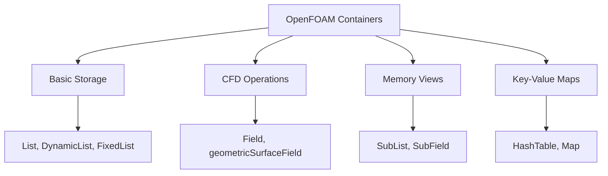
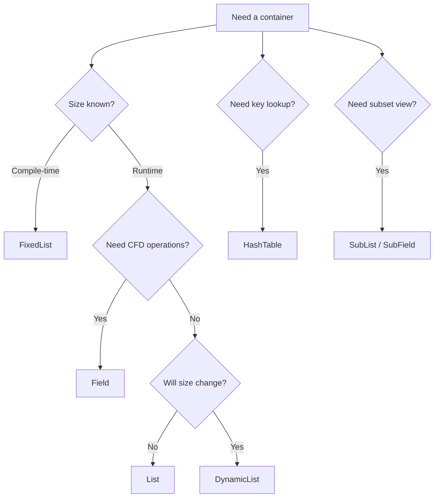

# Container System

ระบบ Container ใน OpenFOAM — List, Field, HashTable และอื่นๆ

---

## 🎯 Learning Objectives

**Learning Objectives:**
- Identify the different container types in OpenFOAM and their purposes
- Understand the key differences between List, DynamicList, and FixedList
- Recognize when to use Field vs List for CFD operations
- Apply SubList and SubField for memory-efficient data views
- Use forAll macro and iteration patterns consistently
- Select appropriate container types based on performance requirements

**เป้าหมายการเรียนรู้:**
- จำแนกประเภท container ใน OpenFOAM และวัตถุประสงค์การใช้งาน
- เข้าใจความแตกต่างระหว่าง List, DynamicList และ FixedList
- เลือกใช้ Field หรือ List อย่างเหมาะสมสำหรับ CFD operations
- ใช้ SubList และ SubField สำหรับ data views ที่ประหยัด memory
- ใช้ forAll macro และ iteration patterns อย่างสอดคล้อง
- เลือก container types ที่เหมาะสมโดยคำนึงถึง performance

---

## What are OpenFOAM Containers?

> **💡 คิดแบบนี้:**
> OpenFOAM Containers = **STL + CFD + Performance**
>
> - `Field` มี `max()`, `sum()` ที่ `vector` ไม่มี
> - `SubList` = view ไม่ copy → ประหยัด memory
> - `forAll` = cleaner syntax + consistent style

**What:** OpenFOAM provides specialized container classes optimized for CFD operations, offering built-in mathematical operations, efficient memory management, and seamless integration with the mesh and field I/O systems.

**Why:**
- **Performance optimizations** for field operations (max, sum, average)
- **Memory efficiency** through SubList/SubField views without copying
- **CFD-specific functionality** not available in standard STL containers
- **Consistent coding style** across OpenFOAM codebase with forAll macro
- **Mesh-aware operations** for boundary conditions, cell/face access

**How they fit into OpenFOAM:**



---

## 1. List Types

### List<T>

**What:** Dynamic array container with OpenFOAM I/O compatibility, similar to `std::vector` but optimized for OpenFOAM's file system.

**Why:**
- General-purpose storage when size is known or can be resized
- OpenFOAM dictionary I/O support (read/write from case files)
- Efficient memory allocation patterns

**How:**
```cpp
// Fixed size array
List<scalar> values(100, 0.0);

// Access
values[0] = 1.0;
scalar first = values.first();
scalar last = values.last();

// Size
label n = values.size();
values.resize(200);

// Copy
List<scalar> copy = values;  // Deep copy
```

**When to Use:**
- Storing boundary face indices
- Coordinate lists for geometry
- General array operations without CFD math

---

### DynamicList<T>

**What:** Growable list with pre-allocation support, optimized for building arrays incrementally.

**Why:**
- Avoids repeated reallocation when final size is unknown
- Pre-allocation reduces memory fragmentation
- Efficient append operations

**How:**
```cpp
// Growable list
DynamicList<label> indices;

// Add elements
indices.append(5);
indices.append(10);

// Pre-allocate for efficiency
DynamicList<label> big;
big.reserve(1000);  // Allocate space for 1000 elements

// Convert to List (no copy if size matches)
List<label> finalList = big;
```

**When to Use:**
- Building cell/face lists during mesh processing
- Collecting indices during refinement
- Dynamic neighbor list construction

---

### FixedList<T, N>

**What:** Compile-time fixed-size array with stack allocation.

**Why:**
- Stack allocation = no heap overhead
- Size known at compile time enables optimizations
- Ideal for small, fixed-size collections

**How:**
```cpp
// Compile-time fixed size
FixedList<scalar, 3> rgb;
rgb[0] = 1.0;  // R
rgb[1] = 0.5;  // G
rgb[2] = 0.0;  // B

// Vector is actually FixedList<scalar, 3>
vector v = vector(1, 2, 3);  // Same as FixedList<scalar, 3>

// Operations
scalar sum = 0;
forAll(rgb, i)
{
    sum += rgb[i];
}
```

**When to Use:**
- RGB color values
- 3D coordinates (x, y, z)
- Small fixed collections (tensor components)

---

## Comparison Table: List vs DynamicList vs FixedList

| Container | Size Known | Allocation | When to Use | Performance |
|-----------|-----------|------------|-------------|-------------|
| `List<T>` | Runtime | Heap | General arrays, I/O | Good for most cases |
| `DynamicList<T>` | Runtime | Heap (growable) | Building lists incrementally | Best with `reserve()` |
| `FixedList<T,N>` | Compile-time | Stack | Small, fixed-size data | Fastest (no allocation) |

**Selection Guide:**
- Use **FixedList** for small, fixed collections (3-6 elements)
- Use **DynamicList** when building lists (unknown final size)
- Use **List** for general storage and I/O operations

---

## 2. HashTable

**What:** Key-value hash map with case-insensitive string keys, optimized for dictionary lookups.

**Why:**
- Fast O(1) average lookup for property access
- Case-insensitive keys (OpenFOAM convention)
- Flexible key types (word, string, label)

**How:**
```cpp
// String-keyed hash
HashTable<scalar, word> props;

// Insert
props.insert("density", 1000);
props["viscosity"] = 1e-6;

// Lookup
scalar rho = props["density"];

// Check existence
if (props.found("temperature"))
{
    Info << "Temperature: " << props["temperature"] << endl;
}

// Iterate
forAllConstIters(props, iter)
{
    Info << iter.key() << ": " << iter.val() << endl;
}

// Remove
props.erase("viscosity");
```

**When to Use:**
- Property dictionaries (transport properties, thermophysical properties)
- Named boundary condition parameters
- Quick lookup tables for material properties

**Why Subsection - HashTable vs Map:**
- **HashTable:** Case-insensitive, OpenFOAM I/O compatible
- **Map:** Standard C++ behavior, case-sensitive
- **Use HashTable** for OpenFOAM dictionaries and user inputs

---

## 3. Field<T>

**What:** CFD-optimized array with built-in mathematical operations (max, min, sum, average) and vector operations.

**Why:**
- **Field-specific operations** not available in standard containers
- **Element-wise math** without manual loops
- **Optimized performance** for CFD calculations

**How:**
```cpp
// CFD-optimized array with operations
scalarField T(100, 300.0);
vectorField U(100, vector::zero);

// Math operations
scalarField T2 = sqr(T);
scalar maxT = max(T);
scalar minT = min(T);
scalar avgT = average(T);
scalar sumT = sum(T);

// Vector operations
scalarField magU = mag(U);
vectorField normalized = U / (mag(U) + SMALL);

// Element-wise operations
scalarField T_plus_10 = T + 10.0;
scalarField T_squared = T * T;
scalarField sqrt_T = sqrt(T);
```

**Field vs List - Key Differences:**

| Feature | List<T> | Field<T> |
|---------|---------|----------|
| CFD operations (max, sum, average) | ❌ | ✅ |
| Element-wise math (+, -, *, /) | ❌ | ✅ |
| Vector operations (mag, sqr) | ❌ | ✅ |
| Memory layout | Same | Same |
| I/O compatibility | ✅ | ✅ |
| Use case | General storage | CFD calculations |

**When to Use Field:**
- Temperature, pressure, velocity arrays
- Cell/face data requiring mathematical operations
- Boundary condition values
- Any array needing CFD-specific math

**When to Use List:**
- Index arrays (cell labels, face labels)
- Coordinate lists
- General storage without math operations

---

## 4. forAll Macro

**What:** OpenFOAM iteration macro for cleaner, consistent loop syntax across the codebase.

**Why:**
- **Consistent style** - All OpenFOAM code uses the same pattern
- **Cleaner syntax** - More readable than traditional for loops
- **Type-safe** - Automatically gets correct size
- **Supports reverse iteration** with forAllReverse

**How:**
```cpp
scalarField field(100, 0.0);

// Forward iteration
forAll(field, i)
{
    field[i] = compute(i);
}

// Equivalent to:
for (label i = 0; i < field.size(); i++)
{
    field[i] = compute(i);
}

// Reverse iteration
forAllReverse(field, i)
{
    Info << field[i] << endl;
}

// Nested iteration (cells and faces)
forAll(mesh.cells(), cellI)
{
    const cell& c = mesh.cells()[cellI];
    forAll(c, faceI)
    {
        label facei = c[faceI];
        // Process face
    }
}
```

**Best Practices:**
- Always use `forAll` instead of raw for loops on OpenFOAM containers
- Use `forAllConstIters` for iterating over HashTable or Map
- Use `forAllReverse` when processing from end to beginning

---

## 5. SubList and SubField

**What:** View into existing data without copying - provides a window into a portion of a list or field.

**Why:**
- **Memory efficiency** - No data duplication
- **Performance** - Zero-copy access to subsets
- **Convenience** - Clean syntax for working with data segments

**How:**
```cpp
// SubList - View into List
List<scalar> data(100);
forAll(data, i)
{
    data[i] = i * 1.5;
}

// Create SubList: 20 elements starting at index 10
SubList<scalar> sub(data, 20, 10);

// Access through SubList
Info << "First element: " << sub.first() << endl;  // data[10]
Info << "Last element: " << sub.last() << endl;    // data[29]

// SubField - View into Field
scalarField full(100);
forAll(full, i)
{
    full[i] = scalar(i);
}

// First 50 elements
SubField<scalar> partial(full, 50);

// Elements 25-75
SubField<scalar> middle(full, 50, 25);
```

**Practical Use Cases:**

| Use Case | Example | Benefit |
|----------|---------|---------|
| Boundary face data | `SubField(mesh.boundary()[patchID])` | Access BC data without copy |
| Cell zones | `SubField(zoneCells)` | Process zone subset |
| Time windows | `SubField(timeHistory, windowSize)` | Sliding window analysis |
| Parallel decomposition | `SubField(fullField, start, n)` | Zero-copy domain splitting |

**SubList vs Copy:**
```cpp
// ❌ Inefficient: Creates copy
List<scalar> copy = List<scalar>(data, 20, 10);

// ✅ Efficient: Zero-copy view
SubList<scalar> view(data, 20, 10);
```

---

## 6. Sorting and Searching

**What:** Built-in sorting and ordering operations for OpenFOAM containers.

**How:**
```cpp
List<scalar> values = {3.5, 1.2, 4.8, 2.1};

// Sort in place (ascending)
sort(values);  // {1.2, 2.1, 3.5, 4.8}

// Sort with indices (get original positions)
labelList order;
sortedOrder(values, order);
// values: {1.2, 2.1, 3.5, 4.8}
// order: {1, 3, 0, 2} (original indices)

// Apply order to another list
List<vector> vectors = {...};
List<vector> sortedVectors = UList<vector>(vectors, order);
```

**When to Use:**
- Finding extreme values (max/min with locations)
- Organizing cell data by properties
- Preparing data for interpolation

---

## Quick Reference

| Container | Use Case | Key Features |
|-----------|----------|--------------|
| `List<T>` | Fixed array, I/O | OpenFOAM I/O compatible |
| `DynamicList<T>` | Growable lists | `reserve()`, `append()` |
| `FixedList<T,N>` | Compile-time size | Stack allocation |
| `Field<T>` | CFD operations | max(), sum(), average() |
| `HashTable<T,K>` | Key-value lookup | Case-insensitive keys |
| `SubList<T>` | View (no copy) | Zero-copy subset access |
| `SubField<T>` | Field view | For Field<T> subsets |

---

## 🚦 Decision Guide



---

## 🧠 Concept Check

<details>
<summary><b>1. Field vs List ต่างกันอย่างไร?</b></summary>

**Field** มี CFD operations ที่ **List** ไม่มี:
- `max()`, `min()`, `average()`, `sum()`
- Element-wise math: `+`, `-`, `*`, `/`
- Vector operations: `mag()`, `sqr()`, `sqrt()`

**กฎ:** ถ้าต้องการ CFD math → ใช้ `Field`
</details>

<details>
<summary><b>2. SubList ดีอย่างไร?</b></summary>

**No copy** — แค่ view เข้าไปใน data เดิม:
- Memory efficient (ไม่ใช้ memory เพิ่ม)
- Zero-copy access
- เหมาะสำหรับ boundary patches, cell zones, time windows
</details>

<details>
<summary><b>3. forAll ดีกว่า for loop อย่างไร?</b></summary>

**Cleaner syntax** และ **consistent with OpenFOAM style:**
- All OpenFOAM code ใช้ pattern เดียวกัน
- อ่านง่ายกว่า: `forAll(field, i)` vs `for (label i = 0; i < field.size(); i++)`
- Support reverse iteration: `forAllReverse(field, i)`
</details>

<details>
<summary><b>4. DynamicList vs List - เมื่อไหร่ใช้ตัวไหน?</b></summary>

| | DynamicList | List |
|-|-------------|------|
| Use case | สร้าง list ทีละ element (ไม่รู้ขนาดสุดท้าย) | รู้ขนาดตั้งแต่แรก หรือ resize น้อย |
| Efficiency | ใช้ `reserve()` เพื่อประหยัด memory | กำหนด size ตั้งแต่เริ่ม |
| Example | รวม cell neighbors ระหว่าง mesh generation | Coordinate lists |

**กฎ:** สร้าง list → `DynamicList`, รู้ size → `List`
</details>

---

## 🎯 Key Takeaways

**Container Selection:**
- **List<T>** for general storage and I/O operations
- **DynamicList<T>** for building lists incrementally with `reserve()`
- **FixedList<T,N>** for small, compile-time fixed collections
- **Field<T>** for arrays requiring CFD mathematical operations
- **SubList<T>/SubField<T>** for zero-copy subset access

**Best Practices:**
- Always use `forAll` macro instead of raw for loops
- Use `Field` when you need CFD operations (max, sum, average)
- Use `SubList` instead of copying data subsets
- Pre-allocate `DynamicList` with `reserve()` for efficiency
- Choose `HashTable` for dictionary-style lookups

**Performance Tips:**
- Use `FixedList` for small collections (stack allocation)
- Pre-allocate `DynamicList` to avoid repeated reallocation
- Use `SubList` for boundary patch access (no copy)
- Leverage `Field` operations (optimized implementations)

---

## 📖 Related Documentation

**Within This Module:**
- **Overview:** [00_Overview.md](00_Overview.md) — Module roadmap
- **Introduction:** [01_Introduction.md](01_Introduction.md) — Primitive type concepts
- **Memory Management:** [04_Smart_Pointers.md](04_Smart_Pointers.md) — Container memory handling
- **Basic Primitives:** [02_Basic_Primitives.md](02_Basic_Primitives.md) — scalar, vector types

**Cross-Module References:**
- **Mesh Structures:** See `MODULE_02_MESHING_AND_CASE_SETUP/CONTENT/01_MESHING_FUNDAMENTALS/02_OpenFOAM_Mesh_Structure.md` for container usage in mesh data
- **Field Operations:** Refer to `MODULE_03_SINGLE_PHASE_FLOW/CONTENT/01_INCOMPRESSIBLE_FLOW_SOLVERS/02_Standard_Solvers.md` for practical field applications
