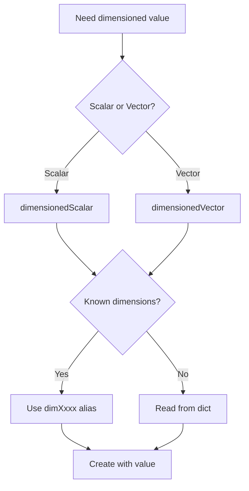

# Dimensioned Types Introduction

บทนำ Dimensioned Types — ระบบตรวจสอบหน่วยอัตโนมัติ

## Learning Objectives

หลังจากอ่านบทนี้ คุณจะสามารถ:
- **อธิบาย** แนวคิดและประโยชน์ของ dimensioned types ใน OpenFOAM
- **ใช้งาน** dimensionSet และ 7 SI base dimensions ได้อย่างถูกต้อง
- **เลือกใช้** dimensionedScalar และ dimensionedVector ที่เหมาะสมกับงาน
- **ตรวจสอบ** dimensional consistency ของสมการและ operations
- **อ่านและเขียน** dimensioned values ใน dictionary files

---

## 1. What are Dimensioned Types?

> **💡 คิดแบบนี้:**
> `dimensionedScalar` = **ตัวเลข + ป้ายบอกหน่วย**
>
> เหมือนเขียน "1000 kg/m³" แทน "1000"
> ถ้าพยายามบวก "1000 kg/m³" + "10 m/s" → รู้ทันทีว่าผิด

```cpp
dimensionedScalar rho("rho", dimDensity, 1000);
// Name: "rho"
// Units: [M L^-3] = kg/m³
// Value: 1000
```

**ประเภทหลัก:**
- `dimensionedScalar` — ตัวเลขประกอบด้วยหน่วย (scalar + units)
- `dimensionedVector` — เวกเตอร์ประกอบด้วยหน่วย (vector + units)
- `dimensionSet` — ชุดของมิติ (SI dimensions)

---

## 2. Why Dimensioned Types?

| ปัญหา | ผลกระทบ | Dimensioned Types ช่วยอย่างไร |
|-------|---------|------------------------------|
| ลืมแปลงหน่วย | ผลลัพธ์ผิด 1000x | Dimension mismatch error |
| บวก/ลบค่าต่าง units | Physics ผิด | Compile/runtime error |
| Debug ยาก | หา bug ไม่เจอ | Error บอกตำแหน่งชัด |

### Real-world Example

```cpp
// ❌ Without dimension checking (ผิดแต่ compile ผ่าน)
double p = 1000;    // Pa? kPa? bar?
double U = 10;      // m/s? km/h?
double result = p + U;  // = 1010... แต่ไม่มีความหมาย!

// ✅ With dimension checking
dimensionedScalar p("p", dimPressure, 1000);
dimensionedScalar U("U", dimVelocity, 10);
// p + U;  // ERROR! Dimension mismatch
```

### Benefits

1. **Physics Safety** — ป้องกันการบวกลบค่าที่มีหน่วยไม่ตรงกัน
2. **Self-Documenting** — โค้ดบอกหน่วยเองโดยไม่ต้อง comment
3. **Unit Conversion** — บังคับใช้ SI units ทุกที่
4. **Debugging Aid** — error messages บอก dimension ที่ไม่ตรง

---

## 3. How Dimensioned Types Work

### 3.1 dimensionSet — ระบบหน่วย SI

```cpp
// 7 SI base dimensions: [M, L, T, Θ, I, N, J]
// Mass, Length, Time, Temperature, Current, Moles, Luminous Intensity

dimensionSet(1, -3, 0, 0, 0, 0, 0)  // Density: kg/m³ = [M L^-3]
```

**การอ่าน dimensionSet:**
```
[1, -3, 0, 0, 0, 0, 0]
 ↓   ↓  ↓  ↓  ↓  ↓  ↓
 M  L^-3 T^0 Θ^0 I^0 N^0 J^0
= kg/m³
```

### 3.2 Common Dimension Aliases

| Alias | Value | Unit | Use Case |
|-------|-------|------|----------|
| `dimless` | `[0 0 0 0 0 0 0]` | - | Coefficients, ratios |
| `dimLength` | `[0 1 0 0 0 0 0]` | m | Distance, position |
| `dimTime` | `[0 0 1 0 0 0 0]` | s | Time, time step |
| `dimMass` | `[1 0 0 0 0 0 0]` | kg | Mass |
| `dimVelocity` | `[0 1 -1 0 0 0 0]` | m/s | Velocity |
| `dimAcceleration` | `[0 1 -2 0 0 0 0]` | m/s² | Acceleration, gravity |
| `dimPressure` | `[1 -1 -2 0 0 0 0]` | Pa | Pressure, stress |
| `dimDensity` | `[1 -3 0 0 0 0 0]` | kg/m³ | Density |
| `dimKinematicViscosity` | `[0 2 -1 0 0 0 0]` | m²/s | ν (nu) |
| `dimDynamicViscosity` | `[1 -1 -1 0 0 0 0]` | Pa·s | μ (mu) |

### 3.3 dimensionedScalar — ใช้บ่อยที่สุด

> **Properties ส่วนใหญ่เป็น scalar** — density, viscosity, pressure

```cpp
// Create: name, dimensions, value
dimensionedScalar rho("rho", dimDensity, 1000);
dimensionedScalar nu("nu", dimKinematicViscosity, 1e-6);

// Access methods
word n = rho.name();           // "rho"
dimensionSet d = rho.dimensions();  // [M L^-3]
scalar v = rho.value();        // 1000
```

### 3.4 dimensionedVector — Vector Properties

```cpp
dimensionedVector g
(
    "g",              // Name
    dimAcceleration,  // [L T^-2]
    vector(0, 0, -9.81)  // Value
);

// Access components
scalar gz = g.value().z();  // -9.81

// Vector operations
dimensionedScalar gh = g & h;  // Dot product with position
```

---

## 4. Dimension Checking in Action

### 4.1 Valid Operations

```cpp
dimensionedScalar rho("rho", dimDensity, 1000);      // [M L^-3]
dimensionedScalar U("U", dimVelocity, 10);           // [L T^-1]

// Dynamic pressure: 0.5 * ρ * U²
// [M L^-3] * [L T^-1]² = [M L^-3] * [L² T^-2] = [M L^-1 T^-2] = [Pa]
dimensionedScalar dynP = 0.5 * rho * sqr(U);  // ✅ OK

// Dynamic viscosity: μ = ρν
dimensionedScalar nu("nu", dimKinematicViscosity, 1e-6);  // [L² T^-1]
dimensionedScalar mu = rho * nu;  // [M L^-3] * [L² T^-1] = [M L^-1 T^-1]
// mu is automatically dimDynamicViscosity!
```

### 4.2 Invalid Operations — Dimension Mismatch

```cpp
dimensionedScalar p("p", dimPressure, 1000);  // [M L^-1 T^-2]
dimensionedScalar U("U", dimVelocity, 10);    // [L T^-1]

// p + U → [M L^-1 T^-2] + [L T^-1] = ???
// ERROR: Cannot add pressure + velocity

// dimensionedScalar bad = p + U;  // ❌ Runtime error!
```

**Error message:**
```
--> FOAM FATAL ERROR:
LHS and RHS of + have different dimensions
dimensions: [1 -1 -2 0 0 0 0] + [0 1 -1 0 0 0 0]
```

---

## 5. Reading from Dictionary

> **ทำไมสำคัญ?**
> ส่วนใหญ่ค่าจะอ่านจาก file ไม่ได้ hardcode

### 5.1 Dictionary Format

```cpp
// In constant/transportProperties:
// name name [dimensions] value;
rho rho [1 -3 0 0 0 0 0] 1000;
//  ↑    ↑              ↑
// keyword  dimensions     value
```

### 5.2 Reading in Code

```cpp
// Method 1: Known dimensions
IOdictionary transportProperties(...);
dimensionedScalar rho("rho", dimDensity, transportProperties);

// Method 2: Unknown dimensions (read from dict)
dimensionedScalar nu(transportProperties.lookup("nu"));
```

---

## 6. Common Usage Patterns

### 6.1 Characteristic Scales

```cpp
dimensionedScalar L("L", dimLength, 0.1);        // Length scale
dimensionedScalar Uref("Uref", dimVelocity, 1.0);  // Velocity scale
dimensionedScalar tRef = L / Uref;  // Time scale: [L] / [L T^-1] = [T]
```

### 6.2 Dimensionless Numbers

```cpp
// Reynolds number: Re = ρUL/μ
dimensionedScalar Re = rho * U * L / mu;
// [M L^-3] * [L T^-1] * [L] * [M^-1 L T] = [1] = dimless

// Verify
if (Re.dimensions() == dimless) {
    Info << "Re is dimensionless ✓" << endl;
}
```

### 6.3 Safe Operations

```cpp
// Always specify dimensions when creating
dimensionedScalar small("small", dimless, SMALL);  // Machine precision
dimensionedScalar great("great", dimless, GREAT);  // Large number

// Use in stabilization
rho / max(rho, small);  // ป้องกัน divide by zero
```

---

## 7. Decision Guide — Which Type to Use?



**Quick Decision Table:**

| Scenario | Type | Example |
|----------|------|---------|
| Material properties | `dimensionedScalar` | density, viscosity |
| Vector fields | `dimensionedVector` | gravity, velocity |
| From dictionary | Both | `lookup()` method |
| Hardcoded constants | `dimensionedScalar` | `dimensionedScalar("x", dimLength, 1.0)` |

---

## 8. Common Pitfalls

### ❌ Pitfall 1: Forgetting SI Units

```cpp
// Wrong: Using cm instead of m
dimensionedScalar L("L", dimLength, 10);  // 10 cm? No, must be 0.1 m!

// Correct: Always use SI (meters, kg, seconds)
dimensionedScalar L("L", dimLength, 0.1);  // 10 cm = 0.1 m
```

### ❌ Pitfall 2: Mixing dimensioned and non-dimensioned

```cpp
// Wrong: Can't add dimensioned + plain scalar
dimensionedScalar rho("rho", dimDensity, 1000);
scalar val = 500;
// auto sum = rho + val;  // ERROR!

// Correct: Use dimensionedScalar for both
dimensionedScalar valDim("val", dimDensity, 500);
auto sum = rho + valDim;  // OK
```

### ❌ Pitfall 3: Assuming automatic conversion

```cpp
// Wrong: Assumes pressure converts to density
dimensionedScalar p("p", dimPressure, 101325);  // Pa
dimensionedScalar R("R", dimSpecificHeatCapacity, 287);  // J/(kg·K)
dimensionedScalar T("T", dimTemperature, 300);  // K
// density = p / (R * T)  // Need to verify dimensions!

// Correct: Verify result is dimensionDensity
dimensionedScalar rho = p / (R * T);
if (rho.dimensions() != dimDensity) {
    FatalError << "Density calculation wrong!" << endl;
}
```

---

## Quick Reference

| Method | Description | Example |
|--------|-------------|---------|
| `.name()` | Get name | `rho.name()` → "rho" |
| `.value()` | Get scalar value | `rho.value()` → 1000 |
| `.dimensions()` | Get dimensionSet | `rho.dimensions()` |
| `.setValue(s)` | Set new value | `rho.setValue(1100)` |
| `.rename(s)` | Rename | `rho.rename("rhoNew")` |
| `.component(i)` | Vector component | `g.value().z()` |

---

## 🧠 Concept Check

<details>
<summary><b>1. dimensionSet มีกี่ตัว? คืออะไรบ้าง?</b></summary>

**7 ตัว (SI base units):**
1. **M** — Mass [kg]
2. **L** — Length [m]
3. **T** — Time [s]
4. **Θ** — Temperature [K]
5. **I** — Current [A]
6. **N** — Moles [mol]
7. **J** — Luminous Intensity [cd]

**ตัวอย่าง:**
- Velocity: [0 1 -1 0 0 0 0] = m/s = L/T
- Pressure: [1 -1 -2 0 0 0 0] = Pa = kg/(m·s²) = M/(L·T²)
</details>

<details>
<summary><b>2. ทำไม dimension checking สำคัญ?</b></summary>

**ป้องกัน physics errors:**
```cpp
// Real bug that happened:
// Forgot to convert km to m
double distance = 1.5;    // Intended: 1.5 km = 1500 m
double speed = 10;        // m/s
double time = distance / speed;  // = 0.15 s... wrong!

// With dimensioned types:
dimensionedScalar L("L", dimLength, 1500);  // Must be in SI (meters)
dimensionedScalar U("U", dimVelocity, 10);
dimensionedScalar t = L / U;  // = 150 s ✓
```
</details>

<details>
<summary><b>3. อ่าน dimensioned value จาก dict อย่างไร?</b></summary>

**Dictionary format:**
```cpp
// constant/transportProperties
nu nu [0 2 -1 0 0 0 0] 1e-6;
```

**Code:**
```cpp
dimensionedScalar nu("nu", dimKinematicViscosity, transportProperties);
```

หรือถ้าไม่รู้ dimensions ล่วงหน้า:
```cpp
dimensionedScalar nu(transportProperties.lookup("nu"));
```
</details>

<details>
<summary><b>4. ถ้า dimensions ไม่ตรง error อะไร?</b></summary>

**Runtime error:**
```
--> FOAM FATAL ERROR:
LHS and RHS of + have different dimensions
dimensions: [1 -1 -2 0 0 0 0] + [0 1 -1 0 0 0 0]
```

**อ่าน dimensions:**
- LHS: [1 -1 -2 0 0 0 0] = Pa (pressure)
- RHS: [0 1 -1 0 0 0 0] = m/s (velocity)
- Cannot add pressure + velocity!
</details>

---

## Key Takeaways

✅ **7 SI Base Dimensions:** M (mass), L (length), T (time), Θ (temperature), I (current), N (moles), J (luminous intensity)

✅ **Common Aliases:** Use `dimless`, `dimLength`, `dimVelocity`, `dimPressure`, `dimDensity`, `dimKinematicViscosity` for readability

✅ **Dimension Safety:** Operations like `pressure + velocity` fail at runtime with clear error messages

✅ **SI Units Only:** OpenFOAM always uses SI units internally — convert to meters, kilograms, seconds

✅ **Dictionary Format:** `name name [dimensions] value;` — e.g., `rho rho [1 -3 0 0 0 0 0] 1000;`

✅ **Auto-Derivation:** Multiplying dimensions automatically derives correct units (ρ × ν → μ)

✅ **Debugging Aid:** Dimension mismatches catch physics errors that plain C++ compilers miss

---

## 📖 Related Documentation

- **Overview:** [00_Overview.md](00_Overview.md) — Module structure and prerequisites
- **Previous:** [02_Basic_Primitives.md](02_Basic_Primitives.md) — scalar, vector, tensor fundamentals
- **Next:** [04_Smart_Pointers.md](04_Smart_Pointers.md) — autoPtr, tmp, refPtr
- **Deep Dive:** [../02_DIMENSIONED_TYPES/00_Overview.md](../02_DIMENSIONED_TYPES/00_Overview.md) — Advanced dimensioned type topics
- **Cross-Reference:** See [01_Introduction_to_Meshing.md](../../MODULE_02_MESHING_AND_CASE_SETUP/CONTENT/01_MESHING_FUNDAMENTALS/01_Introduction_to_Meshing.md) for dimensioned fields in mesh context