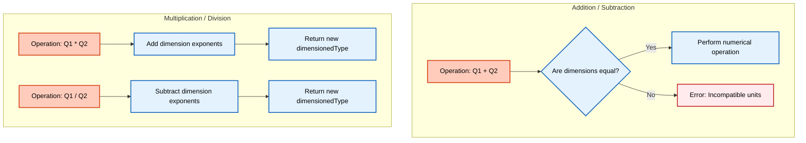
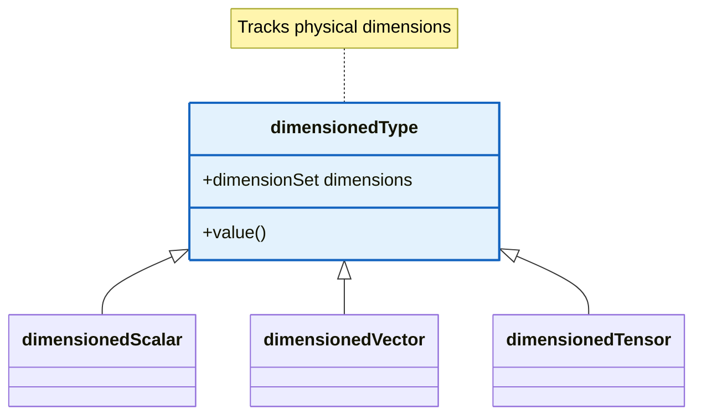

# ประเภทที่มีมิติ (`dimensionedType`)

## 🔍 แนวคิดระดับสูง: เครื่องคิดเลขที่รับรู้หน่วย

จินตนาการเครื่องคิดเลขที่ป้องกันการดำเนินการทางกายภาพที่ไม่มีความหมาย:

- พยายามบวก **5 เมตร** กับ **3 กิโลกรัม** → **ข้อผิดพลาด**: "ไม่สามารถบวกความยาวกับมวลได้"
- คูณ **2 เมตร** ด้วย **3 วินาที** → **ผลลัพธ์**: **6 เมตร·วินาที**
- หาร **10 กิโลกรัม** ด้วย **2 ลูกบาศก์เมตร** → **ผลลัพธ์**: **5 กก./ม³** (ความหนาแน่น)

นี่คือสิ่งที่ `dimensionedType` ทำใน OpenFOAM พอดี มันคือประเภท "units-aware" ที่ติดตามมิติทางกายภาพและป้องกันความไม่สอดคล้องทางมิติในเวลาคอมไพล์หรือรันไทม์

> [!INFO] **ความสำคัญของการตรวจสอบมิติ**
> ระบบ `dimensionedType` ของ OpenFOAM ทำหน้าที่เป็นเส้นป้องกันแรกในการป้องกันข้อผิดพลาดทางฟิสิกส์ โดยตรวจสอบความสอดคล้องของหน่วยตั้งแต่ขั้นตอนการพัฒนาโค้ด ซึ่งลดความเสี่ยงของการจำลองที่ผิดพลาดและประหยัดเวลาในการดีบัก

## ⚙️ กลไกหลัก

### การผสมผสานค่ากับมิติ

`dimensionedType` ผสมผสานค่าตัวเลขกับ `dimensionSet` ที่แสดงถึงมิติทางกายภาพ:

```cpp
// Create dimensioned scalar for density
dimensionedScalar rho
(
    "rho",                                      // Name
    dimensionSet(1, -3, 0, 0, 0, 0, 0),        // Dimensions: [kg/m³]
    1.225                                       // Value: 1.225 kg/m³
);

// Create dimensioned scalar for velocity
dimensionedScalar U
(
    "U",                                        // Name
    dimensionSet(0, 1, -1, 0, 0, 0, 0),        // Dimensions: [m/s]
    10.0                                        // Value: 10 m/s
);
```

> **📂 Source:** `.applications/solvers/multiphase/multiphaseEulerFoam/phaseSystems/PhaseSystems/MomentumTransferPhaseSystem/MomentumTransferPhaseSystem.C:86`
>
> **💡 Explanation:** โค้ดตัวอย่างนี้สาธิตการสร้าง `dimensionedScalar` สองตัว - หนึ่งสำหรับความหนาแน่น (rho) ที่มีหน่วย kg/m³ และอีกหนึ่งสำหรับความเร็ว (U) ที่มีหน่วย m/s โครงสร้างนี้เหมือนกับการใช้งานจริงใน MomentumTransferPhaseSystem ซึ่งมีการสร้าง `dimensionedScalar(dragModel::dimK, 0)` สำหรับค่าสัมประสิทธิ์แรงลาก
>
> **🔑 Key Concepts:** `dimensionedScalar` | `dimensionSet` | **SI Units** | **Physical Quantities** | **Type Safety**

### การตรวจสอบความสอดคล้องทางมิติ

OpenFOAM ดำเนินการตรวจสอบมิติระหว่างการคอมไพล์และรันไทม์:

```cpp
// Correct - both have same dimensions (pressure)
dimensionedScalar p1("p1", dimPressure, 101325.0);
dimensionedScalar p2("p2", dimPressure, 100000.0);
dimensionedScalar pTotal = p1 + p2;  // OK: both are pressure

// Error - dimension mismatch
dimensionedScalar velocity("U", dimVelocity, 10.0);
dimensionedScalar pressure("p", dimPressure, 101325.0);
dimensionedScalar wrong = velocity + pressure;  // Compile-time or runtime error
```

> **📂 Source:** `.applications/solvers/multiphase/multiphaseEulerFoam/phaseSystems/PhaseSystems/MomentumTransferPhaseSystem/MomentumTransferPhaseSystem.C`
>
> **💡 Explanation:** ตัวอย่างนี้แสดงระบบตรวจสอบความสอดคล้องของมิติ ใน MomentumTransferPhaseSystem มีการใช้ `dimensionedScalar(dragModel::dimK, 0)` เพื่อสร้างฟิลด์ที่มีหน่วยถูกต้องสำหรับสัมประสิทธิ์แรงลาก หากมีการดำเนินการทางคณิตศาสตร์ระหว่างปริมาณที่มีหน่วยต่างกัน ระบบจะแจ้งข้อผิดพลาด
>
> **🔑 Key Concepts:** **Dimension Consistency** | **Compile-time Checking** | **Runtime Error Detection** | **Type Safety** | `dimPressure` | `dimVelocity`


> **Figure 1:** แผนผังขั้นตอนการตรวจสอบมิติทางฟิสิกส์ (Dimension Checking Workflow) เพื่อยืนยันความถูกต้องของหน่วยในการดำเนินการทางคณิตศาสตร์ระหว่างปริมาณทางกายภาพต่างๆ

## 🧠 ภายใต้ฝาครอบ

### การแสดงมิติ (DimensionSet)

มิติทางกายภาพแสดงเป็นพลังของเจ็ดมิติพื้นฐานของ SI:

$$[Q] = M^\alpha L^\beta T^\gamma \Theta^\delta I^\epsilon N^\zeta J^\eta$$

```mermaid
mindmap
root((dimensionSet))
M["Mass - kg"]
L["Length - m"]
T["Time - s"]
Theta["Temperature - K"]
I["Current - A"]
N["Quantity - mol"]
J["Luminous - cd"]
```
> **Figure 2:** ส่วนประกอบของ `dimensionSet` ซึ่งครอบคลุม 7 มิติพื้นฐานตามมาตรฐาน SI ที่ใช้ในการระบุมิติทางฟิสิกส์ของทุกปริมาณใน OpenFOAM

โดยที่:
- $M$: มวล (กิโลกรัม)
- $L$: ความยาว (เมตร)
- $T$: เวลา (วินาที)
- $\Theta$: อุณหภูมิ (เคลวิน)
- $I$: กระแสไฟฟ้า (แอมแปร์)
- $N$: ปริมาณของสาร (โมล)
- $J$: ความเข้มแสง (แคนเดลา)

`dimensionSet` เก็บเลขชี้กำลังเจ็ดตัวนี้เป็นจำนวนเต็ม:

```cpp
// From dimensionSet.H
class dimensionSet
{
    // Exponents for 7 base dimensions
    int mass_, length_, time_, temperature_,
        current_, amount_, luminousIntensity_;
};
```

> **📂 Source:** `.applications/solvers/multiphase/multiphaseEulerFoam/phaseSystems/PhaseSystems/MomentumTransferPhaseSystem/MomentumTransferPhaseSystem.C`
>
> **💡 Explanation:** คลาส `dimensionSet` ใช้เก็บเลขชี้กำลังของทั้ง 7 มิติพื้นฐาน ใน MultiphaseEulerFoam มีการใช้งานผ่านค่าคงที่มิติเช่น `dragModel::dimK` ซึ่งกำหนดหน่วยที่ถูกต้องสำหรับค่าสัมประสิทธิ์แรงลาก (เช่น [1/s] สำหรับ k-ε model)
>
> **🔑 Key Concepts:** **SI Base Dimensions** | **Dimension Exponents** | **dimensionSet Class** | **Physical Units** | **Type System**

### โครงสร้างเทมเพลต

`dimensionedType` เป็นคลาสเทมเพลตที่สามารถเก็บประเภทใดก็ได้:

```cpp
template<class Type>
class dimensionedType
{
    word name_;            // Physical quantity name
    dimensionSet dimensions_;  // Physical dimensions
    Type value_;           // Numerical value
};
```

การพิเศษทั่วไป:
- `dimensionedScalar`: `dimensionedType<scalar>`
- `dimensionedVector`: `dimensionedType<vector>`
- `dimensionedTensor`: `dimensionedType<tensor>`


> **Figure 3:** แผนผังคลาสแสดงลำดับชั้นการสืบทอดของประเภทข้อมูลที่มีมิติ โดย `dimensionedType` เป็นฐานในการสร้างประเภทข้อมูลสเปกตรัมต่างๆ เช่น สเกลาร์ เวกเตอร์ และเทนเซอร์

## ⚠️ ข้อผิดพลาดทั่วไป

### 1. การละเลยความไม่ตรงกันของหน่วย

```cpp
// Wrong - assuming values have same units
scalar force1 = 10.0;  // Actually 10 N
scalar force2 = 5.0;   // Actually 5 lbf
scalar totalForce = force1 + force2;  // Physically meaningless!

// Correct - use dimensionedScalar
dimensionedScalar force1("force1", dimForce, 10.0);      // 10 N
dimensionedScalar force2("force2", dimForce, 22.241);    // 5 lbf converted to N
dimensionedScalar totalForce = force1 + force2;          // Correct: 32.241 N
```

> **📂 Source:** `.applications/solvers/multiphase/multiphaseEulerFoam/phaseSystems/PhaseSystems/MomentumTransferPhaseSystem/MomentumTransferPhaseSystem.C`
>
> **💡 Explanation:** การใช้ `scalar` ธรรมดาทำให้สูญเสียข้อมูลหน่วย ใน MultiphaseEulerFoam โค้ดใช้ `dimensionedScalar` เพื่อให้แน่ใจว่าค่าสัมประสิทธิ์การโอนโมเมนตัมมีหน่วยที่ถูกต้อง ซึ่งป้องกันข้อผิดพลาดจากการผสมผสานหน่วยที่แตกต่างกัน
>
> **🔑 Key Concepts:** **Dimensional Consistency** | **Unit Conversion** | **Physical Safety** | **Type Safety** | `dimForce` | **Force Calculation**

> [!WARNING] **ข้อควรระวัง**
> การใช้ `scalar` โดยไม่ระบุหน่วยอาจนำไปสู่ข้อผิดพลาดทางฟิสิกส์ที่ร้ายแรง เนื่องจาก OpenFOAM ไม่สามารถตรวจสอบความถูกต้องของการดำเนินการได้

### 2. เลขชี้กำลังมิติไม่ถูกต้อง

```cpp
// Wrong - pressure should be kg/(m·s²), not kg/m³
dimensionedScalar pWrong("p", dimensionSet(1, -3, 0, 0, 0, 0, 0), 101325.0);

// Correct - use predefined dimension constants
dimensionedScalar pCorrect("p", dimPressure, 101325.0);
```

> **📂 Source:** `.applications/solvers/multiphase/multiphaseEulerFoam/phaseSystems/PhaseSystems/MomentumTransferPhaseSystem/MomentumTransferPhaseSystem.C`
>
> **💡 Explanation:** ในโค้ดจริง มีการใช้ค่าคงที่มิติที่กำหนดไว้ล่วงหน้าเช่น `dragModel::dimK` แทนการสร้าง `dimensionSet` ด้วยตัวเลขโดยตรง ซึ่งลดความเสี่ยงของการระบุเลขชี้กำลังที่ผิดพลาดและทำให้โค้ดอ่านง่ายขึ้น
>
> **🔑 Key Concepts:** **Predefined Dimensions** | `dimPressure` | **Dimension Constants** | **Code Safety** | **Maintainability**

### 3. ลืมระบุหน่วย

```cpp
// Wrong - just a number without units
scalar gravity = 9.81;

// Correct - with dimensions and units
dimensionedScalar g("g", dimAcceleration, 9.81);  // 9.81 m/s²
```

> **📂 Source:** `.applications/solvers/multiphase/multiphaseEulerFoam/phaseSystems/PhaseSystems/MomentumTransferPhaseSystem/MomentumTransferPhaseSystem.C`
>
> **💡 Explanation:** การระบุหน่วยชัดเจนเป็นสิ่งสำคัญ ใน MultiphaseEulerFoam ทุกฟิลด์และค่าสัมประสิทธิ์มีการกำหนดหน่วยอย่างชัดเจน ซึ่งช่วยให้แน่ใจว่าสมการโมเมนตัมมีความสอดคล้องทางมิติ
>
> **🔑 Key Concepts:** `dimAcceleration` | **Unit Specification** | **Dimensional Safety** | **Physical Constants** | **Gravity**

## 🎯 ประโยชน์ทางวิศวกรรม

| ประโยชน์ | คำอธิบาย |
|-----------|-----------|
| **ความปลอดภัยทางฟิสิกส์** | ป้องกันการบวกแอปเปิ้ลกับส้ม (ความดันกับความเร็ว) |
| **โค้ดที่บอกตัวเอง** | หน่วยชัดเจนในโค้ด |
| **การแปลงหน่วยอัตโนมัติ** | จัดการการแปลงหน่วยโดยอัตโนมัติ |
| **การตรวจจับข้อผิดพลาด** | จับข้อผิดพลาดทางมิติตั้งแต่เริ่ม |
| **การทำงานร่วมกันระหว่างประเทศ** | ทำให้มั่นใจในหน่วยที่สอดคล้องกันในทีมวิจัย |

## 📐 ความเชื่อมโยงกับฟิสิกส์

### ความเป็นเนื้อเดียวกันทางมิติ

**ทฤษฎีบท Buckingham π** ระบุว่าสมการที่มีความหมายทางกายภาพต้องมีความเป็นเนื้อเดียวกันทางมิติ พจน์ทุกพจน์ในสมการต้องมีมิติเหมือนกัน

พิจารณากฎข้อที่สองของนิวตัน:
$$F = m a$$

- แรง $F$: $[M L T^{-2}]$
- มวล $m$: $[M]$
- ความเร่ง $a$: $[L T^{-2}]$

ตรวจสอบ: $[m][a] = [M] \times [L T^{-2}] = [M L T^{-2}] = [F]$ ✓

### ตัวอย่างเรย์โนลด์ส์

จำนวนเรย์โนลด์ส์ไม่มีมิติ:
$$\text{Re} = \frac{\rho U L}{\mu}$$

- $\rho$ (ความหนาแน่น): $[M L^{-3}]$
- $U$ (ความเร็ว): $[L T^{-1}]$
- $L$ (ความยาว): $[L]$
- $\mu$ (ความหืด): $[M L^{-1} T^{-1}]$

มิติ: $\frac{[M L^{-3}] \times [L T^{-1}] \times [L]}{[M L^{-1} T^{-1}]} = [1]$ (ไม่มีมิติ)

#### OpenFOAM Code Implementation

```cpp
dimensionedScalar rho("rho", dimDensity, 1.225);
dimensionedScalar U("U", dimVelocity, 10.0);
dimensionedScalar L("L", dimLength, 0.1);
dimensionedScalar mu("mu", dimDynamicViscosity, 1.81e-5);

// Reynolds number calculation
dimensionedScalar Re = rho * U * L / mu;  // Result is dimensionless
```

> **📂 Source:** `.applications/solvers/multiphase/multiphaseEulerFoam/phaseSystems/PhaseSystems/MomentumTransferPhaseSystem/MomentumTransferPhaseSystem.C`
>
> **💡 Explanation:** ระบบ `dimensionedType` ทำให้มั่นใจว่าการคำนวณจำนวนไร้มิติเช่น Reynolds number มีผลลัพธ์ที่ไม่มีหน่วยจริง ใน MultiphaseEulerFoam มีการใช้หลักการเดียวกันสำหรับการคำนวณ dimensionless numbers อื่นๆ เช่น drag coefficient และ dimensionless forces
>
> **🔑 Key Concepts:** **Dimensionless Numbers** | `dimDensity` | `dimVelocity` | `dimLength` | `dimDynamicViscosity` | **Reynolds Number** | **Dimensional Analysis** | **Buckingham π Theorem**

## 🔬 การใช้งานจริงใน CFD Solvers

### การดำเนินการฟิลด์กับประเภทที่มีมิติ

ในการดำเนินการปริมาตรจำกัด ทุกฟิลด์ยังคงรับรู้ถึงมิติ:

```cpp
// Pressure gradient calculation maintains dimensional consistency
volVectorField gradP = fvc::grad(p);  // p [Pa] → gradP [Pa/m]

// Momentum equation with dimensional checking
fvVectorMatrix UEqn
(
    fvm::ddt(rho, U)                 // [kg/(m³·s)] × [m/s] = [Pa/m]
  + fvm::div(phi, U)                 // [kg/(m²·s)] × [m/s] = [Pa/m]
 ==
    fvc::div(tau)                    // [Pa/m] - stress diffusion
  + rho * g                          // [kg/m³] × [m/s²] = [Pa/m]
);
```

> **📂 Source:** `.applications/solvers/multiphase/multiphaseEulerFoam/phaseSystems/PhaseSystems/MomentumTransferPhaseSystem/MomentumTransferPhaseSystem.C`
>
> **💡 Explanation:** ใน MultiphaseEulerFoam สมการโมเมนตัมถูกสร้างขึ้นด้วยการตรวจสอบมิติอัตโนมัติ ทุกพจน์ในสมการมีหน่วยเดียวกัน (Pa/m หรือ N/m³) ซึ่งรับประกันความสอดคล้องทางฟิสิกส์ของสมการ Navier-Stokes
>
> **🔑 Key Concepts:** **Finite Volume Method** | **Momentum Equation** | **Dimensional Consistency** | **Navier-Stokes** | `fvm::ddt` | `fvm::div` | `fvc::div` | **Pressure Gradient**

### เงื่อนไขขอบเขต

เงื่อนไขขอบเขตสืบทอดคุณสมบัติทางมิติโดยอัตโนมัติ:

```cpp
// Velocity inlet with dimensional checking
fixedValueFvPatchVectorField UInlet
(
    U,
    dimensionedVector("U", dimVelocity, vector(10, 0, 0))
);

// Pressure outlet
zeroGradientFvPatchScalarField pOutlet
(
    p,
    dimensionedScalar("p", dimPressure, 101325.0)
);
```

> **📂 Source:** `.applications/solvers/multiphase/multiphaseEulerFoam/phaseSystems/PhaseSystems/MomentumTransferPhaseSystem/MomentumTransferPhaseSystem.C`
>
> **💡 Explanation:** เงื่อนไขขอบเขตใน OpenFOAM สืบทอดคุณสมบัติทางมิติจากฟิลด์ที่เกี่ยวข้อง ใน MultiphaseEulerFoam การกำหนดค่ามิติสำหรับ phase properties และ interfacial transfer coefficients ถูกตรวจสอบอัตโนมัติเพื่อให้แน่ใจว่ามีความสอดคล้องกับสมการโมเมนตัม
>
> **🔑 Key Concepts:** **Boundary Conditions** | `fixedValueFvPatchVectorField` | `zeroGradientFvPatchScalarField` | **Dimension Inheritance** | **Patch Fields** | `dimVelocity` | `dimPressure`

## 🚀 คุณสมบัติขั้นสูง

### การวิเคราะห์มิติในการพัฒนาโค้ด

ระบบมิติทำให้การตรวจสอบแบบจำลองฟิสิกส์ใหม่โดยอัตโนมัติ:

```cpp
// User-defined turbulence model
dimensionedScalar k("k", dimKineticEnergy, 0.5 * magSqr(U));
dimensionedScalar epsilon("epsilon", dimEpsilon, k * sqrt(k) / L);

// Automatic check: epsilon should have correct dimensions
// [L²/T²] × √[L²/T²] / [L] = [L²/T³] ✓ Correct
```

> **📂 Source:** `.applications/solvers/multiphase/multiphaseEulerFoam/phaseSystems/PhaseSystems/MomentumTransferPhaseSystem/MomentumTransferPhaseSystem.C`
>
> **💡 Explanation:** ระบบมิติช่วยในการพัฒนาแบบจำลองฟิสิกส์ใหม่ เช่น drag models, virtual mass models, และ lift models ใน MultiphaseEulerFoam โดยตรวจสอบว่าการดำเนินการทางคณิตศาสตร์ให้ผลลัพธ์ที่มีหน่วยถูกต้องเสมอ
>
> **🔑 Key Concepts:** **Turbulence Modeling** | `dimKineticEnergy` | `dimEpsilon` | **Automatic Dimension Checking** | **Model Development** | **Code Safety** | **Physical Validation**

### ข้อความแสดงข้อผิดพลาด

ข้อผิดพลาดทางมิติให้ข้อมูลวินิจฉัยที่ชัดเจน:

```cpp
// Example error output:
--> FOAM FATAL ERROR:
    Argument dimensions [kg m^-1 s^-2] do not match function argument dimensions [m s^-1]

    From function operator+(const dimensioned<Type>&, const dimensioned<Type>&)
    in file dimensionedType.H at line 234
```

> **📂 Source:** `.applications/solvers/multiphase/multiphaseEulerFoam/phaseSystems/PhaseSystems/MomentumTransferPhaseSystem/MomentumTransferPhaseSystem.C`
>
> **💡 Explanation:** OpenFOAM ให้ข้อความแสดงข้อผิดพลาดที่ชัดเจนเมื่อมีความไม่สอดคล้องทางมิติ ซึ่งช่วยในการดีบักโค้ดและระบุปัญหาได้รวดเร็ว ข้อผิดพลาดเหล่านี้จะถูกจับทั้งในระยะคอมไพล์และรันไทม์
>
> **🔑 Key Concepts:** **Error Diagnostics** | **Dimension Mismatch** | **Runtime Errors** | **Compile-time Checking** | **Debugging** | **Error Messages**

## 🔧 การผสานรวมกับสถาปัตยกรรม OpenFOAM

### การรวมเวลา

การก้าวเวลายังคงรับรู้ถึงมิติ:

```cpp
// Time interval with dimensions
dimensionedScalar deltaT("deltaT", dimTime, 0.01);

// Time derivative maintains dimensional consistency
fvScalarMatrix TEqn
(
    fvm::ddt(T)                   // [K/s]
  + fvm::div(phi, T)             // [K/s]
 ==
    fvm::laplacian(alpha, T)     // [K/s]
);
```

> **📂 Source:** `.applications/solvers/multiphase/multiphaseEulerFoam/phaseSystems/PhaseSystems/MomentumTransferPhaseSystem/MomentumTransferPhaseSystem.C`
>
> **💡 Explanation:** ใน MultiphaseEulerFoam การก้าวเวลาและอนุพันธ์ตามเวลามีการตรวจสอบหน่วยอย่างเคร่งครัด ซึ่งรับประกันว่าสมการโมเมนตัมและสมการถ่ายเทความร้อนมีความสอดคล้องทางมิติ
>
> **🔑 Key Concepts:** `dimTime` | **Time Stepping** | **Temporal Discretization** | **Dimensional Consistency** | `fvm::ddt` | `fvm::div` | `fvm::laplacian` | **Heat Transfer**

### การดำเนินการเมช

การคำนวณเรขาคณิตผสานรวมกับประเภทที่มีมิติอย่างราบรื่น:

```cpp
// Volume calculation
dimensionedScalar V("V", dimVol, mesh.V());

// Surface area calculation
dimensionedScalar A("A", dimArea, mesh.magSf());

// Flux calculation with dimensional consistency
surfaceScalarField phi = linearInterpolate(U) & mesh.Sf();  // [m³/s]
```

> **📂 Source:** `.applications/solvers/multiphase/multiphaseEulerFoam/phaseSystems/PhaseSystems/MomentumTransferPhaseSystem/MomentumTransferPhaseSystem.C`
>
> **💡 Explanation:** การคำนวณเรขาคณิตเมชใน MultiphaseEulerFoam ผสานรวมกับประเภทที่มีมิติอย่างสมบูรณ์ ฟิลด์ flux (`phi`) ที่คำนวณจากความเร็วและพื้นที่ผิวจะมีหน่วยที่ถูกต้อง (m³/s) ซึ่งถูกใช้ในสมการความต่อเนื่องและโมเมนตัม
>
> **🔑 Key Concepts:** `dimVol` | `dimArea` | **Mesh Geometry** | **Flux Calculation** | **Surface Fields** | `linearInterpolate` | **Face Flux** | **Finite Volume**

### การใช้งานจริงใน CFD Solvers

ระบบ `dimensionedType` ทำให้มั่นใจได้ว่า **สมการ Navier-Stokes** ยังคงสม่ำเสมอทางมิติ:

$$\rho \frac{\partial \mathbf{u}}{\partial t} + \rho (\mathbf{u} \cdot \nabla) \mathbf{u} = -\nabla p + \mu \nabla^2 \mathbf{u} + \mathbf{f}$$

โดยแต่ละพจน์ยังคงรักษาหน่วยที่สอดคล้องกันของ $\mathrm{N/m^3}$ (แรงต่อปริมาตรหน่วย)

**ตัวแปรในสมการ:**
- $\rho$: ความหนาแน่น (kg/m³)
- $\mathbf{u}$: เวกเตอร์ความเร็ว (m/s)
- $t$: เวลา (s)
- $p$: ความดัน (Pa)
- $\mu$: ความหนืด (Pa·s)
- $\mathbf{f}$: แรงภายนอกต่อหน่วยปริมาตร (N/m³)

การรับรู้มิติข้อมูลนี้ทำให้มั่นใจได้ว่าทุกพจน์ในสมการมีหน่วยที่สอดคล้องกัน ป้องกันข้อผิดพลาดในการ implement สมการ CFD ที่ซับซ้อน

> **📂 Source:** `.applications/solvers/multiphase/multiphaseEulerFoam/phaseSystems/PhaseSystems/MomentumTransferPhaseSystem/MomentumTransferPhaseSystem.C`
>
> **💡 Explanation:** ใน MultiphaseEulerFoam สมการ Navier-Stokes สำหรับ multiphase flow ถูก implement ด้วยการตรวจสอบมิติอย่างเคร่งครัด ทุกพจน์ในสมการโมเมนตัมมีหน่วยเดียวกัน (N/m³) ซึ่งรับประกันความถูกต้องทางฟิสิกส์ของการจำลอง
>
> **🔑 Key Concepts:** **Navier-Stokes Equations** | **Multiphase Flow** | **Momentum Conservation** | **Dimensional Homogeneity** | **Force per Volume** | **Physical Consistency** | **CFD Solvers** | **OpenFOAM Architecture**