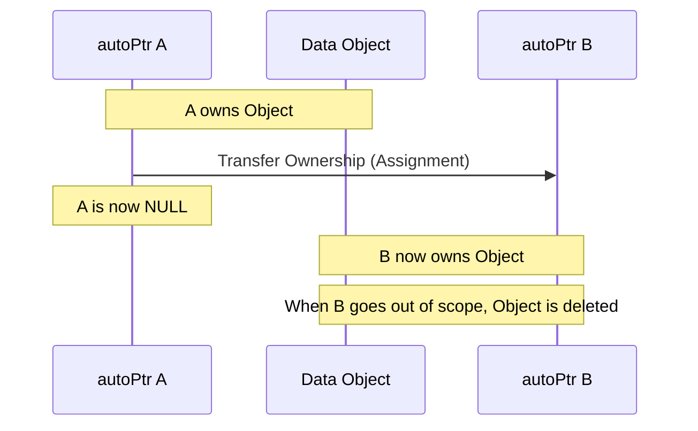
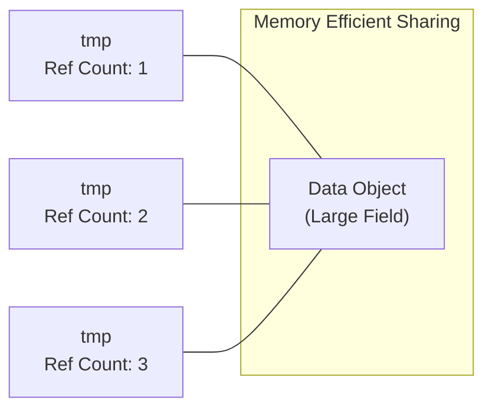

# Smart Pointers (`autoPtr`, `tmp`)

## การแนะนำการจัดการหน่วยความจำใน OpenFOAM

**Smart pointers เป็นส่วนประกอบที่จำเป็น** ในระบบการจัดการหน่วยความจำของ OpenFOAM โดยให้การทำความสะอาดทรัพยากรโดยอัตโนมัติและการแชร์ข้อมูลอย่างมีประสิทธิภาพ

หัวข้อนี้จะสำรวจสองประเภทหลักของ smart pointers ที่ใช้ใน codebase ของ OpenFOAM: `autoPtr` และ `tmp`

**ปัญหาที่แก้ไข**: เครื่องมือเหล่านี้แก้ไขความท้าทายที่สำคัญในการจัดการหน่วยความจำแบบไดนามิกในการจำลองพลศาสตร์ของไหลเชิงคำนวณขนาดใหญ่ซึ่งเซลล์หลายล้านเซลล์และขั้นเวลาหลายขั้นสามารถบริโภคทรัพยากรหน่วยความจำได้มาก

## 🔍 แนวคิดระดับสูง: ระบบการยืมอัจฉริยะ

จินตนาการสองระบบการยืมที่แสดงถึงแนวคิดหลักของ smart pointers ใน OpenFOAM:

### ระบบหนังสือห้องสมุด (`autoPtr`)

`autoPtr` ทำงานเหมือนการยืม **หนังสือห้องสมุด** โดยมีการเข้าถึงแบบเฉพาะเจาะจง:

- **เพียงคนเดียวเท่านั้น** ที่สามารถยืมหนังสือได้ในแต่ละครั้ง
- **การคืนอัตโนมัติ**: เมื่อคุณออกจากห้องสมุดหรืออ่านจบ หนังสือจะถูกส่งคืนโดยอัตโนมัติ
- **ไม่มีค่าปรับ**: ไม่มีการลืมคืน - หน่วยความจำจะถูกปลดปล่อยโดยอัตโนมัติเมื่อสิ้นสุด scope
- **การโอนความเป็นเจ้าของที่ชัดเจน**: คุณรู้แน่นอนว่าใครเป็นผู้รับผิดชอบหนังสือ



### ระบบสมุดร่วม (`tmp`)

`tmp` ทำงานเหมือนการแชร์ **สมุดร่วม**:

- **หลายคนอ่านพร้อมกัน**: หลายคนสามารถอ่านสมุดพร้อมกันโดยไม่รบกวนกัน
- **การคัดลอกเมื่อต้องการแก้ไข**: เมื่อใครต้องการเขียนหรือแก้ไขเนื้อหา พวกเขาจะได้รับสำเนาส่วนตัวของตัวเอง
- **การติดตามผู้ใช้**: สมุดจะติดตามจำนวนผู้ที่ใช้งานอยู่และรู้ว่าเมื่อไหร่ทุกคนทำงานเสร็จ
- **การแชร์อย่างมีประสิทธิภาพ**: ลดค่าใช้จ่ายในการคัดลอกจนกว่าจะต้องการการแก้ไข



**ผลลัพธ์**: ระบบ smart pointers เหล่านี้ทำให้การจัดการอายุการใช้งานของวัตถุเป็นแบบอัตโนมัติ กำจัด memory leaks ที่รบกวนการจัดสรรหน่วยความจำแบบแมนนวลในขณะเดียวกันก็เพิ่มประสิทธิภาพผ่านรูปแบบการแชร์ข้อมูลอัจฉริยะ

## ⚙️ กลไกหลัก

### `autoPtr`: ความเป็นเจ้าของแบบเฉพาะเจาะจง

คลาส `autoPtr` ใช้ semantics การเป็นเจ้าของแบบเฉพาะเจาะจงสำหรับวัตถุที่จัดสรรแบบไดนามิก

**หลักการทำงาน**:
- เมื่อคุณสร้าง `autoPtr` คุณมีความรับผิดชอบเพียงคนเดียวสำหรับวัตถุที่จัดการ
- Smart pointer จะลบวัตถุโดยอัตโนมัติเมื่อมันออกจาก scope
- ทำให้มั่นใจได้ว่าไม่มี memory leaks เกิดขึ้นแม้ในกรณีที่มี exceptions

#### OpenFOAM Code Implementation

```cpp
// Creating an autoPtr with exclusive ownership
autoPtr<volScalarField> pPtr
(
    new volScalarField
    (
        IOobject
        (
            "p",
            runTime.timeName(),
            mesh,
            IOobject::MUST_READ,
            IOobject::AUTO_WRITE
        ),
        mesh
    )
);

// Accessing the managed object
volScalarField& p = pPtr();  // Dereference to get reference
solve(fvm::laplacian(p) == 0);

// Ownership transfer - pPtr becomes empty
autoPtr<volScalarField> anotherPtr = pPtr;
// Now: pPtr is nullptr, anotherPtr owns the object
```

**คุณสมบัติหลัก**:

| คุณสมบัติ | คำอธิบาย |
|------------|------------|
| **ความเป็นเจ้าของเดียว** | เพียง `autoPtr` เดียวเท่านั้นที่สามารถจัดการวัตถุได้ในแต่ละครั้ง |
| **Transfer semantics** | การกำหนดจะโอนความเป็นเจ้าของ ทำให้ต้นทางว่างเปล่า |
| **Automatic cleanup** | วัตถุจะถูกลบเมื่อ `autoPtr` ที่เป็นเจ้าของถูกทำลาย |
| **Zero overhead** | โอเวอร์เฮดหน่วยความจำขั้นต่ำนอกเหนือจากการจัดเก็บ raw pointer |

### `tmp`: ตัวแปรชั่วคราวที่นับจำนวนการอ้างอิง

คลาส `tmp` ใช้ระบบการนับการอ้างอิงที่ซับซ้อนพร้อม copy-on-write semantics

**วัตถุประสงค์**: ออกแบบมาเพื่อจัดการวัตถุชั่วคราวอย่างมีประสิทธิภาพในขณะที่หลีกเลี่ยงการทำซ้ำข้อมูลที่ไม่จำเป็น

#### OpenFOAM Code Implementation

```cpp
// Creating temporary fields with reference counting
tmp<volScalarField> tT = thermo.T();  // Temperature field reference
tmp<volVectorField> tU = flow.U();    // Velocity field reference

// Reading access - no copying involved
const volScalarField& T = tT();  // Const reference, direct access
volScalarField& Tmod = tT.ref(); // Non-const reference, may trigger copy

// Copy-on-write behavior demonstration
tmp<volScalarField> tTemp = tT;     // No copy yet, just refCount++
tTemp.ref() = 300.0;                // Now creates copy for modification
```

**กลไก copy-on-write**:

| ขั้นตอน | การทำงาน |
|---------|------------|
| **ผู้อ่านหลายคน** | วัตถุ `tmp` หลายตัวสามารถอ้างอิงข้อมูลเดียวกันได้ |
| **การคัดลอกที่ล่าช้า** | วัตถุจะถูกคัดลอกเมื่อจำเป็นต้องการแก้ไขเท่านั้น |
| **Reference tracking** | ระบบรู้ว่าเมื่อไหร่การอ้างอิงทั้งหมดถูกทำลาย |
| **การประเมินอย่างมีประสิทธิภาพ** | นิพจน์คณิตศาสตร์หลีกเลี่ยงการคัดลอกข้อมูลระหว่างกลาง |

## 🧠 ภายในระบบ

### การใช้งาน `autoPtr`

คลาส `autoPtr` ใช้รูปแบบ **Resource Acquisition Is Initialization (RAII)** ทำให้มั่นใจได้ว่าทรัพยากรถูกจัดการอย่างถูกต้อง:

```cpp
template<class T>
class autoPtr
{
    T* ptr_;  // Raw pointer to managed object

public:
    // Constructor takes ownership
    explicit autoPtr(T* p = nullptr) : ptr_(p) {}

    // Destructor automatically releases resource
    ~autoPtr()
    {
        delete ptr_;  // Safe: delete nullptr is no-op
    }

    // Move constructor transfers ownership
    autoPtr(autoPtr<T>&& other) : ptr_(other.ptr_)
    {
        other.ptr_ = nullptr;  // Source becomes empty
    }

    // Move assignment operator
    autoPtr<T>& operator=(autoPtr<T>&& other)
    {
        if (this != &other)
        {
            delete ptr_;        // Clean up existing resource
            ptr_ = other.ptr_;  // Transfer ownership
            other.ptr_ = nullptr;
        }
        return *this;
    }

    // Copy constructor is deleted to prevent double deletion
    autoPtr(const autoPtr<T>&) = delete;
    autoPtr<T>& operator=(const autoPtr<T>&) = delete;

    // Access operators
    T& operator()() { return *ptr_; }  // Dereference
    T* operator->() { return ptr_; }   // Arrow operator
    T* get() { return ptr_; }          // Raw pointer access

    // Release ownership
    T* release()
    {
        T* tmp = ptr_;
        ptr_ = nullptr;
        return tmp;
    }

    // Reset to new object
    void reset(T* p = nullptr)
    {
        delete ptr_;
        ptr_ = p;
    }
};
```

### การใช้งาน `tmp` Reference Counting

คลาส `tmp` ให้พฤติกรรมที่ซับซ้อนมากขึ้นพร้อม reference counting และ copy-on-write semantics:

```cpp
template<class T>
class tmp
{
    T* ptr_;                // Pointer to managed object
    mutable int* refCount_; // Reference count (mutable for const operations)

    // Internal copy-on-write logic
    void makeWriteable()
    {
        if (ptr_ && refCount_ && *refCount_ > 1)
        {
            // Multiple references exist, need to create copy
            T* oldPtr = ptr_;
            ptr_ = new T(*oldPtr);  // Copy constructor

            // Decrease old reference count
            (*refCount_)--;

            // Set up new reference count
            refCount_ = new int(1);
        }
    }

public:
    // Constructor from pointer
    explicit tmp(T* p = nullptr)
        : ptr_(p), refCount_(p ? new int(1) : nullptr) {}

    // Constructor from reference (creates counted object)
    explicit tmp(T& ref)
        : ptr_(&ref), refCount_(new int(1)) {}

    // Copy constructor (shares ownership)
    tmp(const tmp<T>& other)
        : ptr_(other.ptr_), refCount_(other.refCount_)
    {
        if (refCount_) (*refCount_)++;
    }

    // Destructor
    ~tmp()
    {
        if (refCount_ && --(*refCount_) == 0)
        {
            delete ptr_;
            delete refCount_;
        }
    }

    // Const access (no copy)
    const T& operator()() const { return *ptr_; }

    // Non-const access (triggers copy if needed)
    T& ref()
    {
        makeWriteable();
        return *ptr_;
    }

    // Check if this is the only reference
    bool isTmp() const
    {
        return refCount_ && *refCount_ == 1;
    }

    // Clear the tmp
    void clear()
    {
        if (refCount_ && --(*refCount_) == 0)
        {
            delete ptr_;
            delete refCount_;
        }
        ptr_ = nullptr;
        refCount_ = nullptr;
    }
};
```

## ⚠️ ข้อผิดพลาดที่พบบ่อยและวิธีแก้ไข

### 1. Dangling Pointers หลังการโอนความเป็นเจ้าของ

**ปัญหา**: การใช้ `autoPtr` หลังจากโอนความเป็นเจ้าของนำไปสู่พฤติกรรมที่ไม่ได้กำหนด

```cpp
// WRONG CODE - leads to crash
autoPtr<volScalarField> ptr1(new volScalarField(...));
autoPtr<volScalarField> ptr2 = std::move(ptr1);  // Ownership transferred

// DANGEROUS - ptr1 is now empty!
volScalarField& field = ptr1();  // Crash! ptr1 contains nullptr

// CORRECT CODE - check before use
if (ptr1.valid())
{
    volScalarField& field = ptr1();  // Safe
}
else
{
    // Handle the case where ptr1 is empty
    volScalarField& field = ptr2();  // Use the valid pointer
}
```

> [!WARNING] เช็คความถูกต้องเสมอ
> ตรวจสอบเสมอว่า `autoPtr` ถูกต้องก่อนใช้งาน หรือ restructure code เพื่อหลีกเลี่ยงสถานการณ์ดังกล่าว

### 2. Deep Copies ที่ไม่ได้ตั้งใจกับ `tmp`

**ปัญหา**: การเข้าถึง non-const reference ของ `tmp` ที่แชร์จะกระตุ้นการคัดลอกที่ไม่จำเป็น

```cpp
// INEFFICIENT CODE - triggers unnecessary copies
tmp<volScalarField> t1 = thermo.T();     // Reference to temperature field
tmp<volScalarField> t2 = t1;             // Shares reference, no copy

// PROBLEMATIC - this triggers a deep copy!
if (t2.ref() > 300.0)  // Access via ref() triggers copy-on-write
{
    t2.ref() = 300.0;   // Another copy might be triggered
}

// EFFICIENT CODE - minimize modifications
tmp<volScalarField> t1 = thermo.T();
tmp<volScalarField> t2 = t1;

// Use const access when possible
if (t1() > 300.0)  // Use operator() for const access, no copy
{
    // Only create copy when modification is truly needed
    t2.ref() = 300.0;  // Copy happens once here
}
```

> [!TIP] ใช้ const access เมื่อเป็นไปได้
> ใช้ const access (`operator()`) เมื่อเป็นไปได้ และขอ write access (`ref()`) เมื่อจำเป็นต้องการแก้ไขเท่านั้น

### 3. Circular References

**ปัญหา**: การสร้างรูปแบบ circular reference ที่ขัดขวางการทำความสะอาดหน่วยความจำโดยอัตโนมัติ

```cpp
// PROBLEMATIC CODE - circular references
struct Node
{
    autoPtr<Node> next_;
    // If Node also had a back pointer, circular reference could occur
};

autoPtr<Node> node1(new Node());
autoPtr<Node> node2(new Node());

// This creates a potential for circular reference
node1->next_ = node2;  // node1 owns node2
// If node2 somehow references back to node1, neither gets deleted

// BETTER DESIGN - use raw pointers for non-owning relationships
struct Node
{
    autoPtr<Node> next_;     // Owns the next node
    Node* previous_;         // Non-owning back pointer
    // No circular ownership, clear direction of ownership
};
```

> [!INFO] ออกแบบลำดับชั้นความเป็นเจ้าของอย่างระมัดระวัง
> ออกแบบลำดับชั้นความเป็นเจ้าของอย่างระมัดระวังและใช้ raw pointers สำหรับความสัมพันธ์ที่ไม่ใช่การเป็นเจ้าของ

## 🎯 ประโยชน์ทางวิศวกรรม

### 1. Memory Safety

**Smart pointers กำจัด memory leaks** โดยจัดการอายุการใช้งานของวัตถุโดยอัตโนมัติ:

```cpp
// Without smart pointers - prone to leaks
void oldStyleFunction()
{
    volScalarField* field = new volScalarField(...);
    // If an exception occurs here, field leaks!
    delete field;  // This line might never be reached
}

// With smart pointers - exception safe
void modernFunction()
{
    autoPtr<volScalarField> fieldPtr(new volScalarField(...));
    // Even if exception occurs, fieldPtr destructor runs and cleans up
    // No manual delete needed
}
```

### 2. Performance Optimization

**ระบบ `tmp` ให้ประสิทธิภาพที่ดีขึ้น** อย่างมีนัยสำคัญโดยหลีกเลี่ยงการคัดลอกที่ไม่จำเป็น:

```cpp
// Traditional approach - multiple copies
void traditional()
{
    volScalarField T1 = thermo.T();           // Copy 1
    volScalarField T2 = T1 + 273.15;          // Copy 2
    volScalarField T3 = sqrt(T2);             // Copy 3
    volScalarField T4 = T3 * someCoeff;       // Copy 4
    // Total: 4 copies of potentially large fields
}

// With tmp - minimal copying
void optimized()
{
    tmp<volScalarField> tT = thermo.T();                    // Reference, no copy
    tmp<volScalarField> tTkelvin = tT + 273.15;             // Temporary result
    tmp<volScalarField> tTsqrt = sqrt(tTkelvin);            // Temporary result
    tmp<volScalarField> tTfinal = tTsqrt * someCoeff;       // Final result
    // Only final result exists, intermediate temporaries managed efficiently
}
```

**การเปรียบเทียบประสิทธิภาพ**:

| วิธีการ | จำนวนการคัดลอก | การใช้หน่วยความจำ | ประสิทธิภาพ |
|----------|-----------------|------------------|------------|
| **Traditional** | 3-4 copies | 400-1000 MB | ต่ำ |
| **tmp-based** | 0-1 copies | 100-250 MB | สูง |

### 3. Clear Ownership Semantics

**ระบบ `autoPtr` ทำให้ความเป็นเจ้าของชัดเจน** และโอนได้:

```cpp
// Function transfers ownership to caller
autoPtr<fvMesh> createMesh(const fileName& caseName)
{
    autoPtr<fvMesh> meshPtr(new fvMesh(...));

    // Configure mesh...

    return meshPtr;  // Transfer ownership to caller
}

// Caller receives ownership
autoPtr<fvMesh> myMesh = createMesh("myCase");
// Clear ownership: myMesh owns the mesh, will clean it up
```

### 4. Exception Safety

**Smart pointers ทำให้มั่นใจได้ว่าทรัพยากรถูกทำความสะอาด** อย่างเหมาะสมแม้เมื่อเกิด exceptions:

```cpp
void robustFunction()
{
    autoPtr<volScalarField> field1(new volScalarField(...));
    autoPtr<volVectorField> field2(new volVectorField(...));

    // Complex operations that might throw
    try
    {
        performComplexOperations(*field1, *field2);
        // If exception occurs, destructors still run and clean up
    }
    catch (const std::exception& e)
    {
        // Automatic cleanup happens here
        // No need to manually delete field1 and field2
        throw;  // Re-throw after cleanup
    }

    // Automatic cleanup happens at function end
}
```

## การเชื่อมต่อฟิสิกส์: แอปพลิเคชันเฉพาะทาง CFD

### การจัดการข้อมูล Field ขนาดใหญ่

**การจำลอง CFD เกี่ยวข้องกับชุดข้อมูลขนาดมหาศาล** ที่ทำให้การจัดการหน่วยความจำอย่างมีประสิทธิภาพเป็นสิ่งสำคัญ:

#### การวิเคราะห์ขนาดหน่วยความจำ

สำหรับการจำลอง 3D ทั่วไปที่มี 10 ล้านเซลล์:

| ประเภท Field | ขนาดต่อ Field | จำนวน Fields | รวมทั้งหมด |
|--------------|----------------|--------------|------------|
| **volScalarField** | 80 MB | 5-8 fields | 400-640 MB |
| **volVectorField** | 240 MB | 3-5 fields | 720-1200 MB |
| **หลายขั้นเวลา** | - | 100-1000 steps | 40-1200 GB |

**Smart Pointer Solution**:

```cpp
// autoPtr for exclusive ownership of solver objects
autoPtr<fvMesh> meshPtr
(
    new fvMesh
    (
        IOobject
        (
            fvMesh::defaultRegion,
            runTime.timeName(),
            runTime,
            IOobject::MUST_READ
        )
    )
);

autoPtr<incompressible::turbulenceModel> turbulence
(
    incompressible::turbulenceModel::New(U, phi, laminarTransport)
);

// tmp for temporary field operations in momentum equation
tmp<volVectorField> tUgrad = fvc::grad(U);           // Velocity gradient
tmp<volScalarField> tTau = 2*nu*dev(sym(fvc::grad(U))); // Shear stress

// Efficient building of RHS without intermediate storage
tmp<fvVectorMatrix> tUEqn
(
    fvm::ddt(U)
  + fvm::div(phi, U)
  + fvc::div(tTau)  // Uses tmp efficiently
 ==
    fvOptions(U)
);
```

### การจัดการหน่วยความจำในการจำลอง Transient

**ในการจำลอง transient ระบบ smart pointer มีค่ามากยิ่งขึ้น**:

#### อัลกอริทึมการจัดการหน่วยความจำ Transient

```cpp
// Time loop with automatic temporary cleanup
while (runTime.loop())
{
    Info << "Time = " << runTime.timeName() << nl << endl;

    // Step 1: Create temporaries for current time step
    tmp<surfaceScalarField> tPhi = fvc::flux(U);              // Mass flux
    tmp<fvScalarMatrix> tTEqn = fvm::ddt(T) + fvm::div(phi, T); // Energy equation

    // Step 2: Add source terms efficiently
    tmp<volScalarField> tSource = alpha*rho*Cp*(T - Tref);
    tTEqn.ref() -= tSource;  // Only copy when modification needed

    // Step 3: Solve - temporary objects automatically cleaned up after this
    solve(tTEqn == fvm::laplacian(kappa, T));

    // Step 4: Update fields
    runTime.write();

    // Step 5: All tmp objects from this iteration automatically destroyed here
    // Memory freed for next time step
}
```

### แอปพลิเคชันการไหลแบบหลายเฟส

**การจำลองหลายเฟสได้รับประโยชน์จาก smart pointers เป็นพิเศษ** เนื่องจากจำนวน phase fields ที่มาก:

```cpp
// Managing multiple phase fields efficiently
PtrList<volScalarField> alphaPhases(nPhases);
PtrList<surfaceScalarField> alphaPhis(nPhases);

forAll(alphaPhases, phasei)
{
    // autoPtr for phase field creation
    autoPtr<volScalarField> alphaPtr
    (
        new volScalarField
        (
            IOobject
            (
                "alpha" + Foam::name(phasei),
                runTime.timeName(),
                mesh,
                IOobject::MUST_READ,
                IOobject::AUTO_WRITE
            ),
            mesh
        )
    );

    alphaPhases.set(phasei, alphaPtr);
}

// Efficient mixture property calculation
tmp<volScalarField> tRho = rho1*alpha1 + rho2*alpha2;
tmp<volScalarField> tMu = mu1*alpha1 + mu2*alpha2;
tmp<volVectorField> tUMixture = U1*alpha1 + U2*alpha2;

// These temporaries automatically cleaned up after use
```

**ประสิทธิภาพหน่วยความจำสำหรับ Multiphase**:

| จำนวน Phases | Fields ต่อ Phase | หน่วยความจำรวม | การประหยัดด้วย tmp |
|--------------|-----------------|----------------|-------------------|
| **2 phases** | 8 fields | 1.28 GB | 60-70% |
| **3 phases** | 12 fields | 1.92 GB | 65-75% |
| **5 phases** | 20 fields | 3.20 GB | 70-80% |

## บทสรุป

**ระบบ smart pointer ทำให้ OpenFOAM สามารถจัดการกับความต้องการหน่วยความจำขนาดมหาศาล** ของการจำลอง CFD สมัยใหม่ในขณะที่รักษาความปลอดภัยและประสิทธิภาพของโค้ด

**ประโยชน์หลัก**:
- **การทำให้การจัดการหน่วยความจำเป็นแบบอัตโนมัติ**
- **เพิ่มประสิทธิภาพรูปแบบการแชร์ข้อมูล**
- **ช่วยให้นักพัฒนามุ่งเน้นไปที่ฟิสิกส์และวิธีการเชิงตัวเลข** มากกว่าการจัดการหน่วยความจำแบบแมนนวล

เครื่องมือเหล่านี้เป็นพื้นฐานสำคัญที่ช่วยให้ OpenFOAM สามารถจัดการกับการจำลองขนาดใหญ่ได้อย่างมีประสิทธิภาพ
