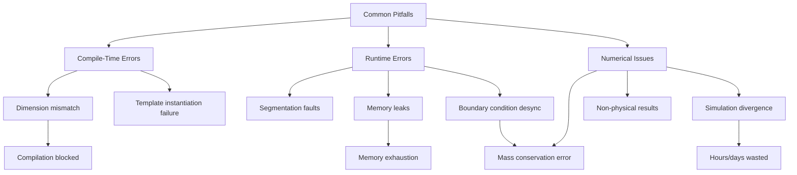
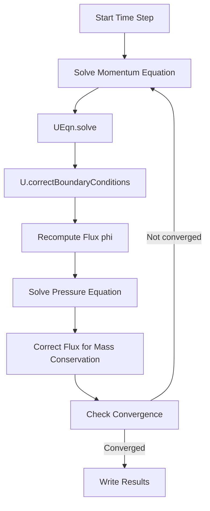
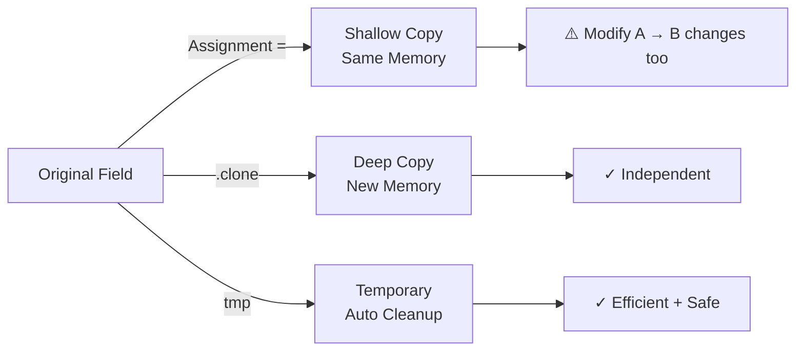
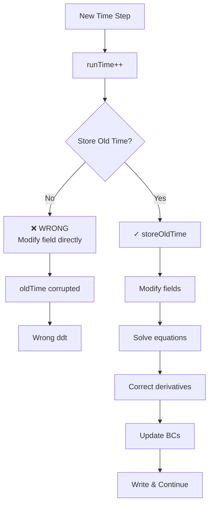
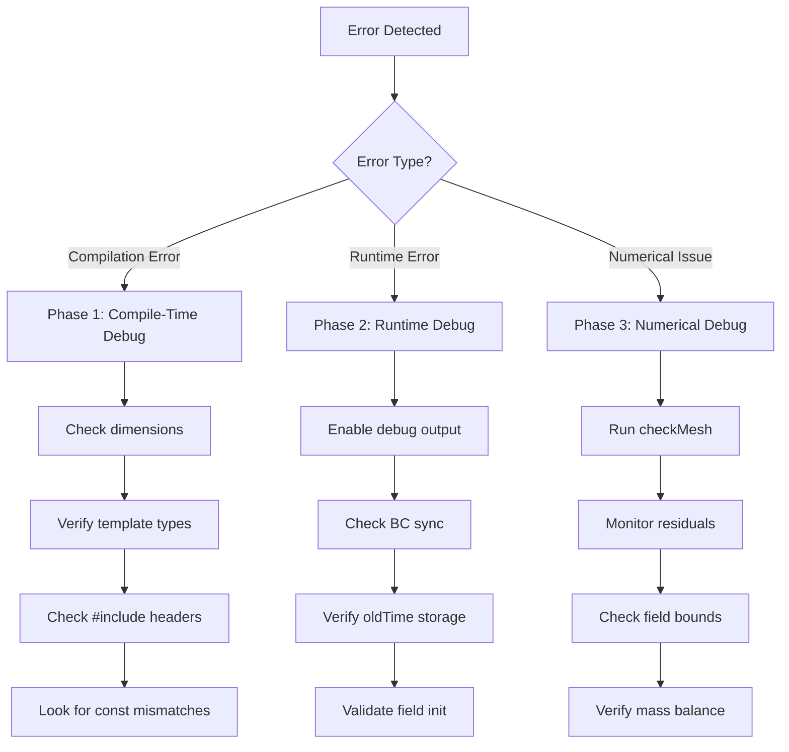

# Common Pitfalls and Debugging

ข้อผิดพลาดที่พบบ่อยในการเขียนโค้ด OpenFOAM และวิธีแก้ไข

---

## 🎯 Learning Objectives | เป้าหมายการเรียนรู้

หลังจากอ่านบทนี้ คุณจะสามารถ:

**By the end of this section, you will be able to:**

- **ระบุ (Identify)** ข้อผิดพลาดทั่วไปในการเขียนโค้ด OpenFOAM ตั้งแต่ compile-time ถึง runtime
- **วินิจฉัย (Diagnose)** ปัญหา dimensional inconsistency, memory leaks, และ boundary condition synchronization errors
- **ประยุกต์ใช้ (Apply)** best practices สำหรับ smart pointers (`tmp<T>`, `autoPtr<T>`) และ deep copy operations
- **แก้ไข (Resolve)** template compilation errors อย่างเป็นระบบ
- **ป้องกัน (Prevent)** numerical instability ที่เกิดจากการจัดการ time management ที่ผิดพลาด

---

## 📋 ทำไมต้องเข้าใจ Common Pitfalls? | Why Understand Common Pitfalls?

> [!TIP] **Critical Importance for OpenFOAM Developers**
>
> **ความสำคัญ:** ข้อผิดพลาดเหล่านี้ทำให้เกิดปัญหาตั้งแต่ **Compilation error** (โค้ดไม่ผ่าน) ไปจนถึง **Numerical instability** (การคำนวณแตก) การเข้าใจ root cause จะช่วยให้ debug เร็วขึ้น 10 เท่า และเขียนโค้ดที่ **robust** และ **efficient**
>
> **Impact:**
> - ✅ **Stability:** ป้องกัน simulation ดับกลางคัน (divergence)
> - ✅ **Correctness:** มั่นใจว่าผลลัพธ์ถูกต้องตามฟิสิกส์
> - ✅ **Performance:** หลีกเลี่ยง memory leak และ unnecessary copies
> - ✅ **Maintainability:** โค้ดอ่านง่าย แก้ไขได้ง่าย

### Consequences of Common Pitfalls



---

## 1. Dimensional Inconsistency | ความไม่สอดคล้องของหน่วย

> [!NOTE] **📂 OpenFOAM Context - Domain E (Coding)**
> **บริบท:** Section นี้เกี่ยวกับ **Dimensioned Type System** ในการเขียนโค้ด OpenFOAM ซึ่งเป็น **Compile-time Safety Mechanism**
> - **Files:** โค้ดของคุณเอง (custom solver, boundary condition, function object) ใน `src/` หรือ `solver/`
> - **Keywords:** `dimensionSet`, `dimLength`, `dimTime`, `dimensionedScalar`, `volScalarField`
> - **Error Messages:** `"Cannot add [1,-1,-2,0,0,0,0] + [0,1,-1,0,0,0,0]"` หมายถึง **Dimension mismatch** ระหว่าง pressure และ velocity
> - **ตำแหน่ง:** เกิดขึ้นตอน **compile-time** (เวลา `wmake`) ไม่ใช่ runtime

### ปัญหา | The Problem

**สิ่งที่เกิดขึ้น:** การบวก field ต่างหน่วยกันทำให้ compiler ปฏิเสธด้วย error message ที่บอก dimension mismatch

```cpp
// ❌ การบวก field ต่างหน่วย
volScalarField p;  // [1,-1,-2,0,0,0] Pa
volVectorField U;  // [0,1,-1,0,0,0]  m/s

auto result = p + U;  // Compiler error!
// "Cannot add [1,-1,-2] + [0,1,-1]"
```

### ทำมา | Why This Happens

- OpenFOAM ใช้ **SI base dimensions** 7 ตัว: Mass, Length, Time, Temperature, Current, Amount, Luminous intensity
- ทุก operation ต้อง **dimensionally consistent** ตามหลักฟิสิกส์
- Compiler จะตรวจสอบ **ตอน compile-time** เพื่อป้องกัน bugs ที่ร้ายแรง

### วิธีแก้ | How to Fix

```cpp
// ✅ ใช้สูตรที่ถูกต้องทางฟิสิกส์
volScalarField rho("rho", dimDensity, 1000);  // [1,-3,0,0,0,0] kg/m³

// Dynamic pressure: 0.5 * ρ * U² → [1,-1,-2] Pa
volScalarField dynamicP = 0.5 * rho * magSqr(U);  // [1,-1,-2]
volScalarField totalP = p + dynamicP;  // OK! Same dimensions
```

### How to Prevent | การป้องกัน

```cpp
// ✅ Best Practice: Define dimensions explicitly
dimensionedScalar pAmbient(
    "pAmbient",
    dimensionSet(1, -1, -2, 0, 0, 0, 0),  // Pa
    101325.0
);

// ✅ Use predefined dimensions (see 02_DIMENSIONED_TYPES/00_Overview.md:131-145)
dimensionedScalar nu(
    "nu",
    dimKinematicViscosity,  // [0 2 -1 0 0 0 0] m²/s
    1e-6
);

// ✅ Always verify dimensional homogeneity
// p + rho*g*h  → All must have pressure units
```

### Dimension Reference

| Field | Dimension | SI Unit | Cross-Reference |
|-------|-----------|---------|-----------------|
| Pressure | `[1,-1,-2,0,0,0]` | Pa | [02_DIMENSIONED_TYPES/00_Overview.md:139](02_DIMENSIONED_TYPES/00_Overview.md#L139) |
| Velocity | `[0,1,-1,0,0,0]` | m/s | [02_DIMENSIONED_TYPES/00_Overview.md:137](02_DIMENSIONED_TYPES/00_Overview.md#L137) |
| Density | `[1,-3,0,0,0,0]` | kg/m³ | [02_DIMENSIONED_TYPES/00_Overview.md:140](02_DIMENSIONED_TYPES/00_Overview.md#L140) |
| Temperature | `[0,0,0,1,0,0]` | K | [02_DIMENSIONED_TYPES/00_Overview.md:136](02_DIMENSIONED_TYPES/00_Overview.md#L136) |
| Viscosity (ν) | `[0,2,-1,0,0,0]` | m²/s | [02_DIMENSIONED_TYPES/00_Overview.md:142](02_DIMENSIONED_TYPES/00_Overview.md#L142) |

---

## 2. Neglecting Boundary Conditions | การลืมอัปเดต Boundary Conditions

> [!NOTE] **📂 OpenFOAM Context - Domain A (Physics & Fields) + Domain E (Coding)**
> **บริบท:** Section นี้เกี่ยวกับ **Field-Boundary Synchronization** ซึ่งเป็นความสัมพันธ์ระหว่าง **Internal Field** และ **Boundary Field**
> - **Files:**
>   - `0/p`, `0/U`, `0/T` — Boundary condition definitions
>   - โค้ดของคุณใน `src/` หรือ custom solver
> - **Keywords:** `correctBoundaryConditions()`, `fixedValue`, `zeroGradient`, `patch`, `internalField`
> - **สถานการณ์:** เกิดขึ้นเมื่อคุณ **modify field** ด้วยโค้ด (เช่น `U = newVelocity;`) แล้วใช้ค่านั้นคำนวณต่อโดยไม่ sync BC
> - **ผลกระทบ:** Flux (`phi`) จะถูกคำนวณด้วย BC เก่า → Mass conservation error → Simulation diverge

### ปัญหา | The Problem

**สิ่งที่เกิดขึ้น:** เมื่อ modify field โดยตรง ค่า boundary ไม่อัปเดตโดยอัตโนมัติ

```cpp
// ❌ ลืม update boundary หลังแก้ไข field
U = someNewVelocity;
phi = linearInterpolate(U) & mesh.Sf();  // ใช้ BC เก่า!
```

### ทำมา | Why This Happens

- OpenFOAM เก็บ **internal field** และ **boundary field** แยกกัน
- Direct assignment (`U = ...`) อัปเดตเฉพาะ internal field
- Flux calculation ใช้ boundary field ที่ยังเป็นค่าเก่า

### วิธีแก้ | How to Fix

```cpp
// ✅ เรียก correctBoundaryConditions() เสมอ
U = someNewVelocity;
U.correctBoundaryConditions();  // 🔑 สำคัญ!
phi = linearInterpolate(U) & mesh.Sf();
```

### How to Prevent | การป้องกัน

```cpp
// ✅ Best Practice: Standard solver pattern
while (residual > tolerance)
{
    // 1. Solve momentum equation
    fvVectorMatrix UEqn(
        fvm::ddt(U) + fvm::div(phi, U) - fvm::laplacian(nu, U)
    );
    UEqn.solve();

    // 2. Update boundary conditions IMMEDIATELY after solve
    U.correctBoundaryConditions();

    // 3. Now flux is consistent
    phi = linearInterpolate(U) & mesh.Sf();

    // 4. Correct pressure for mass conservation
    adjustPhi(phi, U, p);
}
```

### Solver Pattern Flowchart



---

## 3. Memory Management Confusion | ความสับสนในการจัดการ Memory

> [!NOTE] **📂 OpenFOAM Context - Domain E (Coding)**
> **บริบท:** Section นี้เกี่ยวกับ **Reference Counting & Memory Ownership** ใน OpenFOAM ซึ่งใช้ **Smart Pointers** หลีกเลี่ยง manual memory management
> - **Files:** โค้ดของคุณใน `src/finiteVolume/`, `src/transportModels/`, หรือ custom solver
> - **Keywords:**
>   - `tmp<T>` — Temporary field (auto cleanup, reference counted)
>   - `autoPtr<T>` — Single ownership (move semantics)
>   - `refPtr<T>` — Reference counted pointer
>   - `clone()` — Deep copy method
> - **สถานการณ์:** เกิดขึ้นเมื่อ assign field (`p2 = p1`) และ modify ตัวใดตัวหนึ่ง → ตัวอื่นเปลี่ยนตาม (shallow copy)
> - **ผลกระทบ:** การคำนวณผิดพลาดเพราะ field ที่ควรเป็นอิสระแชร์ memory กัน → ผลลัพธ์ unpredictable
> - **การ debug:** ใช้ `gdb` หรือ `info()` เพื่อตรวจ address: `&p2[0]` vs `&p1[0]`

### ปัญหา | The Problem

**สิ่งที่เกิดขึ้น:** Default assignment ทำ **shallow copy** — ทั้งสอง variables ชี้ไป memory เดียวกัน

```cpp
// ❌ Shallow copy = shared data
volScalarField p1 = ...;
volScalarField p2 = p1;  // p2 ชี้ไป memory เดียวกับ p1!

p2[0] = 1000;  // p1[0] ก็เปลี่ยนด้วย!
Info << "p1[0] = " << p1[0] << endl;  // Prints 1000, not original value
```

### ทำมา | Why This Happens

- OpenFOAM fields ใช้ **reference semantics** โดย default
- Assignment operator ทำ **shallow copy** เพื่อ performance
- ออกแบบมาเพื่อลด memory copying ใน large-scale simulations

### วิธีแก้ | How to Fix

```cpp
// ✅ Deep copy methods
volScalarField p2 = p1.clone();           // Method 1: clone()
volScalarField p3(p1, true);              // Method 2: constructor with copy=true
volScalarField p4(IOobject(...), p1);     // Method 3: new IOobject + copy
```

### How to Prevent | การป้องกัน

```cpp
// ✅ Best Practice: Memory Management Decision Tree

// Scenario 1: Need independent copy (modifications shouldn't affect original)
volScalarField independentCopy = originalField.clone();

// Scenario 2: Just read access (no modification needed)
const volScalarField& readOnlyRef = originalField;  // Zero-copy

// Scenario 3: Temporary computation result
tmp<volScalarField> tgradP = fvc::grad(p);
volScalarField gradP = tgradP();  // Detach from tmp
tgradP.clear();  // Optional: explicit cleanup

// Scenario 4: Transfer ownership (factory pattern)
autoPtr<volScalarField> pFieldPtr(
    new volScalarField(IOobject(...), mesh)
);
volScalarField& pField = pFieldPtr();  // Reference to owned object
```

### Smart Pointers Comparison

| Type | Use Case | Ownership | Lifetime | Cross-Reference |
|------|----------|-----------|----------|-----------------|
| `tmp<T>` | Temporary fields (auto cleanup) | Shared | Auto | [03_CONTAINERS_MEMORY/02_Memory_Management_Fundamentals.md](../03_CONTAINERS_MEMORY/02_Memory_Management_Fundamentals.md) |
| `autoPtr<T>` | Single ownership | Exclusive | Manual | [03_CONTAINERS_MEMORY/02_Memory_Management_Fundamentals.md](../03_CONTAINERS_MEMORY/02_Memory_Management_Fundamentals.md) |
| `refPtr<T>` | Reference counting | Shared | Auto (ref count) | [03_CONTAINERS_MEMORY/02_Memory_Management_Fundamentals.md](../03_CONTAINERS_MEMORY/02_Memory_Management_Fundamentals.md) |

### Memory Flow Diagram



---

## 4. Time Management Errors | ข้อผิดพลาดในการจัดการเวลา

> [!NOTE] **📂 OpenFOAM Context - Domain C (Simulation Control) + Domain E (Coding)**
> **บริบท:** Section นี้เกี่ยวกับ **Temporal Field Management** ซึ่งเป็นการจัดการ **Time History** สำหรับ implicit time-stepping schemes
> - **Files:**
>   - `system/controlDict` — Time stepping control (`deltaT`, `writeInterval`)
>   - โค้ดของคุณใน custom solver
> - **Keywords:**
>   - `storeOldTime()` — เก็บค่าปัจจุบันเป็น `oldTime()`
>   - `oldTime()` — Access ค่า time step ก่อนหน้า
>   - `runTime.deltaT()` — ดึงค่า time step ปัจจุบัน
>   - `runTime.value()` — Current simulation time
> - **สถานการณ์:** เกิดขึ้นเมื่อใช้ transient term (เช่น `ddt(T)`) แต่ลืม store oldTime → ค่า `T.oldTime()` ผิดหรือ uninitialized
> - **ผลกระทบ:** Time derivative (`dT/dt`) ผิด → การคำนวณ unstable → ผลลัพธ์ non-physical
> - **Time Schemes:** ใช้กับ `Euler`, `backward`, `CrankNicolson` ใน `ddtSchemes` (system/fvSchemes)

### ปัญหา | The Problem

**สิ่งที่เกิดขึ้น:** การลืม store oldTime ก่อน modify field ทำให้ค่า derivative ผิด

```cpp
// ❌ ลืม store old time ก่อนแก้ไข
T = newTemperature;
T.storeOldTime();  // ผิด! ค่าเก่าหายไปแล้ว

auto dTdt = (T - T.oldTime()) / dt;  // ผิด! oldTime() == newTemperature
```

### ทำมา | Why This Happens

- OpenFOAM เก็บ **time history** สำหรับ implicit schemes
- `oldTime()` field ถูก update เมื่อ `storeOldTime()` ถูกเรียก
- ถ้า modify ก่อน store → ค่าเก่าสูญหาย

### วิธีแก้ | How to Fix

```cpp
// ✅ Store ก่อน modify
T.storeOldTime();     // เก็บค่าเก่าก่อน
T = newTemperature;   // แก้ไข
auto dTdt = (T - T.oldTime()) / runTime.deltaT();  // ถูกต้อง
```

### How to Prevent | การป้องกัน

```cpp
// ✅ Best Practice: Standard time loop pattern
while (!runTime.end())
{
    runTime++;  // Increment time

    // 1. Store old values FIRST (before any modification)
    U.storeOldTime();
    p.storeOldTime();
    T.storeOldTime();

    // 2. Now solve equations that use oldTime()
    solve(fvm::ddt(U) + fvm::div(phi,U) == -fvc::grad(p));
    solve(fvm::ddt(T) + fvm::div(phi,T) == fvm::laplacian(alpha,T));

    // 3. Update boundary conditions
    U.correctBoundaryConditions();
    T.correctBoundaryConditions();

    // 4. Write results
    runTime.write();
}
```

### Time Management Flowchart



### Time Scheme Reference

| Scheme | Order | oldTime Levels Needed | Stability |
|--------|-------|----------------------|-----------|
| Euler | 1st | 1 (`oldTime()`) | Conditional |
| Crank-Nicolson | 2nd | 1 (`oldTime()`) | Unconditionally stable |
| Backward | 2nd | 2 (`oldTime()`, `oldTime().oldTime()`) | Unconditionally stable |

---

## 5. Template Errors | ข้อผิดพลาดจาก Template

> [!NOTE] **📂 OpenFOAM Context - Domain E (Coding)**
> **บริบท:** Section นี้เกี่ยวกับ **Template Metaprogramming** ใน OpenFOAM ซึ่งใช้ Template สร้าง **Type-safe Code** ที่ flexible
> - **Files:** โค้ดของคุณใน `src/` (ทุก custom code)
> - **Keywords:**
>   - `GeometricField<scalar, fvPatchField, volMesh>` — Full template type
>   - `volScalarField` — Typedef ของ template ด้านบน
>   - `const_cast<T>()` — Cast away constness
>   - `tmp<volScalarField>` — Template instantiation กับ smart pointer
> - **สถานการณ์:** เกิดขึ้นเมื่อ compiler ไม่สามารถ **deduce template type** โดยอัตโนมัติ หรือ มี **template specialization** ไม่ตรงกัน
> - **Error Messages:** `"no matching function for call to 'volScalarField::...'"` หรือ `"candidate template ignored: deduced conflicting types"`
> - **การ debug:**
>   1. อ่าน error message อย่างละเอียด (compiler จะบอก expected type vs actual type)
>   2. ใช้ `typedef` เพื่อลดความซับซ้อนของ template syntax
>   3. Explicit template instantiation: `object.method<type>(args)`
> - **ผลกระทบ:** Compilation fail → ไม่สามารถสร้าง executable ได้

### ปัญหา | The Problem

**สิ่งที่เกิดขึ้น:** Template error messages มักยาวและซับซ้อน ทำให้ยากต่อการวินิจฉัย

```
error: no matching function for call to 'volScalarField::refGrad(const GeometricField<double, fvPatchField, volMesh>&)'
note: candidate template ignored: deduced conflicting types for parameter 'T' ('double' vs 'const double')
```

### ทำมา | Why This Happens

- OpenFOAM ใช้ templates อย่างแพร่หลายเพื่อ **type safety** และ **code reuse**
- Compiler ต้อง **deduce types** อัตโนมัติ ซึ่งบางครั้งล้มเหลว
- Const-correctness สำคัญมากใน template resolution

### วิธีแก้ | How to Fix

```cpp
// ✅ Solution 1: Explicit template types
const volScalarField& pRef = const_cast<volScalarField&>(p);

// ✅ Solution 2: Use typedef for readability
typedef GeometricField<scalar, fvPatchField, volMesh> volScalarField;
typedef GeometricField<vector, fvPatchField, volMesh> volVectorField;

// ✅ Solution 3: Const-correct function parameters
void processField(const volScalarField& field)  // Note: const&
{
    scalar value = field[0];  // OK: read access
}

// ✅ Solution 4: Template function for flexibility
template<class Type>
void printFieldStats(const GeometricField<Type, fvPatchField, volMesh>& field)
{
    Info << "Min: " << min(field).value() << endl;
    Info << "Max: " << max(field).value() << endl;
}

// Usage:
printFieldStats(p);  // Works for scalar field
printFieldStats(U);  // Works for vector field
```

### How to Prevent | การป้องกัน

```cpp
// ✅ Best Practice: Template Debugging Strategies

// Strategy 1: Simplify error messages with typedef
// Instead of:
GeometricField<scalar, fvPatchField, volMesh>& field = ...;

// Use:
volScalarField& field = ...;  // Same type, shorter errors

// Strategy 2: Enable compiler error reduction
// Add to top of file when debugging:
// #undef Foam::error
// #define Foam::error std::cerr

// Strategy 3: Use static_assert for clear errors
template<class T>
void checkType()
{
    static_assert(
        std::is_same<T, scalar>::value ||
        std::is_same<T, vector>::value,
        "Type must be scalar or vector"
    );
}

// Strategy 4: Explicit template instantiation when needed
template<class Type>
tmp<GeometricField<Type, fvPatchField, volMesh>> calculate()
{
    // ... implementation ...
}

// Explicit instantiation (at end of .C file):
template tmp<volScalarField> calculate<scalar>();
template tmp<volVectorField> calculate<vector>();
```

### Common Template Error Patterns

| Error Pattern | Cause | Quick Fix |
|---------------|-------|-----------|
| `no matching function` | Type mismatch | Check const-ness |
| `deduced conflicting types` | Template parameter conflict | Explicit specialization |
| `cannot convert 'T' to 'const T&'` | Missing const in signature | Add const to reference |
| `undefined reference to template` | Missing instantiation | Add explicit instantiation |
| `incomplete type` | Forward declaration missing | Include proper header |

---

## 6. Debugging Workflow | ขั้นตอนการ Debug

> [!NOTE] **📂 OpenFOAM Context - Domain E (Coding) + Domain B (Numerics)**
> **บริบท:** Section นี้เป็น **Practical Debugging Workflow** ที่รวมทุก domain เข้าด้วยกัน
> - **Files:** โค้ดของคุณ + ไฟล์ case setup (`system/`, `0/`, `constant/`)
> - **Keywords:**
>   - Compilation: `dimensions`, `template types`, `#include headers`
>   - Runtime: `correctBoundaryConditions()`, `storeOldTime()`, field initialization
>   - Numerics: `checkMesh`, `residuals`, `min()`, `max()`
> - **Tools:**
>   - `wmake` → Compilation errors
>   - `gdb` → Runtime debugging
>   - `foamListTimes` → Check time directories
>   - `foamInfoExec` → Solver info
> - **Domain Mapping:**
>   - Compilation Errors → **Domain E** (Coding issues)
>   - Runtime Errors → **Domain A/E** (Field handling + Code)
>   - Numerical Issues → **Domain B** (Numerics + Mesh)

### Debugging Decision Flowchart



### Compilation Error Checklist

```cpp
// ✅ Pre-compilation checklist
- [ ] ตรวจ dimensions ว่าตรงกันไหม
  → Check: [02_DIMENSIONED_TYPES/00_Overview.md:289-298](02_DIMENSIONED_TYPES/00_Overview.md#L289)

- [ ] ตรวจ template types
  → Verify const-ness, reference types

- [ ] Include headers ครบไหม
  → Required: #include "fvCFD.H"

- [ ] Check namespace usage
  → Use: using namespace Foam;
```

### Runtime Error Checklist

```cpp
// ✅ Runtime validation checklist
- [ ] เรียก correctBoundaryConditions() หลัง modify
  → Pattern: See Section 2, line ~85-95

- [ ] เรียก storeOldTime() ก่อน modify
  → Pattern: See Section 4, line ~160-170

- [ ] ตรวจ field initialization
  → Use: field != dimensionedScalar("0", dims, 0)

- [ ] Check array bounds
  → Validate: index < field.size()
```

### Numerical Issue Checklist

```bash
# ✅ Numerical stability checklist
- [ ] Check mesh quality
   checkMesh . | grep -E "Non-orthogonality|Aspect|Skewness"

- [ ] Monitor residuals
   tail -f log.simpleFoam | grep "Initial residual"

- [ ] Check field bounds
   foamListTimes
   paraFoam -builtin
   # Use: min(T), max(p) in Python calculator

- [ ] Verify mass conservation
   sum(phi.boundaryField()[inletPatchID])
   sum(phi.boundaryField()[outletPatchID])
   # Should be ~ equal for steady state
```

---

## 🔑 Key Takeaways | สรุปสิ่งสำคัญ

### Critical Pitfalls to Remember

1. **Dimensional Consistency** (Section 1)
   - ✅ Always check dimension compatibility at compile-time
   - ✅ Use predefined dimensions (`dimPressure`, `dimVelocity`) from [02_DIMENSIONED_TYPES/00_Overview.md:131-145](02_DIMENSIONED_TYPES/00_Overview.md#L131)
   - ❌ Never add different physical quantities (pressure + velocity)

2. **Boundary Condition Synchronization** (Section 2)
   - ✅ Call `correctBoundaryConditions()` **immediately after** field modification
   - ✅ Update flux (`phi`) **after** BC update
   - ❌ Never use old BC values for flux computation

3. **Memory Management** (Section 3)
   - ✅ Use `.clone()` for independent copies
   - ✅ Use `const&` references for read-only access
   - ✅ Prefer `tmp<T>` for temporary computations
   - ❌ Never assume assignment creates independent copy

4. **Time Management** (Section 4)
   - ✅ Call `storeOldTime()` **before** field modification
   - ✅ Store old times **first thing** in time loop
   - ❌ Never modify field before storing old time

5. **Template Safety** (Section 5)
   - ✅ Use typedefs to simplify template code
   - ✅ Check const-correctness in function signatures
   - ✅ Read error messages carefully for type mismatches
   - ❌ Don't ignore template deduction warnings

### Debugging Quick Reference

| Error Type | Quick Diagnosis | First Action |
|------------|-----------------|--------------|
| **Dimension mismatch** | Check units in equation | Use predefined dimensions |
| **Segfault** | Check array bounds | Validate index ranges |
| **Wrong flux** | BC not synchronized | Add `correctBoundaryConditions()` |
| **Wrong derivative** | oldTime not stored | Call `storeOldTime()` first |
| **Memory spike** | Unnecessary copies | Use `const&` references |
| **Template error** | Type mismatch | Check const-ness |

### Code Safety Checklist

```cpp
// ✅ Pre-commit checklist for every OpenFOAM code

// 1. Dimension Safety
[ ] All operations dimensionally consistent
[ ] Predefined dimensions used where possible

// 2. Boundary Safety
[ ] correctBoundaryConditions() called after modifies
[ ] Flux computed after BC updates

// 3. Memory Safety
[ ] No unnecessary large array copies
[ ] Smart pointers used appropriately
[ ] const references for read-only access

// 4. Time Safety
[ ] storeOldTime() before field modification
[ ] Old-time levels consistent with scheme order

// 5. Template Safety
[ ] Typedefs used for complex types
[ ] Const-correct function signatures
[ ] No implicit type conversions
```

---

## 🧠 Concept Check | ทดสอบความเข้าใจ

<details>
<summary><b>1. ทำไมต้องเรียก correctBoundaryConditions()?</b></summary>

**คำตอบ:** เพราะ OpenFOAM เก็บ internal field และ boundary field แยกกัน — เมื่อ modify internal field ค่า boundary ยังเป็นค่าเก่า ต้อง sync ก่อนคำนวณ flux ไม่เช่นนั้นจะเกิด **mass conservation error**

**ดูเพิ่มเติม:** [Section 2: Boundary Conditions](#2-neglecting-boundary-conditions--การลืมอัปเดต-boundary-conditions)

</details>

<details>
<summary><b>2. p2 = p1 เป็น shallow หรือ deep copy?</b></summary>

**คำตอบ:** **Shallow copy** — p2 ชี้ไปที่ memory เดียวกับ p1 ใช้ `clone()` หรือ constructor ที่มี `true` สำหรับ deep copy

**ดูเพิ่มเติม:** [Section 3: Memory Management](#3-memory-management-confusion--ความสับสนในการจัดการ-memory)

</details>

<details>
<summary><b>3. storeOldTime() ต้องเรียกเมื่อไหร่?</b></summary>

**คำตอบ:** **ก่อน** modify field — เพื่อเก็บค่าปัจจุบันไว้เป็น oldTime() ก่อนที่จะถูกเขียนทับ ถ้าเรียกหลัง modify → ค่าเก่าสูญหาย

**ดูเพิ่มเติม:** [Section 4: Time Management](#4-time-management-errors--ข้อผิดพลาดในการจัดการเวลา)

</details>

<details>
<summary><b>4. Template errors แก้ไขอย่างไร?</b></summary>

**คำตอบ:**
1. อ่าน error message อย่างละเอียด (หา expected vs actual type)
2. เช็ค const-correctness ของ function parameters
3. ใช้ typedef เพื่อลดความซับซ้อน
4. Explicit template instantiation ถ้าจำเป็น

**ดูเพิ่มเติม:** [Section 5: Template Errors](#5-template-errors--ข้อผิดพลาดจาก-template)

</details>

<details>
<summary><b>5. จะรู้ได้อย่างไรว่า memory leak?</b></summary>

**คำตอบ:** ใช้ tool เช่น `valgrind` หรือตรวจสอบ code:
- ใช้ `tmp<T>` แต่ไม่ clear
- Assign โดยไม่ใช้ reference (copy large arrays)
- new แต่ไม่ delete (แต่ OpenFOAM ใช้ smart pointers อยู่แล้ว)

**ดูเพิ่มเติม:** [03_CONTAINERS_MEMORY/02_Memory_Management_Fundamentals.md](../03_CONTAINERS_MEMORY/02_Memory_Management_Fundamentals.md)

</details>

---

## 📖 เอกสารที่เกี่ยวข้อง | Related Documentation

### Within This Module

- **บทก่อนหน้า:** [02_Basic_Primitives.md](02_Basic_Primitives.md) — ประเภทข้อมูลพื้นฐานใน OpenFOAM
- **บทก่อนหน้า:** [03_Dimensioned_Types_Intro.md](03_Dimensioned_Types_Intro.md) — ระบบตรวจสอบหน่วิยาย
- **บทก่อนหน้า:** [04_Smart_Pointers.md](04_Smart_Pointers.md) — Memory management ใน OpenFOAM
- **บทก่อนหน้า:** [05_Containers.md](05_Containers.md) — Container classes และ algorithms
- **บทถัดไป:** [07_Exercises.md](07_Exercises.md) — แบบฝึกหัดปฏิบัติ

### Related Modules

- **[Dimensioned Types](../02_DIMENSIONED_TYPES/00_Overview.md)** — ระบบตรวจสอบหน่วิยายอย่างละเอียด
- **[Containers & Memory](../03_CONTAINERS_MEMORY/00_Overview.md)** — Memory management ขั้นสูง
- **[Mesh Classes](../04_MESH_CLASSES/00_Overview.md)** — Mesh indexing และ geometry access
- **[Fields](../05_FIELDS_GEOMETRICFIELDS/00_Overview.md)** — Field operations และ boundary conditions

---

**📝 Documentation Version:** Opus 4.5 Refactor
**🔄 Last Updated:** 2025-12-30
**👤 Author:** OpenFOAM Documentation Team
**📧 Feedback:** รายงานข้อผิดพลาด/ข้อเสนอแนะผ่าน GitHub Issues
