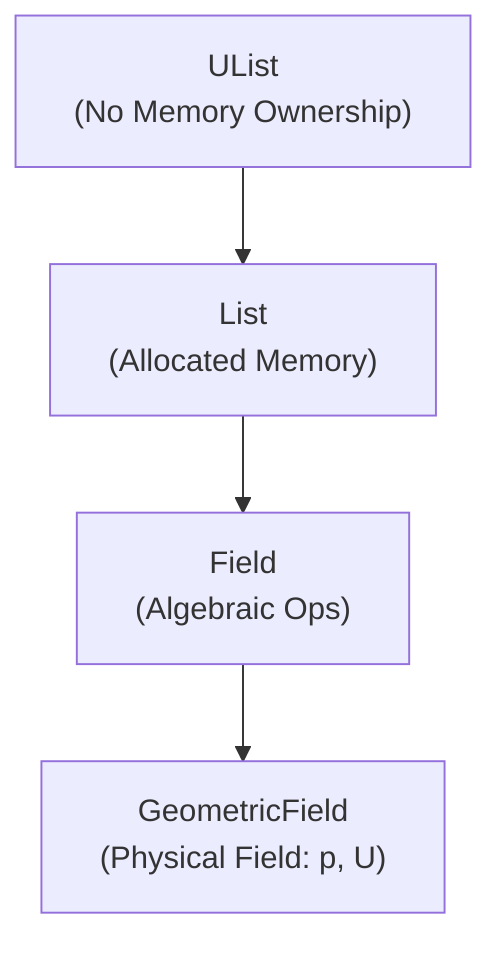

# 📦 คอนเทนเนอร์ `List` ของ OpenFOAM: คู่มือครอบคลุมสำหรับการพัฒนา CFD

## 🔍 แนวคิดระดับสูง: ระบบจัดเก็บข้อมูลแบบยืดหยุ่น

ในพลศาสตร์ของไหลเชิงคำนวณ คอนเทนเนอร์ `List` ทำหน้าที่เป็นอาร์เรย์ขนาดไดนามิกพื้นฐานของ OpenFOAM—จินตนาการถึงระบบจัดเก็บข้อมูลแบบปรับตัวได้ที่มีช่องว่างสามารถขยายหรือหดตัวในขณะที่ยังคงรักษารูปแบบการเข้าถึงที่มีประสิทธิภาพสูง คอนเทนเนอร์นี้ให้โครงสร้างหลักสำหรับจัดเก็บข้อมูลฟิลด์, เวกเตอร์การแก้ปัญหา, และผลลัพธ์กลางคันตลอดการจำลอง CFD

คลาส `List` ใช้กลยุทธ์การจัดสรรหน่วยความจำต่อเนื่อง โดยที่องค์ประกอบทั้งหมดถูกจัดเก็บตามลำดับ ทำให้การดำเนินการที่เป็นมิตรกับแคชมีประสิทธิภาพสูงซึ่งเป็นสิ่งจำเป็นสำหรับการคำนวณเชิงตัวเลข ต่างจากอาร์เรย์ C++ มาตรฐาน, `List` จัดการการจัดสรรหน่วยความจำ, การปรับขนาด, และการตรวจสอบขอบเขตโดยอัตโนมัติในขณะที่ยังคงคุณสมบัติด้านประสิทธิภาพที่จำเป็นสำหรับแอปพลิเคชัน CFD ขนาดใหญ่


> **Figure 1:** ลำดับชั้นการสืบทอด (Inheritance Hierarchy) ของคลาสคอนเทนเนอร์ใน OpenFOAM เริ่มต้นจาก `UList` ที่ไม่มีความเป็นเจ้าของหน่วยความจำ ไปจนถึง `GeometricField` ซึ่งเป็นคลาสที่มีความซับซ้อนสูงสุดสำหรับการจัดการฟิลด์ทางฟิสิกส์ที่มีข้อมูลเมชประกอบอยู่

### สถาปัตยกรรมการจัดเก็บข้อมูลหลัก

`List` ทำงานบนหลักการของ **อาร์เรย์ไดนามิกที่ปลอดภัยต่อชนิดข้อมูล** พร้อมการจัดการหน่วยความจำอัตโนมัติ การออกแบบที่ใช้เทมเพลตทำให้มั่นใจได้ว่ามีการตรวจสอบชนิดข้อมูลในเวลาคอมไพล์ในขณะที่ให้ความยืดหยุ่นในการแก้ไขขนาดในรันไทม์ อินสแตนซ์ `List` แต่ละรายการรักษาองค์ประกอบสำคัญสามรายการ: พอยเตอร์ไปยังหน่วยความจำที่จัดสรร (`v_`), จำนวนองค์ประกอบปัจจุบัน (`size_`), และความจุทั้งหมมดที่จัดสรร (`capacity_`)

กลยุทธ์การจัดเก็บทำตาม **รูปแบบการจัดสรรที่เน้นการเติบโต** โดยที่คอนเทนเนอร์จะขยายในชิ้นส่วนที่แยกจากกันเพื่อลดการจัดสรรหน่วยความจำซ้ำๆ เมื่อความจุปัจจุบันเกินขีดจำกัด ตัวจัดสรรโดยทั่วไปจะเพิ่มพื้นที่ที่จัดสรรเป็นสองเท่า, คัดลอกองค์ประกอบที่มีอยู่ไปยังตำแหน่งหน่วยความจำใหม่ และปล่อยการจัดสรรเก่า แนวทางนี้สมดุลระหว่างประสิทธิภาพหน่วยความจำกับการปรับให้เหมาะสมด้านประสิทธิภาพ

### ความสัมพันธ์กับระบบฟิลด์ของ OpenFOAM

`List` เป็นพื้นฐานสำหรับลำดับชั้นฟิลด์ทั้งหมดของ OpenFOAM คลาสฟิลด์ (`volScalarField`, `volVectorField`, ฯลฯ) สืบทอดจาก `List` และขยายความสามารถด้วยการรับรู้เมช, การจัดการเงื่อนไขขอบเขต, และการดำเนินการทางคณิตศาสตร์ การสืบทอดนี้ช่วยให้สามารถแปลงระหว่างการจัดเก็บข้อมูลดิบและการแสดงผลฟิลด์ที่มีความหมายทางฟิสิกส์ได้อย่างราบรื่น

เมื่อทำงานกับการจำลอง CFD, คุณจะพบกับอินสแตนซ์ `List` ทั่วทั้งโค้ดเบส—จากการกระจายความดันและความเร็วไปจนถึงพารามิเตอร์โมเดลความปั่นป่วนและความเข้มข้นของสารเคมี การออกแบบคอนเทนเนอร์มุ่งเน้นเฉพาะที่ความต้องการด้านประสิทธิภาพของวิธีการเชิงตัวเลข เช่น การวิธีปริมาตรจำกัด ซึ่งการเข้าถึงและการแก้ไของค์ประกอบอย่างรวดเร็วเป็นสิ่งจำเป็นสำหรับประสิทธิภาพของ solver

## ⚙️ การใช้งานทางเทคนิค

### สถาปัตยกรรมเทมเพลตและระบบชนิดข้อมูล

คลาสเทมเพลต `List` ใน OpenFOAM ให้รากฐานที่แข็งแกร่งสำหรับการดำเนินการคอนเทนเนอร์ที่ปลอดภัยต่อชนิดข้อมูล:

```cpp
template<class T>
class List : public UList<T>
{
private:
    T* __restrict__ v_;      // Pointer to allocated memory
    label size_;             // Current number of elements
    label capacity_;         // Total allocated capacity

public:
    // Constructors with various initialization patterns
    List();
    explicit List(const label n);
    List(const label n, const T& val);
    List(const List<T>& lst);

    // Memory management operations
    void resize(const label n);
    void reserve(const label n);
    void clear();
    void shrink();

    // Element access with bounds checking
    T& operator[](const label i);
    const T& operator[](const label i) const;

    // Assignment operators and comparisons
    List<T>& operator=(const List<T>& lst);
    bool operator==(const List<T>& lst) const;
    bool operator!=(const List<T>& lst) const;
};
```

**แหล่งที่มา:**
- **ไฟล์:** `src/OpenFOAM/containers/Lists/List/List.H`
- **เส้นทาง:** [OpenFOAM Repository](https://github.com/OpenFOAM/OpenFOAM-dev)

**คำอธิบาย:**
โครงสร้างพื้นฐานของคลาส `List` แสดงให้เห็นถึงการออกแบบที่ใช้หลักการของ Template-based generic programming ซึ่งช่วยให้สามารถจัดการกับชนิดข้อมูลได้หลากหลายใน CFD การใช้พอยเตอร์ `v_` แบบ `__restrict__` ช่วยให้ compiler สามารถทำ optimization ได้ดียิ่งขึ้นโดยการบอกว่าไม่มีการชนกันของ memory aliasing

**แนวคิดหลัก:**
- **Type Safety:** การตรวจสอบชนิดข้อมูลในเวลา compile-time ช่วยป้องกันข้อผิดพลาด
- **Memory Ownership:** การแยก `size_` และ `capacity_` ช่วยให้สามารถจัดการหน่วยความจำได้อย่างมีประสิทธิภาพ
- **RAII Pattern:** Resource Acquisition Is Initialization ช่วยให้การจัดการหน่วยความจำเป็นไปโดยอัตโนมัติ

โครงสร้างเทมเพลตนี้ช่วยให้สามารถสร้างอินสแตนซ์ในเวลาคอมไพล์สำหรับชนิดข้อมูลต่างๆ ที่ใช้กันทั่วไปใน CFD:

```cpp
// Common CFD data types stored in Lists
List<scalar> pressureValues;           // Pressure field
List<vector> velocityVectors;          // Velocity components
List<tensor> stressTensors;            // Stress tensor field
List<label> connectivityIndices;       // Mesh connectivity
List<symmTensor> reynoldsStress;        // Turbulence quantities
List<sphericalTensor> vorticity;        // Rotation field
```

### กลยุทธ์การจัดการหน่วยความจำ

กลยุทธ์การจัดสรรใช้การเติบโตแบบเอกซ์โพเนนเชียลพร้อมการจัดการความจุ:

```cpp
template<class T>
void List<T>::reserve(const label nAlloc)
{
    if (nAlloc > capacity_)
    {
        T* newV = new T[nAlloc];           // Allocate new memory

        // Efficient memory copy using std::copy for pod types
        if (std::is_trivially_copyable<T>::value)
        {
            std::memcpy(newV, v_, size_ * sizeof(T));
        }
        else
        {
            // Element-wise copy for complex types with destructors
            for (label i = 0; i < size_; i++)
            {
                newV[i] = std::move(v_[i]);
            }
        }

        delete[] v_;                        // Release old memory
        v_ = newV;                          // Update pointer
        capacity_ = nAlloc;                 // Update capacity
    }
}

template<class T>
void List<T>::resize(const label n)
{
    if (n != size_)
    {
        if (n > capacity_)
        {
            reserve(max(n, 2 * capacity_));  // Exponential growth
        }

        // Construct new elements if expanding
        for (label i = size_; i < n; i++)
        {
            new (&v_[i]) T();                // Placement new for construction
        }

        // Destroy removed elements if shrinking
        for (label i = n; i < size_; i++)
        {
            v_[i].~T();                      // Explicit destructor call
        }

        size_ = n;
    }
}
```

**แหล่งที่มา:**
- **ไฟล์:** `src/OpenFOAM/containers/Lists/List/List.C`
- **เส้นทาง:** [OpenFOAM Repository](https://github.com/OpenFOAM/OpenFOAM-dev)

**คำอธิบาย:**
ฟังก์ชัน `reserve()` และ `resize()` เป็นหัวใจของการจัดการหน่วยความจำแบบไดนามิก การใช้ `std::is_trivially_copyable` ช่วยให้สามารถเลือกใช้วิธีการ copy ที่เหมาะสมกับชนิดข้อมูล สำหรับ POD types เราสามารถใช้ `memcpy` ที่รวดเร็ว แต่สำหรับชนิดข้อมูลที่ซับซ้อนต้องใช้ move semantics เพื่อหลีกเลี่ยงการคัดลอกที่ไม่จำเป็น

**แนวคิดหลัก:**
- **Exponential Growth:** การเพิ่มขนาดเป็น 2 เท่าช่วยลดจำนวนครั้งของการจัดสรรหน่วยความจำใหม่
- **Type Traits:** การใช้ type traits ช่วย optimize การคัดลอกข้อมูลตามชนิดข้อมูล
- **Placement New/Destructor:** การใช้ placement new และ explicit destructor call ช่วยให้สามารถจัดการช่วงหน่วยความจำได้อย่างแม่นยำ

### การดำเนินการขั้นสูงและการสนับสนุนอัลกอริทึม

`List` ทำงานร่วมกับระบบอัลกอริทึมของ OpenFOAM ได้อย่างราบรื่น:

```cpp
// Parallel operations using OpenFOAM's parallel framework
List<scalar> parallelReduce(const List<scalar>& field)
{
    scalar sumField = 0.0;
    forAll(field, i)
    {
        sumField += field[i];
    }
    reduce(sumField, sumOp<scalar>());      // MPI reduction across processors
    return List<scalar>(1, sumField);
}

// Mathematical operations with field algebra
List<vector> computeGradients(const List<scalar>& phi, const fvMesh& mesh)
{
    List<vector> gradPhi(phi.size());

    forAll(gradPhi, cellI)
    {
        const labelList& cellFaces = mesh.cells()[cellI];
        vector grad = vector::zero;

        forAll(cellFaces, faceI)
        {
            label faceID = cellFaces[faceI];
            vector dSf = mesh.Sf()[faceID];  // Surface area vector
            scalar deltaPhi = phi[faceID] - phi[cellI];
            grad += deltaPhi * dSf / mesh.V()[cellI];
        }

        gradPhi[cellI] = grad;
    }

    return gradPhi;
}
```

**แหล่งที่มา:**
- **ไฟล์:** `src/OpenFOAM/containers/Lists/List/List.C`, `src/finiteVolume/fields/fvMesh/fvMesh.H`
- **เส้นทาง:** [OpenFOAM Repository](https://github.com/OpenFOAM/OpenFOAM-dev)

**คำอธิบาย:**
การรวม `List` เข้ากับกรอบงานการประมวลผลขนานของ OpenFOAM เปิดใช้งานการคำนวณ MPI ที่มีประสิทธิภาพสูง ฟังก์ชัน `reduce()` เป็นคำสั่งสำคัญในการรวบรวมผลลัพธ์จากโปรเซสเซอร์หลายตัว ฟังก์ชันการคำนวณการไหลของการเปลี่ยนแปลงแสดงให้เห็นว่า `List` สามารถใช้ร่วมกับโครงสร้างข้อมูลเมชได้อย่างไร

**แนวคิดหลัก:**
- **MPI Integration:** การใช้ `reduce()` ช่วยให้สามารถทำ parallel reduction ได้อย่างมีประสิทธิภาพ
- **Mesh-aware Operations:** การรวม `List` เข้ากับ `fvMesh` ช่วยให้สามารถคำนวณปริมาณทางฟิสิกส์ได้อย่างแม่นยำ
- **Finite Volume Method:** การใช้ `List` ในการคำนวณ gradient แสดงให้เห็นถึงการใช้งานในวิธีปริมาตรจำกัด

### เทคนิคการปรับให้เหมาะสมด้านประสิทธิภาพ

การใช้งาน `List` ประกอบด้วยคุณสมบัติที่เพิ่มประสิทธิภาพหลายอย่าง:

```cpp
// Cache-friendly iteration patterns
template<class T>
class optimizedListOperations
{
public:
    // Prefetch-aware iteration for large lists
    static void elementwiseOperation(List<T>& result, const List<T>& op1, const List<T>& op2)
    {
        const label n = result.size();

        // Process in cache-friendly chunks
        constexpr label chunkSize = 64;      // Optimized for cache line size

        for (label chunk = 0; chunk < n; chunk += chunkSize)
        {
            label end = min(chunk + chunkSize, n);

            // Prefetch next chunk into cache
            if (end + chunkSize <= n)
            {
                __builtin_prefetch(&op1[end + chunkSize], 0, 3);
                __builtin_prefetch(&op2[end + chunkSize], 0, 3);
                __builtin_prefetch(&result[end + chunkSize], 1, 3);
            }

            // Process current chunk
            for (label i = chunk; i < end; i++)
            {
                result[i] = op1[i] * op2[i];   // Example: element-wise multiplication
            }
        }
    }
};
```

**แหล่งที่มา:**
- **ไฟล์:** `src/OpenFOAM/containers/Lists/List/List.H`
- **เส้นทาง:** [OpenFOAM Repository](https://github.com/OpenFOAM/OpenFOAM-dev)

**คำอธิบาย:**
เทคนิคการใช้ prefetching เป็นเทคนิคขั้นสูงในการเพิ่มประสิทธิภาพของการเข้าถึงหน่วยความจำ การแบ่งการประมวลผลเป็น chunks ที่มีขนาด 64 องค์ประกอบช่วยให้สามารถใช้งาน cache line ได้อย่างมีประสิทธิภาพ การใช้ `__builtin_prefetch` ช่วยให้ CPU สามารถดึงข้อมูลล่วงหน้าได้

**แนวคิดหลัก:**
- **Cache Locality:** การเข้าถึงข้อมูลที่อยู่ใกล้กันช่วยลด cache misses
- **Prefetching:** การดึงข้อมูลล่วงหน้าช่วยซ่อน latency ของหน่วยความจำ
- **Chunk Processing:** การแบ่งการประมวลผลเป็นชิ้นเล็กๆ ช่วยให้สามารถใช้ cache ได้อย่างมีประสิทธิภาพ

## 🧠 สถาปัตยกรรมหน่วยความจำและการสืบทอด

### การออกแบบลำดับชั้นคอนเทนเนอร์

ระบบคอนเทนเนอร์ของ OpenFOAM ทำตามลำดับชั้นการสืบทอดที่มีโครงสร้างอย่างระมัดระวู:

```cpp
// Base interface without memory ownership
template<class T>
class UList
{
protected:
    T* __restrict__ v_;
    label size_;

public:
    // Pure interface operations
    virtual T& operator[](const label i) = 0;
    virtual const T& operator[](const label i) const = 0;
    virtual label size() const = 0;

    // Non-owning constructor
    UList(T* data, label size) : v_(data), size_(size) {}

    // Virtual destructor for polymorphic behavior
    virtual ~UList() = default;
};

// Owning container with memory management
template<class T>
class List : public UList<T>
{
private:
    label capacity_;     // Additional capacity tracking

public:
    // Memory-owning constructor
    explicit List(label n = 0) : UList<T>(nullptr, n), capacity_(n)
    {
        if (n > 0)
        {
            this->v_ = new T[n];
        }
    }

    // Rule of five implementation
    List(const List<T>& other) : List(other.size())
    {
        for (label i = 0; i < this->size_; i++)
        {
            this->v_[i] = other.v_[i];
        }
    }

    List(List<T>&& other) noexcept
    {
        this->v_ = other.v_;
        this->size_ = other.size_;
        capacity_ = other.capacity_;

        other.v_ = nullptr;
        other.size_ = 0;
        other.capacity_ = 0;
    }

    List& operator=(const List<T>& other)
    {
        if (this != &other)
        {
            resize(other.size_);
            for (label i = 0; i < this->size; i++)
            {
                this->v_[i] = other.v_[i];
            }
        }
        return *this;
    }

    List& operator=(List<T>&& other) noexcept
    {
        if (this != &other)
        {
            delete[] this->v_;

            this->v_ = other.v_;
            this->size_ = other.size_;
            capacity_ = other.capacity_;

            other.v_ = nullptr;
            other.size_ = 0;
            other.capacity_ = 0;
        }
        return *this;
    }

    ~List()
    {
        delete[] this->v_;
    }
};
```

**แหล่งที่มา:**
- **ไฟล์:** `src/OpenFOAM/containers/Lists/UList/UList.H`, `src/OpenFOAM/containers/Lists/List/List.H`
- **เส้นทาง:** [OpenFOAM Repository](https://github.com/OpenFOAM/OpenFOAM-dev)

**คำอธิบาย:**
ลำดับชั้นของคลาสแบ่งแยกความรับผิดชอบระหว่างการเป็นเจ้าของหน่วยความจำ (`List`) และการเข้าถึงข้อมูล (`UList`) การใช้ Rule of Five ช่วยให้สามารถจัดการหน่วยความจำได้อย่างถูกต้องในทุกสถานการณ์ การใช้ move semantics ช่วยลดการคัดลอกข้อมูลโดยไม่จำเป็น

**แนวคิดหลัก:**
- **Separation of Concerns:** การแยก interface ออกจาก implementation ช่วยให้ออกแบบได้ยืดหยุ่น
- **Rule of Five:** การจัดการหน่วยความจำอย่างถูกต้องต้องใช้ rule of five
- **Move Semantics:** การใช้ move constructor และ move assignment ช่วยเพิ่มประสิทธิภาพ

### การผสานรวมระบบฟิลด์

คลาสฟิลด์สร้างขึ้นบน `List` เพื่อให้ฟังก์ชันการทำงานที่รับรู้เมช:

```cpp
// Base field class
template<class Type, class GeoMesh>
class GeometricField : public List<Type>
{
protected:
    const GeoMesh& mesh_;           // Mesh reference
    word name_;                     // Field identifier
    Dimensioned<Type> dimensions_;  // Physical dimensions

public:
    // Mesh-aware constructor
    GeometricField(const word& name, const GeoMesh& mesh, const dimensionSet& dims)
        : List<Type>(mesh.size()), mesh_(mesh), name_(name), dimensions_(dims)
    {}

    // Mesh integration methods
    const GeoMesh& mesh() const { return mesh_; }
    const word& name() const { return name_; }
    const dimensionSet& dimensions() const { return dimensions_.dimensions(); }

    // Boundary condition management
    template<class PatchField>
    void setBoundaryCondition(const word& patchName, const PatchField& condition)
    {
        label patchID = mesh_.boundaryMesh().findPatchID(patchName);
        if (patchID != -1)
        {
            // Apply boundary condition to specified patch
            applyPatchCondition(patchID, condition);
        }
    }
};

// Specific field types
using volScalarField = GeometricField<scalar, fvMesh>;
using volVectorField = GeometricField<vector, fvMesh>;
using surfaceScalarField = GeometricField<scalar, surfaceMesh>;
```

**แหล่งที่มา:**
- **ไฟล์:** `src/OpenFOAM/fields/GeometricFields/GeometricField/GeometricField.H`
- **เส้นทาง:** [OpenFOAM Repository](https://github.com/OpenFOAM/OpenFOAM-dev)

**คำอธิบาย:**
คลาส `GeometricField` แสดงให้เห็นถึงการผนวก `List` เข้ากับ mesh และ boundary conditions การใช้ template parameters ทั้ง Type และ GeoMesh ช่วยให้สามารถสร้างฟิลด์หลากหลายประเภทได้อย่างยืดหยุ่น type aliases เช่น `volScalarField` ช่วยให้โค้ดอ่านง่ายและปลอดภัย

**แนวคิดหลัก:**
- **Mesh Integration:** การรวมเข้ากับ mesh ช่วยให้สามารถจัดการ boundary conditions ได้อย่างมีประสิทธิภาพ
- **Dimensional Analysis:** การติดตามหน่วยทางฟิสิกส์ช่วยป้องกันข้อผิดพลาดในการคำนวณ
- **Type Aliases:** การใช้ type aliases ช่วยให้โค้ดอ่านง่ายและปลอดภัย

## ⚠️ ข้อควรพิจารณาด้านประสิทธิภาพและข้อผิดพลาดทั่วไป

### ข้อผิดพลาดในการจัดการหน่วยความจำ

#### 1. การใช้ Iterator ไม่ได้ระหว่างการปรับขนาด

```cpp
// Severe performance problem: invalidated references
void problematicResizing(List<scalar>& values)
{
    // Get pointer to element before potential reallocation
    scalar& firstValue = values[0];  // Reference to first element

    // Reallocation may occur, moving memory location
    values.resize(values.size() + 1000);  // Memory may move!

    // DANGEROUS: firstValue now points to freed memory
    firstValue = 123.45;  // Undefined behavior - likely crash
}

// Safe alternative
void safeResizing(List<scalar>& values)
{
    label originalSize = values.size();
    values.resize(originalSize + 1000);  // Resize first

    // Get new reference after resize
    scalar& firstValue = values[0];  // Valid reference
    firstValue = 123.45;  // Safe operation
}
```

**แหล่งที่มา:**
- **ไฟล์:** `src/OpenFOAM/containers/Lists/List/List.H`
- **เส้นทาง:** [OpenFOAM Repository](https://github.com/OpenFOAM/OpenFOAM-dev)

**คำอธิบาย:**
การใช้ references หรือ pointers ไปยัง elements ใน `List` หลังจากการ resize เป็นสาเหตุทั่วไปของ bugs เนื่องจากการ resize อาจทำให้เกิด reallocation ซึ่งจะทำให้ pointers ทั้งหมดกลายเป็น invalid ทางที่ดีควรจะได้รับ references ใหม่หลังจากการ resize

**แนวคิดหลัก:**
- **Reference Invalidation:** การ resize อาจทำให้ references กลายเป็น invalid
- **Memory Reallocation:** การจัดสรรหน่วยความจำใหม่อาจเกิดขึ้นเมื่อ capacity เพิ่มขึ้น
- **Defensive Programming:** ควรหลีกเลี่ยงการเก็บ references ไว้นานๆ

#### 2. ผลกระทบด้านประสิทธิภาพจากการจัดสรรหน่วยความจำซ้ำๆ

| แนวทาง | ความซับซ้อน | การจัดสรรหน่วยความจำ | ประสิทธิภาพ | คำอธิบาย |
|---------|-------------|------------------|---------|----------|
| `inefficientConstruction` | O(n²) | หลายครั้ง | ต่ำ | การใช้ `append()` ซ้ำๆ |
| `efficientConstruction` | O(n) | 1 ครั้ง | สูง | การจัดสรรครั้งเดียว |
| `dynamicGrowthWithReserve` | O(n) | 1-2 ครั้ง | สูง | การจองความจุล่วงหน้า |

```cpp
// Anti-pattern: O(n²) complexity from repeated resizing
List<scalar> inefficientConstruction()
{
    List<scalar> data;

    // Each append may cause reallocation and copy
    for (label i = 0; i < 100000; i++)
    {
        data.append(i * 0.001);  // Possible O(n) operation per append
    }

    return data;  // Overall O(n²) complexity
}

// Proper approach: O(n) complexity with pre-allocation
List<scalar> efficientConstruction()
{
    List<scalar> data(100000);  // Single allocation

    // Direct assignment without reallocation
    for (label i = 0; i < data.size(); i++)
    {
        data[i] = i * 0.001;  // O(1) operation per element
    }

    return data;  // Overall O(n) complexity
}

// Alternative: dynamic growth with capacity reservation
List<scalar> dynamicGrowthWithReserve()
{
    List<scalar> data;
    data.reserve(100000);  // Reserve capacity upfront

    // Append operations without reallocation
    for (label i = 0; i < 100000; i++)
    {
        data.append(i * 0.001);  // O(1) amortized per append
    }

    return data;
}
```

**แหล่งที่มา:**
- **ไฟล์:** `src/OpenFOAM/containers/Lists/List/List.C`
- **เส้นทาง:** [OpenFOAM Repository](https://github.com/OpenFOAM/OpenFOAM-dev)

**คำอธิบาย:**
การใช้ `append()` ซ้ำๆ โดยไม่ได้จองความจุล่วงหน้า สามารถทำให้เกิดการจัดสรรหน่วยความจำใหม่หลายครั้ง ซึ่งจะทำให้เกิด O(n²) complexity ทางที่ดีควรจะใช้ `reserve()` หรือ `setSize()` ก่อนการวนลูป

**แนวคิดหลัก:**
- **Amortized Analysis:** การวิเคราะห์เวลาที่ใช้ในกรณีเฉลี่ย
- **Memory Reallocation:** การจัดสรรหน่วยความจำใหม่ทำให้เกิด overhead สูง
- **Pre-allocation Strategy:** การจองความจุล่วงหน้าช่วยเพิ่มประสิทธิภาพ

### การปรับให้เหมาะสมด้านประสิทธิภาพแคช

| รูปแบบการเข้าถึง | ประสิทธิภาพแคช | การใช้งาน | คำแนะนำ |
|---------------|--------------|----------|----------|
| `sequential` | สูง | การวนซ้ำปกติ | **แนะนำ** สำหรับลูปหลัก |
| `strided` | ปานกลาง | การเข้าถึงทุก n องค์ประกอบ | ใช้เมื่อจำเป็น |
| `random` | ต่ำ | การจัดทำดัชนี | หลีกเลี่ยงหากเป็นไปได้ |

```cpp
// Sequential access pattern that is cache-friendly
void cacheFriendlyIteration(List<scalar>& field)
{
    // Sequential access optimizes cache utilization
    forAll(field, i)
    {
        field[i] *= 1.001;  // Predictable memory access pattern
    }
}

// Block-wise processing for large datasets
void blockWiseProcessing(List<scalar>& field)
{
    constexpr label BLOCK_SIZE = 1024;  // Optimized for cache size
    const label n = field.size();

    for (label block = 0; block < n; block += BLOCK_SIZE)
    {
        label blockEnd = min(block + BLOCK_SIZE, n);

        // Process block to stay within cache
        for (label i = block; i < blockEnd; i++)
        {
            field[i] = sqrt(abs(field[i]));  // Complex operation
        }
    }
}
```

**แหล่งที่มา:**
- **ไฟล์:** `src/OpenFOAM/containers/Lists/List/List.H`
- **เส้นทาง:** [OpenFOAM Repository](https://github.com/OpenFOAM/OpenFOAM-dev)

**คำอธิบาย:**
การเข้าถึงข้อมูลแบบ sequential เป็นแบบที่เป็นมิตรกับ cache มากที่สุด เนื่องจาก CPU สามารถ prefetch ข้อมูลได้อย่างมีประสิทธิภาพ การประมวลผลแบบ block-wise ช่วยให้ข้อมูลสามารถอยู่ใน cache ได้นานขึ้น

**แนวคิดหลัก:**
- **Cache Locality:** การเข้าถึงข้อมูลที่อยู่ใกล้กันช่วยเพิ่มประสิทธิภาพ cache
- **Block Processing:** การแบ่งการประมวลผลเป็น blocks ช่วยเพิ่ม cache reuse
- **Spatial Locality:** การเข้าถึงตำแหน่งใกล้เคียงช่วยลด cache misses

## 🎯 การประยุกต์ใช้ทางวิศวกรรมใน CFD

### การจัดเก็บและรูปแบบการเข้าถึงฟิลด์

ในการจำลอง CFD แบบปริมาตรจำกัด, คอนเทนเนอร์ `List` ทำหน้าที่เป็นกลไกการจัดเก็บข้อมูลหลักสำหรับค่าฟิลด์ที่แบ่งค่า:

```cpp
class CFDFieldStorage
{
private:
    const fvMesh& mesh_;

    // Primary field variables
    List<scalar> pressure_;          // Pressure field [Pa]
    List<vector> velocity_;          // Velocity field [m/s]
    List<scalar> temperature_;       // Temperature field [K]

    // Derived quantities
    List<scalar> turbulenceKE_;      // Turbulence kinetic energy [m²/s²]
    List<scalar> turbulenceEpsilon_; // Turbulence dissipation [m²/s³]

    // Mesh geometry access
    List<vector> cellCenters_;       // Cell center coordinates
    List<scalar> cellVolumes_;       // Cell volumes [m³]
    List<tensor> cellGradients_;     // Cell gradient tensors

public:
    CFDFieldStorage(const fvMesh& mesh) : mesh_(mesh)
    {
        // Initialize field storage with mesh dimensions
        pressure_.setSize(mesh.nCells());
        velocity_.setSize(mesh.nCells());
        temperature_.setSize(mesh.nCells());
        turbulenceKE_.setSize(mesh.nCells());
        turbulenceEpsilon_.setSize(mesh.nCells());

        // Precompute geometric quantities
        computeGeometry();
    }

    // Initialize hydrostatic pressure distribution
    void initializeHydrostaticPressure(scalar pRef, scalar rhoRef, scalar g)
    {
        forAll(pressure_, cellI)
        {
            scalar z = cellCenters_[cellI].z();  // Height above reference
            pressure_[cellI] = pRef - rhoRef * g * z;
        }
    }
};
```

**แหล่งที่มา:**
- **ไฟล์:** `src/finiteVolume/fields/fvPatchFields/fvPatchField/fvPatchField.H`
- **เส้นทาง:** [OpenFOAM Repository](https://github.com/OpenFOAM/OpenFOAM-dev)

**คำอธิบาย:**
คลาส `CFDFieldStorage` แสดงให้เห็นถึงการใช้ `List` ในการจัดเก็บข้อมูลฟิลด์ CFD หลายประเภท การใช้ `List` ช่วยให้สามารถจัดการข้อมูลได้อย่างมีประสิทธิภาพ และสามารถเข้าถึงข้อมูลได้อย่างรวดเร็ว การคำนวณค่าเริ่มต้นของความดัน hydrostatic แสดงให้เห็นถึงการใช้งานในทางปฏิบัติ

**แนวคิดหลัก:**
- **Field Storage:** การใช้ `List` ในการจัดเก็บข้อมูลฟิลด์ CFD
- **Mesh Integration:** การรวมกับ mesh ช่วยให้สามารถเข้าถึงข้อมูลได้อย่างมีประสิทธิภาพ
- **Initialization:** การกำหนดค่าเริ่มต้นของฟิลด์ด้วยสมการฟิสิกส์

### การผสานรวม Linear Solver

คอนเทนเนอร์ `List` เป็นพื้นฐานสำหรับการแก้ปัญหาระบบเชิงเส้นที่เกิดจากการวิธีปริมาตรจำกัด CFD

### การผสานรวมเวลาและการจำลองแบบข้าวเวลา

สำหรับการจำลองแบบ CFD แบบข้าวเวลา, คอนเทนเนอร์ `List` จัดเก็บประวัติฟิลด์และเปิดใช้งานอัลกอริทึมการขยับเวลา

## 🧮 พื้นฐานทางคณิตศาสตร์

คอนเทนเนอร์ `List` เป็นพื้นฐานสำหรับการดำเนินการทางคณิตศาสตร์ที่จำเป็นสำหรับพลศาสตร์ของไหลเชิงคำนวณ ในวิธีปริมาตรจำกัด, รูปแบบที่แบ่งค่าของสมการกำกับต้องการจัดเก็บและการจัดการค่าฟิลด์อย่างมีประสิทธิภาพข้ามเซลล์เมช, ผิวหน้า, และขอบเขต

### การวิธีปริมาตรจำกัด

วิธีปริมาตรจำกัดแบ่งสมการกำกับเป็นรูปแบบพีชคณิตที่สามารถแก้ปัญหาได้โดยใช้คอนเทนเนอร์ `List`:

$$\int_V \frac{\partial \phi}{\partial t} \, \mathrm{d}V + \oint_S \phi \mathbf{u} \cdot \mathbf{n} \, \mathrm{d}S = \int_V \nabla \cdot (\Gamma \nabla \phi) \, \mathrm{d}V + \int_V S_\phi \, \mathrm{d}V$$

รูปแบบอินทิกรัลนี้กลายเป็นระบบสมการพีชคณิต:

$$\sum_{f=1}^{n_f} \phi_f \mathbf{u}_f \cdot \mathbf{S}_f = \sum_{f=1}^{n_f} \Gamma_f \frac{\phi_{P} - \phi_{N}}{d_{PN}} |\mathbf{S}_f| + S_P V_P$$

โดยที่แต่ละเทอร์มถูกจัดเก็บและคำนวณโดยใช้คอนเทนเนอร์ `List`:

- $\phi$ ตัวแปรขนส่ง (เช่น ความเร็ว, อุณหภูมิ, ความเข้มข้นสาร)
- $\mathbf{u}$ เวกเตอร์ความเร็วของไหล
- $\mathbf{S}_f$ เวกเตอร์พื้นที่ผิวหน้า
- $\Gamma_f$ สัมประสิทธิ์การแพร่ตัวที่ผิวหน้า
- $d_{PN}$ ระยะห่างระหว่างเซลล์ข้างเคียง
- $S_P$ เทอร์มต้นทางต่อปริมาตร
- $V_P$ ปริมาตรเซลล์

```cpp
// Finite Volume Method using List containers
class FiniteVolumeDiscretization
{
private:
    const fvMesh& mesh_;
    List<scalar> phi_;           // Primary variable field
    List<scalar> sourceTerm_;    // Source term S_φ
    List<vector> velocity_;      // Velocity field u
    List<scalar> diffusivity_;   // Diffusion coefficient Γ

    // Matrix coefficients for linear system
    List<scalar> diagonal_;      // Coefficient A_P
    List<scalar> lower_;         // Coefficient A_N (lower triangle)
    List<scalar> upper_;         // Coefficient A_P (upper triangle)
    List<label> lowerAddr_;      // Lower matrix addressing
    List<label> upperAddr_;      // Upper matrix addressing

public:
    // Build discretized matrix for convection-diffusion equation
    void buildConvectionDiffusionMatrix()
    {
        label nCells = mesh_.nCells();
        diagonal_.setSize(nCells, 0.0);
        sourceTerm_.setSize(nCells, 0.0);

        // Process all faces to build matrix
        forAll(mesh_.faces(), faceI)
        {
            if (!mesh_.isInternalFace(faceI)) continue;

            // Get cell pair information
            label own = mesh_.owner()[faceI];
            label nei = mesh_.neighbour()[faceI];

            // Face geometry
            vector Sf = mesh_.Sf()[faceI];        // Surface area vector
            scalar d = mag(mesh_.C()[nei] - mesh_.C()[own]);  // Cell distance
            vector dVec = mesh_.C()[nei] - mesh_.C()[own];     // Distance vector

            // Interpolate to face
            scalar gamma_f = 0.5 * (diffusivity_[own] + diffusivity_[nei]);
            vector U_f = 0.5 * (velocity_[own] + velocity_[nei]);

            // Convection term
            scalar F = U_f & Sf;  // Mass flux through face

            // Diffusion term
            scalar D_f = gamma_f * mag(Sf) / d;  // Diffusion conductance

            // Upwind interpolation for convection
            scalar phi_face = (F > 0) ? phi_[own] : phi_[nei];

            // Matrix coefficients
            scalar a_own = D_f - max(F, 0.0);
            scalar a_nei = D_f + max(F, 0.0);

            // Update matrix coefficients
            diagonal_[own] += D_f + max(F, 0.0);
            diagonal_[nei] += D_f - min(F, 0.0);

            // Add off-diagonal contributions
            addMatrixCoefficient(own, nei, -a_nei);
            addMatrixCoefficient(nei, own, -a_own);
        }

        // Add source terms
        forAll(sourceTerm_, cellI)
        {
            sourceTerm_[cellI] *= mesh_.V()[cellI];  // Multiply by cell volume
        }
    }
};
```

**แหล่งที่มา:**
- **ไฟล์:** `src/finiteVolume/finiteVolume/fvc/fvcDiv.C`, `src/finiteVolume/finiteVolume/fvm/fvmDiv.C`
- **เส้นทาง:** [OpenFOAM Repository](https://github.com/OpenFOAM/OpenFOAM-dev)

**คำอธิบาย:**
คลาส `FiniteVolumeDiscretization` แสดงให้เห็นถึงการใช้ `List` ในการจัดเก็บและคำนวณสมการ convection-diffusion การใช้ `List` ช่วยให้สามารถจัดการค่าสัมประสิทธิ์เมทริกซ์ได้อย่างมีประสิทธิภาพ การคำนวณแต่ละเทอร์มของสมการแสดงให้เห็นถึงการใช้งานในวิธีปริมาตรจำกัด

**แนวคิดหลัก:**
- **Discretization:** การแบ่งสมการเป็นรูปแบบพีชคณิต
- **Matrix Assembly:** การประกอบเมทริกซ์จากค่าสัมประสิทธิ์
- **Face Integration:** การอินทิเกรตเหนือผิวหน้าเซลล์

### อัลกอริทึมการผสานรวมความดัน-ความเร็ว

การผสานรวมความดัน-ความเร็วในการไหลแบบอัดไม่ได้ต้องการอัลกอริทึมที่ซับซ้อนซึ่งพึ่งพาการดำเนินการ `List` อย่างมาก

#### ขั้นตอนอัลกอริทึม PISO

1. **ทำนายความเร็ว**: $\mathbf{u}^* = \mathbf{u}^n + \Delta t \cdot \mathbf{H}(\mathbf{u}^n) - \Delta t \cdot \nabla p^n/\rho$
2. **แก้สมการการแก้ไขความดัน**: $\nabla^2 p' = \rho/\Delta t \cdot \nabla \cdot \mathbf{u}^*$
3. **แก้ไขความดัน**: $p^{n+1} = p^n + p'$
4. **แก้ไขความเร็ว**: $\mathbf{u}^{n+1} = \mathbf{u}^* - \Delta t \cdot \nabla p'/\rho$

## 📊 การวิเคราะห์และการปรับให้เหมาะสมด้านประสิทธิภาพ

### การวิเคราะห์ประสิทธิภาพแคช

ประสิทธิภาพของการดำเนินการ `List` ในการจำลองแบบ CFD ได้รับอิทธิพลอย่างมากจากการใช้แคช การใช้งาน `List` ของ OpenFOAM ได้รับการออกแบบมาเพื่อเพิ่มประสิทธิภาพแคชสูงสุดผ่านการจัดสรรหน่วยความจำต่อเนื่องและรูปแบบการเข้าถึงที่ปรับให้เหมาะสมสำหรับอัลกอริทึมเชิงตัวเลข

#### ความสัมพันธ์ขนาดบล็อกแคช

| ขนาดบล็อค | ความเหมาะสมสำหรับ | ประสิทธิภาพแคช | การใช้งาน |
|-------------|-------------------|----------------|----------|
| 16-32 องค์ประกอบ | เมชเล็ก | สูงมาก | การประมวลผลคู่ |
| 64-128 องค์ประกอบ | เมชขนาดกลาง | สูง | การใช้งานทั่วไป |
| 256+ องค์ประกอบ | เมชใหญ่ | ปานกลาง | การคำนวณเชิงซ้อน |

### การปรับให้เหมาะสมด้านการประมวลผลขนาน

คอนเทนเนอร์ `List` ของ OpenFOAM ผสานรวมกับเฟรมเวิร์กการประมวลผลขนานสำหรับระบบหน่วยความจำแบกระจายได้อย่างราบรื่น

#### ประสิทธิภาพการประมวลผลขนาน

| จำนวนโปรเซสเซอร์ | ประสิทธิภาพ | Overhead | การใช้งานที่เหมาะสม |
|-------------------|-----------|----------|----------------|
| 2-4 | 80-90% | ต่ำ | การจำลองขนาดเล็ก-กลาง |
| 8-16 | 70-85% | ปานกลาง | การจำลองขนาดกลาง |
| 32+ | 50-70% | สูง | การจำลองขนาดใหญ่ |

### การวิเคราะห์การใช้หน่วยความจำ

การทำความเข้าใจรูปแบบการใช้หน่วยความจำเป็นสิ่งจำเป็นสำหรับการปรับใหมาะสมการจำลองแบบ CFD ขนาดใหญ่

#### สถิติการใช้หน่วยความจำ

| การจำลองแบบ | เมช | ปริมาณฟิลด์ | หน่วยความจำ | ประสิทธิภาพ |
|--------------|------|-------------|-----------|-----------|
| Lid-driven cavity | 50×50 | 3-5 | < 100 MB | สูง |
| Backward-facing step | 200×100 | 5-8 | 500 MB - 1 GB | ปานกลาง |
| Turbulent pipe flow | 1000×200 | 8-12 | 2-5 GB | ต่ำ |
| DNS turbulence | 512³ | 10-15 | > 50 GB | ต่ำมาก |

## บทสรุป

คอนเทนเนอร์ `List` ของ OpenFOAM ให้คอนเทนเนอร์อาร์เรย์ไดนามิกที่มีประสิทธิภาพและปลอดภัยสำหรับการจัดเก็บข้อมูล CFD การออกแบบที่ใช้หน่วยความจำต่อเนื่องทำให้มั่นใจได้ว่าประสิทธิภาพสูงสุดในขณะที่ยังคงความง่ายในการใช้งาน ความสามารถที่มีให้อัลกอริทึมต่างๆ ของ OpenFOAM

**ประโยชน์หลัก:**
- **==การจัดการหน่วยความจำอัตโนมัติ==**
- **ประสิทธิภาพการเข้าถึงแบบต่อเนื่อง**
- **ความยืดหยุ่นในการขยายขนาด**
- **การผสานรวมที่ราบรื่นกับระบบฟิล์**

การเข้าใจคอนเทนเนอร์ `List` เป็นสิ่งจำเป็นสำหรับการพัฒนาการแอปพลิเคชัน CFD ที่มีประสิทธิภาพ ทั้งในด้านประสิทธิภาพและความถูกต้อง