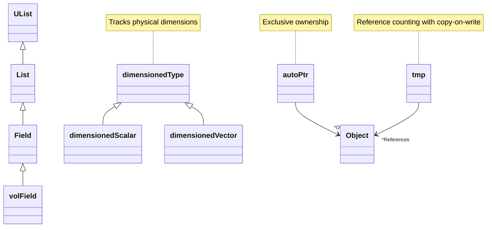
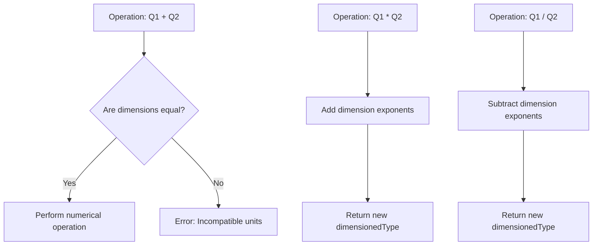

# Summary & Reference

## Overview

OpenFOAM's foundation primitives form the bedrock of computational fluid dynamics simulations, providing a robust framework that balances **portability**, **precision**, and **physics safety**. This comprehensive reference summarizes the seven core primitive types that enable reliable, efficient CFD computations across diverse computing environments.

---

## Quick Reference Table

| OpenFOAM Type | C++ Equivalent | Purpose | Common Usage |
|---------------|----------------|---------|---------------|
| `label` | `int` (portable) | Mesh indexing, counters | `label nCells = mesh.nCells();` |
| `scalar` | `float`/`double` | Physical quantities | `scalar p = 101325.0;` |
| `word` | `std::string` (optimized) | Dictionary keys, names | `word bcName = "inlet";` |
| `dimensionedType` | N/A | Values with units | `dimensionedScalar rho("rho", dimDensity, 1.225);` |
| `autoPtr` | `std::unique_ptr` | Exclusive ownership | `autoPtr<volScalarField> pPtr(...);` |
| `tmp` | N/A | Reference-counted temporaries | `tmp<volScalarField> tT = thermo.T();` |
| `List` | `std::vector` | Dynamic arrays | `List<scalar> p(mesh.nCells());` |

---

## Complete Code Example

```cpp
#include "fvCFD.H"

int main(int argc, char *argv[])
{
    #include "setRootCase.H"
    #include "createTime.H"
    #include "createMesh.H"

    // 1. Basic Primitives
    label nCells = mesh.nCells();           // Portable integer
    scalar pRef = 101325.0;                 // Configurable precision
    word fieldName = "U";                   // Optimized string

    // 2. Dimensioned Types
    dimensionedScalar rho
    (
        "rho",
        dimDensity,
        1.225
    );
    dimensionedScalar g
    (
        "g",
        dimAcceleration,
        9.81
    );

    // 3. Smart Pointers
    autoPtr<volScalarField> pPtr
    (
        new volScalarField
        (
            IOobject
            (
                "p",
                runTime.timeName(),
                mesh,
                IOobject::MUST_READ,
                IOobject::AUTO_WRITE
            ),
            mesh
        )
    );

    tmp<volScalarField> tT = thermo.T();    // Temporary temperature

    // 4. Containers
    List<scalar> pressureList(nCells);
    forAll(pressureList, cellI)
        pressureList[cellI] = pRef - rho.value() * g.value() * mesh.C()[cellI].z();

    // Physical calculations
    dimensionedScalar totalForce = rho * g * sum(mesh.V()) * average(pressureList);

    Info << "Total force: " << totalForce << endl;

    return 0;
}
```

---

## Core Concepts

### Primitive Types

OpenFOAM defines fundamental primitive types that guarantee **portability** and **performance** across different platforms:

#### **`label`**
- **Definition**: Portable integer type
- **Usage**: Mesh indices, loop counters, array sizes
- **Size**: Configuration-dependent (32-bit on most systems, 64-bit on large systems)

#### **`scalar`**
- **Definition**: Configurable floating-point type
- **Usage**: All physical quantities
- **Configurable**: Single or double precision at compile time

#### **`word`**
- **Definition**: Optimized string class
- **Usage**: Dictionary keys, field names
- **Performance**: Faster than `std::string` for OpenFOAM-specific use cases

### Dimensioned Types

One of OpenFOAM's key innovations is its built-in **dimensional analysis** system. The `dimensionedType` template class enforces **dimensional consistency** at compile time:

$$Q = \text{value} \times [\text{dimensions}]^{\text{exponents}}$$

**Base Dimensions:**
- Mass: $M$
- Length: $L$
- Time: $T$
- Temperature: $\Theta$
- Amount of substance: $A$
- Current: $I$
- Luminous intensity: $J$

**Example Dimensions:**
- Pressure: $[M][L]^{-1}[T]^{-2}$
- Velocity: $[L][T]^{-1}$

### Memory Management Patterns

OpenFOAM employs sophisticated memory management patterns for optimal performance:

#### **`autoPtr`**
- **Definition**: Exclusive ownership semantics
- **Comparison**: Similar to `std::unique_ptr` in C++11
- **Behavior**: Ownership transfers on copy, source becomes null

#### **`tmp`**
- **Definition**: Reference-counted temporary objects
- **Feature**: Copy-on-write semantics
- **Benefit**: Efficient sharing of expensive computations

### Container Classes

OpenFOAM's container classes are optimized for numerical computations:

#### **`List<T>`**
- **Function**: Dynamic arrays with bounds checking
- **Performance**: Cache-friendly memory access
- **Macro**: `forAll` for efficient iteration

#### **`Field<T>`**
- **Function**: Extends `List<T>` with mesh-aware operations
- **Capabilities**: Algebraic manipulations

#### **`volField<T>` and `surfaceField<T>`**
- **Location**: Cell centers and face centers
- **Capabilities**: Automatic interpolation between them

---

## Class Relationship Diagram


> **Figure 1:** แผนผังคลาส (Class Diagram) แสดงความสัมพันธ์และการสืบทอดระหว่างโครงสร้างข้อมูลหลักใน OpenFOAM ตั้งแต่คอนเทนเนอร์พื้นฐานไปจนถึงประเภทข้อมูลที่มีมิติทางฟิสิกส์และการจัดการหน่วยความจำผ่าน Smart Pointers

---

## Dimension Checking Workflow


> **Figure 2:** แผนผังขั้นตอนการตรวจสอบมิติทางฟิสิกส์ (Dimension Checking Workflow) ซึ่งแสดงให้เห็นว่าระบบจะตรวจสอบความเข้ากันได้ของหน่วยสำหรับการบวก/ลบ และคำนวณเลขชี้กำลังของมิติใหม่สำหรับการคูณ/หาร เพื่อรักษาความถูกต้องทางฟิสิกส์ตลอดการคำนวณ

---

## Performance Considerations

### Compile-Time Optimization

OpenFOAM leverages **template metaprogramming** to perform operations at compile time rather than runtime:

- **Dimensional checking**: Eliminates runtime overhead
- **Expression templates**: Reduces temporary object creation
- **Compile-time loop unrolling**: Improves vectorization

### Memory Access Patterns

Container classes are designed for optimal **cache** performance:

- **Contiguous memory layout**: Improves CPU cache utilization
- **SIMD operations**: Automatically applied where possible
- **Memory prefetching**: Optimized for typical CFD access patterns

### Parallel Efficiency

The smart pointer system facilitates efficient parallel computations:

- **Reference counting**: Simplifies distributed memory management
- **Copy-on-write semantics**: Reduces data transfer between processors
- **Automatic serialization/deserialization**: For MPI communication

---

## Best Practices

### Code Organization

Follow OpenFOAM naming conventions for **maintainability**:

- **Hungarian notation**: For member variables (`field_`, `mesh_`)
- **Class names**: Capitalized, camelCase
- **Local variables**: Meaningful prefixes (`cellI`, `faceJ`)

### Error Handling

Use **robust error handling** with OpenFOAM's mechanisms:

- **`FatalError`**: For unrecoverable situations
- **Runtime dimension checking**: With `dimensionSet`
- **Error messages**: Provide context and guidance

### Performance Optimization

Employ these strategies for optimal performance:

- **Prefer `tmp`**: Over explicit copies for expensive computations
- **Use `forAll` macros**: Instead of raw loops where appropriate
- **Minimize dynamic memory allocation**: In tight loops
- **Leverage expression templates**: For complex mathematical operations

---

## Further Reading

1. **Chapter 4.2**: Template Programming in OpenFOAM
2. **Chapter 4.3**: Memory Management Patterns
3. **Chapter 4.4**: Advanced Container Classes
4. **Chapter 6**: Field Operations and Algebra
5. **OpenFOAM Source Code**: The definitive reference

---

## Source Code Reference

For further study, examine these key header files:

| Type | Header File | Location |
|------|-------------|----------|
| `label` | `label.H` | `src/OpenFOAM/primitives/ints/label/` |
| `scalar` | `scalar.H` | `src/OpenFOAM/primitives/Scalar/scalar/` |
| `word` | `word.H` | `src/OpenFOAM/primitives/strings/word/` |
| `dimensionedType` | `dimensionedType.H` | `src/OpenFOAM/dimensionedTypes/dimensionedType/` |
| `autoPtr` | `autoPtr.H` | `src/OpenFOAM/memory/autoPtr/` |
| `tmp` | `tmp.H` | `src/OpenFOAM/memory/tmp/` |
| `List` | `List.H` | `src/OpenFOAM/containers/Lists/List/` |

---

## Mathematical Foundations

### Navier-Stokes Implementation

The dimensioned type system ensures the **Navier-Stokes equations** remain dimensionally consistent:

$$\rho \frac{\partial \mathbf{u}}{\partial t} + \rho (\mathbf{u} \cdot \nabla) \mathbf{u} = -\nabla p + \mu \nabla^2 \mathbf{u} + \mathbf{f}$$

Each term maintains consistent units of $\mathrm{N/m^3}$ (force per unit volume).

**Variables:**
- $\rho$: Density (kg/m³)
- $\mathbf{u}$: Velocity vector (m/s)
- $t$: Time (s)
- $p$: Pressure (Pa)
- $\mu$: Dynamic viscosity (Pa·s)
- $\mathbf{f}$: External force per unit volume (N/m³)

### Reynolds Number Calculation

The Reynolds number demonstrates dimensional consistency:

$$\text{Re} = \frac{\rho U L}{\mu}$$

- $\rho$ (density): $[M L^{-3}]$
- $U$ (velocity): $[L T^{-1}]$
- $L$ (length): $[L]$
- $\mu$ (viscosity): $[M L^{-1} T^{-1}]$

**Dimensions**: $\frac{[M L^{-3}] \times [L T^{-1}] \times [L]}{[M L^{-1} T^{-1}]} = [1]$ (dimensionless)

---

## Engineering Benefits Summary

| Benefit | Description | Impact |
|-----------|-------------|---------|
| **Numerical Consistency** | Same results across platforms | Reliable portability |
| **Dimensional Safety** | Compile-time unit error prevention | Physical correctness |
| **Memory Efficiency** | Smart pointers eliminate memory leaks | System stability |
| **Performance Optimization** | Reference counting reduces copy overhead | Computational speed |
| **Code Portability** | Single codebase works everywhere | Cross-platform development |

---

Mastering these primitives is essential for effective OpenFOAM programming. They enable the development of robust, portable, and physically meaningful CFD simulations that can scale from simple test cases to complex industrial applications.
