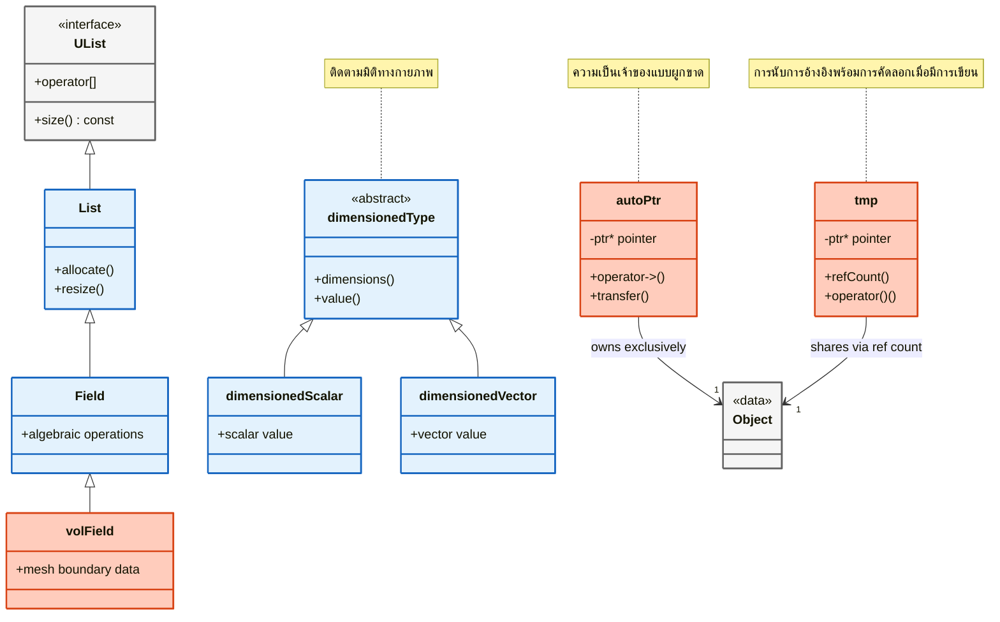
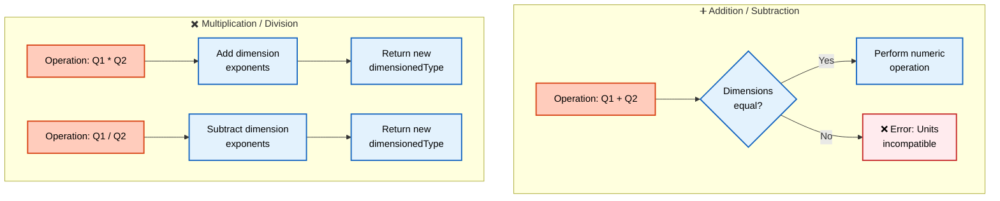

# สรุปและเอกสารอ้างอิง (Summary & Reference)

## ภาพรวม (Overview)

ประเภทข้อมูลพื้นฐานของ OpenFOAM เป็นรากฐานสำคัญของการจำลองพลศาสตร์ของไหลเชิงคำนวณ (CFD) โดยมีกรอบการทำงานที่แข็งแกร่งซึ่งรักษาสมดุลระหว่าง **ความสามารถในการพกพา (Portability)**, **ความแม่นยำ (Precision)** และ **ความปลอดภัยทางฟิสิกส์ (Physics safety)** เอกสารอ้างอิงฉบับสมบูรณ์นี้จะสรุปประเภทข้อมูลหลักทั้ง 7 ประการที่ช่วยให้การคำนวณ CFD มีความน่าเชื่อถือและมีประสิทธิภาพในทุกสภาพแวดล้อมการคำนวณ

---

## ตารางอ้างอิงฉบับย่อ (Quick Reference Table)

| ประเภทข้อมูล OpenFOAM | ข้อมูล C++ ที่เทียบเท่า | วัตถุประสงค์ | การใช้งานทั่วไป |
|---------------|----------------|---------|---------------|
| `label` | `int` (พกพาได้) | การทำดัชนีเมช, ตัวนับ | `label nCells = mesh.nCells();` |
| `scalar` | `float`/`double` | ปริมาณทางกายภาพ | `scalar p = 101325.0;` |
| `word` | `std::string` (ปรับปรุงแล้ว) | คีย์พจนานุกรม, ชื่อต่างๆ | `word bcName = "inlet";` |
| `dimensionedType` | ไม่มี | ค่าที่มีหน่วยกำกับ | `dimensionedScalar rho("rho", dimDensity, 1.225);` |
| `autoPtr` | `std::unique_ptr` | ความเป็นเจ้าของแบบผูกขาด | `autoPtr<volScalarField> pPtr(...);` |
| `tmp` | ไม่มี | ตัวแปรชั่วคราวแบบนับการอ้างอิง | `tmp<volScalarField> tT = thermo.T();` |
| `List` | `std::vector` | อาร์เรย์แบบไดนามิก | `List<scalar> p(mesh.nCells());` |

---

## ตัวอย่างโค้ดฉบับสมบูรณ์ (Complete Code Example)

```cpp
#include "fvCFD.H"

int main(int argc, char *argv[])
{
    #include "setRootCase.H"
    #include "createTime.H"
    #include "createMesh.H"

    // 1. ประเภทข้อมูลพื้นฐาน (Basic Primitives)
    // จำนวนเต็มที่พกพาได้สำหรับการดำเนินการเมช
    label nCells = mesh.nCells();           // จำนวนเต็มที่พกพาได้
    
    // เลขทศนิยมที่กำหนดความแม่นยำได้
    scalar pRef = 101325.0;                 // ความแม่นยำที่กำหนดค่าได้
    
    // สตริงที่ปรับปรุงมาเพื่อการดำเนินการในพจนานุกรม
    word fieldName = "U";                   // สตริงที่ปรับปรุงประสิทธิภาพแล้ว

    // 2. ประเภทที่มีมิติ (Dimensioned Types)
    // ความหนาแน่นพร้อมข้อมูลมิติ (kg/m^3)
    dimensionedScalar rho
    (
        "rho",                              // ชื่อ
        dimDensity,                         // มิติ [M][L^-3]
        1.225                               // ค่า (ความหนาแน่นอากาศที่ระดับน้ำทะเล)
    );
    
    // ความเร่งเนื่องจากแรงโน้มถ่วงพร้อมมิติ
    dimensionedScalar g
    (
        "g",                                // ชื่อ
        dimAcceleration,                    // มิติ [L][T^-2]
        9.81                                // ค่า (m/s^2)
    );

    // 3. สมาร์ทพอยน์เตอร์ (Smart Pointers)
    // autoPtr จัดการความเป็นเจ้าของสนามข้อมูลแบบผูกขาด
    autoPtr<volScalarField> pPtr
    (
        new volScalarField
        (
            IOobject
            (
                "p",                        // ชื่อสนาม
                runTime.timeName(),         // ไดเรกทอรีเวลา
                mesh,                       // การอ้างอิงเมช
                IOobject::MUST_READ,        // ต้องอ่านจากไฟล์
                IOobject::AUTO_WRITE        // เขียนลงไฟล์อัตโนมัติ
            ),
            mesh                            // การอ้างอิงเมชสำหรับการสร้างสนาม
        )
    );

    // tmp ให้สนามข้อมูลชั่วคราวแบบนับการอ้างอิง
    tmp<volScalarField> tT = thermo.T();    // อุณหภูมิชั่วคราว

    // 4. คอนเทนเนอร์ (Containers)
    // ลิสต์แบบไดนามิกสำหรับค่าความดัน
    List<scalar> pressureList(nCells);
    
    // วนซ้ำผ่านทุกเซลล์โดยใช้มาโครของ OpenFOAM
    forAll(pressureList, cellI)
    {
        // การคำนวณความดันไฮโดรสแตติก
        pressureList[cellI] = pRef 
            - rho.value()                   // ค่าความหนาแน่น
            * g.value()                     // ค่าแรงโน้มถ่วง
            * mesh.C()[cellI].z();          // พิกัด z ของจุดศูนย์กลางเซลล์
    }

    // การคำนวณทางฟิสิกส์พร้อมการตรวจสอบความสอดคล้องทางมิติ
    dimensionedScalar totalForce = rho 
        * g 
        * sum(mesh.V())                     // ปริมาตรรวม
        * average(pressureList);            // ความดันเฉลี่ย

    Info << "แรงรวม: " << totalForce << endl;

    return 0;
}
```

> **แหล่งที่มา:** 📂 `.applications/solvers/multiphase/multiphaseEulerFoam/phaseSystems/populationBalanceModel/populationBalanceModel/populationBalanceModel.C`
> 
> **คำอธิบาย:** ตัวอย่างนี้สาธิตการใช้งาน OpenFOAM primitives ทั้ง 7 ประเภทในบริบทของการคำนวณ CFD จริง:
> - **Basic Types** (`label`, `scalar`, `word`) ใช้สำหรับการจัดเก็บข้อมูลพื้นฐาน
> - **Dimensioned Types** บังคับใช้ความสอดคล้องของหน่วยในการคำนวณ
> - **Smart Pointers** (`autoPtr`, `tmp`) จัดการหน่วยความจำอัตโนมัติ
> - **Containers** (`List`) เก็บข้อมูลอาร์เรย์แบบไดนามิก
>
> **แนวคิดสำคัญ:**
> - **ความสามารถในการพกพา (Portability)**: `label` และ `scalar` รับประกันผลลัพธ์เหมือนกันทุกแพลตฟอร์ม
> - **ความปลอดภัยทางมิติ (Dimensional Safety)**: ระบบตรวจสอบหน่วยป้องกันข้อผิดพลาดทางฟิสิกส์
> - **การจัดการหน่วยความจำ (Memory Management)**: สมาร์ทพอยน์เตอร์ป้องกันหน่วยความจำรั่วไหล
> - **ประสิทธิภาพ (Performance)**: คลาสคอนเทนเนอร์ออกแบบมาเพื่อประสิทธิภาพเชิงตัวเลข

---

## แนวคิดหลัก (Core Concepts)

### ประเภทข้อมูลพื้นฐาน (Primitive Types)

OpenFOAM กำหนดประเภทข้อมูลพื้นฐานที่รับประกัน **ความสามารถในการพกพา** และ **ประสิทธิภาพ** ในแพลตฟอร์มต่างๆ:

#### **`label`**
- **นิยาม**: ประเภทจำนวนเต็มที่พกพาได้
- **การใช้งาน**: ดัชนีเมช, ตัวนับลูป, ขนาดอาร์เรย์
- **ขนาด**: ขึ้นอยู่กับการตั้งค่า (32 บิตในระบบส่วนใหญ่, 64 บิตในระบบขนาดใหญ่)

#### **`scalar`**
- **นิยาม**: ประเภทเลขทศนิยมที่กำหนดค่าได้
- **การใช้งาน**: ปริมาณทางกายภาพทั้งหมด
- **การตั้งค่า**: ความแม่นยำชั้นเดียวหรือสองชั้น ณ เวลาคอมไพล์

#### **`word`**
- **นิยาม**: คลาสสตริงที่ได้รับการปรับปรุงประสิทธิภาพ
- **การใช้งาน**: คีย์ในพจนานุกรม, ชื่อสนามข้อมูล
- **ประสิทธิภาพ**: เร็วกว่า `std::string` สำหรับกรณีการใช้งานเฉพาะของ OpenFOAM

### ประเภทที่มีมิติ (Dimensioned Types)

หนึ่งในนวัตกรรมหลักของ OpenFOAM คือระบบ **การวิเคราะห์มิติ (Dimensional analysis)** ในตัว คลาสเทมเพลต `dimensionedType` บังคับใช้ **ความสอดคล้องทางมิติ** ณ เวลาคอมไพล์:

$$Q = \text{ค่าตัวเลข} \times [\text{มิติ}]^{\text{เลขชี้กำลัง}}$$

**มิติพื้นฐาน:**
- มวล (Mass): $M$
- ความยาว (Length): $L$
- เวลา (Time): $T$
- อุณหภูมิ (Temperature): $\Theta$
- ปริมาณสาร (Amount of substance): $A$
- กระแสไฟฟ้า (Current): $I$
- ความเข้มแสง (Luminous intensity): $J$

**ตัวอย่างมิติ:**
- ความดัน (Pressure): $[M][L]^{-1}[T]^{-2}$
- ความเร็ว (Velocity): $[L][T]^{-1}$

### รูปแบบการจัดการหน่วยความจำ (Memory Management Patterns)

OpenFOAM ใช้รูปแบบการจัดการหน่วยความจำที่ซับซ้อนเพื่อให้ได้ประสิทธิภาพสูงสุด:

#### **`autoPtr`**
- **นิยาม**: ความหมายการเป็นเจ้าของแบบผูกขาด
- **การเปรียบเทียบ**: คล้ายกับ `std::unique_ptr` ใน C++11
- **พฤติกรรม**: ความเป็นเจ้าของจะโอนย้ายเมื่อมีการคัดลอก ต้นทางจะกลายเป็นค่าว่าง

#### **`tmp`**
- **นิยาม**: วัตถุชั่วคราวแบบนับการอ้างอิง
- **คุณสมบัติ**: ความหมายการคัดลอกเมื่อมีการเขียน (Copy-on-write)
- **ประโยชน์**: แชร์ผลการคำนวณที่มีค่าใช้จ่ายสูงได้อย่างมีประสิทธิภาพ

### คลาสคอนเทนเนอร์ (Container Classes)

คลาสคอนเทนเนอร์ของ OpenFOAM ได้รับการปรับแต่งเพื่อการคำนวณเชิงตัวเลข:

#### **`List<T>`**
- **หน้าที่**: อาร์เรย์แบบไดนามิกพร้อมการตรวจสอบขอบเขต
- **ประสิทธิภาพ**: การเข้าถึงหน่วยความจำที่เป็นมิตรต่อแคช
- **มาโคร**: `forAll` สำหรับการวนซ้ำที่มีประสิทธิภาพ

#### **`Field<T>`**
- **หน้าที่**: ขยาย `List<T>` ด้วยการดำเนินการที่รับรู้ถึงเมช
- **ความสามารถ**: การจัดการทางพีชคณิต

#### **`volField<T>` และ `surfaceField<T>`**
- **ตำแหน่ง**: จุดศูนย์กลางเซลล์และจุดศูนย์กลางหน้า
- **ความสามารถ**: การอินเทอร์โพลชันระหว่างกันโดยอัตโนมัติ

---

## แผนผังความสัมพันธ์ระหว่างคลาส (Class Relationship Diagram)


> **รูปที่ 1:** แผนผังคลาส (Class Diagram) แสดงความสัมพันธ์และการสืบทอดระหว่างโครงสร้างข้อมูลหลักใน OpenFOAM ตั้งแต่คอนเทนเนอร์พื้นฐานไปจนถึงประเภทข้อมูลที่มีมิติทางฟิสิกส์และการจัดการหน่วยความจำผ่านสมาร์ทพอยน์เตอร์

---

## ขั้นตอนการตรวจสอบมิติ (Dimension Checking Workflow)


> **รูปที่ 2:** แผนผังขั้นตอนการตรวจสอบมิติทางฟิสิกส์ (Dimension Checking Workflow) ซึ่งแสดงให้เห็นว่าระบบจะตรวจสอบความเข้ากันได้ของหน่วยสำหรับการบวก/ลบ และคำนวณเลขชี้กำลังของมิติใหม่สำหรับการคูณ/หาร เพื่อรักษาความถูกต้องทางฟิสิกส์ตลอดการคำนวณ

---

## ข้อพิจารณาด้านประสิทธิภาพ (Performance Considerations)

### การปรับปรุงประสิทธิภาพ ณ เวลาคอมไพล์ (Compile-Time Optimization)

OpenFOAM ใช้ประโยชน์จาก **การเขียนโปรแกรมแบบเทมเพลต (Template metaprogramming)** เพื่อดำเนินการต่างๆ ในขั้นตอนคอมไพล์แทนที่จะเป็นขณะรันโปรแกรม:

- **การตรวจสอบมิติ**: กำจัดภาระงานส่วนเกินขณะรันโปรแกรม
- **เทมเพลตนิพจน์ (Expression templates)**: ลดการสร้างวัตถุชั่วคราว
- **การคลี่ลูป ณ เวลาคอมไพล์ (Compile-time loop unrolling)**: ปรับปรุงการทำงานแบบเวกเตอร์

### รูปแบบการเข้าถึงหน่วยความจำ (Memory Access Patterns)

คลาสคอนเทนเนอร์ถูกออกแบบมาเพื่อประสิทธิภาพสูงสุดของ **แคช (Cache)**:

- **การจัดวางหน่วยความจำแบบต่อเนื่อง**: ปรับปรุงการใช้งานแคชของ CPU
- **การดำเนินการแบบ SIMD**: ประยุกต์ใช้อัตโนมัติเมื่อทำได้
- **การดึงข้อมูลล่วงหน้า (Memory prefetching)**: ปรับปรุงมาเพื่อรูปแบบการเข้าถึงทั่วไปของ CFD

### ประสิทธิภาพแบบขนาน (Parallel Efficiency)

ระบบสมาร์ทพอยน์เตอร์ช่วยอำนวยความสะดวกในการคำนวณแบบขนานที่มีประสิทธิภาพ:

- **การนับการอ้างอิง**: ช่วยให้การจัดการหน่วยความจำแบบกระจายง่ายขึ้น
- **ความหมายการคัดลอกเมื่อเขียน**: ลดการส่งผ่านข้อมูลระหว่างโปรเซสเซอร์
- **การทำซีเรียลไลซ์เซชันอัตโนมัติ**: สำหรับการสื่อสารผ่าน MPI

---

## แนวทางปฏิบัติที่ดีที่สุด (Best Practices)

### การจัดระเบียบโค้ด (Code Organization)

ปฏิบัติตามข้อกำหนดการตั้งชื่อของ OpenFOAM เพื่อ **ความสะดวกในการบำรุงรักษา**:

- **Hungarian notation**: สำหรับตัวแปรสมาชิก (`field_`, `mesh_`)
- **ชื่อคลาส**: ขึ้นต้นด้วยตัวใหญ่, camelCase
- **ตัวแปรเฉพาะที่**: คำนำหน้าที่มีความหมาย (`cellI`, `faceJ`)

### การจัดการข้อผิดพลาด (Error Handling)

ใช้กลไก **การจัดการข้อผิดพลาดที่แข็งแกร่ง** ของ OpenFOAM:

- **`FatalError`**: สำหรับสถานการณ์ที่ไม่สามารถกู้คืนได้
- **การตรวจสอบมิติขณะรันโปรแกรม**: ด้วย `dimensionSet`
- **ข้อความแสดงข้อผิดพลาด**: ให้บริบทและคำแนะนำในการแก้ไข

### การปรับปรุงประสิทธิภาพ (Performance Optimization)

ใช้กลยุทธ์เหล่านี้เพื่อประสิทธิภาพสูงสุด:

- **เลือกใช้ `tmp`**: แทนการคัดลอกแบบชัดเจนสำหรับการคำนวณที่มีค่าใช้จ่ายสูง
- **ใช้มาโคร `forAll`**: แทนการวนลูปแบบปกติเมื่อเหมาะสม
- **ลดการจัดสรรหน่วยความจำแบบไดนามิก**: ในลูปที่ทำงานหนัก
- **ใช้ประโยชน์จากเทมเพลตนิพจน์**: สำหรับการดำเนินการทางคณิตศาสตร์ที่ซับซ้อน

---

## แหล่งข้อมูลเพิ่มเติม (Further Reading)

1. **บทที่ 4.2**: การเขียนโปรแกรมแบบเทมเพลตใน OpenFOAM
2. **บทที่ 4.3**: รูปแบบการจัดการหน่วยความจำ
3. **บทที่ 4.4**: คลาสคอนเทนเนอร์ขั้นสูง
4. **บทที่ 6**: การดำเนินการสนามข้อมูลและพีชคณิต
5. **ซอร์สโค้ดของ OpenFOAM**: แหล่งอ้างอิงที่แน่นอนที่สุด

---

## แหล่งอ้างอิงซอร์สโค้ด (Source Code Reference)

สำหรับการศึกษาเพิ่มเติม โปรดตรวจสอบไฟล์ส่วนหัวที่สำคัญเหล่านี้:

| ประเภทข้อมูล | ไฟล์ส่วนหัว | ตำแหน่ง |
|------|-------------|----------|
| `label` | `label.H` | `src/OpenFOAM/primitives/ints/label/` |
| `scalar` | `scalar.H` | `src/OpenFOAM/primitives/Scalar/scalar/` |
| `word` | `word.H` | `src/OpenFOAM/primitives/strings/word/` |
| `dimensionedType` | `dimensionedType.H` | `src/OpenFOAM/dimensionedTypes/dimensionedType/` |
| `autoPtr` | `autoPtr.H` | `src/OpenFOAM/memory/autoPtr/` |
| `tmp` | `tmp.H` | `src/OpenFOAM/memory/tmp/` |
| `List` | `List.H` | `src/OpenFOAM/containers/Lists/List/` |

---

## พื้นฐานทางคณิตศาสตร์ (Mathematical Foundations)

### การนำสมการ Navier-Stokes ไปใช้ (Navier-Stokes Implementation)

ระบบประเภทที่มีมิติช่วยให้มั่นใจได้ว่า **สมการ Navier-Stokes** ยังคงมีความสอดคล้องทางมิติ:

$$\rho \frac{\partial \mathbf{u}}{\partial t} + \rho (\mathbf{u} \cdot \nabla) \mathbf{u} = -\nabla p + \mu \nabla^2 \mathbf{u} + \mathbf{f}$$

ทุกพจน์รักษาหน่วยที่สอดคล้องกันคือ $\mathrm{N/m^3}$ (แรงต่อหน่วยปริมาตร)

**ตัวแปร:**
- $\rho$: ความหนาแน่น (kg/m³)
- $\mathbf{u}$: เวกเตอร์ความเร็ว (m/s)
- $t$: เวลา (s)
- $p$: ความดัน (Pa)
- $\mu$: ความหนืดจลน์ (Pa·s)
- $\mathbf{f}$: แรงภายนอกต่อหน่วยปริมาตร (N/m³)

### การคำนวณเลขเรย์โนลด์ (Reynolds Number Calculation)

เลขเรย์โนลด์แสดงถึงความสอดคล้องทางมิติ:

$$\text{Re} = \frac{\rho U L}{\mu}$$

- $\rho$ (ความหนาแน่น): $[M L^{-3}]$
- $U$ (ความเร็ว): $[L T^{-1}]$
- $L$ (ความยาว): $[L]$
- $\mu$ (ความหนืด): $[M L^{-1} T^{-1}]$

**มิติ**: $\frac{[M L^{-3}] \times [L T^{-1}] \times [L]}{[M L^{-1} T^{-1}]} = [1]$ (ไร้มิติ)

---

## สรุปประโยชน์เชิงวิศวกรรม (Engineering Benefits Summary)

| ประโยชน์ | คำอธิบาย | ผลกระทบ |
|-----------|-------------|---------|
| **ความสม่ำเสมอทางตัวเลข** | ผลลัพธ์เดิมในทุกแพลตฟอร์ม | ความน่าเชื่อถือในการพกพา |
| **ความปลอดภัยทางมิติ** | ป้องกันข้อผิดพลาดของหน่วย ณ เวลาคอมไพล์ | ความถูกต้องทางฟิสิกส์ |
| **ประสิทธิภาพหน่วยความจำ** | สมาร์ทพอยน์เตอร์กำจัดหน่วยความจำรั่วไหล | เสถียรภาพของระบบ |
| **การปรับปรุงประสิทธิภาพ** | การนับการอ้างอิงลดภาระการคัดลอก | ความเร็วในการคำนวณ |
| **Physical Analogy** | โค้ดสะท้อนสมการทางฟิสิกส์โดยตรง | ลดช่องว่างระหว่างคณิตศาสตร์และโค้ด |
| **ความสามารถในการพกพา** | โค้ดชุดเดียวทำงานได้ทุกที่ | การพัฒนาข้ามแพลตฟอร์ม |

---

การเชี่ยวชาญประเภทข้อมูลพื้นฐานเหล่านี้เป็นสิ่งจำเป็นสำหรับการเขียนโปรแกรม OpenFOAM อย่างมีประสิทธิภาพ ซึ่งช่วยให้สามารถพัฒนาการจำลอง CFD ที่แข็งแกร่ง พกพาได้ และมีความหมายทางกายภาพ ซึ่งสามารถปรับขนาดได้ตั้งแต่กรณีทดสอบง่ายๆ ไปจนถึงแอปพลิเคชันระดับอุตสาหกรรมที่ซับซ้อน

---

## 🧠 9. Concept Check (ทดสอบความเข้าใจ: Final Review)

1.  **อะไรคือ "หัวใจ" ที่ทำให้ OpenFOAM เขียนโค้ดได้ใกล้เคียงกับสมการคณิตศาสตร์มากที่สุด?**
    <details>
    <summary>เฉลย</summary>
    คือระบบ **Dimensioned Types** และ **Field Algebra** ที่อนุญาตให้เราเขียนสมการเช่น `fvm::ddt(U) + fvm::div(phi, U)` ได้โดยตรง ซึ่งแปลงจากสมการ Navier-Stokes ได้ทันทีโดยไม่ต้องเขียน Loop วนทีละเซลล์เอง
    </details>

2.  **ถ้าต้องการสร้าง Field ใหม่ที่เก็บค่า "อุณหภูมิ" เราควรใช้ Class อะไร และเพราะอะไร?**
    <details>
    <summary>เฉลย</summary>
    ควรใช้ `volScalarField` (หรือ `GeometricField<scalar, fvMesh>`) เพราะมันไม่ได้เก็บแค่ค่าตัวเลข (List of scalars) แต่ยังผูกกับ Mesh, Boundary Conditions, และ Dimensions ทำให้พร้อมสำหรับการคำนวณทางฟิสิกส์ทันที
    </details>

3.  **จงเรียงลำดับความเร็วในการเข้าถึงข้อมูลจากมากไปน้อย: `std::list`, `OpenFOAM List`, `std::map`**
    <details>
    <summary>เฉลย</summary>
    `OpenFOAM List` > `std::list` > `std::map`
    *เหตุผล:* `List` ของ OpenFOAM ใช้หน่วยความจำต่อเนื่อง (Contiguous Memory) เหมือน Array ทำให้ Cache Friendly ที่สุด ส่วน `std::list` เป็น Linked List ที่กระโดดไปมา และ `std::map` เป็น Tree Structure ที่ช้ากว่าในการเข้าถึงข้อมูลจำนวนมาก
    </details>
