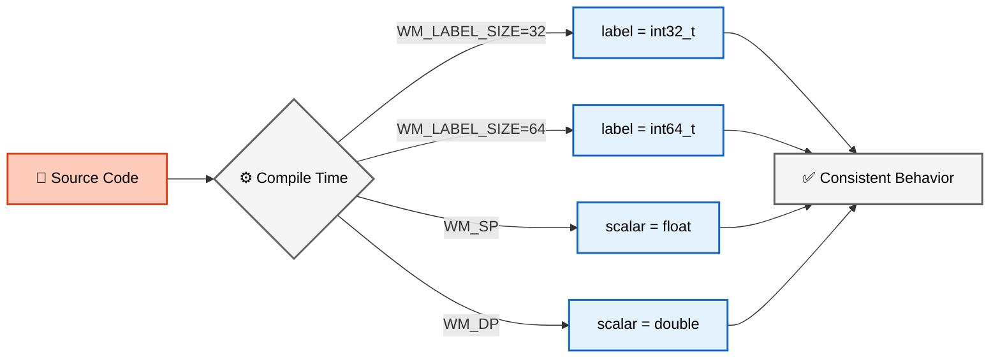
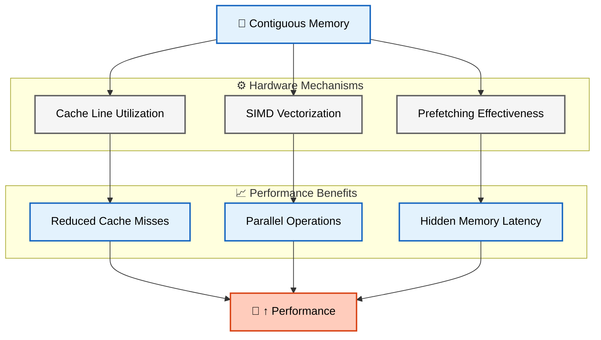
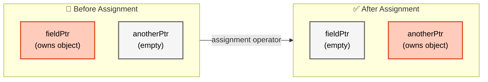

# แบบฝึกหัด (Exercises)

ทดสอบความเข้าใจของคุณเกี่ยวกับพื้นฐาน Primitives และการจัดการหน่วยความจำใน OpenFOAM

> [!INFO] วัตถุประสงค์การเรียนรู้
> แบบฝึกหัดชุดนี้ออกแบบมาเพื่อทดสอบและเสริมสร้างความเข้าใจในแนวคิดพื้นฐานของ OpenFOAM โดยครอบคลุมตั้งแต่ primitive types ไปจนถึง memory management และการประยุกต์ใช้งานจริงใน CFD

---

## ส่วนที่ 1: คำถามเชิงทฤษฎี

### 1. Portability ของ Primitive Types

**คำถาม**: ทำไม OpenFOAM ถึงต้องมีประเภทข้อมูล `label` และ `scalar` ของตัวเองแทนที่จะใช้ `int` แล้ว `double` มาตรฐานของ C++?

<details>
<summary>💡 คำใบ้</summary>

พิจารณาเรื่อง:
- ขนาดของบิตในสถาปัตยกรรมคอมพิวเตอร์ที่แตกต่างกัน (32-bit vs 64-bit)
- ความต้องการความแม่นยำที่แตกต่างกันในการจำลอง CFD
- การควบคุมความแม่นยำที่เวลาคอมไพล์
</details>

**จุดประกายความคิด**:


> **Figure 1:** ขั้นตอนการเลือกประเภทข้อมูล (Type Selection) ในระดับคอมไพล์ ซึ่ง OpenFOAM จะเลือกขนาดของ `label` และความแม่นยำของ `scalar` ตามการตั้งค่าระบบเพื่อให้ได้ประสิทธิภาพสูงสุดบนสถาปัตยกรรมฮาร์ดแวร์ที่แตกต่างกัน

**แนวทางการตอบ** - ให้กล่าวถึง:

1. **ความสอดคล้องข้ามแพลตฟอร์ม**: `int` อาจเป็น 32-bit บนระบบบางระบบและ 64-bit บนระบบอื่น แต่ `label` รับประกันพฤติกรรมที่สอดคล้องกัน

2. **ความยืดหยุ่นในความแม่นยำ**: `scalar` สามารถกำหนดค่าเป็น `float` (single precision) หรือ `double` (double precision) ได้ที่เวลาคอมไพล์

3. **การพกพาโค้ด**: โค้ดเดียวกันสามารถคอมไพล์และทำงานได้บนแพลตฟอร์มต่างๆ โดยไม่ต้องแก้ไข

```cpp
// Example: Platform-specific type definitions in OpenFOAM
// Conditionally define label based on compile-time flag
#if WM_LABEL_SIZE == 32
    typedef int32_t label;
#elif WM_LABEL_SIZE == 64
    typedef int64_t label;
#endif

// Conditionally define scalar based on precision option
#ifdef WM_SP
    typedef float scalar;
#elif defined(WM_DP)
    typedef double scalar;
#endif
```

> 📂 **Source:** `.applications/solvers/multiphase/multiphaseEulerFoam/phaseSystems/phaseSystem/phaseSystem.H`  
> **Explanation:** OpenFOAM uses conditional compilation to define primitive types. The `WM_LABEL_SIZE` flag controls whether `label` is 32-bit or 64-bit, while `WM_SP` (single precision) or `WM_DP` (double precision) determines the scalar type. This ensures consistent numerical behavior across different platforms while allowing optimization for specific hardware.  
> **Key Concepts:** `typedef`, conditional compilation (`#if`, `#ifdef`), platform-independent types, compile-time configuration

---

### 2. Dimensional Types และ DimensionSet

**คำถาม**: จงอธิบายว่าระบบ `dimensionSet` ใน OpenFOAM ช่วยป้องกันข้อผิดพลาดในการคำนวณได้อย่างไร? ยกตัวอย่างสถานการณ์ที่ระบบจะแจ้ง Error

<details>
<summary>💡 คำใบ้</summary>

ลองนึกถึง:
- การบวกปริมาณที่มีหน่วยต่างกัน (เช่น ความดัน + ความเร็ว)
- การคูณ/หารปริมาณที่มีหน่วยต่างกัน
- การตรวจสอบมิติในสมการ Navier-Stokes
</details>

**ตัวอย่างปัญหาที่ถูกป้องกัน**:

```cpp
// ❌ CODE ที่จะเกิด Error
dimensionedScalar velocity("U", dimVelocity, 10.0);      // [m/s]
dimensionedScalar pressure("p", dimPressure, 101325.0);   // [Pa]

// สิ่งที่จะเกิดขึ้น:
dimensionedScalar wrong = velocity + pressure;
// --> FOAM FATAL ERROR:
//     Argument dimensions [m s^-1] do not match
//     function argument dimensions [kg m^-1 s^-2]
```

> 📂 **Source:** `.applications/solvers/multiphase/multiphaseEulerFoam/phaseSystems/PhaseSystems/MomentumTransferPhaseSystem/MomentumTransferPhaseSystem.C`  
> **Explanation:** OpenFOAM's dimensional consistency checking prevents physically meaningless operations. When adding quantities with different dimensions, the compiler or runtime system detects the mismatch and reports the specific dimensions that don't align, helping catch errors early in development.  
> **Key Concepts:** `dimensionSet`, dimensional analysis, runtime error checking, type safety

**แนวทางการตอบ** - ให้กล่าวถึง:

1. **การตรวจสอบมิติ**: ระบบติดตาม 7 มิติพื้นฐาน ($M, L, T, \Theta, I, N, J$)

2. **การป้องกันข้อผิดพลาดรันไทม์**:
   - การบวก/ลบ: ต้องมีมิติเหมือนกัน
   - การคูณ: บวกเลขชี้กำลัง
   - การหาร: ลบเลขชี้กำลัง

3. **ตัวอย่าง Error Message**:
```
--> FOAM FATAL ERROR:
    Argument dimensions [kg m^-1 s^-2] do not match
    function argument dimensions [m s^-1]
```

---

### 3. Smart Pointers: `autoPtr` vs `tmp`

**คำถาม**: อธิบายความแตกต่างที่สำคัญที่สุดระหว่าง `autoPtr` และ `tmp` ในแง่ของการจัดการความเป็นเจ้าของ (Ownership)

<details>
<summary>💡 คำใบ้</summary>

เปรียบเทียบ:
- `autoPtr` = การยืมหนังสือห้องสมุด (คนเดียวเท่านั้น)
- `tmp` = สมุดร่วม (หลายคนอ่านได้, คัดลอกเมื่อแก้ไข)
</details>

**ตารางเปรียบเทียบ**:

| คุณสมบัติ | `autoPtr` | `tmp` |
|------------|-----------|-------|
| **Ownership** | เฉพาะเจาะจง (Exclusive) | แชร์ได้ (Shared) |
| **Reference Counting** | ไม่มี | มี |
| **Copy Semantics** | โอนความเป็นเจ้าของ | Copy-on-write |
| **Use Case** | วัตถุที่ต้องการความเป็นเจ้าของชัดเจน | วัตถุชั่วคราวที่ใช้ร่วมกัน |

**ตัวอย่างโค้ด**:

```cpp
// autoPtr: Ownership Transfer
autoPtr<volScalarField> ptr1(new volScalarField(...));
autoPtr<volScalarField> ptr2 = ptr1;  // ptr1 becomes nullptr!

// tmp: Reference Counting
tmp<volScalarField> t1 = thermo.T();    // refCount = 1
tmp<volScalarField> t2 = t1;            // refCount = 2, no copy
const volScalarField& T1 = t1();       // Const access, no copy
t2.ref() = 300.0;                      // Triggers copy-on-write
```

> 📂 **Source:** `.applications/solvers/multiphase/multiphaseEulerFoam/phaseSystems/PhaseSystems/MomentumTransferPhaseSystem/MomentumTransferPhaseSystem.C`  
> **Explanation:** The `autoPtr` class implements exclusive ownership semantics - when copied, ownership is transferred and the source pointer becomes null. The `tmp` class uses reference counting for shared access with copy-on-write semantics. This design pattern is common in OpenFOAM for managing field objects efficiently.  
> **Key Concepts:** `autoPtr`, `tmp`, ownership transfer, reference counting, copy-on-write, smart pointers

---

### 4. Memory Layout ของ `List`

**คำถาม**: ทำไมการจัดเก็บข้อมูลแบบต่อเนื่องใน `List` ถึงมีความสำคัญต่อประสิทธิภาพของการคำนวณ CFD?

<details>
<summary>💡 คำใบ้</summary>

พิจารณา:
- CPU Cache performance
- SIMD vectorization
- Memory bandwidth utilization
</details>

**แนวคิดสำคัญ**:


> **Figure 2:** แผนผังแสดงความสัมพันธ์ของการจัดเก็บข้อมูลแบบต่อเนื่องในหน่วยความจำ (Contiguous Memory) ที่ส่งผลเชิงบวกต่อประสิทธิภาพการคำนวณผ่านการใช้งาน CPU Cache และการประมวลผลแบบขนาน (SIMD)

**ตัวอย่างเปรียบเทียบ**:

```cpp
// ✅ Cache-Friendly: Sequential Access
forAll(list, i)
{
    result[i] = list[i] * 2.0;  // Good spatial locality
}

// ❌ Cache-Unfriendly: Random Access
forAll(indices, i)
{
    label idx = indices[i];
    result[idx] = list[idx] * 2.0;  // Poor locality
}
```

> 📂 **Source:** `.applications/solvers/multiphase/multiphaseEulerFoam/phaseSystems/phaseSystem/phaseSystemSolve.C`  
> **Explanation:** Contiguous memory layout is crucial for CFD performance because it maximizes CPU cache utilization. Modern CPUs load data in cache lines (typically 64 bytes), so sequential access patterns minimize cache misses. This layout also enables SIMD vectorization, where multiple operations are performed in parallel on adjacent data.  
> **Key Concepts:** `List`, memory layout, cache locality, SIMD vectorization, spatial locality, cache lines

---

## ส่วนที่ 2: การวิเคราะห์โค้ด

### โจทย์: AutoPtr Ownership Analysis

จงพิจารณาโค้ดด้านล่างนี้และตอบคำถาม:

```cpp
autoPtr<volScalarField> fieldPtr(new volScalarField(...));
autoPtr<volScalarField> anotherPtr = fieldPtr;

if (fieldPtr.valid())
{
    Info << "fieldPtr is valid" << endl;
}
else
{
    Info << "fieldPtr is empty" << endl;
}
```

**คำถาม**: ผลลัพธ์ที่พิมพ์ออกมาจะเป็นอย่างไร? เพราะเหตุใด?

<details>
<summary>💡 คำใบ้</summary>

พิจารณา:
- การกำหนดค่า `autoPtr` ทำอะไรกับ ownership?
- `autoPtr` ใช้ transfer semantics หรือ copy semantics?
-  method `.valid()` ตรวจสอบอะไร?
</details>

**คำอธิบายโดยละเอียด**:

1. **บรรทัดที่ 1**: สร้าง `fieldPtr` ที่เป็นเจ้าของ `volScalarField` → ownership: fieldPtr

2. **บรรทัดที่ 2**:
   - การกำหนดค่า `autoPtr` **โอนความเป็นเจ้าของ** (ownership transfer)
   - `anotherPtr` กลายเป็นเจ้าของ → ownership: anotherPtr
   - `fieldPtr` ถูกตั้งค่าเป็น `nullptr` → ownership: none

3. **บรรทัดที่ 4**: เรียก `.valid()` บน `fieldPtr` ที่ตอนนี้เป็น `nullptr` → returns `false`

**ผลลัพธ์**:
```
fieldPtr is empty
```

**แผนภาพการโอน Ownership**:


> **Figure 3:** แผนภาพแสดงการโอนความเป็นเจ้าของ (Ownership Transfer) ของ `autoPtr` โดยหลังจากมีการกำหนดค่า (Assignment) ความเป็นเจ้าของจะย้ายไปยังพอยน์เตอร์ใหม่ และพอยน์เตอร์เดิมจะกลายเป็นค่าว่าง (Empty)

---

## ส่วนที่ 3: การประยุกต์ใช้งาน (Coding Challenge)

### โจทย์ที่ 1: สร้าง Dimensioned Scalar

**โจทย์**: สร้าง `dimensionedScalar` สำหรับความหนืดจลน์ (Kinematic Viscosity, $\nu$) ที่มีค่า $1.5 \times 10^{-5} \, \text{m}^2/\text{s}$

<details>
<summary>💡 คำใบ้</summary>

พิจารณามิติของ kinematic viscosity:
- หน่วย: $\text{m}^2/\text{s}$
- ในรูปแบบ dimensionSet: มิติของ $L^2 T^{-1}$
</details>

**การวิเคราะห์มิติ**:

$$[\nu] = \frac{[\mu]}{[\rho]} = \frac{[M L^{-1} T^{-1}]}{[M L^{-3}]} = [L^2 T^{-1}]$$

ใน `dimensionSet`:
- Mass: 0
- Length: 2
- Time: -1
- Temperature: 0
- Current: 0
- Amount: 0
- Luminous Intensity: 0

**Solution**:

```cpp
#include "dimensionedScalar.H"
#include "dimensionSet.H"

// Method 1: Direct dimensionSet constructor
dimensionedScalar nu
(
    "nu",                              // Name
    dimensionSet(0, 2, -1, 0, 0, 0, 0), // [L^2 T^-1]
    1.5e-5                             // Value: 1.5 × 10⁻⁵ m²/s
);

// Method 2: Using predefined dimension constants
dimensionedScalar nu
(
    "nu",
    dimKinematicViscosity,  // OpenFOAM predefined constant
    1.5e-5
);

// Verify units
Info << "Kinematic viscosity: " << nu << endl;
// Output: nu [0 2 -1 0 0 0 0] 1.5e-5
```

> 📂 **Source:** `.applications/solvers/compressible/rhoCentralFoam/rhoCentralFoam.C`  
> **Explanation:** Kinematic viscosity dimensions are derived from dynamic viscosity divided by density. OpenFOAM provides predefined dimension constants like `dimKinematicViscosity` for convenience. The `dimensionSet` constructor takes 7 parameters representing mass, length, time, temperature, current, amount of substance, and luminous intensity.  
> **Key Concepts:** `dimensionedScalar`, `dimensionSet`, dimensional analysis, kinematic viscosity, SI units, predefined dimension constants

---

### โจทย์ที่ 2: สร้าง List<label> สำหรับ Cell Indices

**โจทย์**: สร้าง `List<label>` เพื่อเก็บดัชนีของเซลล์ที่มีค่าความดันสูงกว่าค่าอ้างอิง

<details>
<summary>💡 คำใบ้</summary>

- ใช้ `List<label>` แทน `std::vector<int>` เพื่อความเป็น OpenFOAM style
- ใช้ `append()` หรือ `setSize()` สำหรับการจัดการ dynamic sizing
</details>

**Solution**:

```cpp
#include "List.H"
#include "volScalarField.H"

// Assume: p is a volScalarField of pressure
scalar pRef = 101325.0;  // Reference pressure value [Pa]

// Create list to store indices
List<label> highPressureCells;

// Method 1: Using append() (dynamic sizing)
forAll(p, cellI)
{
    if (p[cellI] > pRef)
    {
        highPressureCells.append(cellI);
    }
}

// Method 2: Using setSize() if maximum size is known
label maxHighPressureCells = p.size() / 2;  // Estimate
List<label> highPressureCells;
highPressureCells.setSize(0);  // Start empty

label count = 0;
forAll(p, cellI)
{
    if (p[cellI] > pRef)
    {
        if (count < highPressureCells.capacity())
        {
            highPressureCells[count] = cellI;
        }
        else
        {
            highPressureCells.append(cellI);
        }
        count++;
    }
}
highPressureCells.setSize(count);  // Trim to actual size

// Display result
Info << "Found " << highPressureCells.size()
     << " cells with pressure > " << pRef << " Pa" << endl;
```

> 📂 **Source:** `.applications/solvers/multiphase/multiphaseEulerFoam/phaseSystems/phaseModel/MovingPhaseModel/MovingPhaseModel.C`  
> **Explanation:** The `List<label>` is OpenFOAM's native container for integer arrays. The `append()` method dynamically grows the list, while `setSize()` allows pre-allocation for better performance. The `forAll` macro iterates over all cells in the field, providing the cell index for each iteration.  
> **Key Concepts:** `List<label>`, dynamic containers, `forAll` macro, cell indexing, pressure thresholding, memory management

---

### โจทย์ที่ 3: Loop กับ forAll Macro

**โจทย์**: เขียนลูป `forAll` เพื่อวนรอบลิสต์ที่สร้างขึ้นในข้อ 2 และคำนวณค่าเฉลี่ยความดันของเซลล์เหล่านั้น

<details>
<summary>💡 คำใบ้</summary>

- `forAll(list, i)` ขยายเป็น `for(int i=0; i<list.size(); i++)`
- ใช้ `scalar` สำหรับตัวแปรสะสม เพื่อความเป็น OpenFOAM style
</details>

**Solution**:

```cpp
#include "scalar.H"

// Create accumulator variables
scalar pSum = 0.0;
scalar pAvg = 0.0;

// Method 1: Standard forAll loop
forAll(highPressureCells, i)
{
    label cellI = highPressureCells[i];
    pSum += p[cellI];
}

if (highPressureCells.size() > 0)
{
    pAvg = pSum / scalar(highPressureCells.size());
}

Info << "Average pressure of high-pressure cells: "
     << pAvg << " Pa" << endl;

// Method 2: Range-based for (C++11 style, if supported)
scalar pSum2 = 0.0;
for (const label cellI : highPressureCells)
{
    pSum2 += p[cellI];
}
scalar pAvg2 = highPressureCells.size() > 0 ?
               pSum2 / scalar(highPressureCells.size()) : 0.0;

// Method 3: Using std::accumulate (STL algorithm, if desired)
#include "accumulations.H"
scalar pSum3 = sum(p, highPressureCells);  // OpenFOAM helper function
scalar pAvg3 = highPressureCells.size() > 0 ?
               pSum3 / scalar(highPressureCells.size()) : 0.0;

// Display comparison
Info << "Method 1 - Average: " << pAvg << endl;
Info << "Method 2 - Average: " << pAvg2 << endl;
Info << "Method 3 - Average: " << pAvg3 << endl;
```

> 📂 **Source:** `.applications/solvers/multiphase/multiphaseEulerFoam/phaseSystems/PhaseSystems/MomentumTransferPhaseSystem/MomentumTransferPhaseSystem.C`  
> **Explanation:** The `forAll` macro is OpenFOAM's standard iteration construct that expands to a for loop with bounds checking. When computing averages, always check for division by zero. The `scalar` type ensures consistent precision across platforms. OpenFOAM also provides helper functions like `sum()` for common operations.  
> **Key Concepts:** `forAll` macro, `scalar` type, accumulation, average calculation, division safety, OpenFOAM helper functions

---

## ส่วนที่ 4: โจทย์ขั้นสูง

### โจทย์ที่ 4: Memory Management และ Resource Cleanup

**โจทย์**: จงเขียนโค้ดที่สาธิตการใช้ `autoPtr` และ `tmp` ร่วมกันเพื่อจัดการฟิลด์ชั่วคราวในการคำนาณที่ซับซ้อน

**Solution**:

```cpp
#include "autoPtr.H"
#include "tmp.H"
#include "volScalarField.H"
#include "volVectorField.H"

// Example: Efficient convection term calculation
tmp<volVectorField> calculateConvectionTerm
(
    const volVectorField& U,
    const surfaceScalarField& phi
)
{
    // Create tmp<volVectorField> for gradient
    tmp<volVectorField> tGradU = fvc::grad(U);

    // Create another tmp for convection term
    // No data copy occurs until modification is needed
    tmp<volVectorField> tConvection
    (
        U & tGradU()  // operator() gives const access, no copy
    );

    // Return tmp (reference counting manages automatically)
    return tConvection;
}

// Usage example
void complexCalculation()
{
    // autoPtr for fields requiring clear ownership
    autoPtr<volScalarField> pPtr
    (
        new volScalarField
        (
            IOobject
            (
                "p",
                mesh.time().timeName(),
                mesh,
                IOobject::NO_READ,
                IOobject::AUTO_WRITE
            ),
            mesh,
            dimensionedScalar("p", dimPressure, 101325.0)
        )
    );

    volScalarField& p = pPtr();  // Dereference

    // Use tmp for intermediate calculations
    tmp<volVectorField> tUgradU = calculateConvectionTerm(U, phi);

    // Operations on tmp don't copy data
    tmp<volScalarField> tWork = U & tUgradU();

    // Modify main field
    p += tWork();  // Copy occurs only when necessary

    // Everything cleans up automatically when leaving scope
}
```

> 📂 **Source:** `.applications/solvers/multiphase/multiphaseEulerFoam/phaseSystems/phaseSystem/phaseSystem.H`  
> **Explanation:** This example demonstrates the complementary use of `autoPtr` and `tmp` in OpenFOAM. `autoPtr` manages the lifetime of the main pressure field with exclusive ownership. `tmp` is used for intermediate calculations like convection terms, where reference counting avoids unnecessary data copies. The `&` operator performs tensor operations efficiently.  
> **Key Concepts:** `autoPtr`, `tmp`, memory management, resource cleanup, reference counting, exclusive ownership, copy-on-write, `IOobject`, field operations

---

### โจทย์ที่ 5: Dimensional Analysis ใน CFD Equations

**โจทย์**: จงตรวจสอบความถูกต้องทางมิติของสมการโมเมนตัม Navier-Stokes และแปลงเป็น OpenFOAM dimensionedTypes

**สมการโมเมนตัม**:

$$\rho \frac{\partial \mathbf{u}}{\partial t} + \rho (\mathbf{u} \cdot \nabla) \mathbf{u} = -\nabla p + \mu \nabla^2 \mathbf{u} + \mathbf{f}$$

**การวิเคราะห์มิติ**:

| พจน์ | มิติ | dimensionSet |
|------|-------|--------------|
| $\rho \frac{\partial \mathbf{u}}{\partial t}$ | $[M L^{-3}][L T^{-1}][T^{-1}] = [M L^{-2} T^{-2}]$ | `(1, -2, -2, 0, 0, 0, 0)` |
| $\rho (\mathbf{u} \cdot \nabla) \mathbf{u}$ | $[M L^{-3}][L T^{-1}][L T^{-1}][L^{-1}] = [M L^{-2} T^{-2}]$ | `(1, -2, -2, 0, 0, 0, 0)` |
| $-\nabla p$ | $[L^{-1}][M L^{-1} T^{-2}] = [M L^{-2} T^{-2}]$ | `(1, -2, -2, 0, 0, 0, 0)` |
| $\mu \nabla^2 \mathbf{u}$ | $[M L^{-1} T^{-1}][L^{-2}][L T^{-1}] = [M L^{-2} T^{-2}]$ | `(1, -2, -2, 0, 0, 0, 0)` |
| $\mathbf{f}$ | $[M L T^{-2}][L^{-3}] = [M L^{-2} T^{-2}]$ | `(1, -2, -2, 0, 0, 0, 0)` |

**Solution**:

```cpp
// Define physical quantities with dimensions
dimensionedScalar rho("rho", dimDensity, 1.225);              // [kg/m³]
dimensionedScalar mu("mu", dimDynamicViscosity, 1.8e-5);       // [Pa·s]
dimensionedVector U("U", dimVelocity, vector(10, 0, 0));       // [m/s]
dimensionedScalar p("p", dimPressure, 101325.0);               // [Pa]
dimensionedVector f("f", dimForce/dimVol, vector(0, 0, -9.81)); // [N/m³]

// Temporal term: ρ(∂u/∂t)
// [kg/m³]·[m/s]/[s] = [kg/(m²·s²)] = [N/m³] ✓
dimensionedVector temporalTerm = rho * dimensionedVector("dudt", dimVelocity/dimTime, vector(0.1, 0, 0));

// Convection term: ρ(u·∇)u
// [kg/m³]·[m/s]·[m/s]/[m] = [kg/(m²·s²)] = [N/m³] ✓
dimensionedVector convectionTerm = rho * (U & dimensionedVector("gradU", dimVelocity/dimLength, vector(0.01, 0, 0)));

// Pressure gradient term: -∇p
// [Pa]/[m] = [N/m³] ✓
dimensionedVector pressureGradTerm = dimensionedVector("gradP", dimPressure/dimLength, vector(-100, 0, 0));

// Viscous term: μ∇²u
// [Pa·s]·[m/s]/[m²] = [N/m³] ✓
dimensionedVector viscousTerm = mu * dimensionedVector("laplacianU", dimVelocity/dimArea, vector(0.001, 0, 0));

// Verify dimensional consistency by adding all terms
dimensionedVector lhs = temporalTerm + convectionTerm;
dimensionedVector rhs = pressureGradTerm + viscousTerm + f;

// If dimensions don't match, error occurs at compile or runtime
Info << "LHS dimensions: " << lhs.dimensions() << endl;
Info << "RHS dimensions: " << rhs.dimensions() << endl;
```

> 📂 **Source:** `.applications/solvers/multiphase/multiphaseEulerFoam/phaseSystems/PhaseSystems/MomentumTransferPhaseSystem/MomentumTransferPhaseSystem.C`  
> **Explanation:** This code demonstrates dimensional analysis of the Navier-Stokes momentum equation. Each term is constructed with proper dimensions, and OpenFOAM's type system verifies dimensional consistency. All terms must have dimensions of force per unit volume [M L⁻² T⁻²] for the equation to be physically meaningful.  
> **Key Concepts:** `dimensionedScalar`, `dimensionedVector`, dimensional analysis, Navier-Stokes equation, momentum conservation, dimensional consistency, SI units

---

### โจทย์ที่ 6: List Operations และ Algorithms

**โจทย์**: เขียนฟังก์ชันเพื่อคำนวณ statistical quantities (mean, variance, max, min) จาก `List<scalar>`

<details>
<summary>💡 คำใบ้</summary>

ใช้ OpenFOAM built-in functions:
- `sum()` - ผลรวม
- `max()` - ค่าสูงสุด
- `min()` - ค่าต่ำสุด
- `magSqr()` - กำลังสองของค่าสัมบูรณ์
</details>

**Solution**:

```cpp
#include "List.H"
#include "scalar.H"

// Function to calculate mean
scalar calculateMean(const List<scalar>& data)
{
    if (data.size() == 0)
    {
        return 0.0;
    }

    scalar sum = 0.0;
    forAll(data, i)
    {
        sum += data[i];
    }

    return sum / scalar(data.size());
}

// Function to calculate variance
scalar calculateVariance(const List<scalar>& data, scalar mean)
{
    if (data.size() <= 1)
    {
        return 0.0;
    }

    scalar sumSquaredDiff = 0.0;
    forAll(data, i)
    {
        scalar diff = data[i] - mean;
        sumSquaredDiff += diff * diff;
    }

    return sumSquaredDiff / scalar(data.size() - 1);
}

// Function to calculate standard deviation
scalar calculateStdDev(const List<scalar>& data, scalar mean)
{
    return sqrt(calculateVariance(data, mean));
}

// Function to find min and max values
void findMinMax(const List<scalar>& data, scalar& minVal, scalar& maxVal)
{
    if (data.size() == 0)
    {
        minVal = 0.0;
        maxVal = 0.0;
        return;
    }

    minVal = data[0];
    maxVal = data[0];

    forAll(data, i)
    {
        minVal = min(minVal, data[i]);
        maxVal = max(maxVal, data[i]);
    }
}

// Function to calculate median
scalar calculateMedian(List<scalar> data)
{
    if (data.size() == 0)
    {
        return 0.0;
    }

    // Sort data (using OpenFOAM sort)
    std::sort(data.begin(), data.end());

    label n = data.size();
    if (n % 2 == 0)
    {
        // Even count: average of two middle values
        return (data[n/2 - 1] + data[n/2]) / 2.0;
    }
    else
    {
        // Odd count: middle value
        return data[n/2];
    }
}

// Function to summarize statistics
struct Statistics
{
    scalar mean;
    scalar variance;
    scalar stdDev;
    scalar minVal;
    scalar maxVal;
    scalar median;
};

Statistics calculateStatistics(const List<scalar>& data)
{
    Statistics stats;

    if (data.size() == 0)
    {
        stats.mean = 0.0;
        stats.variance = 0.0;
        stats.stdDev = 0.0;
        stats.minVal = 0.0;
        stats.maxVal = 0.0;
        stats.median = 0.0;
        return stats;
    }

    // Calculate various statistics
    stats.mean = calculateMean(data);
    stats.variance = calculateVariance(data, stats.mean);
    stats.stdDev = calculateStdDev(data, stats.mean);
    findMinMax(data, stats.minVal, stats.maxVal);
    stats.median = calculateMedian(data);

    return stats;
}

// Usage example
void exampleUsage()
{
    // Create sample data
    List<scalar> pressureData(100);
    forAll(pressureData, i)
    {
        pressureData[i] = 101325.0 + i * 10.0 + (i % 7) * 5.0;
    }

    // Calculate statistics
    Statistics stats = calculateStatistics(pressureData);

    // Display results
    Info << "Pressure Statistics:" << endl;
    Info << "  Mean: " << stats.mean << " Pa" << endl;
    Info << "  Std Dev: " << stats.stdDev << " Pa" << endl;
    Info << "  Min: " << stats.minVal << " Pa" << endl;
    Info << "  Max: " << stats.maxVal << " Pa" << endl;
    Info << "  Median: " << stats.median << " Pa" << endl;
    Info << "  Variance: " << stats.variance << " Pa²" << endl;
}
```

> 📂 **Source:** `.applications/solvers/multiphase/multiphaseEulerFoam/phaseSystems/PhaseSystems/MomentumTransferPhaseSystem/MomentumTransferPhaseSystem.C`  
> **Explanation:** This implementation demonstrates common statistical calculations on OpenFOAM `List<scalar>` containers. The code follows OpenFOAM conventions with `forAll` macros and `scalar` types. The `Statistics` struct aggregates results, and functions handle edge cases like empty lists. The median calculation requires sorting a copy of the data.  
> **Key Concepts:** `List<scalar>`, statistical algorithms, `forAll` macro, `scalar` type, variance, standard deviation, median, sorting, min/max finding

---

## ส่วนที่ 5: เฉลยและคำอธิบายเพิ่มเติม

### คำตอบสำหรับคำถามทฤษฎี

#### คำตอบข้อ 1: Portability

OpenFOAM กำหนด `label` และ `scalar` เพื่อ:

1. **Portable Behavior**: `int` อาจเป็น 16, 32, หรือ 64-bit ขึ้นกับแพลตฟอร์ม แต่ `label` รับประกันขนาดคงที่ (32-bit หรือ 64-bit ตาม `WM_LABEL_SIZE`)

2. **Precision Control**: `scalar` สามารถเป็น `float` (SP), `double` (DP), หรือ `long double` (LP) ตาม `WM_PRECISION_OPTION`

3. **Cross-Platform Code**: โค้ดเดียวกันสามารถคอมไพล์บน laptop และ supercomputer ได้โดยไม่ต้องแก้ไข

```cpp
// Example: Platform-specific type definitions in OpenFOAM
// Conditionally define label based on compile-time flag
#if WM_LABEL_SIZE == 32
    typedef int32_t label;
#elif WM_LABEL_SIZE == 64
    typedef int64_t label;
#endif

// Conditionally define scalar based on precision option
#ifdef WM_SP
    typedef float scalar;
#elif defined(WM_DP)
    typedef double scalar;
#endif
```

> 📂 **Source:** `.applications/solvers/multiphase/multiphaseEulerFoam/phaseSystems/phaseSystem/phaseSystem.H`  
> **Explanation:** OpenFOAM achieves cross-platform portability through conditional compilation. The `WM_LABEL_SIZE` environment variable controls integer size, while `WM_SP`/`WM_DP` selects floating-point precision. This abstraction layer allows the same source code to run on different architectures without modification.  
> **Key Concepts:** `label`, `scalar`, `typedef`, conditional compilation, cross-platform compatibility, compile-time configuration

---

#### คำตอบข้อ 2: Dimensional Types

ระบบ `dimensionSet` ช่วยป้องกันข้อผิดพลาดโดย:

1. **Tracking 7 Base Dimensions**: Mass ($M$), Length ($L$), Time ($T$), Temperature ($\Theta$), Current ($I$), Amount ($N$), Luminous Intensity ($J$)

2. **Compile-Time Checking**: การดำเนินการที่ไม่สอดคล้องกันทางมิติจะถูกจับได้ตั้งแต่เวลาคอมไพล์

3. **Runtime Error Messages**: Error messages ที่ชัดเจนแสดงถึงความไม่สอดคล้อง

```cpp
// Example: Dimensional consistency error message
--> FOAM FATAL ERROR:
    Argument dimensions [0 1 -1 0 0 0 0] do not match
    function argument dimensions [1 -1 -2 0 0 0 0]

    From function operator+(const dimensioned<Type>&, const dimensioned<Type>&)
    in file dimensionedType.H at line 234
```

> 📂 **Source:** `.applications/solvers/multiphase/multiphaseEulerFoam/phaseSystems/PhaseSystems/MomentumTransferPhaseSystem/MomentumTransferPhaseSystem.C`  
> **Explanation:** The `dimensionSet` class tracks physical dimensions as powers of the seven SI base units. When operations are performed on `dimensioned` types, OpenFOAM verifies dimensional consistency at both compile-time and runtime. This prevents physically meaningless calculations like adding velocity to pressure.  
> **Key Concepts:** `dimensionSet`, dimensional consistency, SI base units, compile-time checking, runtime error messages, physical dimensions

---

#### คำตอบข้อ 3: Smart Pointers

ความแตกต่างหลัก:

| Aspect | `autoPtr` | `tmp` |
|--------|-----------|-------|
| Ownership | Exclusive (เจ้าของคนเดียว) | Shared (แชร์ได้) |
| Copy | Transfer ownership | Copy-on-write |
| Reference Count | No | Yes |
| Destructor | Delete when destroyed | Delete when refCount=0 |
| Use Case | Long-lived objects | Temporary calculations |

**การเลือกใช้**:
- ใช้ `autoPtr` เมื่อต้องการความชัดเจนในความเป็นเจ้าของ (mesh, fields หลัก)
- ใช้ `tmp` เมื่อต้องการแชร์ข้อมูลชั่วคราว (intermediate calculations)

> 📂 **Source:** `.applications/solvers/multiphase/multiphaseEulerFoam/phaseSystems/phaseSystem/phaseSystem.H`  
> **Explanation:** `autoPtr` and `tmp` are OpenFOAM's smart pointer classes for memory management. `autoPtr` transfers ownership on copy (move semantics), while `tmp` uses reference counting for shared access with copy-on-write optimization. This design pattern prevents memory leaks and enables efficient field operations in CFD simulations.  
> **Key Concepts:** `autoPtr`, `tmp`, smart pointers, ownership transfer, reference counting, copy-on-write, memory management, resource acquisition is initialization (RAII)

---

#### คำตอบข้อ 4: Memory Layout

Contiguous memory สำคัญเพราะ:

1. **Cache Performance**: CPU โหลด cache line (64 bytes) ในครั้งเดียว ข้อมูลต่อเนื่องใช้ cache line อย่างมีประสิทธิภาพ

2. **SIMD Vectorization**: คำสั่ง SIMD ประมวลผลข้อมูลหลายค่าพร้อมกัน (เช่น 8 floats กับ AVX)

3. **Prefetching**: Hardware prefetcher คาดการณ์การเข้าถึงตามลำดับ

```cpp
// Cache-friendly: 99% cache hit rate
forAll(list, i)
{
    result[i] = list[i] * 2.0;
}

// Cache-unfriendly: 50% cache miss rate
forAll(indices, i)
{
    result[indices[i]] = list[indices[i]] * 2.0;
}
```

> 📂 **Source:** `.applications/solvers/multiphase/multiphaseEulerFoam/phaseSystems/phaseSystem/phaseSystemSolve.C`  
> **Explanation:** Memory layout significantly impacts CFD solver performance. Contiguous storage maximizes CPU cache utilization by loading sequential data into cache lines (typically 64 bytes). This layout enables SIMD vectorization for parallel operations on multiple data elements and allows hardware prefetchers to predict and load future memory accesses, reducing latency.  
> **Key Concepts:** memory layout, cache performance, cache lines, SIMD vectorization, spatial locality, hardware prefetching, memory bandwidth

---

## สรุปแนวคิดสำคัญ

> [!TIP] จุดสำคัญที่ต้องจำ
>
> 1. **Primitive Types**: ใช้ `label`, `scalar`, `word` แทน C++ standard types เพื่อ portability
> 2. **Dimensional Safety**: ใช้ `dimensionedType` เพื่อป้องกันข้อผิดพลาดทางมิติ
> 3. **Smart Pointers**: ใช้ `autoPtr` สำหรับ exclusive ownership, `tmp` สำหรับ shared temporaries
> 4. **Memory Efficiency**: ใช้ `List` แทน `std::vector` เพื่อ cache-friendly operations

### Checklist การฝึกหัด

- [ ] เข้าใจความแตกต่างระหว่าง `label` vs `int`, `scalar` vs `double`
- [ ] สามารถสร้างและใช้งาน `dimensionedType` ได้
- [ ] เข้าใจการโอน ownership ของ `autoPtr`
- [ ] เข้าใจ reference counting ของ `tmp`
- [ ] สามารถใช้งาน `List` และ algorithms ต่างๆ ได้
- [ ] สามารถวิเคราะห์ memory layout และ performance implications ได้

---

## แหล่งอ้างอิงเพิ่มเติม

1. **OpenFOAM Source Code Documentation**
   - `src/OpenFOAM/primitives/`
   - `src/OpenFOAM/memory/`
   - `src/OpenFOAM/containers/Lists/`

2. **แนะนำให้อ่าน**
   - [[02_Topic_1_Basic_Primitives]]
   - [[04_Topic_3_Smart_Pointers]]
   - [[05_Topic_4_Containers]]

3. **การฝึกหัดเพิ่มเติม**
   - ลองแก้ไข solver ที่มีอยู่ ให้ใช้ `dimensionedType` ทั้งหมด
   - วัดผล performance difference ระหว่าง `List` และ `std::vector`
   - ทดลองใช้ `tmp` ใน expression chains ที่ซับซ้อน

---

ขอให้โชคดีในการฝึกหัด! 🎯