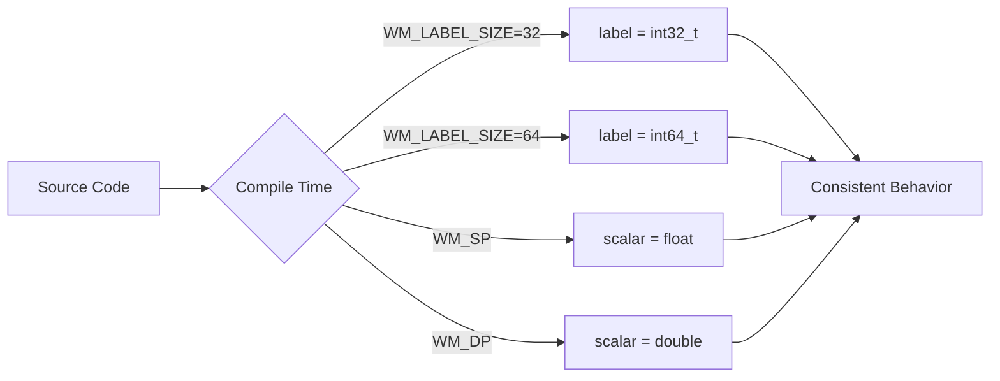
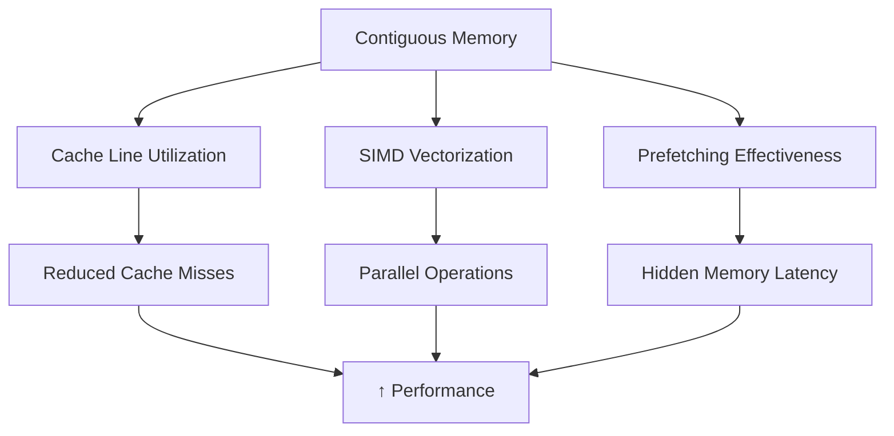
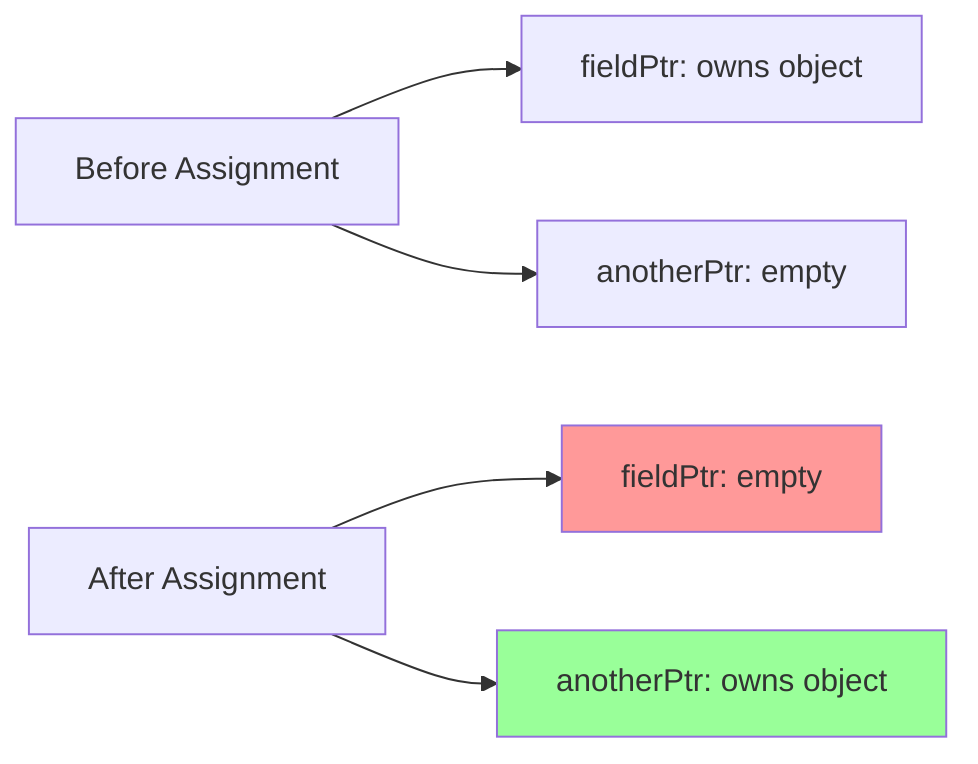

# แบบฝึกหัด (Exercises)

ทดสอบความเข้าใจของคุณเกี่ยวกับพื้นฐาน Primitives และการจัดการหน่วยความจำใน OpenFOAM

> [!INFO] วัตถุประสงค์การเรียนรู้
> แบบฝึกหัดชุดนี้ออกแบบมาเพื่อทดสอบและเสริมสร้างความเข้าใจในแนวคิดพื้นฐานของ OpenFOAM โดยครอบคลุมตั้งแต่ primitive types ไปจนถึง memory management และการประยุกต์ใช้งานจริงใน CFD

---

## ส่วนที่ 1: คำถามเชิงทฤษฎี

### 1. Portability ของ Primitive Types

**คำถาม**: ทำไม OpenFOAM ถึงต้องมีประเภทข้อมูล `label` และ `scalar` ของตัวเองแทนที่จะใช้ `int` แล้ว `double` มาตรฐานของ C++?

<details>
<summary>💡 คำใบ้</summary>

พิจารณาเรื่อง:
- ขนาดของบิตในสถาปัตยกรรมคอมพิวเตอร์ที่แตกต่างกัน (32-bit vs 64-bit)
- ความต้องการความแม่นยำที่แตกต่างกันในการจำลอง CFD
- การควบคุมความแม่นยำที่เวลาคอมไพล์
</details>

**จุดประกายความคิด**:


> **Figure 1:** ขั้นตอนการเลือกประเภทข้อมูล (Type Selection) ในระดับคอมไพล์ ซึ่ง OpenFOAM จะเลือกขนาดของ `label` และความแม่นยำของ `scalar` ตามการตั้งค่าระบบเพื่อให้ได้ประสิทธิภาพสูงสุดบนสถาปัตยกรรมฮาร์ดแวร์ที่แตกต่างกัน

**แนวทางการตอบ** - ให้กล่าวถึง:

1. **ความสอดคล้องข้ามแพลตฟอร์ม**: `int` อาจเป็น 32-bit บนระบบบางระบบและ 64-bit บนระบบอื่น แต่ `label` รับประกันพฤติกรรมที่สอดคล้องกัน

2. **ความยืดหยุ่นในความแม่นยำ**: `scalar` สามารถกำหนดค่าเป็น `float` (single precision) หรือ `double` (double precision) ได้ที่เวลาคอมไพล์

3. **การพกพาโค้ด**: โค้ดเดียวกันสามารถคอมไพล์และทำงานได้บนแพลตฟอร์มต่างโ โดยไม่ต้องแก้ไข

---

### 2. Dimensional Types และ DimensionSet

**คำถาม**: จงอธิบายว่าระบบ `dimensionSet` ใน OpenFOAM ช่วยป้องกันข้อผิดพลาดในการคำนวณได้อย่างไร? ยกตัวอย่างสถานการณ์ที่ระบบจะแจ้ง Error

<details>
<summary>💡 คำใบ้</summary>

ลองนึกถึง:
- การบวกปริมาณที่มีหน่วยต่างกัน (เช่น ความดัน + ความเร็ว)
- การคูณ/หารปริมาณที่มีหน่วยต่างกัน
- การตรวจสอบมิติในสมการ Navier-Stokes
</details>

**ตัวอย่างปัญหาที่ถูกป้องกัน**:

```cpp
// ❌ CODE ที่จะเกิด Error
dimensionedScalar velocity("U", dimVelocity, 10.0);      // [m/s]
dimensionedScalar pressure("p", dimPressure, 101325.0);   // [Pa]

// สิ่งที่จะเกิดขึ้น:
dimensionedScalar wrong = velocity + pressure;
// --> FOAM FATAL ERROR:
//     Argument dimensions [m s^-1] do not match
//     function argument dimensions [kg m^-1 s^-2]
```

**แนวทางการตอบ** - ให้กล่าวถึง:

1. **การตรวจสอบมิติ**: ระบบติดตาม 7 มิติพื้นฐาน ($M, L, T, \Theta, I, N, J$)

2. **การป้องกันข้อผิดพลาดรันไทม์**:
   - การบวก/ลบ: ต้องมีมิติเหมือนกัน
   - การคูณ: บวกเลขชี้กำลัง
   - การหาร: ลบเลขชี้กำลัง

3. **ตัวอย่าง Error Message**:
```
--> FOAM FATAL ERROR:
    Argument dimensions [kg m^-1 s^-2] do not match
    function argument dimensions [m s^-1]
```

---

### 3. Smart Pointers: `autoPtr` vs `tmp`

**คำถาม**: อธิบายความแตกต่างที่สำคัญที่สุดระหว่าง `autoPtr` และ `tmp` ในแง่ของการจัดการความเป็นเจ้าของ (Ownership)

<details>
<summary>💡 คำใบ้</summary>

เปรียบเทียบ:
- `autoPtr` = การยืมหนังสือห้องสมุด (คนเดียวเท่านั้น)
- `tmp` = สมุดร่วม (หลายคนอ่านได้, คัดลอกเมื่อแก้ไข)
</details>

**ตารางเปรียบเทียบ**:

| คุณสมบัติ | `autoPtr` | `tmp` |
|------------|-----------|-------|
| **Ownership** | เฉพาะเจาะจง (Exclusive) | แชร์ได้ (Shared) |
| **Reference Counting** | ไม่มี | มี |
| **Copy Semantics** | โอนความเป็นเจ้าของ | Copy-on-write |
| **Use Case** | วัตถุที่ต้องการความเป็นเจ้าของชัดเจน | วัตถุชั่วคราวที่ใช้ร่วมกัน |

**ตัวอย่างโค้ด**:

```cpp
// autoPtr: Ownership Transfer
autoPtr<volScalarField> ptr1(new volScalarField(...));
autoPtr<volScalarField> ptr2 = ptr1;  // ptr1 becomes nullptr!

// tmp: Reference Counting
tmp<volScalarField> t1 = thermo.T();    // refCount = 1
tmp<volScalarField> t2 = t1;            // refCount = 2, no copy
const volScalarField& T1 = t1();       // Const access, no copy
t2.ref() = 300.0;                      // Triggers copy-on-write
```

---

### 4. Memory Layout ของ `List`

**คำถาม**: ทำไมการจัดเก็บข้อมูลแบบต่อเนื่องใน `List` ถึงมีความสำคัญต่อประสิทธิภาพของการคำนวณ CFD?

<details>
<summary>💡 คำใบ้</summary>

พิจารณา:
- CPU Cache performance
- SIMD vectorization
- Memory bandwidth utilization
</details>

**แนวคิดสำคัญ**:


> **Figure 2:** แผนผังแสดงความสัมพันธ์ของการจัดเก็บข้อมูลแบบต่อเนื่องในหน่วยความจำ (Contiguous Memory) ที่ส่งผลเชิงบวกต่อประสิทธิภาพการคำนวณผ่านการใช้งาน CPU Cache และการประมวลผลแบบขนาน (SIMD)

**ตัวอย่างเปรียบเทียบ**:

```cpp
// ✅ Cache-Friendly: Sequential Access
forAll(list, i)
{
    result[i] = list[i] * 2.0;  // Good spatial locality
}

// ❌ Cache-Unfriendly: Random Access
forAll(indices, i)
{
    label idx = indices[i];
    result[idx] = list[idx] * 2.0;  // Poor locality
}
```

---

## ส่วนที่ 2: การวิเคราะห์โค้ด

### โจทย์: AutoPtr Ownership Analysis

จงพิจารณาโค้ดด้านล่างนี้และตอบคำถาม:

```cpp
autoPtr<volScalarField> fieldPtr(new volScalarField(...));
autoPtr<volScalarField> anotherPtr = fieldPtr;

if (fieldPtr.valid())
{
    Info << "fieldPtr is valid" << endl;
}
else
{
    Info << "fieldPtr is empty" << endl;
}
```

**คำถาม**: ผลลัพธ์ที่พิมพ์ออกมาจะเป็นอย่างไร? เพราะเหตุใด?

<details>
<summary>💡 คำใบ้</summary>

พิจารณา:
- การกำหนดค่า `autoPtr` ทำอะไรกับ ownership?
- `autoPtr` ใช้ transfer semantics หรือ copy semantics?
-  method `.valid()` ตรวจสอบอะไร?
</details>

**คำอธิบายโดยละเอียด**:

1. **บรรทัดที่ 1**: สร้าง `fieldPtr` ที่เป็นเจ้าของ `volScalarField` → ownership: fieldPtr

2. **บรรทัดที่ 2**:
   - การกำหนดค่า `autoPtr` **โอนความเป็นเจ้าของ** (ownership transfer)
   - `anotherPtr` กลายเป็นเจ้าของ → ownership: anotherPtr
   - `fieldPtr` ถูกตั้งค่าเป็น `nullptr` → ownership: none

3. **บรรทัดที่ 4**: เรียก `.valid()` บน `fieldPtr` ที่ตอนนี้เป็น `nullptr` → returns `false`

**ผลลัพธ์**:
```
fieldPtr is empty
```

**แผนภาพการโอน Ownership**:


> **Figure 3:** แผนภาพแสดงการโอนความเป็นเจ้าของ (Ownership Transfer) ของ `autoPtr` โดยหลังจากมีการกำหนดค่า (Assignment) ความเป็นเจ้าของจะย้ายไปยังพอยน์เตอร์ใหม่ และพอยน์เตอร์เดิมจะกลายเป็นค่าว่าง (Empty)

---

## ส่วนที่ 3: การประยุกต์ใช้งาน (Coding Challenge)

### โจทย์ที่ 1: สร้าง Dimensioned Scalar

**โจทย์**: สร้าง `dimensionedScalar` สำหรับความหนืดจลน์ (Kinematic Viscosity, $\nu$) ที่มีค่า $1.5 \times 10^{-5} \, \text{m}^2/\text{s}$

<details>
<summary>💡 คำใบ้</summary>

พิจารณามิติของ kinematic viscosity:
- หน่วย: $\text{m}^2/\text{s}$
- ในรูปแบบ dimensionSet: มิติของ $L^2 T^{-1}$
</details>

**การวิเคราะห์มิติ**:

$$[\nu] = \frac{[\mu]}{[\rho]} = \frac{[M L^{-1} T^{-1}]}{[M L^{-3}]} = [L^2 T^{-1}]$$

ใน `dimensionSet`:
- Mass: 0
- Length: 2
- Time: -1
- Temperature: 0
- Current: 0
- Amount: 0
- Luminous Intensity: 0

**Solution**:

```cpp
#include "dimensionedScalar.H"
#include "dimensionSet.H"

// วิธีที่ 1: ใช้ dimensionSet โดยตรง
dimensionedScalar nu
(
    "nu",                              // ชื่อ
    dimensionSet(0, 2, -1, 0, 0, 0, 0), // [L^2 T^-1]
    1.5e-5                             // ค่า: 1.5 × 10⁻⁵ m²/s
);

// วิธีที่ 2: ใช้ predefined dimension constants
dimensionedScalar nu
(
    "nu",
    dimKinematicViscosity,  // OpenFOAM predefined constant
    1.5e-5
);

// ตรวจสอบหน่วย
Info << "Kinematic viscosity: " << nu << endl;
// Output: nu [0 2 -1 0 0 0 0] 1.5e-5
```

---

### โจทย์ที่ 2: สร้าง List<label> สำหรับ Cell Indices

**โจทย์**: สร้าง `List<label>` เพื่อเก็บดัชนีของเซลล์ที่มีค่าความดันสูงกว่าค่าอ้างอิง

<details>
<summary>💡 คำใบ้</summary>

- ใช้ `List<label>` แทน `std::vector<int>` เพื่อความเป็น OpenFOAM style
- ใช้ `append()` หรือ `setSize()` สำหรับการจัดการ dynamic sizing
</details>

**Solution**:

```cpp
#include "List.H"
#include "volScalarField.H"

// สมมติ: p คือ volScalarField ของความดัน
scalar pRef = 101325.0;  // ค่าความดันอ้างอิง [Pa]

// สร้าง list สำหรับเก็บ indices
List<label> highPressureCells;

// วิธีที่ 1: ใช้ append() (dynamic sizing)
forAll(p, cellI)
{
    if (p[cellI] > pRef)
    {
        highPressureCells.append(cellI);
    }
}

// วิธีที่ 2: ใช้ setSize() หากทราบจำนวนสูงสุดล่วงหน้า
label maxHighPressureCells = p.size() / 2;  // ประมาณการ
List<label> highPressureCells;
highPressureCells.setSize(0);  // เริ่มต้นว่าง

label count = 0;
forAll(p, cellI)
{
    if (p[cellI] > pRef)
    {
        if (count < highPressureCells.capacity())
        {
            highPressureCells[count] = cellI;
        }
        else
        {
            highPressureCells.append(cellI);
        }
        count++;
    }
}
highPressureCells.setSize(count);  // ปรับขนาดให้ตรง

// แสดงผล
Info << "Found " << highPressureCells.size()
     << " cells with pressure > " << pRef << " Pa" << endl;
```

---

### โจทย์ที่ 3: Loop กับ forAll Macro

**โจทย์**: เขียนลูป `forAll` เพื่อวนรอบลิสต์ที่สร้างขึ้นในข้อ 2 และคำนวณค่าเฉลี่ยความดันของเซลล์เหล่านั้น

<details>
<summary>💡 คำใบ้</summary>

- `forAll(list, i)` ขยายเป็น `for(int i=0; i<list.size(); i++)`
- ใช้ `scalar` สำหรับตัวแปรสะสม เพื่อความเป็น OpenFOAM style
</details>

**Solution**:

```cpp
#include "scalar.H"

// สร้างตัวแปรสำหรับสะสมค่า
scalar pSum = 0.0;
scalar pAvg = 0.0;

// วิธีที่ 1: ใช้ forAll แบบมาตรฐาน
forAll(highPressureCells, i)
{
    label cellI = highPressureCells[i];
    pSum += p[cellI];
}

if (highPressureCells.size() > 0)
{
    pAvg = pSum / scalar(highPressureCells.size());
}

Info << "Average pressure of high-pressure cells: "
     << pAvg << " Pa" << endl;

// วิธีที่ 2: ใช้ range-based for (C++11 style, ถ้ารองรับ)
scalar pSum2 = 0.0;
for (const label cellI : highPressureCells)
{
    pSum2 += p[cellI];
}
scalar pAvg2 = highPressureCells.size() > 0 ?
               pSum2 / scalar(highPressureCells.size()) : 0.0;

// วิธีที่ 3: ใช้ std::accumulate (STL algorithm, ถ้าต้องการ)
#include "accumulations.H"
scalar pSum3 = sum(p, highPressureCells);  // OpenFOAM helper function
scalar pAvg3 = highPressureCells.size() > 0 ?
               pSum3 / scalar(highPressureCells.size()) : 0.0;

// แสดงผลเปรียบเทียบ
Info << "Method 1 - Average: " << pAvg << endl;
Info << "Method 2 - Average: " << pAvg2 << endl;
Info << "Method 3 - Average: " << pAvg3 << endl;
```

---

## ส่วนที่ 4: โจทย์ขั้นสูง

### โจทย์ที่ 4: Memory Management และ Resource Cleanup

**โจทย์**: จงเขียนโค้ดที่สาธิตการใช้ `autoPtr` และ `tmp` ร่วมกันเพื่อจัดการฟิลด์ชั่วคราวในการคำนวณที่ซับซ้อน

**Solution**:

```cpp
#include "autoPtr.H"
#include "tmp.H"
#include "volScalarField.H"
#include "volVectorField.H"

// ตัวอย่าง: การคำนวณ convection term อย่างมีประสิทธิภาพ
tmp<volVectorField> calculateConvectionTerm
(
    const volVectorField& U,
    const surfaceScalarField& phi
)
{
    // สร้าง tmp<volVectorField> สำหรับ gradient
    tmp<volVectorField> tGradU = fvc::grad(U);

    // สร้าง tmp อีกตัวสำหรับ convection term
    // ไม่มีการคัดลอกข้อมูลจนกว่าจะต้องแก้ไข
    tmp<volVectorField> tConvection
    (
        U & tGradU()  // operator() ให้ const access, ไม่คัดลอก
    );

    // ส่งคืน tmp (reference counting จัดการอัตโนมัติ)
    return tConvection;
}

// การใช้งาน
void complexCalculation()
{
    // autoPtr สำหรับ field ที่ต้องการความเป็นเจ้าของชัดเจน
    autoPtr<volScalarField> pPtr
    (
        new volScalarField
        (
            IOobject
            (
                "p",
                mesh.time().timeName(),
                mesh,
                IOobject::NO_READ,
                IOobject::AUTO_WRITE
            ),
            mesh,
            dimensionedScalar("p", dimPressure, 101325.0)
        )
    );

    volScalarField& p = pPtr();  // Dereference

    // ใช้ tmp สำหรับ intermediate calculations
    tmp<volVectorField> tUgradU = calculateConvectionTerm(U, phi);

    // การดำเนินการกับ tmp ไม่คัดลอกข้อมูล
    tmp<volScalarField> tWork = U & tUgradU();

    // แก้ไข field หลัก
    p += tWork();  // การคัดลอกเกิดขึ้นเฉพาะเมื่อจำเป็น

    // ทุกอย่าง clean up อัตโนมัติเมื่อออกจาก scope
}
```

---

### โจทย์ที่ 5: Dimensional Analysis ใน CFD Equations

**โจทย์**: จงตรวจสอบความถูกต้องทางมิติของสมการโมเมนตัม Navier-Stokes และแปลงเป็น OpenFOAM dimensionedTypes

**สมการโมเมนตัม**:

$$\rho \frac{\partial \mathbf{u}}{\partial t} + \rho (\mathbf{u} \cdot \nabla) \mathbf{u} = -\nabla p + \mu \nabla^2 \mathbf{u} + \mathbf{f}$$

**การวิเคราะห์มิติ**:

| พจน์ | มิติ | dimensionSet |
|------|-------|--------------|
| $\rho \frac{\partial \mathbf{u}}{\partial t}$ | $[M L^{-3}][L T^{-1}][T^{-1}] = [M L^{-2} T^{-2}]$ | `(1, -2, -2, 0, 0, 0, 0)` |
| $\rho (\mathbf{u} \cdot \nabla) \mathbf{u}$ | $[M L^{-3}][L T^{-1}][L T^{-1}][L^{-1}] = [M L^{-2} T^{-2}]$ | `(1, -2, -2, 0, 0, 0, 0)` |
| $-\nabla p$ | $[L^{-1}][M L^{-1} T^{-2}] = [M L^{-2} T^{-2}]$ | `(1, -2, -2, 0, 0, 0, 0)` |
| $\mu \nabla^2 \mathbf{u}$ | $[M L^{-1} T^{-1}][L^{-2}][L T^{-1}] = [M L^{-2} T^{-2}]$ | `(1, -2, -2, 0, 0, 0, 0)` |
| $\mathbf{f}$ | $[M L T^{-2}][L^{-3}] = [M L^{-2} T^{-2}]$ | `(1, -2, -2, 0, 0, 0, 0)` |

**Solution**:

```cpp
// กำหนดปริมาณทางฟิสิกส์พร้อมมิติ
dimensionedScalar rho("rho", dimDensity, 1.225);              // [kg/m³]
dimensionedScalar mu("mu", dimDynamicViscosity, 1.8e-5);       // [Pa·s]
dimensionedVector U("U", dimVelocity, vector(10, 0, 0));       // [m/s]
dimensionedScalar p("p", dimPressure, 101325.0);               // [Pa]
dimensionedVector f("f", dimForce/dimVol, vector(0, 0, -9.81)); // [N/m³]

// เทอม temporal: ρ(∂u/∂t)
// [kg/m³]·[m/s]/[s] = [kg/(m²·s²)] = [N/m³] ✓
dimensionedVector temporalTerm = rho * dimensionedVector("dudt", dimVelocity/dimTime, vector(0.1, 0, 0));

// เทอม convection: ρ(u·∇)u
// [kg/m³]·[m/s]·[m/s]/[m] = [kg/(m²·s²)] = [N/m³] ✓
dimensionedVector convectionTerm = rho * (U & dimensionedVector("gradU", dimVelocity/dimLength, vector(0.01, 0, 0)));

// เทอม pressure gradient: -∇p
// [Pa]/[m] = [N/m³] ✓
dimensionedVector pressureGradTerm = dimensionedVector("gradP", dimPressure/dimLength, vector(-100, 0, 0));

// เทอม viscous: μ∇²u
// [Pa·s]·[m/s]/[m²] = [N/m³] ✓
dimensionedVector viscousTerm = mu * dimensionedVector("laplacianU", dimVelocity/dimArea, vector(0.001, 0, 0));

// ตรวจสอบความสอดคล้องทางมิติโดยการบวกทุกเทอม
dimensionedVector lhs = temporalTerm + convectionTerm;
dimensionedVector rhs = pressureGradTerm + viscousTerm + f;

// ถ้ามิติไม่ตรงกัน จะเกิด error ตอน compile หรือ runtime
Info << "LHS dimensions: " << lhs.dimensions() << endl;
Info << "RHS dimensions: " << rhs.dimensions() << endl;
```

---

### โจทย์ที่ 6: List Operations และ Algorithms

**โจทย์**: เขียนฟังก์ชันเพื่อคำนวณ statistical quantities (mean, variance, max, min) จาก `List<scalar>`

<details>
<summary>💡 คำใบ้</summary>

ใช้ OpenFOAM built-in functions:
- `sum()` - ผลรวม
- `max()` - ค่าสูงสุด
- `min()` - ค่าต่ำสุด
- `magSqr()` - กำลังสองของค่าสัมบูรณ์
</details>

**Solution**:

```cpp
#include "List.H"
#include "scalar.H"

// ฟังก์ชันคำนวณค่าเฉลี่ย
scalar calculateMean(const List<scalar>& data)
{
    if (data.size() == 0)
    {
        return 0.0;
    }

    scalar sum = 0.0;
    forAll(data, i)
    {
        sum += data[i];
    }

    return sum / scalar(data.size());
}

// ฟังก์ชันคำนวณ variance
scalar calculateVariance(const List<scalar>& data, scalar mean)
{
    if (data.size() <= 1)
    {
        return 0.0;
    }

    scalar sumSquaredDiff = 0.0;
    forAll(data, i)
    {
        scalar diff = data[i] - mean;
        sumSquaredDiff += diff * diff;
    }

    return sumSquaredDiff / scalar(data.size() - 1);
}

// ฟังก์ชันคำนวณ standard deviation
scalar calculateStdDev(const List<scalar>& data, scalar mean)
{
    return sqrt(calculateVariance(data, mean));
}

// ฟังก์ชันหาค่าสูงสุดและต่ำสุด
void findMinMax(const List<scalar>& data, scalar& minVal, scalar& maxVal)
{
    if (data.size() == 0)
    {
        minVal = 0.0;
        maxVal = 0.0;
        return;
    }

    minVal = data[0];
    maxVal = data[0];

    forAll(data, i)
    {
        minVal = min(minVal, data[i]);
        maxVal = max(maxVal, data[i]);
    }
}

// ฟังก์ชันคำนวณ median
scalar calculateMedian(List<scalar> data)
{
    if (data.size() == 0)
    {
        return 0.0;
    }

    // Sort ข้อมูล (ใช้ OpenFOAM sort)
    std::sort(data.begin(), data.end());

    label n = data.size();
    if (n % 2 == 0)
    {
        // จำนวนคู่: ค่าเฉลี่ยของค่าตรงกลาง 2 ค่า
        return (data[n/2 - 1] + data[n/2]) / 2.0;
    }
    else
    {
        // จำนวนคี่: ค่าตรงกลาง
        return data[n/2];
    }
}

// ฟังก์ชันสรุป statistics
struct Statistics
{
    scalar mean;
    scalar variance;
    scalar stdDev;
    scalar minVal;
    scalar maxVal;
    scalar median;
};

Statistics calculateStatistics(const List<scalar>& data)
{
    Statistics stats;

    if (data.size() == 0)
    {
        stats.mean = 0.0;
        stats.variance = 0.0;
        stats.stdDev = 0.0;
        stats.minVal = 0.0;
        stats.maxVal = 0.0;
        stats.median = 0.0;
        return stats;
    }

    // คำนวณค่าต่างๆ
    stats.mean = calculateMean(data);
    stats.variance = calculateVariance(data, stats.mean);
    stats.stdDev = calculateStdDev(data, stats.mean);
    findMinMax(data, stats.minVal, stats.maxVal);
    stats.median = calculateMedian(data);

    return stats;
}

// การใช้งาน
void exampleUsage()
{
    // สร้างข้อมูลตัวอย่าง
    List<scalar> pressureData(100);
    forAll(pressureData, i)
    {
        pressureData[i] = 101325.0 + i * 10.0 + (i % 7) * 5.0;
    }

    // คำนวณ statistics
    Statistics stats = calculateStatistics(pressureData);

    // แสดงผล
    Info << "Pressure Statistics:" << endl;
    Info << "  Mean: " << stats.mean << " Pa" << endl;
    Info << "  Std Dev: " << stats.stdDev << " Pa" << endl;
    Info << "  Min: " << stats.minVal << " Pa" << endl;
    Info << "  Max: " << stats.maxVal << " Pa" << endl;
    Info << "  Median: " << stats.median << " Pa" << endl;
    Info << "  Variance: " << stats.variance << " Pa²" << endl;
}
```

---

## ส่วนที่ 5: เฉลยและคำอธิบายเพิ่มเติม

### คำตอบสำหรับคำถามทฤษฎี

#### คำตอบข้อ 1: Portability

OpenFOAM กำหนด `label` และ `scalar` เพื่อ:

1. **Portable Behavior**: `int` อาจเป็น 16, 32, หรือ 64-bit ขึ้นกับแพลตฟอร์ม แต่ `label` รับประกันขนาดคงที่ (32-bit หรือ 64-bit ตาม `WM_LABEL_SIZE`)

2. **Precision Control**: `scalar` สามารถเป็น `float` (SP), `double` (DP), หรือ `long double` (LP) ตาม `WM_PRECISION_OPTION`

3. **Cross-Platform Code**: โค้ดเดียวกันสามารถคอมไพล์บน laptop และ supercomputer ได้โดยไม่ต้องแก้ไข

```cpp
// ตัวอย่างการกำหนดค่า compile-time
#if WM_LABEL_SIZE == 32
    typedef int32_t label;
#elif WM_LABEL_SIZE == 64
    typedef int64_t label;
#endif

#ifdef WM_SP
    typedef float scalar;
#elif defined(WM_DP)
    typedef double scalar;
#endif
```

---

#### คำตอบข้อ 2: Dimensional Types

ระบบ `dimensionSet` ช่วยป้องกันข้อผิดพลาดโดย:

1. **Tracking 7 Base Dimensions**: Mass ($M$), Length ($L$), Time ($T$), Temperature ($\Theta$), Current ($I$), Amount ($N$), Luminous Intensity ($J$)

2. **Compile-Time Checking**: การดำเนินการที่ไม่สอดคล้องกันทางมิติจะถูกจับได้ตั้งแต่เวลาคอมไพล์

3. **Runtime Error Messages**: Error messages ที่ชัดเจนแสดงถึงความไม่สอดคล้อง

```cpp
// ตัวอย่าง Error Message
--> FOAM FATAL ERROR:
    Argument dimensions [0 1 -1 0 0 0 0] do not match
    function argument dimensions [1 -1 -2 0 0 0 0]

    From function operator+(const dimensioned<Type>&, const dimensioned<Type>&)
    in file dimensionedType.H at line 234
```

---

#### คำตอบข้อ 3: Smart Pointers

ความแตกต่างหลัก:

| Aspect | `autoPtr` | `tmp` |
|--------|-----------|-------|
| Ownership | Exclusive (เจ้าของคนเดียว) | Shared (แชร์ได้) |
| Copy | Transfer ownership | Copy-on-write |
| Reference Count | No | Yes |
| Destructor | Delete when destroyed | Delete when refCount=0 |
| Use Case | Long-lived objects | Temporary calculations |

**การเลือกใช้**:
- ใช้ `autoPtr` เมื่อต้องการความชัดเจนในความเป็นเจ้าของ (mesh, fields หลัก)
- ใช้ `tmp` เมื่อต้องการแชร์ข้อมูลชั่วคราว (intermediate calculations)

---

#### คำตอบข้อ 4: Memory Layout

Contiguous memory สำคัญเพราะ:

1. **Cache Performance**: CPU โหลด cache line (64 bytes) ในครั้งเดียว ข้อมูลต่อเนื่องใช้ cache line อย่างมีประสิทธิภาพ

2. **SIMD Vectorization**: คำสั่ง SIMD ประมวลผลข้อมูลหลายค่าพร้อมกัน (เช่น 8 floats กับ AVX)

3. **Prefetching**: Hardware prefetcher คาดการณ์การเข้าถึงตามลำดับ

```cpp
// Cache-friendly: 99% cache hit rate
forAll(list, i)
{
    result[i] = list[i] * 2.0;
}

// Cache-unfriendly: 50% cache miss rate
forAll(indices, i)
{
    result[indices[i]] = list[indices[i]] * 2.0;
}
```

---

## สรุปแนวคิดสำคัญ

> [!TIP] จุดสำคัญที่ต้องจำ
>
> 1. **Primitive Types**: ใช้ `label`, `scalar`, `word` แทน C++ standard types เพื่อ portability
> 2. **Dimensional Safety**: ใช้ `dimensionedType` เพื่อป้องกันข้อผิดพลาดทางมิติ
> 3. **Smart Pointers**: ใช้ `autoPtr` สำหรับ exclusive ownership, `tmp` สำหรับ shared temporaries
> 4. **Memory Efficiency**: ใช้ `List` แทน `std::vector` เพื่อ cache-friendly operations

### Checklist การฝึกหัด

- [ ] เข้าใจความแตกต่างระหว่าง `label` vs `int`, `scalar` vs `double`
- [ ] สามารถสร้างและใช้งาน `dimensionedType` ได้
- [ ] เข้าใจการโอน ownership ของ `autoPtr`
- [ ] เข้าใจ reference counting ของ `tmp`
- [ ] สามารถใช้งาน `List` และ algorithms ต่างๆ ได้
- [ ] สามารถวิเคราะห์ memory layout และ performance implications ได้

---

## แหล่งอ้างอิงเพิ่มเติม

1. **OpenFOAM Source Code Documentation**
   - `src/OpenFOAM/primitives/`
   - `src/OpenFOAM/memory/`
   - `src/OpenFOAM/containers/Lists/`

2. **แนะนำให้อ่าน**
   - [[02_Topic_1_Basic_Primitives]]
   - [[04_Topic_3_Smart_Pointers]]
   - [[05_Topic_4_Containers]]

3. **การฝึกหัดเพิ่มเติม**
   - ลองแก้ไข solver ที่มีอยู่ ให้ใช้ `dimensionedType` ทั้งหมด
   - วัดผล performance difference ระหว่าง `List` และ `std::vector`
   - ทดลองใช้ `tmp` ใน expression chains ที่ซับซ้อน

---

ขอให้โชคดีในการฝึกหัด! 🎯
