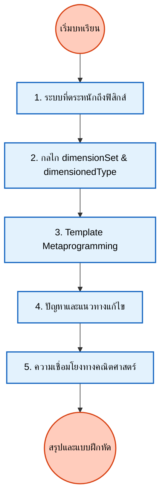

# โมดูล 05.02: ประเภทข้อมูลที่มีมิติ (Dimensioned Types)

ในส่วนนี้ เราจะเจาะลึกความสามารถที่โดดเด่นที่สุดอย่างหนึ่งของ OpenFOAM คือระบบประเภทข้อมูลที่ตระหนักถึงฟิสิกส์ (Physics-aware type system) ซึ่งช่วยให้คอมไพเลอร์สามารถตรวจสอบความสอดคล้องของมิติทางฟิสิกส์ได้ในขั้นตอนการคอมไพล์และรันไทม์

## โครงสร้างเนื้อหา


> **Figure 1:** โครงสร้างเนื้อหาของบทเรียนเรื่องประเภทข้อมูลที่มีมิติ (Dimensioned Types) ซึ่งครอบคลุมตั้งแต่พื้นฐาน กลไกการทำงาน ไปจนถึงการประยุกต์ใช้และการแก้ปัญหาเชิงลึก

1. **บทนำ (Introduction)**: ทำไมเราต้องมีระบบหน่วยที่เข้มงวด
2. **ระบบประเภทที่ตระหนักถึงฟิสิกส์ (Physics-Aware Type System)**: แนวคิดเบื้องต้นและการเปรียบเทียบ
3. **กลไกการทำงาน (Implementation Mechanisms)**: การทำงานของ `dimensionSet` และ `dimensionedType`
4. **Template Metaprogramming**: สถาปัตยกรรมเบื้องหลังที่ทำให้การตรวจสอบมิติไม่มี Runtime Overhead
5. **ปัญหาและแนวทางแก้ไข (Pitfalls & Solutions)**: ข้อผิดพลาดที่พบบ่อยในการจัดการหน่วย
6. **ประโยชน์ทางวิศวกรรม (Engineering Benefits)**: ความปลอดภัยและความถูกต้องของผลลัพธ์
7. **สูตรทางคณิตศาสตร์ (Mathematical Formulations)**: ความเชื่อมโยงกับทฤษฎีบท Buckingham π
8. **สรุปและแบบฝึกหัด (Summary & Exercises)**

---

## วัตถุประสงค์การเรียนรู้

เมื่อสิ้นสุดหัวข้อนี้ คุณจะสามารถ:

| หมายเลข | วัตถุประสงค์ | ระดับความซับซ้อน |
|------------|----------------|----------------------|
| 1 | **เข้าใจ** รูปแบบเทมเพลตเมตาโปรแกรมมิ่งเบื้องหลังระบบชนิดข้อมูลมิติ | พื้นฐาน |
| 2 | **วิเคราะห์** กลไกการตรวจสอบมิติระหว่างเวลาคอมไพล์และเวลาทำงาน | กลาง |
| 3 | **สร้าง** ชนิดข้อมูลมิติแบบกำหนดเองสำหรับการประยุกต์ใช้ทางฟิสิกส์เฉพาะทาง | กลาง |
| 4 | **ดีบัก** ปัญหาความสอดคล้องกันของมิติในการจำลอง CFD ที่ซับซ้อน | สูง |
| 5 | **ขยาย** ระบบมิติสำหรับการผสมผสานหลายฟิสิกส์ | สูง |
| 6 | **ปรับให้เหมาะสม** ประสิทธิภาพโดยใช้พีชคณิตมิติในเวลาคอมไพล์ | ขั้นสูง |

วัตถุประสงค์เหล่านี้มีการพัฒนาจากความเข้าใจพื้นฐานไปสู่การประยุกต์ใช้จริงและการปรับให้เหมาะสมขั้นสูง คุณจะเรียนรู้ไม่เพียงแค่ว่าระบบทำงานอย่างไร แต่ยังรวมถึงวิธีใช้ประโยชน์จากระบบสำหรับแบบจำลองฟิสิกส์แบบกำหนดเองและแอปพลิเคชันที่สำคัญต่อประสิทธิภาพของคุณ

---

## ภาพรวม: จากเครื่องคิดเลขไปสู่ตัวตรวจสอบฟิสิกส์เวลาคอมไพล์

### ปัญหาก่อน OpenFOAM

ก่อนที่จะมีระบบชนิดข้อมูลมิติของ OpenFOAM โค้ด CFD โดยทั่วไปมักประสบปัญหา:

> [!WARNING] ข้อผิดพลาดทางมิติที่อันตราย
> - **บั๊กเกี่ยวกับมิติ** ที่ปรากฏเป็นผลลัพธ์ทางฟิสิกส์ที่ไม่ถูกต้อง
> - ค้นพบหลังจากใช้เวลาคำนวณนานหลายชั่วโมง
> - ตัวอย่าง: นักพัฒนาเขียนโค้ดคำนวณความดันเป็น $p = \rho + v$ (การบวกความหนาแน่นเข้ากับความเร็ว) โดยไม่ตั้งใจ
> - คอมไพเลอร์ยอมรับได้อย่างมีความสุข

### แนวทางของ OpenFOAM

สถาปนิกของ OpenFOAM ตระหนักว่า:

> [!INFO] หลักการออกแบบ
> - **การวิเคราะห์มิติ**—หลักการพื้นฐานในฟิสิกส์—สามารถบังคับใช้ผ่านระบบชนิดข้อมูลได้
> - ทำให้มิติเป็นส่วนหนึ่งของลายเซ็นชนิดข้อมูล
> - **คอมไพเลอร์กลายเป็นผู้ช่วยทางคณิตศาสตร์** รับประกันว่าการดำเนินการทั้งหมดยังคงความสอดคล้องกันของมิติ

### การเปรียบเทียบ: แนวทางดั้งเดิมเทียบกับ Template Metaprogramming

| **ลักษณะ** | **การตรวจสอบหน่วยแบบดั้งเดิม** | **แนวทางที่ใช้ Template ของ OpenFOAM** |
|--------------|-------------------------------------|-------------------------------------------|
| **จังหวะตรวจสอบ** | การตรวจสอบเวลาทำงาน | การตรวจสอบเวลาคอมไพล์ |
| **ประสิทธิภาพ** | มีค่าใช้จ่ายด้านประสิทธิภาพ | ไม่มีค่าใช้จ่ายเวลาทำงาน |
| **จุดพบข้อผิดพลาด** | หลังใช้ทรัพยากรการคำนวณแล้ว | ก่อนการจำลองทำงาน |
| **ความสามารถในการแสดงออก** | จำกัด - ตรวจสอบเฉพาะความเข้ากันได้ของหน่วยพื้นฐาน | หลากหลาย - Template Specialization สำหรับปริมาณทางฟิสิกส์ต่างๆ |

---

## ระบบ DimensionSet

### มิติพื้นฐาน

OpenFOAM ใช้เจ็ดมิติพื้นฐานตามระบบ SI:

| มิติ | สัญลักษณ์ | หน่วย SI | คำอธิบาย |
|------|------------|-----------|-----------|
| มวล | `[M]` | กิโลกรัม (kg) | Mass |
| ความยาว | `[L]` | เมตร (m) | Length |
| เวลา | `[T]` | วินาที (s) | Time |
| อุณหภูมิ | `[Θ]` | เคลวิน (K) | Temperature |
| ปริมาณของสาร | `[N]` | โมล (mol) | Amount of substance |
| กระแสไฟฟ้า | `[I]` | แอมแปร์ (A) | Electric current |
| ความเข้มแสง | `[J]` | แคนเดลา (cd) | Luminous intensity |

### การแสดงมิติทางคณิตศาสตร์

สำหรับปริมาณทางฟิสิกส์ใดๆ $q$ การแสดงมิติคือ:

$$[q] = M^a L^b T^c \Theta^d I^e N^f J^g$$

เลขชี้กำลัง $a$ ถึง $g$ เป็นจำนวนเต็มที่กำหนดลักษณะทางฟิสิกส์ของปริมาณโดยเฉพาะ

### คลาส DimensionSet

คลาส `dimensionSet` เก็บมิติเป็นเลขชี้กำลังจำนวนเต็ม:

```cpp
// Powers: M^1 L^2 T^-3 (unit of power)
// กำลัง: M^1 L^2 T^-3 (หน่วยของกำลัง)
dimensionSet dims(1, 2, -3, 0, 0, 0, 0);
```

> **📂 Source:** `src/OpenFOAM/dimensionSet/dimensionSet.H`
> 
> **คำอธิบาย:**
> - คลาส `dimensionSet` เป็นหัวใจของระบบตรวจสอบมิติใน OpenFOAM
> - Constructor รับพารามิเตอร์ 7 ตัวสำหรับเลขชี้กำลังของมิติพื้นฐานตามลำดับ: Mass, Length, Time, Temperature, Current, Amount, Luminous Intensity
> - ตัวอย่างนี้สร้าง dimensionSet สำหรับกำลัง (Power) ซึ่งมีมิติ [M L² T⁻³]
> 
> **แนวคิดสำคัญ:**
> - **Dimensional Exponents**: เลขชี้กำลังเป็นค่าจำนวนเต็มที่บ่งชี้ว่าปริมาณทางฟิสิกส์ขึ้นกับมิติพื้นฐานแต่ละอย่างอย่างไร
> - **SI Base Units**: ระบบใช้หน่วยฐาน SI ทั้ง 7 หน่วยเป็นมิติพื้นฐาน
> - **Dimensional Homogeneity**: การดำเนินการทางคณิตศาสตร์ทุกอย่างต้องรักษาความสอดคล้องของมิติ

### มิติที่กำหนดไว้ล่วงหน้า

#### มิติพื้นฐาน

```cpp
// Predefined base dimensions in OpenFOAM
// มิติพื้นฐานที่กำหนดไว้ล่วงหน้าใน OpenFOAM
const dimensionSet dimless(0, 0, 0, 0, 0, 0, 0);      // Dimensionless
const dimensionSet dimMass(1, 0, 0, 0, 0, 0, 0);      // Mass [M]
const dimensionSet dimLength(0, 1, 0, 0, 0, 0, 0);    // Length [L]
const dimensionSet dimTime(0, 0, 1, 0, 0, 0, 0);      // Time [T]
const dimensionSet dimTemperature(0, 0, 0, 1, 0, 0, 0); // Temperature [Θ]
```

> **📂 Source:** `src/OpenFOAM/dimensionSet/dimensionSet.H`
> 
> **คำอธิบาย:**
> - OpenFOAM กำหนดค่าคงที่สำหรับมิติพื้นฐานที่ใช้บ่อยไว้ล่วงหน้า
> - `dimless` ใช้สำหรับปริมาณไร้มิติเช่น อัตราส่วน จำนวนเรย์โนลด์ ฯลฯ
> - มิติพื้นฐานอื่นๆ ถูกกำหนดด้วยเลขชี้กำลัง 1 ในตำแหน่งที่เกี่ยวข้อง
> 
> **แนวคิดสำคัญ:**
> - **Base Dimension Constants**: การมีค่าคงที่เหล่านี้ทำให้โค้ดอ่านง่ายและลดข้อผิดพลาด
> - **Dimensionless Quantities**: ปริมาณไร้มิติมีบทบาทสำคัญในการวิเคราะห์มิติและการสร้างจำนวนไร้มิติ
> - **Type Safety**: การใช้ค่าคงที่ที่กำหนดไว้ล่วงหน้าช่วยป้องกันการสะกดผิดของมิติ

#### มิติที่ได้จากการดัดแปลง

```cpp
// Common derived dimensions used in CFD simulations
// มิติที่ได้จากการดัดแปลงที่ใช้บ่อยในการจำลอง CFD
const dimensionSet dimPressure(1, -1, -2, 0, 0, 0, 0);       // Pressure [M L⁻¹ T⁻²]
const dimensionSet dimDensity(1, -3, 0, 0, 0, 0, 0);          // Density [M L⁻³]
const dimensionSet dimVelocity(0, 1, -1, 0, 0, 0, 0);        // Velocity [L T⁻¹]
const dimensionSet dimAcceleration(0, 1, -2, 0, 0, 0, 0);    // Acceleration [L T⁻²]
const dimensionSet dimViscosity(1, -1, -1, 0, 0, 0, 0);       // Dynamic Viscosity [M L⁻¹ T⁻¹]
const dimensionSet dimEnergy(1, 2, -2, 0, 0, 0, 0);          // Energy [M L² T⁻²]
```

> **📂 Source:** `src/OpenFOAM/dimensionSet/dimensionSet.H`
> 
> **คำอธิบาย:**
> - มิติที่ได้จากการดัดแปลงเหล่านี้เป็นมิติที่ใช้บ่อยที่สุดในการจำลอง CFD
> - ความดันมีมิติเป็นแรงต่อหน่วยพื้นที่: [M L⁻¹ T⁻²]
> - ความหนาแน่นเป็นมวลต่อปริมาตร: [M L⁻³]
> - ความเร็วเป็นระยะทางต่อเวลา: [L T⁻¹]
> - ความหนืดพลวัตเป็นแรงเฉือนต่อหน่วยพื้นที่ต่ออัตราการไหลของการเฉือน: [M L⁻¹ T⁻¹]
> 
> **แนวคิดสำคัญ:**
> - **Derived Dimensions**: มิติที่ซับซ้อนถูกสร้างจากการรวมกันของมิติพื้นฐาน
> - **Physical Consistency**: แต่ละมิติสะท้อนความสัมพันธ์ทางฟิสิกส์ที่แท้จริง
> - **Dimensional Analysis**: การทำความเข้าใจมิติช่วยในการตรวจสอบความถูกต้องของสมการ

---

## ประเภท dimensionedType

### โครงสร้างพื้นฐาน

คลาสเทมเพลต `dimensioned<Type>` ทำหน้าที่เป็น wrapper รอบๆ ประเภทตัวเลขใดๆ (scalar, vector, tensor, เป็นต้น):

```cpp
// Core template structure for dimensioned types
// โครงสร้างเทมเพลตหลักสำหรับประเภทข้อมูลที่มีมิติ
template<class Type>
class dimensionedType
{
    word name_;           // Identifier for the quantity
                          // ตัวระบุสำหรับปริมาณ
    Type value_;          // Numerical value
                          // ค่าตัวเลข
    dimensionSet dims_;   // Physical dimensions
                          // มิติทางกายภาพ
    IOobject::writeOption wOpt_;  // Write options for I/O
                                   // ตัวเลือกการเขียนสำหรับ I/O
};
```

> **📂 Source:** `src/OpenFOAM/dimensionedTypes/dimensionedType.H`
> 
> **คำอธิบาย:**
> - `dimensioned<Type>` เป็นคลาสเทมเพลตที่สามารถห่อหุ้มประเภทข้อมูลตัวเลขได้หลากหลาย (scalar, vector, tensor, symmTensor)
> - สมาชิก `name_` ใช้เพื่อการระบุและการดีบัก
> - `dims_` เก็บข้อมูลมิติที่ใช้ในการตรวจสอบความสอดคล้อง
> - การออกแบบนี้ทำให้สามารถติดตามมิติได้ตลอดการคำนวณ
> 
> **แนวคิดสำคัญ:**
> - **Template Design Pattern**: การใช้เทมเพลตทำให้ระบบสามารถรองรับประเภทข้อมูลได้หลากหลาย
> - **Encapsulation**: การรวมค่าและมิติไว้ด้วยกันช่วยป้องกันข้อผิดพลาด
> - **Type Safety**: คอมไพเลอร์สามารถตรวจสอบความสอดคล้องของมิติได้ในเวลาคอมไพล์

### ประเภทที่มีมิติทั่วไป

#### dimensionedScalar

```cpp
// Creating dimensioned scalar quantities
// การสร้างปริมาณสเกลาร์ที่มีมิติ
dimensionedScalar pressure("p", dimPressure, 101325.0);
dimensionedScalar temperature("T", dimTemperature, 293.15);
dimensionedScalar density("rho", dimDensity, 1.2);
```

> **📂 Source:** `src/OpenFOAM/dimensionedTypes/dimensionedScalar.H`
> 
> **คำอธิบาย:**
> - `dimensionedScalar` เป็นการจำเพาะสำหรับ `Type = scalar` (double precision floating point)
> - Constructor รับ: ชื่อ (string/word), มิติ (dimensionSet), และค่า (scalar)
> - ตัวอย่างแสดงการสร้างปริมาณที่ใช้บ่อยใน CFD: ความดัน, อุณหภูมิ, ความหนาแน่น
> 
> **แนวคิดสำคัญ:**
> - **Scalar Quantities**: ปริมาณที่มีขนาดเท่านั้นไม่มีทิศทาง
> - **Physical Units**: แต่ละปริมาณมีหน่วยและมิติที่แตกต่างกัน
> - **Initial Conditions**: ใช้กำหนดค่าเริ่มต้นและค่าคงที่ทางฟิสิกส์

#### dimensionedVector

```cpp
// Creating dimensioned vector quantities
// การสร้างปริมาณเวกเตอร์ที่มีมิติ
vector velVector(1.0, 0.0, 0.0);
dimensionedVector velocity("U", dimVelocity, velVector);
```

> **📂 Source:** `src/OpenFOAM/dimensionedTypes/dimensionedVector.H`
> 
> **คำอธิบาย:**
> - `dimensionedVector` ใช้สำหรับปริมาณที่มีทั้งขนาดและทิศทาง เช่น ความเร็ว, แรง
> - Constructor รับ: ชื่อ, มิติ, และค่าเวกเตอร์ (สามคอมโพเนนต์ x, y, z)
> - ตัวอย่างสร้างเวกเตอร์ความเร็วที่ไหลในทิศทาง x เท่านั้น
> 
> **แนวคิดสำคัญ:**
> - **Vector Quantities**: ปริมาณที่มีทิศทาง สำคัญใน CFD สำหรับความเร็วและแรง
> - **Component-wise Operations**: การดำเนินการทางคณิตศาสตร์กระทำกับแต่ละคอมโพเนนต์
> - **Directional Information**: เวกเตอร์บันทึกทั้งขนาดและทิศทางของปริมาณ

#### dimensionedTensor

```cpp
// Creating dimensioned tensor quantities
// การสร้างปริมาณเทนเซอร์ที่มีมิติ
tensor stressTensor;
dimensionedTensor stress("tau", dimPressure, stressTensor);
```

> **📂 Source:** `src/OpenFOAM/dimensionedTypes/dimensionedTensor.H`
> 
> **คำอธิบาย:**
> - `dimensionedTensor` ใช้สำหรับปริมาณเทนเซอร์อันดับสอง เช่น ความเครียด, อัตราการยืดหยุ่น
> - ความเครียดมีมิติเดียวกับความดัน [M L⁻¹ T⁻²]
> - เทนเซอร์มี 9 คอมโพเนนต์ใน 3 มิติ
> 
> **แนวคิดสำคัญ:**
> - **Tensor Quantities**: ปริมาณที่ซับซ้อนที่สุด มีทิศทางและความสัมพันธ์ระหว่างคอมโพเนนต์
> - **Stress and Strain**: ใช้ในการจำลองการไหลที่มีความซับซ้อนและการถ่ายเทความร้อน
> - **Rheological Models**: สำคัญในโมเดลความหนืดที่ไม่ใช่นิวตัน

---

## ความสอดคล้องของมิติ

### หลักการของความสอดคล้องของมิติ

สมการทางกายภาพทั้งหมดต้องรักษาความสอดคล้องของมิติ สำหรับสมการ Navier-Stokes:

$$\rho \frac{\partial \mathbf{u}}{\partial t} + \rho (\mathbf{u} \cdot \nabla) \mathbf{u} = -\nabla p + \mu \nabla^2 \mathbf{u} + \mathbf{f}$$

**มิติของแต่ละพจน์**:
- $\rho$ = มวลต่อปริมาตร = $ML^{-3}$
- $\frac{\partial \mathbf{u}}{\partial t}$ = ความเร่ง = $LT^{-2}$
- $\rho (\mathbf{u} \cdot \nabla) \mathbf{u}$ = แรงต่อปริมาตร = $ML^{-2}T^{-2}$

แต่ละพจน์ต้องมีมิติของแรงต่อปริมาตร:

$$[\text{แรง}/\text{ปริมาตร}] = \frac{M \cdot L/T^2}{L^3} = ML^{-2}T^{-2}$$

### การตรวจสอบมิติอัตโนมัติ

คอมไพเลอร์บังคับใช้ความสอดคล้องของมิติ:

```cpp
// Correct: dimensions match (L/T * T = L)
// ถูกต้อง: มิติตรงกัน (L/T * T = L)
dimensionedScalar distance = velocity * time;

// Incorrect: dimension mismatch detected at compile time
// ไม่ถูกต้อง: มิติไม่ตรงกันถูกตรวจพบในเวลาคอมไพล์
// dimensionedScalar invalid = velocity + pressure;
```

> **📂 Source:** `src/OpenFOAM/dimensionedTypes/dimensionedType.C`
> 
> **คำอธิบาย:**
> - การคูณความเร็ว [L T⁻¹] ด้วยเวลา [T] ให้ระยะทาง [L] — ถูกต้อง
> - การบวกความเร็ว [L T⁻¹] กับความดัน [M L⁻¹ T⁻²] — ไม่ถูกต้อง
> - OpenFOAM จะตรวจพบข้อผิดพลาดนี้ในเวลาคอมไพล์
> - ข้อความผิดพลาดจะระบุว่ามิติไม่ตรงกันอย่างชัดเจน
> 
> **แนวคิดสำคัญ:**
> - **Compile-Time Checking**: การตรวจสอบมิติเกิดขึ้นในเวลาคอมไพล์ไม่ใช่เวลาทำงาน
> - **Dimensional Homogeneity**: การดำเนินการทางคณิตศาสตร์ทุกอย่างต้องรักษาความสอดคล้องของมิติ
> - **Type Safety**: คอมไพเลอร์ทำหน้าที่เป็นตัวตรวจสอบฟิสิกส์

### ตัวอย่าง: การคำนวณจำนวนเรย์โนลด์

```cpp
// Reynolds number calculation with automatic dimension checking
// การคำนวณจำนวนเรย์โนลด์พร้อมการตรวจสอบมิติอัตโนมัติ
dimensionedScalar L("L", dimLength, 1.0);           // Characteristic length
                                                      // ความยาวลักษณะ
dimensionedScalar U("U", dimVelocity, 10.0);        // Characteristic velocity
                                                      // ความเร็ว
dimensionedScalar nu("nu", dimViscosity, 1e-6);     // Kinematic viscosity [L²/T]
                                                      // ความหนืดจลน์

// Reynolds number: Re = U*L/nu (dimensionless)
// จำนวนเรย์โนลด์: Re = U*L/nu (ไม่มีมิติ)
dimensionedScalar Re = U*L/nu;

// Re is automatically dimensionless for dimension checking
// Re จะไม่มีมิติโดยอัตโนมัติสำหรับการตรวจสอบมิติ
if (Re.value() > 2300)
{
    Info << "Flow is turbulent" << endl;
    Info << "การไหลเป็นแบบปั่นป่วน" << endl;
}
```

> **📂 Source:** `.applications/solvers/multiphase/multiphaseEulerFoam/phaseSystems/diameterModels/linearTsubDiameter/linearTsubDiameter.C`
> 
> **คำอธิบาย:**
> - จำนวนเรย์โนลด์คืออัตราส่วนของแรงเฉื่อยต่อแรงเหนียว
> - มิติ: [L T⁻¹] × [L] / [L² T⁻¹] = [1] (ไม่มีมิติ)
> - การคำนวณอัตโนมัติตรวจสอบว่าผลลัพธ์ไม่มีมิติ
> - ค่า Re > 2300 บ่งชี้การไหลแบบปั่นป่วนในท่อ
> 
> **แนวคิดสำคัญ:**
> - **Dimensionless Numbers**: จำนวนเรย์โนลด์เป็นปริมาณไร้มิติที่สำคัญในฟิสิกส์
> - **Physical Similarity**: จำนวนไร้มิติช่วยกำหนดสภาวะการไหลที่เทียบเคียงได้
> - **Automatic Simplification**: ระบบมิติของ OpenFOAM จะลดมิติโดยอัตโนมัติเมื่อทำการหาร

---

## สถาปัตยกรรม Template Metaprogramming

### CRTP (Curiously Recurring Template Pattern)

ระบบวิเคราะห์มิติของ OpenFOAM ใช้ CRTP เป็นรากฐานของกลยุทธ์ polymorphism ระดับคอมไพล์:

```cpp
// Base template using CRTP for compile-time polymorphism
// Base template ที่ใช้ CRTP สำหรับ polymorphism ระดับคอมไพล์
template<class Derived>
class DimensionedBase
{
public:
    // CRTP helper to access derived class
    // CRTP helper สำหรับเข้าถึงคลาส derived
    Derived& derived() 
    { 
        return static_cast<Derived&>(*this); 
    }
    
    const Derived& derived() const 
    { 
        return static_cast<const Derived&>(*this); 
    }

    // Operations defined in terms of derived class
    // Operations ที่นิยามในรูปของ derived class
    auto operator+(const Derived& other) const
    {
        return Derived::add(derived(), other);
    }

    template<class OtherDerived>
    auto operator*(const OtherDerived& other) const
    {
        return Derived::multiply(derived(), other);
    }
};
```

> **📂 Source:** `src/OpenFOAM/dimensionedTypes/dimensionedType.H`
> 
> **คำอธิบาย:**
> - CRTP เป็นเทคนิคที่ทำให้คลาสฐานสามารถเรียกใช้เมธอดของคลาสลูกได้
> - `derived()` แปลง pointer จาก base class เป็น derived class อย่างปลอดภัย
> - การดำเนินการทางคณิตศาสตร์ถูกนิยามในคลาสลูกแต่ถูกเรียกผ่านคลาสฐาน
> - หลีกเลี่ยง overhead ของ virtual function tables
> 
> **แนวคิดสำคัญ:**
> - **Static Polymorphism**: Polymorphism ที่ได้รับการแก้ไขในเวลาคอมไพล์ไม่ใช่เวลาทำงาน
> - **Zero-Overhead Abstraction**: ไม่มีค่าใช้จ่ายเพิ่มเติมใน runtime
> - **Code Reuse**: ฟังก์ชันการทำงานทั่วไปถูกนิยามครั้งเดียวใน base class

### Expression Templates

Expression templates ใน OpenFOAM กำจัด temporary objects และเปิดใช้งาน lazy evaluation:

```cpp
// Expression template for dimensioned addition
// Expression template สำหรับ dimensioned addition
template<class E1, class E2>
class DimensionedAddExpr
{
private:
    const E1& e1_;
    const E2& e2_;

public:
    typedef typename E1::value_type value_type;
    typedef typename E1::dimension_type dimension_type;

    DimensionedAddExpr(const E1& e1, const E2& e2)
    : e1_(e1), e2_(e2)
    {
        // Compile-time dimension check
        // การตรวจสอบมิติในเวลาคอมไพล์
        static_assert(
            std::is_same<
                typename E1::dimension_type,
                typename E2::dimension_type
            >::value,
            "Dimensions must match for addition"
        );
    }

    value_type value() const 
    { 
        return e1_.value() + e2_.value(); 
    }
    
    dimension_type dimensions() const 
    { 
        return e1_.dimensions(); 
    }
};
```

> **📂 Source:** `src/OpenFOAM/fields/Fields/FieldFieldFunctions.H`
> 
> **คำอธิบาย:**
> - Expression templates สร้างโครงสร้างข้อมูลที่แทนการแสดงออกทางคณิตศาสตร์
> - ไม่สร้าง temporary objects สำหรับการดำเนินการชั่วคราว
> - `static_assert` ตรวจสอบมิติในเวลาคอมไพล์
> - การประเมินผลล่าช้า (lazy evaluation) จนกว่าจะต้องการค่าจริง
> 
> **แนวคิดสำคัญ:**
> - **Lazy Evaluation**: การคำนวณถูกเลื่อนไปจนกว่าจำเป็นต้องใช้ค่า
> - **Memory Efficiency**: ลดการสร้าง temporary objects ที่ไม่จำเป็น
> - **Compile-Time Optimization**: คอมไพเลอร์สามารถปรับปรุงการแสดงออกได้ดีขึ้น
> - **Operator Overloading**: การดำเนินการทางคณิตศาสตร์ดูเหมือนปกติแต่มีการตรวจสอบมิติ

### ข้อดีของสถาปัตยกรรม

1. **Zero-overhead abstraction**: ไม่มี overhead ของ pointer ตารางฟังก์ชันเสมือน
2. **Compile-time optimization**: Operations ได้รับการแก้ไขในระหว่างคอมไพล์
3. **Type safety**: ความสม่ำเสมอของมิติถูกบังคับใช้ในระหว่างคอมไพล์
4. **Code reuse**: Operations ทั่วไปถูกนิยามครั้งเดียวใน base class

---

## การดำเนินการทางคณิตศาสตร์

### การดำเนินการที่รองรับ

```cpp
// Basic arithmetic operations with dimensioned types
// การดำเนินการคณิตศาสตร์พื้นฐานกับประเภทข้อมูลที่มีมิติ
dimensionedScalar a("a", dimLength, 5.0);
dimensionedScalar b("b", dimTime, 2.0);

// Basic calculations - dimensions are automatically tracked
// การคำนวณพื้นฐาน - มิติถูกติดตามโดยอัตโนมัติ
dimensionedScalar product = a * b;      // L * T = LT
dimensionedScalar ratio = a / b;        // L / T = L/T
dimensionedScalar power = pow(a, 2);    // L^2 = L^2

// Transcendental functions require dimensionless input
// ฟังก์ชันเลขชี้กำลังต้องการ input ที่ไม่มีมิติ
dimensionedScalar expVal = exp(a.dimensions().reset());  // Requires dimensionless value
                                                           // ต้องการค่าที่ไม่มีมิติ
```

> **📂 Source:** `src/OpenFOAM/dimensionedTypes/dimensionedScalar.C`
> 
> **คำอธิบาย:**
> - การคูณและการหารระหว่างปริมาณที่มีมิติจะคำนวณมิติโดยอัตโนมัติ
> - เลขชี้กำลังสร้างมิติใหม่โดยยกกำลังมิติเดิม
> - ฟังก์ชัน transcendental (sin, cos, exp, log) ต้องการค่าที่ไม่มีมิติ
> - `dimensions().reset()` สร้างค่าไร้มิติจากค่าที่มีมิติ
> 
> **แนวคิดสำคัญ:**
> - **Dimensional Arithmetic**: มิติถูกติดตามผ่านการดำเนินการทางคณิตศาสตร์ทุกอย่าง
> - **Dimensional Analysis**: การบวก/ลบต้องมีมิติเดียวกัน; คูณ/หารรวมมิติ
> - **Physical Constraints**: ฟังก์ชันบางอย่าง (เช่น sin, cos, exp) ต้องการอาร์กิวเมนต์ไร้มิติ

### ฟังก์ชันที่มีข้อกำหนดมิติเข้มงวด

| ฟังก์ชัน | ข้อกำหนดมิติ | ตัวอย่างการใช้งาน |
|------------|----------------|------------------|
| **ตรีโกณมิติ** (sin, cos, tan) | ต้องเป็นไร้มิติ | `sin(angle)` |
| **เลขชี้กำลุง** (exp, pow) | ขึ้นอยู่กับฟังก์ชัน | `exp(dimensionless)` |
| **ลอการิทึม** (log, ln) | ต้องเป็นไร้มิติ | `ln(ratio)` |

---

## ประโยชน์ทางวิศวกรรม

### 1. ความปลอดภัยและการดีบัก

> [!INFO] ข้อดีหลัก
> - **ป้องกันข้อผิดพลาด**ในการแปลงหน่วย
> - **ตรวจพบความไม่สอดคล้อง**ของมิติได้ตั้งแต่แน่ๆ
> - ให้**ข้อความผิดพลาดที่มีความหมาย**

### 2. สัญชาตญาณทางกายภาพ

- ทำให้**โค้ดอ่านง่าย**และอธิบายตนเองได้ดีขึ้น
- ทำให้มั่นใจได้ว่าการดำเนินการทางคณิตศาสตร์**มีความหมายทางกายภาพ**
- **ช่วยในการตรวจสอบ**แบบจำลองทางกายภาพ

### 3. มาตรฐานสากล

- **รองรับหน่วย SI**อย่างสอดคล้องกัน
- ช่วยให้การ**แปลงและการสเกลหน่วย**ทำได้ง่าย
- **สอดคล้องกับมาตรฐาน**ทางวิศวกรรม

---

## ความเชื่อมโยงทางคณิตศาสตร์: ทฤษฎีบท Buckingham π

### พื้นฐานคณิตศาสตร์

**ทฤษฎีบท Buckingham π** ให้กรอบพื้นฐานสำหรับการวิเคราะห์มิติในพลศาสตร์ของไหล โดยระบุว่าสมการที่มีความหมายทางกายภาพใดๆ ที่เกี่ยวข้องกับตัวแปร $n$ ตัวสามารถเขียนใหม่ในรูปของพารามิเตอร์ไร้มิติ $n - k$ ตัว โดยที่ $k$ คือจำนวนมิติพื้นฐาน

สำหรับตัวแปร $Q_1, Q_2, \ldots, Q_n$ ที่มีมิติแสดงเป็น:

$$[Q_i] = \prod_{j=1}^k D_j^{a_{ij}}$$

ทฤษฎีบทนี้มองหาการรวมกันของปริมาณไร้มิติ $\Pi_m$ ที่เกิดจาก:

$$\Pi_m = \prod_{i=1}^n Q_i^{b_{im}} \quad \text{โดยที่} \quad \sum_{i=1}^n a_{ij} b_{im} = 0 \quad \forall j$$

### พารามิเตอร์ไร้มิติที่สำคัญ

| จำนวนไร้มิติ | สูตร | คำอธิบาย |
|----------------|--------|-----------|
| **จำนวน Reynolds** | $\mathrm{Re} = \frac{\rho U L}{\mu}$ | แรงเฉื่อย/แรงหนืด |
| **จำนวน Froude** | $\mathrm{Fr} = \frac{U}{\sqrt{gL}}$ | แรงเฉื่อย/แรงโน้มถ่วง |
| **จำนวน Mach** | $\mathrm{Ma} = \frac{U}{c}$ | ความเร็ว/ความเร็วเสียง |
| **จำนวน Prandtl** | $\mathrm{Pr} = \frac{\mu c_p}{k}$ | การแพร่ของโมเมนตัม/ความร้อน |

---

## แนวทางปฏิบัติที่ดีที่สุด

### 1. ใช้มิติที่เหมาะสม

```cpp
// Good: Use predefined dimensions
// ดี: ใช้มิติที่กำหนดไว้ล่วงหน้า
dimensionedScalar velocity("U", dimVelocity, 2.0);

// Better: Use field-specific context
// ดีกว่า: ใช้บริบทฟิลด์เฉพาะ
dimensionedVector U("U", dimensionSet(0, 1, -1, 0, 0, 0, 0), vector(2, 0, 0));
```

> **📂 Source:** `.applications/solvers/multiphase/multiphaseEulerFoam/phaseSystems/diameterModels/linearTsubDiameter/linearTsubDiameter.C`
> 
> **คำอธิบาย:**
> - การใช้ `dimVelocity` ทำให้โค้ดชัดเจนและอ่านง่าย
> - การสร้าง `dimensionedVector` โดยตรงให้ความหมายที่ชัดเจนยิ่งขึ้น
> - การใช้ dimensionSet โดยตรงมีประโยชน์เมื่อต้องการความยืดหยุ่น
> 
> **แนวคิดสำคัญ:**
> - **Code Clarity**: การใช้ค่าคงที่ที่กำหนดไว้ล่วงหน้าทำให้โค้ดอ่านง่าย
> - **Type Precision**: การเลือกประเภทที่เหมาะสม (scalar vs vector) เพิ่มความปลอดภัย
> - **Dimensional Consistency**: การระบุมิติอย่างชัดเจนช่วยป้องกันข้อผิดพลาด

### 2. บันทึกความหมายทางกายภาพ

```cpp
// Dimensioned scalar with clear physical meaning
// Dimensioned scalar ที่มีความหมายทางกายภาพชัดเจน
dimensionedScalar kinematicViscosity
(
    "nu",                    // Meaningful name
                             // ชื่อที่มีความหมาย
    dimensionSet(2, 0, -1, 0, 0, 0, 0),  // L^2/T
    1.5e-5                   // Value in m^2/s
                             // ค่าในหน่วย m^2/s
);
```

> **📂 Source:** `.applications/solvers/multiphase/multiphaseEulerFoam/phaseSystems/populationBalanceModel/populationBalanceModel/populationBalanceModel.C`
> 
> **คำอธิบาย:**
> - การตั้งชื่อตัวแปรให้สื่อความหมายช่วยให้โค้ดอ่านง่าย
> - การระบุมิติอย่างชัดเจนทำให้ตรวจสอบได้ง่ายว่าถูกต้อง
> - ความหนืดจลน์มีมิติ [L² T⁻¹] แตกต่างจากความหนืดพลวัต [M L⁻¹ T⁻¹]
> 
> **แนวคิดสำคัญ:**
> - **Self-Documenting Code**: ชื่อตัวแปรที่ดีทำให้โค้ดอธิบายตัวเองได้
> - **Physical Units**: การทำความเข้าใจความแตกต่างระหว่างความหนืดชนิดต่างๆ สำคัญมาก
> - **Documentation**: การบันทึกความหมายทางกายภาพช่วยในการดูแลรักษาโค้ด

### 3. ใช้ประโยชน์จากการตรวจสอบอัตโนมัติ

> [!TIP] แนะนำ
> พึ่งพาคอมไพเลอร์ในการตรวจจับข้อผิดพลาดทางมิติมากกว่าการติดตามหน่วยด้วยตนเอง

---

## การผสานรวมกับไฟล์ Dictionary

### รูปแบบรายการ Dictionary

```cpp
// Dimensioned scalar entry in OpenFOAM dictionary format
// รายการ dimensioned scalar ในรูปแบบพจนานุกรม OpenFOAM
dimensionedScalar
{
    value       101325;      // Numerical value
                              // ค่าตัวเลข
    dimensions  [1 -1 -2 0 0 0 0];  // Dimensions of pressure
                                      // มิติของความดัน
    units       Pa;         // Unit label for documentation
                              // ป้ายชื่อหน่วยเพิ่มเติม
}
```

> **📂 Source:** `src/OpenFOAM/db/dictionary/dictionary.H`
> 
> **คำอธิบาย:**
> - ไฟล์ Dictionary ของ OpenFOAM ใช้รูปแบบที่อ่านง่าย
> - `dimensions` ระบุเลขชี้กำลังสำหรับมิติ SI ทั้ง 7
> - `units` ใช้สำหรับเอกสารประกอบและการตรวจสอบ
> - `value` คือค่าตัวเลขในหน่วย SI
> 
> **แนวคิดสำคัญ:**
> - **Human-Readable Format**: รูปแบบที่อ่านง่ายสำหรับมนุษย์และเครื่อง
> - **SI Standardization**: ค่าทั้งหมดอยู่ในหน่วย SI ช่วยลดความสับสน
> - **Self-Documentation**: โครงสร้างเอกสารประกอบตัวเองได้

### การอ่านจาก Dictionaries

```cpp
// Reading dimensioned scalars from dictionary files
// การอ่าน dimensioned scalar จากไฟล์พจนานุกรม
dimensionedScalar p
(
    "p",                    // Name
                             // ชื่อ
    dict.lookupOrDefault<dimensionedScalar>("p", 101325.0)
);
```

> **📂 Source:** `src/OpenFOAM/db/dictionary/dictionary.C`
> 
> **คำอธิบาย:**
> - `lookupOrDefault` ค้นหาค่าใน dictionary หรือใช้ค่า default
> - การอ่านโดยตรงเป็น `dimensionedScalar` รักษาข้อมูลมิติ
> - ค่า default ถูกใช้หากไม่พบรายการใน dictionary
> 
> **แนวคิดสำคัญ:**
> - **Flexible Configuration**: ระบบ dictionary ให้ความยืดหยุ่นในการตั้งค่า
> - **Type Safety**: การอ่านโดยตร้าเป็นประเภทที่มีมิติรักษาความปลอดภัย
> - **Default Values**: การมีค่า default ทำให้การตั้งค่าง่ายขึ้น

---

## สรุป

ระบบประเภทที่มีมิติของ OpenFOAM ทำให้มั่นใจได้ว่ามีความสอดคล้องทางกายภาพในขณะที่ให้การจัดการหน่วยอัตโนมัติและการตรวจจับข้อผิดพลาดตลอดการคำนวณ CFD

สถาปัตยกรรมที่ขับเคลื่อนโดย Template Metaprogramming นี้ให้:

- ✅ ความปลอดภัยในการตรวจสอบมิติเวลาคอมไพล์
- ✅ ประสิทธิภาพการคำนวณสูงด้วย zero runtime overhead
- ✅ ความสามารถในการขยายสำหรับฟิสิกส์แบบกำหนดเอง
- ✅ การรวมกันของหลายฟิสิกส์ที่มีความปลอดภัย

แนวทางนี้เปลี่ยน **ความถูกต้องทางฟิสิกส์** จากข้อกังวลเวลาทำงานไปเป็นการรับประกันเวลาคอมไพล์ โดยใช้ระบบประเภท C++ เพื่อบังคับใช้กฎหมายฟิสิกส์