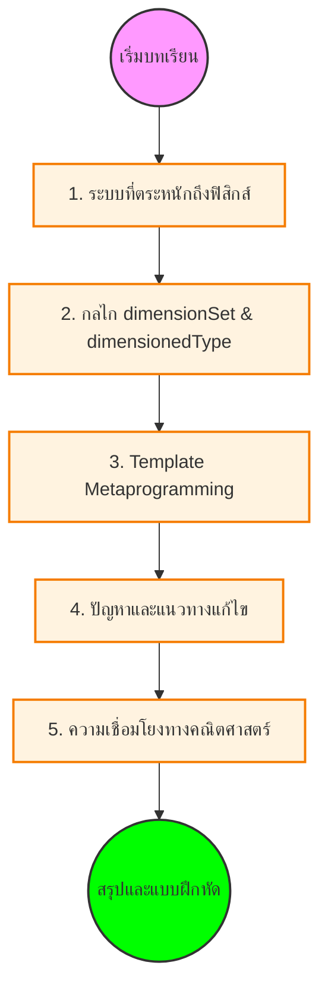

# โมดูล 05.02: ประเภทข้อมูลที่มีมิติ (Dimensioned Types)

ในส่วนนี้ เราจะเจาะลึกความสามารถที่โดดเด่นที่สุดอย่างหนึ่งของ OpenFOAM คือระบบประเภทข้อมูลที่ตระหนักถึงฟิสิกส์ (Physics-aware type system) ซึ่งช่วยให้คอมไพเลอร์สามารถตรวจสอบความสอดคล้องของมิติทางฟิสิกส์ได้ในขั้นตอนการคอมไพล์และรันไทม์

## โครงสร้างเนื้อหา


> **Figure 1:** โครงสร้างเนื้อหาของบทเรียนเรื่องประเภทข้อมูลที่มีมิติ (Dimensioned Types) ซึ่งครอบคลุมตั้งแต่พื้นฐาน กลไกการทำงาน ไปจนถึงการประยุกต์ใช้และการแก้ปัญหาเชิงลึก

1. **บทนำ (Introduction)**: ทำไมเราต้องมีระบบหน่วยที่เข้มงวด
2. **ระบบประเภทที่ตระหนักถึงฟิสิกส์ (Physics-Aware Type System)**: แนวคิดเบื้องต้นและการเปรียบเทียบ
3. **กลไกการทำงาน (Implementation Mechanisms)**: การทำงานของ `dimensionSet` และ `dimensionedType`
4. **Template Metaprogramming**: สถาปัตยกรรมเบื้องหลังที่ทำให้การตรวจสอบมิติไม่มี Runtime Overhead
5. **ปัญหาและแนวทางแก้ไข (Pitfalls & Solutions)**: ข้อผิดพลาดที่พบบ่อยในการจัดการหน่วย
6. **ประโยชน์ทางวิศวกรรม (Engineering Benefits)**: ความปลอดภัยและความถูกต้องของผลลัพธ์
7. **สูตรทางคณิตศาสตร์ (Mathematical Formulations)**: ความเชื่อมโยงกับทฤษฎีบท Buckingham π
8. **สรุปและแบบฝึกหัด (Summary & Exercises)**

---

## วัตถุประสงค์การเรียนรู้

เมื่อสิ้นสุดหัวข้อนี้ คุณจะสามารถ:

| หมายเลข | วัตถุประสงค์ | ระดับความซับซ้อน |
|------------|----------------|----------------------|
| 1 | **เข้าใจ** รูปแบบเทมเพลตเมตาโปรแกรมมิ่งเบื้องหลังระบบชนิดข้อมูลมิติ | พื้นฐาน |
| 2 | **วิเคราะห์** กลไกการตรวจสอบมิติระหว่างเวลาคอมไพล์และเวลาทำงาน | กลาง |
| 3 | **สร้าง** ชนิดข้อมูลมิติแบบกำหนดเองสำหรับการประยุกต์ใช้ทางฟิสิกส์เฉพาะทาง | กลาง |
| 4 | **ดีบัก** ปัญหาความสอดคล้องกันของมิติในการจำลอง CFD ที่ซับซ้อน | สูง |
| 5 | **ขยาย** ระบบมิติสำหรับการผสมผสานหลายฟิสิกส์ | สูง |
| 6 | **ปรับให้เหมาะสม** ประสิทธิภาพโดยใช้พีชคณิตมิติในเวลาคอมไพล์ | ขั้นสูง |

วัตถุประสงค์เหล่านี้มีการพัฒนาจากความเข้าใจพื้นฐานไปสู่การประยุกต์ใช้จริงและการปรับให้เหมาะสมขั้นสูง คุณจะเรียนรู้ไม่เพียงแค่ว่าระบบทำงานอย่างไร แต่ยังรวมถึงวิธีใช้ประโยชน์จากระบบสำหรับแบบจำลองฟิสิกส์แบบกำหนดเองและแอปพลิเคชันที่สำคัญต่อประสิทธิภาพของคุณ

---

## ภาพรวม: จากเครื่องคิดเลขไปสู่ตัวตรวจสอบฟิสิกส์เวลาคอมไพล์

### ปัญหาก่อน OpenFOAM

ก่อนที่จะมีระบบชนิดข้อมูลมิติของ OpenFOAM โค้ด CFD โดยทั่วไปมักประสบปัญหา:

> [!WARNING] ข้อผิดพลาดทางมิติที่อันตราย
> - **บั๊กเกี่ยวกับมิติ** ที่ปรากฏเป็นผลลัพธ์ทางฟิสิกส์ที่ไม่ถูกต้อง
> - ค้นพบหลังจากใช้เวลาคำนวณนานหลายชั่วโมง
> - ตัวอย่าง: นักพัฒนาเขียนโค้ดคำนวณความดันเป็น $p = \rho + v$ (การบวกความหนาแน่นเข้ากับความเร็ว) โดยไม่ตั้งใจ
> - คอมไพเลอร์ยอมรับได้อย่างมีความสุข

### แนวทางของ OpenFOAM

สถาปนิกของ OpenFOAM ตระหนักว่า:

> [!INFO] หลักการออกแบบ
> - **การวิเคราะห์มิติ**—หลักการพื้นฐานในฟิสิกส์—สามารถบังคับใช้ผ่านระบบชนิดข้อมูลได้
> - ทำให้มิติเป็นส่วนหนึ่งของลายเซ็นชนิดข้อมูล
> - **คอมไพเลอร์กลายเป็นผู้ช่วยทางคณิตศาสตร์** รับประกันว่าการดำเนินการทั้งหมดยังคงความสอดคล้องกันของมิติ

### การเปรียบเทียบ: แนวทางดั้งเดิมเทียบกับ Template Metaprogramming

| **ลักษณะ** | **การตรวจสอบหน่วยแบบดั้งเดิม** | **แนวทางที่ใช้ Template ของ OpenFOAM** |
|--------------|-------------------------------------|-------------------------------------------|
| **จังหวะตรวจสอบ** | การตรวจสอบเวลาทำงาน | การตรวจสอบเวลาคอมไพล์ |
| **ประสิทธิภาพ** | มีค่าใช้จ่ายด้านประสิทธิภาพ | ไม่มีค่าใช้จ่ายเวลาทำงาน |
| **จุดพบข้อผิดพลาด** | หลังใช้ทรัพยากรการคำนวณแล้ว | ก่อนการจำลองทำงาน |
| **ความสามารถในการแสดงออก** | จำกัด - ตรวจสอบเฉพาะความเข้ากันได้ของหน่วยพื้นฐาน | หลากหลาย - Template Specialization สำหรับปริมาณทางฟิสิกส์ต่างๆ |

---

## ระบบ DimensionSet

### มิติพื้นฐาน

OpenFOAM ใช้เจ็ดมิติพื้นฐานตามระบบ SI:

| มิติ | สัญลักษณ์ | หน่วย SI | คำอธิบาย |
|------|------------|-----------|-----------|
| มวล | `[M]` | กิโลกรัม (kg) | Mass |
| ความยาว | `[L]` | เมตร (m) | Length |
| เวลา | `[T]` | วินาที (s) | Time |
| อุณหภูมิ | `[Θ]` | เคลวิน (K) | Temperature |
| ปริมาณของสาร | `[N]` | โมล (mol) | Amount of substance |
| กระแสไฟฟ้า | `[I]` | แอมแปร์ (A) | Electric current |
| ความเข้มแสง | `[J]` | แคนเดลา (cd) | Luminous intensity |

### การแสดงมิติทางคณิตศาสตร์

สำหรับปริมาณทางฟิสิกส์ใดๆ $q$ การแสดงมิติคือ:

$$[q] = M^a L^b T^c \Theta^d I^e N^f J^g$$

เลขชี้กำลัง $a$ ถึง $g$ เป็นจำนวนเต็มที่กำหนดลักษณะทางฟิสิกส์ของปริมาณโดยเฉพาะ

### คลาส DimensionSet

คลาส `dimensionSet` เก็บมิติเป็นเลขชี้กำลังจำนวนเต็ม:

```cpp
// กำลัง: M^1 L^2 T^-3 (หน่วยของกำลัง)
dimensionSet dims(1, 2, -3, 0, 0, 0, 0);
```

### มิติที่กำหนดไว้ล่วงหน้า

#### มิติพื้นฐาน

```cpp
const dimensionSet dimless(0, 0, 0, 0, 0, 0, 0);      // ไม่มีมิติ
const dimensionSet dimMass(1, 0, 0, 0, 0, 0, 0);      // มวล
const dimensionSet dimLength(0, 1, 0, 0, 0, 0, 0);    // ความยาว
const dimensionSet dimTime(0, 0, 1, 0, 0, 0, 0);      // เวลา
const dimensionSet dimTemperature(0, 0, 0, 1, 0, 0, 0); // อุณหภูมิ
```

#### มิติที่ได้จากการดัดแปลง

```cpp
const dimensionSet dimPressure(1, -1, -2, 0, 0, 0, 0);       // ความดัน [M L⁻¹ T⁻²]
const dimensionSet dimDensity(1, -3, 0, 0, 0, 0, 0);          // ความหนาแน่น [M L⁻³]
const dimensionSet dimVelocity(0, 1, -1, 0, 0, 0, 0);        // ความเร็ว [L T⁻¹]
const dimensionSet dimAcceleration(0, 1, -2, 0, 0, 0, 0);    // ความเร่ง [L T⁻²]
const dimensionSet dimViscosity(1, -1, -1, 0, 0, 0, 0);       // ความหนืด [M L⁻¹ T⁻¹]
const dimensionSet dimEnergy(1, 2, -2, 0, 0, 0, 0);          // พลังงาน [M L² T⁻²]
```

---

## ประเภท dimensionedType

### โครงสร้างพื้นฐาน

คลาสเทมเพลต `dimensioned<Type>` ทำหน้าที่เป็น wrapper รอบๆ ประเภทตัวเลขใดๆ (scalar, vector, tensor, เป็นต้น):

```cpp
template<class Type>
class dimensionedType
{
    word name_;           // ตัวระบุสำหรับปริมาณ
    Type value_;          // ค่าตัวเลข
    dimensionSet dims_;   // มิติทางกายภาพ
    IOobject::writeOption wOpt_;
};
```

### ประเภทที่มีมิติทั่วไป

#### dimensionedScalar

```cpp
dimensionedScalar pressure("p", dimPressure, 101325.0);
dimensionedScalar temperature("T", dimTemperature, 293.15);
dimensionedScalar density("rho", dimDensity, 1.2);
```

#### dimensionedVector

```cpp
vector velVector(1.0, 0.0, 0.0);
dimensionedVector velocity("U", dimVelocity, velVector);
```

#### dimensionedTensor

```cpp
tensor stressTensor;
dimensionedTensor stress("tau", dimPressure, stressTensor);
```

---

## ความสอดคล้องของมิติ

### หลักการของความสอดคล้องของมิติ

สมการทางกายภาพทั้งหมดต้องรักษาความสอดคล้องของมิติ สำหรับสมการ Navier-Stokes:

$$\rho \frac{\partial \mathbf{u}}{\partial t} + \rho (\mathbf{u} \cdot \nabla) \mathbf{u} = -\nabla p + \mu \nabla^2 \mathbf{u} + \mathbf{f}$$

**มิติของแต่ละพจน์**:
- $\rho$ = มวลต่อปริมาตร = $ML^{-3}$
- $\frac{\partial \mathbf{u}}{\partial t}$ = ความเร่ง = $LT^{-2}$
- $\rho (\mathbf{u} \cdot \nabla) \mathbf{u}$ = แรงต่อปริมาตร = $ML^{-2}T^{-2}$

แต่ละพจน์ต้องมีมิติของแรงต่อปริมาตร:

$$[\text{แรง}/\text{ปริมาตร}] = \frac{M \cdot L/T^2}{L^3} = ML^{-2}T^{-2}$$

### การตรวจสอบมิติอัตโนมัติ

คอมไพเลอร์บังคับใช้ความสอดคล้องของมิติ:

```cpp
// ถูกต้อง: มิติตรงกัน (L/T * T = L)
dimensionedScalar distance = velocity * time;

// ไม่ถูกต้อง: มิติไม่ตรงกันถูกตรวจพบในเวลาคอมไพล์
// dimensionedScalar invalid = velocity + pressure;
```

### ตัวอย่าง: การคำนวณจำนวนเรย์โนลด์

```cpp
dimensionedScalar L("L", dimLength, 1.0);           // ความยาวลักษณะ
dimensionedScalar U("U", dimVelocity, 10.0);        // ความเร็ว
dimensionedScalar nu("nu", dimViscosity, 1e-6);     // ความหนืดจลน์

// จำนวนเรย์โนลด์: Re = U*L/nu (ไม่มีมิติ)
dimensionedScalar Re = U*L/nu;

// Re จะไม่มีมิติโดยอัตโนมัติสำหรับการตรวจสอบมิติ
if (Re.value() > 2300)
{
    Info << "การไหลเป็นแบบปั่นป่วน" << endl;
}
```

> [!TIP] หมายเหตุ
> จำนวนเรย์โนลด์เป็นปริมาณที่ไม่มีมิติ ซึ่งบ่งบอกถึงอัตราส่วนระหว่างแรงเฉื่อยและแรงเหนียว

---

## สถาปัตยกรรม Template Metaprogramming

### CRTP (Curiously Recurring Template Pattern)

ระบบวิเคราะห์มิติของ OpenFOAM ใช้ CRTP เป็นรากฐานของกลยุทธ์ polymorphism ระดับคอมไพล์:

```cpp
// Base template ที่ใช้ CRTP
template<class Derived>
class DimensionedBase
{
public:
    // CRTP helper สำหรับเข้าถึงคลาส derived
    Derived& derived() { return static_cast<Derived&>(*this); }
    const Derived& derived() const { return static_cast<const Derived&>(*this); }

    // Operations ที่นิยามในรูปของ derived class
    auto operator+(const Derived& other) const
    {
        return Derived::add(derived(), other);
    }

    template<class OtherDerived>
    auto operator*(const OtherDerived& other) const
    {
        return Derived::multiply(derived(), other);
    }
};
```

### Expression Templates

Expression templates ใน OpenFOAM กำจัด temporary objects และเปิดใช้งาน lazy evaluation:

```cpp
// Expression template สำหรับ dimensioned addition
template<class E1, class E2>
class DimensionedAddExpr
{
private:
    const E1& e1_;
    const E2& e2_;

public:
    typedef typename E1::value_type value_type;
    typedef typename E1::dimension_type dimension_type;

    DimensionedAddExpr(const E1& e1, const E2& e2)
    : e1_(e1), e2_(e2)
    {
        // Compile-time dimension check
        static_assert(
            std::is_same<
                typename E1::dimension_type,
                typename E2::dimension_type
            >::value,
            "Dimensions must match for addition"
        );
    }

    value_type value() const { return e1_.value() + e2_.value(); }
    dimension_type dimensions() const { return e1_.dimensions(); }
};
```

### ข้อดีของสถาปัตยกรรม

1. **Zero-overhead abstraction**: ไม่มี overhead ของ pointer ตารางฟังก์ชันเสมือน
2. **Compile-time optimization**: Operations ได้รับการแก้ไขในระหว่างคอมไพล์
3. **Type safety**: ความสม่ำเสมอของมิติถูกบังคับใช้ในระหว่างคอมไพล์
4. **Code reuse**: Operations ทั่วไปถูกนิยามครั้งเดียวใน base class

---

## การดำเนินการทางคณิตศาสตร์

### การดำเนินการที่รองรับ

```cpp
dimensionedScalar a("a", dimLength, 5.0);
dimensionedScalar b("b", dimTime, 2.0);

// การคำนวณพื้นฐาน
dimensionedScalar product = a * b;      // L * T = LT
dimensionedScalar ratio = a / b;        // L / T = L/T
dimensionedScalar power = pow(a, 2);    // L^2 = L^2

// ฟังก์ชัน超越จำเป็นต้องใช้ input ที่ไม่มีมิติ
dimensionedScalar expVal = exp(a.dimensions().reset());  // ต้องการค่าที่ไม่มีมิติ
```

### ฟังก์ชันที่มีข้อกำหนดมิติเข้มงวด

| ฟังก์ชัน | ข้อกำหนดมิติ | ตัวอย่างการใช้งาน |
|------------|----------------|------------------|
| **ตรีโกณมิติ** (sin, cos, tan) | ต้องเป็นไร้มิติ | `sin(angle)` |
| **เลขชี้กำลุง** (exp, pow) | ขึ้นอยู่กับฟังก์ชัน | `exp(dimensionless)` |
| **ลอการิทึม** (log, ln) | ต้องเป็นไร้มิติ | `ln(ratio)` |

---

## ประโยชน์ทางวิศวกรรม

### 1. ความปลอดภัยและการดีบัก

> [!INFO] ข้อดีหลัก
> - **ป้องกันข้อผิดพลาด**ในการแปลงหน่วย
> - **ตรวจพบความไม่สอดคล้อง**ของมิติได้ตั้งแต่แน่ๆ
> - ให้**ข้อความผิดพลาดที่มีความหมาย**

### 2. สัญชาตญาณทางกายภาพ

- ทำให้**โค้ดอ่านง่าย**และอธิบายตนเองได้ดีขึ้น
- ทำให้มั่นใจได้ว่าการดำเนินการทางคณิตศาสต์**มีความหมายทางกายภาพ**
- **ช่วยในการตรวจสอบ**แบบจำลองทางกายภาพ

### 3. มาตรฐานสากล

- **รองรับหน่วย SI**อย่างสอดคล้องกัน
- ช่วยให้การ**แปลงและการสเกลหน่วย**ทำได้ง่าย
- **สอดคล้องกับมาตรฐาน**ทางวิศวกรรม

---

## ความเชื่อมโยงทางคณิตศาสตร์: ทฤษฎีบท Buckingham π

### พื้นฐานคณิตศาสตร์

**ทฤษฎีบท Buckingham π** ให้กรอบพื้นฐานสำหรับการวิเคราะห์มิติในพลศาสตร์ของไหล โดยระบุว่าสมการที่มีความหมายทางกายภาพใดๆ ที่เกี่ยวข้องกับตัวแปร $n$ ตัวสามารถเขียนใหม่ในรูปของพารามิเตอร์ไร้มิติ $n - k$ ตัว โดยที่ $k$ คือจำนวนมิติพื้นฐาน

สำหรับตัวแปร $Q_1, Q_2, \ldots, Q_n$ ที่มีมิติแสดงเป็น:

$$[Q_i] = \prod_{j=1}^k D_j^{a_{ij}}$$

ทฤษฎีบทนี้มองหาการรวมกันของปริมาณไร้มิติ $\Pi_m$ ที่เกิดจาก:

$$\Pi_m = \prod_{i=1}^n Q_i^{b_{im}} \quad \text{โดยที่} \quad \sum_{i=1}^n a_{ij} b_{im} = 0 \quad \forall j$$

### พารามิเตอร์ไร้มิติที่สำคัญ

| จำนวนไร้มิติ | สูตร | คำอธิบาย |
|----------------|--------|-----------|
| **จำนวน Reynolds** | $\mathrm{Re} = \frac{\rho U L}{\mu}$ | แรงเฉื่อย/แรงหนืด |
| **จำนวน Froude** | $\mathrm{Fr} = \frac{U}{\sqrt{gL}}$ | แรงเฉื่อย/แรงโน้มถ่วง |
| **จำนวน Mach** | $\mathrm{Ma} = \frac{U}{c}$ | ความเร็ว/ความเร็วเสียง |
| **จำนวน Prandtl** | $\mathrm{Pr} = \frac{\mu c_p}{k}$ | การแพร่ของโมเมนตัม/ความร้อน |

---

## แนวทางปฏิบัติที่ดีที่สุด

### 1. ใช้มิติที่เหมาะสม

```cpp
// ดี: ใช้มิติที่กำหนดไว้ล่วงหน้า
dimensionedScalar velocity("U", dimVelocity, 2.0);

// ดีกว่า: ใช้บริบทฟิลด์เฉพาะ
dimensionedVector U("U", dimensionSet(0, 1, -1, 0, 0, 0, 0), vector(2, 0, 0));
```

### 2. บันทึกความหมายทางกายภาพ

```cpp
dimensionedScalar kinematicViscosity
(
    "nu",                    // ชื่อที่มีความหมาย
    dimensionSet(2, 0, -1, 0, 0, 0, 0),  // L^2/T
    1.5e-5                   // ค่า
);
```

### 3. ใช้ประโยชน์จากการตรวจสอบอัตโนมัติ

> [!TIP] แนะนำ
> พึ่งพาคอมไพเลอร์ในการตรวจจับข้อผิดพลาดทางมิติมากกว่าการติดตามหน่วยด้วยตนเอง

---

## การผสานรวมกับไฟล์ Dictionary

### รูปแบบรายการ Dictionary

```cpp
dimensionedScalar
{
    value       101325;      // ค่าตัวเลข
    dimensions  [1 -1 -2 0 0 0 0];  // มิติของความดัน
    units       Pa;         // ป้ายชื่อหน่วยเพิ่มเติม
}
```

### การอ่านจาก Dictionaries

```cpp
dimensionedScalar p
(
    "p",                    // ชื่อ
    dict.lookupOrDefault<dimensionedScalar>("p", 101325.0)
);
```

---

## สรุป

ระบบประเภทที่มีมิติของ OpenFOAM ทำให้มั่นใจได้ว่ามีความสอดคล้องทางกายภาพในขณะที่ให้การจัดการหน่วยอัตโนมัติและการตรวจจับข้อผิดพลาดตลอดการคำนวณ CFD

สถาปัตยกรรมที่ขับเคลื่อนโดย Template Metaprogramming นี้ให้:

- ✅ ความปลอดภัยในการตรวจสอบมิติเวลาคอมไพล์
- ✅ ประสิทธิภาพการคำนวณสูงด้วย zero runtime overhead
- ✅ ความสามารถในการขยายสำหรับฟิสิกส์แบบกำหนดเอง
- ✅ การรวมกันของหลายฟิสิกส์ที่มีความปลอดภัย

แนวทางนี้เปลี่ยน **ความถูกต้องทางฟิสิกส์** จากข้อกังวลเวลาทำงานไปเป็นการรับประกันเวลาคอมไพล์ โดยใช้ระบบประเภท C++ เพื่อบังคับใช้กฎหมายฟิสิกส์
