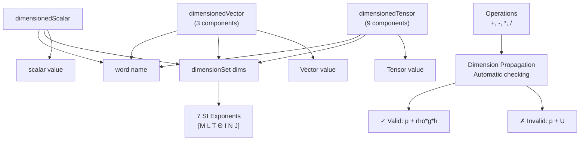

# Dimensioned Types - Overview

ภาพรวม Dimensioned Types ใน OpenFOAM — ระบบป้องกัน Physics Errors

> **ทำไม Dimensioned Types สำคัญที่สุดใน OpenFOAM?**
> - **ป้องกัน bugs ที่ compiler จับไม่ได้** — เช่น บวก pressure + velocity
> - ช่วยให้ code **self-documenting** — เห็นหน่วยทันที
> - จับ errors ตั้งแต่ **compile-time** ไม่ใช่หลัง run หลายชั่วโมง

---

## Learning Objectives

หลังจากอ่านโมดูลนี้ คุณจะสามารถ:
- อธิบาย **3W** ของ Dimensioned Types (What, Why, When)
- ใช้งาน **dimensionSet** และ predefined dimensions
- เขียนโค้ดที่ **compile-time safe** จากมิติเชิงฟิสิกส์
- หลีกเลี่ยง **common pitfalls** ในการดำเนินการกับหน่วย
- อ่านและเขียน **dimensioned objects** จาก dictionary files

---

## Overview

> **💡 คิดแบบนี้:**
> `dimensionedScalar` = **ตัวเลข + ป้ายบอกหน่วย**
>
> เหมือนเขียน "1000 kg/m³" แทนแค่ "1000"
> ถ้าพยายาม "1000 kg/m³" + "10 m/s" → OpenFOAM รู้ทันทีว่าผิด!



---

## 1. What Are Dimensioned Types?

**Dimensioned Types** คือ **primitive types** ใน OpenFOAM ที่มี **dimension checking** แบบ built-in:

| Type | Description | Example |
|------|-------------|---------|
| `dimensionedScalar` | Single value + dimensions | `1000 kg/m³` |
| `dimensionedVector` | 3-component vector + dimensions | `(0, 0, -9.81) m/s²` |
| `dimensionedTensor` | 9-component tensor + dimensions | Stress tensor `[Pa]` |
| `dimensionedSymmTensor` | Symmetric tensor | Strain rate `[1/s]` |

---

## 2. Why Dimensioned Types?

| Problem | Solution | Impact |
|---------|----------|--------|
| **Unit errors in equations** | Automatic checking | Caught at compile-time |
| **Unclear variable meaning** | Name + units attached | Self-documenting code |
| **Physics bugs at runtime** | Dimension propagation | Early error detection |
| **Silent computation errors** | Runtime dimension check | Prevents wrong results |

### Engineering Benefits

1. **Safety**: ป้องกันการบวกหน่วยที่ไม่ตรงกัน (เช่น `pressure + velocity`)
2. **Clarity**: โค้ดอ่านง่ายขึ้น เพราะเห็นหน่วยตามไปด้วย
3. **Maintainability**: ลดโอกาสเกิด bugs เมื่อโค้ดซับซ้อนขึ้น
4. **Documentation**: dimensionSet เป็นเอกสารบอกหน่วยอย่างอัตโนมัติ

---

## 3. When to Use Dimensioned Types?

### Use Cases

| Scenario | Recommended Type |
|----------|------------------|
| **Transport properties** (ρ, μ, ν) | `dimensionedScalar` |
| **Boundary conditions** (p, U, T) | `dimensionedScalar` / `dimensionedVector` |
| **Source terms** (gravity, momentum) | `dimensionedVector` |
| **Turbulence parameters** (k, ε, ω) | `dimensionedScalar` |
| **Dimensionless numbers** (Re, Pr) | `dimensionedScalar` with `dimless` |

### When NOT to Use

- **Loop counters** หรือ temporary variables
- **Geometric parameters** ที่ไม่มีหน่วยทางฟิสิกส์
- **Local calculations** ที่ไม่ต้องการ dimension checking

---

## 4. Core Components

### dimensionSet

```cpp
// 7 SI base dimensions
dimensionSet(M, L, T, Θ, I, N, J)

// Example: Pressure [kg/(m·s²)]
dimensionSet(1, -1, -2, 0, 0, 0, 0)
```

### SI Base Dimensions

| Symbol | Quantity | Unit |
|--------|----------|------|
| **M** | Mass | kg |
| **L** | Length | m |
| **T** | Time | s |
| **Θ** | Temperature | K |
| **I** | Electric Current | A |
| **N** | Amount of Substance | mol |
| **J** | Luminous Intensity | cd |

### Predefined Dimensions

| Alias | dimensionSet | Unit |
|-------|--------------|------|
| `dimless` | `[0 0 0 0 0 0 0]` | - |
| `dimLength` | `[0 1 0 0 0 0 0]` | m |
| `dimTime` | `[0 0 1 0 0 0 0]` | s |
| `dimMass` | `[1 0 0 0 0 0 0]` | kg |
| `dimTemperature` | `[0 0 0 1 0 0 0]` | K |
| `dimVelocity` | `[0 1 -1 0 0 0 0]` | m/s |
| `dimAcceleration` | `[0 1 -2 0 0 0 0]` | m/s² |
| `dimPressure` | `[1 -1 -2 0 0 0 0]` | Pa |
| `dimDensity` | `[1 -3 0 0 0 0 0]` | kg/m³ |
| `dimDynamicViscosity` | `[1 -1 -1 0 0 0 0]` | Pa·s |
| `dimKinematicViscosity` | `[0 2 -1 0 0 0 0]` | m²/s |
| `dimEnergy` | `[1 2 -2 0 0 0 0]` | J |
| `dimPower` | `[1 2 -3 0 0 0 0]` | W |

> **📋 Note**: This consolidated table replaces scattered tables across 5+ files. Reference this for all dimension lookups.

---

## 5. Creating Dimensioned Objects

### dimensionedScalar

```cpp
// Direct construction
dimensionedScalar rho("rho", dimDensity, 1000);

// From dictionary
dimensionedScalar nu("nu", dimKinematicViscosity, transportDict);

// With inline dimensions
dimensionedScalar p(
    "p",
    dimensionSet(1, -1, -2, 0, 0, 0, 0),  // Pressure
    101325  // Pa
);
```

### dimensionedVector

```cpp
// Gravity vector
dimensionedVector g(
    "g",
    dimAcceleration,
    vector(0, 0, -9.81)
);

// Velocity field (initial value)
dimensionedVector U0(
    "U0",
    dimVelocity,
    vector(10, 0, 0)  // m/s in x-direction
);
```

### dimensionedTensor

```cpp
// Stress tensor
dimensionedTensor tau(
    "tau",
    dimPressure,
    tensor(
        0, 0, 0,
        0, 0, 0,
        0, 0, 0
    )
);
```

---

## 6. Dimension Checking

### Valid Operations

```cpp
dimensionedScalar rho("rho", dimDensity, 1000);
dimensionedScalar U("U", dimVelocity, 10);

// ✓ OK: [M L^-3] * [L² T^-2] = [M L^-1 T^-2] = pressure
dimensionedScalar dynP = 0.5 * rho * sqr(U);

// ✓ OK: [M L^-1 T^-2] / [M L^-3] = [L² T^-2] = velocity²
dimensionedScalar velocitySq = p / rho;
```

### Invalid Operations

```cpp
// ✗ ERROR: Cannot add pressure + velocity
// dimensionedScalar bad = p + U;
// Expected: [1 -1 -2 0 0 0 0]
// Actual:   [0 1 -1 0 0 0 0]

// ✗ ERROR: Cannot divide velocity by time
// dimensionedScalar bad2 = U / deltaT;
// Expected: [0 1 -1 0 0 0 0]
// Actual:   [0 1 -2 0 0 0 0]
```

### Dimension Propagation Rules

| Operation | Dimension Rule | Example |
|-----------|----------------|---------|
| `a + b` | `dim(a) == dim(b)` | `p1 + p2` → pressure |
| `a - b` | `dim(a) == dim(b)` | `U1 - U2` → velocity |
| `a * b` | `dim(a) + dim(b)` | `ρ * U` → momentum flux |
| `a / b` | `dim(a) - dim(b)` | `p / ρ` → velocity² |
| `sqr(a)` | `dim(a) * 2` | `sqr(U)` → velocity² |
| `sqrt(a)` | `dim(a) / 2` | `sqrt(k)` → velocity |
| `pow(a, n)` | `dim(a) * n` | `pow(L, 3)` → volume |

---

## 7. Reading from Dictionary

### Dictionary File Format

```cpp
// constant/transportProperties
transportModel  Newtonian;

nu              nu [0 2 -1 0 0 0 0] 1e-6;
rho             rho [1 -3 0 0 0 0 0] 1000;
```

### Reading in Code

```cpp
// Auto-detect dimensions from dictionary
IOdictionary transportDict(
    IOobject(
        "transportProperties",
        runTime.constant(),
        mesh,
        IOobject::MUST_READ,
        IOobject::NO_WRITE
    )
);

dimensionedScalar nu(
    "nu",
    dimKinematicViscosity,
    transportDict
);

// Or specify dimensions explicitly (will validate)
dimensionedScalar rho(
    "rho",
    dimDensity,
    transportDict
);
```

---

## 8. Common Pitfalls

| Pitfall | Issue | Solution |
|---------|-------|----------|
| **Mixing units** | `p + rho*g*h` หน่วยไม่ตรง | Convert all to same units first |
| **Missing dimensions** | ใช้ `scalar` แทน `dimensionedScalar` | Always use dimensioned types for physics |
| **Wrong dimensionSet** | `[0 0 0 1 0 0 0]` แทน `[0 0 1 0 0 0 0]` | Use predefined dims (`dimTemperature`, `dimTime`) |
| **Runtime vs compile-time** | บาง errors เจอเมื่อ run | Check dimension consistency early |
| **Dimensionless numbers** | `Re` ต้องใช้ `dimless` | Explicitly set `dimensionSet(0,0,0,0,0,0,0)` |

---

## Quick Reference

### Key Methods

| Method | Description | Example |
|--------|-------------|---------|
| `.name()` | Get variable name | `rho.name()` → "rho" |
| `.value()` | Get scalar value | `rho.value()` → 1000.0 |
| `.dimensions()` | Get dimensionSet | `p.dimensions()` → `[1 -1 -2 0 0 0 0]` |
| `.dimensionless()` | Check if dimless | `Re.dimensionless()` → true |
| `.setValue(scalar)` | Set new value | `rho.setValue(998);` |
| `.read(Istream&)` | Read from stream | `nu.read(is);` |
| `.write(Ostream&)` | Write to stream | `p.write(os);` |

### Dimension Operations

```cpp
// Check dimensions
bool compatible = p.dimensions() == rho.dimensions() * sqr(U.dimensions());

// Get specific dimension
scalar massExponent = p.dimensions()[dimensionSet::MASS];  // 1

// Create custom dimension
dimensionSet myDim(0, 2, -1, 0, 0, 0, 0);  // m²/s

// Reset to dimensionless
Re.dimensions().reset();
```

---

## Module Contents

| File | Topic | Key Concepts |
|------|-------|--------------|
| **01_Introduction** | Basics | Syntax, creation, basic operations |
| **02_Physics_Aware** | Type system design | Dimension checking, propagation, safety |
| **03_Implementation** | Under the hood | dimensionSet class, storage, validation |
| **04_Template** | Metaprogramming | Template-based operations, compile-time safety |
| **05_Pitfalls** | Common errors | Mismatch cases, debugging, best practices |
| **06_Engineering** | Practical benefits | Real-world examples, productivity gains |
| **07_Mathematical** | Formulations | Dimensional analysis, Buckingham π theorem |
| **08_Summary** | Exercises | Practice problems, case studies |

---

## 🧠 Concept Check

<details>
<summary><b>1. ทำไมใช้ 7 dimensions?</b></summary>

**SI base units**: Mass, Length, Time, Temperature, Electric Current, Amount of Substance, Luminous Intensity
- ทั้งหมด 7 ตัว ครอบคลุมทุกปริมาณทางฟิสิกส์
- ใช้ exponents (เลขยกกำลัง) แทนการคูณหน่วยต่างๆ
</details>

<details>
<summary><b>2. ถ้า dimension mismatch เกิดอะไรขึ้น?</b></summary>

**Compile error** (ถ้า detect ได้ตั้งแต่ compiler) หรือ **runtime error** (เมื่อ execute)
- Error message จะบอก expected vs actual dimensions
- ช่วย debug ได้รวดเร็วมาก
</details>

<details>
<summary><b>3. dimless ใช้เมื่อไหร่?</b></summary>

สำหรับ **dimensionless numbers** ที่ไม่มีหน่วย:
- Reynolds number (`Re`), Prandtl number (`Pr`)
- Coefficients (C_d, C_l, C_m)
- Ratios, percentages, angles
</details>

<details>
<summary><b>4. แก้ปัญหา "dimension mismatch" อย่างไร?</b></summary>

1. **ตรวจสอบ dimensionSet** ของแต่ละตัวแปร
2. **เปรียบเทียบ expected vs actual** จาก error message
3. **ตรวจสอบสมการ** ว่าหน่วย balance หรือไม่
4. **ใช้ conversion** ถ้าจำเป็น (เช่น Pa → kPa)
5. **เช็ค predefined dims** ว่าใช้ถูกต้องหรือไม่
</details>

---

## 📖 เอกสารที่เกี่ยวข้อง

- **Introduction:** [01_Introduction.md](01_Introduction.md) — เริ่มต้นใช้งาน dimensioned types
- **Physics-Aware System:** [02_Physics_Aware_Type_System.md](02_Physics_Aware_Type_System.md) — ระบบตรวจสอบหน่วย
- **Implementation:** [03_Implementation_Details.md](03_Implementation_Details.md) — ภายใน dimensionSet class
- **Metaprogramming:** [04_Template_Metaprogramming.md](04_Template_Metaprogramming.md) — Compile-time safety
- **Common Pitfalls:** [05_Common_Pitfalls.md](05_Common_Pitfalls.md) — ข้อผิดพลาดที่พบบ่อย
- **Engineering Benefits:** [06_Engineering_Benefits.md](06_Engineering_Benefits.md) — ประโยชน์ในงานจริง
- **Mathematical Foundation:** [07_Mathematical_Formulations.md](07_Mathematical_Formulations.md) — Dimensional analysis
- **Summary & Exercises:** [08_Summary_and_Exercises.md](08_Summary_and_Exercises.md) — ฝึกปฏิบัติ