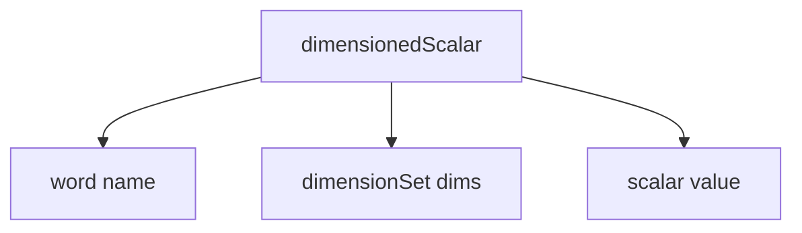

# Dimensioned Types - Overview

ภาพรวม Dimensioned Types ใน OpenFOAM

---

## Overview

> **Dimensioned Types** = ค่าที่มีหน่วยทางฟิสิกส์ติดมาด้วย



---

## 1. Why Dimensioned Types?

| Problem | Solution |
|---------|----------|
| Unit errors in equations | Automatic checking |
| Unclear variable meaning | Name + units attached |
| Physics bugs at runtime | Compile-time detection |

---

## 2. Core Components

### dimensionSet

```cpp
// 7 SI base dimensions
dimensionSet(M, L, T, Θ, I, N, J)

// Example: Pressure [kg/(m·s²)]
dimensionSet(1, -1, -2, 0, 0, 0, 0)
```

### dimensionedScalar

```cpp
dimensionedScalar rho("rho", dimDensity, 1000);
```

### dimensionedVector

```cpp
dimensionedVector g("g", dimAcceleration, vector(0, 0, -9.81));
```

---

## 3. Predefined Dimensions

| Alias | dimensionSet | Unit |
|-------|--------------|------|
| `dimless` | `[0 0 0 0 0 0 0]` | - |
| `dimLength` | `[0 1 0 0 0 0 0]` | m |
| `dimTime` | `[0 0 1 0 0 0 0]` | s |
| `dimMass` | `[1 0 0 0 0 0 0]` | kg |
| `dimVelocity` | `[0 1 -1 0 0 0 0]` | m/s |
| `dimPressure` | `[1 -1 -2 0 0 0 0]` | Pa |
| `dimDensity` | `[1 -3 0 0 0 0 0]` | kg/m³ |
| `dimDynamicViscosity` | `[1 -1 -1 0 0 0 0]` | Pa·s |
| `dimKinematicViscosity` | `[0 2 -1 0 0 0 0]` | m²/s |

---

## 4. Dimension Checking

### Valid Operations

```cpp
dimensionedScalar rho("rho", dimDensity, 1000);
dimensionedScalar U("U", dimVelocity, 10);

// OK: [M L^-3] * [L² T^-2] = [M L^-1 T^-2] = pressure
dimensionedScalar dynP = 0.5 * rho * sqr(U);
```

### Invalid Operations

```cpp
// ERROR: Cannot add pressure + velocity
// dimensionedScalar bad = p + U;
```

---

## 5. Reading from Dictionary

```cpp
// In constant/transportProperties:
// nu [0 2 -1 0 0 0 0] 1e-6;

dimensionedScalar nu("nu", dimKinematicViscosity, transportDict);
```

---

## 6. Module Contents

| File | Topic |
|------|-------|
| 01_Introduction | Basics |
| 02_Physics_Aware | Type system design |
| 03_Implementation | Under the hood |
| 04_Template | Metaprogramming |
| 05_Pitfalls | Common errors |
| 06_Engineering | Practical benefits |
| 07_Mathematical | Formulations |
| 08_Summary | Exercises |

---

## Quick Reference

| Method | Description |
|--------|-------------|
| `.name()` | Get name |
| `.value()` | Get scalar value |
| `.dimensions()` | Get dimensionSet |
| `.dimensionless()` | Check if dimless |

---

## Concept Check

<details>
<summary><b>1. ทำไมใช้ 7 dimensions?</b></summary>

**SI base units**: Mass, Length, Time, Temperature, Current, Moles, Luminous Intensity
</details>

<details>
<summary><b>2. ถ้า dimension mismatch เกิดอะไรขึ้น?</b></summary>

**Compile error** หรือ **runtime error** พร้อมข้อความบอก expected vs actual dimensions
</details>

<details>
<summary><b>3. dimless ใช้เมื่อไหร่?</b></summary>

สำหรับ **dimensionless numbers** เช่น Re, Nu, coefficients
</details>

---

## Related Documents

- **Introduction:** [01_Introduction.md](01_Introduction.md)
- **Physics Aware:** [02_Physics_Aware_Type_System.md](02_Physics_Aware_Type_System.md)