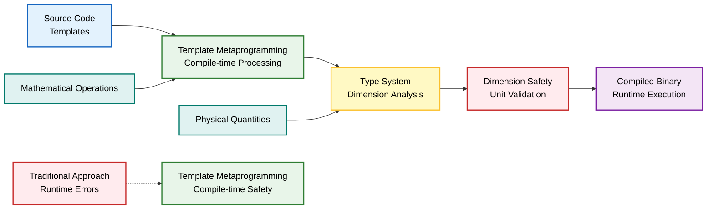
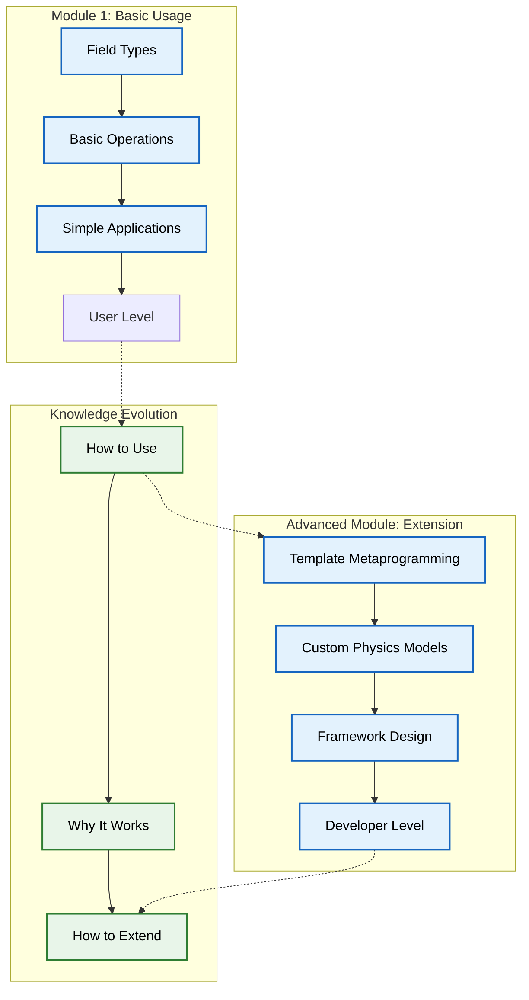
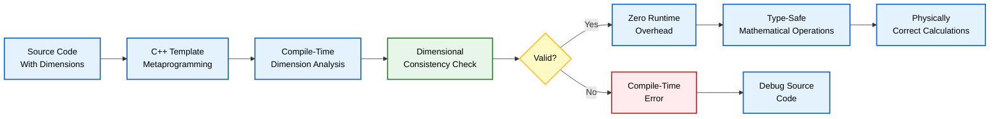

# บทนำ

ยินดีต้อนรับสู่การสำรวจขั้นสูงของระบบชนิดข้อมูลมิติของ OpenFOAM

ในขณะที่หัวข้อที่ 1 แนะนำแนวคิดพื้นฐานของ "เครื่องคิดเลขที่ตระหนักถึงหน่วย" หัวข้อนี้จะเจาะลึกถึง **สถาปัตยกรรมเทมเพลตเมตาโปรแกรมมิ่ง** ที่เปิดใช้งาน:

- การตรวจสอบมิติในเวลาคอมไพล์
- ความปลอดภัยทางฟิสิกส์ขั้นสูง
- พลศาสตร์ของไหลเชิงคำนวณที่มีประสิทธิภาพสูง

![[compile_time_dimension_safety.png]]



รากฐานของความแข็งแกร่งของ OpenFOAM อยู่ที่ **ระบบชนิดข้อมูลที่ซับซ้อน** ซึ่งป้องกันความไม่สอดคล้องกันของมิติในเวลาคอมไพล์ แทนที่จะค้นพบระหว่างการจำลอง CFD ที่มีค่าใช้จ่ายสูง

สถาปัตยกรรมนี้เป็นหนึ่งในการประยุกต์ใช้ **เทมเพลตเมตาโปรแกรมมิ่ง C++ ขั้นสูง** ที่สุดในการคำนวณทางวิทยาศาสตร์ โดยรวมความปลอดภัยของชนิดข้อมูลเข้ากับโอเวอร์เฮดเวลาทำงานที่เป็นศูนย์

## วัตถุประสงค์การเรียนรู้

เมื่อสิ้นสุดหัวข้อนี้ คุณจะสามารถ:

| หมายเลข | วัตถุประสงค์ | ระดับความซับซ้อน |
|------------|----------------|----------------------|
| 1 | **เข้าใจ** รูปแบบเทมเพลตเมตาโปรแกรมมิ่งเบื้องหลังระบบชนิดข้อมูลมิติ | พื้นฐาน |
| 2 | **วิเคราะห์** กลไกการตรวจสอบมิติระหว่างเวลาคอมไพล์และเวลาทำงาน | กลาง |
| 3 | **สร้าง** ชนิดข้อมูลมิติแบบกำหนดเองสำหรับการประยุกต์ใช้ทางฟิสิกส์เฉพาะทาง | กลาง |
| 4 | **ดีบัก** ปัญหาความสอดคล้องกันของมิติในการจำลอง CFD ที่ซับซ้อน | สูง |
| 5 | **ขยาย** ระบบมิติสำหรับการผสมผสามหลายฟิสิกส์ | สูง |
| 6 | **ปรับให้เหมาะสม** ประสิทธิภาพโดยใช้พีชคณิตมิติในเวลาคอมไพล์ | ขั้นสูง |

วัตถุประสงค์เหล่านี้มีการพัฒนาจากความเข้าใจพื้นฐานไปสู่การประยุกต์ใช้จริงและการปรับให้เหมาะสมขั้นสูง คุณจะเรียนรู้ไม่เพียงแค่ว่าระบบทำงานอย่างไร แต่ยังรวมถึงวิธีใช้ประโยชน์จากระบบสำหรับแบบจำลองฟิสิกส์แบบกำหนดเองและแอปพลิเคชันที่สำคัญต่อประสิทธิภาพของคุณ

## ความรู้พื้นฐานที่ต้องการ

| ความรู้พื้นฐาน | ระดับความสำคัญ | รายละเอียด |
|-------------------|------------------|-------------|
| **ความรู้ C++ ในระดับสูง** | 🔴 จำเป็น | เทมเพลต, type traits, SFINAE, รูปแบบ CRTP |
| **พื้นฐานหัวข้อที่ 1** | 🔴 จำเป็น | ความเข้าใจการใช้งาน `dimensionedType` พื้นฐาน |
| **ประสบการณ์ OpenFOAM** | 🟡 แนะนำ | ความคุ้นเคยกับการดำเนินการกับฟิลด์และโครงสร้าง Solver |
| **พื้นฐานทางคณิตศาสตร์** | 🟡 แนะนำ | การวิเคราะห์มิติ, ทฤษฎีบท Buckingham π |

พื้นฐานที่แข็งแกร่งในเทมเพลตเมตาโปรแกรมมิ่ง C++ เป็นสิ่งจำเป็น เนื่องจากเราจะเจาะลึกถึงเทคนิคเทมเพลตขั้นสูง การเคยสัมผัสกับการดำเนินการกับฟิลด์พื้นฐานของ OpenFOAM จะช่วยให้คุณเข้าใจบริบทที่เป็นประโยชน์ซึ่งชนิดข้อมูลมิติเหล่านี้ถูกนำไปใช้

## กลุ่มเป้าหมาย

หัวข้อนี้ถูกออกแบบสำหรับ:

| กลุ่มผู้ใช้ | วัตถุประสงค์หลัก | ความเชี่ยวชาญที่ต้องการ |
|--------------|------------------|-----------------------|
| **นักพัฒนา CFD ระดับอาวุโส** | ขยายความสามารถของ OpenFOAM ด้วยฟิสิกส์แบบกำหนดเอง | C++ Templates, CFD ขั้นสูง |
| **สถาปนิกเฟรมเวิร์ก** | ออกแบบไลบรารีการคำนวณทางวิทยาศาสตร์ | Software Architecture, Template Metaprogramming |
| **วิศวกรซอฟต์แวร์วิจัย** | สร้างการจำลองหลายฟิสิกส์ | Numerical Methods, Multi-physics |
| **ผู้เชี่ยวชาญการปรับให้เหมาะสมประสิทธิภาพ** | ทำงานกับเทมเพลตเมตาโปรแกรมมิ่ง | Performance Optimization, C++ |

หัวข้อนี้ถูกออกแบบสำหรับนักพัฒนาที่ต้องการขยายความสามารถของ OpenFOAM ไปเกินกว่าแอปพลิเคชัน CFD มาตรฐาน ซึ่งต้องการความเข้าใจอย่างลึกซึ้งเกี่ยวกับสถาปัตยกรรมชนิดข้อมูลที่อยู่เบื้องหลังเพื่อให้แน่ใจว่าโค้ดมีความแข็งแกร่ง บำรุงรักษาได้ และมีประสิทธิภาพ

## ความสัมพันธ์กับหัวข้อที่ 1

หัวข้อนี้ **ดึงและขยาย** เนื้อหาชนิดข้อมูลมิติจากหัวข้อที่ 1 (บรรทัด 185-357) โดย:

- **หัวข้อที่ 1**: ตอบคำถามว่า "**วิธีการใช้งาน**"
- **หัวข้อนี้**: ตอบคำถามว่า "**ทำไมถึงทำงานแบบนี้**" และ "**วิธีการขยาย**"



การพัฒนาจากหัวข้อที่ 1 ไปยังหัวข้อขั้นสูงนี้สะท้อน **การเดินทางจากผู้ใช้ OpenFOAM ไปสู่นักพัฒนา OpenFOAM** โดยเคลื่อนจากการใช้เครื่องมือที่มีอยู่ไปสู่การขยายและปรับให้เหมาะสมของเฟรมเวิร์กเอง

## ภาพรวมสถาปัตยกรรมหลัก

ระบบชนิดข้อมูลมิติของ OpenFOAM ถูกสร้างขึ้นจากแนวคิดเทมเพลตเมตาโปรแกรมมิ่ง C++ หลายประการ:

### 1. การวิเคราะห์มิติในเวลาคอมไพล์
- ใช้การเข้ารหัสเลขชี้กำลังจำนวนเต็มสำหรับมิติมวล, ความยาว, เวลา, อุณหภูมิ
- ตรวจสอบความสอดคล้องกันของมิติขณะคอมไพล์

### 2. การนำมาใช้แบบไม่มีค่าใช้จ่าย
- การตรวจสอบมิติเกิดขึ้นทั้งหมดในเวลาคอมไพล์
- **โอเวอร์เฮดเวลาทำงาน = 0**

### 3. การดำเนินการทางคณิตศาสตร์ที่ปลอดภัยต่อชนิดข้อมูล
- รับประกันว่าสมการเช่น $F = ma$ ไม่สามารถถูกละเมิดผ่านความไม่ตรงกันของชนิดข้อมูลได้

### 4. การออกแบบที่ขยายได้
- อนุญาตมิติและหน่วยแบบกำหนดเองสำหรับการประยุกต์ใช้ทางฟิสิกส์เฉพาะทาง



ระบบนี้ใช้ประโยชน์จากระบบชนิดข้อมูลของ C++ เป็นรูปแบบทางคณิตศาสตร์ ซึ่งความสอดคล้องกันของมิติกลายเป็นข้อจำกัดในเวลาคอมไพล์แทนที่จะเป็นการตรวจสอบในเวลาทำงาน

นี่เป็น **การเปลี่ยนแปลงพื้นฐาน** จากไลบรารีตัวเลขแบบดั้งเดิมไปสู่เฟรมเวิร์กการคำนวณทางวิทยาศาสตร์ที่ตระหนักถึงชนิดข้อมูลอย่างแท้จริง

## บริบททางประวัติศาสตร์และแรงจูงใจ

### ปัญหาก่อน OpenFOAM
ก่อนที่จะมีระบบชนิดข้อมูลมิติของ OpenFOAM โค้ด CFD โดยทั่วไปมักประสบปัญหา:

- **บั๊กเกี่ยวกับมิติ** ที่ปรากฏเป็นผลลัพธ์ทางฟิสิกส์ที่ไม่ถูกต้อง
- ค้นพบหลังจากใช้เวลาคำนวณนานหลายชั่วโมง
- ตัวอย่าง: นักพัฒนาเขียนโค้ดคำนวณความดันเป็น $p = \rho + v$ (การบวกความหนาแน่นเข้ากับความเร็ว) โดยไม่ตั้งใจ
- คอมไพเลอร์ยอมรับได้อย่างมีความสุข

### แรงจูงใจของ OpenFOAM
สถาปนิกของ OpenFOAM ตระหนักว่า:

- **การวิเคราะห์มิติ**—หลักการพื้นฐานในฟิสิกส์—สามารถบังคับใช้ผ่านระบบชนิดข้อมูลได้
- ทำให้มิติเป็นส่วนหนึ่งของลายเซ็นชนิดข้อมูล
- **คอมไพเลอร์กลายเป็นผู้ช่วยทางคณิตศาสตร์** รับประกันว่าการดำเนินการทั้งหมดยังคงความสอดคล้องกันของมิติ

### คุณค่าใน CFD
แนวทางนี้มีคุณค่าอย่างยิ่งใน CFD เนื่องจาก:

- การผสมผสามหลายฟิสิกส์ที่ซับซ้อนเกี่ยวข้องกับปริมาณทางฟิสิกส์หลายสิบอย่าง
- มีความสัมพันธ์ซับซ้อนระหว่างกัน
- การผิดพลาดเล็กน้อยอาจนำไปสู่การจำลองทั้งหมดที่ไม่ถูกต้อง

---

## รากฐานทางคณิตศาสตร์และกลไกการทำงาน

### แนวคิดระดับสูง: ระบบประเภทที่ตระหนักถึงฟิสิกส์

ในหัวข้อที่ 1 เราได้แนะนำ **สมการ "เครื่องคิดเลขที่ตระหนักถึงหน่วย"**—ระบบที่ป้องกันการบวกเมตรกับกิโลกรัม ให้เราพัฒนาแนวคิดนี้ไปสู่ **"ตัวตรวจสอบฟิสิกส์เวลาคอมไพล์"**—ระบบที่ตรวจสอบความถูกต้องของสมการฟิสิกส์ *ก่อน* ที่โค้ดจะทำงาน

#### แนวทางดั้งเดิมเทียบกับ Template Metaprogramming ของ OpenFOAM

| **ลักษณะ** | **การตรวจสอบหน่วยแบบดั้งเดิม** | **แนวทางที่ใช้ Template ของ OpenFOAM** |
|--------------|-------------------------------------|-------------------------------------------|
| **จังหวะตรวจสอบ** | การตรวจสอบเวลาทำงาน | การตรวจสอบเวลาคอมไพล์ |
| **ประสิทธิภาพ** | มีค่าใช้จ่ายด้านประสิทธิภาพ | ไม่มีค่าใช้จ่ายเวลาทำงาน |
| **จุดพบข้อผิดพลาด** | หลังใช้ทรัพยากรการคำนวณแล้ว | ก่อนการจำลองทำงาน |
| **ความสามารถในการแสดงออก** | จำกัด - ตรวจสอบเฉพาะความเข้ากันได้ของหน่วยพื้นฐาน | หลากหลาย - Template Specialization สำหรับปริมาณทางฟิสิกส์ต่างๆ |

#### OpenFOAM Code Implementation

```cpp
// มิติกลายเป็นส่วนหนึ่งของระบบประเภท
dimensionedScalar pressure;      // ประเภท: dimensioned<scalar> พร้อมมิติของความดัน (ML^-1T^-2)
dimensionedScalar velocity;      // ประเภท: dimensioned<scalar> พร้อมมิติของความเร็ว (LT^-1)

// ข้อผิดพลาดเวลาคอมไพล์: มิติต่างกัน
auto wrong = pressure + velocity;  // ข้อผิดพลาด: ไม่สามารถบวกความดัน (ML^-1T^-2) กับความเร็ว (LT^-1)

// สำเร็จเวลาคอมไพล์: มิติเดียวกัน
dimensionedScalar anotherPressure;
auto total = pressure + anotherPressure;  // ตกลง: ทั้งสองมีมิติของความดัน
```

#### กลไก Template สำหรับการวิเคราะห์มิติ

```cpp
template<class Type1, class Type2>
class dimensionedSum {
    static_assert(dimensions<Type1>::compatible(dimensions<Type2>::value),
                  "Cannot add quantities with different dimensions");
    // การ implement จะคอมไพล์ได้ก็ต่อเมื่อมิติตรงกันเท่านั้น
};
```

### โครงสร้างพื้นฐานของ dimensionSet

OpenFOAM ใช้เจ็ดมิติพื้นฐานตามหน่วย SI:

| มิติ | สัญลักษณ์ | หน่วย SI | คำอธิบาย |
|------|------------|-----------|-----------|
| มวล | `[M]` | กิโลกรัม | Mass |
| ความยาว | `[L]` | เมตร | Length |
| เวลา | `[T]` | วินาที | Time |
| อุณหภูมิ | `[Θ]` | เคลวิน | Temperature |
| ปริมาณของสาร | `[N]` | โมล | Amount of substance |
| กระแสไฟฟ้า | `[I]` | แอมแปร์ | Electric current |
| ความเข้มแสง | `[J]` | แคนเดลา | Luminous intensity |

สำหรับปริมาณทางฟิสิกส์ใดๆ $q$ การแสดงมิติคือ:
$$[q] = M^a L^b T^c \Theta^d I^e N^f J^g$$

### หลักการของความสอดคล้องของมิติ

สมการทางกายภาพทั้งหมดต้องรักษาความสอดคล้องของมิติ สำหรับสมการ Navier-Stokes:

$$\rho \frac{\partial \mathbf{u}}{\partial t} + \rho (\mathbf{u} \cdot \nabla) \mathbf{u} = -\nabla p + \mu \nabla^2 \mathbf{u} + \mathbf{f}$$

**มิติของแต่ละพจน์**:
- $\rho$ = มวลต่อปริมาตร = $ML^{-3}$
- $\frac{\partial \mathbf{u}}{\partial t}$ = ความเร่ง = $LT^{-2}$
- $\rho (\mathbf{u} \cdot \nabla) \mathbf{u}$ = แรงต่อปริมาตร = $ML^{-2}T^{-2}$

แต่ละพจน์ต้องมีมิติของแรงต่อปริมาตร:
$$[\text{แรง}/\text{ปริมาตร}] = \frac{M \cdot L/T^2}{L^3} = ML^{-2}T^{-2}$$

### การตรวจสอบมิติอัตโนมัติ

คอมไพเลอร์บังคับใช้ความสอดคล้องของมิติ:

```cpp
// ถูกต้อง: พจน์มีมิติเดียวกัน (ML^-2T^-2)
dimensionedVector convective = rho * (U & grad(U));
dimensionedVector pressureGrad = grad(p);

// ไม่ถูกต้อง: มิติไม่ตรงกันถูกตรวจพบในเวลาคอมไพล์
// dimensionedVector invalid = velocity + pressure;
```

---

## สถาปัตยกรรม Template Metaprogramming

### CRTP (Curiously Recurring Template Pattern)

Curiously Recurring Template Pattern (CRTP) เป็นรากฐานของกลยุทธ์ polymorphism ระดับคอมไพล์ของ OpenFOAM สำหรับการดำเนินการมิติ:

```cpp
// Base template ที่ใช้ CRTP
template<class Derived>
class DimensionedBase
{
public:
    // CRTP helper สำหรับเข้าถึงคลาส derived
    Derived& derived() { return static_cast<Derived&>(*this); }
    const Derived& derived() const { return static_cast<const Derived&>(*this); }

    // Operations ที่นิยามในรูปของ derived class
    auto operator+(const Derived& other) const
    {
        return Derived::add(derived(), other);
    }

    template<class OtherDerived>
    auto operator*(const OtherDerived& other) const
    {
        return Derived::multiply(derived(), other);
    }
};

// Concrete dimensioned type ที่ใช้ CRTP
template<class Type>
class dimensioned : public DimensionedBase<dimensioned<Type>>
{
private:
    word name_;
    dimensionSet dimensions_;
    Type value_;

public:
    // Operations ที่เปิดใช้งาน CRTP
    friend class DimensionedBase<dimensioned<Type>>;

    static dimensioned add(const dimensioned& a, const dimensioned& b)
    {
        if (a.dimensions() != b.dimensions())
        {
            FatalErrorIn("dimensioned::add")
                << "Dimensions do not match for addition: "
                << a.dimensions() << " vs " << b.dimensions()
                << abort(FatalError);
        }

        return dimensioned(
            "result",
            a.dimensions(),
            a.value() + b.value()
        );
    }

    static dimensioned multiply(const dimensioned& a, const dimensioned& b)
    {
        return dimensioned(
            "result",
            a.dimensions() * b.dimensions(),
            a.value() * b.value()
        );
    }
};
```

### Expression Templates สำหรับ Dimensional Operations

Expression templates ใน OpenFOAM กำจัด temporary objects และเปิดใช้งาน lazy evaluation ของ dimensional algebra operations:

```cpp
// Expression template สำหรับ dimensioned addition
template<class E1, class E2>
class DimensionedAddExpr
{
private:
    const E1& e1_;
    const E2& e2_;

public:
    typedef typename E1::value_type value_type;
    typedef typename E1::dimension_type dimension_type;

    DimensionedAddExpr(const E1& e1, const E2& e2)
    : e1_(e1), e2_(e2)
    {
        // Compile-time dimension check
        static_assert(
            std::is_same<
                typename E1::dimension_type,
                typename E2::dimension_type
            >::value,
            "Dimensions must match for addition"
        );
    }

    value_type value() const { return e1_.value() + e2_.value(); }
    dimension_type dimensions() const { return e1_.dimensions(); }

    // Enable further expression template chaining
    template<class E3>
    auto operator+(const E3& e3) const
    {
        return DimensionedAddExpr<DimensionedAddExpr<E1, E2>, E3>(*this, e3);
    }
};
```

### Compile-Time Dimensional Algebra

OpenFOAM ใช้งาน compile-time dimensional algebra อย่างซับซ้อนโดยใช้ template metaprogramming:

```cpp
// Compile-time dimension representation
template<int M, int L, int T, int Theta, int N, int I, int J>
struct StaticDimension
{
    static const int mass = M;
    static const int length = L;
    static const int time = T;
    static const int temperature = Theta;
    static const int moles = N;
    static const int current = I;
    static const int luminous_intensity = J;

    // Compile-time operations
    template<int M2, int L2, int T2, int Theta2, int N2, int I2, int J2>
    using multiply = StaticDimension<
        M + M2, L + L2, T + T2,
        Theta + Theta2, N + N2, I + I2, J + J2
    >;

    template<int M2, int L2, int T2, int Theta2, int N2, int I2, int J2>
    using divide = StaticDimension<
        M - M2, L - L2, T - T2,
        Theta - Theta2, N - N2, I - I2, J - J2
    >;
};

// Common dimension definitions
using Length = StaticDimension<0, 1, 0, 0, 0, 0, 0>;
using Time = StaticDimension<0, 0, 1, 0, 0, 0, 0>;
using Velocity = Length::divide<Time>;

// Usage example: Force calculation with dimensional checking
template<class MassDim, class AccelDim>
auto calculateForce(const dimensioned<double, MassDim>& mass,
                   const dimensioned<double, AccelDim>& accel)
    -> dimensioned<double, typename DimensionalAnalysis<MassDim, AccelDim, MultiplyOp>::result_dimension>
{
    return mass * accel;  // Compile-time dimensional check enforced
}
```

---

## ข้อดีและประโยชน์

### 1. ความปลอดภัยทางฟิสิกส์

**ประโยชน์หลัก**: ป้องกันความไม่สอดคล้องกันของมิติ **ก่อน** การทำงานโปรแกรม

**สมการอนุรักษ์โมเมนตัม:**
$$\rho \frac{\partial \mathbf{u}}{\partial t} + \rho (\mathbf{u} \cdot \nabla) \mathbf{u} = -\nabla p + \mu \nabla^2 \mathbf{u} + \mathbf{f}$$

แต่ละเทอมต้องมีมิติที่สอดคล้องกันของ **แรงต่อปริมาตรหน่วย** (`$[M L^{-2} T^{-2}]$)

```cpp
// นี่จะคอมไพล์ไม่ได้ - ความไม่สอดคล้องกันของมิติ
dimensionedVector acceleration("[m/s^2]", dimAcceleration, vector(1, 0, 0));
dimensionedScalar pressure("[Pa]", dimPressure, 101325);
dimensionedVector invalidSum = acceleration + pressure; // ข้อผิดพลาดคอมไพล์!
```

### 2. ประสิทธิภาพ

**ความแตกต่าง**: แนวทางของ OpenFOAM ให้ **โอเวอร์เฮดรันไทม์เป็นศูนย์** ในการ build ที่ optimize

#### กลไกการทำงาน

- **รันไทม์**: ไม่มีการตรวจสอบมิติ
- **คอมไพล์ไทม์**: การตรวจสอบมิติเกิดขึ้นทั้งหมด
- **Release builds**: คอมไพเลอร์กำจัดโค้ดที่เกี่ยวข้องกับมิติทั้งหมด

```cpp
template<class Type, class Dimensions>
class dimensioned
{
    // ข้อมูลมิติทั้งหมดถูกแก้ไขในระหว่างคอมไพล์
    // ออบเจ็กต์รันไทม์มีเพียงค่าเท่านั้น
    Type value_;

public:
    // การดำเนินการมิติดำเนินการโดยคอมไพเลอร์
    template<class OtherDimensions>
    dimensioned<Type, ResultDimensions> operator+(const dimensioned<Type, OtherDimensions>&) const;
};
```

ใน release builds (การ optimize `-O3`) คอมไพเลอร์จะกำจัดโค้ดที่เกี่ยวข้องกับมิติทั้งหมด ทิ้งไว้เพียง **การดำเนินการตัวเลขดิบ** เท่านั้น

### 3. ความสามารถในการแสดงออก

ระบบประเภทที่หลากหลายทำให้สามารถใช้ **ปริมาณทางกายภาพที่ซับซ้อน** ด้วยไวยากรณ์ตามธรรมชาติ

```cpp
// นิพจน์ทางกายภาพที่ซับซ้อนยังคงความถูกต้องของมิติ
dimensionedScalar kinematicViscosity("[m^2/s]", dimensionSet(0, 2, -1, 0, 0), 1.5e-5);
dimensionedVector velocityGradient("[1/s]", dimensionSet(0, 0, -1, 0, 0), vector(10, 0, 0));
dimensionedVector shearStress = kinematicViscosity * velocityGradient;
```

### 4. ความสามารถในการขยาย

สถาปัตยกรรมที่ใช้ **template** ทำให้สามารถสร้าง **มิติที่กำหนดเอง** และการดำเนินการเฉพาะทางได้

```cpp
// มิติที่กำหนดเองสำหรับ reology ที่ไม่ใช่นิวตัน
dimensionSet nonNewtonianViscosityDims(1, -1, -1, 0, 0, 0, 0);

// การเชี่ยวชาญ template สำหรับโมเดลความปั่นป่วนที่ซับซ้อน
template<class TurbModel>
class dimensionedTurbulentStress
{
    // การดำเนินการที่กำหนดเองสำหรับเทนเซอร์ความเค้น Reynolds
    dimensionedSymmTensor ReynoldsStress(const dimensionedVector& U) const;
};
```

### 5. การบำรุงรักษา

การตรวจจับข้อผิดพลาดในระหว่าง **คอมไพล์** ช่วยปรับปรุงการบำรุงรักษาโค้ดอย่างมีนัยสำคัญโดยการ **จับข้อผิดพลาดในช่วงแรก** ของวงจรการพัฒนา

```cpp
// ความไม่ตรงกันของมิติถูกจับทันที
dimensionedScalar timeStep("[s]", dimTime, 0.01);
dimensionedScalar convectiveVelocity("[m/s]", dimVelocity, 2.5);
dimensionedScalar invalidDistance = timeStep * convectiveVelocity; // ข้อผิดพลาด: คาดหวัง [m], ได้ [m/s^2]
```

---

## การบูรณาการกับไฟล์ Dictionary

### รูปแบบรายการ Dictionary

```cpp
dimensionedScalar
{
    value       101325;      // ค่าตัวเลข
    dimensions  [1 -1 -2 0 0 0 0];  // มิติของความดัน
    units       Pa;         // ป้ายชื่อหน่วยเพิ่มเติม
}
```

### การอ่านจาก Dictionaries

```cpp
dimensionedScalar p
(
    "p",                    // ชื่อ
    dict.lookupOrDefault<dimensionedScalar>("p", 101325.0)
);
```

---

## แนวทางปฏิบัติที่ดีที่สุด

### 1. ใช้มิติที่เหมาะสม

```cpp
// ดี: ใช้มิติที่กำหนดไว้ล่วงหน้า
dimensionedScalar velocity("U", dimVelocity, 2.0);

// ดีกว่า: ใช้บริบทฟิลด์เฉพาะ
dimensionedVector U("U", dimensionSet(0, 1, -1, 0, 0, 0, 0), vector(2, 0, 0));
```

### 2. บันทึกความหมายทางกายภาพ

```cpp
dimensionedScalar kinematicViscosity
(
    "nu",                    // ชื่อที่มีความหมาย
    dimensionSet(2, 0, -1, 0, 0, 0, 0),  // L^2/T
    1.5e-5                   // ค่า
);
```

### 3. ใช้ประโยชน์จากการตรวจสอบอัตโนมัติ

พึ่งพาคอมไพเลอร์ในการตรวจจับข้อผิดพลาดทางมิติมากกว่าการติดตามหน่วยด้วยตนเอง

---

## การเชื่อมโยงกับหัวข้อขั้นสูง

หัวข้อนี้เป็นจุดเริ่มต้นของการเดินทางเข้าสู่:

| หัวข้อถัดไป | เนื้อหาหลัก |
|---------------|----------------|
| **🔍 High-Level Concept** | ระบบประเภทที่ตระหนักถึงฟิสิกส์ |
| **⚙️ Key Mechanisms** | การนำไปใช้ขั้นสูงและ CRTP |
| **🧠 Template Metaprogramming** | สถาปัตยกรรมภายใต้ผ้าคลุม |
| **⚠️ Pitfalls & Solutions** | การแก้ปัญหาขั้นสูง |
| **🎯 Engineering Benefits** | แอปพลิเคชันขั้นสูงและ Multi-physics |
| **🔬 Physics Connection** | ทฤษฎีบท Buckingham Pi และคณิตศาสตร์ขั้นสูง |

เมื่อคุณดำเนินการต่อในหัวข้อถัดไป คุณจะเห็นว่าประเภท dimensioned เหล่านี้ **บูรณาง** กับ:

| ระบบ | การใช้งานกับ dimensioned |
|------|---------------------------|
| **Containers** | `List`, `Field`, `Dictionary` ที่มีความตระหนักถึงมิติ |
| **การจัดการหน่วยความจำ** | `autoPtr`, `tmp` สำหรับการจัดการออบเจ็กต์ที่มีประสิทธิภาพ |
| **คลาส Mesh** | `fvMesh`, `polyMesh` ที่มีปริมาณทางเรขาคณิต |
| **เขตข้อมูล** | `volScalarField`, `surfaceVectorField` สำหรับการคำนวณ CFD |
| **พีชคณิแนอเส้น** | การดำเนินการเมทริกซ์ที่รักษาความสอดคล้องของมิติ |

ระบบประเภท dimensioned ก่อตั้งเป็น **รากฐานของกรอบการคำนวณ** ของ OpenFOAM ทำให้สามารถแสดง **นิพจน์ของปัญหาทางกายภาพที่ซับซ้อน** ด้วย **ความปลอดภัยประเภท** และ **ประสิทธิภาพสูงสุด**

---

## สรุป

ระบบประเภท **dimensioned** ของ OpenFOAM เป็นการประยุกต์ใช้ **template metaprogramming** ขั้นสูงเพื่อบังคับให้ความถูกต้องทางกายภาพเกิดขึ้นในระหว่างการ **compile** ด้วยการ encode มิติไว้ในระบบประเภท OpenFOAM จึงเปลี่ยนการตรวจสอบหน่วยจาก **ภาระรันไทม์** เป็น **การประกันคอมไพล์ไทม์**

การรวมกันของ **ความปลอดภัยด้านมิติ** และ **ประสิทธิภาพการคำนวณ** ทำให้กรอบการทำงานการวิเคราะห์มิติของ OpenFOAM เหมาะสำหรับทั้ง:
- 🎓 **แอปพลิเคชันการวิจัย**
- 🏭 **การจำลองแบบในระดับอุตสาหกรรม**

ในหัวข้อถัดไป เราจะเจาะลึกลงไปในกลไกการทำงานภายในของระบบนี้ โดยเริ่มจาก **แนวคิดระดับสูง** ที่ทำให้ระบบนี้ทำงานได้อย่างมีประสิทธิภาพ
