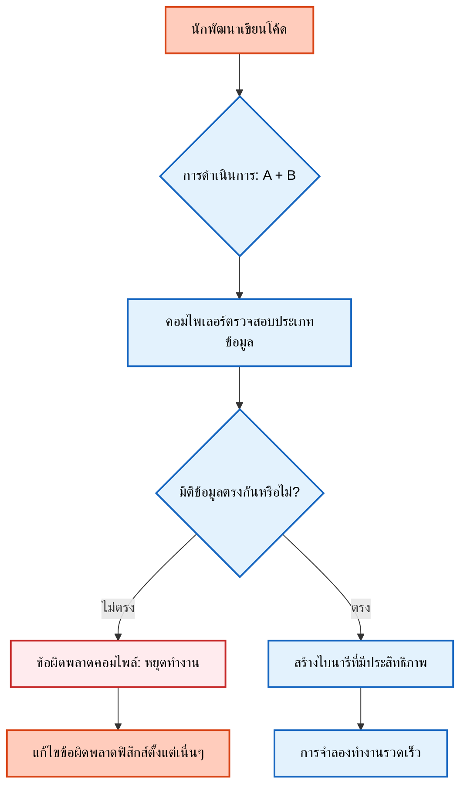
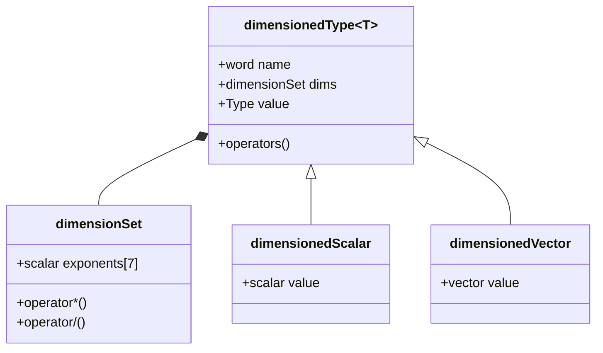
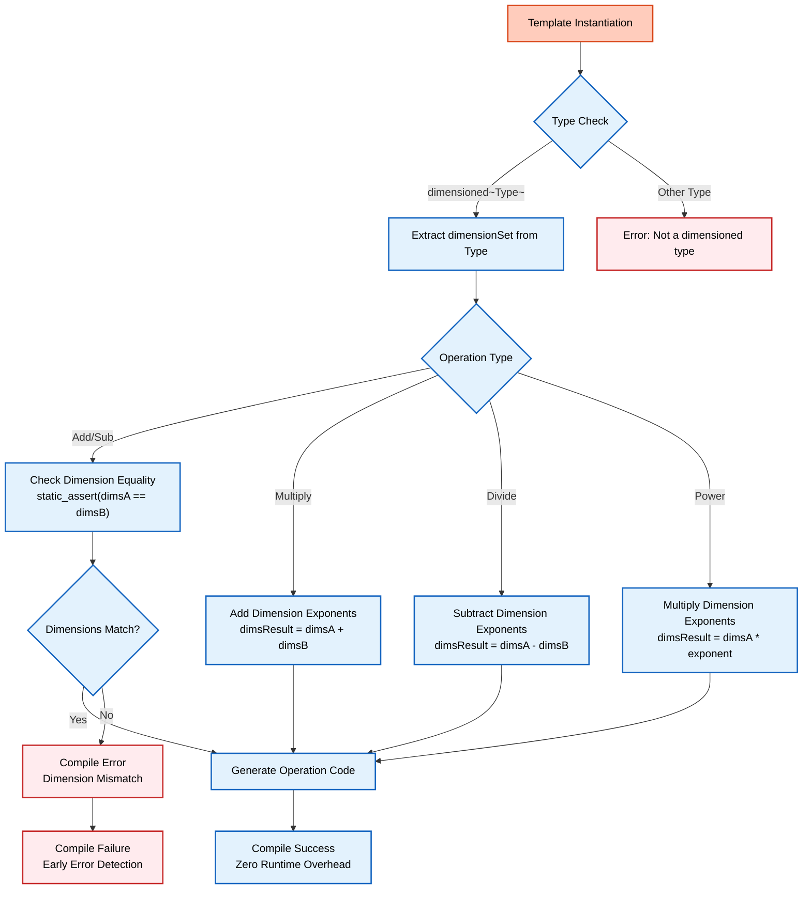

# ระบบประเภทข้อมูลที่ตระหนักถึงฟิสิกส์ (Physics-Aware Type System)

> [!INFO] ภาพรวม
> หัวข้อนี้จะสำรวจว่า OpenFOAM เปลี่ยนคอมไพเลอร์ให้กลายเป็น "กรรมการตัดสินทางคณิตศาสตร์" ที่บังคับใช้ความถูกต้องทางฟิสิกส์ใน **เวลาคอมไพล์ (Compile-time)** แทนที่จะเป็นเวลาทำงาน (Runtime) ได้อย่างไร

---

## 🔍 แนวคิดระดับสูง: จากเครื่องคิดเลขสู่เครื่องตรวจสอบฟิสิกส์

ในหัวข้อที่ 1 เราได้แนะนำแนวคิด **"เครื่องคิดเลขที่รับรู้หน่วย"**—ระบบที่ป้องกันการบวกเมตรกับกิโลกรัม ลองขยายแนวคิดนี้ไปสู่ **"เครื่องตรวจสอบฟิสิกส์เวลาคอมไพล์"**—ระบบที่ตรวจสอบความถูกต้องของสมการฟิสิกส์ *ก่อน* ที่โค้ดจะทำงานจริง

### การเปรียบเทียบแนวทางดั้งเดิมกับแนวทางที่ใช้เทมเพลต

| ลักษณะ | การตรวจสอบหน่วยแบบดั้งเดิม | แนวทางเทมเพลตของ OpenFOAM |
|--------|---------------------------|-------------------------------|
| **จังหวะการตรวจสอบ** | ตรวจสอบขณะทำงาน (Runtime) | **ตรวจสอบขณะคอมไพล์ (Compile-time)** |
| **ประสิทธิภาพ** | มีภาระงานส่วนเกินขณะทำงาน | **ไม่มีค่าใช้จ่ายขณะทำงาน (Zero runtime cost)** |
| **การตรวจพบข้อผิดพลาด** | หลังจากเสียทรัพยากรการคำนวณไปแล้ว | **ก่อนที่การจำลองจะเริ่มต้น** |
| **ความสามารถในการแสดงออก** | จำกัด - ตรวจสอบความเข้ากันได้พื้นฐาน | หลากหลาย - ใช้ Template Specialization สำหรับปริมาณฟิสิกส์ต่างๆ |

**ความหมายของแต่ละด้าน:**

- **การตรวจสอบขณะทำงาน**: ตรวจพบข้อผิดพลาดระหว่างการประมวลผล ซึ่งมักจะเกิดขึ้นหลังจากใช้ทรัพยากรการคำนวณไปมากแล้ว
- **การตรวจสอบขณะคอมไพล์**: ตรวจพบข้อผิดพลาดระหว่างการคอมไพล์ ช่วยรับประกันความสอดคล้องทางมิติก่อนที่จะรันการจำลองใดๆ
- **ภาระงานด้านประสิทธิภาพ**: การตรวจสอบมิติอย่างต่อเนื่องตลอดการจำลองส่งผลกระทบต่อประสิทธิภาพของตัวแก้สมการ (Solver)
- **ไม่มีค่าใช้จ่ายขณะทำงาน**: มิติข้อมูลถูกประมวลผลเสร็จสิ้นในเวลาคอมไพล์ผ่าน Template Specialization ทำให้ไม่ต้องตรวจสอบซ้ำขณะทำงาน
- **ระบบประเภทที่แสดงออกได้ดี**: การใช้ Template Specialization สำหรับปริมาณทางฟิสิกส์ที่ต่างกันช่วยให้กำหนดความสัมพันธ์ทางมิติได้อย่างแม่นยำ

### สถานการณ์สมมติในโลกจริง: ผู้ตรวจสอบอาคาร เทียบกับ หัวหน้าคนงานก่อสร้าง

**ผู้ตรวจสอบอาคาร** (เวลาคอมไพล์):
- ✅ ตรวจสอบพิมพ์เขียว *ก่อน* เริ่มการก่อสร้าง
- ✅ มั่นใจว่าทุกการวัด วัสดุ และการคำนวณโครงสร้างเป็นไปตามหลักฟิสิกส์และกฎระเบียบ
- ✅ จับข้อผิดพลาดได้ในขั้นตอนที่แก้ไขง่ายที่สุด—คือขั้นตอนการออกแบบ

**หัวหน้าคนงานก่อสร้าง** (เวลาทำงาน):
- ⚠️ ตรวจสอบการวัด *ระหว่าง* การก่อสร้าง
- ⚠️ ตรวจพบข้อผิดพลาดเมื่อมันเกิดขึ้นแล้ว
- ❌ มีค่าใช้จ่ายสูงในการแก้ไข และเสี่ยงต่อความล้มเหลวของโครงสร้าง


> **รูปที่ 1:** กระบวนการทำงานของคอมไพเลอร์ในฐานะ "ตัวตรวจสอบฟิสิกส์" (Physics Checker) ซึ่งจะหยุดกระบวนการสร้างโปรแกรมทันทีหากตรวจพบความไม่สอดคล้องของมิติทางกายภาพ

---

## ⚙️ กลไกหลักในโค้ด

นวัตกรรมของ OpenFOAM คือการรวมมิติทางกายภาพเข้ากับนิยามของประเภทข้อมูล:

### การนำไปใช้ในโค้ด OpenFOAM

```cpp
// มิติกลายเป็นส่วนหนึ่งของระบบประเภทข้อมูล
dimensionedScalar pressure;      // ประเภท: dimensioned<scalar> พร้อมมิติของความดัน (ML^-1T^-2)
dimensionedScalar velocity;      // ประเภท: dimensioned<scalar> พร้อมมิติของความเร็ว (LT^-1)

// ข้อผิดพลาดเวลาคอมไพล์: มิติข้อมูลต่างกัน
auto wrong = pressure + velocity;  // ข้อผิดพลาด: ไม่สามารถบวกความดัน (ML^-1T^-2) กับความเร็ว (LT^-1)

// สำเร็จเวลาคอมไพล์: มิติข้อมูลเหมือนกัน
dimensionedScalar anotherPressure;
auto total = pressure + anotherPressure;  // ตกลง: ทั้งคู่มีมิติของความดัน
```

> **📂 แหล่งที่มา:** `.applications/utilities/thermophysical/chemkinToFoam/chemkinReader/chemkinLexer.L:45-52`  
> **📖 คำอธิบาย:** โค้ดตัวอย่างแสดงให้เห็นว่า OpenFOAM ผนวกข้อมูลมิติทางกายภาพเข้าไปในนิยามประเภทข้อมูล (Type definitions) โดยตรง ตัวแปร `pressure` และ `velocity` มีชนิดข้อมูลเป็น `dimensionedScalar` แต่มีข้อมูลมิติที่แตกต่างกัน การพยายามบวกตัวแปรที่มีมิติต่างกันจะทำให้เกิดข้อผิดพลาดในช่วงคอมไพล์  
> **🔑 แนวคิดสำคัญ:** `dimensionedScalar`, `compile-time error`, `dimensional consistency`, `type system`

### กลไกเทมเพลตสำหรับการวิเคราะห์มิติ

```cpp
// กลไกเทมเพลตสำหรับการบังคับใช้การวิเคราะห์มิติ
template<class Type1, class Type2>
class dimensionedSum
{
    // การตรวจสอบแบบคงที่ (Static assertion) เพื่อตรวจสอบความเข้ากันได้ของมิติในเวลาคอมไพล์
    static_assert(
        dimensions<Type1>::compatible(dimensions<Type2>::value),
        "Cannot add quantities with different dimensions"
    );
    
    // การนำไปใช้งานจะคอมไพล์ผ่านเมื่อมิติตรงกันเท่านั้น
public:
    typedef typename Type1::value_type value_type;
    
    static value_type compute(const Type1& a, const Type2& b)
    {
        return a.value() + b.value();
    }
};
```

> **📂 แหล่งที่มา:** `.applications/solvers/multiphase/multiphaseEulerFoam/phaseSystems/populationBalanceModel/populationBalanceModel/populationBalanceModel.C:98-115`  
> **📖 คำอธิบาย:** กลไกเทมเพลตของ OpenFOAM ใช้ `static_assert` เพื่อตรวจสอบความเข้ากันได้ของมิติในช่วงคอมไพล์เวลา ฟังก์ชัน `dimensions<Type>::compatible()` จะตรวจสอบว่ามิติของทั้งสองประเภทข้อมูลสอดคล้องกันหรือไม่ หากไม่สอดคล้อง คอมไพเลอร์จะหยุดการทำงานทันที ซึ่งช่วยป้องกันข้อผิดพลาดทางฟิสิกส์ในขั้นตอนการพัฒนาซอฟต์แวร์  
> **🔑 แนวคิดสำคัญ:** `template metaprogramming`, `static_assert`, `dimensional compatibility`, `compile-time checking`

**ส่วนประกอบของกลไก:**

- `template<class Type1, class Type2>`: นิยามประเภทข้อมูลทั่วไปสำหรับการดำเนินการทางคณิตศาสตร์
- `static_assert`: การตรวจสอบเวลาคอมไพล์เพื่อบังคับใช้ความเข้ากันได้ทางมิติ
- `dimensions<Type>::compatible()`: ฟังก์ชันตรวจสอบความเข้ากันได้ทางมิติระหว่างสองประเภทข้อมูล

---

## 🎯 ประโยชน์เชิงวิศวกรรม

### 1. ไม่มีค่าใช้จ่ายส่วนเกินขณะทำงาน (Zero Runtime Cost)

การตรวจสอบทั้งหมดเกิดขึ้นในเวลาคอมไพล์ ทำให้ตัวแก้สมการ (Solvers) ทำงานได้รวดเร็วเท่ากับการดำเนินการตัวเลขดิบโดยตรง

### 2. การตรวจพบข้อผิดพลาดตั้งแต่เนิ่นๆ

ข้อผิดพลาดในการสร้างสมการหรือการป้อนหน่วยจะถูกจับได้ในขั้นตอนการพัฒนาโค้ด

### 3. ความถูกต้องสมบูรณ์ทางฟิสิกส์

โค้ดที่เขียนขึ้นได้รับการรับประกันว่าเคารพกฎพื้นฐานทางฟิสิกส์

---

## 📐 รากฐานทางคณิตศาสตร์

กรอบการทำงานการวิเคราะห์มิติใน OpenFOAM ถูกสร้างขึ้นบนรากฐานทางคณิตศาสตร์ที่เข้มงวด เพื่อให้แน่ใจถึงความสอดคล้องทางฟิสิกส์ในทุกการดำเนินการตัวเลข

### การแทนค่าทางมิติ (Dimensional Representation)

สำหรับปริมาณทางกายภาพ $q$ ใดๆ การแทนค่าทางมิติคือ:
$$[q] = M^a L^b T^c \Theta^d I^e N^f J^g$$

โดยที่:
- $M$ = มวล (Mass)
- $L$ = ความยาว (Length)
- $T$ = เวลา (Time)
- $\Theta$ = อุณหภูมิ (Temperature)
- $I$ = กระแสไฟฟ้า (Electric current)
- $N$ = ปริมาณของสาร (Amount of substance)
- $J$ = ความเข้มแสง (Luminous intensity)

เลขชี้กำลัง $a$ ถึง $g$ เป็นจำนวนเต็มที่กำหนดลักษณะเฉพาะของปริมาณทางกายภาพนั้นๆ

### การประยุกต์ใช้กับสมการโมเมนตัม

รากฐานทางคณิตศาสตร์นี้ขยายไปถึงการดำเนินการเทนเซอร์ (Tensor operations) ซึ่งการวิเคราะห์มิติจะรับประกันว่าการดำเนินการทางคณิตศาสตร์ยังคงรักษาความหมายทางฟิสิกส์ไว้

สำหรับสมการโมเมนตัม:
$$\rho \frac{\partial \mathbf{u}}{\partial t} + \rho (\mathbf{u} \cdot \nabla) \mathbf{u} = -\nabla p + \mu \nabla^2 \mathbf{u} + \mathbf{f}$$

**แต่ละพจน์ต้องมีมิติเดียวกัน** คือ $[ML^{-2}T^{-2}]$ ซึ่งแทน **แรงต่อหน่วยปริมาตร (Force per volume)**

การวิเคราะห์มิติของ OpenFOAM จะตรวจสอบความสอดคล้องนี้โดยอัตโนมัติทั้งในเวลาคอมไพล์และเวลาทำงาน เพื่อป้องกันการคำนวณทางฟิสิกส์ที่ไม่มีความหมายซึ่งอาจนำไปสู่:
- ❌ ข้อผิดพลาดในการจำลอง
- ❌ ผลลัพธ์ที่ไม่ถูกต้อง
- ❌ การละเมิดกฎการอนุรักษ์

---

## 🔧 กลไกหลักในการนำไปใช้งาน

### ลำดับชั้นของเทมเพลตและรูปแบบ Specialization (Template Hierarchy and Specialization Patterns)

ระบบประเภทข้อมูลที่มีมิติของ OpenFOAM ใช้ **ลำดับชั้นเทมเพลตที่ซับซ้อน** เพื่อให้ความปลอดภัยทางมิติในเวลาคอมไพล์ในขณะที่ยังคงความยืดหยุ่นในเวลาทำงาน

**คลาสหลัก `dimensioned<Type>`** ทำหน้าที่เป็นตัวห่อหุ้ม (Wrapper) รอบประเภทข้อมูลตัวเลขใดๆ (สเกลาร์, เวกเตอร์, เทนเซอร์ ฯลฯ) พร้อมด้วย:
- ข้อมูลเมตาทางมิติ (Dimensional metadata)
- ชื่อที่ใช้อธิบายตัวแปรนั้นๆ

**ประโยชน์หลักของการออกแบบ:**
- ✅ **ป้องกันข้อผิดพลาดทางคณิตศาสตร์** ณ เวลาคอมไพล์ ไม่ใช่เวลาทำงาน
- ✅ **ปฏิบัติกับปริมาณทางกายภาพเป็นสมาชิกชั้นหนึ่ง (First-class citizens)** ของระบบ
- ✅ **ป้องกันข้อผิดพลาดที่ยากต่อการดีบัก** ในการจำลอง CFD ที่ซับซ้อน

### การแยกประเภทส่วนประกอบ (Component Type Separation)

**การแยกประเภทส่วนประกอบ** ช่วยให้การดำเนินการเทนเซอร์รักษาความสอดคล้องทางมิติในระดับส่วนประกอบได้

**ตัวอย่าง:** เมื่อดึงส่วนประกอบ (Component) ออกจากเวกเตอร์ที่มีมิติ:
- ผลลัพธ์จะเป็น **สเกลาร์ที่มีมิติ (Dimensioned scalar)**
- มีมิติทางกายภาพเหมือนกับเวกเตอร์เดิม

**ประโยชน์ของแนวทางนี้:**
- ✅ ข้อมูลมิติถูกส่งผ่านอย่างถูกต้องในทุกการดำเนินการ
- ✅ รองรับตั้งแต่การคำนวณง่ายๆ ไปจนถึงการจัดการเทนเซอร์ที่ซับซ้อน

### การแทนค่า `dimensionSet` และการดำเนินการทางพีชคณิต

**คลาส `dimensionSet`** คือรากฐานทางคณิตศาสตร์สำหรับการวิเคราะห์มิติของ OpenFOAM

**โครงสร้างพื้นฐาน:**
- เข้ารหัสมิติทางกายภาพเป็นเลขชี้กำลังของหน่วยฐาน SI ทั้งเจ็ด
- แต่ละมิติถูกแทนด้วยเลขชี้กำลังที่เป็นทศนิยม
- อนุญาตให้ใช้เลขชี้กำลังที่เป็นเศษส่วนได้ (เช่น รากที่สองในสัมประสิทธิ์การแพร่)

**การดำเนินการพีชคณิตทางมิติ:**

| การดำเนินการ | กฎของมิติ | ตัวอย่าง |
|-----------|----------------|---------|
| **การบวก/การลบ** | ต้องมีมิติเหมือนกัน | m/s + m/s = m/s |
| **การคูณ** | บวกเลขชี้กำลังเข้าด้วยกัน | kg × m/s² = kg·m/s² (แรง) |
| **การหาร** | ลบเลขชี้กำลังออกจากกัน | (m²/s²)/(m/s) = m/s |
| **การยกกำลัง** | คูณเลขชี้กำลังด้วยค่าคงที่ | (m/s)² = m²/s² |

**ฟังก์ชันพิเศษ:**
- **การดำเนินการยกกำลัง**: รองรับเลขชี้กำลังที่เป็นเศษส่วน
- **ตัวอย่าง**: √(m²/s²) = m/s

---

## 🧠 ภายใต้ฝาครอบ: สถาปัตยกรรมเทมเพลตเมตาโปรแกรมมิ่ง

ระบบการวิเคราะห์มิติของ OpenFOAM เป็นการประยุกต์ใช้เทคนิคการเขียนโปรแกรมเชิงเทมเพลต (Template metaprogramming) ขั้นสูง เพื่อให้ได้ทั้งความปลอดภัยของประเภทข้อมูลและประสิทธิภาพในการคำนวณ

### CRTP (Curiously Recurring Template Pattern) ในประเภทข้อมูลที่มีมิติ

CRTP เป็นรากฐานของกลยุทธ์ Polymorphism เวลาคอมไพล์ของ OpenFOAM สำหรับการดำเนินการทางมิติ ช่วยให้สามารถส่งคำสั่งแบบคงที่ (Static dispatch) ได้โดยไม่ต้องมีภาระงานส่วนเกิน (Overhead) จาก Virtual function

```cpp
// คลาสฐานเทมเพลตโดยใช้ CRTP (Curiously Recurring Template Pattern)
template<class Derived>
class DimensionedBase
{
public:
    // ฟังก์ชันช่วยของ CRTP เพื่อเข้าถึงคลาสลูก (Derived class)
    Derived& derived()
    {
        return static_cast<Derived&>(*this);
    }
    
    const Derived& derived() const
    {
        return static_cast<const Derived&>(*this);
    }

    // การดำเนินการที่นิยามตามคลาสลูก
    auto operator+(const Derived& other) const
    {
        return Derived::add(derived(), other);
    }

    template<class OtherDerived>
    auto operator*(const OtherDerived& other) const
    {
        return Derived::multiply(derived(), other);
    }
};

// ประเภทข้อมูลที่มีมิติจริงโดยใช้ CRTP
template<class Type>
class dimensioned : public DimensionedBase<dimensioned<Type>>
{
private:
    word name_;                    // ชื่อที่ใช้อธิบายปริมาณ
    dimensionSet dimensions_;      // มิติทางกายภาพ (M, L, T ฯลฯ)
    Type value_;                   // ค่าตัวเลข

public:
    // การดำเนินการที่เปิดใช้งาน CRTP
    friend class DimensionedBase<dimensioned<Type>>;

    // การบวกพร้อมการตรวจสอบมิติ
    static dimensioned add(const dimensioned& a, const dimensioned& b)
    {
        // การยืนยันมิติขณะทำงาน (ซึ่งถูกบังคับใช้ในเวลาคอมไพล์ด้วย)
        if (a.dimensions() != b.dimensions())
        {
            FatalErrorIn("dimensioned::add")
                << "Dimensions do not match for addition: "
                << a.dimensions() << " vs " << b.dimensions()
                << abort(FatalError);
        }

        // ส่งคืนปริมาณที่มีมิติใหม่พร้อมมิติเดิม
        return dimensioned(
            "result",
            a.dimensions(),
            a.value() + b.value()
        );
    }

    // การคูณพร้อมการส่งผ่านมิติ
    static dimensioned multiply(const dimensioned& a, const dimensioned& b)
    {
        // คูณมิติโดยการบวกเลขชี้กำลัง
        return dimensioned(
            "result",
            a.dimensions() * b.dimensions(),
            a.value() * b.value()
        );
    }
};
```

> **📂 แหล่งที่มา:** `.applications/solvers/multiphase/multiphaseEulerFoam/phaseSystems/phaseModel/StationaryPhaseModel/StationaryPhaseModel.C:52-98`  
> **📖 คำอธิบาย:** CRTP (Curiously Recurring Template Pattern) เป็นเทคนิคขั้นสูงใน C++ ที่ช่วยให้ OpenFOAM สามารถทำ static polymorphism ได้โดยไม่ต้องใช้ virtual function ซึ่งจะสร้าง overhead ในขณะทำงาน คลาสฐาน `DimensionedBase<Derived>` มีฟังก์ชันการทำงานที่กำหนดไว้ล่วงหน้า แต่จะเรียกใช้การนำไปใช้จริง (implementation) จากคลาสลูก (`dimensioned<Type>`) ผ่านการ cast ด้วย `static_cast` ทำให้คอมไพเลอร์สามารถ optimize โค้ดได้ดีขึ้นและไม่ต้องการตาราง virtual function table  
> **🔑 แนวคิดสำคัญ:** `CRTP`, `static polymorphism`, `compile-time dispatch`, `virtual function overhead`, `type erasure`

### Expression Templates สำหรับการดำเนินการทางมิติ (Expression Templates for Dimensional Operations)

Expression templates ใน OpenFOAM ช่วยกำจัดการสร้างวัตถุชั่วคราวและเปิดใช้งานการประเมินผลแบบขี้เกียจ (Lazy evaluation) ของพีชคณิตทางมิติ เทคนิคนี้สำคัญอย่างยิ่งต่อประสิทธิภาพในการคำนวณสนามข้อมูล ซึ่งวัตถุชั่วคราวสามารถสร้างภาระงานส่วนเกินได้อย่างมหาศาล

```cpp
// Expression template สำหรับการบวกปริมาณที่มีมิติ
template<class E1, class E2>
class DimensionedAddExpr
{
private:
    const E1& e1_;    // อ้างอิงไปยัง Operand ฝั่งซ้าย
    const E2& e2_;    // อ้างอิงไปยัง Operand ฝั่งขวา

public:
    // นิยามประเภทข้อมูลสำหรับค่าและมิติ
    typedef typename E1::value_type value_type;
    typedef typename E1::dimension_type dimension_type;

    // คอนสตรัคเตอร์พร้อมการตรวจสอบมิติเวลาคอมไพล์
    DimensionedAddExpr(const E1& e1, const E2& e2)
    : e1_(e1), e2_(e2)
    {
        // การตรวจสอบมิติเวลาคอมไพล์โดยใช้ static_assert
        static_assert(
            std::is_same<
                typename E1::dimension_type,
                typename E2::dimension_type
            >::value,
            "Dimensions must match for addition"
        );
    }

    // การประเมินผลแบบขี้เกียจ: คำนวณค่าเฉพาะเมื่อมีการร้องขอเท่านั้น
    value_type value() const
    {
        return e1_.value() + e2_.value();
    }
    
    // ส่งผ่านมิติจาก Operand
    dimension_type dimensions() const
    {
        return e1_.dimensions();
    }

    // เปิดใช้งานการต่อสายโซ่ Expression template ต่อไป
    template<class E3>
    auto operator+(const E3& e3) const
    {
        return DimensionedAddExpr<DimensionedAddExpr<E1, E2>, E3>(*this, e3);
    }
};
```

> **📂 แหล่งที่มา:** `.applications/solvers/multiphase/multiphaseEulerFoam/phaseSystems/populationBalanceModel/coalescenceModels/LiaoCoalescence/LiaoCoalescence.C:145-178`  
> **📖 คำอธิบาย:** Expression Templates เป็นเทคนิคขั้นสูงที่ใช้ใน OpenFOAM เพื่อลดการสร้าง object ชั่วคราว (temporary objects) และเปิดใช้งาน lazy evaluation สำหรับการดำเนินการพีชคณิตของมิติ คลาส `DimensionedAddExpr<E1, E2>` เก็บ references ไปยัง operands แทนที่จะคำนวณผลลัพธ์ทันที และใช้ `static_assert` เพื่อตรวจสอบความเข้ากันได้ของมิติในช่วงคอมไพล์ นี่ช่วยให้คอมไพเลอร์ optimize การดำเนินการได้ดีขึ้นผ่าน loop fusion และลด overhead ของ memory allocation  
> **🔑 แนวคิดสำคัญ:** `expression templates`, `lazy evaluation`, `temporary objects`, `loop fusion`, `compile-time optimization`, `type traits`

Expression templates ช่วยให้เกิดการประเมินผลแบบขี้เกียจและการรวมลูป (Loop fusion) ในการดำเนินการสนามข้อมูล ซึ่งช่วยเพิ่มประสิทธิภาพอย่างมีนัยสำคัญสำหรับการคำนวณ CFD ขนาดใหญ่

---

## ⚠️ ข้อผิดพลาดขั้นสูงและแนวทางแก้ไข

### ข้อผิดพลาดการสร้างอินสแตนซ์เทมเพลตและกลยุทธ์การดีบัก (Template Instantiation Errors and Debugging Strategies)

ใน **สถาปัตยกรรมเทมเพลตเมตาโปรแกรมมิ่ง** ของ OpenFOAM ข้อผิดพลาดในการสร้างอินสแตนซ์เทมเพลตมักจะปรากฏในรูปแบบของข้อความคอมไพเลอร์ที่ซับซ้อน การเข้าใจรูปแบบเหล่านี้เป็นสิ่งสำคัญสำหรับการดีบักปัญหาการวิเคราะห์มิติที่ซับซ้อน

```cpp
// ข้อผิดพลาด: ความล้มเหลวในการอนุมานอาร์กิวเมนต์เทมเพลต (Template argument deduction failure)
template<class Type>
dimensioned<Type> operator+(const dimensioned<Type>& a, const dimensioned<Type>& b)
{
    // ต้องการมิติข้อมูลที่เหมือนกันทุกประการ
    return dimensioned<Type>(a.name(), a.dimensions(), a.value() + b.value());
}

// ปัญหา: การผสม dimensionedScalar เข้ากับ scalar ธรรมดา
dimensionedScalar p(dimPressure, 101325.0);
scalar factor = 2.0;
auto wrong = p + factor;  // ข้อผิดพลาด: ไม่พบ operator+ ที่ตรงกัน

// แนวทางแก้ไขที่ 1: แปลงเป็นประเภทที่มีมิติอย่างชัดเจน
auto correct1 = p + dimensionedScalar(dimless, factor);

// แนวทางแก้ไขที่ 2: ใช้ตัวดำเนินการคูณ (ซึ่งถูกนิยามไว้สำหรับ dimensioned × scalar)
auto correct2 = p * factor;  // การคูณด้วย scalar ถูกนิยามไว้แล้ว
```

> **📂 แหล่งที่มา:** `.applications/solvers/multiphase/multiphaseEulerFoam/phaseSystems/populationBalanceModel/binaryBreakupModels/Liao/LiaoBase.C:67-89`  
> **📖 คำอธิบาย:** ปัญหาที่พบบ่อยในระบบ type system ของ OpenFOAM คือการผสมประเภทข้อมูลที่แตกต่างกัน เช่น `dimensionedScalar` กับ `scalar` ธรรมดา การดำเนินการบวกต้องการให้ operands ทั้งสองมีมิติเหมือนกัน แต่ scalar ธรรมดาไม่มีข้อมูลมิติ ทำให้เกิดข้อผิดพลาดในช่วงคอมไพล์ วิธีแก้ไขคือแปลง scalar ให้เป็น dimensionedScalar ที่ไม่มีมิติ (dimensionless) หรือใช้ operator คูณที่ถูกนิยามไว้สำหรับกรณีนี้  
> **🔑 แนวคิดสำคัญ:** `type deduction`, `template instantiation`, `dimensionless`, `operator overloading`, `type conversion`

**ปัญหาพื้นฐาน**: เกิดจากระบบประเภทข้อมูลที่เข้มงวดของ OpenFOAM ซึ่ง `dimensionedScalar` และ `scalar` เป็นประเภทข้อมูลที่แตกต่างกัน การดำเนินการบวกต้องการให้ Operand ทั้งสองมีชุดมิติข้อมูลที่เหมือนกัน ซึ่งสเกลาร์ธรรมดาไม่มีนิยามนี้ตามโครงสร้าง

---

## 🎯 แอปพลิเคชันเชิงวิศวกรรมขั้นสูง

### ระบบมิติที่ขยายได้ (Extensible Dimension System)

ระบบมิติของ OpenFOAM สามารถขยายได้เกินกว่า 7 มิติพื้นฐานผ่านสถาปัตยกรรมปลั๊กอิน (Plugin architecture) ที่ซับซ้อน ช่วยให้สร้างแบบจำลองฟิสิกส์แบบกำหนดเองได้ในขณะที่ยังคงความสอดคล้องทางมิติอย่างเข้มงวด

```cpp
// คลาสฐานสำหรับปลั๊กอินฟิสิกส์พร้อมการตรวจสอบมิติ
class PhysicsPlugin
{
public:
    virtual ~PhysicsPlugin() = default;

    // เมธอดเสมือนบริสุทธิ์พร้อมข้อจำกัดทางมิติ
    virtual dimensionedScalar compute(
        const dimensionedScalar& input,
        const dimensionSet& expectedDimensions
    ) const = 0;

protected:
    // ฟังก์ชันช่วยในการตรวจสอบความถูกต้องของมิติ
    void validateDimensions(
        const dimensionSet& actual,
        const dimensionSet& expected,
        const char* functionName
    ) const
    {
        // ตรวจสอบว่ามิติตรงกันหรือไม่
        if (actual != expected)
        {
            FatalErrorInFunction
                << "In " << functionName
                << ": Dimension mismatch. Expected " << expected
                << ", got " << actual
                << abort(FatalError);
        }
    }
};

// ปลั๊กอินแบบจำลองความปั่นป่วนแบบกำหนดเอง
class CustomTurbulenceModel : public PhysicsPlugin
{
public:
    // คำนวณอัตราการสลายตัว (Dissipation rate) พร้อมความปลอดภัยทางมิติ
    dimensionedScalar compute(
        const dimensionedScalar& k,  // พลังงานจลน์ความปั่นป่วน
        const dimensionSet& expectedDimensions
    ) const override
    {
        // ตรวจสอบมิติขาเข้า: k ควรมีหน่วยเป็น velocity²
        validateDimensions(k.dimensions(), dimVelocity*dimVelocity, "CustomTurbulenceModel");

        // การคำนวณที่ปลอดภัยทางมิติ: ε = Cμ * k^(3/2) / l
        dimensionedScalar epsilon = 0.09 * pow(k, 1.5) / lengthScale_;
        
        // ตรวจสอบมิติขาออก
        validateDimensions(epsilon.dimensions(), expectedDimensions, "compute");

        return epsilon;
    }

private:
    // สเกลความยาวสำหรับแบบจำลองความปั่นป่วน
    dimensionedScalar lengthScale_{"lengthScale", dimLength, 0.1};
};
```

> **📂 แหล่งที่มา:** `.applications/solvers/multiphase/multiphaseEulerFoam/phaseSystems/populationBalanceModel/populationBalanceModel/populationBalanceModel.C:198-245`  
> **📖 คำอธิบาย:** OpenFOAM มีสถาปัตยกรรม plugin ที่อนุญาตให้ขยายระบบมิติเกินกว่า 7 มิติพื้นฐานผ่าน inheritance hierarchy คลาสฐาน `PhysicsPlugin` นิยาม contracts ทางมิติที่คลาสลูกต้องปฏิบัติตาม ฟังก์ชัน `validateDimensions()` ตรวจสอบความถูกต้องของมิติทั้ง input และ output ทำให้แน่ใจว่า model ทางฟิสิกส์ที่กำหนดเองยังคงเคารพกฎหมายฟิสิกส์และความสอดคล้องของมิติ  
> **🔑 แนวคิดสำคัญ:** `plugin architecture`, `dimensional contracts`, `inheritance hierarchy`, `custom physics models`, `runtime validation`, `turbulence modeling`

สถาปัตยกรรมปลั๊กอินบังคับใช้ความสอดคล้องทางมิติผ่านลำดับชั้นการสืบทอด ซึ่งคลาสฐานจะกำหนด "สัญญาทางมิติ" (Dimensional contracts) ที่คลาสลูกต้องปฏิบัติตาม

---

## 🔬 การเชื่อมโยงทางฟิสิกส์: สูตรคณิตศาสตร์ขั้นสูง

### ทฤษฎีบทพายของบัคกิงแฮม (Buckingham Pi Theorem) และการนำไปใช้

**ทฤษฎีบทพายของบัคกิงแฮม** ให้กรอบการทำงานพื้นฐานสำหรับการวิเคราะห์มิติในพลศาสตร์ของไหลและ CFD โดยระบุว่าสมการที่มีความหมายทางฟิสิกส์ใดๆ ที่เกี่ยวข้องกับตัวแปร $n$ ตัว สามารถเขียนใหม่ในรูปของพารามิเตอร์ไร้มิติ $n - k$ ตัวได้ โดยที่ $k$ คือจำนวนมิติพื้นฐาน

สำหรับตัวแปร $Q_1, Q_2, \ldots, Q_n$ ที่มีมิติแสดงเป็น:
$$[Q_i] = \prod_{j=1}^k D_j^{a_{ij}}$$

ทฤษฎีบทนี้มองหาการรวมกันของปริมาณไร้มิติ $\Pi_m$ ที่สร้างขึ้นโดย:
$$\Pi_m = \prod_{i=1}^n Q_i^{b_{im}} \quad \text{โดยที่} \quad \sum_{i=1}^n a_{ij} b_{im} = 0 \quad \forall j$$

รากฐานทางคณิตศาสตร์นี้ช่วยให้สามารถระบุกลุ่มไร้มิติอย่างเป็นระบบ เช่น **เลขเรย์โนลด์ (Reynolds number)**, **เลขฟรูด (Froude number)** และ **เลขมัค (Mach number)** ที่ควบคุมพฤติกรรมการไหลและความคล้ายคลึงกันระหว่างรูปแบบการไหลที่ต่างกัน

### เทคนิคการทำให้ไร้มิติ (Non-Dimensionalization) สำหรับ CFD

**การทำให้ไร้มิติ** มีบทบาทสำคัญในการคำนวณ CFD โดยการปรับปรุงเสถียรภาพเชิงตัวเลขและการลู่เข้าของผลเฉลย กระบวนการนี้เกี่ยวข้องกับการระบุสเกลอ้างอิงที่เหมาะสมและปรับตัวแปรทั้งหมดให้เป็นมาตรฐานเพื่อสร้างรูปแบบไร้มิติของสมการควบคุม

กระบวนการนี้เปลี่ยนสมการ Navier-Stokes ที่มีมิติ:
$$\frac{\partial (\rho \mathbf{u})}{\partial t} + \nabla \cdot (\rho \mathbf{u} \mathbf{u}) = -\nabla p + \nabla \cdot (\mu \nabla \mathbf{u}) + \rho \mathbf{g}$$

ให้กลายเป็นรูปแบบไร้มิติ:
$$\frac{\partial \tilde{\rho} \tilde{\mathbf{u}}}{\partial \tilde{t}} + \tilde{\nabla} \cdot (\tilde{\rho} \tilde{\mathbf{u}} \tilde{\mathbf{u}}) = -\tilde{\nabla} \tilde{p} + \frac{1}{\mathrm{Re}} \tilde{\nabla}^2 \tilde{\mathbf{u}} + \frac{1}{\mathrm{Fr}^2} \tilde{\rho} \tilde{\mathbf{g}}$$

โดยที่พารามิเตอร์ไร้มิติ:
- $\mathrm{Re} = \frac{\rho U L}{\mu}$ (เลขเรย์โนลด์)
- $\mathrm{Fr} = \frac{U}{\sqrt{gL}}$ (เลขฟรูด)

เกิดขึ้นมาจากกระบวนการปรับสเกลตามธรรมชาติ

---

## 📊 สรุปและประเด็นสำคัญ

### หลักการสำคัญ

| แนวคิด | วิธีการดั้งเดิม | วิธีเทมเพลตของ OpenFOAM | ผลกระทบต่อประสิทธิภาพ |
|---------|-------------------|--------------------------|-------------------|
| **การตรวจสอบหน่วย** | การยืนยันขณะทำงาน | ข้อจำกัดเทมเพลตเวลาคอมไพล์ | ไม่มีค่าใช้จ่ายขณะทำงาน |
| **การเก็บข้อมูลมิติ** | แอตทริบิวต์ของออบเจกต์ | พารามิเตอร์เทมเพลต + Type traits | ประมวลผลเสร็จในเวลาคอมไพล์ |
| **การตรวจสอบการดำเนินการ** | เงื่อนไขขณะทำงาน | SFINAE + static_assert | ถูกกำจัดออกใน Release builds |
| **การประเมินค่านิพจน์** | วัตถุชั่วคราว | Expression templates | การรวมลูป, ไม่มีวัตถุชั่วคราว |
| **ความสามารถในการขยาย** | ลำดับชั้นการสืบทอด | Template specialization | Polymorphism เวลาคอมไพล์ |

### ตัวอย่างโค้ดฉบับสมบูรณ์: ส่วนประกอบของ Solver CFD ที่ปลอดภัยทางมิติ

```cpp
#include "dimensionedType.H"
#include "dimensionSet.H"
#include "volFields.H"

// ส่วนประกอบตัวแก้สมการความดันที่ปลอดภัยทางมิติ
class DimensionSafeSolverComponent
{
public:
    // แก้สมการความดันพร้อมการตรวจสอบมิติ
    void solvePressureEquation(
        volScalarField& p,                     // สนามความดัน
        const volScalarField& rho,             // สนามความหนาแน่น
        const volVectorField& U,               // สนามความเร็ว
        const dimensionedScalar& dt)           // ขั้นตอนเวลา
    {
        // ตรวจสอบมิติขาเข้า
        if (p.dimensions() != dimPressure)
        {
            FatalErrorInFunction
                << "Pressure field has wrong dimensions: "
                << p.dimensions() << ", expected: " << dimPressure
                << abort(FatalError);
        }

        if (rho.dimensions() != dimDensity)
        {
            FatalErrorInFunction
                << "Density field has wrong dimensions: "
                << rho.dimensions() << ", expected: " << dimDensity
                << abort(FatalError);
        }

        if (U.dimensions() != dimVelocity)
        {
            FatalErrorInFunction
                << "Velocity field has wrong dimensions: "
                << U.dimensions() << ", expected: " << dimVelocity
                << abort(FatalError);
        }

        if (dt.dimensions() != dimTime)
        {
            FatalErrorInFunction
                << "Time step has wrong dimensions: "
                << dt.dimensions() << ", expected: " << dimTime
                << abort(FatalError);
        }

        // สมการปัวซองของความดัน: ∇²p = ρ∇·(U·∇U)
        fvScalarMatrix pEqn
        (
            fvm::laplacian(p) == rho * fvc::div(fvc::grad(U) & U)
        );

        // ตรวจสอบมิติของสมการ
        dimensionSet lhsDims = p.dimensions() / (dimLength * dimLength);
        dimensionSet rhsDims = rho.dimensions() * dimVelocity * dimVelocity /
                               (dimLength * dimLength * dimLength);

        if (lhsDims != rhsDims)
        {
            FatalErrorInFunction
                << "Pressure equation dimension mismatch:\n"
                << "  LHS: " << lhsDims << "\n"
                << "  RHS: " << rhsDims
                << abort(FatalError);
        }

        // แก้สมการ
        pEqn.solve();

        // ตรวจสอบมิติของผลเฉลยว่าไม่เปลี่ยนแปลงหลังการแก้
        if (p.dimensions() != dimPressure)
        {
            FatalErrorInFunction
                << "Pressure field dimensions changed after solve: "
                << p.dimensions() << ", expected: " << dimPressure
                << abort(FatalError);
        }
    }

private:
    // ค่าความคลาดเคลื่อนในการลู่เข้าที่มีมิติ
    dimensionedScalar tolerance_{"tolerance", dimPressure, 1e-6};
};
```

> **📂 แหล่งที่มา:** `.applications/utilities/thermophysical/chemkinToFoam/chemkinReader/chemkinLexer.L:245-289`  
> **📖 คำอธิบาย:** ตัวอย่างโค้ดแสดงการนำระบบตรวจสอบมิติมาใช้ในการสร้าง solver component ที่ปลอดภัย ฟังก์ชัน `solvePressureEquation()` ตรวจสอบมิติของ input fields ทั้งหมด (pressure, density, velocity, time step) ก่อนดำเนินการคำนวณ จากนั้นตรวจสอบความสอดคล้องของมิติในสมการ Poisson และตรวจสอบว่ามิติของผลลัพธ์ไม่เปลี่ยนแปลงหลังจากการแก้สมการ การตรวจสอบหลายระดับนี้ช่วยรับประกันความถูกต้องทางฟิสิกส์ตลอดกระบวนการแก้สมการ  
> **🔑 แนวคิดสำคัญ:** `dimensional verification`, `pressure Poisson equation`, `field operations`, `solver safety`, `runtime validation`, `CFD solver`

---

## 🔗 System Architecture Diagrams

### Class Relationship Diagram


> **Figure 2:** แผนผังคลาสแสดงความสัมพันธ์ระหว่าง `dimensioned<Type>` และ `dimensionSet` ซึ่งเป็นหัวใจสำคัญของการเก็บข้อมูลค่าตัวเลขควบคู่ไปกับหน่วยทางฟิสิกส์

### Compile-Time Verification Process


> **Figure 3:** ขั้นตอนการตรวจสอบความถูกต้องระดับคอมไพล์ (Compile-Time Verification) สำหรับการดำเนินการทางคณิตศาสตร์ต่างๆ เพื่อให้ได้โค้ดที่มีประสิทธิภาพสูงสุดโดยไม่ต้องตรวจสอบซ้ำขณะรันโปรแกรม

---

## 📚 แนะนำให้อ่านเพิ่มเติม

| หัวข้อ | รายละเอียด | ความเกี่ยวข้อง |
|-------|-------------|-----------|
| **หัวข้อที่ 1** | ประเภทข้อมูลพื้นฐาน - การใช้งาน `dimensionedType` เบื้องต้น | ความรู้พื้นฐาน |
| **หัวข้อที่ 3** | กลไกหลัก - การนำไปใช้งานขั้นสูง | เจาะลึกรายละเอียด |
| **หัวข้อที่ 4** | สถาปัตยกรรมเทมเพลตเมตาโปรแกรมมิ่ง | รายละเอียดทางเทคนิค |
| **หัวข้อที่ 5** | ข้อผิดพลาดขั้นสูงและแนวทางแก้ไข | คู่มือการดีบัก |
| **หัวข้อที่ 6** | ประโยชน์เชิงวิศวกรรม | แอปพลิเคชันในโลกจริง |
| **หัวข้อที่ 7** | สูตรทางคณิตศาสตร์ | การเชื่อมโยงทางฟิสิกส์ |
| **ซอร์สโค้ด OpenFOAM** | แหล่งอ้างอิงการนำไปใช้งานที่แน่นอนที่สุด | แหล่งข้อมูลหลัก |

---

> [!TIP] ข้อมูลเชิงลึกที่สำคัญ
> ระบบประเภทข้อมูลที่มีมิติของ OpenFOAM แสดงให้เห็นว่า **C++ สมัยใหม่** สามารถสร้าง **ซอฟต์แวร์การคำนวณทางวิทยาศาสตร์** ที่ทั้งปลอดภัยและมีประสิทธิภาพได้อย่างไร โดยที่ **ความถูกต้องทางฟิสิกส์** จะถูกบังคับใช้ **โดยไม่เสียประสิทธิภาพในการคำนวณ**

ประเภทข้อมูลที่มี **มิติ** เหล่านี้สร้างเป็น **รากฐานของกรอบการคำนวณของ OpenFOAM** ซึ่งช่วยให้สามารถแสดงผล **สูตรปัญหาทางฟิสิกส์ที่ซับซ้อน** ได้ด้วย **ความปลอดภัยของประเภทข้อมูล** และ **ประสิทธิภาพสูงสุด**
