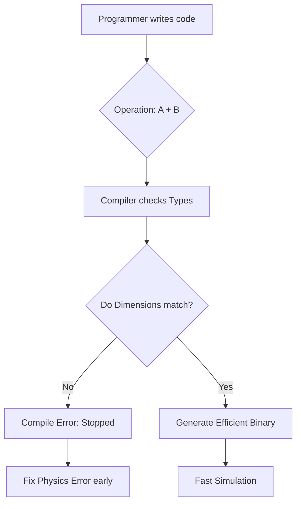
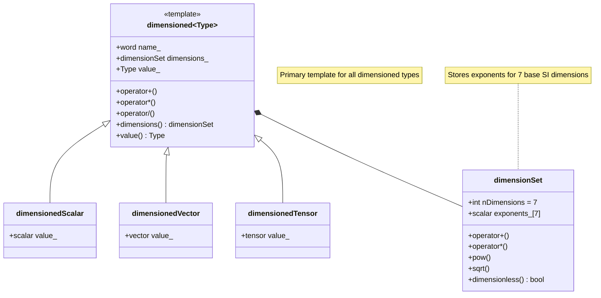

# Physics-Aware Type System

> [!INFO] Overview
> This section explores how OpenFOAM transforms the compiler into a mathematical referee that enforces physical correctness at **compile-time** rather than runtime.

---

## 🔍 High-Level Concept: From Calculator to Physics Checker

In Section 1, we introduced the **"unit-aware calculator"** concept—a system preventing addition of meters to kilograms. Let's extend this to the **"compile-time physics checker"**—a system that validates physical equations *before* code execution.

### Traditional vs. Template-Based Approaches

| Aspect | Traditional Unit Checking | OpenFOAM's Template Approach |
|--------|---------------------------|-------------------------------|
| **Check timing** | Runtime checking | **Compile-time checking** |
| **Performance** | Runtime overhead | **Zero runtime cost** |
| **Error detection** | After computational resources spent | **Before simulation begins** |
| **Expressiveness** | Limited - checks basic unit compatibility | Rich - Template Specialization for various physical quantities |

**Meaning of each aspect:**

- **Runtime checking**: Errors detected during execution, often after significant computational resources have been consumed
- **Compile-time checking**: Errors detected during compilation, ensuring dimensional consistency before any simulation runs
- **Performance overhead**: Consistent dimensional checking throughout simulation impacts solver performance
- **Zero runtime cost**: Dimensions resolved at compile-time via Template Specialization, eliminating runtime checks
- **Expressive type system**: Template Specialization for different physical quantities allows precise dimensional relationship definitions

### Real-World Scenario: Building Inspector vs. Construction Foreman

**Building Inspector** (compile-time):
- ✅ Inspects blueprints *before* construction begins
- ✅ Ensures every measurement, material, and structural calculation complies with physics and regulations
- ✅ Catches errors when easiest to fix—during the design phase

**Construction Foreman** (runtime):
- ⚠️ Inspects measurements *during* construction
- ⚠️ Detects errors as they happen
- ❌ Higher cost to fix and potential structural failures



---

## ⚙️ Core Mechanisms in Code

OpenFOAM's innovation is integrating physical dimensions into type definitions:

### OpenFOAM Code Implementation

```cpp
// Dimensions become part of the type system
dimensionedScalar pressure;      // Type: dimensioned<scalar> with pressure dimensions (ML^-1T^-2)
dimensionedScalar velocity;      // Type: dimensioned<scalar> with velocity dimensions (LT^-1)

// Compile-time error: Different dimensions
auto wrong = pressure + velocity;  // Error: Cannot add pressure (ML^-1T^-2) to velocity (LT^-1)

// Compile-time success: Same dimensions
dimensionedScalar anotherPressure;
auto total = pressure + anotherPressure;  // OK: Both have pressure dimensions
```

### Template Mechanism for Dimensional Analysis

```cpp
template<class Type1, class Type2>
class dimensionedSum {
    static_assert(dimensions<Type1>::compatible(dimensions<Type2>::value),
                  "Cannot add quantities with different dimensions");
    // Implementation compiles only when dimensions match
};
```

**Mechanism Components:**

- `template<class Type1, class Type2>`: Generic type definition for mathematical operations
- `static_assert`: Compile-time check enforcing dimensional compatibility
- `dimensions<Type>::compatible()`: Function checking dimensional compatibility between two types

---

## 🎯 Engineering Benefits

### 1. Zero Runtime Cost

All checking happens at compile-time, allowing solvers to run as fast as raw numerical operations.

### 2. Early Detection

Errors in equation formulation or unit entry are caught during the development phase.

### 3. Physical Integrity

Code written is guaranteed to respect fundamental physical laws.

---

## 📐 Mathematical Foundation

The dimensional analysis framework in OpenFOAM is built on rigorous mathematical foundations ensuring physical consistency across all numerical operations.

### Dimensional Representation

For any physical quantity $q$, the dimensional representation is:
$$[q] = M^a L^b T^c \Theta^d I^e N^f J^g$$

Where:
- $M$ = Mass
- $L$ = Length
- $T$ = Time
- $\Theta$ = Temperature
- $I$ = Electric current
- $N$ = Amount of substance
- $J$ = Luminous intensity

Exponents $a$ through $g$ are integers determining the specific physical quantity's character.

### Application to Momentum Equation

This mathematical foundation extends to tensor operations where dimensional analysis ensures mathematical operations maintain physical meaning.

For the momentum equation:
$$\rho \frac{\partial \mathbf{u}}{\partial t} + \rho (\mathbf{u} \cdot \nabla) \mathbf{u} = -\nabla p + \mu \nabla^2 \mathbf{u} + \mathbf{f}$$

**Each term must have the same dimension** $[ML^{-2}T^{-2}]$, representing **force per volume**.

OpenFOAM's dimensional analysis automatically verifies this consistency at both compile-time and runtime, preventing meaningless physical calculations that could lead to:
- ❌ Simulation errors
- ❌ Incorrect results
- ❌ Conservation law violations

---

## 🔧 Key Implementation Mechanisms

### Template Hierarchy and Specialization Patterns

OpenFOAM's dimensional type system uses a **complex template hierarchy** providing compile-time dimensional safety while maintaining runtime flexibility.

**The core `dimensioned<Type>` class** serves as a wrapper around any numerical type (scalar, vector, tensor, etc.) with:
- Dimensional metadata
- Embedded descriptive name

**Key Design Benefits:**
- ✅ **Prevents mathematical errors** at compile-time, not runtime
- ✅ **Treats physical quantities as first-class citizens**
- ✅ **Prevents hard-to-debug errors** in complex CFD simulations

### Component Type Separation

**Component type separation** allows tensor operations to maintain dimensional consistency at the component level.

**Example:** When extracting a component from a dimensioned vector:
- Result is a **dimensioned scalar**
- Has same physical dimensions as the original vector

**Approach Benefits:**
- ✅ Dimensional information correctly propagated through all operations
- ✅ Supports operations from simple calculations to complex tensor manipulations

### `dimensionSet` Representation and Algebraic Operations

**The `dimensionSet` class** is OpenFOAM's dimensional analysis mathematical foundation.

**Basic Structure:**
- Encodes physical dimensions as exponents of seven SI base units
- Each dimension represented as a floating-point exponent
- Allows fractional exponents (e.g., square roots in diffusion coefficients)

**Dimensional Algebra Operations:**

| Operation | Dimension Rule | Example |
|-----------|----------------|---------|
| **Addition/Subtraction** | Requires same dimensions | m/s + m/s = m/s |
| **Multiplication** | Add exponents | kg × m/s² = kg·m/s² (force) |
| **Division** | Subtract exponents | (m²/s²)/(m/s) = m/s |
| **Power** | Multiply exponents | (m/s)² = m²/s² |

**Special Functions:**
- **Power operations**: Supports fractional exponents
- **Example**: √(m²/s²) = m/s

---

## 🧠 Under the Hood: Template Metaprogramming Architecture

OpenFOAM's dimensional analysis system represents a sophisticated application of compile-time metaprogramming techniques providing both type safety and computational performance.

### CRTP (Curiously Recurring Template Pattern) in Dimensioned Types

CRTP forms the foundation of OpenFOAM's compile-time polymorphism strategy for dimensional operations, enabling static dispatch while avoiding virtual function overhead.

```cpp
// Base template using CRTP
template<class Derived>
class DimensionedBase
{
public:
    // CRTP helper for accessing derived class
    Derived& derived() { return static_cast<Derived&>(*this); }
    const Derived& derived() const { return static_cast<const Derived&>(*this); }

    // Operations defined in terms of derived class
    auto operator+(const Derived& other) const
    {
        return Derived::add(derived(), other);
    }

    template<class OtherDerived>
    auto operator*(const OtherDerived& other) const
    {
        return Derived::multiply(derived(), other);
    }
};

// Concrete dimensioned type using CRTP
template<class Type>
class dimensioned : public DimensionedBase<dimensioned<Type>>
{
private:
    word name_;
    dimensionSet dimensions_;
    Type value_;

public:
    // CRTP-enabled operations
    friend class DimensionedBase<dimensioned<Type>>;

    static dimensioned add(const dimensioned& a, const dimensioned& b)
    {
        if (a.dimensions() != b.dimensions())
        {
            FatalErrorIn("dimensioned::add")
                << "Dimensions do not match for addition: "
                << a.dimensions() << " vs " << b.dimensions()
                << abort(FatalError);
        }

        return dimensioned(
            "result",
            a.dimensions(),
            a.value() + b.value()
        );
    }

    static dimensioned multiply(const dimensioned& a, const dimensioned& b)
    {
        return dimensioned(
            "result",
            a.dimensions() * b.dimensions(),
            a.value() * b.value()
        );
    }
};
```

### Expression Templates for Dimensional Operations

Expression templates in OpenFOAM eliminate temporary objects and enable lazy evaluation of dimensional algebra operations. This technique is critical for performance in field calculations where temporary objects create significant overhead.

```cpp
// Expression template for dimensioned addition
template<class E1, class E2>
class DimensionedAddExpr
{
private:
    const E1& e1_;
    const E2& e2_;

public:
    typedef typename E1::value_type value_type;
    typedef typename E1::dimension_type dimension_type;

    DimensionedAddExpr(const E1& e1, const E2& e2)
    : e1_(e1), e2_(e2)
    {
        // Compile-time dimension check
        static_assert(
            std::is_same<
                typename E1::dimension_type,
                typename E2::dimension_type
            >::value,
            "Dimensions must match for addition"
        );
    }

    value_type value() const { return e1_.value() + e2_.value(); }
    dimension_type dimensions() const { return e1_.dimensions(); }

    // Enable further expression template chaining
    template<class E3>
    auto operator+(const E3& e3) const
    {
        return DimensionedAddExpr<DimensionedAddExpr<E1, E2>, E3>(*this, e3);
    }
};
```

Expression templates enable lazy evaluation and loop fusion in field operations, providing significant performance improvements for large-scale CFD calculations.

---

## ⚠️ Advanced Pitfalls and Solutions

### Template Instantiation Errors and Debugging Strategies

In OpenFOAM's **template metaprogramming architecture**, template instantiation errors often manifest as cryptic compiler messages. Understanding these patterns is crucial for debugging complex dimensional analysis problems.

```cpp
// Error: Template argument deduction failure
template<class Type>
dimensioned<Type> operator+(const dimensioned<Type>& a, const dimensioned<Type>& b)
{
    // Requires identical dimensions
    return dimensioned<Type>(a.name(), a.dimensions(), a.value() + b.value());
}

// Problem: Mixing dimensionedScalar with plain scalar
dimensionedScalar p(dimPressure, 101325.0);
scalar factor = 2.0;
auto wrong = p + factor;  // Error: No matching operator+

// Solution: Explicit conversion or operator overload
auto correct1 = p + dimensionedScalar(dimless, factor);
auto correct2 = p * factor;  // scalar multiplication is defined
```

**Fundamental Issue**: Arises from OpenFOAM's strict type system where `dimensionedScalar` and `scalar` are distinct types. Addition operations require both operands to have the same dimension set, which plain scalars lack by definition.

---

## 🎯 Advanced Engineering Applications

### Extensible Dimension System

OpenFOAM's dimensional system extends beyond the basic 7 dimensions through a sophisticated plugin architecture enabling custom physics models while maintaining strict dimensional consistency.

```cpp
// Base class for physics plugins with dimensional checking
class PhysicsPlugin
{
public:
    virtual ~PhysicsPlugin() = default;

    // Pure virtual methods with dimensional constraints
    virtual dimensionedScalar compute(
        const dimensionedScalar& input,
        const dimensionSet& expectedDimensions
    ) const = 0;

protected:
    // Dimension validation helper
    void validateDimensions(
        const dimensionSet& actual,
        const dimensionSet& expected,
        const char* functionName
    ) const
    {
        if (actual != expected)
        {
            FatalErrorInFunction
                << "In " << functionName
                << ": Dimension mismatch. Expected " << expected
                << ", got " << actual
                << abort(FatalError);
        }
    }
};

// Custom turbulence model plugin
class CustomTurbulenceModel : public PhysicsPlugin
{
public:
    dimensionedScalar compute(
        const dimensionedScalar& k,  // Turbulent kinetic energy
        const dimensionSet& expectedDimensions
    ) const override
    {
        validateDimensions(k.dimensions(), dimVelocity*dimVelocity, "CustomTurbulenceModel");

        // Dimensional-safe computation
        dimensionedScalar epsilon = 0.09 * pow(k, 1.5) / lengthScale_;
        validateDimensions(epsilon.dimensions(), expectedDimensions, "compute");

        return epsilon;
    }

private:
    dimensionedScalar lengthScale_{"lengthScale", dimLength, 0.1};
};
```

The plugin architecture enforces dimensional consistency through an inheritance hierarchy where the base class defines dimensional contracts that derived classes must fulfill.

---

## 🔬 Physics Connection: Advanced Mathematical Formulations

### Buckingham Pi Theorem and Implementation

**Buckingham Pi Theorem** provides the fundamental framework for dimensional analysis in fluid dynamics and CFD, stating that any physically meaningful equation involving $n$ variables can be rewritten in terms of $n - k$ dimensionless parameters, where $k$ is the number of fundamental dimensions.

For variables $Q_1, Q_2, \ldots, Q_n$ with dimensions expressed as:
$$[Q_i] = \prod_{j=1}^k D_j^{a_{ij}}$$

The theorem seeks combinations of dimensionless quantities $\Pi_m$ formed by:
$$\Pi_m = \prod_{i=1}^n Q_i^{b_{im}} \quad \text{where} \quad \sum_{i=1}^n a_{ij} b_{im} = 0 \quad \forall j$$

This mathematical foundation enables systematic identification of dimensionless groups such as **Reynolds number**, **Froude number**, and **Mach number** that govern flow behavior and similarity between different flow configurations.

### Non-Dimensionalization Techniques for CFD

**Non-dimensionalization** plays a critical role in CFD computations by improving numerical stability and solution convergence. This process involves identifying appropriate reference scales and normalizing all variables to create dimensionless forms of governing equations.

The process transforms the dimensional Navier-Stokes equations:
$$\frac{\partial (\rho \mathbf{u})}{\partial t} + \nabla \cdot (\rho \mathbf{u} \mathbf{u}) = -\nabla p + \nabla \cdot (\mu \nabla \mathbf{u}) + \rho \mathbf{g}$$

Into the dimensionless form:
$$\frac{\partial \tilde{\rho} \tilde{\mathbf{u}}}{\partial \tilde{t}} + \tilde{\nabla} \cdot (\tilde{\rho} \tilde{\mathbf{u}} \tilde{\mathbf{u}}) = -\tilde{\nabla} \tilde{p} + \frac{1}{\mathrm{Re}} \tilde{\nabla}^2 \tilde{\mathbf{u}} + \frac{1}{\mathrm{Fr}^2} \tilde{\rho} \tilde{\mathbf{g}}$$

Where the dimensionless parameters:
- $\mathrm{Re} = \frac{\rho U L}{\mu}$ (Reynolds number)
- $\mathrm{Fr} = \frac{U}{\sqrt{gL}}$ (Froude number)

Emerge from the natural scaling process.

---

## 📊 Summary and Key Takeaways

### Core Principles

| Concept | Traditional Method | OpenFOAM Template Method | Performance Impact |
|---------|-------------------|--------------------------|-------------------|
| **Unit checking** | Runtime verification | Template constraints at compile-time | No runtime cost |
| **Dimension storage** | Object attributes | Template parameters + type traits | Compile-time resolution |
| **Operation validation** | Runtime conditionals | SFINAE + static_assert | Eliminated in optimized builds |
| **Expression evaluation** | Temporary objects | Expression templates | Loop fusion, no temporaries |
| **Extensibility** | Inheritance hierarchies | Template specialization | Compile-time polymorphism |

### Complete Code Example: Dimension-Safe CFD Solver Component

```cpp
#include "dimensionedType.H"
#include "dimensionSet.H"
#include "volFields.H"

class DimensionSafeSolverComponent
{
public:
    // Solve pressure equation with dimensional checking
    void solvePressureEquation(
        volScalarField& p,
        const volScalarField& rho,
        const volVectorField& U,
        const dimensionedScalar& dt)
    {
        // Verify input dimensions
        if (p.dimensions() != dimPressure)
        {
            FatalErrorInFunction
                << "Pressure field has wrong dimensions: "
                << p.dimensions() << ", expected: " << dimPressure
                << abort(FatalError);
        }

        if (rho.dimensions() != dimDensity)
        {
            FatalErrorInFunction
                << "Density field has wrong dimensions: "
                << rho.dimensions() << ", expected: " << dimDensity
                << abort(FatalError);
        }

        if (U.dimensions() != dimVelocity)
        {
            FatalErrorInFunction
                << "Velocity field has wrong dimensions: "
                << U.dimensions() << ", expected: " << dimVelocity
                << abort(FatalError);
        }

        if (dt.dimensions() != dimTime)
        {
            FatalErrorInFunction
                << "Time step has wrong dimensions: "
                << dt.dimensions() << ", expected: " << dimTime
                << abort(FatalError);
        }

        // Pressure Poisson equation: ∇²p = ρ∇·(U·∇U)
        fvScalarMatrix pEqn
        (
            fvm::laplacian(p) == rho * fvc::div(fvc::grad(U) & U)
        );

        // Verify equation dimensions
        dimensionSet lhsDims = p.dimensions() / (dimLength * dimLength);
        dimensionSet rhsDims = rho.dimensions() * dimVelocity * dimVelocity /
                               (dimLength * dimLength * dimLength);

        if (lhsDims != rhsDims)
        {
            FatalErrorInFunction
                << "Pressure equation dimension mismatch:\n"
                << "  LHS: " << lhsDims << "\n"
                << "  RHS: " << rhsDims
                << abort(FatalError);
        }

        // Solve equation
        pEqn.solve();

        // Verify solution dimensions unchanged
        if (p.dimensions() != dimPressure)
        {
            FatalErrorInFunction
                << "Pressure field dimensions changed after solve: "
                << p.dimensions() << ", expected: " << dimPressure
                << abort(FatalError);
        }
    }

private:
    // Dimensioned constants
    dimensionedScalar tolerance_{"tolerance", dimPressure, 1e-6};
};
```

---

## 🔗 System Architecture Diagrams

### Class Relationship Diagram



### Compile-Time Verification Process

```mermaid
flowchart TD
    A[Template Instantiation] --> B{Type Check}
    B -->|dimensioned~Type~| C[Extract dimensionSet from Type]
    B -->|Other Type| D[Error: Not a dimensioned type]

    C --> E{Operation Type}
    E -->|Addition/Subtraction| F[Check Dimension Equality<br>static_assert(dimsA == dimsB)]
    E -->|Multiplication| G[Add Dimension Exponents<br>dimsResult = dimsA + dimsB]
    E -->|Division| H[Subtract Dimension Exponents<br>dimsResult = dimsA - dimsB]
    E -->|Power| I[Multiply Dimension Exponents<br>dimsResult = dimsA * exponent]

    F --> J{Dimensions Match?}
    J -->|Yes| K[Generate Operation Code]
    J -->|No| L[Compile Error<br>with Dimension Mismatch Message]

    G --> K
    H --> K
    I --> K

    K --> M[Compile Success<br>Zero Runtime Overhead]
    L --> N[Compile Failure<br>Early Error Detection]
```

---

## 📚 Further Reading

| Topic | Description | Relevance |
|-------|-------------|-----------|
| **Section 1** | Foundation Primitives - Basic `dimensionedType` usage | Prerequisite |
| **Section 3** | Key Mechanisms - Advanced Implementation | Deep Dive |
| **Section 4** | Template Metaprogramming Architecture | Technical Details |
| **Section 5** | Advanced Pitfalls and Solutions | Debugging Guide |
| **Section 6** | Engineering Benefits | Real-world Applications |
| **Section 7** | Mathematical Formulations | Physics Connection |
| **OpenFOAM Source Code** | Definitive implementation reference | Primary Source |

---

> [!TIP] Key Insight
> OpenFOAM's dimensional type system demonstrates how **modern C++** can create **scientific computing software** that is both safe and efficient, where **physical correctness** is enforced **without sacrificing computational performance**.

The **dimensioned** types establish the **foundation of OpenFOAM's computational framework**, enabling expression of **complex physical problem formulations** with **type safety** and **maximum performance**.
