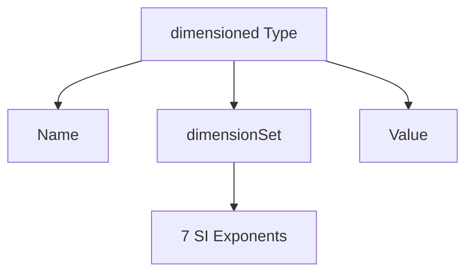

# Physics-Aware Type System

ระบบประเภทที่รับรู้ฟิสิกส์

---

## Overview

> OpenFOAM type system encodes **physical meaning** not just data type

---

## 1. Beyond Numeric Types

### Traditional Approach

```cpp
double pressure = 101325;    // Pa? bar? psi? Unknown!
double velocity = 10;        // m/s? km/h? Unknown!
double result = pressure + velocity;  // Compiles! But meaningless.
```

### OpenFOAM Approach

```cpp
dimensionedScalar p("p", dimPressure, 101325);      // Pa
dimensionedScalar U("U", dimVelocity, 10);          // m/s
// dimensionedScalar bad = p + U;  // ERROR! Physics violation
```

---

## 2. Type System Design



### Components

| Component | Purpose |
|-----------|---------|
| Name | Human-readable identifier |
| dimensionSet | Physical dimensions |
| Value | Numeric value |

---

## 3. Physical Quantities

### SI Base Dimensions

| Index | Dimension | Symbol | Unit |
|-------|-----------|--------|------|
| 0 | Mass | M | kg |
| 1 | Length | L | m |
| 2 | Time | T | s |
| 3 | Temperature | Θ | K |
| 4 | Current | I | A |
| 5 | Moles | N | mol |
| 6 | Luminous | J | cd |

---

## 4. Derived Quantities

| Quantity | Formula | dimensionSet |
|----------|---------|--------------|
| Velocity | L/T | `[0 1 -1 0 0 0 0]` |
| Acceleration | L/T² | `[0 1 -2 0 0 0 0]` |
| Force | M·L/T² | `[1 1 -2 0 0 0 0]` |
| Pressure | M/(L·T²) | `[1 -1 -2 0 0 0 0]` |
| Energy | M·L²/T² | `[1 2 -2 0 0 0 0]` |
| Power | M·L²/T³ | `[1 2 -3 0 0 0 0]` |

---

## 5. Type Checking Rules

### Addition/Subtraction

```cpp
// Dimensions MUST match
p + q;  // OK if both pressure
p + U;  // ERROR: pressure ≠ velocity
```

### Multiplication

```cpp
// Dimensions ADD
rho * U;  // [M L^-3] + [L T^-1] = [M L^-2 T^-1]
```

### Division

```cpp
// Dimensions SUBTRACT
p / rho;  // [M L^-1 T^-2] - [M L^-3] = [L² T^-2]
```

---

## 6. Dimensionless Numbers

```cpp
// Reynolds number
dimensionedScalar Re = (rho * U * L) / mu;
// [M L^-3][L T^-1][L] / [M L^-1 T^-1] = [1] = dimless

// Verification
if (!Re.dimensions().dimensionless())
{
    FatalError << "Re must be dimensionless!";
}
```

---

## 7. Fields Integration

```cpp
// Field inherits dimensions
volScalarField p
(
    IOobject(...),
    mesh,
    dimensionedScalar("p", dimPressure, 0)
);

// All operations maintain dimension checking
volScalarField dynP = 0.5 * rho * magSqr(U);  // [M L^-1 T^-2] ✓
```

---

## Quick Reference

| Rule | Effect |
|------|--------|
| a + b | dims(a) == dims(b) required |
| a * b | dims = dims(a) + dims(b) |
| a / b | dims = dims(a) - dims(b) |
| sqrt(a) | dims = dims(a) / 2 |
| pow(a, n) | dims = dims(a) × n |

---

## Concept Check

<details>
<summary><b>1. ทำไม pressure + velocity เป็น error?</b></summary>

เพราะ **ไม่มี physical meaning** — ไม่สามารถบวก Pa กับ m/s ได้
</details>

<details>
<summary><b>2. Reynolds number ต้องเป็น dimless ไหม?</b></summary>

**ใช่** — dimensionless numbers เป็น ratio, dimensions หักล้างกัน
</details>

<details>
<summary><b>3. ทำไม type system ดีกว่า comments?</b></summary>

Type system มี **compiler enforcement**, comments ไม่มี
</details>

---

## Related Documents

- **ภาพรวม:** [00_Overview.md](00_Overview.md)
- **Implementation:** [03_Implementation_Mechanisms.md](03_Implementation_Mechanisms.md)
