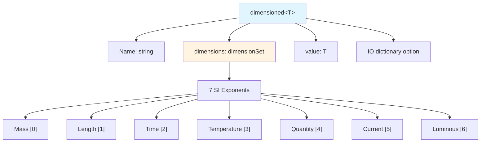
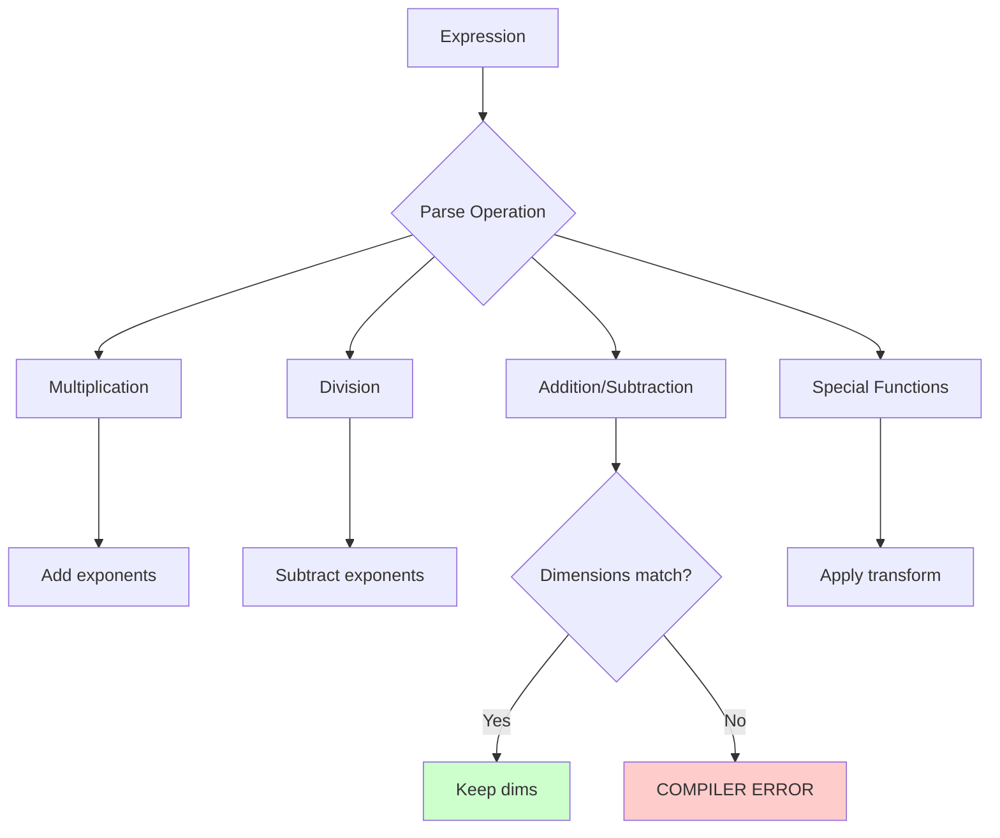
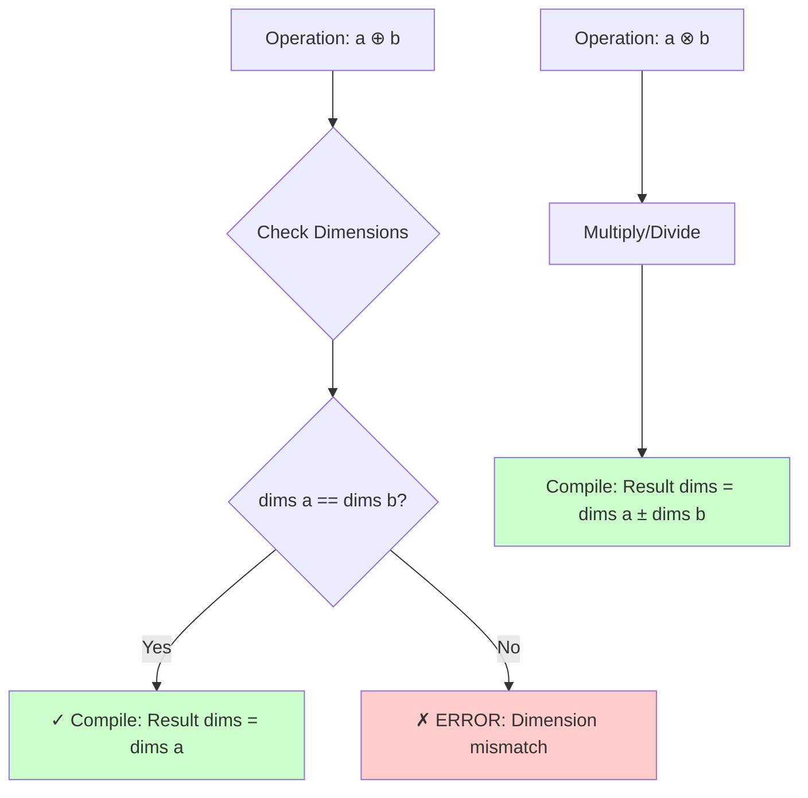

# Physics-Aware Type System

ระบบประเภทที่รับรู้ฟิสิกส์ — หัวใจของ OpenFOAM Type Safety

> **ทำไมบทนี้สำคัญ?**
> - เข้าใจว่า OpenFOAM **type system ฉลาดกว่า C++** อย่างไร
> - รู้ **rules** ของ dimension checking
> - ใช้ประโยชน์จากระบบได้เต็มที่

---

## Learning Objectives

เมื่ออ่านจบบทนี้ คุณควรจะ:
- เข้าใจความแตกต่างระหว่าง C++ primitive types กับ OpenFOAM dimensioned types
- อธิบายโครงสร้างของ 7-SI dimension set ได้
- ใช้ dimension checking rules ได้อย่างถูกต้อง
- เขียนโค้ดที่ปลอดภัยจาก dimension errors ด้วย compiler enforcement
- ตรวจสอบ dimensionless numbers และ field operations

---

## Overview

> **💡 OpenFOAM type system = C++ types + Physical Meaning**
>
> - C++: `double + double` = always OK
> - OpenFOAM: `pressure + velocity` = **ERROR!**

ระบบนี้คือการเพิ่ม semantic layer บน C++ types เพื่อตรวจสอบความถูกต้องทางฟิสิกส์ **ณ compile-time** ป้องกันการบวกลบหน่วยวัดที่ไม่สอดคล้องกัน ซึ่งเป็นแหล่งที่มาของ bugs ที่พบบ่อยใน CFD codes

---

## 1. Beyond Numeric Types

### Traditional C++ Approach

```cpp
double pressure = 101325;    // Pa? bar? psi? Unknown!
double velocity = 10;        // m/s? km/h? Unknown!
double result = pressure + velocity;  // Compiles! But meaningless.
```

**Problems:**
- ❌ No unit enforcement
- ❌ Comments are easily outdated
- ❌ Errors only surface at runtime (if caught at all)

### OpenFOAM Approach

```cpp
dimensionedScalar p("p", dimPressure, 101325);      // Pa
dimensionedScalar U("U", dimVelocity, 10);          // m/s
// dimensionedScalar bad = p + U;  // COMPILER ERROR! Physics violation
```

**Benefits:**
- ✅ Compiler enforces dimensional consistency
- ✅ Self-documenting code
- ✅ Catches errors at compile-time
- ✅ Impossible to write dimensionally incorrect operations

---

## 2. Type System Architecture

### Structure Overview



### The 7-Dimension Set

OpenFOAM ใช้ array ของ 7 SI base units เพื่อแทน physical quantities ทั้งหมด:

| Index | Property | Dimension | Unit | Symbol |
|:---:|:---|:---:|:---:|:---:|
| 0 | Mass | M | Kilogram | `kg` |
| 1 | Length | L | Meter | `m` |
| 2 | Time | T | Second | `s` |
| 3 | Temperature | Θ | Kelvin | `K` |
| 4 | Quantity | N | Mole | `mol` |
| 5 | Current | I | Ampere | `A` |
| 6 | Luminous | J | Candela | `cd` |

> **Example: Velocity (m/s)**
> - Length exponent: +1
> - Time exponent: -1
> - **Result:** `[0 1 -1 0 0 0 0]`

### DimensionSet Implementation

```cpp
// Internally represented as:
class dimensionSet
{
    FixedList<scalar, 7> exponents_;  // [M L T Θ N I J]
    
public:
    // Constructor
    dimensionSet(int M, int L, int T, int Θ, int N, int I, int J);
    
    // Common presets
    static const dimensionSet dimless;    // [0 0 0 0 0 0 0]
    static const dimensionSet dimPressure;// [1 -1 -2 0 0 0 0]
    static const dimensionSet dimVelocity; // [0 1 -1 0 0 0 0]
    // ... more presets
};
```

### Dimensional Inference Flow



---

## 3. Dimension Checking Rules

### Rule Enforcement at Compile-Time



### Addition/Subtraction: Strict Equality

```cpp
// ✅ Same dimensions: OK
dimensionedScalar p1("p1", dimPressure, 101325);
dimensionedScalar p2("p2", dimPressure, 50000);
dimensionedScalar pSum = p1 + p2;  // Result: [1 -1 -2 0 0 0 0]

// ❌ Different dimensions: COMPILER ERROR
dimensionedScalar U("U", dimVelocity, 10);
// dimensionedScalar bad = p1 + U;  // Won't compile!
```

**Enforcement:** The template metaprogramming literally prevents compilation when dimensions don't match.

### Multiplication: Add Exponents

```cpp
dimensionedScalar rho("rho", dimDensity, 1.225);     // [1 -3 0 0 0 0 0]
dimensionedScalar U("U", dimVelocity, 10);           // [0 1 -1 0 0 0 0]
dimensionedScalar momentum = rho * U;  // Mass flux

// Result dimensions: [1 -3 0] + [0 1 -1] = [1 -2 -1 0 0 0 0]
// Physical meaning: kg/(m²·s) — mass flux per unit area
```

### Division: Subtract Exponents

```cpp
dimensionedScalar p("p", dimPressure, 101325);       // [1 -1 -2 0 0 0 0]
dimensionedScalar rho("rho", dimDensity, 1.225);     // [1 -3 0 0 0 0 0]
dimensionedScalar pRho = p / rho;

// Result dimensions: [1 -1 -2] - [1 -3 0] = [0 2 -2 0 0 0 0]
// Physical meaning: m²/s² — specific energy (velocity squared)
```

### Special Operations

| Operation | Dimension Rule |
|-----------|----------------|
| `sqrt(a)` | dims = dims(a) / 2 |
| `pow(a, n)` | dims = dims(a) × n |
| `mag(a)` | Same as dims(a) |
| `sqr(a)` | dims = dims(a) × 2 |
| `transpose(a)` | Same as dims(a) |

```cpp
dimensionedScalar L("L", dimLength, 0.1);  // [0 1 0 0 0 0 0]

// Square root: halves all exponents
dimensionedScalar sqrtL = Foam::sqrt(L);  // [0 0.5 0 0 0 0 0]

// Power: multiplies all exponents
dimensionedScalar L2 = Foam::pow(L, 2);   // [0 2 0 0 0 0 0]
```

---

## 4. Common Physical Quantities

### Derived Quantities Reference

| Quantity | Formula | dimensionSet | SI Unit |
|----------|---------|--------------|---------|
| **Velocity** | L/T | `[0 1 -1 0 0 0 0]` | m/s |
| **Acceleration** | L/T² | `[0 1 -2 0 0 0 0]` | m/s² |
| **Force** | M·L/T² | `[1 1 -2 0 0 0 0]` | N (kg·m/s²) |
| **Pressure** | M/(L·T²) | `[1 -1 -2 0 0 0 0]` | Pa (N/m²) |
| **Density** | M/L³ | `[1 -3 0 0 0 0 0]` | kg/m³ |
| **Energy** | M·L²/T² | `[1 2 -2 0 0 0 0]` | J (N·m) |
| **Power** | M·L²/T³ | `[1 2 -3 0 0 0 0]` | W (J/s) |
| **Dynamic Viscosity** | M/(L·T) | `[1 -1 -1 0 0 0 0]` | Pa·s |
| **Kinematic Viscosity** | L²/T | `[0 2 -1 0 0 0 0]` | m²/s |

> 💡 **Reference:** See [00_Overview.md](00_Overview.md) for the complete SI base dimensions table and unit conversion examples.

---

## 5. Dimensionless Numbers

### The Concept

Dimensionless numbers คือ ratios ของ quantities ที่มีหน่วยหักล้างกันเหลือ `[0 0 0 0 0 0 0]`:

```cpp
// Reynolds number calculation
dimensionedScalar rho("rho", dimDensity, 1.225);      // [1 -3 0]
dimensionedScalar U("U", dimVelocity, 10);            // [0 1 -1]
dimensionedScalar L("L", dimLength, 0.1);             // [0 1 0]
dimensionedScalar mu("mu", dimViscosity, 1.8e-5);     // [1 -1 -1]

// Re = (ρ * U * L) / μ
dimensionedScalar Re = (rho * U * L) / mu;

// Dimension math: [1 -3 0] + [0 1 -1] + [0 1 0] - [1 -1 -1]
//                 = [1 -1 -1] - [1 -1 -1] = [0 0 0 0 0 0 0] ✓
```

### Runtime Verification

```cpp
// Explicit check (optional but recommended)
if (!Re.dimensions().dimensionless())
{
    FatalErrorInFunction
        << "Reynolds number must be dimensionless!" << nl
        << "Calculated dimensions: " << Re.dimensions() << abort(FatalError);
}

// Info message
Info << "Reynolds number: " << Re.value()
    << " (dimensionless: " << Re.dimensions().dimensionless() << ")" << endl;
```

### Common Dimensionless Groups

| Number | Formula | Physical Meaning |
|--------|---------|------------------|
| Reynolds | ρUL/μ | Inertia/Viscous forces |
| Prandtl | μCp/k | Momentum/Thermal diffusion |
| Mach | U/c | Flow speed/Sound speed |
| Froude | U/√(gL) | Inertia/Gravity forces |

---

## 6. Fields Integration

### GeometricField< ... > Inheritance

```cpp
// volScalarField inherits dimensions from initial value
volScalarField p
(
    IOobject
    (
        "p",
        runTime.timeName(),
        mesh,
        IOobject::MUST_READ,
        IOobject::AUTO_WRITE
    ),
    mesh,
    dimensionedScalar("p", dimPressure, 101325)  // Sets field dimensions
);

// All field operations maintain dimension checking
volScalarField T("T", mesh, dimensionSet(0 0 0 1 0 0 0), 300);  // [0 0 0 1 0 0 0]

// ✅ Dimensionally consistent
volScalarField dynP = 0.5 * rho * magSqr(U);  // Dynamic pressure
// Check: [1 -3 0] + 2*[0 1 -1] = [1 -1 -2] ✓ (Pressure dims)

// ❌ Won't compile
// volScalarField error = p + U;  // Pressure + Velocity = ERROR
```

### Boundary Conditions

```cpp
// Fixed value with dimensions
dimensionedScalar pInf("pInf", dimPressure, 101325);

// Automatically enforced at boundary
fixedValueFvPatchScalarField pBC(p.boundaryField()[patchID]);
pBC == pInf;  // Type system ensures dims match

// ❌ This would fail at runtime if dims don't match
// fixedValueFvPatchScalarField TBC(...);
// pBC == TBC;  // ERROR: Can't assign Temperature to Pressure patch
```

### Field-Field Operations

```cpp
// All arithmetic operations preserve dimension checking
volScalarField gradP = fvc::grad(p);  // [1 -1 -2] + [0 -1 0] = [1 -2 -2]
volScalarField flux = rho * U;        // [1 -3 0] + [0 1 -1] = [1 -2 -1]
volScalarField dissipation = mu * magSqr(gradU);  // Viscous dissipation

// Dimension analysis for dissipation:
// mu:      [1 -1 -1]
// gradU:   [0 0 -1] (velocity gradient)
// magSqr:  ×2 → [0 0 -2]
// Result:  [1 -1 -1] + [0 0 -2] = [1 -1 -3] = W/m³ ✓
```

---

## 7. Engineering Benefits

### Compile-Time Safety

```cpp
// Scenario: Calculating pressure drop
dimensionedScalar deltaP = pInlet - pOutlet;  // ✅ Explicit
dimensionedScalar headLoss = deltaP / (rho * g);  // ✅ Dimensionally: [L]

// ❌ Common mistake in vanilla C++:
// double headLoss = deltaP / rho;  // Missing g! Units wrong!
// In OpenFOAM, this gives [L²/T²] which type-checker flags if used as [L]
```

### Self-Documenting Code

```cpp
// Without dimension checking
void calculateForce(double* F, double* p, double* A, int n);
// What are the units? What should F contain?

// With OpenFOAM types
void calculateForce
(
    volScalarField& F,  // Force: [1 1 -2 0 0 0 0]
    const volScalarField& p,  // Pressure: [1 -1 -2 0 0 0 0]
    const volScalarField& A   // Area: [0 2 0 0 0 0 0]
);
// Function signature documents expected dimensions!
```

### Debugging Aid

```cpp
// When developing, the type system catches bugs early
volScalarField turbulentViscosity = ...;  // [1 -1 -1]

// Wrong formula
volScalarField nuEff = turbulentViscosity / rho;  // [0 2 -1] (kinematic)
// vs
volScalarField wrong = turbulentViscosity * rho;  // [2 -4 -1] ❌ nonsense!

// The type system prevents using 'wrong' in further calculations
```

---

## 8. Common Pitfalls

### Pitfall 1: Silent Dimension Creation

```cpp
// ⚠️ This compiles but may not be what you want
dimensionedScalar value(123.45);  // Default: dimless
// If you meant pressure, you should have specified:
dimensionedScalar value("value", dimPressure, 123.45);
```

### Pitfall 2: Mixing Fields and Scalars

```cpp
volScalarField pField(...);
dimensionedScalar pScalar("p", dimPressure, 101325);

// ✅ OK: Field initialized with scalar
volScalarField newP = pField + pScalar;  // Broadcasts to all cells

// ⚠️ May not be what you intended
dimensionedScalar averageP = sum(pField) / pField.size();
// This loses spatial information - becomes a single scalar
```

### Pitfall 3: Forgotten DimensionSet in IO

```cpp
// When reading from dictionary, dimensions must match
dimensionedScalar p
(
    "p",
    dimPressure,  // MUST match what's in the file!
    transportProperties
);
// If file specifies velocity dims → runtime error
```

---

## 📊 Quick Reference: Dimension Operations

| Operation | Dimension Rule | Example |
|-----------|----------------|---------|
| `a + b`, `a - b` | dims(a) == dims(b) | `p + dynP` → Pressure |
| `a * b` | dims = dims(a) + dims(b) | `ρ * U` → Mass flux |
| `a / b` | dims = dims(a) - dims(b) | `p / ρ` → Specific energy |
| `sqrt(a)` | dims = dims(a) / 2 | `√(L²/T²)` → Velocity |
| `sqr(a)` | dims = dims(a) × 2 | `U²` → L²/T² |
| `pow(a, n)` | dims = dims(a) × n | `L³` → Volume |
| `mag(a)` | Same as dims(a) | `mag(v)` → Speed |

> 💡 **Note:** See [03_Implementation_Mechanisms.md](03_Implementation_Mechanisms.md) for the complete implementation details of dimension checking in OpenFOAM's template metaprogramming architecture.

---

## 🧠 Concept Check

<details>
<summary><b>1. ทำไม pressure + velocity เป็น compilation error?</b></summary>

เพราะ **ไม่มี physical meaning** — ไม่สามารถบวก Pa [M·L⁻¹·T⁻²] กับ m/s [L·T⁻¹] ได้ หน่วยวัดไม่สอดคล้องกัน OpenFOAM type system ป้องกันการกระทำที่ไร้ความหมายทางฟิสิกส์ด้วย compiler enforcement ซึ่งเข้มข้นกว่า comments หรือ code reviews
</details>

<details>
<summary><b>2. Reynolds number ต้องเป็น dimless ไหม?</b></summary>

**ใช่** — dimensionless numbers ทั้งหมดเป็น ratios ของ quantities ที่มีหน่วยเดียวกันหรือหน่วยที่หักล้างกัน เช่น Re = (inertial forces)/(viscous forces) → dimensions หักล้างเหลือ [0 0 0 0 0 0 0] ถ้าการคำนวณได้ dim อื่น แสดงว่าสูตรผิด
</details>

<details>
<summary><b>3. ทำไม type system ดีกว่า comments/unit conventions?</b></summary>

Type system มี **compiler enforcement** — ถ้าหน่วยไม่ match จะ compile ไม่ผ่าน ส่วน comments หรือ conventions เป็นเพียง documentation ที่มนุษย์ต้องตรวจสอบเอง และอาจล้าสมัยได้ง่าย Type system ทำให้ bugs ประเภท dimension mismatch ถูกค้นพบตั้งแต่ compile-time ไม่ใช่ runtime
</details>

<details>
<summary><b>4. ถ้าฉันอยากสร้าง quantity ที่ไม่มีใน predefined dims ล่ะ?</b></summary>

ใช้ `dimensionSet` constructor โดยระบุ 7 exponents โดยตรง:
```cpp
dimensionSet customDims(1, 2, -3, 0, 0, 0, 0);  // [M L² T⁻³]
dimensionedScalar custom("custom", customDims, 42.0);
```
หรือใช้ predefined dims ผ่าน arithmetic:
```cpp
dimensionSet myDims = dimPressure * dimArea;  // Force
```
</details>

<details>
<summary><b>5. Field operations กับ scalar operations ต่างกันอย่างไร?</b></summary>

Field operations ทำงานทีละ cell ใน mesh แต่ dimension checking logic เหมือนกัน:
- `volScalarField` = field of scalars with uniform dimensions
- `dimensionedScalar` = single value with dimensions
- Operations ระหว่าง field-scalar → scalar broadcast ไปทุก cell
- Dims ต้อง match เหมือน scalar arithmetic เป๊ะๆ
</details>

---

## 📖 Cross-References

### Related Topics

| Topic | File | Description |
|-------|------|-------------|
| **Type System Overview** | [00_Overview.md](00_Overview.md) | ภาพรวม dimension types และ SI units |
| **Implementation Details** | [03_Implementation_Mechanisms.md](03_Implementation_Mechanisms.md) | Template metaprogramming ที่อยู่เบื้องหลัง |
| **Advanced Operations** | [04_Advanced_Techniques.md](04_Advanced_Techniques.md) | Special functions และ custom dimension sets |

### Learning Path

1. **Current:** Understand dimension checking rules ✅
2. **Next:** Dive into implementation mechanisms
3. **Then:** Master advanced techniques and optimization

---

## 🎯 Key Takeaways

- ✅ **OpenFOAM types** = C++ types + physical meaning (7-SI dimension sets)
- ✅ **Compiler enforces** dimensional consistency at compile-time
- ✅ **Operations follow physics:** addition requires matching dims, multiplication adds exponents
- ✅ **Dimensionless numbers** are ratios where dimensions cancel to `[0 0 0 0 0 0 0]`
- ✅ **Fields inherit** dimensions from initialization, maintaining type safety throughout calculations
- ✅ **Type system** prevents bugs, documents code, and enables compiler-checked physics

> **Bottom Line:** ระบบนี้ทำให้ CFD codes ปลอดภัยจาก unit errors — ประเภท bug ที่พบบ่อยที่สุดใน scientific computing