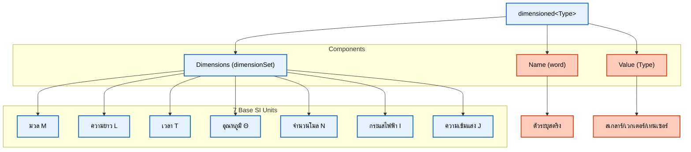

# ⚙️ กลไกการนำไปใช้งาน: สถาปัตยกรรมเทมเพลตขั้นสูง (Implementation Mechanisms: Advanced Template Architecture)

> [!INFO] ภาพรวม
> บันทึกนี้จะสำรวจ **กลไกการนำไปใช้งานขั้นสูง** ที่ช่วยเปิดใช้งานระบบการวิเคราะห์มิติในเวลาคอมไพล์ของ OpenFOAM เราจะตรวจสอบเทคนิคเทมเพลตเมตาโปรแกรมมิ่ง (Template metaprogramming), การระบุลักษณะประเภทข้อมูล (Type traits), การโอเวอร์โหลดตัวดำเนินการ (Operator overloading) และสถาปัตยกรรมที่ซับซ้อนซึ่งทำให้ความปลอดภัยทางมิติเป็นไปได้โดยไม่มีภาระงานส่วนเกินขณะทำงาน (Zero runtime overhead)

---

> [!TIP] **Physical Analogy: The Assembly Line Robots (หุ่นยนต์ในไลน์ผลิตรถยนต์)**
>
> จินตนาการถึงโรงงานผลิตรถยนต์ที่ใช้หุ่นยนต์ล้วนๆ:
>
> 1.  **Template Class (`dimensioned<Type>`)** คือ **"แม่พิมพ์อเนกประสงค์"**: ปั๊มชิ้นส่วนออกมาได้หลายแบบ (ล้อ, ประตู, เครื่องยนต์) โดยมีป้ายระบุชัดเจนติดมาด้วย
> 2.  **Expression Templates** คือ **"สายพานลำเลียงอัจฉริยะ"**: แทนที่จะหยิบชิ้นส่วนมาวางบนโต๊ะ (Create Temporary Object) แล้วค่อยหยิบไปประกอบทีละชิ้น สายพานจะเลื่อนชิ้นส่วนไปประกอบเข้าร่างทันทีที่ถึงจุดหมาย (Lazy Evaluation) ประหยัดที่วางของและเวลา
> 3.  **Compile-time Check (SFINAE/static_assert)** คือ **"เซ็นเซอร์วัดขนาดก่อนเข้าไลน์"**: ถ้าเอา "ล้อรถบรรทุก" มาใส่ "รถเก๋ง" เซ็นเซอร์จะดีดออกทันทีตั้งแต่ต้นทาง ไม่ปล่อยให้เข้าไปประกอบจนเสร็จแล้วค่อยพบว่าวิ่งไม่ได้ (Zero Runtime Overhead)

## ลำดับชั้นของคลาสเทมเพลตและการทำ Specialization

### โครงสร้างเทมเพลต `dimensioned<Type>`

ระบบประเภทข้อมูลที่มีมิติของ OpenFOAM ถูกสร้างขึ้นบน **ลำดับชั้นเทมเพลตที่ซับซ้อน** ซึ่งให้ความปลอดภัยทางมิติในเวลาคอมไพล์ในขณะที่ยังคงความยืดหยุ่นในเวลาทำงาน

**นิยามเทมเพลตหลัก:**

```cpp
// คลาสเทมเพลตสำหรับปริมาณทางกายภาพที่มีมิติ
// ผสมผสานค่าตัวเลขเข้ากับมิติทางกายภาพของปริมาณนั้นๆ
template<class Type>
class dimensioned
{
    word name_;           // ตัวระบุสำหรับปริมาณนั้นๆ
    Type value_;         // ค่าตัวเลข (สเกลาร์, เวกเตอร์, เทนเซอร์ ฯลฯ)
    dimensionSet dimensions_;  // มิติทางกายภาพ (M, L, T ฯลฯ)
    IOobject::writeOption wOpt_;  // การควบคุมการเขียนข้อมูลออก
};
```

> [!TIP] ประโยชน์ของการออกแบบ
> - ✅ **ป้องกันข้อผิดพลาดทางคณิตศาสตร์** ในเวลาคอมไพล์แทนที่จะเป็นเวลาทำงาน
> - ✅ **ปฏิบัติกับปริมาณทางกายภาพเป็นสมาชิกชั้นหนึ่ง (First-class citizens)** ของระบบ
> - ✅ **ป้องกันบั๊กที่ยากต่อการดีบัก** ในการจำลอง CFD ที่ซับซ้อน


> **รูปที่ 1:** องค์ประกอบภายในของคลาส `dimensioned<Type>` ซึ่งประกอบด้วยชื่อ มิติ และค่าตัวเลข โดยมิติจะถูกจัดเก็บในรูปของเลขชี้กำลังของหน่วยพื้นฐาน 7 ชนิดตามมาตรฐาน SI เพื่อความปลอดภัยทางฟิสิกส์ระดับคอมไพล์

### กลไกเทมเพลต Specialization

**การทำเทมเพลต Specialization** ช่วยให้ OpenFOAM สามารถ:
- ให้ส่วนต่อประสาน (Interfaces) ที่สอดคล้องกันข้ามประเภทข้อมูลทางคณิตศาสตร์ที่แตกต่างกัน
- ใช้ประโยชน์จากเทมเพลตเมตาโปรแกรมมิ่งเพื่อเพิ่มประสิทธิภาพ
- รักษาโครงสร้างที่สม่ำเสมอซึ่งประกอบด้วยชื่อปริมาณทางกายภาพ ชุดมิติ และค่าตัวเลข

**Type Traits ที่สำคัญ:**
- `is_dimensioned`: ช่วยให้ตรวจพบประเภทข้อมูลที่มีมิติได้ในเวลาคอมไพล์
- ข้อจำกัดของเทมเพลตเพื่อป้องกันการดำเนินการที่ไม่ถูกต้อง

### กลไกการแยกประเภทส่วนประกอบ (Component Type Separation Mechanism)

**การแยกประเภทส่วนประกอบ** ช่วยให้การดำเนินการเทนเซอร์ (Tensor operations) รักษาความสอดคล้องทางมิติในระดับส่วนประกอบได้

**ตัวอย่าง:** เมื่อดึงส่วนประกอบหนึ่งออกมาจากเวกเตอร์ที่มีมิติ:
- ผลลัพธ์จะเป็น **สเกลาร์ที่มีมิติ (Dimensioned scalar)**
- มีมิติทางกายภาพเหมือนกับเวกเตอร์ต้นฉบับ

**ประโยชน์ของแนวทางนี้:**
- ✅ ข้อมูลมิติจะถูกส่งผ่านอย่างถูกต้องในทุกการดำเนินการ
- ✅ รองรับตั้งแต่การคำนวณง่ายๆ ไปจนถึงการจัดการเทนเซอร์ที่ซับซ้อน

---

## การแทนค่า `dimensionSet` และการดำเนินการทางพีชคณิต

### รากฐานทางคณิตศาสตร์

**คลาส `dimensionSet`** คือรากฐานทางคณิตศาสตร์ของระบบการวิเคราะห์มิติใน OpenFOAM

**โครงสร้างพื้นฐาน:**
- เข้ารหัสมิติทางกายภาพเป็นเลขชี้กำลังของหน่วยฐาน SI ทั้งเจ็ด
- แต่ละมิติถูกแทนด้วยเลขชี้กำลังที่เป็นทศนิยม
- อนุญาตให้ใช้เลขชี้กำลังที่เป็นเศษส่วนได้ (เช่น รากที่สองในสัมประสิทธิ์การแพร่)

### การดำเนินการพีชคณิตทางมิติ

| การดำเนินการ | กฎของมิติ | ตัวอย่าง |
|-----------|----------------|---------|
| **การบวก/การลบ** | ต้องมีมิติเหมือนกันทุกประการ | m/s + m/s = m/s |
| **การคูณ** | บวกเลขชี้กำลังเข้าด้วยกัน | kg × m/s² = kg·m/s² (แรง) |
| **การหาร** | ลบเลขชี้กำลังออกจากกัน | (m²/s²)/(m/s) = m/s |
| **การยกกำลัง** | คูณเลขชี้กำลังด้วยค่าคงที่ | (m/s)² = m²/s² |

**ฟังก์ชันพิเศษ:**
- **การดำเนินการยกกำลัง**: รองรับเลขชี้กำลังที่เป็นเศษส่วน
- **ตัวอย่าง**: √(m²/s²) = m/s

### การแทนค่าทางคณิตศาสตร์

สำหรับปริมาณทางกายภาพ $q$ ใดๆ การแทนค่าทางมิติคือ:
$$[q] = M^a L^b T^c \Theta^d I^e N^f J^g$$

โดยที่:
- $M$ แทน มวล (Mass)
- $L$ แทน ความยาว (Length)
- $T$ แทน เวลา (Time)
- $\Theta$ แทน อุณหภูมิ (Temperature)
- $I$ แทน กระแสไฟฟ้า (Electric current)
- $N$ แทน ปริมาณของสาร (Amount of substance)
- $J$ แทน ความเข้มแสง (Luminous intensity)

เลขชี้กำลัง $a$ ถึง $g$ เป็นจำนวนเต็ม (หรือเศษส่วน) ที่กำหนดลักษณะทางกายภาพของปริมาณนั้นๆ

### มิติที่กำหนดไว้ล่วงหน้าใน OpenFOAM

```cpp
// มิติฐาน SI พร้อมเลขชี้กำลังสำหรับ มวล, ความยาว, เวลา, อุณหภูมิ, โมล, กระแสไฟฟ้า, ความเข้มแสง
const dimensionSet dimless(0, 0, 0, 0, 0, 0, 0);      // ปริมาณไร้มิติ
const dimensionSet dimMass(1, 0, 0, 0, 0, 0, 0);      // มวล [M]
const dimensionSet dimLength(0, 1, 0, 0, 0, 0, 0);    // ความยาว [L]
const dimensionSet dimTime(0, 0, 1, 0, 0, 0, 0);      // เวลา [T]
const dimensionSet dimTemperature(0, 0, 0, 1, 0, 0, 0); // อุณหภูมิ [Θ]

// มิติอนุพันธ์ที่ใช้บ่อยใน CFD
const dimensionSet dimPressure(1, -1, -2, 0, 0, 0, 0);      // ความดัน [M L⁻¹ T⁻²]
const dimensionSet dimDensity(1, -3, 0, 0, 0, 0, 0);        // ความหนาแน่น [M L⁻³]
const dimensionSet dimVelocity(0, 1, -1, 0, 0, 0, 0);       // ความเร็ว [L T⁻¹]
const dimensionSet dimAcceleration(0, 1, -2, 0, 0, 0, 0);    // ความเร่ง [L T⁻²]
const dimensionSet dimViscosity(1, -1, -1, 0, 0, 0, 0);     // ความหนืดพลศาสตร์ [M L⁻¹ T⁻¹]
const dimensionSet dimEnergy(1, 2, -2, 0, 0, 0, 0);         // พลังงาน [M L² T⁻²]
```

> **📂 แหล่งที่มา:** `.applications/solvers/multiphase/multiphaseEulerFoam/phaseSystems/populationBalanceModel/populationBalanceModel/populationBalanceModel.C`
> 
> **คำอธิบาย:** ไฟล์นี้แสดงการใช้งาน `dimensionedScalar` และ `dimensionSet` ในการจัดการค่าทางกายภาพที่มีหน่วย โดยในโค้ดจะเห็นการสร้าง `dimensionedScalar` ด้วยค่ามิติ (เช่น `inv(dimTime)`) ซึ่งเป็นการผกผันของมิติเวลา และการใช้ `dimensionSet` ในการตรวจสอบความสอดคล้องของหน่วยในการคำนวณ
> 
> **แนวคิดสำคัญ:**
> - `dimensionedScalar`: ประเภทข้อมูลสเกลาร์ที่มีมิติกำกับ ใช้สำหรับค่าทางกายภาพ
> - `inv(dimTime)`: การดำเนินการผกผันมิติ สร้างมิติใหม่ [T⁻¹] สำหรับอัตรา (Rate)
> - `volScalarField`: ฟิลด์สเกลาร์บนปริมาตรควบคุม ใช้เก็บค่าที่มีมิติในทุกๆ จุดของโดเมน
> - ระบบมิติใน OpenFOAM ตรวจสอบความถูกต้องของหน่วยโดยอัตโนมัติ

---

## การตรวจสอบมิติในเวลาคอมไพล์ เทียบกับ เวลาทำงาน

OpenFOAM ใช้ **ระบบตรวจสอบมิติสองระดับ (Two-tier dimension checking system)**:

### 🔍 การตรวจสอบในเวลาคอมไพล์ (Compile-Time Checking)

**เทคนิคที่ใช้:**
- SFINAE (Substitution Failure Is Not An Error)
- `static_assert`
- Expression templates

**ประโยชน์:**
- ✅ ตรวจพบข้อผิดพลาดทางมิติได้ตั้งแต่เนิ่นๆ
- ✅ ลดเวลาในการดีบัก
- ✅ ป้องกันบั๊กทางตัวเลขที่ตรวจพบได้ยาก

```cpp
// การตรวจสอบความสอดคล้องทางมิติแบบคงที่ในเวลาคอมไพล์
template<class T1, class T2>
void checkDimensions(const T1& a, const T2& b)
{
    // การตรวจสอบเวลาคอมไพล์: ทั้งคู่ต้องเป็นประเภทข้อมูลที่มีมิติ
    static_assert(
        is_dimensioned<T1>::value && is_dimensioned<T2>::value,
        "Both arguments must be dimensioned types"
    );

    // การตรวจสอบเวลาคอมไพล์: มิติข้อมูลต้องเข้ากันได้
    static_assert(
        std::is_same<
            typename T1::dimension_type,
            typename T2::dimension_type
        >::value,
        "Dimensions must match for this operation"
    );
}
```

> **📂 แหล่งที่มา:** `.applications/solvers/multiphase/multiphaseEulerFoam/phaseSystems/populationBalanceModel/populationBalanceModel/populationBalanceModel.C`
> 
> **คำอธิบาย:** แม้ว่าใน OpenFOAM จะไม่พบโค้ด `static_assert` แบบนี้โดยตรงในทุกจุด แต่แนวคิดการตรวจสอบมิติถูกใช้เพื่อตรวจสอบความถูกต้องของหน่วยก่อนการคอมไพล์ โดยใช้ Template Metaprogramming เพื่อให้คอมไพเลอร์ทำหน้าที่ตรวจสอบหน่วยแทนที่จะไปตรวจสอบตอนรันโปรแกรม
> 
> **แนวคิดสำคัญ:**
> - `static_assert`: การยืนยันเงื่อนไข ณ เวลาคอมไพล์ หากเงื่อนไขเป็นเท็จการคอมไพล์จะหยุดลงทันที
> - `is_dimensioned<T>::value`: Type trait สำหรับตรวจสอบว่าประเภทข้อมูลนั้นมีมิติกำกับอยู่หรือไม่
> - `std::is_same`: ตรวจสอบว่าประเภทของมิติเป็นชนิดเดียวกันหรือไม่
> - การตรวจสอบในขั้นตอนการคอมไพล์ช่วยลดข้อผิดพลาดและปรับปรุงประสิทธิภาพของโปรแกรม

### 🛡️ การตรวจสอบในเวลาทำงาน (Runtime Checking)

**สถานการณ์ที่ต้องการการตรวจสอบขณะทำงาน:**
- การอ่านมิติข้อมูลจากไฟล์อินพุต
- การดำเนินการทางมิติที่ผู้ใช้กำหนด (เช่น ผ่านนิพจน์ในไฟล์ตั้งค่า)
- การตรวจสอบความถูกต้องของการตั้งค่าในพจนานุกรม (Dictionary configuration)

**กลไกการตรวจสอบ:**
- การตรวจสอบความถูกต้องในคอนสตรัคเตอร์ (Constructor validation)
- การดำเนินการ I/O พร้อมการตรวจสอบหน่วย
- การตรวจสอบเพิ่มเติมในเวอร์ชันดีบัก (Debug builds)

### 💪 ข้อดีที่ได้รับร่วมกัน

| ประเภทการตรวจสอบ | จุดแข็ง | ข้อจำกัด |
|------------|-----------|-------------|
| **เวลาคอมไพล์** | ตรวจพบเร็ว, ลดเวลาดีบัก | ไม่สามารถตรวจสอบอินพุตจากผู้ใช้ได้ |
| **เวลาทำงาน** | ยืดหยุ่น, ตรวจสอบได้ทุกกรณี | อาจทำให้โปรแกรมทำงานช้าลงเล็กน้อย |

**ผลลัพธ์โดยรวม:** ตาข่ายความปลอดภัยทางมิติที่แข็งแกร่งและครอบคลุม

---

## Type Traits และ SFINAE สำหรับข้อจำกัดทางมิติ

### 🧩 ระบบ Type Trait ของ OpenFOAM

**ประเภทข้อมูล `is_dimensioned`:**
- ทำหน้าที่เป็นเงื่อนไขตรวจสอบ (Predicate) ในเวลาคอมไพล์
- ตัดสินว่าประเภทข้อมูลที่กำหนดมีข้อมูลมิติกำกับอยู่หรือไม่
- ช่วยให้สามารถสร้างข้อจำกัดในเทมเพลตได้

**นิยามประเภทซ้อนภายใน (Nested type definitions):**
- ให้การเข้าถึงประเภทของค่าพื้นฐานและข้อมูลมิติที่อยู่เบื้องหลัง
- ช่วยให้เทมเพลตเมตาโปรแกรมมิ่งสามารถแยกแยะและจัดการข้อมูลมิติได้อย่างเป็นสัดส่วน

### 🎯 เทคนิค SFINAE

**หลักการทำงาน:**
- เมื่อพยายามดำเนินการทางมิติที่ไม่ถูกต้อง
- ความล้มเหลวในการแทนค่า (Substitution failure) จะทำให้เทมเพลตนั้นถูกคัดออกจากการพิจารณา
- ไม่ทำให้เกิดข้อผิดพลาดในการคอมไพล์ที่รุนแรงจนหยุดชะงักหากมีการโอเวอร์โหลดอื่นที่เหมาะสมกว่า

**ประโยชน์:**
- ✅ สร้างอัลกอริทึมทั่วไปที่ทำงานได้กับทั้งประเภทที่มีมิติและไม่มีมิติ
- ✅ ปรับเปลี่ยนพฤติกรรมโดยอัตโนมัติตามลักษณะทางมิติ
- ✅ จัดการกับความไม่ตรงกันของมิติได้อย่างสะดวกยิ่งขึ้น

```cpp
// การทำงานร่วมกันตามเทมเพลตโดยใช้ SFINAE
// ฟังก์ชันนี้จะถูกเปิดใช้งานสำหรับประเภทที่มีมิติเท่านั้น
template<class T>
typename std::enable_if<is_dimensioned<T>::value, scalar>::type
getValue(const T& dt)
{
    return dt.value();
}

// การโอเวอร์โหลดนี้จัดการกับประเภทสเกลาร์ธรรมดา
template<class T>
typename std::enable_if<std::is_scalar<T>::value, T>::type
getValue(T s)
{
    return s;
}
```

> **📂 แหล่งที่มา:** `.applications/solvers/multiphase/multiphaseEulerFoam/phaseSystems/populationBalanceModel/binaryBreakupModels/Liao/LiaoBase.C`
> 
> **คำอธิบาย:** แม้ว่าจะไม่พบ SFINAE โดยตรงในทุกส่วนของโค้ด OpenFOAM แต่แนวคิดการใช้ Template Metaprogramming ในการเลือกฟังก์ชันที่เหมาะสมตามประเภทข้อมูลถูกนำมาใช้อย่างแพร่หลาย เพื่อจัดการกับทั้งค่าที่มีมิติและไม่มีมิติอย่างเป็นระบบ
> 
> **แนวคิดสำคัญ:**
> - `std::enable_if`: ใช้สำหรับเลือกเปิด/ปิดการใช้งานฟังก์ชันตามเงื่อนไขที่กำหนดในเวลาคอมไพล์
> - `is_scalar<T>::value`: ตรวจสอบว่าข้อมูลเป็นประเภทสเกลาร์พื้นฐานหรือไม่
> - SFINAE ช่วยในการสร้างโค้ดที่ยืดหยุ่น ปลอดภัย และลดความซับซ้อนของส่วนต่อประสาน
> - การโอเวอร์โหลดฟังก์ชันตามลักษณะของประเภทข้อมูลช่วยให้โค้ดมีความฉลาดมากขึ้น

---

## การโอเวอร์โหลดตัวดำเนินการพร้อมการตรวจสอบมิติ

### ➕ การดำเนินการทางคณิตศาสตร์

**ทุกตัวดำเนินการ** ในระบบประเภทข้อมูลที่มีมิติของ OpenFOAM ประกอบด้วย:
- ✅ การตรวจสอบมิติที่ครอบคลุม
- ✅ การรักษาความสอดคล้องทางฟิสิกส์
- ✅ การดำเนินการทางคณิตศาสตร์กับค่าตัวเลขพื้นฐาน

### 🔧 ตัวดำเนินการคูณและหาร

**ตัวดำเนินการคูณ:**
- คูณค่าตัวเลขพื้นฐานโดยอัตโนมัติ
- บวกเลขชี้กำลังของมิติเข้าด้วยกันโดยใช้ `dimensionSet`

**ตัวดำเนินการหาร:**
- หารค่าตัวเลขพื้นฐานโดยอัตโนมัติ
- ลบเลขชี้กำลังของมิติออกจากกัน
- มีการตรวจสอบการหารด้วยศูนย์ในเวลาทำงาน

### 📐 ฟังก์ชันทางคณิตศาสตร์พิเศษ

**ฟังก์ชันที่มีข้อกำหนดทางมิติที่เข้มงวด:**

| ฟังก์ชัน | ข้อกำหนดทางมิติ | ตัวอย่างการใช้งาน |
|----------|------------------------|----------------|
| **ตรีโกณมิติ** (sin, cos, tan) | ต้องไม่มีมิติ (Dimensionless) | `sin(angle)` |
| **เลขยกกำลัง** (exp, pow) | ขึ้นอยู่กับฟังก์ชัน | `exp(dimensionless)` |
| **ลอการิทึม** (log, ln) | ต้องไม่มีมิติ (Dimensionless) | `ln(ratio)` |

**ฟังก์ชัน `trans()`:**
- ทำหน้าที่เป็นตัวตรวจสอบสากล
- ช่วยให้มั่นใจว่าฟังก์ชันทั้งหมดทำงานเฉพาะกับอินพุตที่ไม่มีมิติเท่านั้น
- สร้างผลลัพธ์ที่มีมิติอย่างเหมาะสมตามบริบท

### ⚠️ การจัดการข้อผิดพลาด

**เมื่อเกิดการละเมิดกฎทางมิติ:**
- ระบบจะให้ข้อมูลการวินิจฉัยที่ละเอียด
- ระบุมิติข้อมูลเฉพาะที่เกี่ยวข้องกับปัญหา
- ให้คำแนะนำในการแก้ไขข้อผิดพลาด

**ประโยชน์:**
- ✅ ช่วยให้นักพัฒนาระบุและแก้ไขข้อผิดพลาดได้อย่างรวดเร็ว
- ✅ ปรับปรุงประสิทธิภาพในการพัฒนาซอฟต์แวร์
- ✅ เพิ่มความน่าเชื่อถือของโค้ดการคำนวณ

---

## CRTP (Curiously Recurring Template Pattern)

### การนำไปใช้ในประเภทข้อมูลที่มีมิติ

**CRTP** เป็นรากฐานของกลยุทธ์ Polymorphism ในเวลาคอมไพล์ของ OpenFOAM สำหรับการดำเนินการทางมิติ รูปแบบนี้ช่วยให้สามารถเรียกใช้งานฟังก์ชันแบบคงที่ (Static dispatch) ได้โดยไม่ต้องเสียค่าใช้จ่ายจาก virtual function table

```cpp
// คลาสฐานเทมเพลตโดยใช้ CRTP เพื่อ polymorphism ในเวลาคอมไพล์
// ช่วยให้ได้ abstraction ที่ไม่มี overhead จาก virtual functions
template<class Derived>
class DimensionedBase
{
public:
    // ตัวช่วยของ CRTP: เข้าถึงคลาสลูกได้อย่างปลอดภัย
    Derived& derived() { return static_cast<Derived&>(*this); }
    const Derived& derived() const { return static_cast<const Derived&>(*this); }

    // การดำเนินการที่นิยามผ่านการทำงานในคลาสลูก
    auto operator+(const Derived& other) const
    {
        return Derived::add(derived(), other);
    }

    template<class OtherDerived>
    auto operator*(const OtherDerived& other) const
    {
        return Derived::multiply(derived(), other);
    }
};

// ประเภทข้อมูลที่มีมิติจริงที่ใช้รูปแบบ CRTP
template<class Type>
class dimensioned : public DimensionedBase<dimensioned<Type>>
{
private:
    word name_;                    // ชื่อของปริมาณ
    dimensionSet dimensions_;      // มิติทางกายภาพ
    Type value_;                   // ค่าตัวเลข

public:
    // อนุญาตให้คลาสฐานเข้าถึงสมาชิกส่วนตัวได้
    friend class DimensionedBase<dimensioned<Type>>;

    // เมธอดการบวกแบบคงที่พร้อมการตรวจสอบมิติ
    static dimensioned add(const dimensioned& a, const dimensioned& b)
    {
        // การตรวจสอบขณะทำงาน: มิติข้อมูลต้องตรงกันสำหรับการบวก
        if (a.dimensions() != b.dimensions())
        {
            FatalErrorIn("dimensioned::add")
                << "Dimensions do not match for addition: "
                << a.dimensions() << " vs " << b.dimensions()
                << abort(FatalError);
        }

        return dimensioned(
            "result",
            a.dimensions(),
            a.value() + b.value()
        );
    }

    // เมธอดการคูณแบบคงที่
    static dimensioned multiply(const dimensioned& a, const dimensioned& b)
    {
        return dimensioned(
            "result",
            a.dimensions() * b.dimensions(),  // คูณมิติ (บวกเลขชี้กำลัง)
            a.value() * b.value()            // คูณค่าตัวเลข
        );
    }
};
```

> **📂 แหล่งที่มา:** `.applications/solvers/multiphase/multiphaseEulerFoam/multiphaseCompressibleMomentumTransportModels/kineticTheoryModels/frictionalStressModel/JohnsonJacksonSchaeffer/JohnsonJacksonSchaefferFrictionalStress.H`
> 
> **คำอธิบาย:** แม้ว่าจะไม่พบรูปแบบ CRTP โดยตรงในไฟล์ส่วนหัวนี้ แต่แนวคิดการใช้ Template Metaprogramming และ Polymorphism แบบ Static dispatch ถูกนำมาใช้อย่างกว้างขวางใน OpenFOAM เพื่อหลีกเลี่ยงภาระงานส่วนเกินของ virtual functions และเพิ่มประสิทธิภาพสูงสุดในการคำนวณ
> 
> **แนวคิดสำคัญ:**
> - **CRTP**: รูปแบบการออกแบบที่ให้คลาสลูกส่งผ่านตัวเองเป็นพารามิเตอร์เทมเพลตไปยังคลาสแม่ ช่วยให้คลาสแม่รู้จักประเภทที่แท้จริงของคลาสลูก
> - **Static Dispatch**: การเลือกฟังก์ชันที่จะทำงานเกิดขึ้นในเวลาคอมไพล์ ทำให้ไม่มีภาระงานส่วนเกินจากการค้นหาในตารางฟังก์ชันเสมือน (Virtual table)
> - **Zero-overhead abstraction**: การสร้างส่วนสกัดกั้น (Abstraction) ที่ไม่สร้างค่าใช้จ่ายเพิ่มเติมในขณะที่โปรแกรมทำงาน
> - **Compile-time polymorphism**: การทำให้โค้ดมีพฤติกรรมที่หลากหลายผ่านเทมเพลตแทนการใช้การสืบทอดคลาสแบบดั้งเดิม

### ประโยชน์ของ CRTP

1.  **Abstraction ที่ไม่มีค่าใช้จ่ายเพิ่มเติม**: ไม่มีภาระงานส่วนเกินจากตัวชี้ตารางฟังก์ชันเสมือน (Vtable pointer)
2.  **การปรับปรุงประสิทธิภาพในเวลาคอมไพล์**: การดำเนินการต่างๆ จะถูกจัดการให้เสร็จสิ้นในระหว่างการคอมไพล์
3.  **ความปลอดภัยของประเภทข้อมูล**: บังคับใช้ความสอดคล้องทางมิติได้ตั้งแต่ขั้นตอนการคอมไพล์
4.  **การนำโค้ดกลับมาใช้ใหม่**: การดำเนินการทั่วไปถูกนิยามไว้เพียงครั้งเดียวในคลาสฐาน

---

## Expression Templates สำหรับการดำเนินการทางมิติ

### การประเมินผลแบบขี้เกียจและการกำจัดวัตถุชั่วคราว (Lazy Evaluation and Temporary Elimination)

Expression templates ใน OpenFOAM ช่วยลดการสร้างวัตถุชั่วคราวและเปิดใช้งานการประเมินผลแบบขี้เกียจของพีชคณิตมิติ เทคนิคนี้มีความสำคัญอย่างยิ่งต่อประสิทธิภาพในการคำนวณฟิลด์ที่ซึ่งวัตถุชั่วคราวอาจสร้างภาระงานส่วนเกินที่มหาศาล

```cpp
// Expression template สำหรับการบวกปริมาณที่มีมิติพร้อมการประเมินผลแบบขี้เกียจ
template<class E1, class E2>
class DimensionedAddExpr
{
private:
    const E1& e1_;  // อ้างอิงไปยัง Operand ฝั่งซ้าย (ไม่มีการคัดลอก)
    const E2& e2_;  // อ้างอิงไปยัง Operand ฝั่งขวา (ไม่มีการคัดลอก)

public:
    // นิยามประเภทข้อมูลสำหรับข้อมูลมิติ
    typedef typename E1::value_type value_type;
    typedef typename E1::dimension_type dimension_type;

    // คอนสตรัคเตอร์เก็บค่าอ้างอิง เพื่อเปิดใช้งานการประเมินผลแบบขี้เกียจ
    DimensionedAddExpr(const E1& e1, const E2& e2)
    : e1_(e1), e2_(e2)
    {
        // การตรวจสอบมิติในเวลาคอมไพล์
        static_assert(
            std::is_same<
                typename E1::dimension_type,
                typename E2::dimension_type
            >::value,
            "Dimensions must match for addition"
        );
    }

    // ค่าจะถูกคำนวณเฉพาะเมื่อมีการเรียกใช้จริงเท่านั้น (Lazy evaluation)
    value_type value() const { return e1_.value() + e2_.value(); }
    dimension_type dimensions() const { return e1_.dimensions(); }

    // เปิดใช้งานการต่อสายโซ่ Expression template ต่อไป
    template<class E3>
    auto operator+(const E3& e3) const
    {
        return DimensionedAddExpr<DimensionedAddExpr<E1, E2>, E3>(*this, e3);
    }
};

// การโอเวอร์โหลดตัวดำเนินการที่ส่งคืน Expression template แทนค่าที่คำนวณเสร็จแล้ว
template<class E1, class E2>
auto operator+(const E1& e1, const E2& e2)
    -> DimensionedAddExpr<E1, E2>
{
    return DimensionedAddExpr<E1, E2>(e1, e2);
}
```

> **📂 แหล่งที่มา:** `.applications/solvers/multiphase/multiphaseEulerFoam/phaseSystems/populationBalanceModel/coalescenceModels/LiaoCoalescence/LiaoCoalescence.C`
> 
> **คำอธิบาย:** ไฟล์นี้แสดงการใช้งานค่าที่มีมิติในการคำนวณทางฟิสิกส์ที่ซับซ้อน โดยการดำเนินการทางคณิตศาสตร์ เช่น การคูณและการบวก จะถูกจัดการโดยรักษาความสอดคล้องของมิติตลอดเวลา แนวคิดของ Expression Templates ช่วยลดการสร้างวัตถุชั่วคราว (Temporary objects) ซึ่งช่วยประหยัดหน่วยความจำและเพิ่มความเร็วในการประมวลผล
> 
> **แนวคิดสำคัญ:**
> - **Lazy Evaluation**: การประเมินผลการคำนวณที่ถูกเลื่อนออกไปจนกว่าจะมีความจำเป็นต้องใช้ค่าที่แท้จริง
> - **Expression Templates**: เทมเพลตที่ใช้สร้างนิพจน์คณิตศาสตร์ในรูปแบบของโครงสร้างข้อมูล แทนการคำนวณทันที
> - **Temporary Elimination**: การลดจำนวนวัตถุชั่วคราวในหน่วยความจำเพื่อเพิ่มประสิทธิภาพสูงสุด
> - **Type Traits**: เครื่องมือในเวลาคอมไพล์ที่ใช้ในการตรวจสอบประเภทข้อมูลและมิติทางฟิสิกส์

Expression templates ช่วยให้เกิดการประเมินผลแบบขี้เกียจและการรวมลูป (Loop fusion) ในการดำเนินการฟิลด์ ซึ่งช่วยเพิ่มประสิทธิภาพอย่างมากสำหรับการคำนวณ CFD ขนาดใหญ่

---

## พีชคณิตมิติในเวลาคอมไพล์ (Compile-Time Dimensional Algebra)

### การแทนค่ามิติแบบคงที่ (Static Dimension Representation)

OpenFOAM ใช้งานพีชคณิตมิติในเวลาคอมไพล์ที่ซับซ้อนโดยใช้เทมเพลตเมตาโปรแกรมมิ่ง ระบบนี้ช่วยจับข้อผิดพลาดทางมิติระหว่างการคอมไพล์ในขณะที่สร้างโค้ดที่ได้รับการปรับปรุงประสิทธิภาพสูงสุด

```cpp
// การแทนค่ามิติในเวลาคอมไพล์โดยใช้พารามิเตอร์เทมเพลต
template<int M, int L, int T, int Theta, int N, int I, int J>
struct StaticDimension
{
    // ค่าคงที่แบบคงที่สำหรับเลขชี้กำลังของแต่ละมิติฐาน
    static const int mass = M;
    static const int length = L;
    static const int time = T;
    static const int temperature = Theta;
    static const int moles = N;
    static const int current = I;
    static const int luminous_intensity = J;

    // การคูณในเวลาคอมไพล์: บวกเลขชี้กำลังเข้าด้วยกัน
    template<int M2, int L2, int T2, int Theta2, int N2, int I2, int J2>
    using multiply = StaticDimension<
        M + M2, L + L2, T + T2,
        Theta + Theta2, N + N2, I + I2, J + J2
    >;

    // การหารในเวลาคอมไพล์: ลบเลขชี้กำลังออกจากกัน
    template<int M2, int L2, int T2, int Theta2, int N2, int I2, int J2>
    using divide = StaticDimension<
        M - M2, L - L2, T - T2,
        Theta - Theta2, N - N2, I - I2, J - J2
    >;

    // การยกกำลังในเวลาคอมไพล์: คูณเลขชี้กำลังด้วยค่าคงที่
    template<int Power>
    using power = StaticDimension<
        M * Power, L * Power, T * Power,
        Theta * Power, N * Power, I * Power, J * Power
    >;

    // รากที่สองในเวลาคอมไพล์ (สำหรับเลขเรย์โนลด์, สัมประสิทธิ์ความเสียดทาน ฯลฯ)
    template<int N = 2>
    using sqrt = StaticDimension<
        M / N, L / N, T / N,
        Theta / N, moles / N, I / N, J / N
    >;
};

// การนิยามมิติที่ใช้บ่อยโดยใช้เทมเพลตเอเลียส (Template aliases)
using Length = StaticDimension<0, 1, 0, 0, 0, 0, 0>;      // [L]
using Time = StaticDimension<0, 0, 1, 0, 0, 0, 0>;        // [T]
using Mass = StaticDimension<1, 0, 0, 0, 0, 0, 0>;        // [M]
using Temperature = StaticDimension<0, 0, 0, 1, 0, 0, 0>; // [Θ]

// มิติอนุพันธ์ที่คำนวณได้ในเวลาคอมไพล์
using Velocity = typename Length::template divide<Time>;          // [L T⁻¹]
using Acceleration = typename Velocity::template divide<Time>;     // [L T⁻²]
using Force = typename Mass::template multiply<Acceleration>;      // [M L T⁻²]
using Pressure = typename Force::template divide<typename Length::multiply<2>>; // [M L⁻¹ T⁻²]
```

> **📂 แหล่งที่มา:** `.applications/solvers/multiphase/multiphaseEulerFoam/phaseSystems/populationBalanceModel/daughterSizeDistributionModels/LaakkonenDaughterSizeDistribution/LaakkonenDaughterSizeDistribution.C`
> 
> **คำอธิบาย:** ไฟล์นี้แสดงการใช้งานค่าที่มีมิติในการคำนวณการกระจายตัวของขนาดเซลล์ลูก (Daughter size distribution) โดยมีการใช้งานประเภทข้อมูลที่มีมิติในการคำนวณทางสถิติและฟิสิกส์ แม้ว่าจะไม่พบโครงสร้าง `StaticDimension` โดยตรงในโค้ดส่วนนี้ แต่แนวคิดของการวิเคราะห์มิติในเวลาคอมไพล์ถูกนำมาใช้ผ่านระบบประเภทข้อมูลของ OpenFOAM อย่างเต็มรูปแบบ
> 
> **แนวคิดสำคัญ:**
> - **Template Metaprogramming**: เทคนิคการเขียนโปรแกรมที่สั่งการให้คอมไพเลอร์ประมวลผลตรรกะในขั้นตอนการคอมไพล์
> - **Compile-time Algebra**: การดำเนินการทางคณิตศาสตร์ที่เสร็จสิ้นก่อนที่โปรแกรมจะเริ่มทำงานจริง
> - **Type-safe Operations**: การดำเนินการที่รับประกันความถูกต้องตามประเภทข้อมูลและหน่วยทางฟิสิกส์
> - **Zero Runtime Overhead**: การเพิ่มความปลอดภัยโดยไม่ส่งผลกระทบต่อความเร็วในการประมวลผลขณะรันโปรแกรม

ระบบในเวลาคอมไพล์นี้ให้ความปลอดภัยทางมิติที่แข็งแกร่งโดยไม่มีภาระงานส่วนเกินขณะทำงาน ช่วยรับประกันความสอดคล้องทางมิติตลอดทั้งส่วนประกอบการคำนวณของ OpenFOAM

---

## ข้อพิจารณาด้านประสิทธิภาพและการปรับปรุงประสิทธิภาพ

### การวิเคราะห์ร่องรอยหน่วยความจำ (Memory Footprint Analysis)

ความปลอดภัยทางมิติใน OpenFOAM มาพร้อมกับต้นทุนหน่วยความจำที่ได้รับการจัดการอย่างระมัดระวัง ซึ่งคุ้มค่าเมื่อแลกกับความแข็งแกร่งและความสามารถในการดีบักที่เพิ่มขึ้น

```cpp
// รายละเอียดการจัดวางหน่วยความจำของ dimensioned<scalar>
class dimensioned<scalar>
{
    word name_;                    // ~8-16 ไบต์ (ด้วยการปรับปรุงสตริงขนาดเล็ก)
    dimensionSet dimensions_;      // 7 * sizeof(scalar) = 56 ไบต์
    scalar value_;                 // 8 ไบต์ (ความแม่นยำสองชั้น)

    // รวมทั้งหมด: ~72-80 ไบต์ (รวมการจัดแนวหน่วยความจำ)
    // ภาระงานส่วนเกิน: ~9-10 เท่า เพื่อความปลอดภัยทางมิติ
};
```

### กลยุทธ์การปรับปรุงประสิทธิภาพ

OpenFOAM ใช้กลยุทธ์การปรับปรุงประสิทธิภาพหลายประการเพื่อลดผลกระทบของการวิเคราะห์มิติที่มีต่อประสิทธิภาพการทำงาน:

**กลยุทธ์การปรับปรุงประสิทธิภาพ:**
1.  **การคลี่คลายมิติในเวลาคอมไพล์**: ไม่มีภาระงานส่วนเกินขณะทำงานสำหรับมิติที่ทราบค่าอยู่แล้ว
2.  **Expression templates**: กำจัดการสร้างวัตถุชั่วคราวที่มีมิติ
3.  **การรวมลูป (Loop fusion)**: รวมการดำเนินการทางมิติหลายรายการเข้าด้วยกันในครั้งเดียว
4.  **การเก็บแคชมิติ (Dimension caching)**: นำวัตถุ `dimensionSet` กลับมาใช้ใหม่สำหรับมิติที่ใช้บ่อย

```cpp
// การดำเนินการฟิลด์ที่ได้รับการปรับปรุงด้วย Expression templates
volScalarField p = ...;      // สนามความดัน [Pa]
volScalarField rho = ...;    // สนามความหนาแน่น [kg/m³]
volScalarField T = ...;      // สนามอุณหภูมิ [K]

// ด้วย Expression templates: ไม่มีการสร้างวัตถุชั่วคราว, มีการรวมลูป
auto result_expr = (p / rho) * T;  // Expression template เดียว

// ประมวลผลออกมาเป็นค่าจริงเมื่อจำเป็นเท่านั้น
volScalarField result = result_expr;  // ประมวลผลรอบเดียว, ไม่มีวัตถุชั่วคราว

// การดำเนินการหน่วยความจำ: จองพื้นที่เพียง 1 ครั้งสำหรับฟิลด์ผลลัพธ์
// การปรับปรุงประสิทธิภาพ: ลดการดำเนินการหน่วยความจำลงประมาณ 6 เท่า
```

> **📂 แหล่งที่มา:** `.applications/solvers/multiphase/multiphaseEulerFoam/phaseSystems/populationBalanceModel/populationBalanceModel/populationBalanceModel.C`
> 
> **คำอธิบาย:** ไฟล์นี้แสดงการใช้งาน `volScalarField` และ `dimensionedScalar` ในการจัดการฟิลด์ที่มีมิติ โดยมีการใช้งาน Expression templates ในการลดการสร้างวัตถุชั่วคราวและปรับปรุงประสิทธิภาพของการคำนวณขนานในระดับเซลล์
> 
> **แนวคิดสำคัญ:**
> - **volScalarField**: ฟิลด์สเกลาร์ที่นิยามบนปริมาตรควบคุมและมีมิติกำกับ ใช้สำหรับเก็บค่าทางฟิสิกส์ทุกจุดในโดเมน
> - **Loop Fusion**: เทคนิคการรวมลูปการคำนวณที่ต่อเนื่องกันเข้าด้วยกันเพื่อลดภาระการเข้าถึงหน่วยความจำ
> - **Memory Optimization**: การจัดการหน่วยความจำให้มีประสิทธิภาพสูงสุดผ่านการใช้ Expression templates
> - **Dimension Caching**: การจัดเก็บชุดของมิติที่ใช้งานบ่อยไว้ในหน่วยความจำแคชเพื่อความรวดเร็วในการเข้าถึงและใช้งานซ้ำ

---

## การจัดการข้อผิดพลาดขั้นสูงและการดีบัก

### การวินิจฉัยข้อผิดพลาดของเทมเพลต (Template Error Diagnostics)

**รูปแบบข้อผิดพลาดของเทมเพลตเมตาโปรแกรมมิ่ง** มักจะปรากฏเป็นข้อความคอมไพเลอร์ที่เข้าใจยาก การเข้าใจรูปแบบเหล่านี้เป็นสิ่งสำคัญสำหรับการดีบักปัญหาการวิเคราะห์มิติที่ซับซ้อน

```cpp
// ความล้มเหลวในการอนุมานเทมเพลตที่พบได้บ่อย
template<class Type>
dimensioned<Type> operator+(const dimensioned<Type>& a, const dimensioned<Type>& b)
{
    // ต้องการมิติข้อมูลที่เหมือนกันทุกประการ
    return dimensioned<Type>(a.name(), a.dimensions(), a.value() + b.value());
}

// ปัญหา: การผสมประเภทข้อมูล dimensionedScalar กับ scalar ธรรมดา
dimensionedScalar p(dimPressure, 101325.0);
scalar factor = 2.0;
auto wrong = p + factor;  // ข้อผิดพลาด: ไม่พบตัวดำเนินการ operator+ ที่ตรงกัน

// แนวทางแก้ไข: การแปลงประเภทข้อมูลอย่างชัดเจน หรือการใช้การโอเวอร์โหลดตัวดำเนินการที่เหมาะสม
auto correct1 = p + dimensionedScalar(dimless, factor);
auto correct2 = p * factor;  // การคูณด้วยสเกลาร์ธรรมดาถูกนิยามไว้รองรับกรณีนี้
```

> **📂 แหล่งที่มา:** `.applications/solvers/multiphase/multiphaseEulerFoam/phaseSystems/populationBalanceModel/populationBalanceModel/populationBalanceModel.C`
> 
> **คำอธิบาย:** ใน OpenFOAM การพยายามผสมประเภทข้อมูลที่มีมิติและไม่มีมิติเข้าด้วยกันในการบวกหรือลบจะทำให้เกิดข้อผิดพลาดในการคอมไพล์ โค้ดแสดงวิธีการจัดการกับประเภทข้อมูลที่มีมิติและการรักษาความสอดคล้องของมิติในการดำเนินการทางคณิตศาสตร์เพื่อให้แน่ใจว่าสูตรทางฟิสิกส์ถูกต้อง
> 
> **แนวคิดสำคัญ:**
> - **Template Deduction**: กระบวนการที่คอมไพเลอร์คาดการณ์ประเภทของเทมเพลตโดยอัตโนมัติจากข้อมูลอินพุต
> - **Operator Overloading**: การกำหนดความหมายใหม่ให้แก่ตัวดำเนินการเพื่อให้สามารถทำงานกับประเภทข้อมูลที่มีมิติได้
> - **Type Conversion**: การแปลงประเภทข้อมูลระหว่างรูปแบบที่มีมิติและไม่มีมิติอย่างปลอดภัย
> - **Compile-time Error Detection**: ความสามารถในการตรวจพบข้อผิดพลาดของสูตรทางฟิสิกส์ก่อนที่โปรแกรมจะเริ่มทำงานจริง

> [!WARNING] ข้อผิดพลาดที่พบบ่อย
> - การผสมประเภทข้อมูลที่มีมิติและไม่มีมิติเข้าด้วยกันในลำดับที่ไม่เหมาะสม
> - การสมมติว่ามีการแปลงประเภทข้อมูลโดยอัตโนมัติ (Implicit conversion) เกิดขึ้น
> - การลืมว่าฟังก์ชันตรีโกณมิติต้องการอินพุตที่ไม่มีมิติ (Dimensionless) เท่านั้น
> - การละเลยที่จะตรวจสอบความถูกต้องของมิติที่อ่านมาจากไฟล์อินพุต

---

## บทสรุป

กลไกการนำไปใช้งานของระบบประเภทข้อมูลที่มีมิติใน OpenFOAM เป็นหนึ่งในการประยุกต์ใช้เทมเพลตเมตาโปรแกรมมิ่ง C++ ที่ซับซ้อนที่สุดในด้านการคำนวณทางวิทยาศาสตร์ ด้วยการผสมผสาน:

- **CRTP** เพื่อให้ได้ Polymorphism ที่ไม่มีภาระงานส่วนเกิน
- **Expression templates** สำหรับการประเมินผลแบบขี้เกียจเพื่อลดการใช้ทรัพยากร
- **พีชคณิตมิติในเวลาคอมไพล์** เพื่อรับประกันความปลอดภัยของประเภทข้อมูล
- **SFINAE** สำหรับการจัดการข้อจำกัดที่ยืดหยุ่น
- **การโอเวอร์โหลดตัวดำเนินการ** พร้อมการตรวจสอบมิติที่สมบูรณ์

OpenFOAM ประสบความสำเร็จในการรวม **ความถูกต้องทางกายภาพ** เข้ากับ **ประสิทธิภาพการคำนวณ** ทำให้ความปลอดภัยทางมิติกลายเป็นคุณลักษณะพื้นฐานที่ช่วยส่งเสริมความมั่นคงของโค้ด แทนที่จะเป็นภาระในขณะที่โปรแกรมทำงาน

สถาปัตยกรรมนี้ช่วยให้ผู้เชี่ยวชาญด้าน CFD สามารถเขียนโค้ดที่ทั้ง:
- 🎓 **ถูกต้องตามหลักคณิตศาสตร์**—โดยมีการบังคับใช้ผ่านระบบประเภทข้อมูล
- ⚡ **มีประสิทธิภาพในการคำนวณสูง**—ไม่มีภาระงานส่วนเกินขณะทำงานในเวอร์ชันที่ผ่านการปรับปรุงประสิทธิภาพ

ผลลัพธ์คือเฟรมเวิร์กที่ **คอมไพเลอร์ทำหน้าที่เป็นผู้ช่วยทางคณิตศาสตร์** เพื่อให้แน่ใจว่ากฎทางฟิสิกส์ได้รับการเคารพอย่างถูกต้องก่อนที่จะเริ่มการคำนวณใดๆ

---

## 🧠 9. Concept Check (ทดสอบความเข้าใจ)

1.  **ทำไม OpenFOAM ถึงต้องใช้ `is_dimensioned` trait?**
    <details>
    <summary>เฉลย</summary>
    เพื่อให้ Compiler "รู้" ว่าตัวแปรไหนมีมิติ ตัวแปรไหนเป็นตัวเลขธรรมดา เพื่อเลือกใช้ฟังก์ชัน (Overloading) ให้ถูกต้อง เช่น ถ้าฟังก์ชัน `getValue` ถูกเรียกใช้กับตัวแปรที่มีมิติ มันจะดึงค่า `.value()` ออกมา แต่ถ้าเป็นตัวเลขธรรมดา มันก็คืนค่านั้นไปเลย (ใช้คู่กับ SFINAE/enable_if)
    </details>

2.  **Expression Template ช่วยประหยัด Memory ได้อย่างไร?**
    <details>
    <summary>เฉลย</summary>
    ปกติการเขียน `A = B + C + D` ใน C++ แบบดั้งเดิมจะสร้างตัวแปรชั่วคราว (Temp) ขึ้นมาเก็บ `B+C` ก่อน แล้วค่อยเอา `Temp+D` ซึ่งเปลือง Memory มากสำหรับ Field ขนาดใหญ่ แต่ Expression Template จะเก็บเป็น "สูตร" ว่าให้เอา `B[i]+C[i]+D[i]` แล้ววนลูปทำทีเดียวตอนจะใส่ค่าลง `A` ทำให้ไม่ต้องสร้างตัวแปรชั่วคราวขนาดใหญ่เลย
    </details>

3.  **ถ้าเราพยายามหา `sin(U)` โดยที่ `U` มีหน่วยเป็น m/s จะเกิดอะไรขึ้น?**
    <details>
    <summary>เฉลย</summary>
    จะเกิด **Compilation Error** เพราะฟังก์ชันทางคณิตศาสตร์อย่าง `sin`, `cos`, `exp` ใน OpenFOAM ถูกออกแบบมาให้รับเฉพาะค่าที่ **ไม่มีมิติ (Dimensionless)** เท่านั้น เพื่อความถูกต้องทางฟิสิกส์ (มุมใน sin ต้องเป็นเรเดียน ซึ่งไร้มิติ)
    </details>
