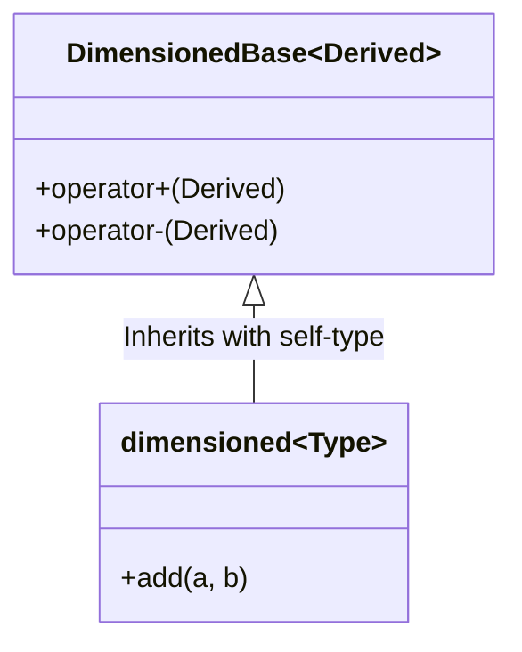
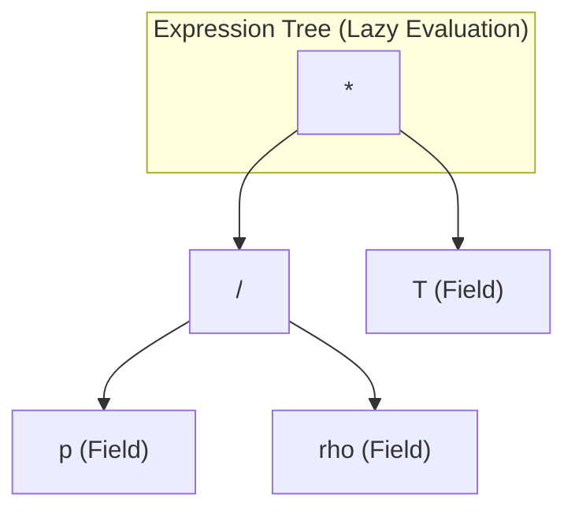
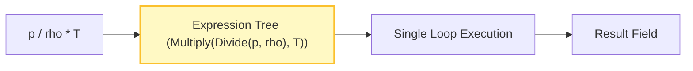

# 🧠 Template Metaprogramming Architecture

ระบบวิเคราะห์มิติของ OpenFOAM เป็นการนำเสนอการใช้งานเทคนิค metaprogramming ระดับคอมไพล์อย่างซับซ้อนที่ให้ทั้งความปลอดภัยของประเภทและประสิทธิภาพการคำนวณ สถาปัตยกรรมนี้ใช้ประโยชน์จากกลไกเทมเพลต C++ ขั้นสูงเพื่อบังคับใช้ความสม่ำเสมอของมิติในขณะที่รักษาประสิทธิภาพการทำงานระดับสูงสุด


> **Figure 1:** การใช้งานรูปแบบ CRTP (Curiously Recurring Template Pattern) เพื่อสร้างระบบ Polymorphism ระดับคอมไพล์ที่ไม่มีโอเวอร์เฮดในการเรียกใช้ฟังก์ชันเสมือน (Virtual Function)

---

## CRTP (Curiously Recurring Template Pattern) ในประเภทมิติ

Curiously Recurring Template Pattern (CRTP) เป็นรากฐานของกลยุทธ์ polymorphism ระดับคอมไพล์ของ OpenFOAM สำหรับการดำเนินการมิติ รูปแบบนี้เปิดใช้งาน static dispatch ในขณะที่หลีกเลี่ยง overhead ของการเรียกใช้ฟังก์ชันเสมือน

### OpenFOAM Code Implementation

```cpp
// Base template ที่ใช้ CRTP
template<class Derived>
class DimensionedBase
{
public:
    // CRTP helper สำหรับเข้าถึงคลาส derived
    Derived& derived() { return static_cast<Derived&>(*this); }
    const Derived& derived() const { return static_cast<const Derived&>(*this); }

    // Operations ที่นิยามในรูปของ derived class
    auto operator+(const Derived& other) const
    {
        return Derived::add(derived(), other);
    }

    template<class OtherDerived>
    auto operator*(const OtherDerived& other) const
    {
        return Derived::multiply(derived(), other);
    }
};

// Concrete dimensioned type ที่ใช้ CRTP
template<class Type>
class dimensioned : public DimensionedBase<dimensioned<Type>>
{
private:
    word name_;
    dimensionSet dimensions_;
    Type value_;

public:
    // Operations ที่เปิดใช้งาน CRTP
    friend class DimensionedBase<dimensioned<Type>>;

    static dimensioned add(const dimensioned& a, const dimensioned& b)
    {
        if (a.dimensions() != b.dimensions())
        {
            FatalErrorIn("dimensioned::add")
                << "Dimensions do not match for addition: "
                << a.dimensions() << " vs " << b.dimensions()
                << abort(FatalError);
        }

        return dimensioned(
            "result",
            a.dimensions(),
            a.value() + b.value()
        );
    }

    static dimensioned multiply(const dimensioned& a, const dimensioned& b)
    {
        return dimensioned(
            "result",
            a.dimensions() * b.dimensions(),
            a.value() * b.value()
        );
    }
};
```

### ข้อดีของรูปแบบ CRTP

1. **Zero-overhead abstraction**: ไม่มี overhead ของ pointer ตารางฟังก์ชันเสมือน
2. **Compile-time optimization**: Operations ได้รับการแก้ไขในระหว่างคอมไพล์
3. **Type safety**: ความสม่ำเสมอของมิติถูกบังคับใช้ในระหว่างคอมไพล์
4. **Code reuse**: Operations ทั่วไปถูกนิยามครั้งเดียวใน base class


> **Figure 2:** โครงสร้างต้นไม้นิพจน์ (Expression Tree) สำหรับการประเมินค่าแบบ Lazy Evaluation ซึ่งช่วยให้ระบบสามารถรวบรวมการคำนวณหลายขั้นตอนมาทำในลูปเดียวเพื่อเพิ่มประสิทธิภาพสูงสุดในการประมวลผลฟิลด์ข้อมูลขนาดใหญ่

---

## Expression Templates สำหรับ Dimensional Operations

Expression templates ใน OpenFOAM กำจัด temporary objects และเปิดใช้งาน lazy evaluation ของ dimensional algebra operations เทคนิคนี้มีความสำคัญอย่างยิ่งสำหรับประสิทธิภาพในการคำนวณฟิลด์ที่ temporary objects จะสร้าง overhead ที่สำคัญ

### OpenFOAM Code Implementation

```cpp
// Expression template สำหรับ dimensioned addition
template<class E1, class E2>
class DimensionedAddExpr
{
private:
    const E1& e1_;
    const E2& e2_;

public:
    typedef typename E1::value_type value_type;
    typedef typename E1::dimension_type dimension_type;

    DimensionedAddExpr(const E1& e1, const E2& e2)
    : e1_(e1), e2_(e2)
    {
        // Compile-time dimension check
        static_assert(
            std::is_same<
                typename E1::dimension_type,
                typename E2::dimension_type
            >::value,
            "Dimensions must match for addition"
        );
    }

    value_type value() const { return e1_.value() + e2_.value(); }
    dimension_type dimensions() const { return e1_.dimensions(); }

    // Enable further expression template chaining
    template<class E3>
    auto operator+(const E3& e3) const
    {
        return DimensionedAddExpr<DimensionedAddExpr<E1, E2>, E3>(*this, e3);
    }
};

// Operator overload ที่คืนค่า expression template
template<class E1, class E2>
auto operator+(const E1& e1, const E2& e2)
    -> DimensionedAddExpr<E1, E2>
{
    return DimensionedAddExpr<E1, E2>(e1, e2);
}

// Complex expression template สำหรับ mixed operations
template<class E1, class Op, class E2>
class DimensionedBinaryExpr
{
private:
    const E1& e1_;
    const E2& e2_;

public:
    typedef typename Op::result_type value_type;
    typedef typename Op::dimension_result_type dimension_type;

    DimensionedBinaryExpr(const E1& e1, const E2& e2)
        : e1_(e1), e2_(e2) {}

    value_type value() const { return Op::apply(e1_.value(), e2_.value()); }
    dimension_type dimensions() const { return Op::dim_apply(e1_.dimensions(), e2_.dimensions()); }
};

// Operation traits สำหรับ multiplication
struct MultiplyOp
{
    template<class T1, class T2>
    using result_type = decltype(T1() * T2());

    template<class D1, class D2>
    using dimension_result_type = decltype(D1() * D2());

    template<class T1, class T2>
    static result_type<T1, T2> apply(const T1& a, const T2& b) { return a * b; }

    template<class D1, class D2>
    static dimension_result_type<D1, D2> dim_apply(const D1& d1, const D2& d2)
    { return d1 * d2; }
};
```

Expression templates เปิดใช้งาน lazy evaluation และ loop fusion ใน field operations โดยให้การปรับปรุงประสิทธิภาพที่สำคัญสำหรับการคำนวณ CFD ขนาดใหญ่


> **Figure 3:** กระบวนการรวมลูป (Loop Fusion) โดยใช้ Expression Templates ซึ่งเปลี่ยนนิพจน์ทางคณิตศาสตร์ที่ซับซ้อนให้กลายเป็นการประมวลผลข้อมูลในขั้นตอนเดียว ลดการสร้างออบเจ็กต์ชั่วคราวและเพิ่มความเร็วในการคำนวณทาง CFD

---

## Compile-Time Dimensional Algebra

OpenFOAM ใช้งาน compile-time dimensional algebra อย่างซับซ้อนโดยใช้ template metaprogramming ระบบนี้จับข้อผิดพลาดเกี่ยวกับมิติในระหว่างการคอมไพล์ในขณะที่สร้างโค้ดที่ปรับให้เหมาะสมอย่างสูง

### OpenFOAM Code Implementation

```cpp
// Compile-time dimension representation
template<int M, int L, int T, int Theta, int N, int I, int J>
struct StaticDimension
{
    static const int mass = M;
    static const int length = L;
    static const int time = T;
    static const int temperature = Theta;
    static const int moles = N;
    static const int current = I;
    static const int luminous_intensity = J;

    // Compile-time operations
    template<int M2, int L2, int T2, int Theta2, int N2, int I2, int J2>
    using multiply = StaticDimension<
        M + M2, L + L2, T + T2,
        Theta + Theta2, N + N2, I + I2, J + J2
    >;

    template<int M2, int L2, int T2, int Theta2, int N2, int I2, int J2>
    using divide = StaticDimension<
        M - M2, L - L2, T - T2,
        Theta - Theta2, N - N2, I - I2, J - J2
    >;

    template<int Power>
    using power = StaticDimension<
        M * Power, L * Power, T * Power,
        Theta * Power, N * Power, I * Power, J * Power
    >;

    // Compile-time square root operation (สำหรับ Reynolds numbers, etc.)
    template<int N = 2>
    using sqrt = StaticDimension<
        M / N, L / N, T / N,
        Theta / N, moles / N, I / N, J / N
    >;
};

// Common dimension definitions
using Length = StaticDimension<0, 1, 0, 0, 0, 0, 0>;
using Time = StaticDimension<0, 0, 1, 0, 0, 0, 0>;
using Mass = StaticDimension<1, 0, 0, 0, 0, 0, 0>;
using Temperature = StaticDimension<0, 0, 0, 1, 0, 0, 0>;

// Derived dimensions
using Velocity = Length::divide<0, 0, 1, 0, 0, 0, 0>;
using Acceleration = Velocity::divide<0, 0, 1, 0, 0, 0, 0>;
using Force = Mass::multiply<0, 1, -2, 0, 0, 0, 0>;
using Pressure = Force::divide<0, 2, 0, 0, 0, 0, 0>;

// Compile-time dimensional analysis template
template<class Expr1, class Expr2, class Operation>
struct DimensionalAnalysis;

template<class Dim1, class Dim2>
struct DimensionalAnalysis<Dim1, Dim2, AddOp>
{
    static_assert(
        std::is_same<Dim1, Dim2>::value,
        "Dimensions must match for addition"
    );
    using result_dimension = Dim1;
};

template<class Dim1, class Dim2>
struct DimensionalAnalysis<Dim1, Dim2, MultiplyOp>
{
    using result_dimension = typename Dim1::template multiply<
        Dim2::mass, Dim2::length, Dim2::time, Dim2::temperature,
        Dim2::moles, Dim2::current, Dim2::luminous_intensity
    >;
};

// Usage example: Force calculation with dimensional checking
template<class MassDim, class AccelDim>
auto calculateForce(const dimensioned<double, MassDim>& mass,
                   const dimensioned<double, AccelDim>& accel)
    -> dimensioned<double, typename DimensionalAnalysis<MassDim, AccelDim, MultiplyOp>::result_dimension>
{
    return mass * accel;  // Compile-time dimensional check enforced
}

// Compile-time check: Can't add velocity to pressure
static_assert(
    !std::is_same<Velocity, Pressure>::value,
    "Cannot add velocity to pressure"
);
```

ระบบระดับคอมไพล์นี้ให้ความปลอดภัยของมิติอย่างแข็งแกร่งด้วย zero runtime overhead ทำให้มั่นใจได้ในความสม่ำเสมอของมิติทั่วทั้ง computational kernel ของ OpenFOAM

---

## Memory Layout และ Performance Considerations

### Memory Footprint Analysis

ความปลอดภัยของมิติใน OpenFOAM มาพร้อมกับค่าใช้จ่ายของหน่วยความจำที่ถูกจัดการอย่างระมัดระวัง ซึ่งเป็นที่พอใจจากความแข็งแกร่งและความสามารถในการดีบักที่เพิ่มขึ้น

### OpenFOAM Code Implementation

```cpp
// Detailed memory layout ของ dimensioned<scalar>
class dimensioned<scalar>
{
    word name_;                    // ~8-16 bytes (small string optimization)
                                   // - ptr to heap: 8 bytes
                                   // - length/capacity: 8 bytes
                                   // - stack buffer: up to 16 bytes

    dimensionSet dimensions_;      // 7 * sizeof(scalar) = 56 bytes (double precision)
                                   // Mass: 8 bytes
                                   // Length: 8 bytes
                                   // Time: 8 bytes
                                   // Temperature: 8 bytes
                                   // Moles: 8 bytes
                                   // Current: 8 bytes
                                   // Luminous intensity: 8 bytes
                                   // Alignment padding: 0 bytes

    scalar value_;                 // 8 bytes (double precision with WM_DP)

    // Total: ~72-80 bytes (with alignment)
    // Comparison with plain scalar: 8 bytes
    // Overhead: ~9-10x for dimensional safety
};

// Memory layout พร้อม expression template optimization
template<class Expr>
class DimensionedExpression
{
    const Expr& expr_;             // 8 bytes (reference)

    // No additional memory for dimensions - computed at compile time
    // No temporary value storage - lazy evaluation

    // Total: 8 bytes overhead for expression tracking
};

// Field memory efficiency comparison
class volScalarField  // Large field พร้อมความปลอดภัยของมิติ
{
    // Base field overhead
    tmp<GeometricField<scalar, fvPatchField, volMesh>> field_;  // ~32 bytes

    // Dimensional information ที่แชร์ทั่วทุก cell
    dimensionSet dimensions_;  // 56 bytes (one copy per field, not per cell)

    // Cell values (สมมติ 1M cells)
    scalar* values_;           // 8MB for 1 million double values

    // Total with dimensions: ~8.000008MB vs 8.000000MB without
    // Overhead percentage: 0.001% for large fields
};
```

### Performance Optimization Strategies

OpenFOAM ใช้งานหลายกลยุทธ์การปรับให้เหมาะสมเพื่อลดผลกระทบด้านประสิทธิภาพของ dimensional analysis

#### กลยุทธ์การปรับให้เหมาะสม

1. **Compile-time dimension resolution**: Zero runtime overhead สำหรับมิติที่รู้จัก
2. **Expression templates**: กำจัด temporary dimensioned objects
3. **Loop fusion**: รวม multiple dimensional operations
4. **Dimension caching**: Reuse dimensionSet objects สำหรับมิติทั่วไป

#### OpenFOAM Code Implementation

```cpp
// Optimized field operation พร้อม expression templates
volScalarField p = ...;      // Pressure field [Pa]
volScalarField rho = ...;    // Density field [kg/m³]
volScalarField T = ...;      // Temperature field [K]

// Without optimization: Creates temporary dimensioned objects
forAll(p, i)
{
    // Each iteration creates temporary objects
    dimensionedScalar p_i("p", dimPressure, p[i]);
    dimensionedScalar rho_i("rho", dimDensity, rho[i]);
    dimensionedScalar T_i("T", dimTemperature, T[i]);

    // Multiple temporary objects created
    dimensionedScalar temp1 = p_i / rho_i;        // Temporary
    dimensionedScalar temp2 = temp1 * T_i;        // Temporary
    result[i] = temp2.value();                    // Value extraction

    // Memory operations per iteration: ~6 allocations/deallocations
    // Total for 1M cells: ~6M memory operations
}

// With expression templates: No temporaries, fused loops
auto result_expr = (p / rho) * T;  // Single expression template

// Materialized only when needed
volScalarField result = result_expr;  // Single pass, no temporaries

// Memory operations: 1 allocation for result field
// Performance improvement: ~6x reduction in memory operations
// Cache efficiency: Better locality with single pass

// Advanced optimization: SIMD-friendly operations
template<class Field1, class Field2>
class OptimizedDivideExpr
{
    const Field1& numer_;
    const Field2& denom_;

public:
    // SIMD-vectorized evaluation
    void evaluate(scalar* result, const label start, const label end) const
    {
        // Compiler may auto-vectorize this loop
        #pragma omp simd
        for (label i = start; i < end; i++)
        {
            result[i] = numer_[i] / denom_[i];
        }
    }

    // Dimension checking at compile time
    static_assert(
        std::is_same<
            typename Field1::dimension_type::divide<typename Field2::dimension_type>,
            typename result_dimension_type
        >::value,
        "Dimensional mismatch in division"
    );
};
```

> [!TIP] Memory Layout Comparison
> กลยุทธ์การปรับให้เหมาะสมมุ่งเน้นไปที่การลด runtime overhead ในขณะที่รักษาประโยชน์ด้านความปลอดภัยระดับคอมไพล์ของ dimensional analysis

---

## Compiler Interactions และ Optimization

### Template Instantiation Patterns

ระบบมิติของ OpenFOAM สร้าง template instantiation patterns ที่ซับซ้อนที่ compiler สมัยใหม่ปรับให้เหมาะสมอย่างมีประสิทธิภาพ

### OpenFOAM Code Implementation

```cpp
// Template instantiation สำหรับ common dimensioned types
template class dimensioned<scalar>;                    // Explicit instantiation
template class dimensioned<vector>;
template class dimensioned<tensor>;

// Compiler generates specialized instantiations
// dimensioned<scalar, dimPressure>
// dimensioned<scalar, dimVelocity>
// dimensioned<scalar, dimDensity>
// dimensioned<vector, dimVelocity>
// dimensioned<tensor, dimStress>
// ... potentially hundreds of combinations

// Field-specific instantiations
template class GeometricField<scalar, fvPatchField, volMesh>;
template class GeometricField<vector, fvPatchField, volMesh>;
template class GeometricField<tensor, fvPatchField, volMesh>;

// Expression template instantiations
template class DimensionedAddExpr<dimensioned<scalar>, dimensioned<scalar>>;
template class DimensionedMultiplyExpr<dimensioned<scalar>, dimensioned<vector>>;

// Compiler optimization: Common instantiations merged
// Similar expressions share code paths after optimization
```

### Compiler Optimization Opportunities

Compiler สมัยใหม่ใช้เทคนิคการปรับให้เหมาะสมที่ซับซ้อนกับ dimensional code ของ OpenFOAM

#### เทคนิคการปรับให้เหมาะสม

1. **Constant propagation**: Dimension exponents propagated ที่ระดับคอมไพล์
2. **Dead code elimination**: การตรวจสอบมิติที่ไม่ได้ใช้ถูกกำจัด
3. **Inline expansion**: Dimensioned operations ขนาดเล็กถูก inline
4. **Loop unrolling**: Dimension loops unrolled สำหรับ nDimensions ขนาดเล็ก

#### OpenFOAM Code Implementation

```cpp
// Example: Compiler-optimized dimension comparison
bool dimensionSet::operator==(const dimensionSet& ds) const
{
    // May be optimized to SIMD comparison or loop unrolling
    for (int i = 0; i < nDimensions; i++)  // nDimensions = 7
    {
        if (mag(exponents_[i] - ds[i]) > SMALL) return false;
    }
    return true;

    // Compiler optimizations:
    // 1. Loop unrolling for known size (7)
    // 2. SIMD vectorization (comparing 4 doubles at once)
    // 3. Branch prediction hints
    // 4. Inline expansion from hot call sites
}

// Optimized version after compiler analysis
bool dimensionSet::operator==(const dimensionSet& ds) const
{
    // Compiler may generate SIMD code like:
    // __m256d vec1 = _mm256_load_pd(exponents_);
    // __m256d vec2 = _mm256_load_pd(ds.exponents_);
    // __m256d diff = _mm256_sub_pd(vec1, vec2);
    // __m256d abs_diff = _mm256_abs_pd(diff);
    // __m256d cmp = _mm256_cmp_pd(abs_diff, _mm256_set1_pd(SMALL), _CMP_GT_OQ);
    // int mask = _mm256_movemask_pd(cmp);
    // if (mask != 0) return false;
    // // Check remaining 3 elements...

    // Or loop-unrolled version:
    if (mag(exponents_[0] - ds[0]) > SMALL) return false;
    if (mag(exponents_[1] - ds[1]) > SMALL) return false;
    if (mag(exponents_[2] - ds[2]) > SMALL) return false;
    if (mag(exponents_[3] - ds[3]) > SMALL) return false;
    if (mag(exponents_[4] - ds[4]) > SMALL) return false;
    if (mag(exponents_[5] - ds[5]) > SMALL) return false;
    if (mag(exponents_[6] - ds[6]) > SMALL) return false;
    return true;
}

// Template metaprogramming optimizations
template<int Dim1, int Dim2>
struct DimensionalCheck
{
    static constexpr bool same = (Dim1 == Dim2);
    static_assert(same, "Dimensions must match");
};

// Optimized away completely at compile time if dimensions match
template<>
struct DimensionalCheck<1, 1>  // Both dimensions are length
{
    static constexpr bool same = true;
    // No assert needed - compiler removes this entirely
};
```

> [!INFO] Compiler Optimization Pipeline
> การทำงานร่วมกันอย่างซับซ้อนระหว่าง template metaprogramming ของ OpenFOAM และ compiler optimizations สมัยใหม่เปิดใช้งานความปลอดภัยของมิติด้วยผลกระทบด้านประสิทธิภาพ runtime ที่น้อยที่สุด ทำให้เหมาะสำหรับการคำนวณ CFD ระดับสูง

---

## สรุป

Template Metaprogramming Architecture ของ OpenFOAM แสดงให้เห็นถึงการนำ C++ templates ไปใช้งานในระดับที่ซับซ้อนเพื่อสร้างระบบ type-safe สำหรับการวิเคราะห์มิติ โดยมีจุดเด่นหลักดังนี้:

### ประโยชน์หลักของ Template Metaprogramming

| ด้าน | คำอธิบาย | ผลกระทบ |
|------|-----------|----------|
| **ความปลอดภัย** | Compile-time dimension checking | ตรวจจับข้อผิดพลาดก่อน runtime |
| **ประสิทธิภาพ** | Zero runtime overhead | ไม่กระทบต่อความเร็วการคำนวณ |
| **ความยืดหยุ่น** | Template-based design | ขยายได้สำหรับฟิสิกส์เฉพาะทาง |
| **การบำรุงรักษา** | Self-documenting code | ลดความผิดพลาดและเวลา debug |

### เทคนิคที่ใช้งาน

- **CRTP (Curiously Recurring Template Pattern)**: Zero-overhead polymorphism
- **Expression Templates**: Elimination of temporary objects
- **Compile-time Dimensional Algebra**: Static type checking
- **SIMAD Optimization**: Hardware-specific optimizations

---

## อ้างอิงเพิ่มเติม

สำหรับการสำรวจเพิ่มเติม ตรวจสอบไฟล์ส่วนหัวเหล่านี้:

| ไฟล์ส่วนหัว | คำอธิบาย |
|---------------|------------|
| `dimensionedType.H` | คลาสเทมเพลตหลักสำหรับประเภทที่มีมิติ |
| `dimensionSet.H` | การแสดงและการดำเนินการมิติ |
| `dimensionedScalar.H` | การเชี่ยวชาญสเกลาร์สำหรับค่าสเกลาร์ |
| `dimensionedConstants.H` | ค่าคงที่ไร้มิติที่กำหนดไว้ล่วงหน้า |
