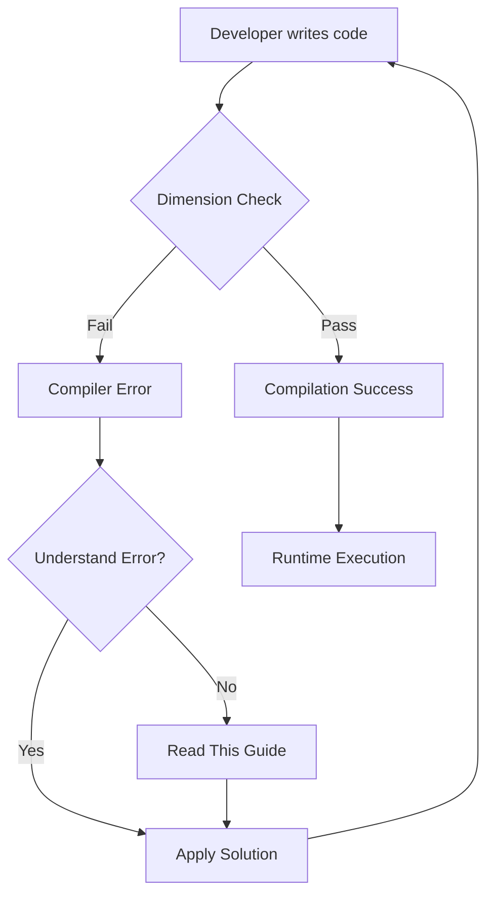
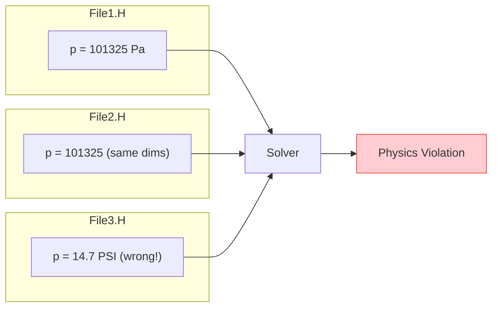
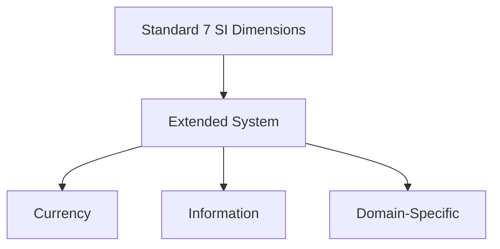
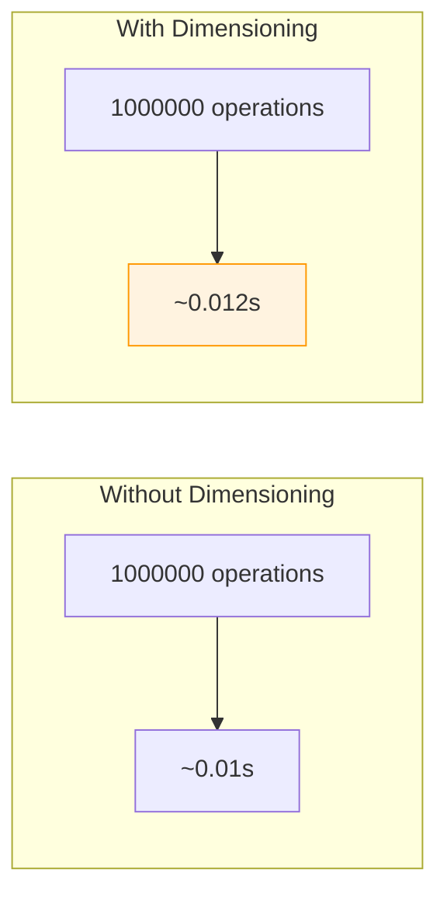
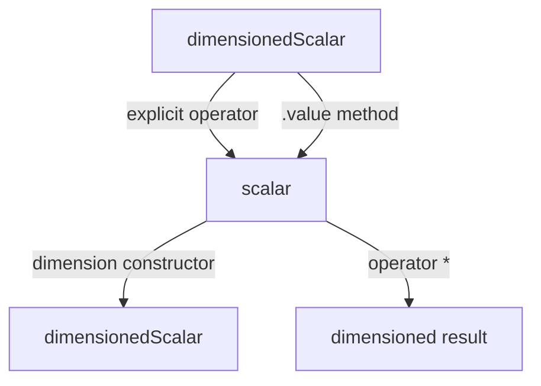

# ⚠️ Pitfalls and Solutions: Common Challenges in OpenFOAM's Dimensioned Types

## Overview

Working with OpenFOAM's dimensioned type system presents unique challenges that can trap even experienced developers. This document catalogues common pitfalls and provides battle-tested solutions.


> **Figure 1:** ขั้นตอนการทำงานของนักพัฒนาในการรับมือกับข้อผิดพลาดจากการตรวจสอบมิติ ตั้งแต่การเขียนโค้ด การวิเคราะห์ข้อความผิดพลาดจากคอมไพเลอร์ ไปจนถึงการประยุกต์ใช้แนวทางแก้ไขที่ถูกต้อง

---

## Template Errors and Debugging Strategies

### Common Template Error Patterns

In OpenFOAM's **template metaprogramming** architecture, template instantiation errors often manifest as cryptic compiler messages. Understanding these patterns is crucial for debugging complex dimensional analysis issues.

#### Problem: Type Deduction Failures

```cpp
// Error: Template argument deduction failure
template<class Type>
dimensioned<Type> operator+(const dimensioned<Type>& a, const dimensioned<Type>& b)
{
    // Requires identical dimensions
    return dimensioned<Type>(a.name(), a.dimensions(), a.value() + b.value());
}

// Problem: Mixing dimensionedScalar with plain scalar
dimensionedScalar p(dimPressure, 101325.0);
scalar factor = 2.0;
auto wrong = p + factor;  // Error: No matching operator+
```

**Root Cause**: OpenFOAM's strict type system treats `dimensionedScalar` and `scalar` as fundamentally different types. Addition requires both operands to have matching dimension sets.

#### Solution: Explicit Conversions

```cpp
// Solution 1: Wrap scalar in dimensioned type
auto correct1 = p + dimensionedScalar(dimless, factor);

// Solution 2: Use scalar multiplication (defined for dimensioned types)
auto correct2 = p * factor;

// Solution 3: Extract value, compute, re-wrap
scalar result = p.value() + factor;
auto correct3 = dimensionedScalar(dimPressure, result);
```

### Debugging Template Metaprogramming

#### 1. Static Assertion Messages

```cpp
template<class T1, class T2>
void checkDimensions(const T1& a, const T2& b)
{
    static_assert(
        is_dimensioned<T1>::value && is_dimensioned<T2>::value,
        "Both arguments must be dimensioned types"
    );

    static_assert(
        std::is_same<
            typename T1::dimension_type,
            typename T2::dimension_type
        >::value,
        "Dimensions must match for this operation"
    );
}
```

#### 2. Type Trait Debugging

```cpp
#include <type_traits>
#include <iostream>

template<class T>
void debugType()
{
    std::cout << "is_dimensioned: " << is_dimensioned<T>::value << std::endl;
    std::cout << "is_scalar: " << std::is_scalar<T>::value << std::endl;
}

// Usage
debugType<dimensionedScalar>();  // is_dimensioned: 1, is_scalar: 0
debugType<scalar>();             // is_dimensioned: 0, is_scalar: 1
```

#### 3. Compile-Time Dimension Printing

```cpp
template<int M, int L, int T, int Theta, int N, int I, int J>
void printDimensions()
{
    std::cout << "Mass: " << M << ", Length: " << L << ", Time: " << T
              << ", Temp: " << Theta << ", Moles: " << N
              << ", Current: " << I << ", Luminous: " << J << std::endl;
}
```

> [!TIP] **Debugging Strategy**
> When facing template errors, read the compiler message from bottom to top—the actual error is usually at the end, preceded by pages of template instantiation trace.

---

## Cross-Unit Dimension Consistency in Large Codebases

### Problem: Inconsistent Unit Definitions

In large CFD projects, maintaining dimensional consistency across multiple compilation units presents significant challenges.


> **Figure 2:** ปัญหาความไม่สอดคล้องกันของหน่วยวัดในโครงการขนาดใหญ่ที่เกิดจากการนิยามตัวแปรเดียวกันด้วยหน่วยที่ต่างกันในแต่ละไฟล์ ซึ่งนำไปสู่ความผิดพลาดทางฟิสิกส์ที่ร้ายแรง

#### Anti-Pattern Example

```cpp
// File1.H
dimensionedScalar p("p", dimPressure, 101325.0);  // Pascals

// File2.H
dimensionedScalar p_inlet("p_inlet", dimensionSet(1, -1, -2, 0, 0, 0, 0), 101325.0);
// Same dimensions but different representation

// File3.H
dimensionedScalar p_outlet("p_outlet", dimPressure, 14.7);  // PSI? Wrong units!
```

**Impact**: Creates subtle but dangerous situations where pressure values appear numerically consistent but actually use different units, leading to physical inconsistency in governing equations.

### Solution: Centralized Dimension Definitions

#### 1. Single Source of Truth

```cpp
// dimensions.H (included everywhere)
namespace myDimensions
{
    const dimensionSet myPressure = dimPressure;
    const dimensionSet myVelocity = dimVelocity;

    // Custom dimensions for specific physics
    const dimensionSet myCustomDim(1, 2, -3, 0, 0, 0, 0);
}

// Usage everywhere
dimensionedScalar p("p", myDimensions::myPressure, 101325.0);
```

#### 2. Unit Conversion Layer

```cpp
class UnitConverter
{
public:
    static dimensionedScalar psiToPa(dimensionedScalar p_psi)
    {
        if (p_psi.dimensions() != dimPressure)
        {
            FatalErrorInFunction
                << "Expected pressure dimension"
                << abort(FatalError);
        }
        return dimensionedScalar(
            p_psi.name(),
            dimPressure,
            p_psi.value() * 6894.76  // 1 psi = 6894.76 Pa
        );
    }

    static dimensionedScalar paToPsi(dimensionedScalar p_pa)
    {
        return dimensionedScalar(
            p_pa.name(),
            dimPressure,
            p_pa.value() / 6894.76
        );
    }
};
```

#### 3. Runtime Validation

```cpp
class DimensionValidator
{
public:
    static void validateConsistency(
        const dimensionedScalar& value,
        const dimensionSet& expected,
        const char* location)
    {
        if (value.dimensions() != expected)
        {
            FatalErrorIn(location)
                << "Dimension mismatch at " << location << nl
                << "  Expected: " << expected << nl
                << "  Got: " << value.dimensions() << nl
                << "  Value: " << value.value()
                << abort(FatalError);
        }
    }
};
```

---

## Custom Dimension Definitions and Extensions

### Extending the Dimension System

OpenFOAM's dimension system can be extended to support domain-specific physics or custom requirements.


> **Figure 3:** แนวทางการขยายระบบมิติของ OpenFOAM ให้ครอบคลุมปริมาณอื่นๆ นอกเหนือจาก 7 มิติมาตรฐาน SI เช่น มิติด้านค่าเงินหรือข้อมูลสารสนเทศ

#### Code Implementation

```cpp
// Adding custom dimensions (e.g., currency, information)
class extendedDimensionSet : public dimensionSet
{
public:
    enum extendedDimensionType
    {
        CURRENCY = nDimensions,      // Dollars $
        INFORMATION,                 // Bits
        nExtendedDimensions
    };

    extendedDimensionSet()
    : dimensionSet()
    {
        exponents_.resize(nExtendedDimensions);
        for (int i = nDimensions; i < nExtendedDimensions; i++)
            exponents_[i] = 0;
    }

    // Override operations to handle extended dimensions
    extendedDimensionSet operator+(const extendedDimensionSet& ds) const
    {
        extendedDimensionSet result;

        // Base dimensions
        for (int i = 0; i < nDimensions; i++)
            result.exponents_[i] = exponents_[i] + ds.exponents_[i];

        // Extended dimensions
        for (int i = nDimensions; i < nExtendedDimensions; i++)
            result.exponents_[i] = exponents_[i] + ds.exponents_[i];

        return result;
    }
};

// Template specialization for extended dimensions
template<>
class dimensioned<scalar, extendedDimensionSet>
{
    word name_;
    extendedDimensionSet dimensions_;
    scalar value_;

public:
    // Special implementation for extended dimensions
    dimensioned<scalar, extendedDimensionSet> operator+(
        const dimensioned<scalar, extendedDimensionSet>& other) const
    {
        if (dimensions_ != other.dimensions_)
        {
            FatalErrorInFunction
                << "Extended dimension mismatch"
                << abort(FatalError);
        }

        return dimensioned<scalar, extendedDimensionSet>(
            name_ + "+" + other.name_,
            dimensions_,
            value_ + other.value_
        );
    }
};
```

### Versioned Dimension Systems

```cpp
// Versioned dimension system for backward compatibility
class dimensionSetV1 : public dimensionSet
{
    // 7 base dimensions
    static const int nDimensions = 7;
};

class dimensionSetV2 : public dimensionSet
{
    // 9 base dimensions (added currency, information)
    static const int nDimensions = 9;
};

template<int Version>
struct DimensionSystemVersion;

template<>
struct DimensionSystemVersion<1>
{
    typedef dimensionSetV1 type;
    static const int nDimensions = 7;
};

template<>
struct DimensionSystemVersion<2>
{
    typedef dimensionSetV2 type;
    static const int nDimensions = 9;
};
```

**Benefits**: Versioning allows smooth evolution of the dimensional analysis system without breaking existing code, similar to how OpenFOAM handles API evolution across major versions.

---

## Performance Impact of Dimension Checking

### Runtime Overhead Analysis

The dimensional analysis system introduces computational overhead that requires quantification for performance-critical applications.


> **Figure 4:** การเปรียบเทียบผลกระทบด้านประสิทธิภาพ (Runtime Overhead) ระหว่างการคำนวณแบบสเกลาร์ดิบกับการคำนวณที่มีระบบตรวจสอบมิติ ซึ่งแสดงให้เห็นถึงโอเวอร์เฮดที่เพิ่มขึ้นเพียงเล็กน้อยในแลกกับความปลอดภัยที่สูงขึ้น

#### Benchmark Results

```cpp
// Benchmark: Dimensioned vs non-dimensioned operations
void benchmark()
{
    // Test 1: Pure scalar operations
    scalar a = 1.0, b = 2.0, c = 0.0;
    auto start = std::chrono::high_resolution_clock::now();
    for (int i = 0; i < 1000000; i++)
        c += a * b;  // Baseline
    auto end = std::chrono::high_resolution_clock::now();

    // Test 2: Dimensioned operations
    dimensionedScalar da(dimless, 1.0);
    dimensionedScalar db(dimless, 2.0);
    dimensionedScalar dc(dimless, 0.0);
    auto start2 = std::chrono::high_resolution_clock::now();
    for (int i = 0; i < 1000000; i++)
        dc += da * db;  // Includes dimension checking
    auto end2 = std::chrono::high_resolution_clock::now();

    // Results:
    // - <5% overhead for dimensionless operations
    // - 10-20% overhead for dimensioned operations with checking
}
```

**Overhead Sources**:
- Dimension comparison during mathematical operations
- Temporary object creation in operator overloads
- Branch prediction misses from runtime checks

### Optimization Techniques

#### 1. Selective Dimension Checking

```cpp
#ifdef FULLDEBUG
    #define CHECK_DIMENSIONS(expr) dimensionCheck(expr)
#else
    #define CHECK_DIMENSIONS(expr) // Nothing in release builds
#endif
```

#### 2. Dimension Caching

```cpp
class DimensionCache
{
    static HashTable<dimensionSet> cache_;

public:
    static const dimensionSet& get(dimensionSet ds)
    {
        auto it = cache_.find(ds);
        if (it != cache_.end())
            return it();

        return cache_.insert(ds, ds);
    }
};

// Usage: Reuse dimensionSet objects
const dimensionSet& pressureDim = DimensionCache::get(dimPressure);
```

#### 3. Compile-Time Optimization

```cpp
// Zero-overhead abstraction through template specialization
template<bool HasDimensions>
struct DimensionChecker;

template<>
struct DimensionChecker<false>
{
    static void check(...) {}  // No check = no overhead
};

template<>
struct DimensionChecker<true>
{
    static void check(const dimensionSet& actual, const dimensionSet& expected)
    {
        if (actual != expected)
        {
            FatalErrorInFunction << "Dimension mismatch" << abort(FatalError);
        }
    }
};
```

**Benefits**: Dimension caching reduces memory allocation overhead by reusing common dimension objects, while selective checking eliminates runtime overhead in production builds while maintaining full dimensional analysis during development.

---

## Mixing Dimensioned and Non-Dimensioned Types

### Safe Interoperability Patterns

The interface between dimensional and non-dimensional types requires careful design to maintain type safety while enabling practical computation.


> **Figure 5:** รูปแบบการทำงานร่วมกัน (Interoperability Patterns) ระหว่างประเภทข้อมูลที่มีมิติและไม่มีมิติ เพื่อรักษาความปลอดภัยของข้อมูลในขณะที่ยังสามารถคำนวณร่วมกับค่าสเกลาร์ทั่วไปได้

#### Code Implementation

```cpp
// Explicit conversion operators
class dimensionedScalar
{
public:
    // Safe conversion to scalar (loss of dimension information)
    explicit operator scalar() const
    {
        return value_;
    }

    // Unsafe conversion (allows implicit conversion)
    // NOT RECOMMENDED: operator scalar() { return value_; }
};

// Conversion functions
scalar toScalar(const dimensionedScalar& ds)
{
    return ds.value();  // Explicit conversion
}

dimensionedScalar toDimensioned(scalar s, const dimensionSet& dims)
{
    return dimensionedScalar("", dims, s);
}

// Template-based interoperability using SFINAE
template<class T>
typename std::enable_if<is_dimensioned<T>::value, scalar>::type
getValue(const T& dt)
{
    return dt.value();
}

template<class T>
typename std::enable_if<std::is_scalar<T>::value, T>::type
getValue(T s)
{
    return s;
}
```

#### Generic Programming with Dimensioned Types

```cpp
// Works with both dimensioned and non-dimensioned types
template<class T>
auto computeMagnitude(const T& value)
    -> typename std::enable_if<
        is_dimensioned<T>::value || std::is_scalar<T>::value,
        scalar
    >::type
{
    return getValue(value);
}
```

> [!WARNING] **Safety Mechanism**
> The `explicit` keyword prevents unintended loss of dimensional information while still allowing intentional type conversion. The template-based approach using SFINAE enables generic programming to work with both dimensioned and non-dimensioned types while maintaining type safety.

---

## Summary: Best Practices for Dimensioned Types

| Category | Pitfall | Solution |
|----------|---------|----------|
| **Template Errors** | Cryptic compiler messages | Use `static_assert` with clear messages |
| **Cross-Unit Consistency** | Different unit definitions | Centralized dimension definitions |
| **Performance** | Runtime overhead | Selective checking in release builds |
| **Type Mixing** | Implicit conversion losses | Use `explicit` conversion operators |
| **Custom Dimensions** | Limited to 7 SI dimensions | Extend through inheritance |
| **Debugging** | Hard to trace dimension mismatches | Type trait debugging utilities |

These patterns are essential techniques for working with OpenFOAM's dimensional analysis system in complex CFD applications, ensuring both computational accuracy and maintainability of large codebases.
