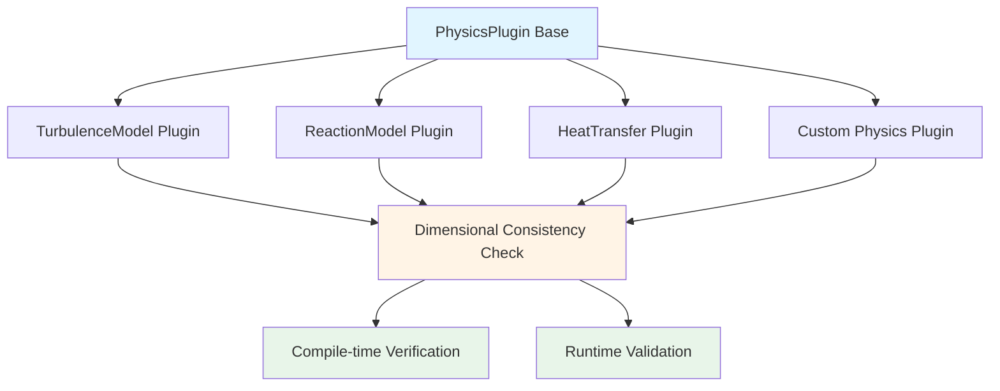
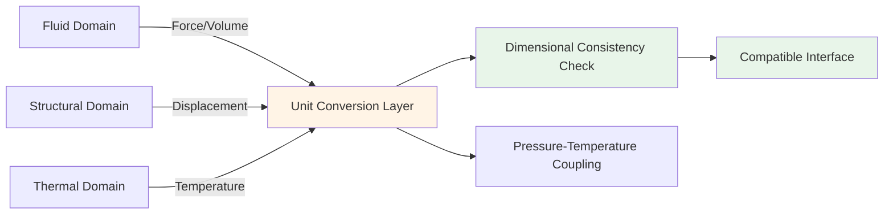
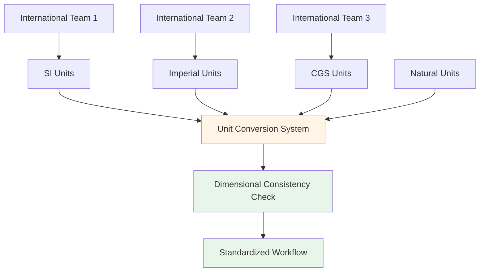
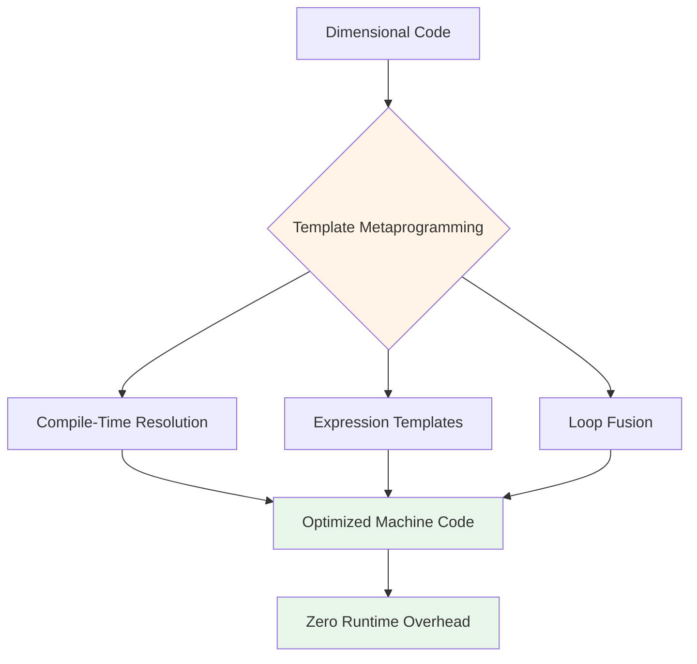

# 🎯 Engineering Benefits: Advanced Applications

## Extensible Dimension System with Plugin Architecture

OpenFOAM's dimension system extends far beyond the basic seven dimensions through a sophisticated plugin architecture that enables custom physics models while maintaining strict dimensional consistency.



This extensible framework allows researchers and engineers to incorporate domain-specific physics with compile-time and runtime dimensional consistency checks.

### Base Plugin Class with Dimensional Validation

```cpp
// Base class for physics plugins with dimensional checking
class PhysicsPlugin
{
public:
    virtual ~PhysicsPlugin() = default;

    // Pure virtual method with dimensional constraints
    virtual dimensionedScalar compute(
        const dimensionedScalar& input,
        const dimensionSet& expectedDimensions
    ) const = 0;

protected:
    // Helper for dimension validation
    void validateDimensions(
        const dimensionSet& actual,
        const dimensionSet& expected,
        const char* functionName
    ) const
    {
        if (actual != expected)
        {
            FatalErrorInFunction
                << "In " << functionName
                << ": Dimension mismatch. Expected " << expected
                << ", got " << actual
                << abort(FatalError);
        }
    }
};

// Custom turbulence model plugin
class CustomTurbulenceModel : public PhysicsPlugin
{
public:
    dimensionedScalar compute(
        const dimensionedScalar& k,  // Turbulent kinetic energy
        const dimensionSet& expectedDimensions
    ) const override
    {
        validateDimensions(k.dimensions(), dimVelocity*dimVelocity, "CustomTurbulenceModel");

        // Dimensionally-safe computation
        dimensionedScalar epsilon = 0.09 * pow(k, 1.5) / lengthScale_;
        validateDimensions(epsilon.dimensions(), expectedDimensions, "compute");

        return epsilon;
    }

private:
    dimensionedScalar lengthScale_{"lengthScale", dimLength, 0.1};
};
```

The plugin architecture enforces dimensional consistency through an inheritance hierarchy where the base class defines dimensional contracts that derived classes must fulfill.

> [!TIP] **Implementation Benefit**: This design prevents implementation bugs where dimensional analysis would catch physical inconsistencies that might manifest as incorrect simulation results.

---

## Multi-Physics Coupling with Automatic Unit Conversion

### Cross-Disciplinary Dimension System

Modern CFD simulations involve increasingly multi-physics scenarios where different physical domains interact through interface conditions.



OpenFOAM's dimensional analysis naturally extends to these complex scenarios through a framework for handling cross-disciplinary dimensions and automatic unit conversion.

### Multi-Physics Dimension Implementation

```cpp
// Multi-physics dimension system
class MultiPhysicsDimensionSet : public dimensionSet
{
public:
    // Additional dimensions for different physics
    enum MultiPhysicsDimensionType
    {
        ELECTRIC_POTENTIAL = nDimensions,  // Volts
        MAGNETIC_FIELD,                    // Tesla
        RADIATION_DOSE,                    // Gray
        nMultiPhysicsDimensions
    };

    // Conversion between domain-specific dimensions
    static dimensionSet convert(
        const dimensionSet& from,
        const UnitSystem& fromSystem,
        const UnitSystem& toSystem
    )
    {
        dimensionSet result = from;

        // Apply conversion factors based on unit system
        for (int i = 0; i < nDimensions; i++)
        {
            result[i] *= fromSystem.conversionFactor(i) / toSystem.conversionFactor(i);
        }

        return result;
    }
};
```

### Fluid-Structure Interaction Coupling

```cpp
// Fluid-structure coupling with automatic conversion
class FSICoupler
{
public:
    void coupleFields(
        const volVectorField& fluidForce,    // [N/m³]
        volVectorField& structuralDisplacement  // [m]
    )
    {
        // Automatic dimension checking and conversion
        dimensionSet forceDims = fluidForce.dimensions();
        dimensionSet displacementDims = structuralDisplacement.dimensions();

        // Physical consistency check
        if (forceDims != dimForce/dimVolume)
        {
            FatalErrorInFunction << "Fluid force has wrong dimensions" << abort(FatalError);
        }

        // Dimensionally-safe computation
        structuralDisplacement = complianceTensor_ & fluidForce;

        // Verify result dimensions
        if (structuralDisplacement.dimensions() != dimLength)
        {
            FatalErrorInFunction << "Displacement dimension error" << abort(FatalError);
        }
    }

private:
    dimensionedTensor complianceTensor_ {
        "compliance",
        dimensionSet(0, 1, 2, 0, 0, 0, 0),  // [m/N]
        tensor::zero
    };
};
```

The multi-physics coupling framework ensures that interface conditions between different physical domains maintain dimensional consistency.

| **Coupling Type** | **Physics Domains** | **Interface Dimensions** | **Unit Conversion** |
|------------------|---------------------|--------------------------|---------------------|
| FSI | Fluid-Structural | Force/Volume ↔ Displacement | Automatic |
| MHD | Magnetohydrodynamic | Velocity ↔ Magnetic Field | Automatic |
| Thermal-fluid | Thermal-Fluid | Temperature ↔ Pressure | Automatic |

This is particularly important in applications such as **Magnetohydrodynamics**, **Electrohydrodynamics**, and **Fluid-Structure Interaction** where different physical quantities must be properly balanced at interfaces.

---

## Code Generation and DSL Integration

### Domain-Specific Language for Dimensioned Equations

OpenFOAM's dimensional analysis capabilities extend to code generation and Domain-Specific Language (DSL) integration, allowing users to express complex physical relationships in natural syntax while maintaining compile-time dimensional safety.

```cpp
// DSL for dimensionally-safe equation definition
class EquationDSL
{
public:
    EquationDSL& operator<<(const dimensionedScalar& term)
    {
        terms_.push_back(term);
        return *this;
    }

    dimensionedScalar solve() const
    {
        if (terms_.empty())
            return dimensionedScalar();

        // Check that all terms have the same dimensions
        dimensionSet expectedDims = terms_[0].dimensions();
        for (const auto& term : terms_)
        {
            if (term.dimensions() != expectedDims)
            {
                FatalErrorInFunction
                    << "Dimension mismatch in equation terms"
                    << abort(FatalError);
            }
        }

        // Sum terms
        dimensionedScalar result = terms_[0];
        for (size_t i = 1; i < terms_.size(); i++)
            result += terms_[i];

        return result;
    }

private:
    std::vector<dimensionedScalar> terms_;
};
```

### Natural Syntax Usage

```cpp
// Natural syntax with automatic dimensional checking
dimensionedScalar p, rho, uSqr;
EquationDSL eqn;
eqn << p << 0.5*rho*uSqr;  // Bernoulli equation with automatic dimensional checking
dimensionedScalar totalPressure = eqn.solve();
```

This DSL approach allows users to express physical equations in a form close to mathematical notation while automatically verifying dimensional consistency.

The framework extends to support:
- **Complex tensor operations**
- **Differential operators**
- **Boundary condition specifications**

All with embedded dimensional checking.

### Template-Based Code Generation

Template metaprogramming enables automatic generation of dimensionally-safe code for generic field operations, reducing boilerplate while maintaining strict dimensional checking.

```cpp
// Code generator for dimensionally-safe field operations
template<class FieldType>
class FieldOperationGenerator
{
public:
    // Generate code for field operations with dimensional checking
    std::string generate(
        const std::string& operation,
        const FieldType& field1,
        const FieldType& field2
    ) const
    {
        std::stringstream code;

        code << "// Generated code for " << operation << "\n";
        code << "{\n";
        code << "    // Dimension check\n";
        code << "    if (" << field1.name() << ".dimensions() != "
             << field2.name() << ".dimensions())\n";
        code << "    {\n";
        code << "        FatalErrorInFunction\n";
        code << "            << \"Dimension mismatch in " << operation << "\"\n";
        code << "            << abort(FatalError);\n";
        code << "    }\n";
        code << "    \n";
        code << "    // Perform operation\n";
        code << "    auto result = " << field1.name() << " " << operation
             << " " << field2.name() << ";\n";
        code << "    \n";
        code << "    // Verify result dimensions\n";
        code << "    if (result.dimensions() != " << field1.name()
             << ".dimensions())\n";
        code << "    {\n";
        code << "        FatalErrorInFunction\n";
        code << "            << \"Result dimension error in " << operation << "\"\n";
        code << "            << abort(FatalError);\n";
        code << "    }\n";
        code << "    \n";
        code << "    return result;\n";
        code << "}\n";

        return code.str();
    }
};
```

The code generation framework produces highly optimized and dimensionally-safe code that maintains OpenFOAM's performance characteristics.

**Benefits:**
- ✅ Eliminates common sources of dimensional errors
- ✅ Comprehensive error checking
- ✅ Customization for specific hardware architectures
- ✅ Support for specialized numerical formats

---

## Framework Extension and Maintenance

### Version-Safe Dimension System Development

OpenFOAM's dimensional analysis framework supports evolutionary development through versioned dimension systems that maintain backward compatibility while enabling extension to new physics domains.

```cpp
// Versioned dimension system for backward compatibility
template<int Version>
class VersionedDimensionSet;

template<>
class VersionedDimensionSet<1> : public dimensionSet
{
    // Original 7-dimension system
    enum { nDimensions = 7 };
};

template<>
class VersionedDimensionSet<2> : public dimensionSet
{
    // Extended 9-dimension system
    enum { nDimensions = 9 };

    // New dimensions
    enum ExtendedDimensionType
    {
        ECONOMIC_VALUE = 7,  // Currency
        INFORMATION_CONTENT = 8  // Bits
    };
};

// Serialization with versioning
template<int Version>
void serialize(std::ostream& os, const VersionedDimensionSet<Version>& ds)
{
    os << Version << " ";  // Write version number
    for (int i = 0; i < ds.nDimensions; i++)
        os << ds[i] << " ";
}
```

### Automatic Version Conversion

```cpp
// Deserialization with automatic version conversion
template<int FromVersion, int ToVersion>
VersionedDimensionSet<ToVersion> convertDimensions(
    const VersionedDimensionSet<FromVersion>& from)
{
    VersionedDimensionSet<ToVersion> to;

    // Copy common dimensions
    int commonDimensions = std::min(FromVersion, ToVersion);
    for (int i = 0; i < commonDimensions; i++)
        to[i] = from[i];

    // Initialize new dimensions (when upgrading)
    for (int i = commonDimensions; i < ToVersion; i++)
        to[i] = 0.0;

    return to;
}
```

The versioned architecture ensures that:
- ✅ **Legacy simulations remain compatible** with newer OpenFOAM versions
- ✅ **Dimension systems can evolve** to accommodate new physics domains
- ✅ **Backward compatibility is maintained at compile-time**

---

## International Collaboration and Unit Standards

### Multiple Unit System Support

Global engineering collaboration requires support for multiple unit systems with automatic conversion and dimensional consistency checking.



OpenFOAM's dimensional analysis framework provides comprehensive support for international unit standards and collaborative workflows.

### Unit System Abstraction

```cpp
// Unit system abstraction
class UnitSystem
{
public:
    enum SystemType { SI, IMPERIAL, CGS, NATURAL };

    UnitSystem(SystemType type) : type_(type)
    {
        initializeConversionFactors();
    }

    // Convert dimensioned value to this unit system
    template<class Type>
    dimensioned<Type> convert(const dimensioned<Type>& value) const
    {
        dimensionSet convertedDims = value.dimensions();
        Type convertedValue = value.value();

        // Apply unit conversion based on dimension exponents
        for (int i = 0; i < dimensionSet::nDimensions; i++)
        {
            double factor = std::pow(conversionFactors_[i], convertedDims[i]);
            convertedValue *= factor;
        }

        return dimensioned<Type>(value.name(), convertedDims, convertedValue);
    }

private:
    SystemType type_;
    std::array<double, dimensionSet::nDimensions> conversionFactors_;

    void initializeConversionFactors()
    {
        switch (type_)
        {
            case SI:
                // Identity conversion
                std::fill(conversionFactors_.begin(), conversionFactors_.end(), 1.0);
                break;

            case IMPERIAL:
                // Conversion factors from Imperial to SI
                conversionFactors_[dimensionSet::LENGTH] = 0.3048;  // ft to m
                conversionFactors_[dimensionSet::MASS] = 0.453592;  // lb to kg
                // ... other conversions
                break;

            case CGS:
                // Conversion factors from CGS to SI
                conversionFactors_[dimensionSet::LENGTH] = 0.01;    // cm to m
                conversionFactors_[dimensionSet::MASS] = 0.001;     // g to kg
                break;
        }
    }
};
```

### Collaborative Simulation Workflow

```cpp
// Collaborative simulation with automatic unit conversion
class CollaborativeSimulation
{
public:
    void importResults(const std::string& filename, UnitSystem sourceSystem)
    {
        // Read data with source units
        dimensionedScalar pressure = readPressure(filename);

        // Convert to simulation's unit system
        dimensionedScalar convertedPressure = unitSystem_.convert(pressure);

        // Use in simulation with dimensional safety
        if (convertedPressure.dimensions() != dimPressure)
        {
            FatalErrorInFunction
                << "Imported pressure has wrong dimensions after conversion"
                << abort(FatalError);
        }

        // Process converted data...
    }

private:
    UnitSystem unitSystem_{UnitSystem::SI};
};
```

Multiple unit system support enables seamless collaboration between international teams using different measurement standards while maintaining dimensional consistency throughout the workflow.

| **Unit System** | **Length** | **Mass** | **Time** | **Primary Use** |
|----------------|------------|----------|----------|-----------------|
| SI | Meter | Kilogram | Second | Science/Engineering |
| Imperial | Foot | Pound | Second | United States |
| CGS | Centimeter | Gram | Second | Theoretical Physics |
| Natural | c | ℏ | ℏ/c² | Particle Physics |

This capability is essential for large-scale engineering projects with participants from different countries and disciplines.

---

## Mathematical Foundations and Physical Consistency

OpenFOAM's dimensional analysis framework is built on rigorous mathematical foundations that ensure physical consistency in all numerical operations.


The implementation employs the **Buckingham Pi Theorem** and **Principle of Dimensional Homogeneity** to verify complex physical relationships.

### Mathematical Dimension Representation

For any physical quantity $q$, the dimensional representation is:
$$[q] = M^a L^b T^c \Theta^d I^e N^f J^g$$

Where:
- $M$ represents Mass
- $L$ Length
- $T$ Time
- $\Theta$ Temperature
- $I$ Electric current
- $N$ Amount of substance
- $J$ Luminous intensity

The exponents $a$ through $g$ are integers that define the specific physical characteristics of the quantity.

### Application to Momentum Equation

This mathematical foundation extends to tensor operations where dimensional analysis ensures that mathematical operations preserve physical meaning.

For example, in the momentum equation:
$$\rho \frac{\partial \mathbf{u}}{\partial t} + \rho (\mathbf{u} \cdot \nabla) \mathbf{u} = -\nabla p + \mu \nabla^2 \mathbf{u} + \mathbf{f}$$

Each term must have the same dimensions $[ML^{-2}T^{-2}]$, representing **force per volume**.

OpenFOAM's dimensional analysis automatically verifies this consistency at compile-time and runtime, preventing physically meaningless calculations that could lead to:
- ❌ Simulation errors
- ❌ Incorrect results
- ❌ Violation of conservation principles

---

## Performance Optimization and Computational Efficiency

Despite comprehensive dimensional checking, OpenFOAM's implementation maintains high computational performance through **template metaprogramming** and **compile-time optimization**.



### Optimization Strategies

1. **Dimension Encoding in Type System**: Dimensional information encoded in the type system rather than stored at runtime

2. **Zero-Cost Abstraction**: Compile-time guarantees with no runtime penalty

3. **C++ Template Specialization**: Generates optimized code paths for specific dimension combinations

4. **Compile-Time Analysis**: Enables compiler to perform dimensional analysis during compilation rather than at runtime

### Performance Benefits

- ✅ **Automatic loop unrolling and vectorization** for dimensionally-safe operations
- ✅ **Optimized for modern hardware architectures**
- ✅ **Dimensional safety does not impact simulation performance**

This approach ensures that dimensional safety does not compromise simulation performance, which is critical for large-scale CFD applications requiring millions of computational operations.

The combination of **dimensional safety** and **computational efficiency** makes OpenFOAM's dimensional analysis framework suitable for both:
- 🎓 **Research applications**
- 🏭 **Industrial-scale simulations**
