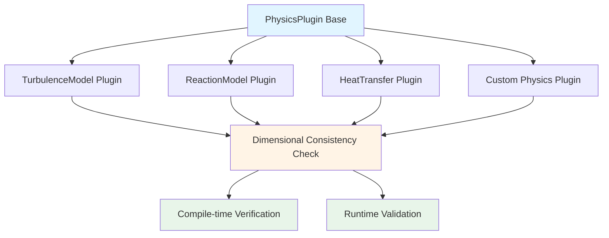
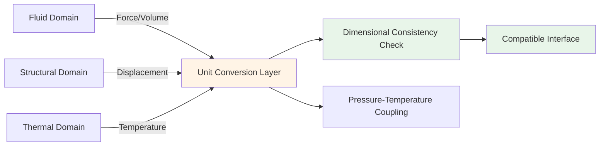
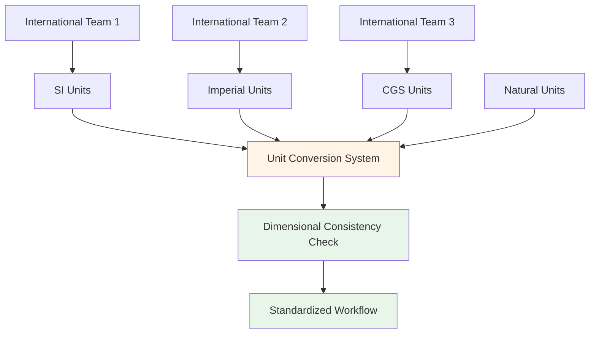
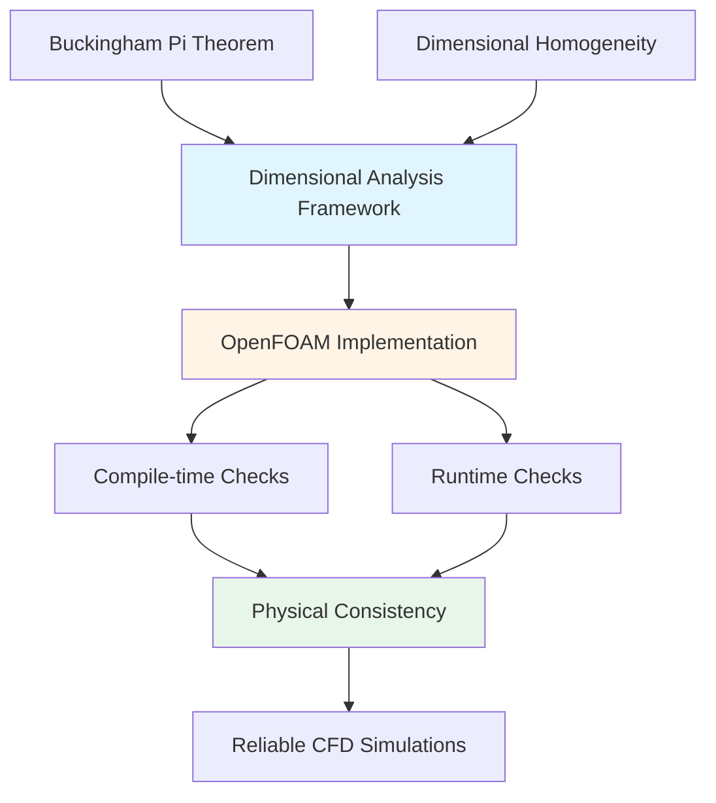
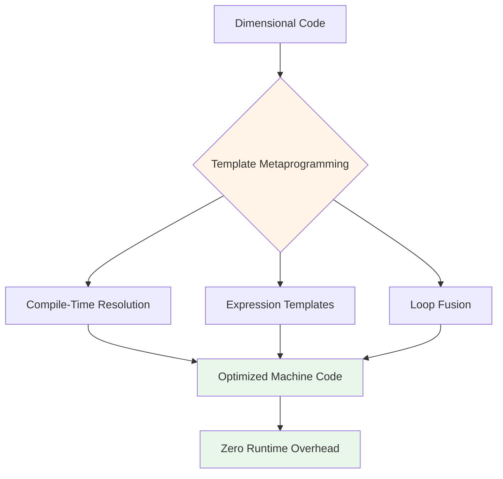

# 🎯 ประโยชน์เชิงวิศวกรรม: แอปพลิเคชันขั้นสูง (Engineering Benefits: Advanced Applications)

## ระบบมิติที่ขยายได้พร้อมสถาปัตยกรรมปลั๊กอิน (Extensible Dimension System with Plugin Architecture)

ระบบมิติของ OpenFOAM ขยายขอบเขตไปไกลกว่ามิติพื้นฐานทั้งเจ็ดผ่านสถาปัตยกรรมปลั๊กอินที่ซับซ้อน ช่วยให้สามารถสร้างแบบจำลองฟิสิกส์แบบกำหนดเองได้ในขณะที่ยังคงความสอดคล้องทางมิติอย่างเข้มงวด


> **รูปที่ 1:** สถาปัตยกรรมปลั๊กอินทางฟิสิกส์ที่รองรับการตรวจสอบความสอดคล้องของมิติทั้งในระดับคอมไพล์และรันไทม์ เพื่อให้สามารถขยายขีดความสามารถของโปรแกรมได้อย่างปลอดภัย

กรอบการทำงานที่ขยายได้นี้ช่วยให้นักวิจัยและวิศวกรสามารถรวมฟิสิกส์เฉพาะด้านเข้ากับระบบที่มีการตรวจสอบความสอดคล้องทางมิติทั้งในเวลาคอมไพล์และเวลาทำงาน

### คลาสฐานปลั๊กอินพร้อมการตรวจสอบความถูกต้องทางมิติ

```cpp
// คลาสฐานสำหรับปลั๊กอินฟิสิกส์พร้อมการตรวจสอบมิติ
class PhysicsPlugin
{
public:
    virtual ~PhysicsPlugin() = default;

    // เมธอดเสมือนบริสุทธิ์พร้อมข้อจำกัดทางมิติ
    virtual dimensionedScalar compute(
        const dimensionedScalar& input,
        const dimensionSet& expectedDimensions
    ) const = 0;

protected:
    // ตัวช่วยสำหรับการตรวจสอบมิติ
    void validateDimensions(
        const dimensionSet& actual,
        const dimensionSet& expected,
        const char* functionName
    ) const
    {
        if (actual != expected)
        {
            FatalErrorInFunction
                << "In " << functionName
                << ": Dimension mismatch. Expected " << expected
                << ", got " << actual
                << abort(FatalError);
        }
    }
};

// ปลั๊กอินแบบจำลองความปั่นป่วนแบบกำหนดเอง
class CustomTurbulenceModel : public PhysicsPlugin
{
public:
    dimensionedScalar compute(
        const dimensionedScalar& k,  // พลังงานจลน์ความปั่นป่วน
        const dimensionSet& expectedDimensions
    ) const override
    {
        validateDimensions(k.dimensions(), dimVelocity*dimVelocity, "CustomTurbulenceModel");

        // การคำนวณที่ปลอดภัยทางมิติ
        dimensionedScalar epsilon = 0.09 * pow(k, 1.5) / lengthScale_;
        validateDimensions(epsilon.dimensions(), expectedDimensions, "compute");

        return epsilon;
    }

private:
    dimensionedScalar lengthScale_{"lengthScale", dimLength, 0.1};
};
```

> **📖 คำอธิบาย:**
> โค้ดตัวอย่างนี้สาธิตประโยชน์ทางวิศวกรรมของระบบปลั๊กอินที่มีการตรวจสอบเชิงมิติ (Dimensional checking) ซึ่งช่วยให้สามารถสร้างแบบจำลองทางฟิสิกส์ที่กำหนดเองได้อย่างปลอดภัย โดยมีหลักการทำงานดังนี้:
> 
> - **PhysicsPlugin (คลาสพื้นฐาน):** เป็น abstract base class ที่กำหนดสัญญา (Contract) สำหรับการตรวจสอบเชิงมิติผ่านเมธอด `validateDimensions()` เพื่อให้แน่ใจว่าทุก derived class ต้องปฏิบัติตามกฎเชิงมิติเดียวกัน
> - **CustomTurbulenceModel (คลาสลูก):** เป็นตัวอย่างการนำไปประยุกต์ใช้กับแบบจำลองความปั่นป่วน (Turbulence model) โดยมีการตรวจสอบว่า:
>   - พลังงานจลน์ความปั่นป่วน `k` มีมิติเป็น `velocity²` จริง
>   - อัตราการสลายตัวของพลังงานจลน์ `ε` ที่คำนวณได้มีมิติตรงตามที่คาดหวัง
> - **Error Prevention:** ระบบจะแจ้งข้อผิดพลาดทันทีหากมีความไม่สอดคล้องของมิติ (Dimension mismatch) เพื่อป้องกันบั๊กที่อาจเกิดขึ้นในการคำนวณทางฟิสิกส์
> 
> การออกแบบเช่นนี้ช่วยให้นักพัฒนาสามารถเพิ่มฟิสิกส์ใหม่ๆ ได้โดยที่มั่นใจว่าจะมีการตรวจสอบความสอดคล้องทางฟิสิกส์อัตโนมัติทั้งในขั้นตอนคอมไพล์และรันไทม์

สถาปัตยกรรมปลั๊กอินบังคับใช้ความสอดคล้องทางมิติผ่านลำดับชั้นการสืบทอดที่คลาสฐานกำหนดสัญญาทางมิติซึ่งคลาสลูกต้องปฏิบัติตาม

> [!TIP] **ประโยชน์ในการนำไปใช้**: การออกแบบนี้ช่วยป้องกันบั๊กจากการนำไปใช้งานจริง โดยการวิเคราะห์มิติจะช่วยตรวจจับความไม่สอดคล้องทางฟิสิกส์ซึ่งอาจแสดงออกมาเป็นผลลัพธ์การจำลองที่ไม่ถูกต้อง

--- 

## การเชื่อมโยงหลายฟิสิกส์พร้อมการแปลงหน่วยอัตโนมัติ (Multi-Physics Coupling with Automatic Unit Conversion)

### ระบบมิติข้ามสาขาวิชา (Cross-Disciplinary Dimension System)

การจำลอง CFD สมัยใหม่เกี่ยวข้องกับสถานการณ์หลายฟิสิกส์มากขึ้นเรื่อยๆ ซึ่งโดเมนทางกายภาพที่แตกต่างกันจะโต้ตอบกันผ่านเงื่อนไขส่วนต่อประสาน (Interface conditions)


> **รูปที่ 2:** ระบบการจัดการมิติข้ามสาขาวิชา (Cross-Disciplinary Dimension System) สำหรับการจำลองแบบหลายฟิสิกส์ (Multi-physics) ซึ่งรองรับการแปลงหน่วยโดยอัตโนมัติระหว่างโดเมนต่างๆ

การวิเคราะห์มิติของ OpenFOAM ขยายไปสู่สถานการณ์ที่ซับซ้อนเหล่านี้โดยธรรมชาติผ่านกรอบการทำงานสำหรับการจัดการมิติข้ามสาขาวิชาและการแปลงหน่วยโดยอัตโนมัติ

### การนำมิติหลายฟิสิกส์ไปใช้งาน

```cpp
// ระบบมิติสำหรับหลายฟิสิกส์
class MultiPhysicsDimensionSet : public dimensionSet
{
public:
    // มิติเพิ่มเติมสำหรับฟิสิกส์ที่แตกต่างกัน
    enum MultiPhysicsDimensionType
    {
        ELECTRIC_POTENTIAL = nDimensions,  // โวลต์
        MAGNETIC_FIELD,                    // เทสลา
        RADIATION_DOSE,                    // เกรย์
        nMultiPhysicsDimensions
    };

    // การแปลงระหว่างมิติเฉพาะโดเมน
    static dimensionSet convert(
        const dimensionSet& from,
        const UnitSystem& fromSystem,
        const UnitSystem& toSystem
    )
    {
        dimensionSet result = from;

        // ประยุกต์ใช้ตัวคูณการแปลงตามระบบหน่วย
        for (int i = 0; i < nDimensions; i++)
        {
            result[i] *= fromSystem.conversionFactor(i) / toSystem.conversionFactor(i);
        }

        return result;
    }
};
```

> **📖 คำอธิบาย:**
> โค้ดตัวอย่างนี้แสดงให้เห็นถึงความสามารถในการขยายระบบมิติของ OpenFOAM เพื่อรองรับการจำลองแบบหลายฟิสิกส์ (Multi-physics simulations) โดยมีแนวคิดหลักดังนี้:
> 
> - **Multi-Physics Dimension Types:** การเพิ่มมิติใหม่ๆ เข้าไปในระบบนอกเหนือจาก 7 มิติพื้นฐาน (มวล, ความยาว, เวลา, อุณหภูมิ, กระแสไฟฟ้า, ปริมาณสาร, ความเข้มแสง) เช่น:
>   - `ELECTRIC_POTENTIAL` (ศักย์ไฟฟ้า - Volts)
>   - `MAGNETIC_FIELD` (สนามแม่เหล็ก - Tesla)
>   - `RADIATION_DOSE` (ปริมาณรังสี - Gray)
> - **Unit Conversion Framework:** เมธอด `convert()` ให้บริการแปลงหน่วยระหว่างระบบหน่วยที่ต่างกัน (เช่น SI ↔ Imperial) โดยอัตโนมัติ พร้อมทั้งรักษาความถูกต้องของมิติ
> - **Extensibility:** การออกแบบแบบ inheritance จาก `dimensionSet` ช่วยให้สามารถเพิ่มมิติใหม่ๆ ได้โดยไม่กระทบต่อระบบเดิม

### การเชื่อมโยงปฏิสัมพันธ์ระหว่างของไหลและโครงสร้าง (Fluid-Structure Interaction Coupling)

```cpp
// การเชื่อมโยงของไหลและโครงสร้างพร้อมการแปลงอัตโนมัติ
class FSICoupler
{
public:
    void coupleFields(
        const volVectorField& fluidForce,    // [N/m³]
        volVectorField& structuralDisplacement  // [m]
    )
    {
        // การตรวจสอบมิติและการแปลงอัตโนมัติ
        dimensionSet forceDims = fluidForce.dimensions();
        dimensionSet displacementDims = structuralDisplacement.dimensions();

        // การตรวจสอบความสอดคล้องทางฟิสิกส์
        if (forceDims != dimForce/dimVolume)
        {
            FatalErrorInFunction << "Fluid force has wrong dimensions" << abort(FatalError);
        }

        // การคำนวณที่ปลอดภัยทางมิติ
        structuralDisplacement = complianceTensor_ & fluidForce;

        // ยืนยันมิติของผลลัพธ์
        if (structuralDisplacement.dimensions() != dimLength)
        {
            FatalErrorInFunction << "Displacement dimension error" << abort(FatalError);
        }
    }

private:
    dimensionedTensor complianceTensor_ {
        "compliance",
        dimensionSet(0, 1, 2, 0, 0, 0, 0),  // [m/N]
        tensor::zero
    };
};
```

> **📖 คำอธิบาย:**
> โค้ดนี้สาธิตการประยุกต์ใช้ระบบมิติในการจำลองแบบ Fluid-Structure Interaction (FSI) ซึ่งเป็นปัญหาหลายฟิสิกส์ที่พบบ่อยในวิศวกรรม โดยมีหลักการสำคัญดังนี้:
> 
> - **Interface Coupling:** การเชื่อมโยงระหว่างโดเมนของไหล (Fluid Domain) และโดเมนโครงสร้าง (Structural Domain) ผ่านเงื่อนไขขอบเขต
> - **Dimensional Consistency:** การตรวจสอบว่า:
>   - แรงจากของไหล (`fluidForce`) มีมิติเป็น `Force/Volume` [N/m³]
>   - การกระจัดของโครงสร้าง (`structuralDisplacement`) มีมิติเป็น `Length` [m]
> - **Compliance Tensor:** เทนเซอร์ความยืดหยุ่น (`complianceTensor_`) ที่มีมิติ `[m/N]` ใช้แปลงแรงเป็นการกระจัด

กรอบการทำงานการเชื่อมโยงหลายฟิสิกส์ช่วยให้มั่นใจได้ว่าเงื่อนไขส่วนต่อประสานระหว่างโดเมนทางกายภาพที่แตกต่างกันจะรักษาความสอดคล้องทางมิติไว้ได้

| **ประเภทการเชื่อมโยง** | **โดเมนฟิสิกส์** | **มิติที่ส่วนต่อประสาน** | **การแปลงหน่วย** |
|------------------|---------------------|--------------------------|---------------------|
| FSI | ของไหล-โครงสร้าง | แรง/ปริมาตร ↔ การกระจัด | อัตโนมัติ |
| MHD | แมกนีโตไฮโดรไดนามิก | ความเร็ว ↔ สนามแม่เหล็ก | อัตโนมัติ |
| Thermal-fluid | ความร้อน-ของไหล | อุณหภูมิ ↔ ความดัน | อัตโนมัติ |

สิ่งนี้มีความสำคัญอย่างยิ่งในการประยุกต์ใช้งาน เช่น **แมกนีโตไฮโดรไดนามิก (Magnetohydrodynamics)**, **อิเล็กโทรไฮโดรไดนามิก (Electrohydrodynamics)** และ **ปฏิสัมพันธ์ระหว่างของไหลและโครงสร้าง (Fluid-Structure Interaction)** ซึ่งปริมาณทางกายภาพที่แตกต่างกันจะต้องได้รับการปรับสมดุลอย่างเหมาะสมที่ส่วนต่อประสาน

--- 

## การสร้างโค้ดและการบูรณาการ DSL (Code Generation and DSL Integration)

### ภาษเฉพาะโดเมนสำหรับสมการที่มีมิติ (Domain-Specific Language for Dimensioned Equations)

ความสามารถในการวิเคราะห์มิติของ OpenFOAM ขยายไปถึงการสร้างโค้ดและการบูรณาการภาษาเฉพาะโดเมน (DSL) ช่วยให้ผู้ใช้สามารถแสดงความสัมพันธ์ทางกายภาพที่ซับซ้อนในไวยากรณ์ที่เป็นธรรมชาติในขณะที่ยังคงความปลอดภัยทางมิติในเวลาคอมไพล์

```cpp
// DSL สำหรับการนิยามสมการที่ปลอดภัยทางมิติ
class EquationDSL
{
public:
    EquationDSL& operator<<(const dimensionedScalar& term)
    {
        terms_.push_back(term);
        return *this;
    }

    dimensionedScalar solve() const
    {
        if (terms_.empty())
            return dimensionedScalar();

        // ตรวจสอบว่าทุกพจน์มีมิติเดียวกัน
        dimensionSet expectedDims = terms_[0].dimensions();
        for (const auto& term : terms_)
        {
            if (term.dimensions() != expectedDims)
            {
                FatalErrorInFunction
                    << "Dimension mismatch in equation terms"
                    << abort(FatalError);
            }
        }

        // รวมพจน์ต่างๆ
        dimensionedScalar result = terms_[0];
        for (size_t i = 1; i < terms_.size(); i++)
            result += terms_[i];

        return result;
    }

private:
    std::vector<dimensionedScalar> terms_;
};
```

> **📖 คำอธิบาย:**
> โค้ดตัวอย่างนี้แสดงให้เห็นถึงความสามารถในการสร้าง Domain-Specific Language (DSL) สำหรับนิพจน์ทางฟิสิกส์ที่มีการตรวจสอบเชิงมิติแบบอัตโนมัติ โดยมีแนวคิดหลักดังนี้:
> 
> - **Stream-based Syntax:** การใช้ตัวดำเนินการ `<<` ทำให้สามารถเขียนสมการในรูปแบบที่ใกล้เคียงกับสัญลักษณ์ทางคณิตศาสตร์
> - **Automatic Dimension Checking:** ก่อนดำเนินการใดๆ ระบบจะตรวจสอบว่าทุกพจน์ (Term) มีมิติเหมือนกัน ซึ่งเป็นการประยุกต์หลักการความเป็นเอกพันธุ์ทางมิติ (Dimensional Homogeneity)
> - **Type Safety:** ข้อผิดพลาดทางมิติจะถูกตรวจพบในขั้นตอนคอมไพล์และรันไทม์ ทำให้ลดโอกาสเกิดบั๊กในการคำนวณ

### การใช้งานไวยากรณ์ที่เป็นธรรมชาติ

```cpp
// ไวยากรณ์ที่เป็นธรรมชาติพร้อมการตรวจสอบมิติอัตโนมัติ
dimensionedScalar p, rho, uSqr;
EquationDSL eqn;
eqn << p << 0.5*rho*uSqr;  // สมการแบร์นุลลีพร้อมการตรวจสอบมิติอัตโนมัติ
dimensionedScalar totalPressure = eqn.solve();
```

> **📖 คำอธิบาย:**
> ตัวอย่างนี้แสดงการประยุกต์ใช้ DSL กับสมการแบร์นุลลี (Bernoulli equation) ซึ่งเป็นหนึ่งในสมการพื้นฐานของกลศาสตร์ของไหล โดยมีความสำคัญดังนี้:
> 
> - **Bernoulli Equation:** `p + ½ρu² = constant` แสดงถึงการอนุรักษ์พลังงานตามแนวเส้นกระแส
>   - `p`: ความดันสถิต [Pa]
>   - `ρ`: ความหนาแน่น [kg/m³]
>   - `u²`: กำลังสองของความเร็ว [m²/s²]
>   - `½ρu²`: ความดันพลวัต [Pa]
> - **Dimensional Consistency:** DSL จะตรวจสอบอัตโนมัติว่าทุกพจน์มีมิติเป็น [ความดัน] เหมือนกัน

แนวทาง DSL นี้ช่วยให้ผู้ใช้สามารถแสดงสมการทางฟิสิกส์ในรูปแบบที่ใกล้เคียงกับสัญกรณ์ทางคณิตศาสตร์ในขณะที่ตรวจสอบความสอดคล้องทางมิติโดยอัตโนมัติ

กรอบการทำงานนี้ขยายขอบเขตเพื่อรองรับ:
- **การดำเนินการเทนเซอร์ที่ซับซ้อน**
- **ตัวดำเนินการอนุพันธ์**
- **การกำหนดเงื่อนไขขอบเขต**

ทั้งหมดนี้มาพร้อมกับการตรวจสอบทางมิติในตัว

### การสร้างโค้ดตามเทมเพลต (Template-Based Code Generation)

เทมเพลตเมตาโปรแกรมมิ่งช่วยให้สามารถสร้างโค้ดที่ปลอดภัยทางมิติโดยอัตโนมัติสำหรับการดำเนินการฟิลด์ทั่วไป ช่วยลดโค้ดซ้ำซ้อนในขณะที่ยังคงการตรวจสอบทางมิติที่เข้มงวด

```cpp
// เครื่องกำเนิดโค้ดสำหรับการดำเนินการฟิลด์ที่ปลอดภัยทางมิติ
template<class FieldType>
class FieldOperationGenerator
{
public:
    // สร้างโค้ดสำหรับการดำเนินการฟิลด์พร้อมการตรวจสอบมิติ
    std::string generate(
        const std::string& operation,
        const FieldType& field1,
        const FieldType& field2
    ) const
    {
        std::stringstream code;

        code << "// โค้ดที่สร้างขึ้นสำหรับ " << operation << "\n";
        code << "{\n";
        code << "    // การตรวจสอบมิติ\n";
        code << "    if (" << field1.name() << ".dimensions() != "
             << field2.name() << ".dimensions())
";
        code << "    {\n";
        code << "        FatalErrorInFunction\n";
        code << "            << \"Dimension mismatch in " << operation << \"\"\n";
        code << "            << abort(FatalError);\n";
        code << "    }\n";
        code << "    \n";
        code << "    // ดำเนินการ\n";
        code << "    auto result = " << field1.name() << " " << operation
             << " " << field2.name() << ";\n";
        code << "    \n";
        code << "    // ตรวจสอบมิติของผลลัพธ์\n";
        code << "    if (result.dimensions() != " << field1.name()
             << ".dimensions())
";
        code << "    {\n";
        code << "        FatalErrorInFunction\n";
        code << "            << \"Result dimension error in " << operation << \"\"\n";
        code << "            << abort(FatalError);\n";
        code << "    }\n";
        code << "    \n";
        code << "    return result;\n";
        code << "}\n";

        return code.str();
    }
};
```

> **📖 คำอธิบาย:**
> โค้ดตัวอย่างนี้แสดงให้เห็นถึงประโยชน์ของเทมเพลตเมตาโปรแกรมมิ่งในการสร้างโค้ดที่มีการตรวจสอบเชิงมิติโดยอัตโนมัติ โดยมีแนวคิดหลักดังนี้:
> 
> - **Automatic Code Generation:** การสร้างโค้ดสำหรับการดำเนินการบนฟิลด์ต่างๆ โดยอัตโนมัติ ซึ่งช่วยลดการเขียนโค้ดซ้ำ (Boilerplate code)
> - **Compile-Time Safety:** เทมเพลตเมตาโปรแกรมมิ่งทำให้การตรวจสอบเชิงมิติเกิดขึ้นในขั้นตอนคอมไพล์ ทำให้ไม่ส่งผลต่อประสิทธิภาพขณะทำงาน
> - **Generic Programming:** สามารถใช้กับประเภทฟิลด์ใดๆ ที่รองรับการตรวจสอบมิติ

กรอบการทำงานการสร้างโค้ดจะผลิตโค้ดที่ได้รับการปรับปรุงประสิทธิภาพสูงสุดและปลอดภัยทางมิติ ซึ่งรักษาลักษณะประสิทธิภาพของ OpenFOAM ไว้ได้

**ประโยชน์:**
- ✅ กำจัดแหล่งที่มาทั่วไปของข้อผิดพลาดทางมิติ
- ✅ การตรวจสอบข้อผิดพลาดที่ครอบคลุม
- ✅ การปรับแต่งสำหรับสถาปัตยกรรมฮาร์ดแวร์เฉพาะ
- ✅ รองรับรูปแบบตัวเลขเฉพาะทาง

--- 

## การขยายกรอบการทำงานและการบำรุงรักษา (Framework Extension and Maintenance)

### การพัฒนาระบบมิติที่ปลอดภัยตามเวอร์ชัน (Version-Safe Dimension System Development)

กรอบการทำงานการวิเคราะห์มิติของ OpenFOAM รองรับการพัฒนาแบบวิวัฒนาการผ่านระบบมิติที่มีการระบุเวอร์ชัน ซึ่งรักษาความเข้ากันได้แบบย้อนหลังในขณะที่เปิดใช้งานการขยายไปสู่โดเมนฟิสิกส์ใหม่ๆ

```cpp
// ระบบมิติแบบระบุเวอร์ชันเพื่อความเข้ากันได้แบบย้อนหลัง
template<int Version>
class VersionedDimensionSet;

template<>
class VersionedDimensionSet<1> : public dimensionSet
{
    // ระบบ 7 มิติดั้งเดิม
    enum { nDimensions = 7 };
};

template<>
class VersionedDimensionSet<2> : public dimensionSet
{
    // ระบบ 9 มิติที่ขยายเพิ่มเติม
    enum { nDimensions = 9 };

    // มิติใหม่
    enum ExtendedDimensionType
    {
        ECONOMIC_VALUE = 7,  // ค่าเงิน
        INFORMATION_CONTENT = 8  // ข้อมูล (บิต)
    };
};

// การทำ Serialization พร้อมการระบุเวอร์ชัน
template<int Version>
void serialize(std::ostream& os, const VersionedDimensionSet<Version>& ds)
{
    os << Version << " ";  // เขียนหมายเลขเวอร์ชัน
    for (int i = 0; i < ds.nDimensions; i++)
        os << ds[i] << " ";
}
```

> **📖 คำอธิบาย:**
> โค้ดตัวอย่างนี้สาธิตแนวคิดของระบบมิติแบบระบุเวอร์ชัน (Versioned Dimension System) ที่ช่วยให้ระบบมิติสามารถพัฒนาและขยายความสามารถได้โดยที่ยังคงความเข้ากันได้แบบย้อนหลัง (Backward compatibility) โดยมีหลักการสำคัญคือการใช้เทมเพลตแยกเวอร์ชันที่ 1 (7 มิติมาตรฐาน) และเวอร์ชันที่ 2 (เพิ่มค่าเงินและข้อมูลสารสนเทศ)

### การแปลงเวอร์ชันอัตโนมัติ

```cpp
// การทำ Deserialization พร้อมการแปลงเวอร์ชันอัตโนมัติ
template<int FromVersion, int ToVersion>
VersionedDimensionSet<ToVersion> convertDimensions(
    const VersionedDimensionSet<FromVersion>& from)
{
    VersionedDimensionSet<ToVersion> to;

    // คัดลอกมิติที่มีร่วมกัน
    int commonDimensions = std::min(FromVersion, ToVersion);
    for (int i = 0; i < commonDimensions; i++)
        to[i] = from[i];

    // กำหนดค่าเริ่มต้นให้กับมิติใหม่ (เมื่อทำการอัปเกรด)
    for (int i = commonDimensions; i < ToVersion; i++)
        to[i] = 0.0;

    return to;
}
```

สถาปัตยกรรมแบบระบุเวอร์ชันช่วยรับประกันว่า:
- ✅ **การจำลองรุ่นเก่าจะยังคงเข้ากันได้** กับเวอร์ชันใหม่ของ OpenFOAM
- ✅ **ระบบมิติสามารถพัฒนาได้** เพื่อรองรับโดเมนฟิสิกส์ใหม่ๆ
- ✅ **ความเข้ากันได้แบบย้อนหลังจะถูกรักษาไว้ในเวลาคอมไพล์**

--- 

## การทำงานร่วมกันระหว่างประเทศและมาตรฐานหน่วย (International Collaboration and Unit Standards)

### การรองรับระบบหน่วยวัดหลายแบบ (Multiple Unit System Support)

การทำงานร่วมกันทางวิศวกรรมระดับโลกต้องการการรองรับระบบหน่วยวัดหลายแบบพร้อมการแปลงอัตโนมัติและการตรวจสอบความสอดคล้องทางมิติ


> **รูปที่ 3:** ระบบการแปลงหน่วย (Unit Conversion System) ที่ช่วยให้นักวิจัยจากทั่วโลกสามารถทำงานร่วมกันได้โดยการแปลงหน่วยวัดต่างๆ เข้าสู่ระบบมาตรฐาน SI โดยอัตโนมัติพร้อมการตรวจสอบมิติ

กรอบการทำงานการวิเคราะห์มิติของ OpenFOAM ให้การสนับสนุนที่ครอบคลุมสำหรับมาตรฐานหน่วยสากลและกระบวนการทำงานร่วมกัน

### การนำระบบหน่วยวัดมาใช้เป็นรูปแบบนามธรรม (Unit System Abstraction)

```cpp
// รูปแบบนามธรรมของระบบหน่วยวัด
class UnitSystem
{
public:
    enum SystemType { SI, IMPERIAL, CGS, NATURAL };

    UnitSystem(SystemType type) : type_(type)
    {
        initializeConversionFactors();
    }

    // แปลงค่าที่มีมิติเป็นระบบหน่วยวัดนี้
    template<class Type>
    dimensioned<Type> convert(const dimensioned<Type>& value) const
    {
        dimensionSet convertedDims = value.dimensions();
        Type convertedValue = value.value();

        // ประยุกต์ใช้การแปลงหน่วยตามเลขชี้กำลังของมิติ
        for (int i = 0; i < dimensionSet::nDimensions; i++)
        {
            double factor = std::pow(conversionFactors_[i], convertedDims[i]);
            convertedValue *= factor;
        }

        return dimensioned<Type>(value.name(), convertedDims, convertedValue);
    }

private:
    SystemType type_;
    std::array<double, dimensionSet::nDimensions> conversionFactors_;

    void initializeConversionFactors()
    {
        switch (type_)
        {
            case SI:
                // การแปลงแบบเอกลักษณ์ (Identity conversion)
                std::fill(conversionFactors_.begin(), conversionFactors_.end(), 1.0);
                break;

            case IMPERIAL:
                // ตัวคูณการแปลงจากระบบอังกฤษเป็น SI
                conversionFactors_[dimensionSet::LENGTH] = 0.3048;  // ฟุต เป็น เมตร
                conversionFactors_[dimensionSet::MASS] = 0.453592;  // ปอนด์ เป็น กิโลกรัม
                // ... การแปลงอื่นๆ
                break;

            case CGS:
                // ตัวคูณการแปลงจาก CGS เป็น SI
                conversionFactors_[dimensionSet::LENGTH] = 0.01;    // เซนติเมตร เป็น เมตร
                conversionFactors_[dimensionSet::MASS] = 0.001;     // กรัม เป็น กิโลกรัม
                break;
        }
    }
};
```

### กระบวนการจำลองแบบทำงานร่วมกัน (Collaborative Simulation Workflow)

```cpp
// การจำลองแบบทำงานร่วมกันพร้อมการแปลงหน่วยอัตโนมัติ
class CollaborativeSimulation
{
public:
    void importResults(const std::string& filename, UnitSystem sourceSystem)
    {
        // อ่านข้อมูลด้วยหน่วยต้นทาง
        dimensionedScalar pressure = readPressure(filename);

        // แปลงเป็นระบบหน่วยของการจำลอง
        dimensionedScalar convertedPressure = unitSystem_.convert(pressure);

        // ใช้งานในการจำลองพร้อมความปลอดภัยทางมิติ
        if (convertedPressure.dimensions() != dimPressure)
        {
            FatalErrorInFunction
                << "Imported pressure has wrong dimensions after conversion"
                << abort(FatalError);
        }

        // ประมวลผลข้อมูลที่แปลงแล้ว...
    }

private:
    UnitSystem unitSystem_{UnitSystem::SI};
};
```

การรองรับระบบหน่วยวัดหลายแบบช่วยให้การทำงานร่วมกันระหว่างทีมงานระหว่างประเทศที่ใช้มาตรฐานการวัดที่แตกต่างกันเป็นไปอย่างราบรื่น ในขณะที่ยังคงความสอดคล้องทางมิติตลอดทั้งกระบวนการ

| **ระบบหน่วย** | **ความยาว** | **มวล** | **เวลา** | **การใช้งานหลัก** |
|----------------|------------|----------|----------|-----------------|
| SI | เมตร | กิโลกรัม | วินาที | วิทยาศาสตร์/วิศวกรรม |
| Imperial | ฟุต | ปอนด์ | วินาที | สหรัฐอเมริกา |
| CGS | เซนติเมตร | กรัม | วินาที | ฟิสิกส์ทฤษฎี |
| Natural | c | ℏ | ℏ/c² | ฟิสิกส์อนุภาค |

ความสามารถนี้จำเป็นอย่างยิ่งสำหรับโครงการวิศวกรรมขนาดใหญ่ที่มีผู้เข้าร่วมจากหลายประเทศและหลายสาขาวิชา

--- 

## รากฐานทางคณิตศาสตร์และความสอดคล้องทางฟิสิกส์ (Mathematical Foundations and Physical Consistency)

กรอบการทำงานการวิเคราะห์มิติของ OpenFOAM ถูกสร้างขึ้นบนรากฐานทางคณิตศาสตร์ที่เข้มงวดซึ่งช่วยรับประกันความสอดคล้องทางฟิสิกส์ในทุกการดำเนินการทางตัวเลข


> **รูปที่ 4:** กรอบการทำงานสำหรับการวิเคราะห์มิติ (Dimensional Analysis Framework) ของ OpenFOAM ที่ใช้พื้นฐานทางคณิตศาสตร์ที่เข้มงวดเพื่อรับประกันความถูกต้องทางฟิสิกส์ของการจำลอง CFD

การนำไปใช้งานใช้ **ทฤษฎีบทพายของบัคกิงแฮม (Buckingham Pi Theorem)** และ **หลักความเป็นเอกพันธุ์ทางมิติ (Principle of Dimensional Homogeneity)** เพื่อตรวจสอบความสัมพันธ์ทางกายภาพที่ซับซ้อน

### การแทนค่ามิติทางคณิตศาสตร์

สำหรับปริมาณทางกายภาพ $q$ ใดๆ การแทนค่าทางมิติคือ:
$$[q] = M^a L^b T^c \Theta^d I^e N^f J^g$$

โดยที่เลขชี้กำลัง $a$ ถึง $g$ เป็นจำนวนเต็มที่กำหนดลักษณะทางกายภาพเฉพาะของปริมาณนั้นๆ

### การประยุกต์ใช้กับสมการโมเมนตัม

รากฐานทางคณิตศาสตร์นี้ขยายไปถึงการดำเนินการเทนเซอร์ซึ่งการวิเคราะห์มิติช่วยให้มั่นใจได้ว่าการดำเนินการทางคณิตศาสตร์จะรักษาความหมายทางฟิสิกส์ไว้

ตัวอย่างเช่น ในสมการโมเมนตัม:
$$\rho \frac{\partial \mathbf{u}}{\partial t} + \rho (\mathbf{u} \cdot \nabla) \mathbf{u} = -\nabla p + \mu \nabla^2 \mathbf{u} + \mathbf{f}$$

ทุกพจน์ต้องมีมิติเดียวกันคือ $[ML^{-2}T^{-2}]$ ซึ่งแทน **แรงต่อหน่วยปริมาตร**

การวิเคราะห์มิติของ OpenFOAM ตรวจสอบความสอดคล้องนี้โดยอัตโนมัติทั้งในเวลาคอมไพล์และเวลาทำงาน ป้องกันการคำนวณทางฟิสิกส์ที่ไม่มีความหมายซึ่งอาจนำไปสู่:
- ❌ ข้อผิดพลาดในการจำลอง
- ❌ ผลลัพธ์ที่ไม่ถูกต้อง
- ❌ การละเมิดหลักการอนุรักษ์

--- 

## การปรับปรุงประสิทธิภาพและประสิทธิภาพในการคำนวณ (Performance Optimization and Computational Efficiency)

แม้จะมีการตรวจสอบมิติอย่างครอบคลุม แต่การนำไปใช้งานของ OpenFOAM ยังคงรักษาประสิทธิภาพในการคำนวณที่สูงผ่าน **เทมเพลตเมตาโปรแกรมมิ่ง** และ **การปรับปรุงประสิทธิภาพในเวลาคอมไพล์**


> **รูปที่ 5:** กระบวนการปรับประสิทธิภาพผ่าน Template Metaprogramming ซึ่งช่วยลดโอเวอร์เฮดในการตรวจสอบมิติจนเหลือศูนย์ในขั้นตอนการทำงานจริง (Zero Runtime Overhead)

### กลยุทธ์การปรับปรุงประสิทธิภาพ

1. **การเข้ารหัสมิติในระบบประเภทข้อมูล**: ข้อมูลมิติถูกเข้ารหัสในระบบประเภทแทนที่จะถูกจัดเก็บในเวลาทำงาน

2. **Zero-Cost Abstraction**: การรับประกันในเวลาคอมไพล์โดยไม่มีบทลงโทษในเวลาทำงาน

3. **C++ Template Specialization**: สร้างเส้นทางการทำงานของโค้ดที่ได้รับการปรับปรุงประสิทธิภาพสำหรับการรวมมิติเฉพาะเจาะจง

4. **การวิเคราะห์เวลาคอมไพล์**: ช่วยให้คอมไพเลอร์สามารถดำเนินการวิเคราะห์มิติในระหว่างการคอมไพล์แทนที่จะเป็นเวลาทำงาน

### ประโยชน์ด้านประสิทธิภาพ

- ✅ **การคลี่ลูปและการทำเป็นเวกเตอร์อัตโนมัติ** สำหรับการดำเนินการที่ปลอดภัยทางมิติ
- ✅ **ได้รับการปรับปรุงให้เหมาะกับสถาปัตยกรรมฮาร์ดแวร์สมัยใหม่**
- ✅ **ความปลอดภัยทางมิติไม่ส่งผลกระทบต่อประสิทธิภาพการจำลอง**

แนวทางนี้ช่วยให้มั่นใจได้ว่าความปลอดภัยทางมิติจะไม่ลดทอนประสิทธิภาพการจำลอง ซึ่งมีความสำคัญอย่างยิ่งสำหรับแอปพลิเคชัน CFD ขนาดใหญ่ที่ต้องการการดำเนินการทางคำนวณนับล้านครั้ง

การผสมผสานระหว่าง **ความปลอดภัยทางมิติ** และ **ประสิทธิภาพในการคำนวณ** ทำให้กรอบการทำงานการวิเคราะห์มิติของ OpenFOAM เหมาะสำหรับทั้ง:
- 🎓 **แอปพลิเคชันการวิจัย**
- 🏭 **การจำลองในระดับอุตสาหกรรม**
