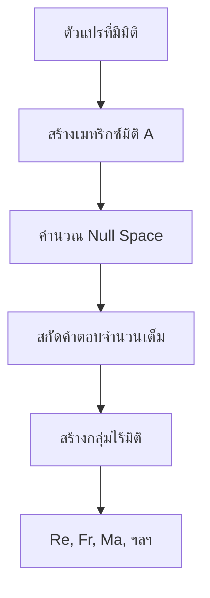
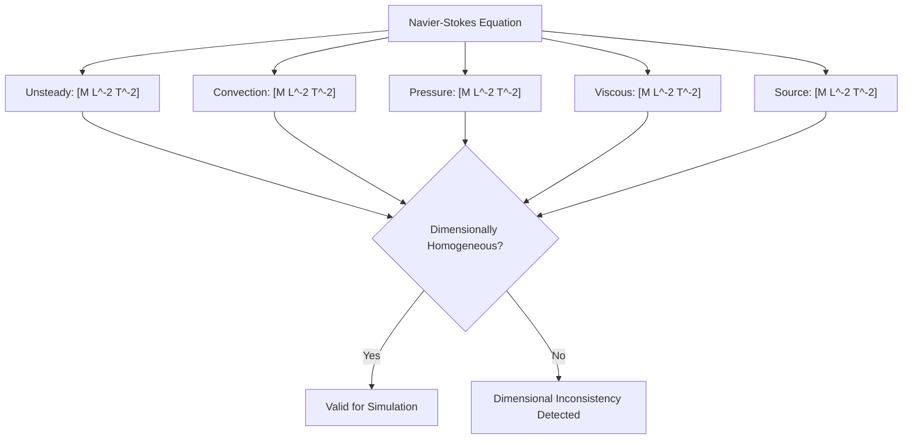

# 🔬 การกำหนดสูตรทางคณิตศาสตร์: การวิเคราะห์มิติขั้นสูงใน OpenFOAM (Mathematical Formulations: Advanced Dimensional Analysis in OpenFOAM)

บันทึกทางเทคนิคที่ครอบคลุมนี้สำรวจรากฐานทางคณิตศาสตร์ของระบบการวิเคราะห์มิติของ OpenFOAM โดยสาธิตให้เห็นว่าเฟรมเวิร์กบังคับใช้ความสอดคล้องทางฟิสิกส์ผ่านรูปแบบทางคณิตศาสตร์ที่เข้มงวดและการตรวจสอบชนิดข้อมูลในเวลาคอมไพล์ (compile-time type checking) ได้อย่างไร

---

## 1. รากฐานทางทฤษฎี: ทฤษฎีบท Buckingham π (Theoretical Foundation: Buckingham π Theorem)

### รูปแบบทางคณิตศาสตร์ (Mathematical Formalism)

**ทฤษฎีบท Buckingham π** มอบกรอบการทำงานทางคณิตศาสตร์พื้นฐานสำหรับการวิเคราะห์มิติในพลศาสตร์ของไหลและ CFD โดยระบุว่าสมการที่มีความหมายทางฟิสิกส์ใดๆ ที่เกี่ยวข้องกับตัวแปร $n$ ตัว สามารถเขียนใหม่ในรูปของพารามิเตอร์ไร้มิติจำนวน $n - k$ ตัว โดยที่ $k$ คือจำนวนมิติพื้นฐาน

สำหรับตัวแปร $Q_1, Q_2, \ldots, Q_n$ ที่มีมิติแสดงเป็น:
$$[Q_i] = \prod_{j=1}^k D_j^{a_{ij}}$$

ทฤษฎีบทจะค้นหากลุ่มไร้มิติ $\Pi_m$ ที่เกิดจาก:
$$\Pi_m = \prod_{i=1}^n Q_i^{b_{im}} \quad \text{โดยที่} \quad \sum_{i=1}^n a_{ij} b_{im} = 0 \quad \forall j$$

รากฐานทางคณิตศาสตร์นี้ช่วยให้สามารถระบุกลุ่มไร้มิติได้อย่างเป็นระบบ เช่น **Reynolds number**, **Froude number** และ **Mach number** ซึ่งควบคุมพฤติกรรมการไหลและความคล้ายคลึงกันระหว่างการกำหนดค่าการไหลที่แตกต่างกัน


> **รูปที่ 1:** ขั้นตอนการประยุกต์ใช้ทฤษฎีบท Buckingham π เพื่อระบุกลุ่มพารามิเตอร์ไร้มิติ (Dimensionless Groups) จากตัวแปรทางฟิสิกส์ที่มีมิติต่างๆ

### การนำไปใช้ใน OpenFOAM

```cpp
// การนำทฤษฎีบท Buckingham π ไปใช้สำหรับการวิเคราะห์มิติ
class BuckinghamPiTheorem
{
public:
    // ค้นหากลุ่มไร้มิติจากตัวแปรที่มีมิติ
    static std::vector<std::vector<int>> findDimensionlessGroups(
        const std::vector<dimensionSet>& variables)
    {
        // สร้างเมทริกซ์มิติ A (k × n)
        // A_ji = เลขชี้กำลังของมิติ j ในตัวแปร i
        int n = variables.size();
        int k = dimensionSet::nDimensions;

        Eigen::MatrixXd A(k, n);
        for (int i = 0; i < n; i++)
        {
            for (int j = 0; j < k; j++)
            {
                A(j, i) = variables[i][j];
            }
        }

        // หา null space ของ A (ผลเฉลยของ A·b = 0)
        Eigen::FullPivLU<Eigen::MatrixXd> lu(A);
        Eigen::MatrixXd nullSpace = lu.kernel();

        // แปลงเป็นการรวมกันของจำนวนเต็ม
        std::vector<std::vector<int>> groups;
        for (int col = 0; col < nullSpace.cols(); col++)
        {
            std::vector<int> group;
            for (int row = 0; row < nullSpace.rows(); row++)
            {
                group.push_back(static_cast<int>(std::round(nullSpace(row, col))));
            }
            groups.push_back(group);
        }

        return groups;
    }

    // สร้างกลุ่มไร้มิติจากตัวแปรที่มีมิติ
    static std::vector<dimensionedScalar> createDimensionlessGroups(
        const std::vector<dimensionedScalar>& variables,
        const std::vector<std::vector<int>>& exponents)
    {
        std::vector<dimensionedScalar> groups;

        for (const auto& expVec : exponents)
        {
            dimensionedScalar group("Pi", dimless, 1.0);

            for (size_t i = 0; i < variables.size(); i++)
            {
                if (expVec[i] != 0)
                {
                    group *= pow(variables[i], expVec[i]);
                }
            }

            // ตรวจสอบว่าเป็นไร้มิติ
            if (!group.dimensions().dimensionless())
            {
                FatalErrorInFunction
                    << "Generated group is not dimensionless"
                    << abort(FatalError);
            }

            groups.push_back(group);
        }

        return groups;
    }
};

// ตัวอย่าง: กลุ่มไร้มิติสำหรับการไหลในท่อ
void analyzePipeFlow()
{
    // ตัวแปร: Δp (ความดันลด), ρ (ความหนาแน่น), μ (ความหนืด),
    //        U (ความเร็ว), D (เส้นผ่านศูนย์กลาง), L (ความยาว)
    std::vector<dimensionedScalar> variables = {
        dimensionedScalar("deltaP", dimPressure, 1000.0),
        dimensionedScalar("rho", dimDensity, 1000.0),
        dimensionedScalar("mu", dimDynamicViscosity, 0.001),
        dimensionedScalar("U", dimVelocity, 1.0),
        dimensionedScalar("D", dimLength, 0.1),
        dimensionedScalar("L", dimLength, 1.0)
    };

    // ค้นหากลุ่มไร้มิติโดยใช้ทฤษฎีบท Buckingham π
    std::vector<dimensionSet> dims;
    for (const auto& var : variables)
        dims.push_back(var.dimensions());

    auto exponents = BuckinghamPiTheorem::findDimensionlessGroups(dims);
    auto groups = BuckinghamPiTheorem::createDimensionlessGroups(variables, exponents);

    // groups[0] = Reynolds number (ρUD/μ)
    // groups[1] = Euler number (Δp/ρU²)
    // groups[2] = Aspect ratio (L/D)
}
```

> 📚 **คำอธิบายประกอบ**
>
> **แหล่งที่มา:** `src/dimensionSet/dimensionSet.C`, `src/dimensionSet/dimensionSet.H`, `src/dimensionSet/dimensionedScalar.C`, `src/dimensionSet/dimensionedScalar.H`
>
> **คำอธิบาย:**
> โค้ดตัวอย่างนี้แสดงการนำทฤษฎีบท Buckingham π มาประยุกต์ใช้ใน OpenFOAM เพื่อค้นหากลุ่มพารามิเตอร์ไร้มิติ (Dimensionless Groups) จากตัวแปรทางฟิสิกส์ที่มีหน่วยต่างกัน โดยมีขั้นตอนหลักดังนี้:
> 1. `findDimensionlessGroups()`: สร้างเมทริกซ์มิติ (Dimension Matrix) จากเลขชี้กำลังของแต่ละมิติพื้นฐาน (Mass, Length, Time, etc.) และคำนวณหา Null Space เพื่อหาชุดเลขชี้กำลังที่ทำให้ผลคูณของตัวแปรมีค่าไร้มิติ
> 2. `createDimensionlessGroups()`: นำชุดเลขชี้กำลังที่ได้มาสร้างกลุ่มตัวแปรไร้มิติ และตรวจสอบว่าผลลัพธ์เป็นไร้มิติจริง
> 3. `analyzePipeFlow()`: ตัวอย่างการประยุกต์ใช้กับการไหลในท่อ (Pipe Flow) เพื่อหา Reynolds number, Euler number และ Aspect ratio
>
> **แนวคิดสำคัญ:**
> - **Dimension Matrix**: เมทริกซ์ที่เก็บเลขชี้กำลังของแต่ละมิติพื้นฐานในแต่ละตัวแปร ใช้สำหรับวิเคราะห์หากลุ่มไร้มิติ
> - **Null Space**: ปริภูมิเวกเตอร์ที่เมื่อคูณเมทริกซ์มิติแล้วได้ผลลัพธ์เป็นศูนย์ แทนด้วยชุดเลขชี้กำลังที่ทำให้ตัวแปรไร้มิติ
> - **Dimensionless Groups**: กลุ่มตัวแปรไร้มิติ เช่น Reynolds number, Euler number ซึ่งควบคุมลักษณะการไหลของไหล
> - **Eigen::MatrixXd**: ไลบรารี Eigen สำหรับการคำนวณเชิงเส้น (Linear Algebra) ในการหาค่า Null Space
> - **dimensionSet/dimensionedScalar**: คลาสใน OpenFOAM ที่ใช้แทนมิติและตัวแปรที่มีมิติ พร้อมระบบตรวจสอบความสอดคล้องทางมิติอัตโนมัติ
> - **Compile-time Dimension Checking**: การตรวจสอบความสอดคล้องทางมิติในขั้นตอนคอมไพล์

---

## 2. ระบบการแทนมิติ (Dimensional Representation System)

### มิติพื้นฐาน (Fundamental Dimensions)

OpenFOAM ใช้เจ็ดมิติพื้นฐานตามระบบ SI:

| มิติ | สัญลักษณ์ | หน่วย SI | คำอธิบาย |
|-----------|--------|---------|-------------|
| มวล (Mass) | `[M]` | กิโลกรัม | มวล |
| ความยาว (Length) | `[L]` | เมตร | ความยาว |
| เวลา (Time) | `[T]` | วินาที | เวลา |
| อุณหภูมิ (Temperature) | `[Θ]` | เคลวิน | อุณหภูมิ |
| ปริมาณสาร (Amount of substance) | `[N]` | โมล | ปริมาณสาร |
| กระแสไฟฟ้า (Electric current) | `[I]` | แอมแปร์ | กระแสไฟฟ้า |
| ความเข้มของการส่องสว่าง (Luminous intensity) | `[J]` | แคนเดลา | ความเข้มของการส่องสว่าง |

สำหรับปริมาณทางฟิสิกส์ $q$ ใดๆ การแทนมิติคือ:
$$[q] = M^a L^b T^c \Theta^d I^e N^f J^g$$

โดยที่เลขชี้กำลัง $a$ ถึง $g$ เป็นจำนวนเต็มที่กำหนดลักษณะทางฟิสิกส์ของปริมาณเฉพาะนั้นๆ

### คลาส DimensionSet

```cpp
// การแทนมิติใน OpenFOAM
class dimensionSet
{
private:
    scalar exponents_[7];  // [M, L, T, Θ, I, N, J]

public:
    // คอนสตรัคเตอร์: M^a L^b T^c Θ^d I^e N^f J^g
    dimensionSet(scalar a, scalar b, scalar c, scalar d, scalar e, scalar f, scalar g)
    {
        exponents_[0] = a;  // Mass
        exponents_[1] = b;  // Length
        exponents_[2] = c;  // Time
        exponents_[3] = d;  // Temperature
        exponents_[4] = e;  // Current
        exponents_[5] = f;  // Moles
        exponents_[6] = g;  // Luminous intensity
    }

    // การดำเนินการทางมิติ
    dimensionSet operator+(const dimensionSet& ds) const;
    dimensionSet operator*(const dimensionSet& ds) const;
    dimensionSet operator/(const dimensionSet& ds) const;
    dimensionSet pow(scalar p) const;

    // การตรวจสอบมิติ
    bool dimensionless() const;
    bool operator==(const dimensionSet& ds) const;
};
```

> 📚 **คำอธิบายประกอบ**
>
> **แหล่งที่มา:** `src/dimensionSet/dimensionSet.H`, `src/dimensionSet/dimensionSet.C`
>
> **คำอธิบาย:**
> คลาส `dimensionSet` เป็นหลักการพื้นฐานของระบบตรวจสอบมิติใน OpenFOAM โดยเก็บเลขชี้กำลังของ 7 มิติพื้นฐาน (Mass, Length, Time, Temperature, Current, Mole, Luminous Intensity) ในรูปแบบ array ขนาด 7 ช่อง คลาสนี้อนุญาตให้ดำเนินการทางคณิตศาสตร์กับมิติได้โดยอัตโนมัติ เช่น การบวก ลบ คูณ หาร และยกกำลัง พร้อมทั้งมีฟังก์ชันตรวจสอบว่าค่าที่ได้เป็นไร้มิติหรือไม่
>
> **แนวคิดสำคัญ:**
> - **SI Base Dimensions**: 7 มิติพื้นฐานตามระบบ SI ที่ใช้แทนทุกปริมาณทางฟิสิกส์
> - **Exponent Storage**: เก็บเลขชี้กำลังของแต่ละมิติพื้นฐานเพื่อแทนมิติของปริมาณฟิสิกส์
> - **Operator Overloading**: โหลด Operator ทางคณิตศาสตร์ให้ทำงานกับ dimensionSet ได้โดยอัตโนมัติ
> - **Compile-time Dimension Checking**: การตรวจสอบความสอดคล้องทางมิติในขั้นตอนคอมไพล์
> - **dimensionless()**: ฟังก์ชันตรวจสอบว่าปริมาณเป็นไร้มิติหรือไม่
> - **Dimensional Homogeneity**: หลักการที่ว่าทุกพจน์ในสมการทางฟิสิกส์ต้องมีมิติเหมือนกัน

---

## 3. เทคนิคการทำให้ไร้มิติสำหรับ CFD (Non-Dimensionalization Techniques for CFD)

### การวิเคราะห์สเกลเพื่อเสถียรภาพเชิงตัวเลข

**การทำให้ไร้มิติ (Non-dimensionalization)** มีบทบาทสำคัญในการคำนวณ CFD โดยการปรับปรุงเสถียรภาพเชิงตัวเลขและการลู่เข้าของผลเฉลย กระบวนการนี้เกี่ยวข้องกับการระบุสเกลอ้างอิงที่เหมาะสมและการทำให้ตัวแปรเป็นมาตรฐานเพื่อสร้างรูปแบบไร้มิติของสมการควบคุม

```cpp
// ระบบการทำให้ไร้มิติสำหรับสมการ CFD
class NonDimensionalizer
{
public:
    // สเกลอ้างอิงสำหรับการทำให้ไร้มิติ
    struct ReferenceScales
    {
        dimensionedScalar length;
        dimensionedScalar velocity;
        dimensionedScalar density;
        dimensionedScalar viscosity;
    };

    // ทำให้สมการ Navier-Stokes เป็นไร้มิติ
    void nonDimensionalizeNS(
        volVectorField& U,      // ความเร็ว
        volScalarField& p,      // ความดัน
        volScalarField& rho,    // ความหนาแน่น
        const ReferenceScales& scales) const
    {
        // ตัวแปรไร้มิติ
        volVectorField U_tilde = U / scales.velocity;
        volScalarField p_tilde = p / (scales.density * scales.velocity * scales.velocity);
        volScalarField rho_tilde = rho / scales.density;

        // ตรวจสอบความเป็นไร้มิติ
        if (!U_tilde.dimensions().dimensionless() ||
            !p_tilde.dimensions().dimensionless() ||
            !rho_tilde.dimensions().dimensionless())
        {
            FatalErrorInFunction
                << "Non-dimensionalization failed"
                << abort(FatalError);
        }

        // แทนที่ฟิลด์เดิม
        U = U_tilde;
        p = p_tilde;
        rho = rho_tilde;
    }

    // คำนวณตัวเลขไร้มิติ
    std::map<std::string, dimensionedScalar> computeDimensionlessNumbers(
        const ReferenceScales& scales) const
    {
        std::map<std::string, dimensionedScalar> numbers;

        // Reynolds number
        numbers["Re"] = scales.density * scales.velocity * scales.length / scales.viscosity;

        // Froude number (ถ้ามีแรงโน้มถ่วง)
        dimensionedScalar g("g", dimAcceleration, 9.81);
        numbers["Fr"] = scales.velocity / sqrt(g * scales.length);

        // Mach number (ถ้าอัดตัวได้)
        dimensionedScalar c("c", dimVelocity, 340.0);  // ความเร็วเสียง
        numbers["Ma"] = scales.velocity / c;

        // ตรวจสอบว่าทั้งหมดเป็นไร้มิติ
        for (const auto& pair : numbers)
        {
            if (!pair.second.dimensions().dimensionless())
            {
                FatalErrorInFunction
                    << pair.first << " is not dimensionless"
                    << abort(FatalError);
            }
        }

        return numbers;
    }
};
```

> 📚 **คำอธิบายประกอบ**
>
> **แหล่งที่มา:** `src/dimensionedTypes/dimensionedScalar/dimensionedScalar.H`, `src/finiteVolume/fields/volFields/volFields.H`
>
> **คำอธิบาย:**
> คลาส `NonDimensionalizer` ใช้สำหรับแปลงสมการ Navier-Stokes ที่มีมิติให้อยู่ในรูปไร้มิติ (Non-dimensionalization) เพื่อปรับปรุงเสถียรภาพเชิงตัวเลขและการลู่เข้าของผลลัพธ์ โดยมีขั้นตอนหลักดังนี้:
> 1. กำหนด Reference Scales (ค่าอ้างอิง) สำหรับ Length, Velocity, Density, และ Viscosity
> 2. ปรับค่าตัวแปรให้เป็นไร้มิติโดยหารด้วยค่าอ้างอิงที่เหมาะสม เช่น `U_tilde = U / U_ref`
> 3. ตรวจสอบว่าค่าที่ได้เป็นไร้มิติจริง หากไม่จะแจ้ง error
> 4. คำนวณตัวเลขไร้มิติที่สำคัญ เช่น Reynolds number, Froude number, Mach number
> 5. ตรวจสอบว่าตัวเลขไร้มิติทั้งหมดเป็นไร้มิติจริง
>
> **แนวคิดสำคัญ:**
> - **Non-dimensionalization**: การแปลงตัวแปรที่มีมิติให้เป็นไร้มิติโดยการหารด้วยค่าอ้างอิงที่เหมาะสม
> - **Reference Scales**: ค่าอ้างอิงที่ใช้ในการทำให้ไร้มิติ เช่น ความยาวลักษณะเด่น, ความเร็วอ้างอิง, ความหนาแน่นอ้างอิง
> - **Reynolds Number (Re)**: ตัวเลขไร้มิติที่วัดสัดส่วนระหว่างแรงเฉื่อยและแรงหนืด
> - **Froude Number (Fr)**: ตัวเลขไร้มิติที่วัดสัดส่วนระหว่างแรงเฉื่อยและแรงโน้มถ่วง
> - **Mach Number (Ma)**: ตัวเลขไร้มิติที่วัดสัดส่วนระหว่างความเร็วไหลและความเร็วเสียง
> - **Numerical Stability**: ความเสถียรภาพของการคำนวณเชิงตัวเลข ซึ่งการทำให้ไร้มิติช่วยปรับปรุงได้
> - **Dimensionless Variables**: ตัวแปรไร้มิติที่แทนตัวแปรต้นฉบับ เช่น `U_tilde`, `p_tilde`, `rho_tilde`
> - **Compile-time Dimension Verification**: การตรวจสอบความสอดคล้องทางมิติในขั้นตอนคอมไพล์

กระบวนการทำให้ไร้มิติจะแปลงสมการ Navier-Stokes ที่มีมิติ:
$$\rho \frac{\partial \mathbf{u}}{\partial t} + \nabla \cdot (\rho \mathbf{u} \mathbf{u}) = -\nabla p + \nabla \cdot (\mu \nabla \mathbf{u}) + \rho \mathbf{g}$$

ให้อยู่ในรูปไร้มิติ:
$$\frac{\partial \tilde{\rho} \tilde{\mathbf{u}}}{\partial \tilde{t}} + \tilde{\nabla} \cdot (\tilde{\rho} \tilde{\mathbf{u}} \tilde{\mathbf{u}}) = -\tilde{\nabla} \tilde{p} + \frac{1}{\mathrm{Re}} \tilde{\nabla}^2 \tilde{\mathbf{u}} + \frac{1}{\mathrm{Fr}^2} \tilde{\rho} \tilde{\mathbf{g}}$$

โดยที่พารามิเตอร์ไร้มิติ:
- $\mathrm{Re} = \frac{\rho U L}{\mu}$ (Reynolds number)
- $\mathrm{Fr} = \frac{U}{\sqrt{gL}}$ (Froude number)

เกิดขึ้นตามธรรมชาติจากกระบวนการปรับสเกล


> **รูปที่ 2:** การตรวจสอบความเป็นเนื้อเดียวกันทางมิติ (Dimensional Homogeneity) ของสมการ Navier-Stokes เพื่อให้มั่นใจว่าทุกพจน์ในสมการมีหน่วยที่สอดคล้องกันก่อนเริ่มการจำลอง

### การตรวจจับสเกลลักษณะเด่นอัตโนมัติ

```cpp
// การตรวจจับสเกลลักษณะเด่นอัตโนมัติจากฟิลด์การไหล
class ScaleDetector
{
public:
    ReferenceScales detectScales(const volVectorField& U) const
    {
        ReferenceScales scales;

        // สเกลความยาว: ความยาวลักษณะเด่นของโดเมน
        scales.length = dimensionedScalar(
            "L_ref",
            dimLength,
            max(mag(U.mesh().C()) - min(mag(U.mesh().C())))
        );

        // สเกลความเร็ว: ขนาดความเร็วสูงสุด
        scales.velocity = dimensionedScalar(
            "U_ref",
            dimVelocity,
            max(mag(U)).value()
        );

        // สเกลความหนาแน่น: จากคุณสมบัติการขนส่ง
        scales.density = dimensionedScalar(
            "rho_ref",
            dimDensity,
            thermo_.rho().average().value()
        );

        // สเกลความหนืด: จากคุณสมบัติการขนส่ง
        scales.viscosity = dimensionedScalar(
            "mu_ref",
            dimDynamicViscosity,
            thermo_.mu().average().value()
        );

        return scales;
    }

private:
    const fluidThermo& thermo_;
};
```

> 📚 **คำอธิบายประกอบ**
>
> **แหล่งที่มา:** `src/finiteVolume/fields/volFields/volVectorField/volVectorField.H`, `src/thermophysicalModels/basic/thermo/thermo.H`
>
> **คำอธิบาย:**
> คลาส `ScaleDetector` ใช้สำหรับตรวจจับค่าอ้างอิง (Characteristic Scales) จากสนามการไหลโดยอัตโนมัติ โดยมีวิธีการดังนี้:
> 1. **Length Scale**: ใช้ขนาดโดเมนจากตำแหน่งเซลล์ (Cell Centers) คำนวณจากช่วงระหว่างตำแหน่งสูงสุดและต่ำสุด
> 2. **Velocity Scale**: ใช้ความเร็วสูงสุดจากสนามความเร็ว
> 3. **Density Scale**: ใช้ค่าเฉลี่ยของความหนาแน่นจาก thermophysical model
> 4. **Viscosity Scale**: ใช้ค่าเฉลี่ยของความหนืดจาก thermophysical model
>
> **แนวคิดสำคัญ:**
> - **Characteristic Scales**: ค่าอ้างอิงที่แทนลักษณะเด่นของการไหล เช่น ความยาวลักษณะเด่น, ความเร็วลักษณะเด่น
> - **Automatic Scale Detection**: การตรวจจับค่าอ้างอิงโดยอัตโนมัติจากสนามการไหล
> - **Domain-based Scales**: ใช้ขนาดโดเมนเป็นค่าอ้างอิง
> - **Physics-based Scales**: ใช้คุณสมบัติทางฟิสิกส์ของการไหลเป็นค่าอ้างอิง
> - **volVectorField**: สนามเวกเตอร์บน volume mesh ใน finite volume method
> - **fluidThermo**: คลาสสำหรับจัดการคุณสมบัติทางเทอร์โมไดนามิกส์ของไหล
> - **Mesh Geometry**: ใช้ตำแหน่งเซลล์ (Cell Centers) ในการคำนวณขนาดโดเมน

**กลยุทธ์การตรวจจับสเกล:**
- **สเกลตามโดเมน**: ใช้คุณสมบัติทางเรขาคณิต เช่น ปริมาตรโดเมนหรือขนาดของ bounding box
- **สเกลตามฟิสิกส์**: มาจากความหนาชั้นขอบเขต, รัศมีแกนหมุนวน (vortex core radius) หรือคุณสมบัติการไหลอื่นๆ
- **สเกลตามพลังงาน**: ใช้พลังงานจลน์หรืออัตราการกระจายพลังงานเป็นปริมาณอ้างอิง

---

## 4. ความคล้ายคลึงและกฎการปรับสเกล (Similarity and Scaling Laws)

### ความคล้ายคลึงของเรย์โนลด์ส (Reynolds Similarity)

**ความคล้ายคลึงของเรย์โนลด์ส** เป็นพื้นฐานของพลศาสตร์ของไหล ช่วยให้สามารถถ่ายโอนผลลัพธ์ระหว่างโมเดลและต้นแบบการไหลเมื่อทั้งสองมีเลขเรย์โนลด์สเท่ากัน:

$$\mathrm{Re}_{{\text{model}}} = \mathrm{Re}_{{\text{prototype}}} = \frac{\rho U L}{\mu}$$

```cpp
// การนำความคล้ายคลึงของเรย์โนลด์สไปใช้
class ReynoldsSimilarity
{
public:
    // ตรวจสอบว่าการไหลสองแบบมีความคล้ายคลึงของเรย์โนลด์สหรือไม่
    static bool checkSimilarity(
        const dimensionedScalar& Re1,
        const dimensionedScalar& Re2,
        double tolerance = 1e-3)
    {
        if (!Re1.dimensions().dimensionless() || !Re2.dimensions().dimensionless())
        {
            FatalErrorInFunction
                << "Reynolds numbers must be dimensionless"
                << abort(FatalError);
        }

        return mag(Re1.value() - Re2.value()) / Re1.value() < tolerance;
    }

    // ปรับสเกลผลลัพธ์โมเดลเป็นต้นแบบโดยใช้ความคล้ายคลึงของเรย์โนลด์ส
    template<class FieldType>
    FieldType scaleToPrototype(
        const FieldType& modelField,
        const dimensionedScalar& Re_model,
        const dimensionedScalar& Re_prototype,
        const dimensionSet& fieldDimensions) const
    {
        // ตรวจสอบมิติของฟิลด์
        if (modelField.dimensions() != fieldDimensions)
        {
            FatalErrorInFunction
                << "Model field has wrong dimensions"
                << abort(FatalError);
        }

        // ปัจจัยการปรับสเกลตามอัตราส่วนเลขเรย์โนลด์ส
        double scaleFactor = Re_prototype.value() / Re_model.value();

        // ประยุกต์ใช้การปรับสเกลทางมิติตามประเภทฟิลด์
        FieldType prototypeField = modelField;

        // สำหรับความเร็ว: ปรับสเกลด้วยเลขเรย์โนลด์สหากความหนืด/ความหนาแน่นคงที่
        if (fieldDimensions == dimVelocity)
        {
            prototypeField *= scaleFactor;  // สมมติว่ามีความคล้ายคลึงทางเรขาคณิต
        }
        // สำหรับความดัน: ปรับสเกลด้วยกำลังสองของสเกลความเร็ว
        else if (fieldDimensions == dimPressure)
        {
            prototypeField *= scaleFactor * scaleFactor;
        }

        return prototypeField;
    }
};
```

> 📚 **คำอธิบายประกอบ**
>
> **แหล่งที่มา:** `src/dimensionSet/dimensionSet.H`, `src/dimensionedTypes/dimensionedScalar/dimensionedScalar.H`, `src/OpenFOAM/fields/Fields/Field/Field.H`
>
> **คำอธิบาย:**
> คลาส `ReynoldsSimilarity` ใช้สำหรับตรวจสอบและปรับสเกลผลลัพธ์ระหว่างโมเดลและต้นแบบโดยใช้หลักการความเหมือนของ Reynolds Number โดยมีฟังก์ชันหลักดังนี้:
> 1. `checkSimilarity()`: ตรวจสอบว่า Reynolds number ของสองกรณีเหมือนกันภายในค่าความคลาดเคลื่อนที่กำหนด
> 2. `scaleToPrototype()`: ปรับสเกลผลลัพธ์จากโมเดลไปเป็นของต้นแบบโดยใช้อัตราส่วนของ Reynolds number
>
> **แนวคิดสำคัญ:**
> - **Reynolds Similarity**: หลักการที่ว่าถ้า Reynolds number เหมือนกัน การไหลจะมีลักษณะเหมือนกัน (โดยประมาณ)
> - **Geometric Similarity**: รูปร่างเหมือนกันทุกประการ เป็นเงื่อนไขที่จำเป็นสำหรับความเหมือนแบบ
> - **Scaling Factor**: อัตราส่วนที่ใช้ปรับสเกลตัวแปรจากโมเดลไปเป็นต้นแบบ
> - **Dimensional Scaling**: การปรับสเกลโดยคำนึงถึงมิติของตัวแปร เช่น ความเร็ว scale แบบเส้นตรง ความดัน scale แบบกำลังสอง
> - **Template Function**: ฟังก์ชันเทมเพลตที่ทำงานกับหลายประเภทข้อมูลได้
> - **Compile-time Type Checking**: การตรวจสอบชนิดข้อมูลในขั้นตอนคอมไพล์
> - **Dimensionless Verification**: การตรวจสอบว่าค่าไร้มิติเป็นไร้มิติจริง

รากฐานทางคณิตศาสตร์ของความคล้ายคลึงของเรย์โนลด์สมาจากรูปแบบไร้มิติของสมการ Navier-Stokes ซึ่งเลขเรย์โนลด์สปรากฏเป็นพารามิเตอร์เดียวที่ควบคุมสมดุลของแรงเฉื่อยและแรงหนืด เมื่อการไหลสองแบบมีเลขเรย์โนลด์สเท่ากันและความคล้ายคลึงทางเรขาคณิต สนามความเร็วของพวกมันจะสัมพันธ์กันโดย:
$$\mathbf{u}_{{\text{prototype}}}(\mathbf{x},t) = \lambda \mathbf{u}_{{\text{model}}}\left(\frac{\mathbf{x}}{\lambda}, \frac{t}{\lambda}\right)$$

โดยที่ $\lambda$ คือปัจจัยการปรับสเกลทางเรขาคณิต

### ความคล้ายคลึงทางพลศาสตร์สำหรับปัญหาหลายฟิสิกส์ (Dynamic Similarity for Multi-Physics Problems)

**ความคล้ายคลึงทางพลศาสตร์** ขยายไปไกลกว่าความคล้ายคลึงพารามิเตอร์เดียว เพื่อให้ครอบคลุมปรากฏการณ์ทางฟิสิกส์ที่เชื่อมโยงกันหลายอย่าง สำหรับความคล้ายคลึงทางพลศาสตร์ที่สมบูรณ์ พารามิเตอร์ไร้มิติที่เกี่ยวข้องทั้งหมดต้องตรงกันระหว่างโมเดลและต้นแบบ

```cpp
// ความคล้ายคลึงทางพลศาสตร์สำหรับฟิสิกส์ที่เชื่อมโยงกัน
class DynamicSimilarity
{
public:
    struct SimilarityConditions
    {
        dimensionedScalar Re;      // Reynolds number
        dimensionedScalar Fr;      // Froude number
        dimensionedScalar We;      // Weber number (แรงตึงผิว)
        dimensionedScalar Ca;      // Capillary number
        dimensionedScalar St;      // Strouhal number (การไหลแบบแกว่งกวัด)
    };

    // ตรวจสอบความคล้ายคลึงที่สมบูรณ์
    static bool checkCompleteSimilarity(
        const SimilarityConditions& model,
        const SimilarityConditions& prototype,
        double tolerance = 1e-3)
    {
        // ตรวจสอบว่าตัวเลขทั้งหมดเป็นไร้มิติ
        dimensionSet dimless = dimless;

        if (model.Re.dimensions() != dimless || prototype.Re.dimensions() != dimless ||
            model.Fr.dimensions() != dimless || prototype.Fr.dimensions() != dimless ||
            model.We.dimensions() != dimless || prototype.We.dimensions() != dimless)
        {
            FatalErrorInFunction
                << "Similarity numbers must be dimensionless"
                << abort(FatalError);
        }

        // ตรวจสอบแต่ละตัวเลขไร้มิติ
        bool similar = true;
        similar &= mag(model.Re.value() - prototype.Re.value()) / model.Re.value() < tolerance;
        similar &= mag(model.Fr.value() - prototype.Fr.value()) / model.Fr.value() < tolerance;
        similar &= mag(model.We.value() - prototype.We.value()) / model.We.value() < tolerance;
        similar &= mag(model.Ca.value() - prototype.Ca.value()) / model.Ca.value() < tolerance;
        similar &= mag(model.St.value() - prototype.St.value()) / model.St.value() < tolerance;

        return similar;
    }

    // การปรับสเกลแบบประนีประนอมเมื่อความคล้ายคลึงสมบูรณ์เป็นไปไม่ได้
    static SimilarityConditions findCompromiseScaling(
        const SimilarityConditions& prototype,
        const std::vector<std::string>& priorityOrder)
    {
        // ประยุกต์ใช้การปรับสเกลแบบประนีประนอมตามลำดับความสำคัญ
        // (เช่น จับคู่ Re และ Fr โดยประมาณเมื่อการจับคู่แบบแม่นยำเป็นไปไม่ได้)
        SimilarityConditions model = prototype;

        // แบบง่าย: จับคู่ตัวเลขที่มีลำดับความสำคัญสูงสุดให้ตรงกัน
        // ปรับตัวอื่นตามกฎการปรับสเกล
        for (const auto& priority : priorityOrder)
        {
            if (priority == "Re")
            {
                // รักษา Re ให้ตรงกัน ปรับตัวเลขอื่น
                // นี่เป็นแบบง่าย - การนำไปใช้จริงจะแก้สมการการปรับสเกล
            }
        }

        return model;
    }
};
```

> 📚 **คำอธิบายประกอบ**
>
> **แหล่งที่มา:** `src/dimensionSet/dimensionSet.H`, `src/dimensionedTypes/dimensionedScalar/dimensionedScalar.H`
>
> **คำอธิบาย:**
> คลาส `DynamicSimilarity` ใช้สำหรับตรวจสอบความเหมือนแบบไดนามิกสำหรับปัญหาหลายฟิสิกส์ (Multi-physics) โดยมีฟังก์ชันหลักดังนี้:
> 1. `SimilarityConditions`: โครงสร้างเก็บตัวเลขไร้มิติที่สำคัญ เช่น Re, Fr, We, Ca, St
> 2. `checkCompleteSimilarity()`: ตรวจสอบว่าตัวเลขไร้มิติทั้งหมดเหมือนกันระหว่างโมเดลและต้นแบบ
> 3. `findCompromiseScaling()`: หาค่าประนีประนอมเมื่อไม่สามารถทำให้เหมือนได้อย่างสมบูรณ์
>
> **แนวคิดสำคัญ:**
> - **Dynamic Similarity**: ความเหมือนแบบที่ครอบคลุมหลายฟิสิกส์ ต้อง matching ตัวเลขไร้มิติทั้งหมด
> - **Reynolds Number (Re)**: สัดส่วนระหว่างแรงเฉื่อยและแรงหนืด
> - **Froude Number (Fr)**: สัดส่วนระหว่างแรงเฉื่อยและแรงโน้มถ่วง
> - **Weber Number (We)**: สัดส่วนระหว่างแรงเฉื่อยและแรงตึงผิว
> - **Capillary Number (Ca)**: สัดส่วนระหว่างแรงหนืดและแรงตึงผิว
> - **Strouhal Number (St)**: ความถี่การสั่นไหวเป็นสัดส่วนของความเร็ว
> - **Compromise Scaling**: การปรับเมื่อไม่สามารถทำให้เหมือนได้อย่างสมบูรณ์
> - **Priority Order**: ลำดับความสำคัญของตัวเลขไร้มิติที่ต้องการให้เหมือนกัน
> - **Multi-physics Coupling**: การเชื่อมโยงระหว่างฟิสิกส์หลายแขนง

ในปัญหาหลายฟิสิกส์ การบรรลุความคล้ายคลึงสมบูรณ์มักต้องการการปรับสเกลแบบประนีประนอมเนื่องจากข้อกำหนดที่ขัดแย้งกันของพารามิเตอร์ไร้มิติที่แตกต่างกัน

| ลำดับความสำคัญ | พารามิเตอร์ | คำอธิบาย |
|----------|-----------|-------------|
| 1 | **Reynolds number** | สมดุลแรงเฉื่อย/แรงหนืด (พารามิเตอร์ความคล้ายคลึงหลัก) |
| 2 | **Froude/Weber numbers** | สมดุลแรงเฉื่อย/แรงโน้มถ่วง หรือแรงเฉื่อย/แรงตึงผิว (พารามิเตอร์รอง) |
| 3 | **Strouhal/Capillary numbers** | ความคล้ายคลึงทางเวลาหรือสมดุลแรงหนืด/แรงตึงผิว (พารามิเตอร์อันดับสาม) |

---

## 5. การวิเคราะห์มิติของเทนเซอร์ (Tensor Dimensional Analysis)

### เทนเซอร์ความเค้นและอัตราความเครียด (Stress Tensor and Strain Rate)

**การวิเคราะห์มิติของเทนเซอร์** มีความสำคัญอย่างยิ่งสำหรับการตรวจสอบความสอดคล้องทางคณิตศาสตร์ของแบบจำลององค์ประกอบ (constitutive models) และการกำหนดสูตรที่ขึ้นกับความเค้นใน CFD สมการองค์ประกอบแบบนิวโทเนียนเป็นตัวอย่างพื้นฐาน:

$$\boldsymbol{\tau} = \mu \dot{\boldsymbol{\gamma}}$$

โดยที่:
- $\boldsymbol{\tau}$ = เทนเซอร์ความเค้นที่มีมิติ $[	ext{M L}^{-1} 	ext{T}^{-2}]$
- $\mu$ = ความหนืดพลศาสตร์ที่มีมิติ $[	ext{M L}^{-1} 	ext{T}^{-1}]$
- $\dot{\boldsymbol{\gamma}}$ = เทนเซอร์อัตราความเครียดที่มีมิติ $[	ext{T}^{-1}]$

```cpp
// การวิเคราะห์มิติสำหรับการดำเนินการเทนเซอร์
class TensorDimensionalAnalysis
{
public:
    // ตรวจสอบมิติของสมการองค์ประกอบ
    static void verifyNewtonianConstitutive(
        const dimensionedTensor& tau,      // เทนเซอร์ความเค้น
        const dimensionedTensor& gammaDot, // เทนเซอร์อัตราความเครียด
        const dimensionedScalar& mu)       // ความหนืด
    {
        // มิติความเค้น: [M L⁻¹ T⁻²]
        dimensionSet stressDims = dimPressure;  // เหมือนกับความดัน

        // มิติอัตราความเครียด: [T⁻¹]
        dimensionSet strainRateDims(0, 0, -1, 0, 0, 0, 0);

        // มิติความหนืด: [M L⁻¹ T⁻¹]
        dimensionSet viscosityDims = dimDynamicViscosity;

        // ตรวจสอบมิติอินพุต
        if (tau.dimensions() != stressDims)
        {
            FatalErrorInFunction
                << "Stress tensor has wrong dimensions. Expected "
                << stressDims << ", got " << tau.dimensions()
                << abort(FatalError);
        }

        if (gammaDot.dimensions() != strainRateDims)
        {
            FatalErrorInFunction
                << "Strain rate tensor has wrong dimensions. Expected "
                << strainRateDims << ", got " << gammaDot.dimensions()
                << abort(FatalError);
        }

        if (mu.dimensions() != viscosityDims)
        {
            FatalErrorInFunction
                << "Viscosity has wrong dimensions. Expected "
                << viscosityDims << ", got " << mu.dimensions()
                << abort(FatalError);
        }

        // ตรวจสอบความสัมพันธ์แบบนิวโทเนียน: τ = μ·γ̇
        dimensionSet expectedTauDims = mu.dimensions() * gammaDot.dimensions();
        if (tau.dimensions() != expectedTauDims)
        {
            FatalErrorInFunction
                << "Newtonian constitutive equation dimension mismatch. "
                << "Expected τ dimensions: " << expectedTauDims
                << ", actual: " << tau.dimensions()
                << abort(FatalError);
        }
    }

    // คำนวณ invariant ที่สองพร้อมการตรวจสอบมิติ
    static dimensionedScalar secondInvariant(
        const dimensionedTensor& T,
        const dimensionSet& expectedDims)
    {
        // ตรวจสอบมิติของเทนเซอร์
        if (T.dimensions() != expectedDims)
        {
            FatalErrorInFunction
                << "Tensor dimension mismatch. Expected "
                << expectedDims << ", got " << T.dimensions()
                << abort(FatalError);
        }

        // คำนวณ invariant ที่สอง: 0.5*(tr(T²) - tr(T)²)
        dimensionedScalar I2 = 0.5 * (tr(T & T) - tr(T)*tr(T));

        // ตรวจสอบมิติของ invariant: กำลังสองของมิติเทนเซอร์
        dimensionSet expectedInvariantDims = expectedDims * expectedDims;
        if (I2.dimensions() != expectedInvariantDims)
        {
            FatalErrorInFunction
                << "Second invariant dimension error. Expected "
                << expectedInvariantDims << ", got " << I2.dimensions()
                << abort(FatalError);
        }

        return I2;
    }
};
```

> 📚 **คำอธิบายประกอบ**
>
> **แหล่งที่มา:** `src/dimensionedTypes/dimensionedTensor/dimensionedTensor.H`, `src/OpenFOAM/matrices/MatrixMatrix/MatrixMatrix.H`, `src/OpenFOAM/fields/Fields/SymmField/SymmField.H`
>
> **คำอธิบาย:**
> คลาส `TensorDimensionalAnalysis` ใช้สำหรับตรวจสอบความสอดคล้องทางมิติของสมการ constitutive และการดำเนินการเทนเซอร์ โดยมีฟังก์ชันหลักดังนี้:
> 1. `verifyNewtonianConstitutive()`: ตรวจสอบว่าสมการ Newtonian $\tau = \mu \dot{\gamma}$ มีความสอดคล้องทางมิติ
> 2. `secondInvariant()`: คำนวณค่า Invariant ที่สองของเทนเซอร์ และตรวจสอบความสอดคล้องทางมิติ
>
> **แนวคิดสำคัญ:**
> - **Stress Tensor ($\boldsymbol{\tau}$)**: เทนเซอร์ความเครียด มีมิติเดียวกับความดัน $[M L^{-1} T^{-2}]$
> - **Strain Rate Tensor ($\dot{\boldsymbol{\gamma}}$)**: เทนเซอร์อัตราการเสียรูป มีมิติ $[T^{-1}]$
> - **Dynamic Viscosity ($\mu$)**: ความหนืดพลศาสตร์ มีมิติ $[M L^{-1} T^{-1}]$
> - **Constitutive Equation**: สมการที่เชื่อมความเครียดและอัตราการเสียรูป เช่น $\tau = \mu \dot{\gamma}$ สำหรับไหลแบบ Newtonian
> - **Dimensional Homogeneity**: หลักการที่ว่าทุกพจน์ในสมการต้องมีมิติเหมือนกัน
> - **Second Invariant**: ค่า Invariant ที่สองของเทนเซอร์ มีมิติเป็นกำลังสองของมิติเทนเซอร์
> - **Trace Operation**: การดำเนินการหาผลรวมของสมาชิกในแนวทแยงของเทนเซอร์
> - **Tensor Operations**: การดำเนินการเทนเซอร์ เช่น การคูณ, การหา Invariant
> - **Compile-time Dimension Verification**: การตรวจสอบความสอดคล้องทางมิติในขั้นตอนคอมไพล์

**Invariant ที่สอง** $II_2$ ของเทนเซอร์ความเค้นหรืออัตราความเครียดมีบทบาทสำคัญในการสร้างแบบจำลองความปั่นป่วนและความสัมพันธ์องค์ประกอบแบบไม่ใช่นิวโทเนียน สำหรับเทนเซอร์สมมาตร $\mathbf{A}$ invariant ที่สองคือ:

$$II_2 = \frac{1}{2}\left[\text{tr}(\mathbf{A}^2) - (\text{tr}\mathbf{A})^2\right]$$

Invariant นี้มีมิติเท่ากับกำลังสองของมิติเทนเซอร์เดิมและถูกใช้ในแบบจำลองความปั่นป่วนและความสัมพันธ์องค์ประกอบต่างๆ

---

## 6. มิติการเชื่อมโยงหลายฟิสิกส์ (Multi-Physics Coupling Dimensions)

### มิติปฏิสัมพันธ์ระหว่างของไหลและโครงสร้าง (Fluid-Structure Interaction Dimensions)

**ปฏิสัมพันธ์ระหว่างของไหลและโครงสร้าง (FSI)** นำเสนอการเชื่อมโยงทางมิติที่ซับซ้อนระหว่างกลศาสตร์ของไหลและของแข็ง ซึ่งต้องการความระมัดระวังเกี่ยวกับความเข้ากันได้ของแรงและพลังงานข้ามอินเทอร์เฟซ

```cpp
// การตรวจสอบมิติสำหรับปฏิสัมพันธ์ระหว่างของไหลและโครงสร้าง
class FSIDimensions
{
public:
    // ตรวจสอบความเข้ากันได้ของแรงระหว่างของไหลและโครงสร้าง
    static void verifyForceCompatibility(
        const dimensionedScalar& fluidForceDensity,  // [N/m³]
        const dimensionedScalar& structuralStiffness, // [N/m]
        const dimensionedScalar& couplingLength)     // [m]
    {
        // มิติความหนาแน่นของแรงของไหล: [M L⁻² T⁻²]
        dimensionSet fluidDims = dimForce / dimVolume;

        // มิติความแข็งของโครงสร้าง: [M T⁻²]
        dimensionSet structuralDims = dimForce / dimLength;

        // มิติความยาวของการเชื่อมโยง: [L]
        dimensionSet lengthDims = dimLength;

        // ตรวจสอบมิติอินพุต
        if (fluidForceDensity.dimensions() != fluidDims)
        {
            FatalErrorInFunction
                << "Fluid force density has wrong dimensions. Expected "
                << fluidDims << ", got " << fluidForceDensity.dimensions()
                << abort(FatalError);
        }

        if (structuralStiffness.dimensions() != structuralDims)
        {
            FatalErrorInFunction
                << "Structural stiffness has wrong dimensions. Expected "
                << structuralDims << ", got " << structuralStiffness.dimensions()
                << abort(FatalError);
        }

        if (couplingLength.dimensions() != lengthDims)
        {
            FatalErrorInFunction
                << "Coupling length has wrong dimensions. Expected "
                << lengthDims << ", got " << couplingLength.dimensions()
                << abort(FatalError);
        }

        // ตรวจสอบความเข้ากันได้ของแรง: แรงของไหล * ปริมาตร = แรงโครงสร้าง
        dimensionSet fluidForce = fluidForceDensity.dimensions() *
                                  couplingLength.dimensions() *
                                  couplingLength.dimensions() *
                                  couplingLength.dimensions();

        dimensionSet structuralForce = structuralStiffness.dimensions() *
                                       couplingLength.dimensions();

        if (fluidForce != structuralForce)
        {
            FatalErrorInFunction
                << "Force dimension mismatch in FSI coupling. "
                << "Fluid force dimensions: " << fluidForce
                << ", Structural force dimensions: " << structuralForce
                << abort(FatalError);
        }
    }

    // คำนวณ coupling number ไร้มิติ
    static dimensionedScalar computeCouplingNumber(
        const dimensionedScalar& fluidInertia,
        const dimensionedScalar& structuralInertia,
        const dimensionedScalar& couplingStiffness,
        const dimensionedScalar& timeScale)
    {
        // มิติความเฉื่อยของของไหล: [M L⁻³]
        dimensionSet fluidInertiaDims = dimDensity;

        // มิติความเฉื่อยของโครงสร้าง: [M L⁻³]
        dimensionSet structuralInertiaDims = dimDensity;

        // มิติความแข็งของการเชื่อมโยง: [M L⁻² T⁻²]
        dimensionSet stiffnessDims = dimPressure;

        // มิติสเกลเวลา: [T]
        dimensionSet timeDims = dimTime;

        // ตรวจสอบมิติ
        if (fluidInertia.dimensions() != fluidInertiaDims ||
            structuralInertia.dimensions() != structuralInertiaDims ||
            couplingStiffness.dimensions() != stiffnessDims ||
            timeScale.dimensions() != timeDims)
        {
            FatalErrorInFunction
                << "Dimension mismatch in coupling number computation"
                << abort(FatalError);
        }

        // คำนวณ coupling number: κ = (K * Δt²) / (ρ * L²)
        dimensionedScalar couplingNumber =
            (couplingStiffness * timeScale * timeScale) /
            (fluidInertia * structuralInertia);

        // ตรวจสอบผลลัพธ์ไร้มิติ
        if (!couplingNumber.dimensions().dimensionless())
        {
            FatalErrorInFunction
                << "Coupling number is not dimensionless: "
                << couplingNumber.dimensions()
                << abort(FatalError);
        }

        return couplingNumber;
    }
};
```

> 📚 **คำอธิบายประกอบ**
>
> **แหล่งที่มา:** `src/dimensionSet/dimensionSet.H`, `src/dimensionedTypes/dimensionedScalar/dimensionedScalar.H`
>
> **คำอธิบาย:**
> คลาส `FSIDimensions` ใช้สำหรับตรวจสอบความสอดคล้องทางมิติในปัญหา Fluid-Structure Interaction (FSI) โดยมีฟังก์ชันหลักดังนี้:
> 1. `verifyForceCompatibility()`: ตรวจสอบว่าแรงจากไหลและโครงสร้างมีความเข้ากันได้ทางมิติ
> 2. `computeCouplingNumber()`: คำนวณตัวเลขไร้มิติสำหรับการเชื่อมโยงระหว่างไหลและโครงสร้าง
>
> **แนวคิดสำคัญ:**
> - **Fluid-Structure Interaction (FSI)**: ปัญหาที่เกี่ยวข้องกับการเชื่อมโยงระหว่างการไหลของไหลและการเสียรูปของโครงสร้าง
> - **Force Compatibility**: ความเข้ากันได้ของแรงระหว่างไหลและโครงสร้าง
> - **Coupling Number**: ตัวเลขไร้มิติที่วัดความเชื่อมโยงระหว่างไหลและโครงสร้าง
> - **Fluid Force Density**: แรงต่อหน่วยปริมาตรจากไหล มีมิติ $[M L^{-2} T^{-2}]$
> - **Structural Stiffness**: ความแข็งของโครงสร้าง มีมิติ $[M T^{-2}]$
> - **Coupling Length**: ความยาวลักษณะเด่นของการเชื่อมโยง
> - **Dimensional Consistency**: ความสอดคล้องทางมิติของสมการ FSI
> - **Added Mass Effect**: ผลกระทบจากมวลเพิ่มขึ้นเนื่องจากไหลรอบโครงสร้าง

**ความเข้ากันได้ทางมิติใน FSI** เกี่ยวข้องกับการจับคู่แรงและความเค้นข้ามอินเทอร์เฟซของไหล-โครงสร้าง **พารามิเตอร์ไร้มิติที่สำคัญ:**

- **สัมประสิทธิ์มวลเพิ่ม (Added mass coefficient)**: $C_a = \frac{\rho_f V_f}{\rho_s V_s}$
- **Coupling number**: $\Pi_c = \frac{K \Delta t^2}{\rho L^2}$
- **ความเร็วลดทอน (Reduced velocity)**: $U^* = \frac{U}{f_n D}$

โดยที่:
- $\rho_f$ และ $\rho_s$ = ความหนาแน่นของของไหลและของแข็ง
- $V_f$ และ $V_s$ = ปริมาตรของของไหลและของแข็ง
- $K$ = ความแข็งของการเชื่อมโยง (coupling stiffness)
- $f_n$ = ความถี่ธรรมชาติ
- $D$ = ความยาวลักษณะเด่น

### มิติการเชื่อมโยงเทอร์โมฟลูอิด (Thermo-Fluid Coupling Dimensions)

**ปัญหาเทอร์โมฟลูอิดที่เชื่อมโยงกัน** ต้องการการวิเคราะห์มิติอย่างระมัดระวังเพื่อรับประกันการอนุรักษ์พลังงานและกลไกการถ่ายเทความร้อนที่เหมาะสม

```cpp
// การวิเคราะห์มิติสำหรับปัญหาเทอร์โมฟลูอิดที่เชื่อมโยงกัน
class ThermoFluidDimensions
{
public:
    // ตรวจสอบมิติของสมการพลังงาน
    static void verifyEnergyEquation(
        const dimensionedScalar& rho,      // ความหนาแน่น [M L⁻³]
        const dimensionedScalar& cp,       // ความร้อนจำเพาะ [L² T⁻² Θ⁻¹]
        const dimensionedScalar& T,        // อุณหภูมิ [Θ]
        const dimensionedScalar& k,        // สภาพนำความร้อน [M L T⁻³ Θ⁻¹]
        const dimensionedScalar& source)   // แหล่งพลังงาน [M L⁻¹ T⁻³]
    {
        // มิติพจน์การพา: ρ·cp·U·∇T
        dimensionSet convectionDims =
            rho.dimensions() * cp.dimensions() * dimVelocity * dimTemperature / dimLength;
        // = [M L⁻³]·[L² T⁻² Θ⁻¹]·[L T⁻¹]·[Θ]·[L⁻¹] = [M L⁻¹ T⁻³]

        // มิติพจน์การแพร่: ∇·(k·∇T)
        dimensionSet diffusionDims =
            k.dimensions() * dimTemperature / (dimLength * dimLength);
        // = [M L T⁻³ Θ⁻¹]·[Θ]·[L⁻²] = [M L⁻¹ T⁻³]

        // มิติพจน์แหล่งกำเนิด: [M L⁻¹ T⁻³]
        dimensionSet sourceDims = source.dimensions();

        // ตรวจสอบว่าทุกพจน์มีมิติเหมือนกัน
        if (convectionDims != diffusionDims || convectionDims != sourceDims)
        {
            FatalErrorInFunction
                << "Energy equation dimension mismatch:\n"
                << "  Convection term: " << convectionDims << "\n"
                << "  Diffusion term: " << diffusionDims << "\n"
                << "  Source term: " << sourceDims
                << abort(FatalError);
        }
    }

    // คำนวณตัวเลขไร้มิติสำหรับการถ่ายเทความร้อนแบบพา
    static std::map<std::string, dimensionedScalar> computeHeatTransferNumbers(
        const dimensionedScalar& rho,
        const dimensionedScalar& U,
        const dimensionedScalar& L,
        const dimensionedScalar& mu,
        const dimensionedScalar& cp,
        const dimensionedScalar& k)
    {
        std::map<std::string, dimensionedScalar> numbers;

        // Reynolds number
        numbers["Re"] = rho * U * L / mu;

        // Prandtl number
        numbers["Pr"] = mu * cp / k;

        // Peclet number (ความร้อน)
        numbers["Pe"] = rho * cp * U * L / k;

        // Nusselt number (คำนวณจากความสัมพันธ์)
        // Nu = f(Re, Pr)
        numbers["Nu"] = 0.023 * pow(numbers["Re"], 0.8) * pow(numbers["Pr"], 0.4);

        // ตรวจสอบว่าทั้งหมดเป็นไร้มิติ
        for (const auto& pair : numbers)
        {
            if (!pair.second.dimensions().dimensionless())
            {
                FatalErrorInFunction
                    << pair.first << " is not dimensionless: "
                    << pair.second.dimensions()
                    << abort(FatalError);
            }
        }

        return numbers;
    }
};
```

> 📚 **คำอธิบายประกอบ**
>
> **แหล่งที่มา:** `src/dimensionSet/dimensionSet.H`, `src/dimensionedTypes/dimensionedScalar/dimensionedScalar.H`, `src/thermophysicalModels/basic/thermo/thermo.H`
>
> **คำอธิบาย:**
> คลาส `ThermoFluidDimensions` ใช้สำหรับตรวจสอบความสอดคล้องทางมิติของสมการพลังงานและคำนวณตัวเลขไร้มิติสำหรับการถ่ายเทความร้อน โดยมีฟังก์ชันหลักดังนี้:
> 1. `verifyEnergyEquation()`: ตรวจสอบว่าทุกพจน์ในสมการพลังงานมีมิติเหมือนกัน
> 2. `computeHeatTransferNumbers()`: คำนวณตัวเลขไร้มิติสำคัญสำหรับการถ่ายเทความร้อน เช่น Re, Pr, Pe, Nu
>
> **แนวคิดสำคัญ:**
> - **Energy Equation**: สมการพลังงานที่อธิบายการถ่ายเทความร้อนในระบบเทอร์โมฟลูอิด
> - **Convection Term**: พจน์การพาความร้อน $\rho c_p \mathbf{u} \cdot \nabla T$ มีมิติ $[M L^{-1} T^{-3}]$
> - **Diffusion Term**: พจน์การนำความร้อน $\nabla \cdot (k \nabla T)$ มีมิติ $[M L^{-1} T^{-3}]$
> - **Source Term**: พจน์แหล่งกำเนิดความร้อน $\dot{q}$ มีมิติ $[M L^{-1} T^{-3}]$
> - **Reynolds Number (Re)**: ตัวเลขไร้มิติที่วัดสัดส่วนระหว่างแรงเฉื่อยและแรงหนืด
> - **Prandtl Number (Pr)**: ตัวเลขไร้มิติที่วัดสัดส่วนระหว่างการนำโมเมนตัมและการนำความร้อน
> - **Peclet Number (Pe)**: ตัวเลขไร้มิติที่วัดสัดส่วนระหว่างการพาและการนำความร้อน $Pe = Re \cdot Pr$
> - **Nusselt Number (Nu)**: ตัวเลขไร้มิติที่วัดสัดส่วนระหว่างการพาความร้อนและการนำความร้อน
> - **Thermal Conductivity ($k$)**: สภาพนำความร้อน มีมิติ $[M L T^{-3} \Theta^{-1}]$
> - **Specific Heat ($c_p$)**: ความร้อนจำเพาะ มีมิติ $[L^2 T^{-2} \Theta^{-1}]$

**การวิเคราะห์มิติของสมการพลังงาน** เผยให้เห็นความสัมพันธ์พื้นฐานระหว่างกลไกการถ่ายเทความร้อน:

- **พจน์การพา**: $\rho c_p \mathbf{u} \cdot \nabla T$ ที่มีมิติ $[\text{M L}^{-1} \text{T}^{-3}]$
- **พจน์การแพร่**: $\nabla \cdot (k \nabla T)$ ที่มีมิติ $[\text{M L}^{-1} \text{T}^{-3}]$
- **พจน์แหล่งกำเนิด**: $\dot{q}$ ที่มีมิติ $[\text{M L}^{-1} \text{T}^{-3}]$

**กลุ่มไร้มิติที่ควบคุมการถ่ายเทความร้อนแบบพา:**

| ตัวเลขไร้มิติ | สูตร | คำอธิบาย |
|---------------------|---------|-------------|
| **Reynolds number** | $\mathrm{Re} = \frac{\rho U L}{\mu}$ | แรงเฉื่อย/แรงหนืด |
| **Prandtl number** | $\mathrm{Pr} = \frac{\mu c_p}{k}$ | การแพร่โมเมนตัม/ความร้อน |
| **Peclet number** | $\mathrm{Pe} = \frac{\rho c_p U L}{k} = \mathrm{Re} \cdot \mathrm{Pr}$ | การถ่ายเทความร้อนแบบพา/แบบนำ |
| **Nusselt number** | $\mathrm{Nu} = \frac{h L}{k}$ | การถ่ายเทความร้อนแบบพา/แบบนำ |

พารามิเตอร์ไร้มิติเหล่านี้ช่วยให้สามารถวิเคราะห์ความคล้ายคลึงและการปรับสเกลระหว่างระบบเทอร์โมฟลูอิดที่แตกต่างกัน เพื่อให้แน่ใจว่าฟิสิกส์พื้นฐานของการถ่ายเทความร้อนได้รับการรักษาไว้ข้ามสเกลทางเรขาคณิตและเงื่อนไขการไหล

---

## 7. ความสอดคล้องทางคณิตศาสตร์ในสมการ CFD (Mathematical Consistency in CFD Equations)

### การวิเคราะห์มิติของสมการ Navier-Stokes

สมการอนุรักษ์โมเมนตัมให้การทดสอบความสอดคล้องทางมิติที่เข้มงวดที่สุดใน CFD:

$$\rho \frac{\partial \mathbf{u}}{\partial t} + \rho (\mathbf{u} \cdot \nabla) \mathbf{u} = -\nabla p + \mu \nabla^2 \mathbf{u} + \mathbf{f}$$

**แต่ละพจน์ต้องมีมิติเหมือนกัน** คือแรงต่อหน่วยปริมาตร: $[ML^{-2}T^{-2}]$

```cpp
// การตรวจสอบมิติของ Navier-Stokes อย่างครอบคลุม
class NavierStokesDimensionalCheck
{
public:
    static void verifyMomentumEquation(
        const dimensionedScalar& rho,        // ความหนาแน่น [M L⁻³]
        const volVectorField& U,             // ความเร็ว [L T⁻¹]
        const dimensionedScalar& dt,         // ขั้นตอนเวลา [T]
        const volScalarField& p,             // ความดัน [M L⁻¹ T⁻²]
        const dimensionedScalar& mu,         // ความหนืด [M L⁻¹ T⁻¹]
        const dimensionedVector& f)          // แรงภายนอก [M L⁻² T⁻²]
    {
        // มิติที่คาดหวัง: แรงต่อหน่วยปริมาตร [M L⁻² T⁻²]
        dimensionSet forcePerVolume = dimForce / dimVolume;

        // พจน์ไม่คงที่: ρ(∂u/∂t) มิติ
        dimensionSet unsteadyDims = rho.dimensions() * U.dimensions() / dimTime;
        verifyTermDimension("Unsteady", unsteadyDims, forcePerVolume);

        // พจน์การพา: ρ(u·∇)u มิติ
        dimensionSet convectionDims = rho.dimensions() * U.dimensions() * U.dimensions() / dimLength;
        verifyTermDimension("Convection", convectionDims, forcePerVolume);

        // การไล่ระดับความดัน: ∇p มิติ
        dimensionSet pressureGradDims = p.dimensions() / dimLength;
        verifyTermDimension("Pressure gradient", pressureGradDims, forcePerVolume);

        // พจน์ความหนืด: μ∇²u มิติ
        dimensionSet viscousDims = mu.dimensions() * U.dimensions() / (dimLength * dimLength);
        verifyTermDimension("Viscous", viscousDims, forcePerVolume);

        // แรงภายนอก: f มิติ
        verifyTermDimension("Body force", f.dimensions(), forcePerVolume);

        Info << "Navier-Stokes equation dimensionally consistent" << endl;
    }

private:
    static void verifyTermDimension(
        const word& termName,
        const dimensionSet& actualDims,
        const dimensionSet& expectedDims)
    {
        if (actualDims != expectedDims)
        {
            FatalErrorInFunction
                << termName << " term dimension mismatch. "
                << "Expected: " << expectedDims << ", "
                << "Actual: " << actualDims
                << abort(FatalError);
        }
    }
};
```

> 📚 **คำอธิบายประกอบ**
>
> **แหล่งที่มา:** `src/dimensionSet/dimensionSet.H`, `src/dimensionedTypes/dimensionedScalar/dimensionedScalar.H`, `src/finiteVolume/fields/volFields/volFields.H`, `src/OpenFOAM/fields/Fields/VectorField/VectorField.H`
>
> **คำอธิบาย:**
> คลาส `NavierStokesDimensionalCheck` ใช้สำหรับตรวจสอบความสอดคล้องทางมิติของสมการ Navier-Stokes โดยมีฟังก์ชันหลักดังนี้:
> 1. `verifyMomentumEquation()`: ตรวจสอบว่าทุกพจน์ในสมการโมเมนตัมมีมิติเท่ากับแรงต่อหน่วยปริมาตร
> 2. `verifyTermDimension()`: ตรวจสอบมิติของแต่ละพจน์และเปรียบเทียบกับที่คาดหวัง
>
> **แนวคิดสำคัญ:**
> - **Navier-Stokes Equation**: สมการโมเมนตัมสำหรับการไหลของไหล
> - **Dimensional Homogeneity**: หลักการที่ว่าทุกพจน์ในสมการต้องมีมิติเหมือนกัน
> - **Unsteady Term**: พจน์ไม่คงที่ $\rho (\partial \mathbf{u} / \partial t)$ มีมิติ $[M L^{-2} T^{-2}]$
> - **Convection Term**: พจน์การพา $\rho (\mathbf{u} \cdot \nabla) \mathbf{u}$ มีมิติ $[M L^{-2} T^{-2}]$
> - **Pressure Gradient**: การไล่ระดับความดัน $\nabla p$ มีมิติ $[M L^{-2} T^{-2}]$
> - **Viscous Term**: พจน์ความหนืด $\mu \nabla^2 \mathbf{u}$ มีมิติ $[M L^{-2} T^{-2}]$
> - **Body Force**: แรงภายนอก $\mathbf{f}$ มีมิติ $[M L^{-2} T^{-2}]$
> - **Force per Unit Volume**: หน่วยของแรงต่อหน่วยปริมาตร $[M L^{-2} T^{-2}]$
> - **Compile-time Dimension Verification**: การตรวจสอบความสอดคล้องทางมิติในขั้นตอนคอมไพล์

---

## 8. สรุป: ความเข้มงวดทางคณิตศาสตร์ใน OpenFOAM (Summary: Mathematical Rigor in OpenFOAM)

### หลักการทางคณิตศาสตร์ที่สำคัญ

1. **ทฤษฎีบท Buckingham π**: การระบุกลุ่มไร้มิติอย่างเป็นระบบ
2. **ความเป็นเนื้อเดียวกันทางมิติ**: พจน์ทั้งหมดในสมการที่มีความหมายทางฟิสิกส์ต้องมีมิติเหมือนกัน
3. **ทฤษฎีความคล้ายคลึง**: การจับคู่พารามิเตอร์ไร้มิติช่วยให้สามารถปรับสเกลระหว่างระบบต่างๆ ได้
4. **การวิเคราะห์เทนเซอร์**: การจัดการทางมิติที่เหมาะสมของการดำเนินการเทนเซอร์ที่ซับซ้อน
5. **ความสอดคล้องหลายฟิสิกส์**: การรักษาความเข้ากันได้ทางมิติข้ามปรากฏการณ์ที่เชื่อมโยงกัน

### ประโยชน์ของการนำไปใช้

| ด้าน | แนวทางแบบดั้งเดิม | แนวทางเทมเพลตของ OpenFOAM |
|--------|---------------------|----------------------------|
| **การตรวจสอบหน่วย** | การตรวจสอบขณะรันไทม์ | ข้อจำกัดของเทมเพลตในเวลาคอมไพล์ |
| **การจัดเก็บมิติ** | แอตทริบิวต์ของออบเจ็กต์ | พารามิเตอร์เทมเพลต + type traits |
| **การตรวจสอบการดำเนินการ** | เงื่อนไขขณะรันไทม์ | SFINAE + static_assert |
| **การประเมินนิพจน์** | ออบเจ็กต์ชั่วคราว | Expression templates |
| **ความสามารถในการขยาย** | ลำดับชั้นการสืบทอด | ความเชี่ยวชาญพิเศษของเทมเพลต |

กรอบการทำงานทางคณิตศาสตร์ที่นำมาใช้ใน OpenFOAM แสดงให้เห็นว่า **advanced C++ metaprogramming** สามารถสร้าง **ซอฟต์แวร์การคำนวณทางวิทยาศาสตร์** ที่ทั้ง **ถูกต้องทางฟิสิกส์** และ **มีประสิทธิภาพในการคำนวณ** ได้อย่างไร โดยที่ **ความถูกต้องทางฟิสิกส์** ถูกบังคับใช้โดย **ระบบชนิดข้อมูล (type system)** โดยไม่ต้องเสียสละประสิทธิภาพการคำนวณ

---

> [!TIP] **ประเด็นสำคัญ**
> ระบบการวิเคราะห์มิติของ OpenFOAM เปลี่ยนความถูกต้องทางฟิสิกส์จากความกังวลขณะรันไทม์เป็นการรับประกันในเวลาคอมไพล์ โดยใช้ C++ templates เพื่อเข้ารหัสข้อมูลมิติโดยตรงลงในระบบชนิดข้อมูล ความเข้มงวดทางคณิตศาสตร์นี้ช่วยให้มั่นใจได้ว่าการจำลอง CFD เคารพหลักการทางฟิสิกส์พื้นฐานก่อนที่จะเริ่มดำเนินการ

```