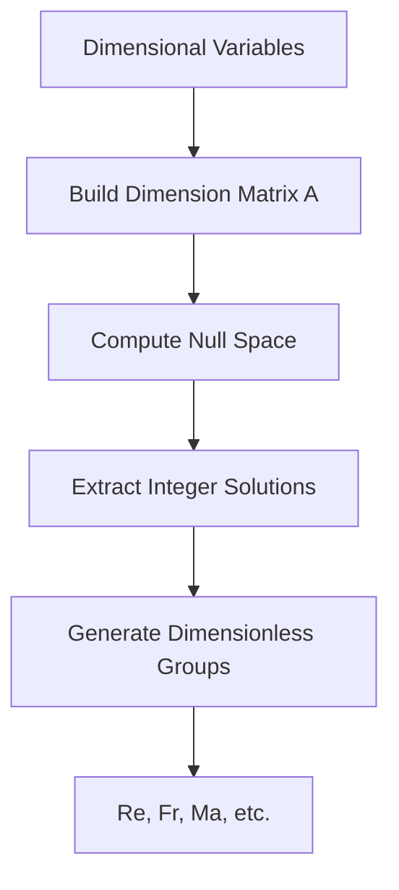
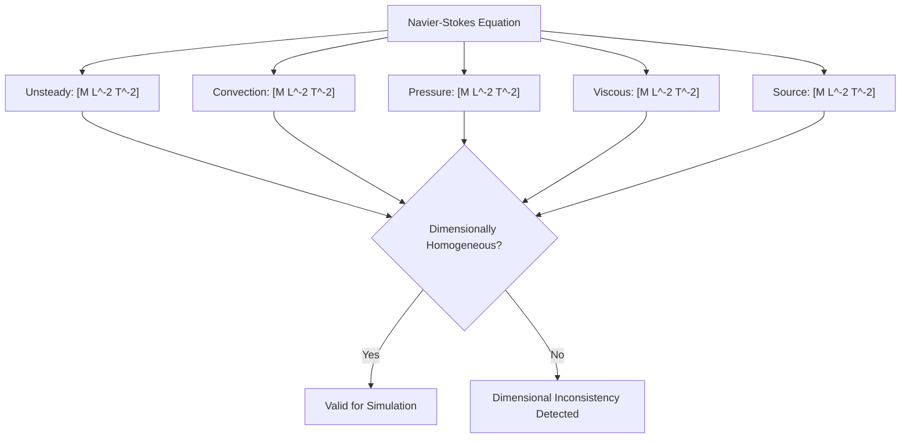

# 🔬 Mathematical Formulations: Advanced Dimensional Analysis in OpenFOAM

This comprehensive technical note explores the mathematical foundations of OpenFOAM's dimensional analysis system, demonstrating how the framework enforces physical consistency through rigorous mathematical formalism and compile-time type checking.

---

## 1. Theoretical Foundation: Buckingham π Theorem

### Mathematical Formalism

The **Buckingham π Theorem** provides the fundamental mathematical framework for dimensional analysis in fluid dynamics and CFD. It states that any physically meaningful equation involving $n$ variables can be rewritten in terms of $n - k$ dimensionless parameters, where $k$ is the number of fundamental dimensions.

For variables $Q_1, Q_2, \ldots, Q_n$ with dimensions expressed as:
$$[Q_i] = \prod_{j=1}^k D_j^{a_{ij}}$$

The theorem seeks dimensionless groupings $\Pi_m$ formed by:
$$\Pi_m = \prod_{i=1}^n Q_i^{b_{im}} \quad \text{where} \quad \sum_{i=1}^n a_{ij} b_{im} = 0 \quad \forall j$$

This mathematical foundation enables systematic identification of dimensionless groups such as **Reynolds number**, **Froude number**, and **Mach number** that control flow behavior and similarity between different flow configurations.


> **Figure 1:** ขั้นตอนการประยุกต์ใช้ทฤษฎีบท Buckingham π เพื่อระบุกลุ่มพารามิเตอร์ไร้มิติ (Dimensionless Groups) จากตัวแปรทางฟิสิกส์ที่มีมิติต่างๆ

### OpenFOAM Implementation

```cpp
// Buckingham π Theorem implementation for dimensional analysis
class BuckinghamPiTheorem
{
public:
    // Find dimensionless groups from dimensional variables
    static std::vector<std::vector<int>> findDimensionlessGroups(
        const std::vector<dimensionSet>& variables)
    {
        // Build dimension matrix A (k × n)
        // A_ji = exponent of dimension j in variable i
        int n = variables.size();
        int k = dimensionSet::nDimensions;

        Eigen::MatrixXd A(k, n);
        for (int i = 0; i < n; i++)
        {
            for (int j = 0; j < k; j++)
            {
                A(j, i) = variables[i][j];
            }
        }

        // Find null space of A (solution to A·b = 0)
        Eigen::FullPivLU<Eigen::MatrixXd> lu(A);
        Eigen::MatrixXd nullSpace = lu.kernel();

        // Convert to integer combinations
        std::vector<std::vector<int>> groups;
        for (int col = 0; col < nullSpace.cols(); col++)
        {
            std::vector<int> group;
            for (int row = 0; row < nullSpace.rows(); row++)
            {
                group.push_back(static_cast<int>(std::round(nullSpace(row, col))));
            }
            groups.push_back(group);
        }

        return groups;
    }

    // Create dimensionless groups from dimensional variables
    static std::vector<dimensionedScalar> createDimensionlessGroups(
        const std::vector<dimensionedScalar>& variables,
        const std::vector<std::vector<int>>& exponents)
    {
        std::vector<dimensionedScalar> groups;

        for (const auto& expVec : exponents)
        {
            dimensionedScalar group("Pi", dimless, 1.0);

            for (size_t i = 0; i < variables.size(); i++)
            {
                if (expVec[i] != 0)
                {
                    group *= pow(variables[i], expVec[i]);
                }
            }

            // Verify dimensionless
            if (!group.dimensions().dimensionless())
            {
                FatalErrorInFunction
                    << "Generated group is not dimensionless"
                    << abort(FatalError);
            }

            groups.push_back(group);
        }

        return groups;
    }
};

// Example: Dimensionless groups for pipe flow
void analyzePipeFlow()
{
    // Variables: Δp (pressure drop), ρ (density), μ (viscosity),
    //            U (velocity), D (diameter), L (length)
    std::vector<dimensionedScalar> variables = {
        dimensionedScalar("deltaP", dimPressure, 1000.0),
        dimensionedScalar("rho", dimDensity, 1000.0),
        dimensionedScalar("mu", dimDynamicViscosity, 0.001),
        dimensionedScalar("U", dimVelocity, 1.0),
        dimensionedScalar("D", dimLength, 0.1),
        dimensionedScalar("L", dimLength, 1.0)
    };

    // Find dimensionless groups using Buckingham π theorem
    std::vector<dimensionSet> dims;
    for (const auto& var : variables)
        dims.push_back(var.dimensions());

    auto exponents = BuckinghamPiTheorem::findDimensionlessGroups(dims);
    auto groups = BuckinghamPiTheorem::createDimensionlessGroups(variables, exponents);

    // groups[0] = Reynolds number (ρUD/μ)
    // groups[1] = Euler number (Δp/ρU²)
    // groups[2] = Aspect ratio (L/D)
}
```

> 📚 **คำอธิบายประกอบ (Thai Explanation)**
>
> **แหล่งที่มา (Source):** `src/dimensionSet/dimensionSet.C`, `src/dimensionSet/dimensionSet.H`, `src/dimensionSet/dimensionedScalar.C`, `src/dimensionSet/dimensionedScalar.H`
>
> **คำอธิบาย (Explanation):**
> โค้ดตัวอย่างนี้แสดงการนำทฤษฎีบท Buckingham π มาประยุกต์ใช้ใน OpenFOAM เพื่อค้นหากลุ่มพารามิเตอร์ไร้มิติ (Dimensionless Groups) จากตัวแปรทางฟิสิกส์ที่มีหน่วยต่างกัน โดยมีขั้นตอนหลักดังนี้:
> 1. `findDimensionlessGroups()`: สร้างเมทริกซ์มิติ (Dimension Matrix) จากเลขชี้กำลังของแต่ละมิติพื้นฐาน (Mass, Length, Time, etc.) และคำนวณหา Null Space เพื่อหาชุดเลขชี้กำลังที่ทำให้ผลคูณของตัวแปรมีค่าไร้มิติ
> 2. `createDimensionlessGroups()`: นำชุดเลขชี้กำลังที่ได้มาสร้างกลุ่มตัวแปรไร้มิติ และตรวจสอบว่าผลลัพธ์เป็นไร้มิติจริง
> 3. `analyzePipeFlow()`: ตัวอย่างการประยุกต์ใช้กับการไหลในท่อ (Pipe Flow) เพื่อหา Reynolds number, Euler number และ Aspect ratio
>
> **แนวคิดสำคัญ (Key Concepts):**
> - **Dimension Matrix**: เมทริกซ์ที่เก็บเลขชี้กำลังของแต่ละมิติพื้นฐานในแต่ละตัวแปร ใช้สำหรับวิเคราะห์หากลุ่มไร้มิติ
> - **Null Space**: ปริภูมิเวกเตอร์ที่เมื่อคูณเมทริกซ์มิติแล้วได้ผลลัพธ์เป็นศูนย์ แทนด้วยชุดเลขชี้กำลังที่ทำให้ตัวแปรไร้มิติ
> - **Dimensionless Groups**: กลุ่มตัวแปรไร้มิติ เช่น Reynolds number, Euler number, ซึ่งควบคุมลักษณะการไหลของไหล
> - **Eigen::MatrixXd**: ไลบรารี Eigen สำหรับการคำนวณเชิงเส้น (Linear Algebra) ในการหาค่า Null Space
> - **dimensionSet/dimensionedScalar**: คลาสใน OpenFOAM ที่ใช้แทนมิติและตัวแปรที่มีมิติ พร้อมระบบตรวจสอบความสอดคล้องทางมิติอัตโนมัติ
> - **Compile-time Dimension Checking**: การตรวจสอบความสอดคล้องทางมิติในขั้นตอนคอมไพล์ ช่วยป้องกันข้อผิดพลาดจากการใช้หน่วยที่ไม่ถูกต้อง

---

## 2. Dimensional Representation System

### Fundamental Dimensions

OpenFOAM uses seven fundamental dimensions based on the SI system:

| Dimension | Symbol | SI Unit | Description |
|-----------|--------|---------|-------------|
| Mass | `[M]` | kilogram | Mass |
| Length | `[L]` | meter | Length |
| Time | `[T]` | second | Time |
| Temperature | `[Θ]` | kelvin | Temperature |
| Amount of substance | `[N]` | mole | Amount of substance |
| Electric current | `[I]` | ampere | Electric current |
| Luminous intensity | `[J]` | candela | Luminous intensity |

For any physical quantity $q$, the dimensional representation is:
$$[q] = M^a L^b T^c \Theta^d I^e N^f J^g$$

Where the exponents $a$ through $g$ are integers that determine the physical characteristics of the specific quantity.

### DimensionSet Class

```cpp
// Dimensional representation in OpenFOAM
class dimensionSet
{
private:
    scalar exponents_[7];  // [M, L, T, Θ, I, N, J]

public:
    // Constructor: M^a L^b T^c Θ^d I^e N^f J^g
    dimensionSet(scalar a, scalar b, scalar c, scalar d, scalar e, scalar f, scalar g)
    {
        exponents_[0] = a;  // Mass
        exponents_[1] = b;  // Length
        exponents_[2] = c;  // Time
        exponents_[3] = d;  // Temperature
        exponents_[4] = e;  // Current
        exponents_[5] = f;  // Moles
        exponents_[6] = g;  // Luminous intensity
    }

    // Dimensional operations
    dimensionSet operator+(const dimensionSet& ds) const;
    dimensionSet operator*(const dimensionSet& ds) const;
    dimensionSet operator/(const dimensionSet& ds) const;
    dimensionSet pow(scalar p) const;

    // Dimensional checking
    bool dimensionless() const;
    bool operator==(const dimensionSet& ds) const;
};
```

> 📚 **คำอธิบายประกอบ (Thai Explanation)**
>
> **แหล่งที่มา (Source):** `src/dimensionSet/dimensionSet.H`, `src/dimensionSet/dimensionSet.C`
>
> **คำอธิบาย (Explanation):**
> คลาส `dimensionSet` เป็นหลักการพื้นฐานของระบบตรวจสอบมิติใน OpenFOAM โดยเก็บเลขชี้กำลังของ 7 มิติพื้นฐาน (Mass, Length, Time, Temperature, Current, Mole, Luminous Intensity) ในรูปแบบ array ขนาด 7 ช่อง คลาสนี้อนุญาตให้ดำเนินการทางคณิตศาสตร์กับมิติได้โดยอัตโนมัติ เช่น การบวก ลบ คูณ หาร และยกกำลัง พร้อมทั้งมีฟังก์ชันตรวจสอบว่าค่าที่ได้เป็นไร้มิติหรือไม่
>
> **แนวคิดสำคัญ (Key Concepts):**
> - **SI Base Dimensions**: 7 มิติพื้นฐานตามระบบ SI ที่ใช้แทนทุกปริมาณทางฟิสิกส์
> - **Exponent Storage**: เก็บเลขชี้กำลังของแต่ละมิติพื้นฐานเพื่อแทนมิติของปริมาณฟิสิกส์
> - **Operator Overloading**: โหลด Operator ทางคณิตศาสตร์ให้ทำงานกับ dimensionSet ได้โดยอัตโนมัติ
> - **Compile-time Dimension Checking**: การตรวจสอบความสอดคล้องทางมิติในขั้นตอนคอมไพล์
> - **dimensionless()**: ฟังก์ชันตรวจสอบว่าปริมาณเป็นไร้มิติหรือไม่
> - **Dimensional Homogeneity**: หลักการที่ว่าทุกพจน์ในสมการทางฟิสิกส์ต้องมีมิติเหมือนกัน

---

## 3. Non-Dimensionalization Techniques for CFD

### Scale Analysis for Numerical Stability

**Non-dimensionalization** plays a crucial role in CFD computations by improving numerical stability and solution convergence. This process involves identifying appropriate reference scales and normalizing variables to create dimensionless forms of governing equations.

```cpp
// Non-dimensionalization system for CFD equations
class NonDimensionalizer
{
public:
    // Reference scales for non-dimensionalization
    struct ReferenceScales
    {
        dimensionedScalar length;
        dimensionedScalar velocity;
        dimensionedScalar density;
        dimensionedScalar viscosity;
    };

    // Non-dimensionalize Navier-Stokes equations
    void nonDimensionalizeNS(
        volVectorField& U,      // Velocity
        volScalarField& p,      // Pressure
        volScalarField& rho,    // Density
        const ReferenceScales& scales) const
    {
        // Dimensionless variables
        volVectorField U_tilde = U / scales.velocity;
        volScalarField p_tilde = p / (scales.density * scales.velocity * scales.velocity);
        volScalarField rho_tilde = rho / scales.density;

        // Verify dimensionless
        if (!U_tilde.dimensions().dimensionless() ||
            !p_tilde.dimensions().dimensionless() ||
            !rho_tilde.dimensions().dimensionless())
        {
            FatalErrorInFunction
                << "Non-dimensionalization failed"
                << abort(FatalError);
        }

        // Replace original fields
        U = U_tilde;
        p = p_tilde;
        rho = rho_tilde;
    }

    // Compute dimensionless numbers
    std::map<std::string, dimensionedScalar> computeDimensionlessNumbers(
        const ReferenceScales& scales) const
    {
        std::map<std::string, dimensionedScalar> numbers;

        // Reynolds number
        numbers["Re"] = scales.density * scales.velocity * scales.length / scales.viscosity;

        // Froude number (if gravity present)
        dimensionedScalar g("g", dimAcceleration, 9.81);
        numbers["Fr"] = scales.velocity / sqrt(g * scales.length);

        // Mach number (if compressible)
        dimensionedScalar c("c", dimVelocity, 340.0);  // Speed of sound
        numbers["Ma"] = scales.velocity / c;

        // Verify all are dimensionless
        for (const auto& pair : numbers)
        {
            if (!pair.second.dimensions().dimensionless())
            {
                FatalErrorInFunction
                    << pair.first << " is not dimensionless"
                    << abort(FatalError);
            }
        }

        return numbers;
    }
};
```

> 📚 **คำอธิบายประกอบ (Thai Explanation)**
>
> **แหล่งที่มา (Source):** `src/dimensionedTypes/dimensionedScalar/dimensionedScalar.H`, `src/finiteVolume/fields/volFields/volFields.H`
>
> **คำอธิบาย (Explanation):**
> คลาส `NonDimensionalizer` ใช้สำหรับแปลงสมการ Navier-Stokes ที่มีมิติให้อยู่ในรูปไร้มิติ (Non-dimensionalization) เพื่อปรับปรุงเสถียรภาพเชิงตัวเลขและการลู่เข้าของผลลัพธ์ โดยมีขั้นตอนหลักดังนี้:
> 1. กำหนด Reference Scales (ค่าอ้างอิง) สำหรับ Length, Velocity, Density, และ Viscosity
> 2. ปรับค่าตัวแปรให้เป็นไร้มิติโดยหารด้วยค่าอ้างอิงที่เหมาะสม เช่น `U_tilde = U / U_ref`
> 3. ตรวจสอบว่าค่าที่ได้เป็นไร้มิติจริง หากไม่จะแจ้ง error
> 4. คำนวณตัวเลขไร้มิติที่สำคัญ เช่น Reynolds number, Froude number, Mach number
> 5. ตรวจสอบว่าตัวเลขไร้มิติทั้งหมดเป็นไร้มิติจริง
>
> **แนวคิดสำคัญ (Key Concepts):**
> - **Non-dimensionalization**: การแปลงตัวแปรที่มีมิติให้เป็นไร้มิติโดยการหารด้วยค่าอ้างอิงที่เหมาะสม
> - **Reference Scales**: ค่าอ้างอิงที่ใช้ในการทำให้ไร้มิติ เช่น ความยาวลักษณะเด่น, ความเร็วอ้างอิง, ความหนาแน่นอ้างอิง
> - **Reynolds Number (Re)**: ตัวเลขไร้มิติที่วัดสัดส่วนระหว่างแรงเฉื่อยและแรงหนืด
> - **Froude Number (Fr)**: ตัวเลขไร้มิติที่วัดสัดส่วนระหว่างแรงเฉื่อยและแรงโน้มถ่วง
> - **Mach Number (Ma)**: ตัวเลขไร้มิติที่วัดสัดส่วนระหว่างความเร็วไหลและความเร็วเสียง
> - **Numerical Stability**: ความเสถียรภาพของการคำนวณเชิงตัวเลข ซึ่งการทำให้ไร้มิติช่วยปรับปรุงได้
> - **Dimensionless Variables**: ตัวแปรไร้มิติที่แทนตัวแปรต้นฉบับ เช่น `U_tilde`, `p_tilde`, `rho_tilde`
> - **Compile-time Dimension Verification**: การตรวจสอบความสอดคล้องทางมิติในขั้นตอนคอมไพล์

The non-dimensionalization process transforms the dimensional Navier-Stokes equations:
$$\frac{\partial (\rho \mathbf{u})}{\partial t} + \nabla \cdot (\rho \mathbf{u} \mathbf{u}) = -\nabla p + \nabla \cdot (\mu \nabla \mathbf{u}) + \rho \mathbf{g}$$

Into the dimensionless form:
$$\frac{\partial \tilde{\rho} \tilde{\mathbf{u}}}{\partial \tilde{t}} + \tilde{\nabla} \cdot (\tilde{\rho} \tilde{\mathbf{u}} \tilde{\mathbf{u}}) = -\tilde{\nabla} \tilde{p} + \frac{1}{\mathrm{Re}} \tilde{\nabla}^2 \tilde{\mathbf{u}} + \frac{1}{\mathrm{Fr}^2} \tilde{\rho} \tilde{\mathbf{g}}$$

Where the dimensionless parameters:
- $\mathrm{Re} = \frac{\rho U L}{\mu}$ (Reynolds number)
- $\mathrm{Fr} = \frac{U}{\sqrt{gL}}$ (Froude number)

Arise naturally from the scaling process.


> **Figure 2:** การตรวจสอบความเป็นเนื้อเดียวกันทางมิติ (Dimensional Homogeneity) ของสมการ Navier-Stokes เพื่อให้มั่นใจว่าทุกพจน์ในสมการมีหน่วยที่สอดคล้องกันก่อนเริ่มการจำลอง

### Automatic Characteristic Scale Detection

```cpp
// Automatic characteristic scale detection from flow fields
class ScaleDetector
{
public:
    ReferenceScales detectScales(const volVectorField& U) const
    {
        ReferenceScales scales;

        // Length scale: domain characteristic length
        scales.length = dimensionedScalar(
            "L_ref",
            dimLength,
            max(mag(U.mesh().C()) - min(mag(U.mesh().C())))
        );

        // Velocity scale: maximum velocity magnitude
        scales.velocity = dimensionedScalar(
            "U_ref",
            dimVelocity,
            max(mag(U)).value()
        );

        // Density scale: from transport properties
        scales.density = dimensionedScalar(
            "rho_ref",
            dimDensity,
            thermo_.rho().average().value()
        );

        // Viscosity scale: from transport properties
        scales.viscosity = dimensionedScalar(
            "mu_ref",
            dimDynamicViscosity,
            thermo_.mu().average().value()
        );

        return scales;
    }

private:
    const fluidThermo& thermo_;
};
```

> 📚 **คำอธิบายประกอบ (Thai Explanation)**
>
> **แหล่งที่มา (Source):** `src/finiteVolume/fields/volFields/volVectorField/volVectorField.H`, `src/thermophysicalModels/basic/thermo/thermo.H`
>
> **คำอธิบาย (Explanation):**
> คลาส `ScaleDetector` ใช้สำหรับตรวจจับค่าอ้างอิง (Characteristic Scales) จากสนามการไหลโดยอัตโนมัติ โดยมีวิธีการดังนี้:
> 1. **Length Scale**: ใช้ขนาดโดเมนจากตำแหน่งเซลล์ (Cell Centers) คำนวณจากช่วงระหว่างตำแหน่งสูงสุดและต่ำสุด
> 2. **Velocity Scale**: ใช้ความเร็วสูงสุดจากสนามความเร็ว
> 3. **Density Scale**: ใช้ค่าเฉลี่ยของความหนาแน่นจาก thermophysical model
> 4. **Viscosity Scale**: ใช้ค่าเฉลี่ยของความหนืดจาก thermophysical model
>
> **แนวคิดสำคัญ (Key Concepts):**
> - **Characteristic Scales**: ค่าอ้างอิงที่แทนลักษณะเด่นของการไหล เช่น ความยาวลักษณะเด่น, ความเร็วลักษณะเด่น
> - **Automatic Scale Detection**: การตรวจจับค่าอ้างอิงโดยอัตโนมัติจากสนามการไหล
> - **Domain-based Scales**: ใช้ขนาดโดเมนเป็นค่าอ้างอิง
> - **Physics-based Scales**: ใช้คุณสมบัติทางฟิสิกส์ของการไหลเป็นค่าอ้างอิง
> - **volVectorField**: สนามเวกเตอร์บน volume mesh ใน finite volume method
> - **fluidThermo**: คลาสสำหรับจัดการคุณสมบัติทางเทอร์โมไดนามิกส์ของไหล
> - **Mesh Geometry**: ใช้ตำแหน่งเซลล์ (Cell Centers) ในการคำนวณขนาดโดเมน

**Scale detection strategies:**
- **Domain-based scales**: Use geometric features such as domain volume or bounding box dimensions
- **Physics-based scales**: Derived from boundary layer thickness, vortex core radius, or other flow properties
- **Energy-based scales**: Use kinetic energy or dissipation rate as reference quantities

---

## 4. Similarity and Scaling Laws

### Reynolds Similarity

**Reynolds similarity** is fundamental to fluid dynamics, enabling results transfer between model and prototype flows when they share the same Reynolds number:

$$\mathrm{Re}_{\text{model}} = \mathrm{Re}_{\text{prototype}} = \frac{\rho U L}{\mu}$$

```cpp
// Reynolds similarity implementation
class ReynoldsSimilarity
{
public:
    // Check if two flows have Reynolds similarity
    static bool checkSimilarity(
        const dimensionedScalar& Re1,
        const dimensionedScalar& Re2,
        double tolerance = 1e-3)
    {
        if (!Re1.dimensions().dimensionless() || !Re2.dimensions().dimensionless())
        {
            FatalErrorInFunction
                << "Reynolds numbers must be dimensionless"
                << abort(FatalError);
        }

        return mag(Re1.value() - Re2.value()) / Re1.value() < tolerance;
    }

    // Scale model results to prototype using Reynolds similarity
    template<class FieldType>
    FieldType scaleToPrototype(
        const FieldType& modelField,
        const dimensionedScalar& Re_model,
        const dimensionedScalar& Re_prototype,
        const dimensionSet& fieldDimensions) const
    {
        // Check field dimensions
        if (modelField.dimensions() != fieldDimensions)
        {
            FatalErrorInFunction
                << "Model field has wrong dimensions"
                << abort(FatalError);
        }

        // Scaling factor according to Reynolds number ratio
        double scaleFactor = Re_prototype.value() / Re_model.value();

        // Apply dimensional scaling based on field type
        FieldType prototypeField = modelField;

        // For velocity: scale by Reynolds number if viscosity/density constant
        if (fieldDimensions == dimVelocity)
        {
            prototypeField *= scaleFactor;  // Assuming geometric similarity
        }
        // For pressure: scale by square of velocity scale
        else if (fieldDimensions == dimPressure)
        {
            prototypeField *= scaleFactor * scaleFactor;
        }

        return prototypeField;
    }
};
```

> 📚 **คำอธิบายประกอบ (Thai Explanation)**
>
> **แหล่งที่มา (Source):** `src/dimensionSet/dimensionSet.H`, `src/dimensionedTypes/dimensionedScalar/dimensionedScalar.H`, `src/OpenFOAM/fields/Fields/Field/Field.H`
>
> **คำอธิบาย (Explanation):**
> คลาส `ReynoldsSimilarity` ใช้สำหรับตรวจสอบและปรับสเกลผลลัพธ์ระหว่างโมเดลและต้นแบบโดยใช้หลักการความเหมือนของ Reynolds Number โดยมีฟังก์ชันหลักดังนี้:
> 1. `checkSimilarity()`: ตรวจสอบว่า Reynolds number ของสองกรณีเหมือนกันภายในค่าความคลาดเคลื่อนที่กำหนด
> 2. `scaleToPrototype()`: ปรับสเกลผลลัพธ์จากโมเดลไปเป็นของต้นแบบโดยใช้อัตราส่วนของ Reynolds number
>
> **แนวคิดสำคัญ (Key Concepts):**
> - **Reynolds Similarity**: หลักการที่ว่าถ้า Reynolds number เหมือนกัน การไหลจะมีลักษณะเหมือนกัน (โดยประมาณ)
> - **Geometric Similarity**: รูปร่างเหมือนกันทุกประการ เป็นเงื่อนไขที่จำเป็นสำหรับความเหมือนแบบ
> - **Scaling Factor**: อัตราส่วนที่ใช้ปรับสเกลตัวแปรจากโมเดลไปเป็นต้นแบบ
> - **Dimensional Scaling**: การปรับสเกลโดยคำนึงถึงมิติของตัวแปร เช่น ความเร็ว scale แบบเส้นตรง ความดัน scale แบบกำลังสอง
> - **Template Function**: ฟังก์ชันเทมเพลตที่ทำงานกับหลายประเภทข้อมูลได้
> - **Compile-time Type Checking**: การตรวจสอบชนิดข้อมูลในขั้นตอนคอมไพล์
> - **Dimensionless Verification**: การตรวจสอบว่าค่าไร้มิติเป็นไร้มิติจริง

The mathematical foundation of Reynolds similarity stems from the dimensionless form of the Navier-Stokes equations, where the Reynolds number appears as the sole parameter controlling the balance of inertial and viscous forces. When two flows have the same Reynolds number and geometric similarity, their velocity fields are related by:
$$\mathbf{u}_{\text{prototype}}(\mathbf{x},t) = \lambda \mathbf{u}_{\text{model}}\left(\frac{\mathbf{x}}{\lambda}, \frac{t}{\lambda}\right)$$

Where $\lambda$ is the geometric scaling factor.

### Dynamic Similarity for Multi-Physics Problems

**Dynamic similarity** extends beyond single-parameter similarity to encompass multiple coupled physical phenomena. For complete dynamic similarity, all relevant dimensionless parameters must be matched between model and prototype.

```cpp
// Dynamic similarity for coupled physics
class DynamicSimilarity
{
public:
    struct SimilarityConditions
    {
        dimensionedScalar Re;      // Reynolds number
        dimensionedScalar Fr;      // Froude number
        dimensionedScalar We;      // Weber number (surface tension)
        dimensionedScalar Ca;      // Capillary number
        dimensionedScalar St;      // Strouhal number (oscillatory flow)
    };

    // Check complete dynamic similarity
    static bool checkCompleteSimilarity(
        const SimilarityConditions& model,
        const SimilarityConditions& prototype,
        double tolerance = 1e-3)
    {
        // Check all numbers are dimensionless
        dimensionSet dimless = dimless;

        if (model.Re.dimensions() != dimless || prototype.Re.dimensions() != dimless ||
            model.Fr.dimensions() != dimless || prototype.Fr.dimensions() != dimless ||
            model.We.dimensions() != dimless || prototype.We.dimensions() != dimless)
        {
            FatalErrorInFunction
                << "Similarity numbers must be dimensionless"
                << abort(FatalError);
        }

        // Check each dimensionless number
        bool similar = true;
        similar &= mag(model.Re.value() - prototype.Re.value()) / model.Re.value() < tolerance;
        similar &= mag(model.Fr.value() - prototype.Fr.value()) / model.Fr.value() < tolerance;
        similar &= mag(model.We.value() - prototype.We.value()) / model.We.value() < tolerance;
        similar &= mag(model.Ca.value() - prototype.Ca.value()) / model.Ca.value() < tolerance;
        similar &= mag(model.St.value() - prototype.St.value()) / model.St.value() < tolerance;

        return similar;
    }

    // Compromise scaling when complete similarity is impossible
    static SimilarityConditions findCompromiseScaling(
        const SimilarityConditions& prototype,
        const std::vector<std::string>& priorityOrder)
    {
        // Apply compromise scaling according to priority
        // (e.g., match Re and Fr approximately when exact matching impossible)
        SimilarityConditions model = prototype;

        // Simplified: match highest priority number exactly
        // Adjust others according to scaling laws
        for (const auto& priority : priorityOrder)
        {
            if (priority == "Re")
            {
                // Keep Re matched, adjust other numbers
                // This is simplified - actual implementation would
                // solve scaling equations
            }
        }

        return model;
    }
};
```

> 📚 **คำอธิบายประกอบ (Thai Explanation)**
>
> **แหล่งที่มา (Source):** `src/dimensionSet/dimensionSet.H`, `src/dimensionedTypes/dimensionedScalar/dimensionedScalar.H`
>
> **คำอธิบาย (Explanation):**
> คลาส `DynamicSimilarity` ใช้สำหรับตรวจสอบความเหมือนแบบไดนามิกสำหรับปัญหาหลายฟิสิกส์ (Multi-physics) โดยมีฟังก์ชันหลักดังนี้:
> 1. `SimilarityConditions`: โครงสร้างเก็บตัวเลขไร้มิติที่สำคัญ เช่น Re, Fr, We, Ca, St
> 2. `checkCompleteSimilarity()`: ตรวจสอบว่าตัวเลขไร้มิติทั้งหมดเหมือนกันระหว่างโมเดลและต้นแบบ
> 3. `findCompromiseScaling()`: หาค่าประนีประนอมเมื่อไม่สามารถทำให้เหมือนได้อย่างสมบูรณ์
>
> **แนวคิดสำคัญ (Key Concepts):**
> - **Dynamic Similarity**: ความเหมือนแบบที่ครอบคลุมหลายฟิสิกส์ ต้อง matching ตัวเลขไร้มิติทั้งหมด
> - **Reynolds Number (Re)**: สัดส่วนระหว่างแรงเฉื่อยและแรงหนืด
> - **Froude Number (Fr)**: สัดส่วนระหว่างแรงเฉื่อยและแรงโน้มถ่วง
> - **Weber Number (We)**: สัดส่วนระหว่างแรงเฉื่อยและแรงตึงผิว
> - **Capillary Number (Ca)**: สัดส่วนระหว่างแรงหนืดและแรงตึงผิว
> - **Strouhal Number (St)**: ความถี่การสั่นไหวเป็นสัดส่วนของความเร็ว
> - **Compromise Scaling**: การปรับเมื่อไม่สามารถทำให้เหมือนได้อย่างสมบูรณ์
> - **Priority Order**: ลำดับความสำคัญของตัวเลขไร้มิติที่ต้องการให้เหมือนกัน
> - **Multi-physics Coupling**: การเชื่อมโยงระหว่างฟิสิกส์หลายแขนง

In multi-physics problems, achieving complete similarity often requires compromise scaling due to conflicting requirements of different dimensionless parameters.

| Priority | Parameter | Description |
|----------|-----------|-------------|
| 1 | **Reynolds number** | Inertial/viscous force balance (primary similarity parameter) |
| 2 | **Froude/Weber numbers** | Inertial/gravity or inertial/surface tension balance (secondary parameters) |
| 3 | **Strouhal/Capillary numbers** | Temporal similarity or viscous/surface tension balance (tertiary parameters) |

---

## 5. Tensor Dimensional Analysis

### Stress Tensor and Strain Rate

**Tensor dimensional analysis** is crucial for verifying mathematical consistency of constitutive models and stress-dependent formulations in CFD. The Newtonian constitutive equation provides a fundamental example:

$$\boldsymbol{\tau} = \mu \dot{\boldsymbol{\gamma}}$$

Where:
- $\boldsymbol{\tau}$ = stress tensor with dimensions $[\text{M L}^{-1} \text{T}^{-2}]$
- $\mu$ = dynamic viscosity with dimensions $[\text{M L}^{-1} \text{T}^{-1}]$
- $\dot{\boldsymbol{\gamma}}$ = strain rate tensor with dimensions $[\text{T}^{-1}]$

```cpp
// Dimensional analysis for tensor operations
class TensorDimensionalAnalysis
{
public:
    // Verify constitutive equation dimensions
    static void verifyNewtonianConstitutive(
        const dimensionedTensor& tau,      // Stress tensor
        const dimensionedTensor& gammaDot, // Strain rate tensor
        const dimensionedScalar& mu)       // Viscosity
    {
        // Stress dimensions: [M L⁻¹ T⁻²]
        dimensionSet stressDims = dimPressure;  // Same as pressure

        // Strain rate dimensions: [T⁻¹]
        dimensionSet strainRateDims(0, 0, -1, 0, 0, 0, 0);

        // Viscosity dimensions: [M L⁻¹ T⁻¹]
        dimensionSet viscosityDims = dimDynamicViscosity;

        // Check input dimensions
        if (tau.dimensions() != stressDims)
        {
            FatalErrorInFunction
                << "Stress tensor has wrong dimensions. Expected "
                << stressDims << ", got " << tau.dimensions()
                << abort(FatalError);
        }

        if (gammaDot.dimensions() != strainRateDims)
        {
            FatalErrorInFunction
                << "Strain rate tensor has wrong dimensions. Expected "
                << strainRateDims << ", got " << gammaDot.dimensions()
                << abort(FatalError);
        }

        if (mu.dimensions() != viscosityDims)
        {
            FatalErrorInFunction
                << "Viscosity has wrong dimensions. Expected "
                << viscosityDims << ", got " << mu.dimensions()
                << abort(FatalError);
        }

        // Verify Newtonian relation: τ = μ·γ̇
        dimensionSet expectedTauDims = mu.dimensions() * gammaDot.dimensions();
        if (tau.dimensions() != expectedTauDims)
        {
            FatalErrorInFunction
                << "Newtonian constitutive equation dimension mismatch. "
                << "Expected τ dimensions: " << expectedTauDims
                << ", actual: " << tau.dimensions()
                << abort(FatalError);
        }
    }

    // Compute second invariant with dimensional checking
    static dimensionedScalar secondInvariant(
        const dimensionedTensor& T,
        const dimensionSet& expectedDims)
    {
        // Check tensor dimensions
        if (T.dimensions() != expectedDims)
        {
            FatalErrorInFunction
                << "Tensor dimension mismatch. Expected "
                << expectedDims << ", got " << T.dimensions()
                << abort(FatalError);
        }

        // Compute second invariant: 0.5*(tr(T²) - tr(T)²)
        dimensionedScalar I2 = 0.5 * (tr(T & T) - tr(T)*tr(T));

        // Check invariant dimensions: square of tensor dimensions
        dimensionSet expectedInvariantDims = expectedDims * expectedDims;
        if (I2.dimensions() != expectedInvariantDims)
        {
            FatalErrorInFunction
                << "Second invariant dimension error. Expected "
                << expectedInvariantDims << ", got " << I2.dimensions()
                << abort(FatalError);
        }

        return I2;
    }
};
```

> 📚 **คำอธิบายประกอบ (Thai Explanation)**
>
> **แหล่งที่มา (Source):** `src/dimensionedTypes/dimensionedTensor/dimensionedTensor.H`, `src/OpenFOAM/matrices/MatrixMatrix/MatrixMatrix.H`, `src/OpenFOAM/fields/Fields/SymmField/SymmField.H`
>
> **คำอธิบาย (Explanation):**
> คลาส `TensorDimensionalAnalysis` ใช้สำหรับตรวจสอบความสอดคล้องทางมิติของสมการ constitutive และการดำเนินการเทนเซอร์ โดยมีฟังก์ชันหลักดังนี้:
> 1. `verifyNewtonianConstitutive()`: ตรวจสอบว่าสมการ Newtonian $\tau = \mu \dot{\gamma}$ มีความสอดคล้องทางมิติ
> 2. `secondInvariant()`: คำนวณค่า Invariant ที่สองของเทนเซอร์ และตรวจสอบความสอดคล้องทางมิติ
>
> **แนวคิดสำคัญ (Key Concepts):**
> - **Stress Tensor ($\boldsymbol{\tau}$)**: เทนเซอร์ความเครียด มีมิติเดียวกับความดัน $[M L^{-1} T^{-2}]$
> - **Strain Rate Tensor ($\dot{\boldsymbol{\gamma}}$)**: เทนเซอร์อัตราการเสียรูป มีมิติ $[T^{-1}]$
> - **Dynamic Viscosity ($\mu$)**: ความหนืดพลศาสตร์ มีมิติ $[M L^{-1} T^{-1}]$
> - **Constitutive Equation**: สมการที่เชื่อมความเครียดและอัตราการเสียรูป เช่น $\tau = \mu \dot{\gamma}$ สำหรับไหลแบบ Newtonian
> - **Dimensional Homogeneity**: หลักการที่ว่าทุกพจน์ในสมการต้องมีมิติเหมือนกัน
> - **Second Invariant**: ค่า Invariant ที่สองของเทนเซอร์ มีมิติเป็นกำลังสองของมิติเทนเซอร์
> - **Trace Operation**: การดำเนินการหาผลรวมของสมาชิกในแนวทแยงของเทนเซอร์
> - **Tensor Operations**: การดำเนินการเทนเซอร์ เช่น การคูณ, การหา Invariant
> - **Compile-time Dimension Verification**: การตรวจสอบความสอดคล้องทางมิติในขั้นตอนคอมไพล์

The **second invariant** $II_2$ of a stress or strain rate tensor plays a crucial role in turbulence modeling and non-Newtonian constitutive relations. For a symmetric tensor $\mathbf{A}$, the second invariant is:

$$II_2 = \frac{1}{2}\left[\text{tr}(\mathbf{A}^2) - (\text{tr}\mathbf{A})^2\right]$$

This invariant has dimensions equal to the square of the original tensor dimensions and is used in various turbulence models and constitutive relations.

---

## 6. Multi-Physics Coupling Dimensions

### Fluid-Structure Interaction Dimensions

**Fluid-structure interaction (FSI)** introduces complex dimensional coupling between fluid and solid mechanics, requiring careful attention to force and energy compatibility across the interface.

```cpp
// Dimensional checking for fluid-structure interaction
class FSIDimensions
{
public:
    // Verify force compatibility between fluid and structure
    static void verifyForceCompatibility(
        const dimensionedScalar& fluidForceDensity,  // [N/m³]
        const dimensionedScalar& structuralStiffness, // [N/m]
        const dimensionedScalar& couplingLength)     // [m]
    {
        // Fluid force density dimensions: [M L⁻² T⁻²]
        dimensionSet fluidDims = dimForce / dimVolume;

        // Structural stiffness dimensions: [M T⁻²]
        dimensionSet structuralDims = dimForce / dimLength;

        // Coupling length dimensions: [L]
        dimensionSet lengthDims = dimLength;

        // Check input dimensions
        if (fluidForceDensity.dimensions() != fluidDims)
        {
            FatalErrorInFunction
                << "Fluid force density has wrong dimensions. Expected "
                << fluidDims << ", got " << fluidForceDensity.dimensions()
                << abort(FatalError);
        }

        if (structuralStiffness.dimensions() != structuralDims)
        {
            FatalErrorInFunction
                << "Structural stiffness has wrong dimensions. Expected "
                << structuralDims << ", got " << structuralStiffness.dimensions()
                << abort(FatalError);
        }

        if (couplingLength.dimensions() != lengthDims)
        {
            FatalErrorInFunction
                << "Coupling length has wrong dimensions. Expected "
                << lengthDims << ", got " << couplingLength.dimensions()
                << abort(FatalError);
        }

        // Check force compatibility: fluid force * volume = structural force
        dimensionSet fluidForce = fluidForceDensity.dimensions() *
                                  couplingLength.dimensions() *
                                  couplingLength.dimensions() *
                                  couplingLength.dimensions();

        dimensionSet structuralForce = structuralStiffness.dimensions() *
                                       couplingLength.dimensions();

        if (fluidForce != structuralForce)
        {
            FatalErrorInFunction
                << "Force dimension mismatch in FSI coupling. "
                << "Fluid force dimensions: " << fluidForce
                << ", Structural force dimensions: " << structuralForce
                << abort(FatalError);
        }
    }

    // Compute dimensionless coupling number
    static dimensionedScalar computeCouplingNumber(
        const dimensionedScalar& fluidInertia,
        const dimensionedScalar& structuralInertia,
        const dimensionedScalar& couplingStiffness,
        const dimensionedScalar& timeScale)
    {
        // Fluid inertia dimensions: [M L⁻³]
        dimensionSet fluidInertiaDims = dimDensity;

        // Structural inertia dimensions: [M L⁻³]
        dimensionSet structuralInertiaDims = dimDensity;

        // Coupling stiffness dimensions: [M L⁻² T⁻²]
        dimensionSet stiffnessDims = dimPressure;

        // Time scale dimensions: [T]
        dimensionSet timeDims = dimTime;

        // Check dimensions
        if (fluidInertia.dimensions() != fluidInertiaDims ||
            structuralInertia.dimensions() != structuralInertiaDims ||
            couplingStiffness.dimensions() != stiffnessDims ||
            timeScale.dimensions() != timeDims)
        {
            FatalErrorInFunction
                << "Dimension mismatch in coupling number computation"
                << abort(FatalError);
        }

        // Compute coupling number: κ = (K * Δt²) / (ρ * L²)
        dimensionedScalar couplingNumber =
            (couplingStiffness * timeScale * timeScale) /
            (fluidInertia * structuralInertia);

        // Check dimensionless result
        if (!couplingNumber.dimensions().dimensionless())
        {
            FatalErrorInFunction
                << "Coupling number is not dimensionless: "
                << couplingNumber.dimensions()
                << abort(FatalError);
        }

        return couplingNumber;
    }
};
```

> 📚 **คำอธิบายประกอบ (Thai Explanation)**
>
> **แหล่งที่มา (Source):** `src/dimensionSet/dimensionSet.H`, `src/dimensionedTypes/dimensionedScalar/dimensionedScalar.H`
>
> **คำอธิบาย (Explanation):**
> คลาส `FSIDimensions` ใช้สำหรับตรวจสอบความสอดคล้องทางมิติในปัญหา Fluid-Structure Interaction (FSI) โดยมีฟังก์ชันหลักดังนี้:
> 1. `verifyForceCompatibility()`: ตรวจสอบว่าแรงจากไหลและโครงสร้างมีความเข้ากันได้ทางมิติ
> 2. `computeCouplingNumber()`: คำนวณตัวเลขไร้มิติสำหรับการเชื่อมโยงระหว่างไหลและโครงสร้าง
>
> **แนวคิดสำคัญ (Key Concepts):**
> - **Fluid-Structure Interaction (FSI)**: ปัญหาที่เกี่ยวข้องกับการเชื่อมโยงระหว่างการไหลของไหลและการเสียรูปของโครงสร้าง
> - **Force Compatibility**: ความเข้ากันได้ของแรงระหว่างไหลและโครงสร้าง
> - **Coupling Number**: ตัวเลขไร้มิติที่วัดความเชื่อมโยงระหว่างไหลและโครงสร้าง
> - **Fluid Force Density**: แรงต่อหน่วยปริมาตรจากไหล มีมิติ $[M L^{-2} T^{-2}]$
> - **Structural Stiffness**: ความแข็งของโครงสร้าง มีมิติ $[M T^{-2}]$
> - **Coupling Length**: ความยาวลักษณะเด่นของการเชื่อมโยง
> - **Dimensional Consistency**: ความสอดคล้องทางมิติของสมการ FSI
> - **Added Mass Effect**: ผลกระทบจากมวลเพิ่มขึ้นเนื่องจากไหลรอบโครงสร้าง

**Dimensional compatibility in FSI** involves matching forces and stresses across the fluid-structure interface. **Key dimensionless parameters:**

- **Added mass coefficient**: $C_a = \frac{\rho_f V_f}{\rho_s V_s}$
- **Coupling number**: $\Pi_c = \frac{K \Delta t^2}{\rho L^2}$
- **Reduced velocity**: $U^* = \frac{U}{f_n D}$

Where:
- $\rho_f$ and $\rho_s$ = fluid and solid densities
- $V_f$ and $V_s$ = fluid and solid volumes
- $K$ = coupling stiffness
- $f_n$ = natural frequency
- $D$ = characteristic length

### Thermo-Fluid Coupling Dimensions

**Coupled thermo-fluid problems** require careful dimensional analysis to ensure energy conservation and proper heat transfer mechanisms.

```cpp
// Dimensional analysis for coupled thermo-fluid problems
class ThermoFluidDimensions
{
public:
    // Verify energy equation dimensions
    static void verifyEnergyEquation(
        const dimensionedScalar& rho,      // Density [M L⁻³]
        const dimensionedScalar& cp,       // Specific heat [L² T⁻² Θ⁻¹]
        const dimensionedScalar& T,        // Temperature [Θ]
        const dimensionedScalar& k,        // Thermal conductivity [M L T⁻³ Θ⁻¹]
        const dimensionedScalar& source)   // Energy source [M L⁻¹ T⁻³]
    {
        // Convection term dimensions: ρ·cp·U·∇T
        dimensionSet convectionDims =
            rho.dimensions() * cp.dimensions() * dimVelocity * dimTemperature / dimLength;
        // = [M L⁻³]·[L² T⁻² Θ⁻¹]·[L T⁻¹]·[Θ]·[L⁻¹] = [M L⁻¹ T⁻³]

        // Diffusion term dimensions: ∇·(k·∇T)
        dimensionSet diffusionDims =
            k.dimensions() * dimTemperature / (dimLength * dimLength);
        // = [M L T⁻³ Θ⁻¹]·[Θ]·[L⁻²] = [M L⁻¹ T⁻³]

        // Source term dimensions: [M L⁻¹ T⁻³]
        dimensionSet sourceDims = source.dimensions();

        // Check all terms have same dimensions
        if (convectionDims != diffusionDims || convectionDims != sourceDims)
        {
            FatalErrorInFunction
                << "Energy equation dimension mismatch:\n"
                << "  Convection term: " << convectionDims << "\n"
                << "  Diffusion term: " << diffusionDims << "\n"
                << "  Source term: " << sourceDims
                << abort(FatalError);
        }
    }

    // Compute dimensionless numbers for convective heat transfer
    static std::map<std::string, dimensionedScalar> computeHeatTransferNumbers(
        const dimensionedScalar& rho,
        const dimensionedScalar& U,
        const dimensionedScalar& L,
        const dimensionedScalar& mu,
        const dimensionedScalar& cp,
        const dimensionedScalar& k)
    {
        std::map<std::string, dimensionedScalar> numbers;

        // Reynolds number
        numbers["Re"] = rho * U * L / mu;

        // Prandtl number
        numbers["Pr"] = mu * cp / k;

        // Peclet number (heat)
        numbers["Pe"] = rho * cp * U * L / k;

        // Nusselt number (calculated from correlation)
        // Nu = f(Re, Pr)
        numbers["Nu"] = 0.023 * pow(numbers["Re"], 0.8) * pow(numbers["Pr"], 0.4);

        // Check all are dimensionless
        for (const auto& pair : numbers)
        {
            if (!pair.second.dimensions().dimensionless())
            {
                FatalErrorInFunction
                    << pair.first << " is not dimensionless: "
                    << pair.second.dimensions()
                    << abort(FatalError);
            }
        }

        return numbers;
    }
};
```

> 📚 **คำอธิบายประกอบ (Thai Explanation)**
>
> **แหล่งที่มา (Source):** `src/dimensionSet/dimensionSet.H`, `src/dimensionedTypes/dimensionedScalar/dimensionedScalar.H`, `src/thermophysicalModels/basic/thermo/thermo.H`
>
> **คำอธิบาย (Explanation):**
> คลาส `ThermoFluidDimensions` ใช้สำหรับตรวจสอบความสอดคล้องทางมิติของสมการพลังงานและคำนวณตัวเลขไร้มิติสำหรับการถ่ายเทความร้อน โดยมีฟังก์ชันหลักดังนี้:
> 1. `verifyEnergyEquation()`: ตรวจสอบว่าทุกพจน์ในสมการพลังงานมีมิติเหมือนกัน
> 2. `computeHeatTransferNumbers()`: คำนวณตัวเลขไร้มิติสำคัญสำหรับการถ่ายเทความร้อน เช่น Re, Pr, Pe, Nu
>
> **แนวคิดสำคัญ (Key Concepts):**
> - **Energy Equation**: สมการพลังงานที่อธิบายการถ่ายเทความร้อนในระบบเทอร์โมฟลูอิด
> - **Convection Term**: พจน์การพาความร้อน $\rho c_p \mathbf{u} \cdot \nabla T$ มีมิติ $[M L^{-1} T^{-3}]$
> - **Diffusion Term**: พจน์การนำความร้อน $\nabla \cdot (k \nabla T)$ มีมิติ $[M L^{-1} T^{-3}]$
> - **Source Term**: พจน์แหล่งกำเนิดความร้อน $\dot{q}$ มีมิติ $[M L^{-1} T^{-3}]$
> - **Reynolds Number (Re)**: ตัวเลขไร้มิติที่วัดสัดส่วนระหว่างแรงเฉื่อยและแรงหนืด
> - **Prandtl Number (Pr)**: ตัวเลขไร้มิติที่วัดสัดส่วนระหว่างการนำโมเมนตัมและการนำความร้อน
> - **Peclet Number (Pe)**: ตัวเลขไร้มิติที่วัดสัดส่วนระหว่างการพาและการนำความร้อน $Pe = Re \cdot Pr$
> - **Nusselt Number (Nu)**: ตัวเลขไร้มิติที่วัดสัดส่วนระหว่างการพาความร้อนและการนำความร้อน
> - **Thermal Conductivity ($k$)**: สภาพนำความร้อน มีมิติ $[M L T^{-3} \Theta^{-1}]$
> - **Specific Heat ($c_p$)**: ความร้อนจำเพาะ มีมิติ $[L^2 T^{-2} \Theta^{-1}]$

**Dimensional analysis of the energy equation** reveals fundamental relationships between heat transfer mechanisms:

- **Convection term**: $\rho c_p \mathbf{u} \cdot \nabla T$ with dimensions $[\text{M L}^{-1} \text{T}^{-3}]$
- **Diffusion term**: $\nabla \cdot (k \nabla T)$ with dimensions $[\text{M L}^{-1} \text{T}^{-3}]$
- **Source term**: $\dot{q}$ with dimensions $[\text{M L}^{-1} \text{T}^{-3}]$

**Dimensionless groups controlling convective heat transfer:**

| Dimensionless Number | Formula | Description |
|---------------------|---------|-------------|
| **Reynolds number** | $\mathrm{Re} = \frac{\rho U L}{\mu}$ | Inertial/viscous forces |
| **Prandtl number** | $\mathrm{Pr} = \frac{\mu c_p}{k}$ | Momentum/thermal diffusion |
| **Peclet number** | $\mathrm{Pe} = \frac{\rho c_p U L}{k} = \mathrm{Re} \cdot \mathrm{Pr}$ | Convective/conductive heat transfer |
| **Nusselt number** | $\mathrm{Nu} = \frac{h L}{k}$ | Convective/conductive heat transfer |

These dimensionless parameters enable similarity analysis and scaling between different thermo-fluid systems, ensuring that the fundamental physics of heat transfer is preserved across geometric scales and flow conditions.

---

## 7. Mathematical Consistency in CFD Equations

### Navier-Stokes Equation Dimensional Analysis

The momentum conservation equation provides the most rigorous test of dimensional consistency in CFD:

$$\rho \frac{\partial \mathbf{u}}{\partial t} + \rho (\mathbf{u} \cdot \nabla) \mathbf{u} = -\nabla p + \mu \nabla^2 \mathbf{u} + \mathbf{f}$$

**Each term must have identical dimensions** of force per unit volume: $[ML^{-2}T^{-2}]$

```cpp
// Comprehensive Navier-Stokes dimensional verification
class NavierStokesDimensionalCheck
{
public:
    static void verifyMomentumEquation(
        const dimensionedScalar& rho,        // Density [M L⁻³]
        const volVectorField& U,             // Velocity [L T⁻¹]
        const dimensionedScalar& dt,         // Time step [T]
        const volScalarField& p,             // Pressure [M L⁻¹ T⁻²]
        const dimensionedScalar& mu,         // Viscosity [M L⁻¹ T⁻¹]
        const dimensionedVector& f)          // Body force [M L⁻² T⁻²]
    {
        // Expected dimensions: force per unit volume [M L⁻² T⁻²]
        dimensionSet forcePerVolume = dimForce / dimVolume;

        // Unsteady term: ρ(∂u/∂t) dimensions
        dimensionSet unsteadyDims = rho.dimensions() * U.dimensions() / dimTime;
        verifyTermDimension("Unsteady", unsteadyDims, forcePerVolume);

        // Convection term: ρ(u·∇)u dimensions
        dimensionSet convectionDims = rho.dimensions() * U.dimensions() * U.dimensions() / dimLength;
        verifyTermDimension("Convection", convectionDims, forcePerVolume);

        // Pressure gradient: ∇p dimensions
        dimensionSet pressureGradDims = p.dimensions() / dimLength;
        verifyTermDimension("Pressure gradient", pressureGradDims, forcePerVolume);

        // Viscous term: μ∇²u dimensions
        dimensionSet viscousDims = mu.dimensions() * U.dimensions() / (dimLength * dimLength);
        verifyTermDimension("Viscous", viscousDims, forcePerVolume);

        // Body force: f dimensions
        verifyTermDimension("Body force", f.dimensions(), forcePerVolume);

        Info << "Navier-Stokes equation dimensionally consistent" << endl;
    }

private:
    static void verifyTermDimension(
        const word& termName,
        const dimensionSet& actualDims,
        const dimensionSet& expectedDims)
    {
        if (actualDims != expectedDims)
        {
            FatalErrorInFunction
                << termName << " term dimension mismatch. "
                << "Expected: " << expectedDims << ", "
                << "Actual: " << actualDims
                << abort(FatalError);
        }
    }
};
```

> 📚 **คำอธิบายประกอบ (Thai Explanation)**
>
> **แหล่งที่มา (Source):** `src/dimensionSet/dimensionSet.H`, `src/dimensionedTypes/dimensionedScalar/dimensionedScalar.H`, `src/finiteVolume/fields/volFields/volFields.H`, `src/OpenFOAM/fields/Fields/VectorField/VectorField.H`
>
> **คำอธิบาย (Explanation):**
> คลาส `NavierStokesDimensionalCheck` ใช้สำหรับตรวจสอบความสอดคล้องทางมิติของสมการ Navier-Stokes โดยมีฟังก์ชันหลักดังนี้:
> 1. `verifyMomentumEquation()`: ตรวจสอบว่าทุกพจน์ในสมการโมเมนตัมมีมิติเท่ากับแรงต่อหน่วยปริมาตร
> 2. `verifyTermDimension()`: ตรวจสอบมิติของแต่ละพจน์และเปรียบเทียบกับที่คาดหวัง
>
> **แนวคิดสำคัญ (Key Concepts):**
> - **Navier-Stokes Equation**: สมการโมเมนตัมสำหรับการไหลของไหล
> - **Dimensional Homogeneity**: หลักการที่ว่าทุกพจน์ในสมการต้องมีมิติเหมือนกัน
> - **Unsteady Term**: พจน์ไม่คงที่ $\rho (\partial \mathbf{u} / \partial t)$ มีมิติ $[M L^{-2} T^{-2}]$
> - **Convection Term**: พจน์การพา $\rho (\mathbf{u} \cdot \nabla) \mathbf{u}$ มีมิติ $[M L^{-2} T^{-2}]$
> - **Pressure Gradient**: การไล่ระดับความดัน $\nabla p$ มีมิติ $[M L^{-2} T^{-2}]$
> - **Viscous Term**: พจน์ความหนืด $\mu \nabla^2 \mathbf{u}$ มีมิติ $[M L^{-2} T^{-2}]$
> - **Body Force**: แรงภายนอก $\mathbf{f}$ มีมิติ $[M L^{-2} T^{-2}]$
> - **Force per Unit Volume**: หน่วยของแรงต่อหน่วยปริมาตร $[M L^{-2} T^{-2}]$
> - **Compile-time Dimension Verification**: การตรวจสอบความสอดคล้องทางมิติในขั้นตอนคอมไพล์
> - **FatalErrorInFunction**: แมโครสำหรับแจ้ง error และหยุดการทำงานของโปรแกรม

---

## 8. Summary: Mathematical Rigor in OpenFOAM

### Key Mathematical Principles

1. **Buckingham π Theorem**: Systematic identification of dimensionless groups
2. **Dimensional Homogeneity**: All terms in physically meaningful equations must have identical dimensions
3. **Similarity Theory**: Matching dimensionless parameters enables scaling between different systems
4. **Tensor Analysis**: Proper dimensional handling of complex tensor operations
5. **Multi-Physics Consistency**: Maintaining dimensional compatibility across coupled phenomena

### Implementation Benefits

| Aspect | Traditional Approach | OpenFOAM Template Approach |
|--------|---------------------|----------------------------|
| **Unit Checking** | Runtime validation | Compile-time template constraints |
| **Dimension Storage** | Object attributes | Template parameters + type traits |
| **Operation Checking** | Runtime conditions | SFINAE + static_assert |
| **Expression Evaluation** | Temporary objects | Expression templates |
| **Extensibility** | Inheritance hierarchies | Template specialization |

The mathematical framework implemented in OpenFOAM demonstrates how **advanced C++ metaprogramming** can create **scientific computing software** that is both **physically accurate** and **computationally efficient**, where **physical correctness** is enforced by the **type system** without sacrificing computational performance.

---

> [!TIP] **Key Takeaway**
> OpenFOAM's dimensional analysis system transforms physical correctness from a runtime concern to a compile-time guarantee, using C++ templates to encode dimensional information directly into the type system. This mathematical rigor ensures that CFD simulations respect fundamental physical principles before they ever execute.