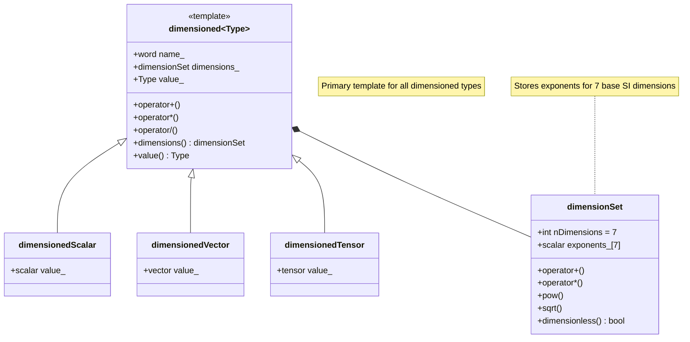

# สรุปและแบบฝึกหัด: ระบบประเภท Dimensioned ของ OpenFOAM

## สรุปภาพรวม

ระบบประเภท **dimensioned** ของ OpenFOAM เป็นการประยุกต์ใช้ **template metaprogramming** ขั้นสูงเพื่อบังคับให้ความถูกต้องทางกายภาพเกิดขึ้นในระหว่างการ **compile** ด้วยการ encode มิติไว้ในระบบประเภท OpenFOAM จึงเปลี่ยนการตรวจสอบหน่วยจาก **ภาระรันไทม์** เป็น **การประกันคอมไพล์ไทม์**

### ประโยชน์หลักของระบบ

| ประโยชน์ | คำอธิบาย | ผลกระทบ |
|-----------|------------|-----------|
| **ความปลอดภัยทางฟิสิกส์** | ป้องกันความไม่สอดคล้องกันของมิติก่อนการทำงานโปรแกรม | จับข้อผิดพลาดในขณะคอมไพล์ |
| **ประสิทธิภาพสูง** | โอเวอร์เฮดรันไทม์เป็นศูนย์ใน build ที่ optimize | ไม่กระทบประสิทธิภาพการจำลอง |
| **ความสามารถในการแสดงออก** | ไวยากรณ์ตามธรรมชาติสำหรับปริมาณทางกายภาพที่ซับซ้อน | โค้ดอ่านง่ายและบำรุงรักษาได้ |
| **ความสามารถในการขยาย** | สถาปัตยกรรม template ที่ยืดหยุ่น | รองรับฟิสิกส์เฉพาะทางและหลายฟิสิกส์ |
| **การบำรุงรักษาที่ดีขึ้น** | การตรวจจับข้อผิดพลาดในช่วงแรก | ลดเวลา debugging อย่างมาก |

---

## สถาปัตยกรรมหลัก

### 1. รากฐาน Template Metaprogramming

ระบบ dimensioned ของ OpenFOAM ใช้เทคนิค C++ ขั้นสูงหลายอย่าง:

#### CRTP (Curiously Recurring Template Pattern)

```cpp
// Base template ที่ใช้ CRTP
template<class Derived>
class DimensionedBase
{
public:
    // CRTP helper สำหรับเข้าถึงคลาส derived
    Derived& derived() { return static_cast<Derived&>(*this); }
    const Derived& derived() const { return static_cast<const Derived&>(*this); }

    // Operations ที่นิยามในรูปของ derived class
    auto operator+(const Derived& other) const
    {
        return Derived::add(derived(), other);
    }

    template<class OtherDerived>
    auto operator*(const OtherDerived& other) const
    {
        return Derived::multiply(derived(), other);
    }
};

// Concrete dimensioned type ที่ใช้ CRTP
template<class Type>
class dimensioned : public DimensionedBase<dimensioned<Type>>
{
private:
    word name_;
    dimensionSet dimensions_;
    Type value_;

public:
    // Operations ที่เปิดใช้งาน CRTP
    friend class DimensionedBase<dimensioned<Type>>;

    static dimensioned add(const dimensioned& a, const dimensioned& b)
    {
        if (a.dimensions() != b.dimensions())
        {
            FatalErrorIn("dimensioned::add")
                << "Dimensions do not match for addition: "
                << a.dimensions() << " vs " << b.dimensions()
                << abort(FatalError);
        }

        return dimensioned(
            "result",
            a.dimensions(),
            a.value() + b.value()
        );
    }

    static dimensioned multiply(const dimensioned& a, const dimensioned& b)
    {
        return dimensioned(
            "result",
            a.dimensions() * b.dimensions(),
            a.value() * b.value()
        );
    }
};
```

#### Expression Templates

```cpp
// Expression template สำหรับ dimensioned addition
template<class E1, class E2>
class DimensionedAddExpr
{
private:
    const E1& e1_;
    const E2& e2_;

public:
    typedef typename E1::value_type value_type;
    typedef typename E1::dimension_type dimension_type;

    DimensionedAddExpr(const E1& e1, const E2& e2)
    : e1_(e1), e2_(e2)
    {
        // Compile-time dimension check
        static_assert(
            std::is_same<
                typename E1::dimension_type,
                typename E2::dimension_type
            >::value,
            "Dimensions must match for addition"
        );
    }

    value_type value() const { return e1_.value() + e2_.value(); }
    dimension_type dimensions() const { return e1_.dimensions(); }

    // Enable further expression template chaining
    template<class E3>
    auto operator+(const E3& e3) const
    {
        return DimensionedAddExpr<DimensionedAddExpr<E1, E2>, E3>(*this, e3);
    }
};
```

### 2. ระบบ DimensionSet

```cpp
// Compile-time dimension representation
template<int M, int L, int T, int Theta, int N, int I, int J>
struct StaticDimension
{
    static const int mass = M;
    static const int length = L;
    static const int time = T;
    static const int temperature = Theta;
    static const int moles = N;
    static const int current = I;
    static const int luminous_intensity = J;

    // Compile-time operations
    template<int M2, int L2, int T2, int Theta2, int N2, int I2, int J2>
    using multiply = StaticDimension<
        M + M2, L + L2, T + T2,
        Theta + Theta2, N + N2, I + I2, J + J2
    >;

    template<int M2, int L2, int T2, int Theta2, int N2, int I2, int J2>
    using divide = StaticDimension<
        M - M2, L - L2, T - T2,
        Theta - Theta2, N - N2, I - I2, J - J2
    >;

    template<int Power>
    using power = StaticDimension<
        M * Power, L * Power, T * Power,
        Theta * Power, N * Power, I * Power, J * Power
    >;
};
```

### 3. มิติพื้นฐานและมิติที่ได้มา

#### มิติพื้นฐาน 7 มิติ

| มิติ | สัญลักษณ์ | หน่วย SI | คำอธิบาย |
|------|------------|-----------|-----------|
| มวล | `$M$` | กิโลกรัม | Mass |
| ความยาว | `$L$` | เมตร | Length |
| เวลา | `$T$` | วินาที | Time |
| อุณหภูมิ | `$\Theta$` | เคลวิน | Temperature |
| ปริมาณของสาร | `$N$` | โมล | Amount of substance |
| กระแสไฟฟ้า | `$I$` | แอมแปร์ | Electric current |
| ความเข้มแสง | `$J$` | แคนเดลา | Luminous intensity |

#### มิติที่ได้มาที่ใช้บ่อย

```cpp
// มิติพื้นฐาน
const dimensionSet dimless(0, 0, 0, 0, 0, 0, 0);
const dimensionSet dimMass(1, 0, 0, 0, 0, 0, 0);
const dimensionSet dimLength(0, 1, 0, 0, 0, 0, 0);
const dimensionSet dimTime(0, 0, 1, 0, 0, 0, 0);
const dimensionSet dimTemperature(0, 0, 0, 1, 0, 0, 0);

// มิติที่ได้มา
const dimensionSet dimPressure(1, -1, -2, 0, 0, 0, 0);
const dimensionSet dimDensity(1, -3, 0, 0, 0, 0, 0);
const dimensionSet dimVelocity(0, 1, -1, 0, 0, 0, 0);
const dimensionSet dimAcceleration(0, 1, -2, 0, 0, 0, 0);
const dimensionSet dimViscosity(1, -1, -1, 0, 0, 0, 0);
const dimensionSet dimEnergy(1, 2, -2, 0, 0, 0, 0);
```

---

## การตรวจสอบมิติ

### 1. การตรวจสอบในเวลาคอมไพล์

> [!INFO] **Compile-time Checking**
> การตรวจสอบมิติในเวลาคอมไพล์ใช้เทคนิค SFINAE, static_assert, และ expression templates เพื่อจับข้อผิดพลาดก่อนการรันโปรแกรม

```cpp
// Template metaprogramming เพื่อการตรวจสอบมิติ
template<class Dim1, class Dim2>
struct DimensionalAnalysis<Dim1, Dim2, AddOp>
{
    static_assert(
        std::is_same<Dim1, Dim2>::value,
        "Dimensions must match for addition"
    );
    using result_dimension = Dim1;
};

template<class Dim1, class Dim2>
struct DimensionalAnalysis<Dim1, Dim2, MultiplyOp>
{
    using result_dimension = typename Dim1::template multiply<
        Dim2::mass, Dim2::length, Dim2::time, Dim2::temperature,
        Dim2::moles, Dim2::current, Dim2::luminous_intensity
    >;
};
```

### 2. การตรวจสอบในเวลารันไทม์

> [!WARNING] **Runtime Checking**
> การตรวจสอบในเวลารันไทม์จำเป็นสำหรับการอ่านมิติจากไฟล์อินพุต การดำเนินการที่มิติถูกกำหนดโดยผู้ใช้ และการตรวจสอบ configuration dictionaries

```cpp
class DimensionSafeSolverComponent
{
public:
    void solvePressureEquation(
        volScalarField& p,
        const volScalarField& rho,
        const volVectorField& U,
        const dimensionedScalar& dt)
    {
        // Verify input dimensions
        if (p.dimensions() != dimPressure)
        {
            FatalErrorInFunction
                << "Pressure field has wrong dimensions: "
                << p.dimensions() << ", expected: " << dimPressure
                << abort(FatalError);
        }

        if (rho.dimensions() != dimDensity)
        {
            FatalErrorInFunction
                << "Density field has wrong dimensions: "
                << rho.dimensions() << ", expected: " << dimDensity
                << abort(FatalError);
        }

        if (U.dimensions() != dimVelocity)
        {
            FatalErrorInFunction
                << "Velocity field has wrong dimensions: "
                << U.dimensions() << ", expected: " << dimVelocity
                << abort(FatalError);
        }

        if (dt.dimensions() != dimTime)
        {
            FatalErrorInFunction
                << "Time step has wrong dimensions: "
                << dt.dimensions() << ", expected: " << dimTime
                << abort(FatalError);
        }

        // Pressure Poisson equation: ∇²p = ρ∇·(U·∇U)
        fvScalarMatrix pEqn
        (
            fvm::laplacian(p) == rho * fvc::div(fvc::grad(U) & U)
        );

        // Verify equation dimensions
        dimensionSet lhsDims = p.dimensions() / (dimLength * dimLength);
        dimensionSet rhsDims = rho.dimensions() * dimVelocity * dimVelocity /
                               (dimLength * dimLength * dimLength);

        if (lhsDims != rhsDims)
        {
            FatalErrorInFunction
                << "Pressure equation dimension mismatch:\n"
                << "  LHS: " << lhsDims << "\n"
                << "  RHS: " << rhsDims
                << abort(FatalError);
        }

        // Solve equation
        pEqn.solve();

        // Verify solution dimensions unchanged
        if (p.dimensions() != dimPressure)
        {
            FatalErrorInFunction
                << "Pressure field dimensions changed after solve: "
                << p.dimensions() << ", expected: " << dimPressure
                << abort(FatalError);
        }
    }

private:
    // Dimensioned constants
    dimensionedScalar tolerance_{"tolerance", dimPressure, 1e-6};
};
```

---

## ทฤษฎีและหลักการทางคณิตศาสตร์

### 1. ทฤษฎีบท Buckingham π

> [!TIP] **Buckingham π Theorem**
> ทฤษฎีบท Buckingham π ให้กรอบพื้นฐานสำหรับการวิเคราะห์มิติในพลศาสตร์ของไหลและ CFD โดยระบุว่าสมการที่มีความหมายทางกายภาพใดๆ ที่เกี่ยวข้องกับตัวแปร `$n$` ตัวสามารถเขียนใหม่ในรูปของพารามิเตอร์ไร้มิติ `$n - k$` ตัว

สำหรับตัวแปร `$Q_1, Q_2, \ldots, Q_n$` ที่มีมิติแสดงเป็น:
$$[Q_i] = \prod_{j=1}^k D_j^{a_{ij}}$$

ทฤษฎีบทนี้มองหาการรวมกันของปริมาณไร้มิติ `$\Pi_m$` ที่เกิดจาก:
$$\Pi_m = \prod_{i=1}^n Q_i^{b_{im}} \quad \text{โดยที่} \quad \sum_{i=1}^n a_{ij} b_{im} = 0 \quad \forall j$$

### 2. การวิเคราะห์มิติของสมการ Navier-Stokes

สมการโมเมนตัม:
$$\rho \frac{\partial \mathbf{u}}{\partial t} + \rho (\mathbf{u} \cdot \nabla) \mathbf{u} = -\nabla p + \mu \nabla^2 \mathbf{u} + \mathbf{f}$$

แต่ละพจน์ต้องมีมิติเดียวกัน `$[ML^{-2}T^{-2}]$` ซึ่งแทน **แรงต่อปริมาตร**

| พจน์ | นิพจน์ | มิติ |
|------|---------|-------|
| ความเฉื่อยชั่วคราว | `$\rho \frac{\partial \mathbf{u}}{\partial t}$` | `$ML^{-2}T^{-2}$` |
| การเก็บกัน | `$\rho (\mathbf{u} \cdot \nabla) \mathbf{u}$` | `$ML^{-2}T^{-2}$` |
| ความดัน | `$-\nabla p$` | `$ML^{-2}T^{-2}$` |
| การแพร่ | `$\mu \nabla^2 \mathbf{u}$` | `$ML^{-2}T^{-2}$` |
| แรงภายนอก | `$\mathbf{f}$` | `$ML^{-2}T^{-2}$` |

### 3. การทำให้ไร้มิติและจำนวนไร้มิติ

#### จำนวน Reynolds

$$\mathrm{Re} = \frac{\rho U L}{\mu} = \frac{\text{แรงเฉื่อย}}{\text{แรงเหนียว}}$$

```cpp
dimensionedScalar L("L", dimLength, 1.0);           // ความยาวลักษณะ
dimensionedScalar U("U", dimVelocity, 10.0);        // ความเร็ว
dimensionedScalar nu("nu", dimViscosity, 1e-6);     // ความหนืดจลน์

// จำนวนเรย์โนลด์: Re = U*L/nu (ไม่มีมิติ)
dimensionedScalar Re = U*L/nu;

// Re จะไม่มีมิติโดยอัตโนมัติสำหรับการตรวจสอบมิติ
if (Re.value() > 2300)
{
    Info << "การไหลเป็นแบบปั่นป่วน" << endl;
}
```

#### จำนวนไร้มิติที่สำคัญอื่นๆ

| จำนวนไร้มิติ | สูตร | คำอธิบาย |
|----------------|--------|-----------|
| **Reynolds** | `$\mathrm{Re} = \frac{\rho U L}{\mu}$` | แรงเฉื่อย/แรงหนืด |
| **Froude** | `$\mathrm{Fr} = \frac{U}{\sqrt{gL}}$` | แรงเฉื่อย/แรงโน้มถ่วง |
| **Mach** | `$\mathrm{Ma} = \frac{U}{c}$` | ความเร็ว/ความเร็วเสียง |
| **Prandtl** | `$\mathrm{Pr} = \frac{\mu c_p}{k}$` | การแพร่โมเมนตัม/ความร้อน |
| **Peclet** | `$\mathrm{Pe} = \frac{\rho c_p U L}{k}$` | การนำความร้อน convection/conduction |
| **Nusselt** | `$\mathrm{Nu} = \frac{h L}{k}$` | การถ่ายเทความร้อน convection/conduction |

---

## แอปพลิเคชันขั้นสูง

### 1. การเชื่อมโยงหลายฟิสิกส์

#### การเชื่อมโยงของไหล-โครงสร้าง (FSI)

```cpp
class FSICoupler
{
public:
    void coupleFields(
        const volVectorField& fluidForce,    // [N/m³]
        volVectorField& structuralDisplacement)  // [m]
    {
        // การตรวจสอบและแปลงมิติอัตโนมัติ
        dimensionSet forceDims = fluidForce.dimensions();
        dimensionSet displacementDims = structuralDisplacement.dimensions();

        // ตรวจสอบความสอดคล้องทางฟิสิกส์
        if (forceDims != dimForce/dimVolume)
        {
            FatalErrorInFunction << "Fluid force has wrong dimensions" << abort(FatalError);
        }

        // การคำนวณพร้อมความปลอดภัยด้านมิติ
        structuralDisplacement = complianceTensor_ & fluidForce;

        // ตรวจสอบมิติของผลลัพธ์
        if (structuralDisplacement.dimensions() != dimLength)
        {
            FatalErrorInFunction << "Displacement dimension error" << abort(FatalError);
        }
    }

private:
    dimensionedTensor complianceTensor_{
        "compliance",
        dimensionSet(0, 1, 2, 0, 0, 0, 0),  // [m/N]
        tensor::zero
    };
};
```

#### ปัญหาความร้อน-ของไหล

```cpp
class ThermoFluidDimensions
{
public:
    static void verifyEnergyEquation(
        const dimensionedScalar& rho,      // ความหนาแน่น [M L⁻³]
        const dimensionedScalar& cp,       // ความจุความร้อนจำเพาะ [L² T⁻² Θ⁻¹]
        const dimensionedScalar& T,        // อุณหภูมิ [Θ]
        const dimensionedScalar& k,        // สภาพนำความร้อน [M L T⁻³ Θ⁻¹]
        const dimensionedScalar& source)   // แหล่งพลังงาน [M L⁻¹ T⁻³]
    {
        // มิติของพจน์ convection: ρ·cp·U·∇T
        dimensionSet convectionDims =
            rho.dimensions() * cp.dimensions() * dimVelocity * dimTemperature / dimLength;
        // = [M L⁻³]·[L² T⁻² Θ⁻¹]·[L T⁻¹]·[Θ]·[L⁻¹] = [M L⁻¹ T⁻³]

        // มิติของพจน์ diffusion: ∇·(k·∇T)
        dimensionSet diffusionDims =
            k.dimensions() * dimTemperature / (dimLength * dimLength);
        // = [M L T⁻³ Θ⁻¹]·[Θ]·[L⁻²] = [M L⁻¹ T⁻³]

        // ตรวจสอบว่าพจน์ทั้งหมดมีมิติเหมือนกัน
        if (convectionDims != diffusionDims || convectionDims != source.dimensions())
        {
            FatalErrorInFunction
                << "Energy equation dimension mismatch:\n"
                << "  Convection term: " << convectionDims << "\n"
                << "  Diffusion term: " << diffusionDims << "\n"
                << "  Source term: " << source.dimensions()
                << abort(FatalError);
        }
    }
};
```

### 2. การวิเคราะห์มิติของเทนเซอร์

```cpp
class TensorDimensionalAnalysis
{
public:
    // ตรวจสอบมิติของสมการร่วม Newtonian
    static void verifyNewtonianConstitutive(
        const dimensionedTensor& tau,      // เทนเซอร์ความเค้น
        const dimensionedTensor& gammaDot, // เทนเซอร์อัตราการยืดหยุ่น
        const dimensionedScalar& mu)       // ความหนืด
    {
        // มิติของความเค้น: [M L⁻¹ T⁻²]
        dimensionSet stressDims = dimPressure;

        // มิติของอัตราการยืดหยุ่น: [T⁻¹]
        dimensionSet strainRateDims(0, 0, -1, 0, 0, 0, 0);

        // มิติของความหนืด: [M L⁻¹ T⁻¹]
        dimensionSet viscosityDims = dimDynamicViscosity;

        // ตรวจสอบความสัมพันธ์ Newtonian: τ = μ·γ̇
        dimensionSet expectedTauDims = mu.dimensions() * gammaDot.dimensions();
        if (tau.dimensions() != expectedTauDims)
        {
            FatalErrorInFunction
                << "Newtonian constitutive equation dimension mismatch. "
                << "Expected τ dimensions: " << expectedTauDims
                << ", actual: " << tau.dimensions()
                << abort(FatalError);
        }
    }
};
```

---

## แบบฝึกหัด

### แบบฝึกหัดระดับผู้เริ่มต้น

#### แบบฝึกหัดที่ 1: การสร้างและการใช้งาน DimensionedScalar

**โจทย์:** สร้าง dimensionedScalar สำหรับความเร็ว ความดัน และความหนาแน่น จากนั้นตรวจสอบว่าการดำเนินการทางคณิตศาสตร์ถูกต้อง

```cpp
// สร้าง dimensionedScalar
dimensionedScalar velocity("U", dimVelocity, 10.0);      // m/s
dimensionedScalar pressure("p", dimPressure, 101325.0);  // Pa
dimensionedScalar density("rho", dimDensity, 1.2);        // kg/m³

// แบบฝึกหัด: ตรวจสอบการดำเนินการเหล่านี้
// auto result1 = velocity + pressure;    // ควรจะเกิดข้อผิดพลาด
// auto result2 = pressure / density;     // ควรจะถูกต้อง
// auto result3 = velocity * velocity;    // ควรจะถูกต้อง

// คำถาม:
// 1. result1 จะเกิดข้อผิดพลาดหรือไม่? ทำไม?
// 2. result2 มีมิติเป็นอะไร?
// 3. result3 มีมิติเป็นอะไร?
```

#### แบบฝึกหัดที่ 2: การคำนวณจำนวน Reynolds

**โจทย์:** เขียนฟังก์ชันเพื่อคำนวณจำนวน Reynolds และตรวจสอบว่าเป็นปริมาณไร้มิติ

```cpp
dimensionedScalar calculateReynoldsNumber(
    const dimensionedScalar& rho,
    const dimensionedScalar& U,
    const dimensionedScalar& L,
    const dimensionedScalar& mu)
{
    // แบบฝึกหัด: เติมโค้ดที่ขาดหาย

    // คำถาม:
    // 1. จำนวน Reynolds ควรคำนวณอย่างไร?
    // 2. จะตรวจสอบว่าผลลัพธ์เป็นปริมาณไร้มิติหรือไม่?
    // 3. ถ้าอินพุตมีมิติไม่ถูกต้องจะเกิดอะไรขึ้น?

    dimensionedScalar Re;  // ให้เติมโค้ด
    return Re;
}
```

---

### แบบฝึกหัดระดับกลาง

#### แบบฝึกหัดที่ 3: การตรวจสอบความสอดคล้องของสมการ

**โจทย์:** ตรวจสอบความสอดคล้องของมิติสำหรับสมการพลังงาน:

$$\rho c_p \frac{\partial T}{\partial t} = k \nabla^2 T + \dot{q}$$

```cpp
void verifyEnergyEquationDimensions(
    const dimensionedScalar& rho,      // ความหนาแน่น
    const dimensionedScalar& cp,       // ความจุความร้อนจำเพาะ
    const dimensionedScalar& T,        // อุณหภูมิ
    const dimensionedScalar& k,        // สภาพนำความร้อน
    const dimensionedScalar& q_dot)    // แหล่งพลังงาน
{
    // แบบฝึกหัด:
    // 1. หามิติของพจน์ซ้ายมือ (LHS)
    // 2. หามิติของพจน์ขวามือ (RHS)
    // 3. ตรวจสอบว่าทั้งสองมีมิติตรงกันหรือไม่
    // 4. เขียนข้อความแสดงข้อผิดพลาดที่ชัดเจน

    dimensionSet lhsDims;
    dimensionSet rhsDims;

    // ให้เติมโค้ด
}
```

#### แบบฝึกหัดที่ 4: การทำให้ไร้มิติ

**โจทย์:** เขียนคลาสเพื่อทำให้สมการ Navier-Stokes เป็นไร้มิติ

```cpp
class NonDimensionalizer
{
public:
    struct ReferenceScales
    {
        dimensionedScalar length;
        dimensionedScalar velocity;
        dimensionedScalar density;
        dimensionedScalar viscosity;
    };

    void nonDimensionalizeNS(
        volVectorField& U,
        volScalarField& p,
        const ReferenceScales& scales)
    {
        // แบบฝึกหัด:
        // 1. ทำให้ฟิลด์ความเร็วเป็นไร้มิติ
        // 2. ทำให้ฟิลด์ความดันเป็นไร้มิติ
        // 3. ตรวจสอบว่าผลลัพธ์เป็นปริมาณไร้มิติ
        // 4. คำนวณจำนวน Reynolds และ Froude

        // ให้เติมโค้ด
    }
};
```

---

### แบบฝึกหัดระดับชำนาญ

#### แบบฝึกหัดที่ 5: การสร้างมิติที่กำหนดเอง

**โจทย์:** สร้างระบบมิติที่ขยายได้สำหรับแอปพลิเคชันที่มีมิติพิเศษ (เช่น ค่าเงิน ข้อมูล)

```cpp
class extendedDimensionSet : public dimensionSet
{
public:
    enum extendedDimensionType
    {
        CURRENCY = nDimensions,  // Dollars $
        INFORMATION,             // Bits
        nExtendedDimensions
    };

    // แบบฝึกหัด:
    // 1. ขยายคลาสเพื่อรองรับมิติเพิ่มเติม
    // 2. implement การดำเนินการพื้นฐาน (+, -, *, /)
    // 3. เขียนตัวอย่างการใช้งาน

    // ให้เติมโค้ด
};
```

#### แบบฝึกหัดที่ 6: การใช้งาน Expression Templates

**โจทย์:** Implement expression template สำหรับการดำเนินการ dimensioned ที่ซับซ้อน

```cpp
template<class E1, class E2>
class DimensionedMultiplyExpr
{
private:
    const E1& e1_;
    const E2& e2_;

public:
    // แบบฝึกหัด:
    // 1. กำหนด value_type และ dimension_type
    // 2. Implement constructor ที่ตรวจสอบมิติ
    // 3. Implement value() และ dimensions() methods
    // 4. เปิดใช้งาน chaining ของ expression

    // ให้เติมโค้ด
};
```

#### แบบฝึกหัดที่ 7: การวิเคราะห์มิติ FSI

**โจทย์:** Implement การตรวจสอบความเข้ากันได้ของมิติสำหรับการเชื่อมโยงของไหล-โครงสร้าง

```cpp
class AdvancedFSIDimensions
{
public:
    // แบบฝึกหัด:
    // 1. Implement การตรวจสอบความเข้ากันได้ของแรง
    // 2. Implement การตรวจสอบความเข้ากันได้ของพลังงาน
    // 3. คำนวณพารามิเตอร์ไร้มิติสำหรับ FSI
    // 4. เขียนรายงานความเข้ากันได้ของมิติ

    static void verifyForceTransfer(
        const volVectorField& fluidTraction,
        const volVectorField& structuralForce)
    {
        // ให้เติมโค้ด
    }

    static dimensionedScalar computeAddedMassCoefficient(
        const dimensionedScalar& rho_f,
        const dimensionedScalar& V_f,
        const dimensionedScalar& rho_s,
        const dimensionedScalar& V_s)
    {
        // ให้เติมโค้ด
    }
};
```

---

## แนวทางการแก้ปัญหา

### ขั้นตอนการ Debug ปัญหามิติ

1. **ระบุตำแหน่งข้อผิดพลาด**:
   ```cpp
   // เปิดการตรวจสอบมิติแบบละเอียด
   #ifdef FULLDEBUG
       Info << "Variable dimensions: " << var.dimensions() << endl;
   #endif
   ```

2. **ตรวจสอบความสอดคล้องของมิติ**:
   ```cpp
   // ตรวจสอบทีละคู่
   if (dim1 != dim2)
   {
       Info << "Dimension mismatch:" << endl;
       Info << "  Expected: " << dim1 << endl;
       Info << "  Got: " << dim2 << endl;
   }
   ```

3. **ใช้ static assertions สำหรับการตรวจสอบในเวลาคอมไพล์**:
   ```cpp
   static_assert(
       std::is_same<Dim1, Dim2>::value,
       "Dimensions must match"
   );
   ```

### กลยุทธ์การเพิ่มประสิทธิภาพ

1. **ใช้ expression templates** เพื่อกำจัด temporary objects
2. **Cache dimension sets** ที่ใช้บ่อย
3. **ปิดการตรวจสอบมิติใน release builds**:
   ```cpp
   #ifndef FULLDEBUG
       #define CHECK_DIMENSIONS(expr)
   #else
       #define CHECK_DIMENSIONS(expr) dimensionCheck(expr)
   #endif
   ```

---

## แหล่งข้อมูลเพิ่มเติม

### ไฟล์ส่วนหัวสำคัญใน OpenFOAM

| ไฟล์ส่วนหัว | คำอธิบาย |
|---------------|------------|
| `dimensionedType.H` | คลาสเทมเพลตหลักสำหรับประเภทที่มีมิติ |
| `dimensionSet.H` | การแสดงและการดำเนินการมิติ |
| `dimensionedScalar.H` | การเชี่ยวชาญสเกลาร์สำหรับค่าสเกลาร์ |
| `dimensionedConstants.H` | ค่าคงที่ไร้มิติที่กำหนดไว้ล่วงหน้า |

### หัวข้อที่เกี่ยวข้อง

1. **หัวข้อที่ 1**: Foundation Primitives - การใช้งานพื้นฐาน `dimensionedType`
2. **บทที่ 4**: Under the Hood - Template Metaprogramming Architecture
3. **บทที่ 6**: Advanced Applications - Engineering Benefits
4. **บทที่ 7**: Physics Connection - Advanced Mathematical Formulations
5. **บทที่ 8**: Solver Development - แอปพลิเคชันจริงใน solver CFD

### แผนภาพความสัมพันธ์คลาส



---

## บทสรุป

ระบบประเภท dimensioned ของ OpenFOAM เป็นตัวอย่างที่เด่นของการนำ **template metaprogramming** มาใช้ในการคำนวณทางวิทยาศาสตร์ โดยให้:

- ✅ **ความปลอดภัยทางฟิสิกส์** ผ่านการตรวจสอบมิติในเวลาคอมไพล์
- ✅ **ประสิทธิภาพสูง** ด้วย zero runtime overhead
- ✅ **ความสามารถในการแสดงออก** ที่ยอดเยี่ยมสำหรับปริมาณทางกายภาพ
- ✅ **ความสามารถในการขยาย** สำหรับฟิสิกส์เฉพาะทางและหลายฟิสิกส์
- ✅ **การบำรุงรักษาที่ดีขึ้น** ผ่านการตรวจจับข้อผิดพลาดในช่วงแรก

การผสมผสานของ **ความปลอดภัยด้านมิติ** และ **ประสิทธิภาพการคำนวณ** ทำให้กรอบการทำงานการวิเคราะห์มิติของ OpenFOAM เหมาะสำหรับทั้งแอปพลิเคชันการวิจัยและการจำลองระดับอุตสาหกรรม
