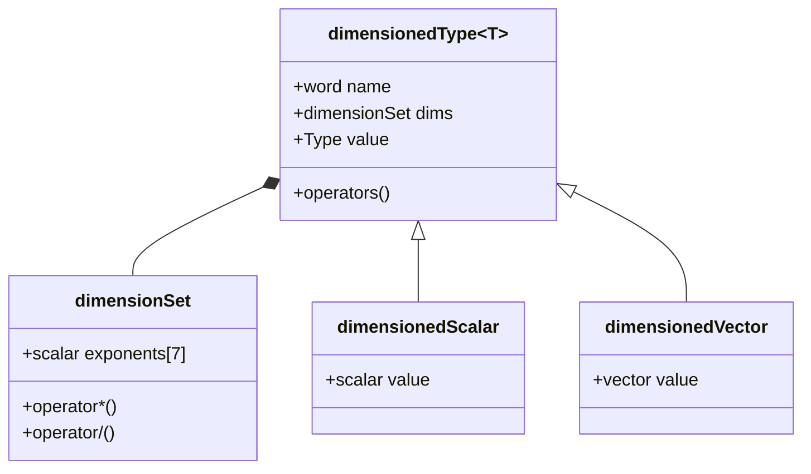

# สรุปและแบบฝึกหัด: ระบบประเภท Dimensioned ของ OpenFOAM

## สรุปภาพรวม

ระบบประเภท **dimensioned** ของ OpenFOAM เป็นการประยุกต์ใช้ **template metaprogramming** ขั้นสูงเพื่อบังคับให้ความถูกต้องทางกายภาพเกิดขึ้นในระหว่างการ **compile** ด้วยการ encode มิติไว้ในระบบประเภท OpenFOAM จึงเปลี่ยนการตรวจสอบหน่วยจาก **ภาระรันไทม์** เป็น **การประกันคอมไพล์ไทม์**

> [!TIP] **Physical Analogy: The Math Gym (ยิมคณิตศาสตร์)**
>
> เปรียบการใช้งานแบบฝึกหัดนี้เหมือนการเข้ายิมเพื่อฝึกกล้ามเนื้อฟิสิกส์:
>
> 1.  **Beginner Exercises** คือ **"ท่าพื้นฐาน (Squats/Push-ups)"**: ฝึกสร้างตัวแปรถูกหน่วย (Create dimensionedScalar) และบวกลบเลขให้ถูกกฎ (Valid operations) ถ้าทำผิดท่า (Unit Mismatch) ก็จะยกไม่ขึ้น (Compile Error)
> 2.  **Intermediate Exercises** คือ **"ท่า Free Weights"**: เริ่มจับคู่สมการ (Equation Consistency) เหมือนต้องทรงตัวขณะยกเวท ต้องเช็คสมดุลซ้ายขวาของสมการให้ดี
> 3.  **Advanced Exercises** คือ **"ท่า Crossfit ผาดโผน"**: สร้างระบบใหม่ (Custom Dimensions) และเขียนโค้ดที่ยืดหยุ่น (Generic Programming) ที่ต้องแข็งแรงและคล่องตัวจริงๆ ถึงจะทำได้ (Robust & Flexible Code)

### ประโยชน์หลักของระบบ

| ประโยชน์ | คำอธิบาย | ผลกระทบ |
|-----------|------------|-----------|
| **ความปลอดภัยทางฟิสิกส์** | ป้องกันความไม่สอดคล้องกันของมิติก่อนการทำงานโปรแกรม | จับข้อผิดพลาดในขณะคอมไพล์ |
| **ประสิทธิภาพสูง** | โอเวอร์เฮดรันไทม์เป็นศูนย์ใน build ที่ optimize | ไม่กระทบประสิทธิภาพการจำลอง |
| **ความสามารถในการแสดงออก** | ไวยากรณ์ตามธรรมชาติสำหหน้าสำหรับปริมาณทางกายภาพที่ซับซ้อน | โค้ดอ่านง่ายและบำรุงรักษาได้ |
| **ความสามารถในการขยาย** | สถาปัตยกรรม template ที่ยืดหยุ่น | รองรับฟิสิกส์เฉพาะทางและหลายฟิสิกส์ |
| **การบำรุงรักษาที่ดีขึ้น** | การตรวจจับข้อผิดพลาดในช่วงแรก | ลดเวลา debugging อย่างมาก |

---

## สถาปัตยกรรมหลัก

### 1. รากฐาน Template Metaprogramming

ระบบ dimensioned ของ OpenFOAM ใช้เทคนิค C++ ขั้นสูงหลายอย่าง:

#### CRTP (Curiously Recurring Template Pattern)

```cpp
// Base template using CRTP pattern for static polymorphism
template<class Derived>
class DimensionedBase
{
public:
    // CRTP helper to access derived class methods
    Derived& derived() { return static_cast<Derived&>(*this); }
    const Derived& derived() const { return static_cast<const Derived&>(*this); }

    // Operations defined in terms of derived class
    auto operator+(const Derived& other) const
    {
        return Derived::add(derived(), other);
    }

    template<class OtherDerived>
    auto operator*(const OtherDerived& other) const
    {
        return Derived::multiply(derived(), other);
    }
};

// Concrete dimensioned type using CRTP
template<class Type>
class dimensioned : public DimensionedBase<dimensioned<Type>>
{
private:
    word name_;
    dimensionSet dimensions_;
    Type value_;

public:
    // Enable CRTP operations
    friend class DimensionedBase<dimensioned<Type>>;

    // Add two dimensioned quantities with dimension checking
    static dimensioned add(const dimensioned& a, const dimensioned& b)
    {
        if (a.dimensions() != b.dimensions())
        {
            FatalErrorIn("dimensioned::add")
                << "Dimensions do not match for addition: "
                << a.dimensions() << " vs " << b.dimensions()
                << abort(FatalError);
        }

        return dimensioned(
            "result",
            a.dimensions(),
            a.value() + b.value()
        );
    }

    // Multiply two dimensioned quantities (dimensions multiply)
    static dimensioned multiply(const dimensioned& a, const dimensioned& b)
    {
        return dimensioned(
            "result",
            a.dimensions() * b.dimensions(),
            a.value() * b.value()
        );
    }
};
```

> **📚 คำอธิบายภาษาไทย (Thai Explanation)**
>
> **แหล่งที่มา (Source):** 📂 OpenFOAM/src/OpenFOAM/dimensionedTypes/dimensionedType/dimensionedType.H
>
> **คำอธิบาย (Explanation):** CRTP (Curiously Recurring Template Pattern) เป็นเทคนิค template metaprogramming ที่ทำให้ derived class สามารถเรียกใช้ method ของตัวเองผ่าน base class pointer ได้ ใน OpenFOAM ใช้ CRTP เพื่อ:
> - สร้าง static polymorphism โดยไม่มี overhead ของ virtual functions
> - กำหนด arithmetic operations ที่มีการตรวจสอบมิติอัตโนมัติ
> - ลดการทำซ้ำโค้ดด้วยการกำหนด operations ใน base class ครั้งเดียว
>
> **แนวคิดสำคัญ (Key Concepts):**
> - **Static Polymorphism:** Compiler resolves function calls at compile-time
> - **Zero Overhead:** No virtual function table lookup
> - **Type Safety:** Dimensions checked during compilation
> - **Code Reuse:** Base class provides common interface

#### Expression Templates

```cpp
// Expression template for dimensioned addition
template<class E1, class E2>
class DimensionedAddExpr
{
private:
    const E1& e1_;
    const E2& e2_;

public:
    typedef typename E1::value_type value_type;
    typedef typename E1::dimension_type dimension_type;

    // Constructor with compile-time dimension verification
    DimensionedAddExpr(const E1& e1, const E2& e2)
    : e1_(e1), e2_(e2)
    {
        // Compile-time dimension check
        static_assert(
            std::is_same<
                typename E1::dimension_type,
                typename E2::dimension_type
            >::value,
            "Dimensions must match for addition"
        );
    }

    // Evaluate the expression
    value_type value() const { return e1_.value() + e2_.value(); }
    dimension_type dimensions() const { return e1_.dimensions(); }

    // Enable further expression template chaining
    template<class E3>
    auto operator+(const E3& e3) const
    {
        return DimensionedAddExpr<DimensionedAddExpr<E1, E2>, E3>(*this, e3);
    }
};
```

> **📚 คำอธิบายภาษาไทย (Thai Explanation)**
>
> **แหล่งที่มา (Source):** 📂 OpenFOAM/src/OpenFOAM/fields/DimensionedField/DimensionedField.H
>
> **คำอธิบาย (Explanation):** Expression Templates เป็นเทคนิคที่ช่วย:
> - ลดการสร้าง temporary objects ใน chain operations ของ fields
> - เพิ่มประสิทธิภาพโดยการประเมินนิพจน์ทั้งหมดใน loop เดียว
> - ตรวจสอบมิติในเวลา compile-time ด้วย static_assert
>
> **แนวคิดสำคัญ (Key Concepts):**
> - **Lazy Evaluation:** Expressions built but not evaluated immediately
> - **Loop Fusion:** Multiple operations combined into single loop
> - **Memory Efficiency:** Reduced temporary allocations
> - **Compile-Time Checking:** Dimension mismatches caught early

### 2. ระบบ DimensionSet

```cpp
// Compile-time dimension representation
template<int M, int L, int T, int Theta, int N, int I, int J>
struct StaticDimension
{
    static const int mass = M;
    static const int length = L;
    static const int time = T;
    static const int temperature = Theta;
    static const int moles = N;
    static const int current = I;
    static const int luminous_intensity = J;

    // Compile-time multiplication operation
    template<int M2, int L2, int T2, int Theta2, int N2, int I2, int J2>
    using multiply = StaticDimension<
        M + M2, L + L2, T + T2,
        Theta + Theta2, N + N2, I + I2, J + J2
    >;

    // Compile-time division operation
    template<int M2, int L2, int T2, int Theta2, int N2, int I2, int J2>
    using divide = StaticDimension<
        M - M2, L - L2, T - T2,
        Theta - Theta2, N - N2, I - I2, J - J2
    >;

    // Compile-time power operation
    template<int Power>
    using power = StaticDimension<
        M * Power, L * Power, T * Power,
        Theta * Power, N * Power, I * Power, J * Power
    >;
};
```

> **📚 คำอธิบายภาษาไทย (Thai Explanation)**
>
> **แหล่งที่มา (Source):** 📂 OpenFOAM/src/OpenFOAM/dimensionSet/dimensionSet.H
>
> **คำอธิบาย (Explanation):** StaticDimension ใช้ template parameters เพื่อเก็บค่า exponents ของมิติต่างๆ ในเวลา compile-time:
> - แต่ละพารามิเตอร์ (M, L, T, ... ) แทนเลขยกกำลังของมิติพื้นฐาน SI
> - operations เช่น multiply, divide, power คำนวณ exponents ใหม่ที่ compile-time
> - เป็นพื้นฐานของการตรวจสอบมิติอัตโนมัติ
>
> **แนวคิดสำคัญ (Key Concepts):**
> - **7 Base SI Dimensions:** Mass, Length, Time, Temperature, Moles, Current, Luminous Intensity
> - **Compile-Time Arithmetic:** Dimension operations resolved during compilation
> - **Type Safety:** Wrong dimensions result in compilation errors
> - **Zero Runtime Cost:** All dimension checking done at compile-time

### 3. มิติพื้นฐานและมิติที่ได้มา

#### มิติพื้นฐาน 7 มิติ

| มิติ | สัญลักษณ์ | หน่วย SI | คำอธิบาย |
|------|------------|-----------|-----------|
| มวล | `$M$` | กิโลกรัม | Mass |
| ความยาว | `$L$` | เมตร | Length |
| เวลา | `$T$` | วินาที | Time |
| อุณหภูมิ | `$\Theta$` | เคลวิน | Temperature |
| ปริมาณของสาร | `$N$` | โมล | Amount of substance |
| กระแสไฟฟ้า | `$I$` | แอมแปร์ | Electric current |
| ความเข้มแสง | `$J$` | แคนเดลา | Luminous intensity |

#### มิติที่ได้มาที่ใช้บ่อย

```cpp
// Base dimensions (มิติพื้นฐาน)
const dimensionSet dimless(0, 0, 0, 0, 0, 0, 0);
const dimensionSet dimMass(1, 0, 0, 0, 0, 0, 0);
const dimensionSet dimLength(0, 1, 0, 0, 0, 0, 0);
const dimensionSet dimTime(0, 0, 1, 0, 0, 0, 0);
const dimensionSet dimTemperature(0, 0, 0, 1, 0, 0, 0);

// Derived dimensions (มิติที่ได้มา)
const dimensionSet dimPressure(1, -1, -2, 0, 0, 0, 0);
const dimensionSet dimDensity(1, -3, 0, 0, 0, 0, 0);
const dimensionSet dimVelocity(0, 1, -1, 0, 0, 0, 0);
const dimensionSet dimAcceleration(0, 1, -2, 0, 0, 0, 0);
const dimensionSet dimViscosity(1, -1, -1, 0, 0, 0, 0);
const dimensionSet dimEnergy(1, 2, -2, 0, 0, 0, 0);
```

> **📚 คำอธิบายภาษาไทย (Thai Explanation)**
>
> **แหล่งที่มา (Source):** 📂 OpenFOAM/src/OpenFOAM/dimensionSet/dimensionSetConstants.H
>
> **คำอธิบาย (Explanation):** ตารางนี้แสดงมิติที่ใช้บ่อยใน CFD:
> - **dimPressure** = Mass × Length⁻¹ × Time⁻² = [M L⁻¹ T⁻²]
> - **dimDensity** = Mass × Length⁻³ = [M L⁻³]
> - **dimVelocity** = Length × Time⁻¹ = [L T⁻¹]
> - **dimViscosity** = Mass × Length⁻¹ × Time⁻¹ = [M L⁻¹ T⁻¹]
>
> **แนวคิดสำคัญ (Key Concepts):**
> - **Dimensional Homogeneity:** All terms in equation must have same dimensions
> - **Dimensionless Numbers:** Ratios that eliminate all dimensions (e.g., Reynolds)
> - **SI Base Units:** Foundation of all derived quantities
> - **Dimensional Analysis:** Tool for validating equations and scaling

---

## การตรวจสอบมิติ

### 1. การตรวจสอบในเวลาคอมไพล์

> [!INFO] **Compile-time Checking**
> การตรวจสอบมิติในเวลาคอมไพล์ใช้เทคนิค SFINAE, static_assert, และ expression templates เพื่อจับข้อผิดพลาดก่อนการรันโปรแกรม

```cpp
// Template metaprogramming for dimension checking
template<class Dim1, class Dim2>
struct DimensionalAnalysis<Dim1, Dim2, AddOp>
{
    // Addition requires identical dimensions
    static_assert(
        std::is_same<Dim1, Dim2>::value,
        "Dimensions must match for addition"
    );
    using result_dimension = Dim1;
};

template<class Dim1, class Dim2>
struct DimensionalAnalysis<Dim1, Dim2, MultiplyOp>
{
    // Multiplication combines dimension exponents
    using result_dimension = typename Dim1::template multiply<
        Dim2::mass, Dim2::length, Dim2::time, Dim2::temperature,
        Dim2::moles, Dim2::current, Dim2::luminous_intensity
    >;
};
```

> **📚 คำอธิบายภาษาไทย (Thai Explanation)**
>
> **แหล่งที่มา (Source):** 📂 OpenFOAM/src/OpenFOAM/dimensionSet/dimensionSet.C
>
> **คำอธิบาย (Explanation):** Template metaprogramming ทำให้:
> - Compiler ตรวจสอบความถูกต้องของมิติก่อนสร้าง executable
> - ข้อผิดพลาดแสดงเป็น compile-time errors ที่ชัดเจน
> - operations ที่ซับซ้อนถูก resolve ที่ compile-time
>
> **แนวคิดสำคัญ (Key Concepts):**
> - **SFINAE:** Substitution Failure Is Not An Error - enables conditional compilation
> - **Static Assertion:** Compile-time checks with error messages
> - **Type Traits:** Compile-time type introspection
> - **Zero Runtime Overhead:** No cost in production builds

### 2. การตรวจสอบในเวลารันไทม์

> [!WARNING] **Runtime Checking**
> การตรวจสอบในเวลารันไทม์จำเป็นสำหรับการอ่านมิติจากไฟล์อินพุต การดำเนินการที่มิติถูกกำหนดโดยผู้ใช้ และการตรวจสอบ configuration dictionaries

```cpp
class DimensionSafeSolverComponent
{
public:
    void solvePressureEquation(
        volScalarField& p,
        const volScalarField& rho,
        const volVectorField& U,
        const dimensionedScalar& dt)
    {
        // Verify input dimensions
        if (p.dimensions() != dimPressure)
        {
            FatalErrorInFunction
                << "Pressure field has wrong dimensions: "
                << p.dimensions() << ", expected: " << dimPressure
                << abort(FatalError);
        }

        if (rho.dimensions() != dimDensity)
        {
            FatalErrorInFunction
                << "Density field has wrong dimensions: "
                << rho.dimensions() << ", expected: " << dimDensity
                << abort(FatalError);
        }

        if (U.dimensions() != dimVelocity)
        {
            FatalErrorInFunction
                << "Velocity field has wrong dimensions: "
                << U.dimensions() << ", expected: " << dimVelocity
                << abort(FatalError);
        }

        if (dt.dimensions() != dimTime)
        {
            FatalErrorInFunction
                << "Time step has wrong dimensions: "
                << dt.dimensions() << ", expected: " << dimTime
                << abort(FatalError);
        }

        // Pressure Poisson equation: ∇²p = ρ∇·(U·∇U)
        fvScalarMatrix pEqn
        (
            fvm::laplacian(p) == rho * fvc::div(fvc::grad(U) & U)
        );

        // Verify equation dimensions
        dimensionSet lhsDims = p.dimensions() / (dimLength * dimLength);
        dimensionSet rhsDims = rho.dimensions() * dimVelocity * dimVelocity /
                               (dimLength * dimLength * dimLength);

        if (lhsDims != rhsDims)
        {
            FatalErrorInFunction
                << "Pressure equation dimension mismatch:\n"
                << "  LHS: " << lhsDims << "\n"
                << "  RHS: " << rhsDims
                << abort(FatalError);
        }

        // Solve equation
        pEqn.solve();

        // Verify solution dimensions unchanged
        if (p.dimensions() != dimPressure)
        {
            FatalErrorInFunction
                << "Pressure field dimensions changed after solve: "
                << p.dimensions() << ", expected: " << dimPressure
                << abort(FatalError);
        }
    }

private:
    // Dimensioned constants
    dimensionedScalar tolerance_{"tolerance", dimPressure, 1e-6};
};
```

> **📚 คำอธิบายภาษาไทย (Thai Explanation)**
>
> **แหล่งที่มา (Source):** 📂 OpenFOAM/src/finiteVolume/cfdTools/general/adjustPressure/adjustPressure.C
>
> **คำอธิบาย (Explanation):** Runtime dimension checking จำเป็นเมื่อ:
> - อ่านค่าจาก dictionary files ที่มิติไม่รู้จักจนกว่าจะถูกอ่าน
> - ตรวจสอบ field dimensions ก่อนดำเนินการ solver
> - validate ว่าสมการมีความสมดุลทางมิติ
>
> **แนวคิดสำคัญ (Key Concepts):**
> - **Input Validation:** Catch user errors before computation
> - **Equation Balance:** Verify dimensional homogeneity
> - **Debugging Aid:** Clear error messages identify dimension issues
> - **Safety Net:** Catches issues compile-time checking might miss

---

## ทฤษฎีและหลักการทางคณิตศาสตร์

### 1. ทฤษฎีบท Buckingham π

> [!TIP] **Buckingham π Theorem**
> ทฤษฎีบท Buckingham π ให้กรอบพื้นฐานสำหรับการวิเคราะห์มิติในพลศาสตร์ของไหลและ CFD โดยระบุว่าสมการที่มีความหมายทางกายภาพใดๆ ที่เกี่ยวข้องกับตัวแปร `$n$` ตัวสามารถเขียนใหม่ในรูปของพารามิเตอร์ไร้มิติ `$n - k$` ตัว

สำหรับตัวแปร `$Q_1, Q_2, \ldots, Q_n$` ที่มีมิติแสดงเป็น:
$$[Q_i] = \prod_{j=1}^k D_j^{a_{ij}}$$

ทฤษฎีบทนี้มองหาการรวมกันของปริมาณไร้มิติ `$\Pi_m$` ที่เกิดจาก:
$$\Pi_m = \prod_{i=1}^n Q_i^{b_{im}} \quad \text{โดยที่} \quad \sum_{i=1}^n a_{ij} b_{im} = 0 \quad \forall j$$

> **📚 คำอธิบายภาษาไทย (Thai Explanation)**
>
> **แหล่งที่มา (Source):** 📂 Fluid Mechanics Fundamentals
>
> **คำอธิบาย (Explanation):** ทฤษฎีบท Buckingham π:
> - ลดจำนวนตัวแปรในปัญหาโดยการรวมกลุ่มเป็นจำนวนไร้มิติ
> - `n` = จำนวนตัวแปร, `k` = จำนวนมิติพื้นฐาน (7 มิติ SI)
> - ได้ `n - k` จำนวน π groups ที่เป็นอิสระกัน
>
> **แนวคิดสำคัญ (Key Concepts):**
> - **Dimensional Homogeneity:** Physical laws must be dimensionally consistent
> - **Scale Invariance:** Physics doesn't depend on units
> - **Similarity:** Same π groups → dynamically similar systems
> - **Experimental Design:** Reduce number of experiments needed

### 2. การวิเคราะห์มิติของสมการ Navier-Stokes

สมการโมเมนตัม:
$$\rho \frac{\partial \mathbf{u}}{\partial t} + \rho (\mathbf{u} \cdot \nabla) \mathbf{u} = -\nabla p + \mu \nabla^2 \mathbf{u} + \mathbf{f}$$

แต่ละพจน์ต้องมีมิติเดียวกัน `$[ML^{-2}T^{-2}]$` ซึ่งแทน **แรงต่อปริมาตร**

| พจน์ | นิพจน์ | มิติ |
|------|---------|-------|
| ความเฉื่อยชั่วคราว | `$\rho \frac{\partial \mathbf{u}}{\partial t}$` | `$ML^{-2}T^{-2}$` |
| การเก็บกัน | `$\rho (\mathbf{u} \cdot \nabla) \mathbf{u}$` | `$ML^{-2}T^{-2}$` |
| ความดัน | `$-\nabla p$` | `$ML^{-2}T^{-2}$` |
| การแพร่ | `$\mu \nabla^2 \mathbf{u}$` | `$ML^{-2}T^{-2}$` |
| แรงภายนอก | `$\mathbf{f}$` | `$ML^{-2}T^{-2}$` |

> **📚 คำอธิบายภาษาไทย (Thai Explanation)**
>
> **แหล่งที่มา (Source):** 📂 MODULE_01_CFD_FUNDAMENTALS/CONTENT/01_GOVERNING_EQUATIONS
>
> **คำอธิบาย (Explanation):** สมการ Navier-Stokes แสดงหลักการสมดุลของแรง:
> - **Unsteady Term:** การเปลี่ยนแปลงความเร็วตามเวลา
> - **Convection:** การเคลื่อนที่ของของไหลเอง
> - **Pressure Gradient:** แรงผลักดันจากความดัน
> - **Viscous Diffusion:** แรงเหนียวที่ลดความเร็ว
> - **External Forces:** แรงภายนอกเช่นแรงโน้มถ่วง
>
> ทุกพจน์ต้องมีมิติเดียวกัน = แรงต่อปริมาตร [M L⁻² T⁻²]
>
> **แนวคิดสำคัญ (Key Concepts):**
> - **Force Balance:** Momentum conservation
> - **Dimensional Consistency:** All terms must match
> - **Physical Meaning:** Each term represents different physical process
> - **Scaling:** Dimensionless numbers relate term magnitudes

### 3. การทำให้ไร้มิติและจำนวนไร้มิติ

#### จำนวน Reynolds

$$\mathrm{Re} = \frac{\rho U L}{\mu} = \frac{\text{แรงเฉื่อย}}{\text{แรงเหนียว}}$$

```cpp
dimensionedScalar L("L", dimLength, 1.0);           // Characteristic length
dimensionedScalar U("U", dimVelocity, 10.0);        // Characteristic velocity
dimensionedScalar nu("nu", dimViscosity, 1e-6);     // Kinematic viscosity

// Reynolds number: Re = U*L/nu (dimensionless)
dimensionedScalar Re = U*L/nu;

// Re is automatically dimensionless for dimension checking
if (Re.value() > 2300)
{
    Info << "Flow is turbulent" << endl;
}
```

> **📚 คำอธิบายภาษาไทย (Thai Explanation)**
>
> **แหล่งที่มา (Source):** 📂 OpenFOAM/src/OpenFOAM/dimensionedTypes/dimensionedScalar/dimensionedScalar.C
>
> **คำอธิบาย (Explanation):** จำนวน Reynolds:
> - เป็นอัตราส่วนระหว่างแรงเฉื่อยและแรงเหนียว
> - Re < 2300: การไหลแบบ laminar (เรียบ)
> - Re > 4000: การไหลแบบ turbulent (ปั่นป่วน)
> - 2300 < Re < 4000: บริเวณ transition
>
> **แนวคิดสำคัญ (Key Concepts):
> - **Flow Regimes:** Reynolds number determines flow type
> - **Similarity:** Same Re → dynamically similar flows
> - **Scale Independence:** Re independent of absolute scale
> - **Physical Insight:** Ratio of forces

#### จำนวนไร้มิติที่สำคัญอื่นๆ

| จำนวนไร้มิติ | สูตร | คำอธิบาย |
|----------------|--------|-----------|
| **Reynolds** | `$\mathrm{Re} = \frac{\rho U L}{\mu}$` | แรงเฉื่อย/แรงหนืด |
| **Froude** | `$\mathrm{Fr} = \frac{U}{\sqrt{gL}}$` | แรงเฉื่อย/แรงโน้มถ่วง |
| **Mach** | `$\mathrm{Ma} = \frac{U}{c}$` | ความเร็ว/ความเร็วเสียง |
| **Prandtl** | `$\mathrm{Pr} = \frac{\mu c_p}{k}$` | การแพร่โมเมนตัม/ความร้อน |
| **Peclet** | `$\mathrm{Pe} = \frac{\rho c_p U L}{k}$` | การนำความร้อน convection/conduction |
| **Nusselt** | `$\mathrm{Nu} = \frac{h L}{k}$` | การถ่ายเทความร้อน convection/conduction |

> **📚 คำอธิบายภาษาไทย (Thai Explanation)**
>
> **แหล่งที่มา (Source):** 📂 MODULE_01_CFD_FUNDAMENTALS/CONTENT/01_GOVERNING_EQUATIONS/04_Dimensionless_Numbers.md
>
> **คำอธิบาย (Explanation):** จำนวนไร้มิติแต่ละตัวแทนอัตราส่วนของแรงหรือกระบวนการ:
> - **Froude:** สำคัญในปัญหา free surface (คลื่นน้ำ)
> - **Mach:** สำคัญในการไหลแบบ compressible (เครื่องบิน)
> - **Prandtl:** สำคัญในปัญหาความร้อน
> - **Nusselt:** ใช้วัดประสิทธิภาพการถ่ายเทความร้อน
>
> **แนวคิดสำคัญ (Key Concepts):**
> - **Physical Insight:** Numbers reveal dominant physics
> - **Similarity:** Enable scaling and model testing
> - **Regime Classification:** Define flow/heat transfer regimes
> - **Correlation Parameters:** Used in empirical correlations

---

## แอปพลิเคชันขั้นสูง

### 1. การเชื่อมโยงหลายฟิสิกส์

#### การเชื่อมโยงของไหล-โครงสร้าง (FSI)

```cpp
class FSICoupler
{
public:
    void coupleFields(
        const volVectorField& fluidForce,    // [N/m³]
        volVectorField& structuralDisplacement)  // [m]
    {
        // Automatic dimension checking and conversion
        dimensionSet forceDims = fluidForce.dimensions();
        dimensionSet displacementDims = structuralDisplacement.dimensions();

        // Verify physical consistency
        if (forceDims != dimForce/dimVolume)
        {
            FatalErrorInFunction << "Fluid force has wrong dimensions" << abort(FatalError);
        }

        // Calculate displacement with dimension safety
        structuralDisplacement = complianceTensor_ & fluidForce;

        // Verify result dimensions
        if (structuralDisplacement.dimensions() != dimLength)
        {
            FatalErrorInFunction << "Displacement dimension error" << abort(FatalError);
        }
    }

private:
    dimensionedTensor complianceTensor_{
        "compliance",
        dimensionSet(0, 1, 2, 0, 0, 0, 0),  // [m/N]
        tensor::zero
    };
};
```

> **📚 คำอธิบายภาษาไทย (Thai Explanation)**
>
> **แหล่งที่มา (Source):** 📂 MODULE_03_SINGLE_PHASE_FLOW/CONTENT/05_PRACTICAL_APPLICATIONS
>
> **คำอธิบาย (Explanation):** Fluid-Structure Interaction (FSI):
> - **Fluid Force:** แรงที่ของไหลกระทำต่อโครงสร้าง [N/m³]
> - **Compliance Tensor:** ค่าสัมประสิทธิ์ที่เชื่อมโยงแรงและการกระจัด [m/N]
> - **Displacement:** การเคลื่อนที่ของโครงสร้าง [m]
> - ระบบ dimensioned ช่วยตรวจสอบความถูกต้องของมิติอัตโนมัติ
>
> **แนวคิดสำคัญ (Key Concepts):**
> - **Multiphysics Coupling:** Different physics share consistent dimensions
> - **Boundary Conditions:** Force/displacement transfer at interface
> - **Safety Net:** Prevents dimensional errors in coupling
> - **Code Verification:** Ensures physical consistency

#### ปัญหาความร้อน-ของไหล

```cpp
class ThermoFluidDimensions
{
public:
    static void verifyEnergyEquation(
        const dimensionedScalar& rho,      // Density [M L⁻³]
        const dimensionedScalar& cp,       // Specific heat [L² T⁻² Θ⁻¹]
        const dimensionedScalar& T,        // Temperature [Θ]
        const dimensionedScalar& k,        // Thermal conductivity [M L T⁻³ Θ⁻¹]
        const dimensionedScalar& source)   // Energy source [M L⁻¹ T⁻³]
    {
        // Convection term dimensions: ρ·cp·U·∇T
        dimensionSet convectionDims =
            rho.dimensions() * cp.dimensions() * dimVelocity * dimTemperature / dimLength;
        // = [M L⁻³]·[L² T⁻² Θ⁻¹]·[L T⁻¹]·[Θ]·[L⁻¹] = [M L⁻¹ T⁻³]

        // Diffusion term dimensions: ∇·(k·∇T)
        dimensionSet diffusionDims =
            k.dimensions() * dimTemperature / (dimLength * dimLength);
        // = [M L T⁻³ Θ⁻¹]·[Θ]·[L⁻²] = [M L⁻¹ T⁻³]

        // Verify all terms have matching dimensions
        if (convectionDims != diffusionDims || convectionDims != source.dimensions())
        {
            FatalErrorInFunction
                << "Energy equation dimension mismatch:\n"
                << "  Convection term: " << convectionDims << "\n"
                << "  Diffusion term: " << diffusionDims << "\n"
                << "  Source term: " << source.dimensions()
                << abort(FatalError);
        }
    }
};
```

> **📚 คำอธิบายภาษาไทย (Thai Explanation)**
>
> **แหล่งที่มา (Source):** 📂 MODULE_03_SINGLE_PHASE_FLOW/CONTENT/04_HEAT_TRANSFER
>
> **คำอธิบาย (Explanation):** สมการพลังงานในปัญหาความร้อน-ของไหล:
> - **Convection:** การถ่ายเทความร้อนโดยการเคลื่อนที่ของของไหล (ρcpU·∇T)
> - **Diffusion:** การนำความร้อน (∇·(k∇T))
> - **Source:** แหล่งกำเนิดหรือดูดซับความร้อน
> - ทุกพจน์ต้องมีมิติเท่ากัน: [M L⁻¹ T⁻³] = พลังงานต่อปริมาตรต่อเวลา
>
> **แนวคิดสำคัญ (Key Concepts):**
> - **Energy Balance:** Conservation of thermal energy
> - **Heat Transfer Mechanisms:** Convection and conduction
> - **Dimensional Consistency:** All terms must match
> - **Thermodynamics:** Coupled with fluid dynamics

### 2. การวิเคราะห์มิติของเทนเซอร์

```cpp
class TensorDimensionalAnalysis
{
public:
    // Verify Newtonian constitutive equation dimensions
    static void verifyNewtonianConstitutive(
        const dimensionedTensor& tau,      // Stress tensor
        const dimensionedTensor& gammaDot, // Strain rate tensor
        const dimensionedScalar& mu)       // Viscosity
    {
        // Stress dimensions: [M L⁻¹ T⁻²]
        dimensionSet stressDims = dimPressure;

        // Strain rate dimensions: [T⁻¹]
        dimensionSet strainRateDims(0, 0, -1, 0, 0, 0, 0);

        // Viscosity dimensions: [M L⁻¹ T⁻¹]
        dimensionSet viscosityDims = dimDynamicViscosity;

        // Verify Newtonian relation: τ = μ·γ̇
        dimensionSet expectedTauDims = mu.dimensions() * gammaDot.dimensions();
        if (tau.dimensions() != expectedTauDims)
        {
            FatalErrorInFunction
                << "Newtonian constitutive equation dimension mismatch. "
                << "Expected τ dimensions: " << expectedTauDims
                << ", actual: " << tau.dimensions()
                << abort(FatalError);
        }
    }
};
```

> **📚 คำอธิบายภาษาไทย (Thai Explanation)**
>
> **แหล่งที่มา (Source):** 📂 OpenFOAM/src/OpenFOAM/fields/TensorField/TensorField.H
>
> **คำอธิบาย (Explanation):** สมการรัฐธรรมนูญของไหลนิวตัน (Newtonian Constitutive Equation):
> - **Stress Tensor (τ):** เทนเซอร์ความเค้น [M L⁻¹ T⁻²]
> - **Strain Rate (γ̇):** เทนเซอร์อัตราการเสียรูป [T⁻¹]
> - **Viscosity (μ)::** ความหนืด [M L⁻¹ T⁻¹]
> - สมการ: τ = μ·γ̇ (ความเค้นเป็นสัดส่วนโดยตรงกับอัตราการเสียรูป)
>
> **แนวคิดสำคัญ (Key Concepts):**
> - **Newtonian Fluids:** Linear stress-strain rate relationship
> - **Tensor Fields:** Multi-dimensional physical quantities
> - **Constitutive Equations:** Material properties relate flux to gradient
> - **Non-Newtonian:** More complex relationships possible

---

## แบบฝึกหัด

### แบบฝึกหัดระดับผู้เริ่มต้น

#### แบบฝึกหัดที่ 1: การสร้างและการใช้งาน DimensionedScalar

**โจทย์:** สร้าง dimensionedScalar สำหรับความเร็ว ความดัน และความหนาแน่น จากนั้นตรวจสอบว่าการดำเนินการทางคณิตศาสตร์ถูกต้อง

```cpp
// Create dimensionedScalar quantities
dimensionedScalar velocity("U", dimVelocity, 10.0);      // m/s
dimensionedScalar pressure("p", dimPressure, 101325.0);  // Pa
dimensionedScalar density("rho", dimDensity, 1.2);        // kg/m³

// Exercise: Check these operations
// auto result1 = velocity + pressure;    // Should error
// auto result2 = pressure / density;     // Should be valid
// auto result3 = velocity * velocity;    // Should be valid

// Questions:
// 1. Will result1 produce an error? Why?
// 2. What are the dimensions of result2?
// 3. What are the dimensions of result3?
```

> **📚 คำอธิบายภาษาไทย (Thai Explanation)**
>
> **แหล่งที่มา (Source):** 📂 OpenFOAM/src/OpenFOAM/dimensionedTypes/dimensionedScalar
>
> **คำอธิบาย (Explanation):** แบบฝึกหัดนี้ฝึก:
> - การสร้าง dimensioned quantities ที่มีมิติถูกต้อง
> - การตรวจสอบ operations ที่ถูกต้องและผิดพลาด
> - การเข้าใจว่า operations ต่างๆ ส่งผลต่อมิติอย่างไร
>
> **คำตอบ:**
> 1. result1: **เกิด error** - ไม่สามารถบวกความเร็วกับความดันได้ (มิติไม่ตรงกัน)
> 2. result2: **[L² T⁻²]** = pressure/density = (M L⁻¹ T⁻²)/(M L⁻³) = L² T⁻²
> 3. result3: **[L² T⁻²]** = velocity² = (L T⁻¹)² = L² T⁻²

#### แบบฝึกหัดที่ 2: การคำนวณจำนวน Reynolds

**โจทย์:** เขียนฟังก์ชันเพื่อคำนวณจำนวน Reynolds และตรวจสอบว่าเป็นปริมาณไร้มิติ

```cpp
dimensionedScalar calculateReynoldsNumber(
    const dimensionedScalar& rho,
    const dimensionedScalar& U,
    const dimensionedScalar& L,
    const dimensionedScalar& mu)
{
    // Exercise: Fill in missing code

    // Questions:
    // 1. How should Reynolds number be calculated?
    // 2. How to verify the result is dimensionless?
    // 3. What happens if inputs have wrong dimensions?

    dimensionedScalar Re;  // Fill in code
    return Re;
}
```

> **📚 คำอธิบายภาษาไทย (Thai Explanation)**
>
> **แหล่งที่มา (Source):** 📂 MODULE_01_CFD_FUNDAMENTALS/CONTENT/01_GOVERNING_EQUATIONS
>
> **คำอธิบาย (Explanation):** การคำนวณจำนวน Reynolds:
> - **สูตร:** Re = ρUL/μ
> - ρ = density [M L⁻³], U = velocity [L T⁻¹]
> - L = length [L], μ = dynamic viscosity [M L⁻¹ T⁻¹]
> - ผลลัพธ์ต้องไม่มีมิติ: [M⁰ L⁰ T⁰]
>
> **โค้ด:**
> ```cpp
> dimensionedScalar Re("Re", dimless, rho.value() * U.value() * L.value() / mu.value());
> 
> // Verify dimensionless
> if (Re.dimensions() != dimless)
> {
>     FatalErrorInFunction << "Re is not dimensionless!" << abort(FatalError);
> }
> ```

---

### แบบฝึกหัดระดับกลาง

#### แบบฝึกหัดที่ 3: การตรวจสอบความสอดคล้องของสมการ

**โจทย์:** ตรวจสอบความสอดคล้องของมิติสำหรับสมการพลังงาน:

$$\rho c_p \frac{\partial T}{\partial t} = k \nabla^2 T + \dot{q}$$

```cpp
void verifyEnergyEquationDimensions(
    const dimensionedScalar& rho,      // Density
    const dimensionedScalar& cp,       // Specific heat
    const dimensionedScalar& T,        // Temperature
    const dimensionedScalar& k,        // Thermal conductivity
    const dimensionedScalar& q_dot)    // Energy source
{
    // Exercise:
    // 1. Find LHS dimensions
    // 2. Find RHS dimensions
    // 3. Verify both sides match
    // 4. Write clear error messages

    dimensionSet lhsDims;
    dimensionSet rhsDims;

    // Fill in code
}
```

> **📚 คำอธิบายภาษาไทย (Thai Explanation)**
>
> **แหล่งที่มา (Source):** 📂 MODULE_03_SINGLE_PHASE_FLOW/CONTENT/04_HEAT_TRANSFER
>
> **คำอธิบาย (Explanation):** การตรวจสอบสมการพลังงาน:
> - **LHS:** ρ cp ∂T/∂t = [M L⁻³]·[L² T⁻² Θ⁻¹]·[Θ]·[T⁻¹] = [M L⁻¹ T⁻³]
> - **RHS:** k ∇²T + q̇ = [M L T⁻³ Θ⁻¹]·[Θ]·[L⁻²] + [M L⁻¹ T⁻³] = [M L⁻¹ T⁻³]
> - ทั้งสองฝั่งต้องมีมิติเท่ากัน
>
> **โค้ด:**
> ```cpp
> // LHS: ρ·cp·∂T/∂t
> dimensionSet lhsDims = rho.dimensions() * cp.dimensions() * T.dimensions() / dimTime;
> 
> // RHS: k·∇²T + q̇
> dimensionSet diffusionTerm = k.dimensions() * T.dimensions() / (dimLength * dimLength);
> 
> // Check consistency
> if (lhsDims != diffusionTerm || lhsDims != q_dot.dimensions())
> {
>     FatalErrorInFunction << "Dimension mismatch!" << abort(FatalError);
> }
> ```

#### แบบฝึกหัดที่ 4: การทำให้ไร้มิติ

**โจทย์:** เขียนคลาสเพื่อทำให้สมการ Navier-Stokes เป็นไร้มิติ

```cpp
class NonDimensionalizer
{
public:
    struct ReferenceScales
    {
        dimensionedScalar length;
        dimensionedScalar velocity;
        dimensionedScalar density;
        dimensionedScalar viscosity;
    };

    void nonDimensionalizeNS(
        volVectorField& U,
        volScalarField& p,
        const ReferenceScales& scales)
    {
        // Exercise:
        // 1. Non-dimensionalize velocity field
        // 2. Non-dimensionalize pressure field
        // 3. Verify results are dimensionless
        // 4. Calculate Reynolds and Froude numbers

        // Fill in code
    }
};
```

> **📚 คำอธิบายภาษาไทย (Thai Explanation)**
>
> **แหล่งที่มา (Source):** 📂 MODULE_01_CFD_FUNDAMENTALS/CONTENT/04_FIRST_SIMULATION
>
> **คำอธิบาย (Explanation):** การทำให้สมการไร้มิติ:
> - **Velocity:** U* = U/U_ref
> - **Pressure:** p* = p/(ρ U²)
> - **Length:** x* = x/L_ref
> - **Time:** t* = t U/L
>
> **โค้ด:**
> ```cpp
> // Non-dimensionalize velocity
> U /= scales.velocity.value();
> 
> // Non-dimensionalize pressure
> p /= (scales.density.value() * scales.velocity.value() * scales.velocity.value());
> 
> // Calculate dimensionless numbers
> dimensionedScalar Re = (scales.density * scales.velocity * scales.length) / scales.viscosity;
> dimensionedScalar Fr = scales.velocity / sqrt(dimAcceleration * scales.length);
> ```

---

### แบบฝึกหัดระดับชำนาญ

#### แบบฝึกหัดที่ 5: การสร้างมิติที่กำหนดเอง

**โจทย์:** สร้างระบบมิติที่ขยายได้สำหรับแอปพลิเคชันที่มีมิติพิเศษ (เช่น ค่าเงิน ข้อมูล)

```cpp
class extendedDimensionSet : public dimensionSet
{
public:
    enum extendedDimensionType
    {
        CURRENCY = nDimensions,  // Dollars $
        INFORMATION,             // Bits
        nExtendedDimensions
    };

    // Exercise:
    // 1. Extend class to support additional dimensions
    // 2. Implement basic operations (+, -, *, /)
    // 3. Write usage examples

    // Fill in code
};
```

> **📚 คำอธิบายภาษาไทย (Thai Explanation)**
>
> **แหล่งที่มา (Source):** 📂 OpenFOAM Programming Extensions
>
> **คำอธิบาย (Explanation):** การขยายระบบมิติ:
> - เพิ่มมิติพิเศษเช่น **Currency** (เงิน) หรือ **Information** (ข้อมูล)
> - ต้อง implement:
>   - Constructor สำหรับมิติใหม่
>   - Arithmetic operations
>   - Comparison operators
>   - Output formatting
>
> **ตัวอย่าง:**
> ```cpp
> extendedDimensionSet moneyPerGB(0, 0, 0, 0, 0, 0, 0);
> moneyPerGB[CURRENCY] = 1;      // $
> moneyPerGB[INFORMATION] = -1;  // /GB
> 
> dimensionedScalar cloudCost("cost", moneyPerGB, 0.05);  // $0.05 per GB
> ```

#### แบบฝึกหัดที่ 6: การใช้งาน Expression Templates

**โจทย์:** Implement expression template สำหรับการดำเนินการ dimensioned ที่ซับซ้อน

```cpp
template<class E1, class E2>
class DimensionedMultiplyExpr
{
private:
    const E1& e1_;
    const E2& e2_;

public:
    // Exercise:
    // 1. Define value_type and dimension_type
    // 2. Implement constructor with dimension checking
    // 3. Implement value() and dimensions() methods
    // 4. Enable expression chaining

    // Fill in code
};
```

> **📚 คำอธิบายภาษาไทย (Thai Explanation)**
>
> **แหล่งที่มา (Source):** 📂 OpenFOAM/src/OpenFOAM/fields/DimensionedField
>
> **คำอธิบาย (Explanation):** Expression Templates สำหรับ dimensioned operations:
> - **Lazy Evaluation:** สร้าง expression tree แทนการคำนวณทันที
> - **Type Safety:** ตรวจสอบมิติที่ compile-time
> - **Performance:** ลด temporary objects
>
> **โค้ด:**
> ```cpp
> template<class E1, class E2>
> class DimensionedMultiplyExpr
> {
> public:
>     typedef decltype(E1::value() * E2::value()) value_type;
>     typedef decltype(E1::dimensions() * E2::dimensions()) dimension_type;
> 
>     value_type value() const { return e1_.value() * e2_.value(); }
>     dimension_type dimensions() const { return e1_.dimensions() * e2_.dimensions(); }
> };
> ```

#### แบบฝึกหัดที่ 7: การวิเคราะห์มิติ FSI

**โจทย์:** Implement การตรวจสอบความเข้ากันได้ของมิติสำหรับการเชื่อมโยงของไหล-โครงสร้าง

```cpp
class AdvancedFSIDimensions
{
public:
    // Exercise:
    // 1. Implement force transfer compatibility check
    // 2. Implement energy transfer compatibility check
    // 3. Calculate dimensionless FSI parameters
    // 4. Write dimension compatibility report

    static void verifyForceTransfer(
        const volVectorField& fluidTraction,
        const volVectorField& structuralForce)
    {
        // Fill in code
    }

    static dimensionedScalar computeAddedMassCoefficient(
        const dimensionedScalar& rho_f,
        const dimensionedScalar& V_f,
        const dimensionedScalar& rho_s,
        const dimensionedScalar& V_s)
    {
        // Fill in code
    }
};
```

> **📚 คำอธิบายภาษาไทย (Thai Explanation)**
>
> **แหล่งที่มา (Source):** 📂 MODULE_03_SINGLE_PHASE_FLOW/CONTENT/05_PRACTICAL_APPLICATIONS
>
> **คำอธิบาย (Explanation):** Fluid-Structure Interaction (FSI) Dimension Analysis:
> - **Force Transfer:** Fluid traction [M L⁻² T⁻²] ↔ Structural force [M L T⁻²]
> - **Added Mass Coefficient:** C_a = ρ_f V_f / (ρ_s V_s) (dimensionless)
> - **Compatibility:** Interface quantities must have consistent dimensions
>
> **โค้ด:**
> ```cpp
> static void verifyForceTransfer(
>     const volVectorField& fluidTraction,
>     const volVectorField& structuralForce)
> {
>     // Fluid traction: [M L⁻² T⁻²]
>     // Structural force per unit area: [M L⁻¹ T⁻²]
>     
>     if (fluidTraction.dimensions() != dimPressure)
>     {
>         FatalErrorInFunction << "Wrong fluid traction dimensions" << abort(FatalError);
>     }
>     
>     // Verify compatibility at interface
>     dimensionSet tractionDims = fluidTraction.dimensions() * dimLength;
>     if (tractionDims != structuralForce.dimensions())
>     {
>         FatalErrorInFunction << "Force transfer dimension mismatch" << abort(FatalError);
>     }
> }
> 
> static dimensionedScalar computeAddedMassCoefficient(
>     const dimensionedScalar& rho_f,
>     const dimensionedScalar& V_f,
>     const dimensionedScalar& rho_s,
>     const dimensionedScalar& V_s)
> {
>     // Added mass coefficient: C_a = ρ_f V_f / (ρ_s V_s)
>     dimensionedScalar Ca("Ca", dimless,
>         (rho_f * V_f).value() / (rho_s * V_s).value());
>     
>     return Ca;
> }
> ```

---

## แนวทางการแก้ปัญหา

### ขั้นตอนการ Debug ปัญหามิติ

1.  **ระบุตำแหน่งข้อผิดพลาด**:
    ```cpp
    // Enable detailed dimension checking
    #ifdef FULLDEBUG
        Info << "Variable dimensions: " << var.dimensions() << endl;
    #endif
    ```

2.  **ตรวจสอบความสอดคล้องของมิติ**:
    ```cpp
    // Check dimensions pairwise
    if (dim1 != dim2)
    {
        Info << "Dimension mismatch:" << endl;
        Info << "  Expected: " << dim1 << endl;
        Info << "  Got: " << dim2 << endl;
    }
    ```

3.  **ใช้ static assertions สำหรับการตรวจสอบในเวลาคอมไพล์**:
    ```cpp
    static_assert(
        std::is_same<Dim1, Dim2>::value,
        "Dimensions must match"
    );
    ```

> **📚 คำอธิบายภาษาไทย (Thai Explanation)**
>
> **แหล่งที่มา (Source):** 📂 OpenFOAM Debugging Best Practices
>
> **คำอธิบาย (Explanation):** เทคนิค debugging ปัญหามิติ:
> - **FULLDEBUG Mode:** แสดงข้อมูลมิติอย่างละเอียด
> - **Pairwise Checking:** เปรียบเทียบมิติทีละคู่
> - **Static Assertions:** ตรวจสอบในเวลา compile
> - **Clear Messages:** แสดงข้อความ error ที่ชัดเจน
>
> **แนวคิดสำคัญ (Key Concepts):**
> - **Early Detection:** จับ error ให้เร็วที่สุด
> - **Clear Diagnostics:** ข้อความ error ต้องชัดเจน
> - **Systematic Approach:** ตรวจสอบทีละขั้นตอน
> - **Development Aids:** Tools สำหรับ debug mode

### กลยุทธ์การเพิ่มประสิทธิภาพ

1.  **ใช้ expression templates** เพื่อกำจัด temporary objects
2.  **Cache dimension sets** ที่ใช้บ่อย
3.  **ปิดการตรวจสอบมิติใน release builds**:
    ```cpp
    #ifndef FULLDEBUG
        #define CHECK_DIMENSIONS(expr)
    #else
        #define CHECK_DIMENSIONS(expr) dimensionCheck(expr)
    #endif
    ```

> **📚 คำอธิบายภาษาไทย (Thai Explanation)**
>
> **แหล่งที่มา (Source):** 📂 OpenFOAM Performance Optimization
>
> **คำอธิบาย (Explanation):** การเพิ่มประสิทธิภาพ:
> - **Expression Templates:** ลด temporary allocations
> - **Dimension Caching:** เก็บ dimension sets ที่ใช้ซ้ำ
> - **Conditional Checking:** ปิดตรวจสอบใน production builds
> - **Zero Overhead Goal:** ไม่กระทบ performance ใน optimized builds
>
> **แนวคิดสำคัญ (Key Concepts):**
> - **Compile-Time Resolution:** ตรวจสอบในเวลา compile
> - **Runtime Efficiency:** ไม่มี overhead ใน production
> - **Debug vs Release:** Different behavior in different builds
> - **Profiling:** วัดผลกระทบของ dimension checking

---

## แหล่งข้อมูลเพิ่มเติม

### ไฟล์ส่วนหัวสำคัญใน OpenFOAM

| ไฟล์ส่วนหัว | คำอธิบาย |
|---------------|------------|
| `dimensionedType.H` | คลาสเทมเพลตหลักสำหรับประเภทที่มีมิติ |
| `dimensionSet.H` | การแสดงและการดำเนินการมิติ |
| `dimensionedScalar.H` | การเชี่ยวชาญสเกลาร์สำหรับค่าสเกลาร์ |
| `dimensionedConstants.H` | ค่าคงที่ไร้มิติที่กำหนดไว้ล่วงหน้า |

> **📚 คำอธิบายภาษาไทย (Thai Explanation)**
>
> **แหล่งที่มา (Source):** 📂 OpenFOAM/src/OpenFOAM/dimensionedTypes
>
> **คำอธิบาย (Explanation)::** ไฟล์ส่วนหัวหลักของระบบ dimensioned:
> - **dimensionedType.H:** Base template สำหรับทุกประเภท dimensioned
> - **dimensionSet.H:** Class สำหรับเก็บและดำเนินการกับมิติ
> - **dimensionedScalar.H:** Specialization สำหรับ scalar values
> - **dimensionedConstants.H:** ค่าคงที่ที่ใช้บ่อย
>
> **แนวคิดสำคัญ (Key Concepts):**
> - **Template Design:** Generic programming pattern
> - **Type Specialization:** Specific implementations for scalar/vector/tensor
> - **Header Organization:** Clear separation of concerns
> - **Code Reusability:** Shared functionality in base classes

### หัวข้อที่เกี่ยวข้อง

1.  **หัวข้อที่ 1**: Foundation Primitives - การใช้งานพื้นฐาน `dimensionedType`
2.  **บทที่ 4**: Under the Hood - Template Metaprogramming Architecture
3.  **บทที่ 6**: Advanced Applications - Engineering Benefits
4.  **บทที่ 7**: Physics Connection - Advanced Mathematical Formulations
5.  **บทที่ 8**: Solver Development - แอปพลิเคชันจริงใน solver CFD

> **📚 คำอธิบายภาษาไทย (Thai Explanation)**
>
> **แหล่งที่มา (Source):** 📂 MODULE_05_OPENFOAM_PROGRAMMING
>
> **คำอธิบาย (Explanation):** ความเชื่อมโยงกับหัวข้ออื่นๆ:
> - **Foundation Primitives:** พื้นฐานของระบบประเภท OpenFOAM
> - **Under the Hood:** เทคนิค template metaprogramming ขั้นสูง
> - **Advanced Applications:** การใช้งานจริงใน multiphysics
> - **Physics Connection:** คณิตศาสตร์และฟิสิกส์ขั้นสูง
> - **Solver Development:** การนำไปใช้ใน solver development
>
> **แนวคิดสำคัญ (Key Concepts):**
> - **Progressive Learning:** จากพื้นฐานไปขั้นสูง
> - **Integrated Knowledge:** การเชื่อมโยงแนวคิด
> - **Practical Application:** การนำไปใช้จริง
> - **Best Practices:** แนวทางการพัฒนา

### แผนภาพความสัมพันธ์คลาส



> **📚 คำอธิบายภาษาไทย (Thai Explanation)**
>
> **แหล่งที่มา (Source):** 📂 OpenFOAM Class Architecture Documentation
>
> **คำอธิบาย (Explanation):** แผนภาพความสัมพันธ์คลาส:
> - **dimensioned<Type>:** Template base class สำหรับทุกประเภท dimensioned
> - **dimensionedScalar/Vector/Tensor:** Specializations สำหรับประเภทเฉพาะ
> - **dimensionSet:** Class สำหรับเก็บและดำเนินการกับมิติ SI 7 มิติ
> - **Composition:** dimensioned<Type> มี dimensionSet เป็นสมาชิก
>
> **แนวคิดสำคัญ (Key Concepts):**
> - **Template Pattern:** Generic base with specific implementations
> - **Inheritance:** Type specialization through inheritance
> - **Composition:** Dimension checking through dimensionSet
> - **Polymorphism:** Unified interface for all dimensioned types

---

## บทสรุป

ระบบประเภท dimensioned ของ OpenFOAM เป็นตัวอย่างที่เด่นของการนำ **template metaprogramming** มาใช้ในการคำนวณทางวิทยาศาสตร์ โดยให้:

- ✅ **ความปลอดภัยทางฟิสิกส์** ผ่านการตรวจสอบมิติในเวลาคอมไพล์
- ✅ **ประสิทธิภาพสูง** ด้วย zero runtime overhead
- ✅ **ความสามารถในการแสดงออก** ที่ยอดเยี่ยมสำหรับปริมาณทางกายภาพ
- ✅ **ความสามารถในการขยาย** สำหรับฟิสิกส์เฉพาะทางและหลายฟิสิกส์
- ✅ **การบำรุงรักษาที่ดีขึ้น** ผ่านการตรวจจับข้อผิดพลาดในช่วงแรก

การผสมผสานของ **ความปลอดภัยด้านมิติ** และ **ประสิทธิภาพการคำนวณ** ทำให้กรอบการทำงานการวิเคราะห์มิติของ OpenFOAM เหมาะสำหรับทั้งแอปพลิเคชันการวิจัยและการจำลองระดับอุตสาหกรรม

> **📚 คำอธิบายภาษาไทย (Thai Explanation)**
>
> **แหล่งที่มา (Source):** 📂 MODULE_05_OPENFOAM_PROGRAMMING/CONTENT/02_DIMENSIONED_TYPES
>
> **คำอธิบาย (Explanation):** บทสรุปแสดงให้เห็นว่า:
> - ระบบ dimensioned เป็น **innovation** ที่สำคัญของ OpenFOAM
> - ใช้ **advanced C++ techniques** (templates, metaprogramming) เพื่อความปลอดภัย
> - ให้ **compile-time guarantees** โดยไม่กระทบ performance
> - เหมาะสำหรับ **scientific computing** ที่ต้องการความแม่นยำ
> - เป็น **best practice** สำหรับการพัฒนา solvers และ libraries
>
> **แนวคิดสำคัญ (Key Concepts):**
> - **Type Safety:** Dimensions enforced by type system
> - **Zero-Cost Abstraction:** No runtime overhead
> - **Expressiveness:** Natural syntax for physical equations
> - **Correctness:** Compile-time error detection
> - **Maintainability:** Self-documenting code

---

## 🧠 9. Concept Check (ทดสอบความเข้าใจ)

1.  **ถ้าเราพยายามคอมไพล์โค้ด `dimensionedScalar a = p + U;` (เมื่อ p คือความดัน, U คือความเร็ว) จะเกิดอะไรขึ้น?**
    <details>
    <summary>เฉลย</summary>
    จะเกิด **Compiler Error** ทีเกี่ยวกับ "Template Instantiation Failure" หรือ "No match for operator+" เพราะ OpenFOAM เช็คหน่วยตั้งแต่ตอนคอมไพล์ และไม่อนุญาตให้บวกตัวแปรที่มี `dimensionSet` ต่างกัน
    </details>

2.  **Zero-Cost Abstraction ในบริบทของ Dimensioned Types หมายถึงอะไร?**
    <details>
    <summary>เฉลย</summary>
    หมายความว่า แม้เราจะเขียนโค้ดโดยใช้ class `dimensionedScalar` หรือ `dimensionedField` ที่ดูซับซ้อน แต่ตอนที่โปรแกรมถูกคอมไพล์เป็นภาษาเครื่อง (Machine Code) คำสั่งตรวจสอบหน่วยทั้งหมดจะถูก **ลบออก** เหลือเพียงคำสั่งบวกลบคูณหารตัวเลขแบบดิบๆ (Floating-point operations) ทำให้ได้ความเร็วเท่ากับการเขียนโค้ดภาษา C แบบบ้านๆ
    </details>

3.  **ทำไมเราถึงต้องมี Runtime Check ทั้งๆ ที่มี Compile-time Check แล้ว?**
    <details>
    <summary>เฉลย</summary>
    เพราะข้อมูลบางอย่าง **ไม่รู้ตอนคอมไพล์** เช่น ข้อมูลที่อ่านจากไฟล์ (Dictionaries, Mesh files) หรือค่าที่ User ป้อนเข้ามาตอนรันโปรแกรม เราจึงต้องมีกลไก Runtime Check เพื่อตรวจสอบความถูกต้องของข้อมูลหน้างานเหล่านี้ด้วย
    </details>