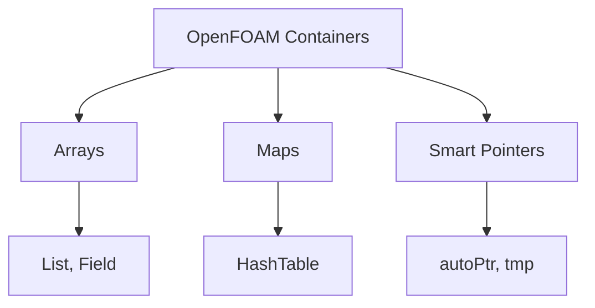

# Containers & Memory - Overview

ภาพรวม Container และ Memory Management — หัวใจของ Data Storage

> **ทำไม Containers & Memory สำคัญ?**
> - **ทุก field, mesh, boundary condition อยู่ใน containers**
> - Memory management ผิด = **memory leaks = crashes**
> - เลือก container ถูก = **performance ดี**

---

## Overview

> **💡 OpenFOAM Containers = STL + CFD Features + Memory Safety**
>
> - `Field` มี max(), sum() ที่ vector ไม่มี
> - `tmp` ป้องกัน memory leaks จาก temporary fields
> - `PtrList` รองรับ polymorphism สำหรับ BCs



---

## 1. Array Containers

| Container | Purpose |
|-----------|---------|
| `List<T>` | General dynamic array |
| `DynamicList<T>` | Growable array |
| `Field<T>` | CFD array with operations |
| `FixedList<T,N>` | Compile-time size |

---

## 2. Map Containers

| Container | Purpose |
|-----------|---------|
| `HashTable<T,Key>` | Fast key-value lookup |
| `Map<T>` | Ordered map |

---

## 3. Smart Pointers

| Type | Ownership |
|------|-----------|
| `autoPtr<T>` | Unique (move only) |
| `tmp<T>` | Reference counted |
| `PtrList<T>` | List of owned pointers |

---

## 4. Quick Examples

### List

```cpp
List<scalar> values(100, 0.0);
forAll(values, i) { values[i] = sqr(i); }
```

### Field

```cpp
scalarField T(100, 300.0);
scalar maxT = max(T);
```

### HashTable

```cpp
HashTable<scalar, word> props;
props.insert("rho", 1000);
```

### autoPtr

```cpp
autoPtr<Model> model(Model::New(dict));
model().calculate();
```

### tmp

```cpp
tmp<volScalarField> tGrad = fvc::grad(p);
```

---

## 5. Module Contents

| File | Topic |
|------|-------|
| 01_Introduction | Basics |
| 02_Memory_Management | autoPtr, tmp |
| 03_Container_System | List, Field, Hash |
| 04_Integration | Best practices |
| 05_Summary | Exercises |

---

## 🧠 Concept Check

<details>
<summary><b>1. List vs Field ต่างกันอย่างไร?</b></summary>

**Field** มี CFD operations: `max()`, `average()`, `sum()`
</details>

<details>
<summary><b>2. autoPtr vs tmp ใช้เมื่อไหร่?</b></summary>

- **autoPtr**: Unique ownership (factories)
- **tmp**: Temporary results (fvc::)
</details>

<details>
<summary><b>3. HashTable เร็วกว่า Map อย่างไร?</b></summary>

**O(1)** lookup vs **O(log n)** for Map
</details>

---

## 📖 เอกสารที่เกี่ยวข้อง

- **Introduction:** [01_Introduction.md](01_Introduction.md)
- **Container System:** [03_Container_System.md](03_Container_System.md)