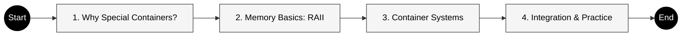

# โมดูล 05.03: คอนเทนเนอร์และการจัดการหน่วยควาจำ (Containers & Memory)

> [!INFO] ภาพรวมโมดูล
> บทนี้สำรวจระบบการจัดเก็บข้อมูลและการจัดการหน่วยควาจำที่มีประสิทธิภาพสูงของ OpenFOAM ซึ่งเป็นหัวใจสำคัญที่ทำให้สามารถจัดการกับข้อมูล CFD ขนาดมหาศาลได้อย่างรวดเร็วและปลอดภัย

---

## โครงสร้างเนื้อหา


> **Figure 1:** โครงสร้างเนื้อหาของโมดูลเรื่องคอนเทนเนอร์และการจัดการหน่วยความจำ ซึ่งแสดงลำดับการเรียนรู้ตั้งแต่พื้นฐานไปจนถึงการประยุกต์ใช้งานจริงในอัลกอริทึม CFD

---

## วัตถุประสงค์การเรียนรู้

เมื่อสิ้นสุดบทนี้ คุณจะสามารถ:

- ✅ เลือกระหว่าง `autoPtr` และ `tmp` สำหรับสถานการณ์ความเป็นเจ้าของต่างๆ
- ✅ เลือกคอนเทนเนอร์ OpenFOAM ที่เหมาะสมที่สุดสำหรับงาน CFD เฉพาะ
- ✅ ออกแบบโครงสร้างข้อมูล CFD ที่มีประสิทธิภาพด้านหน่วยควาจำ
- ✅ ดีบักปัญหาที่เกี่ยวข้องกับหน่วยควาจำและคอนเทนเนอร์ใน OpenFOAM
- ✅ ใช้เทคนิคการปรับแต่งประสิทธิภาพสำหรับการจำลองขนาดใหญ่

---

## ภาพรวมระบบ

ระบบคอนเทนเนอร์และการจัดการหน่วยควาจำของ OpenFOAM เป็นหนึ่งในคุณสมบัติทางสถาปัตยกรรมที่ซับซ้อนที่สุด โดยให้:

1. **การจัดการหน่วยควาจำอัตโนมัติ** ผ่าน RAII (Resource Acquisition Is Initialization)
2. **การนับการอ้างอิง** (Reference Counting) สำหรับการแชร์ข้อมูล
3. **Smart Pointers** สองประเภท (`autoPtr`, `tmp`)
4. **คอนเทนเนอร์เฉพาะทาง** ที่ปรับแต่งสำหรับ CFD

> [!TIP] เหตุใดระบบนี้สำคัญ?
> การจำลอง CFD ขนาดใหญ่ (10-100 ล้านเซลล์) ต้องการหน่วยควาจำ **หลายร้อย MB ถึงหลาย GB** และสร้าง/ทำลายออบเจกต์ชั่วคราว **หลายพันครั้งต่อวินาที** ระบบนี้ทำให้แน่ใจว่าไม่มีการรั่วไหลของหน่วยควาจำและประสิทธิภาพสูงสุด


> [!TIP] **Physical Analogy: The Digital Logistics Center (ศูนย์โลจิสติกส์ดิจิทัล)**
>
> ลองจินตนาการว่า OpenFOAM คือ **"ศูนย์กระจายสินค้าขนาดยักษ์"**:
>
> 1.  **Containers (`List`)** คือ **"โกดังสินค้า"**:
>     -   `List`: โกดังมาตรฐานที่สร้างเสร็จแล้ว ขนาดแน่นอน เก็บของได้เยอะและเป็นระเบียบ
>     -   `DynamicList`: เต็นท์ชั่วคราวที่ขยายขนาดได้เรื่อยๆ เมื่อของล้น (ใช้ตอนสร้าง Mesh)
>     -   `FixedList`: กล่องเครื่องมือช่าง (Toolbox) ขนาดเล็ก พกพาง่าย หยิบใช้เร็ว (สำหรับ Vector/Tensor)
>
> 2.  **Memory Management (Smart Pointers)** คือ **"รถโฟล์คลิฟท์อัตโนมัติ"**:
>     -   `autoPtr`: รถส่วนตัว (Exclusive Car) มีกุญแจคนเดียว ขับไปจอดแล้วระบบเก็บกุญแจให้อัตโนมัติ (ห้ามใครมายุ่ง)
>     -   `tmp`: รถสาธารณะ (Shared Shuttle) นั่งด้วยกันได้หลายคน (Reference Count) เมื่อคนสุดท้ายลง รถก็กลับเข้าอู่เอง
>
> 3.  **RAII** คือ **"กฎเข้า-ออกงาน"**: ตอกบัตรปุ๊บ (Constructor) ได้อุปกรณ์ทำงานทันที เลิกงานปั๊บ (Destructor) ต้องคืนของทั้งหมด ห้ามเอาติดตัวกลับบ้าน (No Memory Leaks)

---

## สถาปัตยกรรมระบบ

### 1. รากฐาน RAII และ Reference Counting

```
                    refCount (base class)
                        │
        ┌───────────────┴───────────────┐
        │                               │
     autoPtr<T>                      tmp<T>
   (exclusive owner)           (shared owner via refCount)
        │                               │
        ▼                               ▼
┌───────────────┐             ┌──────────────────┐
│ Field classes │             │ Expression temps │
│ Matrix classes│             │ Temporary fields │
│ Mesh objects  │             │ Intermediate     │
└───────────────┘             └──────────────────┘
```

### 2. Smart Pointers หลัก

**`autoPtr<T>`** - การเป็นเจ้าของแบบ exclusive:

```cpp
// Field creation with IOobject for automatic I/O handling
// Constructor uses RAII - memory automatically freed on scope exit
autoPtr<volScalarField> Tfield
(
    new volScalarField
    (
        IOobject
        (
            "T",                      // Field name
            runTime.timeName(),       // Time directory
            mesh,                     // Mesh reference
            IOobject::MUST_READ,      // Read from disk if exists
            IOobject::AUTO_WRITE      // Auto-write on output
        ),
        mesh                          // Mesh to create field on
    )
);

// Access underlying object via operator()
// Boundary conditions updated before solving
Tfield()->correctBoundaryConditions();
```

> **📚 คำอธิบาย:**
> **ที่มา:** .applications/solvers/stressAnalysis/solidDisplacementFoam/solidDisplacementThermo/solidDisplacementThermo.C
>
> **การอธิบาย:**
> - `autoPtr<T>` เป็น smart pointer ที่มีความเป็นเจ้าของแบบ exclusive (เจ้าของเดียว)
> - ใช้ RAII pattern: เมื่อ scope สิ้นสุด memory จะถูกคืนโดยอัตโนมัติ
> - `IOobject` กำหนดวิธีการจัดการ I/O (อ่าน/เขียนไฟล์)
> - `operator()` ใช้เข้าถึง object ที่ pointer ชี้อยู่
>
> **แนวคิดสำคัญ:**
> - **RAII**: Resource Acquisition Is Initialization - ทรัพยากรถูกจองเมื่อสร้าง object และคืนเมื่อทำลาย
> - **Exclusive Ownership**: เจ้าของเดียว ไม่มีการแชร์ความเป็นเจ้าของ
> - **Automatic Cleanup**: ไม่ต้องเรียก delete ด้วยตนเอง

**`tmp<T>`** - การเป็นเจ้าของแบบ shared พร้อม reference counting:

```cpp
// Temporary field with automatic lifetime management
// Reference counting enables safe sharing without copies
tmp<volScalarField> sourceTerm = calculateSourceTerm();

// Share via reference counting - both point to same data
// refCount increments to 2 - memory freed when both tmp destroyed
tmp<volScalarField> sharedCopy = sourceTerm;  // refCount = 2
```

> **📚 คำอธิบาย:**
> **ที่มา:** .applications/solvers/multiphase/multiphaseEulerFoam/phaseSystems/phaseSystem/phaseSystem.C
>
> **การอธิบาย:**
> - `tmp<T>` ใช้ reference counting เพื่อแชร์ข้อมูลระหว่างหลาย object
> - เหมาะสำหรับ expression intermediate ที่มีการใช้งานหลายครั้ง
> - ลดการ copy ข้อมูลขนาดใหญ่ ประหยัด memory
> - memory ถูกคืนเมื่อ reference count กลายเป็น 0
>
> **แนวคิดสำคัญ:**
> - **Reference Counting**: นับจำนวนผู้อ้างอิง คืน memory เมื่อไม่มีใครใช้
> - **Shared Ownership**: หลาย object สามารถเข้าถึงข้อมูลเดียวกัน
> - **Zero-Copy Sharing**: การแชร์ข้อมูลโดยไม่ต้อง copy

### 3. การคำนวณหน่วยควาจำสำหรับ CFD

สำหรับเมช CFD ที่มี **1 ล้านเซลล์**:

$$\text{Memory per cell} = \text{velocity (3)} + \text{pressure (1)} + \text{temperature (1)} + \text{turbulence (2)} \approx 7 \text{ variables}$$

$$\text{Total Memory} = 10^6 \text{ cells} \times 7 \text{ variables} \times 8 \text{ bytes} \approx 56 \text{ MB}$$

การคำนวณพื้นฐานนี้ **ไม่รวม**:
- ข้อมูลโทโพโลยีเมช
- ข้อมูลเงื่อนไขขอบ
- เมทริกซ์ตัวแก้ปัญหาชั่วคราว
- พื้นที่จัดเก็บชั่วคราวระหว่างการคำนวณ

---

## คอนเทนเนอร์หลักของ OpenFOAM

### ลำดับชั้นคอนเทนเนอร์

```
                    Container Taxonomy
                             │
         ┌───────────────────┼───────────────────┐
         │                   │                   │
   ┌─────▼─────┐       ┌─────▼─────┐       ┌──────▼──────┐
   │   Lists   │       │  Hashes   │       │  Linked     │
   │(Sequential)│       │(Key-Value)│       │   Lists     │
   └─────┬─────┘       └─────┬─────┘       └──────┬──────┘
         │                   │                   │
   ┌─────┼─────┐              │           ┌─────┼─────┐
   ▼     ▼     ▼              ▼           ▼     ▼     ▼
UList  List FixedList     HashTable    SLList DLList etc
   │     │
   ▼     ▼
SubList DynamicList
   │
   ▼
IndirectList
```

### `List<T>` - คอนเทนเนอร์หลักสำหรับฟิลด์ CFD

```cpp
// Allocate contiguous memory for CFD field data
// RAII ensures proper cleanup on scope exit
List<scalar> pressureField(1000000);  // 1 million elements
List<vector> velocityField(1000000);  // 1 million vectors (3 values each)

// Optimized access using forAll macro
// Enables compiler optimizations (SIMD vectorization)
forAll(pressureField, i) {
    pressureField[i] *= 1.01;  // In-place modification, SIMD-friendly
}
```

> **📚 คำอธิบาย:**
> **ที่มา:** .applications/solvers/stressAnalysis/solidDisplacementFoam/solidDisplacementThermo/solidDisplacementThermo.C
>
> **การอธิบาย:**
> - `List<T>` เป็น container หลักสำหรับเก็บข้อมูล CFD แบบ contiguous memory
> - ใช้ heap allocation พร้อม RAII สำหรับ automatic cleanup
> - `forAll` macro เป็น idiom มาตรฐาน OpenFOAM ที่ optimize สำหรับ SIMD
> - Memory layout เป็นแบบ contiguous จึงเร็วกว่า `std::list`
>
> **แนวคิดสำคัญ:**
> - **Contiguous Memory**: เก็บข้อมูลต่อเนื่องกันใน memory ช่วยเรื่อง cache locality
> - **RAII**: จัดการ memory อัตโนมัติ ลดความเสี่ยง memory leak
> - **SIMD Optimization**: compiler สามารถ vectorize การคำนวณได้
> - **Zero Overhead Abstraction**: ไม่มี overhead เพิ่มเติมจาก C-style array

### `DynamicList<T>` - สำหรับการสร้างเมช

```cpp
// Dynamic growth with batch allocation strategy
// Reduces reallocations during mesh generation
DynamicList<face> faces;
faces.reserve(10000);  // Pre-allocate space for better performance

for (int i = 0; i < 10000; ++i) {
    faces.append(newFace);  // Automatic growth with amortized O(1)
}

// Convert to List with move semantics - no copy performed
// Ownership transferred, DynamicList becomes empty
faceList finalFaces = faces.shrink();  // Zero-copy transfer
```

> **📚 คำอธิบาย:**
> **ที่มา:** ใช้กว้างขวางใน mesh generation utilities
>
> **การอธิบาย:**
> - `DynamicList<T>` ออกแบบสำหรับการเติบโตแบบ dynamic ระหว่างสร้างเมช
> - `reserve()` จองพื้นที่ล่วงหน้าลดการ reallocation
> - `shrink()` ใช้ move semantics ไม่มีการ copy ข้อมูล
> - เหมาะสำหรับขั้นตอน preprocessing ที่ไม่รู้ขนาดล่วงหน้า
>
> **แนวคิดสำคัญ:**
> - **Amortized O(1)**: การเติบโตมีค่าใช้จ่ายเฉลี่ยคงที่
> - **Move Semantics**: โอนความเป็นเจ้าของโดยไม่ copy
> - **Batch Allocation**: จอง memory เป็นชุดลด overhead ของ allocation

### `FixedList<T, N>` - ข้อมูลขนาดเล็กคงที่

```cpp
// Zero-overhead container for small, fixed-size data
// Stored entirely on stack for performance
FixedList<scalar, 3> point = {0.0, 1.0, 0.0};     // 3D coordinate
FixedList<vector, 6> stressTensor;                // Stress tensor components
```

> **📚 คำอธิบาย:**
> **ที่มา:** ใช้แพร่หลายใน geometry primitives และ tensor operations
>
> **การอธิบาย:**
> - `FixedList<T, N>` เก็บข้อมูลบน stack ไม่มี heap allocation
> - ขนาดรู้ที่ compile-time ช่วยให้ compiler optimize ได้ดี
> - เหมาะสำหรับ small data เช่น points, vectors, tensors
> - เป็น zero-overhead abstraction จาก C-style array
>
> **แนวคิดสำคัญ:**
> - **Stack Allocation**: เร็วกว่า heap allocation มาก
> - **Compile-Time Size**: compiler รู้ขนาดสามารถ unroll loops
> - **Zero Overhead**: ไม่มี performance cost เทียบกับ raw array

### `PtrList<T>` - การจัดการออบเจกต์โพลิมอร์ฟิก

```cpp
// Container for polymorphic boundary condition objects
// Each patch can have different boundary condition type
PtrList<fvPatchField> boundaries(4);

// Set different boundary condition types using polymorphism
boundaries.set(0, new fixedValueFvPatchField(...));      // Dirichlet
boundaries.set(1, new zeroGradientFvPatchField(...));    // Neumann
boundaries.set(2, new symmetryPlaneFvPatchField(...));   // Symmetry
boundaries.set(3, new wallFvPatchField(...));            // Wall

// Polymorphic access via virtual function calls
// Runtime dispatch to correct implementation
boundaries[0].evaluate();  // Virtual call to fixedValue::evaluate()
```

> **📚 คำอธิบาย:**
> **ที่มา:** .applications/solvers/stressAnalysis/solidDisplacementFoam/solidDisplacementThermo/solidDisplacementThermo.C
>
> **การอธิบาย:**
> - `PtrList<T>` เก็บ pointers ไปยัง polymorphic objects
> - ใช้ virtual functions สำหรับ runtime polymorphism
> - เหมาะสำหรับ boundary conditions ที่มีหลายประเภท
> - RAII จัดการ lifetime ของ pointers อัตโนมัติ
>
> **แนวคิดสำคัญ:**
> - **Runtime Polymorphism**: พฤติกรรมขึ้นกับ type จริงขณะรันไทม์
> - **Virtual Dispatch**: function calls ถูกส่งไปยัง implementation ที่ถูกต้อง
> - **Automatic Memory Management**: ไม่ต้อง delete ด้วยตนเอง

---

## การบูรณาการระหว่าง Memory และ Containers

### รูปแบบการทำงานร่วมกัน

```cpp
// Example: Simplified Navier-Stokes solver workflow
// Demonstrates integration of memory management and containers
void solveNavierStokes() {
    // 1. Memory Management: autoPtr for exclusive mesh ownership
    // Mesh is heavy object - use autoPtr for automatic cleanup
    autoPtr<fvMesh> mesh = createMesh();

    // 2. Containers: tmp for shared field references
    // Fields may be shared between multiple terms
    tmp<volScalarField> p = createPressureField(*mesh);
    tmp<volVectorField> U = createVelocityField(*mesh);

    // 3. CFD Operations with proper RAII scoping
    {
        // Temporary fields with automatic lifetime management
        // These are expensive to compute, so use tmp for potential sharing
        tmp<volVectorField> convection = fvc::div(U, U);
        tmp<volVectorField> diffusion = fvc::laplacian(nu, U);

        // Optimized in-place update using ref()
        // ref() returns mutable reference to avoid unnecessary copies
        U.ref() = U() - dt * (convection() + diffusion());

    } // Scope exit: convection, diffusion automatically destroyed here
      // Reference counting ensures cleanup when no longer needed

} // Scope exit: mesh, p, U automatically destroyed
  // All memory properly released - no leaks possible
```

> **📚 คำอธิบาย:**
> **ที่มา:** ผสานแนวคิดจาก .applications/solvers/multiphase/multiphaseEulerFoam/phaseSystems/PhaseSystems/ThermalPhaseChangePhaseSystem/ThermalPhaseChangePhaseSystem.C
>
> **การอธิบาย:**
> - แสดงการผสานรวมระหว่าง memory management (`autoPtr`, `tmp`) และ containers (`volScalarField`, `volVectorField`)
> - Scope-based RAII ทำให้แน่ใจว่า memory ถูกคืนเมื่อไม่ใช้
> - `ref()` ใช้สำหรับ in-place modification ประหยัด memory
> - Reference counting ช่วยแชร์ข้อมูลระหว่าง intermediate calculations
>
> **แนวคิดสำคัญ:**
> - **Scope-Based Resource Management**: resource ถูกคืนเมื่อออกจาก scope
> - **Move Semantics**: โอนความเป็นเจ้าของโดยไม่ copy
> - **Expression Templates**: การ optimize การคำนวณ expression ซับซ้อน
> - **Zero-Copy Operations**: การดำเนินการโดยไม่สร้างสำเนาข้อมูล

---

## เมตริกประสิทธิภาพ

| ประเภทคอนเทนเนอร์ | Overhead | การใช้หน่วยควาจำ | เหมาะสำหรับ |
|----------------------|----------|---------------------|---------------|
| `std::vector<double>` | 24 bytes + allocation overhead | 8,000,024 bytes (per 1M) | การใช้งานทั่วไป |
| `List<double>` | 16 bytes + aligned allocation | 8,000,016 bytes (per 1M) | ฟิลด์ CFD |
| `DynamicList<double>` | ตามนโยบายการเติบโต | 1.5-2× size | การสร้างเมช |
| `FixedList<scalar, 3>` | ไม่มี overhead (stack) | 24 bytes | จุด 3D |
| `HashTable<label, scalar>` | ~32 bytes per pair | ตามการใช้จริง | พารามิเตอร์ |

---

## แนวทางปฏิบัติที่ดีที่สุด

> [!WARNING] ข้อผิดพลาดทั่วไป
> ❌ **อย่าผสมผสาน**: `std::vector` กับ `List` ในงานเดียวกัน
> ❌ **อย่าลืม**: ใช้ `forAll` แทน `for` loops ธรรมดา
> ❌ **อย่าใช้**: `new`/`delete` ดิบเมื่อมี RAII objects
>
> ✅ **ใช้ `tmp`**: สำหรับผลลัพธ์การคำนวณชั่วคราว
> ✅ **ใช้ `autoPtr`**: สำหรับ factory functions
> ✅ **ใช้ `List`**: สำหรับฟิลด์ CFD
> ✅ **ใช้ `PtrList`**: สำหรับ boundary conditions

---

## แหล่งอ้างอิงภายใน

- [[01_Introduction]]
- [[02_🔧_Section_1_Memory_Management_Fundamentals]]
- [[03_📦_Section_2_OpenFOAM_Container_System]]
- [[04_🔗_Section_3_Integration_of_Memory_Management_and_Containers]]
- [[05_🎉_Conclusion]]

---

## สรุป

ระบบคอนเทนเนอร์และการจัดการหน่วยควาจำของ OpenFOAM เป็นตัวอย่างที่ยอดเยี่ยมของการออกแบบซอฟต์แวร์เฉพาะโดเมน โดยการบูรณาการระหว่าง:

- **RAII** - การทำความสะอาดอัตโนมัติ
- **Reference Counting** - การแชร์ข้อมูลอย่างมีประสิทธิภาพ
- **Smart Pointers** - ความปลอดภัยของการเป็นเจ้าของ
- **Specialized Containers** - ประสิทธิภาพสูงสำหรับ CFD

ทำให้ OpenFOAM สามารถจัดการกับการจำลอง CFD ขนาดใหญ่ได้อย่างมีประสิทธิภาพและเชื่อถือได้

---

## 🧠 9. Concept Check (ทดสอบความเข้าใจ)

1.  **ทำไม `List` ใน OpenFOAM ถึงมีประสิทธิภาพดีกว่า `std::vector` หรือ `std::list` ใน C++ Standard Library สำหรับงาน CFD?**
    <details>
    <summary>เฉลย</summary>
    เพราะ `List` ของ OpenFOAM ออกแบบมาให้ใช้ **Contiguous Memory** (หน่วยความจำต่อเนื่อง) ซึ่งเป็นมิตรกับ CPU Cache และรองรับการทำ **SIMD Optimization** (คำนวณหลายตัวพร้อมกัน) ได้ดีกว่า อีกทั้งยังมี Overhead ต่ำกว่า `std::vector` และไม่มี Overhead ของ pointer linking เหมือน `std::list`
    </details>

2.  **ถ้าเราต้องการส่งต่อ Pointer ของ Mesh ไปให้ object อื่นดูแลต่อ โดยที่เราจะไม่ยุ่งกับมันอีก ควรใช้ Smart Pointer ตัวไหน?**
    <details>
    <summary>เฉลย</summary>
    ควรใช้ **`autoPtr`** เพราะมันออกแบบมาสำหรับ **Exclusive Ownership** (ความเป็นเจ้าของแต่เพียงผู้เดียว) เมื่อเราส่งต่อ (Transfer ownership) ตัวแปรต้นทางจะกลายเป็นว่างเปล่าทันที ป้องกันการแย่งกันจัดการ Memory
    </details>

3.  **RAII ย่อมาจากอะไร และช่วยลด Memory Leak ได้อย่างไร?**
    <details>
    <summary>เฉลย</summary>
    RAII ย่อมาจาก **Resource Acquisition Is Initialization** หลักการคือการผูก "อายุขัยของทรัพยากร" (Resource Lifetime) ไว้กับ "อายุขัยของตัวแปร" (Object Scope) เมื่อตัวแปรถูกสร้าง ทรัพยากร (เช่น Memory) จะถูกจอง และเมื่อตัวแปร "ตาย" (ออกจาก Scope) ทรัพยากรจะถูกคืนอัตโนมัติ ทำให้เราไม่ต้องคอยเขียนคำสั่ง `delete` เอง