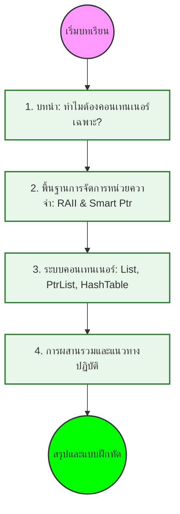

# โมดูล 05.03: คอนเทนเนอร์และการจัดการหน่วยควาจำ (Containers & Memory)

> [!INFO] ภาพรวมโมดูล
> บทนี้สำรวจระบบการจัดเก็บข้อมูลและการจัดการหน่วยควาจำที่มีประสิทธิภาพสูงของ OpenFOAM ซึ่งเป็นหัวใจสำคัญที่ทำให้สามารถจัดการกับข้อมูล CFD ขนาดมหาศาลได้อย่างรวดเร็วและปลอดภัย

---

## โครงสร้างเนื้อหา


> **Figure 1:** โครงสร้างเนื้อหาของโมดูลเรื่องคอนเทนเนอร์และการจัดการหน่วยความจำ ซึ่งแสดงลำดับการเรียนรู้ตั้งแต่พื้นฐานไปจนถึงการประยุกต์ใช้งานจริงในอัลกอริทึม CFD

---

## วัตถุประสงค์การเรียนรู้

เมื่อสิ้นสุดบทนี้ คุณจะสามารถ:

- ✅ เลือกระหว่าง `autoPtr` และ `tmp` สำหรับสถานการณ์ความเป็นเจ้าของต่างๆ
- ✅ เลือกคอนเทนเนอร์ OpenFOAM ที่เหมาะสมที่สุดสำหรับงาน CFD เฉพาะ
- ✅ ออกแบบโครงสร้างข้อมูล CFD ที่มีประสิทธิภาพด้านหน่วยควาจำ
- ✅ ดีบักปัญหาที่เกี่ยวข้องกับหน่วยควาจำและคอนเทนเนอร์ใน OpenFOAM
- ✅ ใช้เทคนิคการปรับแต่งประสิทธิภาพสำหรับการจำลองขนาดใหญ่

---

## ภาพรวมระบบ

ระบบคอนเทนเนอร์และการจัดการหน่วยควาจำของ OpenFOAM เป็นหนึ่งในคุณสมบัติทางสถาปัตยกรรมที่ซับซ้อนที่สุด โดยให้:

1. **การจัดการหน่วยควาจำอัตโนมัติ** ผ่าน RAII (Resource Acquisition Is Initialization)
2. **การนับการอ้างอิง** (Reference Counting) สำหรับการแชร์ข้อมูล
3. **Smart Pointers** สองประเภท (`autoPtr`, `tmp`)
4. **คอนเทนเนอร์เฉพาะทาง** ที่ปรับแต่งสำหรับ CFD

> [!TIP] เหตุใดระบบนี้สำคัญ?
> การจำลอง CFD ขนาดใหญ่ (10-100 ล้านเซลล์) ต้องการหน่วยควาจำ **หลายร้อย MB ถึงหลาย GB** และสร้าง/ทำลายออบเจกต์ชั่วคราว **หลายพันครั้งต่อวินาที** ระบบนี้ทำให้แน่ใจว่าไม่มีการรั่วไหลของหน่วยควาจำและประสิทธิภาพสูงสุด

---

## สถาปัตยกรรมระบบ

### 1. รากฐาน RAII และ Reference Counting

```
                    refCount (base class)
                        │
        ┌───────────────┴───────────────┐
        │                               │
     autoPtr<T>                      tmp<T>
   (exclusive owner)           (shared owner via refCount)
        │                               │
        ▼                               ▼
┌───────────────┐             ┌──────────────────┐
│ Field classes │             │ Expression temps │
│ Matrix classes│             │ Temporary fields │
│ Mesh objects  │             │ Intermediate     │
└───────────────┘             └──────────────────┘
```

### 2. Smart Pointers หลัก

**`autoPtr<T>`** - การเป็นเจ้าของแบบ exclusive:

```cpp
// การสร้างและการใช้งาน
autoPtr<volScalarField> Tfield
(
    new volScalarField
    (
        IOobject
        (
            "T",
            runTime.timeName(),
            mesh,
            IOobject::MUST_READ,
            IOobject::AUTO_WRITE
        ),
        mesh
    )
);

// การเข้าถึง
Tfield()->correctBoundaryConditions();
```

**`tmp<T>`** - การเป็นเจ้าของแบบ shared พร้อม reference counting:

```cpp
// ฟิลด์ชั่วคราวที่มีการลบอัตโนมัติ
tmp<volScalarField> sourceTerm = calculateSourceTerm();

// การแชร์ผ่าน reference counting
tmp<volScalarField> sharedCopy = sourceTerm;  // refCount = 2
```

### 3. การคำนวณหน่วยควาจำสำหรับ CFD

สำหรับเมช CFD ที่มี **1 ล้านเซลล์**:

$$\text{Memory per cell} = \text{velocity (3)} + \text{pressure (1)} + \text{temperature (1)} + \text{turbulence (2)} \approx 7 \text{ variables}$$

$$\text{Total Memory} = 10^6 \text{ cells} \times 7 \text{ variables} \times 8 \text{ bytes} \approx 56 \text{ MB}$$

การคำนวณพื้นฐานนี้ **ไม่รวม**:
- ข้อมูลโทโพโลยีเมช
- ข้อมูลเงื่อนไขขอบ
- เมทริกซ์ตัวแก้ปัญหาชั่วคราว
- พื้นที่จัดเก็บชั่วคราวระหว่างการคำนวณ

---

## คอนเทนเนอร์หลักของ OpenFOAM

### ลำดับชั้นคอนเทนเนอร์

```
                    Container Taxonomy
                             │
         ┌───────────────────┼───────────────────┐
         │                   │                   │
   ┌─────▼─────┐       ┌─────▼─────┐       ┌──────▼──────┐
   │   Lists   │       │  Hashes   │       │  Linked     │
   │(Sequential)│       │(Key-Value)│       │   Lists     │
   └─────┬─────┘       └─────┬─────┘       └──────┬──────┘
         │                   │                   │
   ┌─────┼─────┐              │           ┌─────┼─────┐
   ▼     ▼     ▼              ▼           ▼     ▼     ▼
UList  List FixedList     HashTable    SLList DLList etc
   │     │
   ▼     ▼
SubList DynamicList
   │
   ▼
IndirectList
```

### `List<T>` - คอนเทนเนอร์หลักสำหรับฟิลด์ CFD

```cpp
// การสร้าง List พร้อม RAII
List<scalar> pressureField(1000000);  // 1 million elements
List<vector> velocityField(1000000);  // 1 million vectors

// การเข้าถึงแบบ optimized (forAll macro)
forAll(pressureField, i) {
    pressureField[i] *= 1.01;  // SIMD-vectorizable
}
```

### `DynamicList<T>` - สำหรับการสร้างเมช

```cpp
// การเติบโตแบบ dynamic พร้อมการจองแบบ batch
DynamicList<face> faces;
faces.reserve(10000);  // จองพื้นที่ล่วงหน้า

for (int i = 0; i < 10000; ++i) {
    faces.append(newFace);  // การเติบโตอัตโนมัติ
}

// แปลงเป็น List พร้อม move semantics
faceList finalFaces = faces.shrink();  // ไม่มีการคัดลอก
```

### `FixedList<T, N>` - ข้อมูลขนาดเล็กคงที่

```cpp
// ไม่มี overhead สำหรับข้อมูลขนาดเล็ก
FixedList<scalar, 3> point = {0.0, 1.0, 2.0};     // พิกัด 3D
FixedList<vector, 6> stressTensor;                 // เทนเซอร์ความเครียด
```

### `PtrList<T>` - การจัดการออบเจกต์โพลิมอร์ฟิก

```cpp
// สำหรับเงื่อนไขขอบที่มีประเภทต่างกัน
PtrList<fvPatchField> boundaries(4);

boundaries.set(0, new fixedValueFvPatchField(...));
boundaries.set(1, new zeroGradientFvPatchField(...));
boundaries.set(2, new symmetryPlaneFvPatchField(...));
boundaries.set(3, new wallFvPatchField(...));

// การใช้งานแบบ polymorphic
boundaries[0].evaluate();  // virtual function call
```

---

## การบูรณาการระหว่าง Memory และ Containers

### รูปแบบการทำงานร่วมกัน

```cpp
// ตัวอย่าง: การแก้สมการ Navier-Stokes อย่างง่าย
void solveNavierStokes() {
    // 1. Memory Management: autoPtr สำหรับ mesh
    autoPtr<fvMesh> mesh = createMesh();

    // 2. Containers: tmp สำหรับฟิลด์ที่แชร์
    tmp<volScalarField> p = createPressureField(*mesh);
    tmp<volVectorField> U = createVelocityField(*mesh);

    // 3. การดำเนินการ CFD
    {
        // ฟิลด์ชั่วคราวพร้อมการทำความสะอาดอัตโนมัติ
        tmp<volVectorField> convection = fvc::div(U, U);
        tmp<volVectorField> diffusion = fvc::laplacian(nu, U);

        // การอัพเดทแบบ optimized
        U.ref() = U() - dt * (convection() + diffusion());

    } // convection, diffusion ถูกทำลายโดยอัตโนมัติ

} // mesh, p, U ถูกทำลายโดยอัตโนมัติ
```

---

## เมตริกประสิทธิภาพ

| ประเภทคอนเทนเนอร์ | Overhead | การใช้หน่วยควาจำ | เหมาะสำหรับ |
|----------------------|----------|---------------------|---------------|
| `std::vector<double>` | 24 bytes + allocation overhead | 8,000,024 bytes (per 1M) | การใช้งานทั่วไป |
| `List<double>` | 16 bytes + aligned allocation | 8,000,016 bytes (per 1M) | ฟิลด์ CFD |
| `DynamicList<double>` | ตามนโยบายการเติบโต | 1.5-2× size | การสร้างเมช |
| `FixedList<scalar, 3>` | ไม่มี overhead (stack) | 24 bytes | จุด 3D |
| `HashTable<label, scalar>` | ~32 bytes per pair | ตามการใช้จริง | พารามิเตอร์ |

---

## แนวทางปฏิบัติที่ดีที่สุด

> [!WARNING] ข้อผิดพลาดทั่วไป
> ❌ **อย่าผสมผสาน**: `std::vector` กับ `List` ในงานเดียวกัน
> ❌ **อย่าลืม**: ใช้ `forAll` แทน `for` loops ธรรมดา
> ❌ **อย่าใช้**: `new`/`delete` ดิบเมื่อมี RAII objects
>
> ✅ **ใช้ `tmp`**: สำหรับผลลัพธ์การคำนวณชั่วคราว
> ✅ **ใช้ `autoPtr`**: สำหรับ factory functions
> ✅ **ใช้ `List`**: สำหรับฟิลด์ CFD
> ✅ **ใช้ `PtrList`**: สำหรับ boundary conditions

---

## แหล่งอ้างอิงภายใน

- [[01_Introduction]]
- [[02_🔧_Section_1_Memory_Management_Fundamentals]]
- [[03_📦_Section_2_OpenFOAM_Container_System]]
- [[04_🔗_Section_3_Integration_of_Memory_Management_and_Containers]]
- [[05_🎉_Conclusion]]

---

## สรุป

ระบบคอนเทนเนอร์และการจัดการหน่วยควาจำของ OpenFOAM เป็นตัวอย่างที่ยอดเยี่ยมของการออกแบบซอฟต์แวร์เฉพาะโดเมน โดยการบูรณาการระหว่าง:

- **RAII** - การทำความสะอาดอัตโนมัติ
- **Reference Counting** - การแชร์ข้อมูลอย่างมีประสิทธิภาพ
- **Smart Pointers** - ความปลอดภัยของการเป็นเจ้าของ
- **Specialized Containers** - ประสิทธิภาพสูงสำหรับ CFD

ทำให้ OpenFOAM สามารถจัดการกับการจำลอง CFD ขนาดใหญ่ได้อย่างมีประสิทธิภาพและเชื่อถือได้
