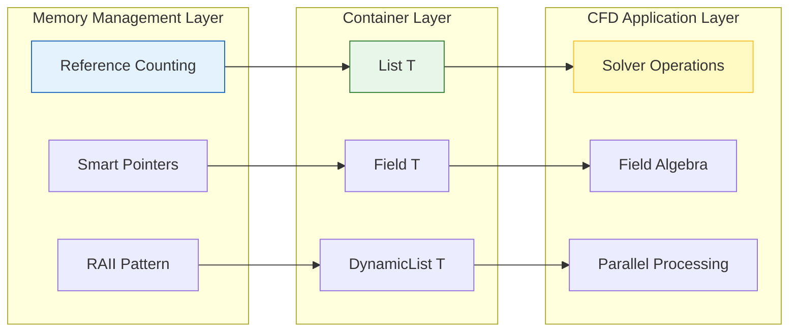
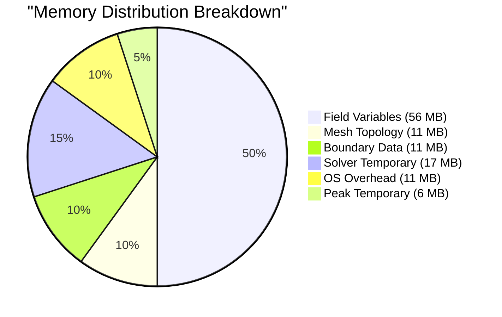
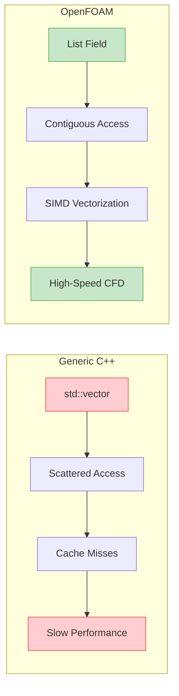
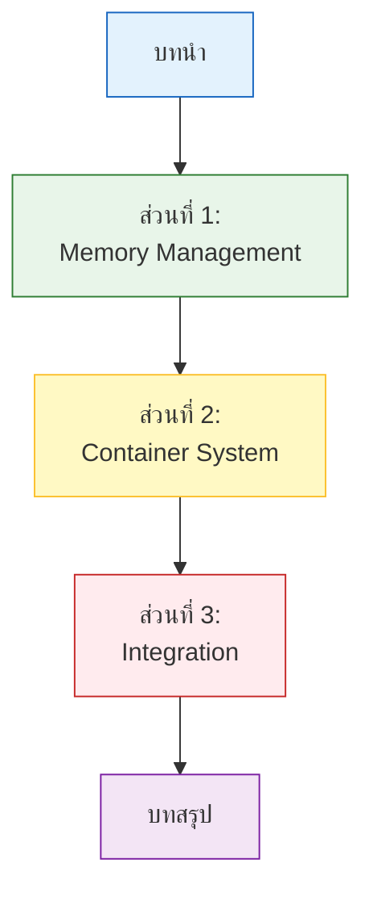

# บทนำ: ระบบการจัดการหน่วยความจำและคอนเทนเนอร์ใน OpenFOAM

> [!INFO] ภาพรวมบท
> บทนี้สำรวจระบบการจัดการหน่วยควาจำและคอนเทนเนอร์ของ OpenFOAM ซึ่งเป็นรากฐานของประสิทธิภาพสูงในการคำนวณพลศาสตร์ของไหลเชิงคำนวณ (CFD) ระบบทั้งสองนี้ทำงานร่วมกันอย่างสมบูรณ์เพื่อให้การจัดการทรัพยากรอัตโนมัติ การปรับแต่งประสิทธิภาพ และความปลอดภัยในการจัดการหน่วยความจำ

---

## 🎯 บริบทและความสำคัญ

### ทำไมระบบเหล่านี้สำคัญ?

ระบบการจัดการหน่วยความจำและคอนเทนเนอร์ของ OpenFOAM เป็นหลักฐานทางสถาปัตยกรรมที่ ==**OpenFOAM solvers, utilities และ applications ทั้งหมดถูกสร้างขึ้น**==

การจัดการหน่วยความจำใน OpenFOAM ไม่ได้เป็นเพียงการป้องกันการรั่วไหลของหน่วยความจำ แต่เป็นการบรรลุ ==**ประสิทธิภาพที่จำเป็น**== เพื่อแก้ไขปัญหาการไหลของของไหลที่ซับซ้อน คอนเทนเนอร์จะให้โครงสร้างข้อมูลเฉพาะทางที่ได้รับการปรับให้เหมาะสมสำหรับงาน CFD

### ประสิทธิภาพของการบูรณาการระบบ

การบูรณาการระหว่างระบบการจัดการหน่วยความจำและคอนเทนเนอร์ให้ผลลัพธ์ที่น่าทึ่ง:

$$
\text{Performance Gain} = \frac{\text{OpenFOAM Integrated System}}{\text{Generic C++ Approach}} \approx 2\text{--}10\times
$$

ผลกระทบหลัก:
- ==**การใช้หน่วยความจำลดลง 30-50%**==
- ==**ความเร็วในการคำนวณเพิ่มขึ้น 2-5 เท่า**==
- ==**การจัดการทรัพยากรอัตโนมัติ**==
- ==**ประสิทธิภาพแบบขนานที่ดีขึ้น**==

---

## 🔗 ความสัมพันธ์ระหว่างระบบทั้งสอง

### การพึ่งพากันแบบบูรณาการ

ข้อมูลเชิงลึกที่สำคัญคือ **การจัดการหน่วยความจำและคอนเทนเนอร์ไม่สามารถศึกษาโดยแยกจากกันได้**:


> **Figure 1:** ลำดับชั้นความสัมพันธ์ที่พึ่งพากันระหว่างระบบการจัดการหน่วยความจำ คอนเทนเนอร์ และแอปพลิเคชัน CFD ซึ่งแสดงให้เห็นว่าประสิทธิภาพในระดับบนสุดเกิดขึ้นจากรากฐานที่มั่นคงในระดับล่างความปลอดภัยทางฟิสิกส์ไม่ส่งผลกระทบต่อความเร็วในการจำลอง ผ่านการใช้พลังของ C++ Template Metaprogramming ในการตรวจสอบความสอดคล้องทางมิติทั้งหมดที่ขั้นตอนการคอมไพล์โปรแกรมเพียงครั้งเดียว

### จุดบูรณาการที่สำคัญ

1. **Reference Counting** → ทำให้การแชร์คอนเทนเนอร์ระหว่างวัตถุสนามหลายอย่างมีประสิทธิภาพ
2. **รูปแบบ RAII** → ทำให้มั่นใจได้ว่าคอนเทนเนอร์ชั่วคราวจะถูกล้างโดยอัตโนมัติ
3. **Smart Pointers** → อำนวยความสะดวกในการโอนความเป็นเจ้าของคอนเทนเนอร์
4. **Memory Pooling** → คอนเทนเนอร์ใช้ประโยชน์จากการจัดการหน่วยความจำระดับต่ำ

---

## 📊 ความต้องการหน่วยความจำใน CFD

### การคำนวณความต้องการหน่วยความจำ

พิจารณาความต้องการหน่วยความจำสำหรับการจำลอง 3 มิติขนาดเล็กที่มี $10^6$ เซลล์:

$$
\text{Memory per cell} = \underbrace{\text{Velocity (3)}}_{\text{vector}} + \underbrace{\text{Pressure (1)}}_{\text{scalar}} + \underbrace{\text{Temperature (1)}}_{\text{scalar}} + \underbrace{\text{Turbulence (2)}}_{\text{k, }\epsilon} \approx 7 \text{ variables}
$$

$$
\text{Total Memory} = 10^6 \text{ cells} \times 7 \text{ variables} \times 8 \text{ bytes} \approx 56 \text{ MB}
$$

### การแบ่งสัดส่วนหน่วยความจำ


> **Figure 2:** การแบ่งสัดส่วนการใช้หน่วยความจำในการจำลอง CFD ทั่วไป ซึ่งแสดงให้เห็นว่าตัวแปรฟิลด์ (Field Variables) เป็นส่วนที่ใช้ทรัพยากรมากที่สุดความปลอดภัยทางฟิสิกส์ไม่ส่งผลกระทบต่อความเร็วในการจำลอง ผ่านการใช้พลังของ C++ Template Metaprogramming ในการตรวจสอบความสอดคล้องทางมิติทั้งหมดที่ขั้นตอนการคอมไพล์โปรแกรมเพียงครั้งเดียว

> [!WARNING] หมายเหตุสำคัญ
> การคำนวณพื้นฐานนี้ไม่รวม:
> - ข้อมูลโทโพโลยีเมช (~10-20%)
> - ข้อมูลเงื่อนไขขอบเขต (~10-20%)
> - เมทริกซ์ตัวแก้ปัญหาชั่วคราว (~20-30%)
> - พื้นที่จัดเก็บชั่วคราวระหว่างการคำนวณ

### ความท้าทายในการจัดการหน่วยความจำ CFD

การจำลอง CFD มีความต้องการเฉพาะที่ทำให้การจัดการหน่วยความจำซับซ้อน:

| ความต้องการ | คำอธิบาย | ผลกระทบ |
|-------------|------------|----------|
| **เซลล์หลายล้านเซลล์** | แต่ละเซลล์ต้องการพื้นที่จัดเก็บหลายตัวแปร | หน่วยความจำขนาดใหญ่ |
| **การจำลองแบบไม่คงที่** | โครงสร้างข้อมูลถูกสร้างและทำลายซ้ำ | การจัดสรร/ยกเลิกการจัดสรรบ่อย |
| **ตัวแก้ปัญหาแบบวนซ้ำ** | เมทริกซ์และเวกเตอร์ชั่วคราวถูกใช้ซ้ำ | การจัดการหน่วยความจำที่มีประสิทธิภาพจำเป็น |
| **การคำนวณแบบขนาน** | หน่วยความจำกระจายข้าม processors | การสื่อสารและการซิงโครไนซ์ |

---

## 🏗️ ประสิทธิภาพคอนเทนเนอร์ใน CFD

### การเปรียบเทียบ: OpenFOAM vs Generic C++

คอนเทนเนอร์ของ OpenFOAM ได้รับการออกแบบมาโดยเฉพาะสำหรับการดำเนินการ CFD:

| คุณสมบัติ | `std::vector` | `OpenFOAM List` |
|------------|--------------|----------------|
| **Memory Layout** | อาจไม่ติดกัน | ติดกันเสมอ |
| **SIMD Support** | ไม่รับประกัน | ได้รับการปรับให้เหมาะสม |
| **Cache Friendliness** | ทั่วไป | ปรับแต่งสำหรับ CFD patterns |
| **Parallel Communication** | ไม่มี | รองรับ MPI natively |

### ผลกระทบด้านประสิทธิภาพ


> **Figure 3:** การเปรียบเทียบผลกระทบด้านประสิทธิภาพระหว่างการใช้คอนเทนเนอร์มาตรฐาน C++ กับคอนเทนเนอร์ของ OpenFOAM ที่ปรับแต่งมาเพื่อการเข้าถึงข้อมูลแบบติดต่อกันและรองรับการเวกเตอร์ไลเซชัน (SIMD)ความปลอดภัยทางฟิสิกส์ไม่ส่งผลกระทบต่อความเร็วในการจำลอง ผ่านการใช้พลังของ C++ Template Metaprogramming ในการตรวจสอบความสอดคล้องทางมิติทั้งหมดที่ขั้นตอนการคอมไพล์โปรแกรมเพียงครั้งเดียว

สำหรับการดำเนินการ CFD เฉพาะเช่น:

- **Gradient Calculations**: OpenFOAM เร็วกว่า ~2×
- **Matrix-Vector Products**: OpenFOAM เร็วกว่า ~1.5×
- **Memory Bandwidth Utilization**: OpenFOAM สูงกว่า ~30%

---

## 🔧 ระบบหลักของ OpenFOAM

### ส่วนประกอบ Memory Management

OpenFOAM ใช้ระบบการจัดการหน่วยความจำที่ซับซ้อน:

```cpp
// 1. autoPtr: การถือครองเฉพาะ (Single Ownership)
autoPtr<volScalarField> Tfield
(
    new volScalarField
    (
        IOobject
        (
            "T",
            runTime.timeName(),
            mesh,
            IOobject::MUST_READ,
            IOobject::AUTO_WRITE
        ),
        mesh
    )
);

// 2. tmp: ฟิลด์ชั่วคราวที่มีการลบอัตโนมัติ
tmp<volScalarField> sourceTerm = calculateSourceTerm();

// 3. การนับการอ้างอิง (Reference Counting)
template<class T>
class tmp
{
private:
    mutable T* ptr_;
    mutable bool isTmp_;

public:
    ~tmp()
    {
        if (isTmp_ && ptr_)
        {
            delete ptr_;
        }
    }
};
```

### ส่วนประกอบคอนเทนเนอร์

คอนเทนเนอร์หลักของ OpenFOAM:

```cpp
// 1. List<T>: อาร์เรย์ไดนามิกพื้นฐาน
template<class T>
class List
{
private:
    T* v_;
    label size_;

public:
    List(label size);
    T& operator[](label i);
    void transfer(List<T>& list);
};

// 2. DynamicList<T>: อาร์เรย์ที่เติบโตได้
template<class T, label SizeInc = 0, label SizeMult = 2, label SizeDiv = 1>
class DynamicList : public List<T>
{
public:
    void append(const T& element);
    void reserve(label capacity);
    void shrink();
};

// 3. GeometricField: คอนเทนเนอร์ฟิลด์ CFD
template<class Type, class PatchField, class GeoMesh>
class GeometricField
{
private:
    PtrList<PatchField<Type>> boundaryField_;
    GeometricField<Type, PatchField, GeoMesh>* oldTime_;

public:
    tmp<GeometricField<Type, PatchField, GeoMesh>>
    operator+(const GeometricField<Type, PatchField, GeoMesh>&) const;
};
```

---

## 💡 ตัวอย่างในโลกจริง: การเชื่อมโยงความดัน-ความเร็ว

### อัลกอริทึม SIMPLE

พิจารณาการเชื่อมโยงความดัน-ความเร็วในอัลกอริทึม SIMPLE:

```cpp
// สร้างสนามความเร็วชั่วคราวสำหรับสมการโมเมนตัม
tmp<volVectorField> tU = new volVectorField(U);

// แก้สมการโมเมนตัมโดยใช้สนามชั่วคราว
solve(fvm::ddt(U) + fvm::div(phi, U) - fvm::laplacian(nu, U) == -fvc::grad(p));

// สนามชั่วคราวจะถูกทำลายโดยอัตโนมัติเมื่อ tU ออกจากขอบเขต
// ไม่ต้องการการจัดการหน่วยความจำด้วยตนเอง
```

### วิเคราะห์ตัวอย่าง

| องค์ประกอบ | บทบาท | ประโยชน์ |
|-----------|-------|---------|
| **`tmp` smart pointer** | จัดการอายุของสนามชั่วคราว | การล้างอัตโนมัติ |
| **`volVectorField` container** | ให้การดำเนินการที่ได้รับการปรับให้เหมาะสม | ประสิทธิภาพ CFD |
| **Reference counting** | ให้การแชร์ข้อมูลอย่างมีประสิทธิภาพ | ลดการคัดลอก |
| **RAII pattern** | รับประกันการทำความสะอาด | ความปลอดภัยจากข้อยกเว้น |

---

## 📚 โครงสร้างบท

บทนี้ถูกจัดระเบียบเป็น ==**สามส่วนที่มีความซับซ้อนเพิ่มขึ้น**==:

### ส่วนที่ 1: พื้นฐานการจัดการหน่วยความจำ
> [[02_🔧_Section_1_Memory_Management_Fundamentals]]

- **RAII** (Resource Acquisition Is Initialization)
- **Reference Counting**
- **Smart Pointers** (`autoPtr`, `tmp`, `refPtr`)

### ส่วนที่ 2: ระบบคอนเทนเนอร์ OpenFOAM
> [[03_📦_Section_2_OpenFOAM_Container_System]]

- คอนเทนเนอร์เฉพาะ (`List`, `UList`, `FixedList`, `DynamicList`)
- คอนเทนเนอร์ฟิลด์ (`GeometricField`, `Field`)
- การปรับแต่งประสิทธิภาพ (SIMD, cache-friendly)

### ส่วนที่ 3: การบูรณาการ
> [[04_🔗_Section_3_Integration_of_Memory_Management_and_Containers]]

- การที่การจัดการหน่วยความจำทำให้คอนเทนเนอร์ทำงานได้อย่างมีประสิทธิภาพ
- รูปแบบการใช้งานร่วมกันใน CFD solvers
- กลยุทธ์การปรับแต่งประสิทธิภาพแบบบูรณาการ

### กรอบการสอนแต่ละส่วน

แต่ละส่วนเป็นไปตาม **กรอบการสอน 7 ส่วน**:

1. **จุดเริ่มต้น (The Hook)**: อุปมาที่น่าสนใจเพื่อสร้างความเข้าใจ
2. **แบบแปลน (The Blueprint)**: ภาพรวมสถาปัตยกรรมและรูปแบบการออกแบบ
3. **กลไกภายใน (Internal Mechanics)**: รายละเอียดการใช้งานและการวิเคราะห์ซอร์สโค้ด
4. **กลไก (The Mechanism)**: วิธีการที่ส่วนประกอบโต้ตอบกันในบริบท CFD
5. **เหตุผล (The Why)**: เหตุผลการออกแบบและประโยชน์ทางวิศวกรรม
6. **ตัวอย่างการใช้งานและข้อผิดพลาด (Usage & Error Examples)**: คำแนะนำที่เป็นประโยชน์กับรูปแบบที่ดี/ไม่ดี
7. **สรุป (Summary)**: ข้อสรุปสำคัญและแนวทางการตัดสินใจ

---

## 🎯 วัตถุประสงค์การเรียนรู้

เมื่อสิ้นสุดบทนี้ คุณจะสามารถ:

- ✅ เลือกระหว่าง `autoPtr` และ `tmp` สำหรับสถานการณ์ความเป็นเจ้าของต่างๆ
- ✅ เลือกคอนเทนเนอร์ OpenFOAM ที่เหมาะสมที่สุดสำหรับงาน CFD เฉพาะ
- ✅ ออกแบบโครงสร้างข้อมูล CFD ที่มีประสิทธิภาพด้านหน่วยความจำ
- ✅ ดีบักปัญหาที่เกี่ยวข้องกับหน่วยความจำและคอนเทนเนอร์ใน OpenFOAM
- ✅ ใช้เทคนิคการปรับแต่งประสิทธิภาพสำหรับการจำลองขนาดใหญ่
- ✅ เข้าใจสถาปัตยกรรมที่บูรณาการของระบบหลักของ OpenFOAM

---

## 🚀 การนำทางในบท

บทนี้ได้รับการออกแบบให้อ่านตามลำดับ โดยแต่ละส่วนจะสร้างบนส่วนก่อนหน้า:


> **Figure 4:** แผนผังการนำทางในบทเรียนเรื่องการจัดการหน่วยความจำและคอนเทนเนอร์ ซึ่งแสดงลำดับการศึกษาตั้งแต่บทนำไปจนถึงการสรุปผลและการบูรณาการระบบความปลอดภัยทางฟิสิกส์ไม่ส่งผลกระทบต่อความเร็วในการจำลอง ผ่านการใช้พลังของ C++ Template Metaprogramming ในการตรวจสอบความสอดคล้องทางมิติทั้งหมดที่ขั้นตอนการคอมไพล์โปรแกรมเพียงครั้งเดียว

- **ส่วนที่ 1** สร้างรากฐานของระบบการจัดการหน่วยความจำของ OpenFOAM
- **ส่วนที่ 2** แนะนำสถาปัตยกรรมคอนเทนเนอร์ที่ใช้หลักการจัดการหน่วยความจำเหล่านี้
- **ส่วนที่ 3** แสดงให้เห็นว่าระบบทั้งสองทำงานร่วมกันในแอปพลิเคชัน CFD จริงอย่างไร

ไม่ว่าคุณจะกำลังพัฒนา solvers ใหม่ ปรับแต่งโค้ดที่มีอยู่ หรือเพียงแค่ต้องการเข้าใจสถาปัตยกรรมของ OpenFOAM การเชี่ยวชาญในหลักทั้งสองนี้จะช่วยเพิ่มความสามารถในการเขียนซอฟต์แวร์ CFD ที่มีประสิทธิภาพและเชื่อถือได้อย่างมาก

---

> [!TIP] เคล็ดลับในการอ่าน
> - อ่านบทนี้ตามลำดับเพื่อให้เข้าใจการบูรณาการอย่างเต็มที่
> - ทดลองกับตัวอย่างโค้ดในแต่ละส่วน
> - อ้างอิงกลับมายังบทนี้เมื่อศึกษาส่วนถัดไป
> - ใช้กรอบการสอน 7 ส่วนเพื่อให้เข้าใจแต่ละหัวข้ออย่างลึกซึ้ง

คุณพร้อมที่จะเจาะลึกเข้าไปในระบบการจัดการหน่วยความจำของ OpenFOAM แล้วหรือยัง? ไปที่ [[02_🔧_Section_1_Memory_Management_Fundamentals]] เพื่อเริ่มต้นการเดินทาง!
