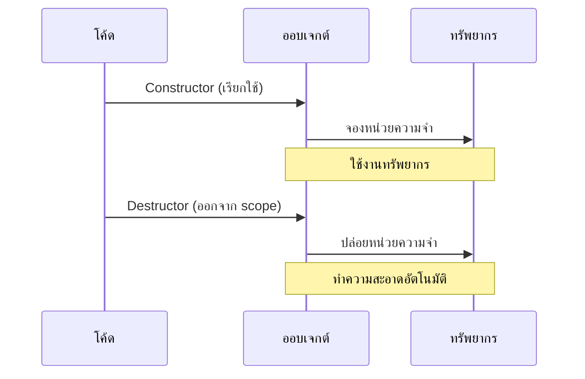
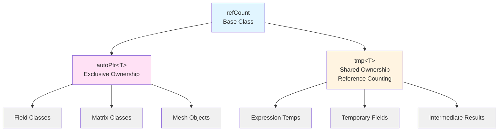
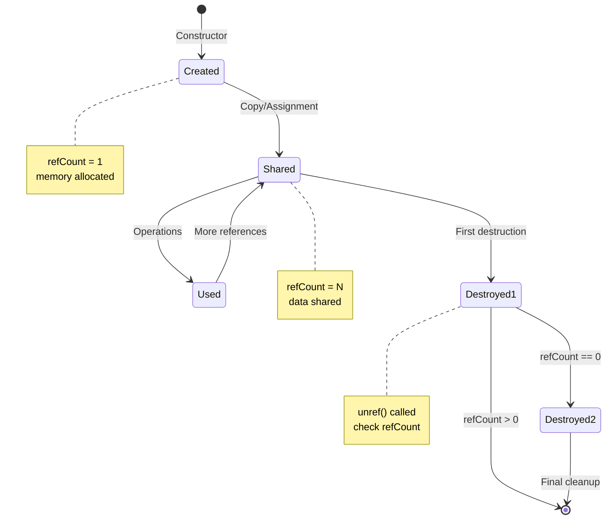
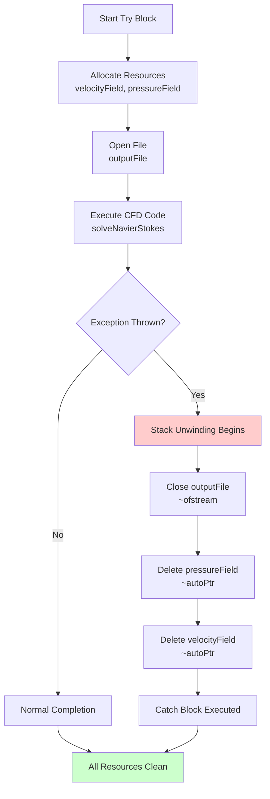
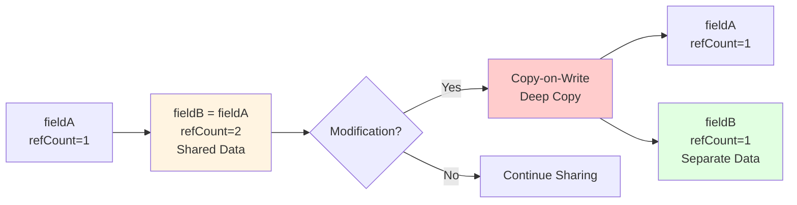
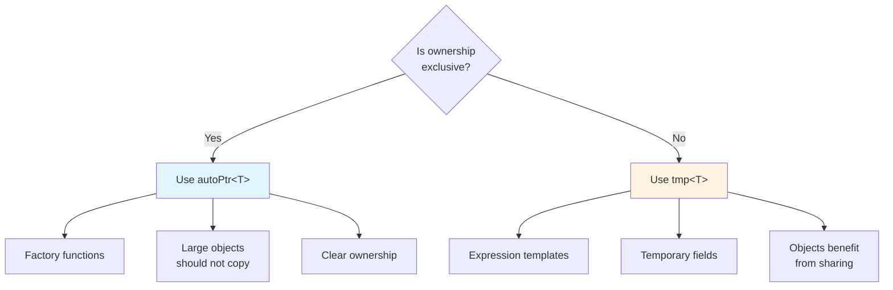

# 🔧 Section 1: พื้นฐานการจัดการหน่วยความจำ

## 1.1 🎯 The Hook: อุปมา "การทำความสะอาดห้องโรงแรมอัตโนมัติ"

จินตนาการว่าคุณกำลัง **เช็คอินเข้าโรงแรม**:
- ห้องพัก **สะอาดและพร้อมใช้งาน** เมื่อคุณมาถึง (การเรียกใช้ทรัพยากร)
- คุณ **ใช้ห้องพัก** ในระหว่างการเข้าพัก (การใช้ทรัพยากร)
- เมื่อคุณ **เช็คเอาท์**, แม่บ้านจะ **ทำความสะอาดทุกอย่างโดยอัตโนมัติ** (การปล่อยทรัพยากร)

คุณไม่จำเป็นต้องจำ:
- ถอดผ้าปูที่นอน
- ทำความสะอาดห้องน้ำ
- นำขยะออก
- คืนกุญแจ

โรงแรมจะจัดการการทำความสะอาดโดยอัตโนมัติเมื่อคุณจากไป **การจัดการหน่วยความจำ** ทำงานได้ในลักษณะเดียวกันนี้พอดี - **ทรัพยากรจะถูกทำความสะอาดโดยอัตโนมัติเมื่อออกจาก scope**


> **Figure 1:** อุปมาเปรียบเทียบการจัดการหน่วยความจำแบบ RAII กับการเช็คอินและเช็คเอาท์ห้องโรงแรม ซึ่งทรัพยากรจะถูกจัดเตรียมและทำความสะอาดโดยอัตโนมัติตามอายุการใช้งาน

**อุปมาในชีวิตจริง**: คิดว่าการจัดการหน่วยความจำเปรียบเหมือน **การเช่ารถที่มีประกันครบครัน**:
- **รับรถ**: คุณได้รับกุญแจรถ (constructor จองหน่วยความจำ)
- **ขับรถ**: คุณใช้รถ (คุณใช้หน่วยความจำ)
- **คืนรถ**: คุณส่งคืนกุญแจ (destructor จัดการการทำความสะอาด, น้ำมัน, ประกันอัตโนมัติ)
- **ไม่ต้องทำความสะอาดเอง**: บริษัทเช่ารถจัดการทุกอย่างโดยอัตโนมัติ

> [!INFO] **นิยาม RAII**
> **RAII (Resource Acquisition Is Initialization)** เป็นเทคนิคการเขียนโปรแกรมที่ผูกการมีชีวิตของทรัพยากรเข้ากับอายุการใช้งานของออบเจกต์ ทรัพยากรจะถูกจองใน constructor และปล่อยใน destructor โดยอัตโนมัติ

### CFD Context: ถ้าคุณต้องจัดการหน่วยความจำหลายพันล้านเซลล์ด้วยตนเอง?

ในการจำลอง CFD ทั่วไปที่มี 10 ล้านเซลล์:
- แต่ละเซลล์มีหลายฟิลด์: ความเร็ว (3 ค่า), ความดัน (1), อุณหภูมิ (1), ตัวแปรความปั่นป่วน (2-7)
- รวม: 7-12 ค่าต่อเซลล์ × 10 ล้านเซลล์ = 70-120 ล้านจำนวนทศนิยม
- ความต้องการหน่วยความจำ: 560-960 MB (double precision)

$$
\text{Memory} = N_{\text{cells}} \times N_{\text{variables}} \times \text{sizeof(double)} = 10^7 \times 10 \times 8 \text{ bytes} \approx 800 \text{ MB}
$$

**หากไม่มีการจัดการหน่วยความจำอัตโนมัติ**: คุณจะต้องจอง, ติดตาม, และปล่อยค่าเหล่านี้ทั้งหมดด้วยตนเอง การลืม `delete` เพียงครั้งเดียวอาจทำให้เกิดการรั่วไหลของหน่วยความจำหลาย GB ในช่วงเวลาพันๆ timesteps

**ด้วยการจัดการหน่วยความจำของ OpenFOAM**: ทรัพยากรจะถูกทำความสะอาดโดยอัตโนมัติเมื่ออ็อบเจกต์ออกจาก scope ไม่ว่าจะเป็นไปตามปกติหรือผ่านทาง exceptions สิ่งนี้ทำให้การจำลอง CFD ที่ซับซ้อนเป็นไปได้โดยไม่มีการรั่วไหลของหน่วยความจำ

### หลักการพื้นฐาน: RAII (Resource Acquisition Is Initialization)

RAII เป็นรากฐานของการจัดการหน่วยความจำของ OpenFOAM:
- **การเรียกใช้ทรัพยากร** เกิดขึ้นระหว่าง **construction** ของอ็อบเจกต์
- **การปล่อยทรัพยากร** เกิดขึ้นระหว่าง **destruction** ของอ็อบเจกต์
- **การเป็นเจ้าของ** เชื่อมโยงกับ **อายุการใช้งาน** ของอ็อบเจกต์
- **ความปลอดภัยจาก exception** เป็นไปโดยอัตโนมัติผ่าน stack unwinding


> **Figure 2:** ลำดับเหตุการณ์ในวงจรชีวิตของออบเจ็กต์ RAII ตั้งแต่การจองหน่วยความจำใน Constructor ไปจนถึงการปล่อยทรัพยากรโดยอัตโนมัติใน Destructor เมื่อสิ้นสุดขอบเขตการทำงาน

```cpp
// RAII ในการทำงาน: หน่วยความจำถูกจัดการโดยอัตโนมัติด้วยอายุการใช้งานของอ็อบเจกต์
{
    autoPtr<volScalarField> pressureField = createPressureField(mesh);
    // หน่วยความจำถูกจองที่นี่

    solveMomentumEquation(*pressureField);
    // ฟิลด์ถูกใช้ที่นี่

} // pressureField ออกจาก scope ที่นี่
// หน่วยความจำถูกปล่อยโดยอัตโนมัติที่นี่ แม้ว่าจะมี exceptions ถูก throw
```

### จากอุปมาสู่โค้ด

อุปมา "ห้องโรงแรม" สามารถนำมาใช้กับโค้ด OpenFOAM ได้โดยตรง:
- **เช็คอิน**: Constructor จองหน่วยความจำ
- **เข้าพัก**: อ็อบเจกต์ถูกใช้ในการคำนวณ
- **เช็คเอาท์**: Destructor ปล่อยหน่วยความจำโดยอัตโนมัติ
- **ทำความสะอาด**: RAII รับประกันว่าการทำความสะอาดเกิดขึ้นโดยอัตโนมัติ

การจัดการอัตโนมัตินี้ช่วยให้นักพัฒนา CFD สามารถมุ่งเน้นที่ **ฟิสิกส์และอัลกอริทึม** มากกว่า **การบันทึกข้อมูลหน่วยความจำ**

## 1.2 🏗️ The Blueprint: สถาปัตยกรรมการจัดการหน่วยความจำของ OpenFOAM

OpenFOAM ใช้ระบบการจัดการหน่วยความจำที่ซับซ้อนซึ่งสร้างขึ้นบนพื้นฐานของแนวคิดหลักสามประการ:

### 1. Reference Counting (`refCount`)
รากฐานของการเป็นเจ้าของร่วมกัน ซึ่งหลายอ็อบเจกต์สามารถอ้างอิงข้อมูลเดียวกันได้ และข้อมูลจะถูกลบโดยอัตโนมัติเมื่อ reference สุดท้ายหายไป

### 2. Smart Pointers
สองประเภทหลักที่มี semantics การเป็นเจ้าของที่แตกต่างกัน:
- **`autoPtr<T>`**: การเป็นเจ้าของแบบ exclusive (เหมือน `std::unique_ptr`)
- **`tmp<T>`**: การเป็นเจ้าของแบบ shared พร้อม reference counting (เหมือน `std::shared_ptr` แต่ถูกปรับให้เหมาะกับ CFD)

### 3. RAII Wrappers
คลาสเฉพาะทางที่จัดการทรัพยากรเฉพาะ:
- **Field containers** ที่เป็นเจ้าของข้อมูลของตน
- **Matrix classes** ที่มีการทำความสะอาดอัตโนมัติ
- **I/O objects** ที่จัดการ file handles


> **Figure 3:** แผนผังโครงสร้างสถาปัตยกรรมการจัดการหน่วยความจำของ OpenFOAM ที่แบ่งออกเป็นระบบความเป็นเจ้าของแบบเฉพาะ (autoPtr) และระบบการแชร์ข้อมูลผ่านการนับการอ้างอิง (tmp)

### ลำดับชั้นทางสถาปัตยกรรม

```
                    refCount (base class)
                        │
        ┌───────────────┴───────────────┐
        │                               │
     autoPtr<T>                      tmp<T>
   (exclusive owner)           (shared owner via refCount)
        │                               │
        ▼                               ▼
┌───────────────┐             ┌──────────────────┐
│ Field classes │             │ Expression temps │
│ Matrix classes│             │ Temporary fields │
│ Mesh objects  │             │ Intermediate results │
└───────────────┘             └──────────────────┘
```

### รูปแบบการออกแบบที่สำคัญ

1. **RAII (Resource Acquisition Is Initialization)**
   - ทรัพยากรถูกเรียกใช้ใน constructors
   - ทรัพยากรถูกปล่อยใน destructors
   - ปลอดภัยจาก exception ผ่าน automatic stack unwinding

2. **Reference Counting**
   - `ref()` เพิ่ม reference count
   - `unref()` ลดและลบถ้าเป็นศูนย์
   - การทำงานแบบ thread-safe สำหรับ CFD แบบ parallel

3. **Copy-on-Write (CoW)**
   - `tmp<T>` ใช้ CoW เพื่อประสิทธิภาพ
   - หลาย references แบ่งปันข้อมูลจนกว่าจะมีการแก้ไข
   - จากนั้นข้อมูลจะถูกคัดลอกเพื่อรักษาต้นฉบับ

4. **Move Semantics**
   - `autoPtr` รองรับ move-only semantics
   - การโอนย้ายความเป็นเจ้าของโดยไม่ต้องคัดลอก
   - จำเป็นสำหรับ factory functions

### การจัดการหน่วยความจำในบริบท CFD

การจัดการหน่วยความจำของ OpenFOAM ได้รับการออกแบบมาโดยเฉพาะสำหรับ workloads ของ CFD:

```cpp
// รูปแบบการจัดการหน่วยความจำ solver CFD ทั่วไป
class pimpleFoamSolver {
    autoPtr<fvMesh> mesh_;                 // การเป็นเจ้าของ mesh แบบ exclusive
    tmp<volScalarField> p_;                // ฟิลด์ความดันแบบ shared
    tmp<volVectorField> U_;                // ฟิลด์ความเร็วแบบ shared
    tmp<volScalarField> k_;                // พลังงานจลน์ความปั่นป่วนแบบ shared
    tmp<volScalarField> epsilon_;          // การสลายตัวของความปั่นป่วนแบบ shared

    // ฟิลด์ทั้งหมดถูกทำความสะอาดโดยอัตโนมัติเมื่ออ็อบเจกต์ solver ถูกทำลาย
    // แม้ว่าจะมี exceptions เกิดขึ้นระหว่างการแก้ปัญหา
};
```

### การพิจารณาประสิทธิภาพ

| **Aspect** | **Overhead** | **Optimization** |
|------------|--------------|------------------|
| **Memory Overhead** | 4 bytes ต่ออ็อบเจกต์ | `refCount` |
| **Reference Counting** | Atomic operations | Thread-safe สำหรับ parallel |
| **Cache Efficiency** | Minimal overhead | Smart pointers ไม่รบกวน data layout |
| **Allocation Patterns** | Optimized | Arrays ที่ต่อเนื่องขนาดใหญ่ของ CFD |

### การรวมเข้ากับระบบนิเวศ OpenFOAM

ระบบการจัดการหน่วยความจำนี้รวมเข้ากับองค์ประกอบทั้งหมดของ OpenFOAM:
- **Fields**: `GeometricField<Type>` ใช้ `tmp` สำหรับ expression templates
- **Matrices**: `LduMatrix` ใช้ `autoPtr` สำหรับส่วนประกอบ solver
- **Meshes**: `polyMesh` ใช้ reference counting สำหรับ topology ที่แบ่งปันกัน
- **I/O**: `IOobject` จัดการ file handles และ buffers

แบบแปลนทางสถาปัตยกรรมนี้แสดงให้เห็นว่าการจัดการหน่วยความจำของ OpenFOAM มอบความปลอดภัยและประสิทธิภาพทั้งสองอย่างสำหรับแอปพลิเคชัน CFD

## 1.3 ⚙️ Internal Mechanics: วิธีการทำงานของ Reference Counting จริงๆ

ตอนนี้เรามาดูรายละเอียดการใช้งานของระบบการจัดการหน่วยความจำของ OpenFOAM กัน การเข้าใจกลไกภายในเหล่านี้จะช่วยคุณในการ debug ปัญหาหน่วยความจำ, ปรับประสิทธิภาพ, และตัดสินใจในการออกแบบอย่างมีข้อมูล

### รากฐาน: คลาสฐาน `refCount`

ที่หัวใจของระบบการเป็นเจ้าของร่วมกันของ OpenFOAM คือคลาสฐาน `refCount`:

```cpp
class refCount {
private:
    // 🔍 CRITICAL: mutable อนุญาตการแก้ไขจาก const methods
    // ทำไม? เพราะ reference counting ไม่เปลี่ยนข้อมูลตรรกะของอ็อบเจกต์
    mutable int refCount_;  // จำนวน references ที่ใช้งานอยู่

public:
    // ✅ CONSTRUCTOR: อ็อบเจกต์เริ่มต้นโดยไม่มี references
    refCount() : refCount_(0) {
        // อ็อบเจกต์มีอยู่แต่ยังไม่มีใคร "เป็นเจ้าของ" มัน
    }

    // ✅ DESTRUCTOR: Virtual สำหรับการทำความสะอาดที่เหมาะสมในการสืบทอด
    virtual ~refCount() {
        // การทำความสะอาดคลาสฐาน คลาสที่ได้รับมาทำความสะอาดข้อมูลของตน
    }

    // ✅ REFERENCE INCREMENT: "มีคนใช้อ็อบเจกต์นี้แล้ว"
    void ref() const {
        ++refCount_;  // เพิ่มง่ายๆ (atomic ในเวอร์ชัน thread-safe)
    }

    // ✅ REFERENCE DECREMENT: "มีคนหยุดใช้อ็อบเจกต์นี้แล้ว"
    // ส่งคืน true ถ้านี่เป็น reference สุดท้าย (อ็อบเจกต์ควรถูกลบ)
    bool unref() const {
        // ลดและตรวจสอบว่าเราเป็น reference สุดท้ายหรือไม่
        return (--refCount_ == 0);
    }

    // ✅ CHECK REFERENCE COUNT (สำหรับ debugging)
    int count() const {
        return refCount_;
    }
};
```

> [!TIP] **การตัดสินใจในการออกแบบที่สำคัญ**
> 1. **`mutable` refCount_**: Reference counting เป็นการเปลี่ยนแปลง "ทางกายภาพ" ไม่ใช่การเปลี่ยนแปลง "ทางตรรกะ" ของข้อมูลของอ็อบเจกต์ คำหลัก `mutable` อนุญาตให้ `ref()` และ `unref()` เป็น `const` methods
> 2. **Virtual destructor**: รับประกันการทำความสะอาดที่เหมาะสมในลำดับชั้นการสืบทอด
> 3. **Atomic operations ในเวอร์ชัน parallel**: `refCountAtomic` ใช้ `std::atomic<int>` สำหรับความปลอดภัยของ thread
> 4. **Minimal overhead**: เพียง 4 bytes (หรือ 8 พร้อม padding) ต่ออ็อบเจกต์

### การเป็นเจ้าของแบบ Exclusive: `autoPtr<T>`

สำหรับการเป็นเจ้าของแบบ exclusive ซึ่งมีเพียงอ็อบเจกต์เดียวที่เป็นเจ้าของทรัพยากรได้ในแต่ละครั้ง:

```cpp
template<class T>
class autoPtr {
private:
    T* ptr_;  // Managed pointer

public:
    // ✅ Constructor เข้ารับการเป็นเจ้าของทันที
    explicit autoPtr(T* p = nullptr) : ptr_(p) {}

    // ✅ Destructor ทำความสะอาดโดยอัตโนมัติ
    ~autoPtr() {
        delete ptr_;  // รับประกันการทำความสะอาด
    }

    // ✅ Move constructor โอนย้ายการเป็นเจ้าของ
    autoPtr(autoPtr&& other) noexcept : ptr_(other.ptr_) {
        other.ptr_ = nullptr;  // ต้นฉบับสละสิทธิ์การเป็นเจ้าของ
    }

    // ❌ Copy constructor ถูกลบ (ป้องกันการเป็นเจ้าของซ้ำ)
    autoPtr(const autoPtr&) = delete;

    // ✅ Move assignment โอนย้ายการเป็นเจ้าของ
    autoPtr& operator=(autoPtr&& other) noexcept {
        if (this != &other) {
            delete ptr_;        // ทำความสะอาดทรัพยากรปัจจุบัน
            ptr_ = other.ptr_;  // เข้ารับการเป็นเจ้าของ
            other.ptr_ = nullptr;
        }
        return *this;
    }

    // ❌ Copy assignment ถูกลบ
    autoPtr& operator=(const autoPtr&) = delete;

    // ✅ การเข้าถึงอ็อบเจกต์ที่จัดการ
    T& operator*() { return *ptr_; }
    const T& operator*() const { return *ptr_; }

    T* operator->() { return ptr_; }
    const T* operator->() const { return ptr_; }

    // ✅ ปล่อยการเป็นเจ้าของ (กลายเป็น raw pointer)
    T* release() {
        T* temp = ptr_;
        ptr_ = nullptr;
        return temp;  // Caller ตอนนี้รับผิดชอบการลบ
    }

    // ✅ ตรวจสอบว่า pointer ถูกต้อง
    bool valid() const { return ptr_ != nullptr; }
};
```

**ปรัชญาการออกแบบของ `autoPtr`:**
- **Move-only semantics**: ป้องกันการลบซ้ำโดยไม่ตั้งใจ
- **การโอนย้ายการเป็นเจ้าของอย่างชัดเจน**: method `release()` สละสิทธิ์การเป็นเจ้าของ
- **การจัดการสถานะ null**: `autoPtr` ที่ถูกสร้างโดยค่าเริ่มต้นจะเก็บ `nullptr`
- **ความเข้ากันได้กับ factory functions**: `autoPtr` เหมาะสำหรับ factory methods

### การเป็นเจ้าของแบบ Shared: `tmp<T>`

สำหรับการเป็นเจ้าของแบบ shared พร้อม reference counting:

```cpp
template<class T>
class tmp {
private:
    T* ptr_;
    bool isTemporary_;  // ว่านี่ควร reference-counted หรือไม่

public:
    // ✅ Constructor จัดการ reference counting
    tmp(T* p, bool isTemp = true) : ptr_(p), isTemporary_(isTemp) {
        if (ptr_ && isTemporary_) {
            ptr_->ref();  // เพิ่ม reference count
        }
    }

    // ✅ Destructor ลดและทำความสะอาดหากจำเป็น
    ~tmp() {
        if (ptr_ && isTemporary_) {
            if (ptr_->unref()) {  // ลดและตรวจสอบว่าเป็น reference สุดท้ายหรือไม่
                delete ptr_;     // ลบถ้านี่เป็น reference สุดท้าย
            }
        }
    }

    // ✅ Copy constructor แบ่งปันการเป็นเจ้าของ
    tmp(const tmp& t) : ptr_(t.ptr_), isTemporary_(t.isTemporary_) {
        if (ptr_ && isTemporary_) {
            ptr_->ref();  // เพิ่มสำหรับ reference ใหม่
        }
    }

    // ✅ Assignment operator
    tmp& operator=(const tmp& t) {
        if (this != &t) {
            // ทำความสะอาด reference ปัจจุบัน
            if (ptr_ && isTemporary_) {
                if (ptr_->unref()) {
                    delete ptr_;
                }
            }

            // เข้ารับ reference ใหม่
            ptr_ = t.ptr_;
            isTemporary_ = t.isTemporary_;

            if (ptr_ && isTemporary_) {
                ptr_->ref();
            }
        }
        return *this;
    }

    // ✅ การเข้าถึงอ็อบเจกต์ที่จัดการ
    T& operator*() { return *ptr_; }
    const T& operator*() const { return *ptr_; }

    T* operator->() { return ptr_; }
    const T* operator->() const { return ptr_; }

    // ✅ ตรวจสอบว่าเป็น temporary (reference-counted)
    bool isTemporary() const { return isTemporary_; }
};
```

**ปรัชญาการออกแบบของ `tmp`:**
- **Reference counting เฉพาะสำหรับ temporaries**: ค่าสถานะ `isTemporary_` แยกความแตกต่างระหว่าง temporaries และอ็อบเจกต์ที่มีอายุการใช้งานยาวนาน
- **Copy-on-Write (CoW) optimization**: หลาย `tmp` objects สามารถแบ่งปันข้อมูลเดียวกันจนกว่าหนึ่งจะต้องแก้ไข
- **พื้นฐาน Expression template**: `tmp` ถูกใช้อย่างแพร่หลายใน expression templates ของ OpenFOAM
- **การทำความสะอาดอัตโนมัติ**: เมื่อ `tmp` สุดท้ายที่อ้างอิงถึงอ็อบเจกต์ถูกทำลาย อ็อบเจกต์จะถูกลบโดยอัตโนมัติ

### Memory Layout และผลกระทบด้านประสิทธิภาพ

การเข้าใจ memory layout ของ smart pointers เหล่านี้เป็นสิ่งสำคัญสำหรับการปรับให้เหมาะสมด้านประสิทธิภาพ:

```cpp
// การเปรียบเทียบ memory layout
struct RawPointer {
    T* ptr;                    // 8 bytes (64-bit)
    // รวม: 8 bytes
};

struct AutoPtrLayout {
    T* ptr;                    // 8 bytes
    // รวม: 8 bytes (เหมือน raw pointer!)
};

struct TmpLayout {
    T* ptr;                    // 8 bytes
    bool isTemporary;          // 1 byte (บวก padding)
    // รวม: 16 bytes (กับ padding)
};

struct RefCountedObject {
    int refCount;              // 4 bytes
    T data;                    // sizeof(T) bytes
    // รวม: 4 + sizeof(T) bytes
};
```

### การพิจารณาประสิทธิภาพ

| **Smart Pointer** | **Memory Overhead** | **Runtime Overhead** | **Best Use Case** |
|------------------|-------------------|---------------------|-------------------|
| **Raw Pointer** | 0 bytes | None | เมื่อจำเป็นต้องใช้และจัดการเอง |
| **autoPtr** | 0 bytes | Minimal (destructor) | การเป็นเจ้าของแบบ exclusive |
| **tmp** | 8-16 bytes | Reference counting | การแบ่งปันและ temporaries |
| **refCountAtomic** | 4-8 bytes | Atomic operations | Parallel builds |

### การรวมเข้ากับโครงสร้างข้อมูล CFD

primitives การจัดการหน่วยความจำเหล่านี้ถูกใช้ทั่วทั้งโครงสร้างข้อมูลของ OpenFOAM:

```cpp
// ตัวอย่าง: GeometricField ใช้ tmp สำหรับ expression templates
tmp<GeometricField<scalar>> calculatePressureGradient(
    const GeometricField<scalar>& p
) {
    // การคำนวณกลางใช้ tmp สำหรับการทำความสะอาดอัตโนมัติ
    tmp<GeometricField<scalar>> gradP = fvc::grad(p);

    // การดำเนินการเพิ่มเติม...
    tmp<GeometricField<scalar>> result = mag(gradP);

    return result;  // Reference counting จัดการการทำความสะอาด
}

// ตัวอย่าง: Solver ใช้ autoPtr สำหรับการเป็นเจ้าของแบบ exclusive
autoPtr<fvMatrix<scalar>> createEquation(
    const GeometricField<scalar>& phi
) {
    // autoPtr รับประกันว่า matrix ถูกทำความสะอาดหากการสร้างล้มเหลว
    autoPtr<fvMatrix<scalar>> eqn(new fvMatrix<scalar>(phi));

    // ตั้งค่าสมการ...
    eqn->relax(0.7);

    return eqn;  // การเป็นเจ้าของถูกโอนย้ายไปยัง caller
}
```

> [!IMPORTANT] **ข้อมูลเชิงลึกการใช้งานที่สำคัญ**
> - **`tmp` สำหรับผลลัพธ์ expression**: การดำเนินการทางคณิตศาสตร์ส่งคืน `tmp` objects ที่แบ่งปันข้อมูลเมื่อเป็นไปได้
> - **`autoPtr` สำหรับรูปแบบ factory**: อ็อบเจกต์ที่สร้างโดย factory functions ใช้ `autoPtr` เพื่อโอนย้ายการเป็นเจ้าของ
> - **การใช้ร่วมกัน**: Solvers CFD ที่ซับซ้อนใช้ทั้ง `autoPtr` และ `tmp`
> - **ความปลอดภัยจาก exception**: Smart pointers ทั้งสองรับประกันการทำความสะอาดแม้ว่าจะมีการ throw exceptions

## 1.4 🔄 The Mechanism: วงจรชีวิตอ็อบเจกต์ในบริบท CFD

การเข้าใจว่าส่วนประกอบการจัดการหน่วยความจำโต้ตอบกันระหว่างการคำนวณ CFD เป็นสิ่งจำเป็นสำหรับการออกแบบ solvers ที่มีประสิทธิภาพ

### การสร้างภาพวงจรชีวิตอ็อบเจกต์ที่สมบูรณ์


> **Figure 4:** แผนภาพสถานะแสดงวงจรชีวิตของออบเจ็กต์ในบริบทการคำนวณ CFD ตั้งแต่การสร้าง การแชร์ข้อมูลระหว่างฟิลด์ ไปจนถึงการทำลายออบเจ็กต์เมื่อไม่มีการอ้างอิงเหลืออยู่

```cpp
void demonstrateCompleteLifecycle() {
    // 🌱 ระยะการสร้าง: ทรัพยากรถูกเรียกใช้
    {
        autoPtr<GeometricField<scalar>> temperatureField(
            new GeometricField<scalar>(/*constructor args*/)
        );
        // หน่วยความจำ: [GeometricField object] + [autoPtr wrapper]
        // การเป็นเจ้าของ: autoPtr เป็นเจ้าของ GeometricField แบบ exclusive

        {
            tmp<GeometricField<vector>> velocityField(
                new GeometricField<vector>(/*constructor args*/)
            );
            // หน่วยความจำ: [GeometricField object] refCount=1 + [tmp wrapper]
            // การเป็นเจ้าของ: tmp แบ่งปัน reference กับ tmp objects อื่นที่อาจมี

            // 🔗 ระยะการแบ่งปัน: หลาย references
            tmp<GeometricField<vector>> velocityCopy = velocityField;
            // หน่วยความจำ: GeometricField object เดียวกัน, refCount=2
            // การเป็นเจ้าของ: ทั้งสอง tmp objects แบ่งปันอ็อบเจกต์เดียวกัน

            // 🎮 ระยะการใช้งาน: อ็อบเจกต์ถูกใช้ในการคำนวณ CFD
            (*temperatureField).correctBoundaryConditions();
            (*velocityField).correctBoundaryConditions();
            (*velocityCopy).oldTime();
            // refCount ยังคงเป็น 2 ระหว่างการใช้งาน

        } // 🔄 ระยะการปล่อย 1: velocityCopy ออกจาก scope
        // tmp destructor เรียก unref(), refCount กลายเป็น 1
        // อ็อบเจกต์ไม่ถูกลบเพราะว่า velocityField ยังมีอยู่

    } // 🔄 ระยะการปล่อย 2: temperatureField ออกจาก scope
    // autoPtr destructor เรียก delete, GeometricField object ถูกทำลาย

} // 🔄 ระยะการปล่อย 3: velocityField ออกจาก scope
// tmp destructor เรียก unref(), refCount กลายเป็น 0
// unref() ส่งคืน true, tmp เรียก delete, GeometricField object ถูกทำลาย
// ✅ หน่วยความจำทั้งหมดถูกทำความสะอาดโดยอัตโนมัติ!
```

### ความปลอดภัยจาก Exception ผ่าน Stack Unwinding

หนึ่งในกลไกที่สำคัญที่สุดใน CFD คือความปลอดภัยจาก exception:


> **Figure 5:** กลไกความปลอดภัยจากข้อยกเว้น (Exception Safety) ผ่านกระบวนการ Stack Unwinding ซึ่งรับประกันว่าทรัพยากรทั้งหมดจะถูกทำความสะอาดอย่างถูกต้องแม้ว่าการคำนวณจะล้มเหลวกลางคัน

```cpp
void demonstrateStackUnwinding() {
    try {
        // 🌱 ขั้นตอน 1: ทรัพยากรถูกเรียกใช้
        autoPtr<GeometricField<scalar>> velocityField(createVelocityField());
        autoPtr<GeometricField<scalar>> pressureField(createPressureField());

        std::ofstream outputFile("results.txt");  // ไฟล์ถูกเปิด

        // 🎮 ขั้นตอน 2: ทรัพยากรถูกใช้ในการคำนวณ CFD
        solveNavierStokes(*velocityField, *pressureField);
        outputFile << "Processing complete\n";

        // ❌ EXCEPTION THROWS ที่นี่! (เช่น, การล้มเหลวของการ converge)
        throw std::runtime_error("CFD computation failed");

    } catch (const std::exception& e) {
        // 🔍 ขั้นตอน 3: Stack unwinding ได้เกิดขึ้นแล้ว!
        // ก่อนที่ catch block จะรัน:
        // 1. outputFile destructor → ไฟล์ถูกปิดโดยอัตโนมัติ
        // 2. pressureField destructor → หน่วยความจำถูกปล่อยโดยอัตโนมัติ
        // 3. velocityField destructor → หน่วยความจำถูกปล่อยโดยอัตโนมัติ
        // ✅ ทรัพยากรทั้งหมดถูกทำความสะอาดโดยอัตโนมัติ!

        std::cout << "Caught exception: " << e.what() << std::endl;
        // ไม่ต้องการการทำความสะอาดด้วยตนเอง - RAII จัดการทุกอย่าง
    }
}
```

### การรวมฟิสิกส์: การจัดการหน่วยความจำสำหรับสมการ CFD

การจัดการหน่วยความจำส่งผลโดยตรงต่อประสิทธิภาพของการแก้สมการ CFD พิจารณาสมการ Navier-Stokes สำหรับการไหลแบบ incompressible:

$$
\frac{\partial \mathbf{u}}{\partial t} + (\mathbf{u} \cdot \nabla) \mathbf{u} = -\frac{1}{\rho} \nabla p + \nu \nabla^2 \mathbf{u}
$$

$$
\nabla \cdot \mathbf{u} = 0
$$

**ตัวแปรในสมการ:**
- $\mathbf{u}$ - เวกเตอร์ความเร็ว (m/s)
- $p$ - ความดัน (Pa)
- $\rho$ - ความหนาแน่น (kg/m³)
- $\nu$ - ความหนืดหรือ kinematic viscosity (m²/s)
- $t$ - เวลา (s)

```cpp
tmp<volVectorField> solveMomentumEquation(
    const volVectorField& U,
    const volScalarField& p
) {
    // ฟิลด์ชั่วคราวสำหรับการคำนวณกลาง
    tmp<volVectorField> UEqn = fvm::ddt(U) + fvm::div(phi, U);

    // เพิ่ม pressure gradient
    UEqn.ref() -= fvc::grad(p);

    // เพิ่ม viscous term
    UEqn.ref() -= fvm::laplacian(nu, U);

    // แก้ระบบเชิงเส้น
    solve(UEqn() == -fvc::grad(p));

    return UEqn;  // tmp รับประกันการทำความสะอาดอัตโนมัติ
}
```

**ผลกระทบของการจัดการหน่วยความจำ:**
- **Temporary fields** (`UEqn`) ใช้ `tmp` สำหรับการทำความสะอาดอัตโนมัติ
- **Field operations** สร้างผลลัพธ์กลางที่สามารถแบ่งปันข้อมูลได้เมื่อเป็นไปได้
- **Linear solvers** จองหน่วยความจำ workspace ที่จัดการโดย `autoPtr`
- **Boundary conditions** อาจจอง auxiliary fields

### กลไกการปรับให้เหมาะสม Copy-on-Write (CoW)

`tmp` ใช้ Copy-on-Write เพื่อลดการใช้หน่วยความจำในขณะที่รักษาความถูกต้อง:


> **Figure 6:** กลไก Copy-on-Write (CoW) ที่ช่วยลดการใช้หน่วยความจำโดยการแชร์ข้อมูลระหว่างหลายออบเจ็กต์ และจะทำการคัดลอกข้อมูลจริงเฉพาะเมื่อมีการแก้ไขเกิดขึ้นเท่านั้น

```cpp
// กลไก: Copy-on-Write ในการทำงาน
tmp<volScalarField> fieldA = createScalarField();
tmp<volScalarField> fieldB = fieldA;  // แบ่งปันข้อมูล, refCount=2

// ทั้งสองฟิลด์ชี้ไปยังหน่วยความจำเดียวกัน
// fieldA.ptr_ == fieldB.ptr_ (true)
// refCount = 2

// การแก้ไขทริกเกอร์การคัดลอก
fieldB.ref() = 2.0 * fieldB();  // CoW: สร้างสำเนาเพราะ refCount > 1

// ตอนนี้ fieldA และ fieldB มีข้อมูลแยกกัน
// fieldA.ptr_ != fieldB.ptr_ (true)
// refCount_A = 1, refCount_B = 1
```

**ประโยชน์ของ CoW สำหรับ CFD:**
- **ประสิทธิภาพหน่วยความจำ**: หลาย references แบ่งปันข้อมูลจนกว่าจะมีการแก้ไข
- **ประสิทธิภาพ**: หลีกเลี่ยงการคัดลอกที่ไม่จำเป็นใน expression templates
- **ความปลอดภัย**: การคัดลอกอัตโนมัติเมื่อจำเป็น โปร่งใสต่อผู้ใช้

### การรวมเข้ากับการคำนวณแบบ Parallel

ในการจำลอง CFD แบบ parallel การจัดการหน่วยความจำต้องจัดการกับ domain decomposition และการสื่อสารระหว่างกระบวนการ:

```cpp
void parallelCFDComputation() {
    // แต่ละกระบวนการจัดการส่วนของ mesh ของตนเอง
    autoPtr<fvMesh> mesh = createDecomposedMesh();

    // ฟิลด์ถูกกระจายไปทั่วกระบวนการ
    tmp<volScalarField> p = createPressureField(*mesh);
    tmp<volVectorField> U = createVelocityField(*mesh);

    // Parallel solver พร้อมการจัดการหน่วยความจำอัตโนมัติ
    autoPtr<fvMatrix<scalar>> pEqn = createPressureEquation(*p, *U);

    // แก้แบบ parallel
    pEqn->solve();

    // การอัพเดตฟิลด์ขอบเขตเกี่ยวข้องกับการสื่อสาร MPI
    p->correctBoundaryConditions();
    U->correctBoundaryConditions();

    // หน่วยความจำทั้งหมดถูกทำความสะอาดโดยอัตโนมัติ แม้ข้ามกระบวนการ
    // tmp จัดการ reference counting พร้อม atomic operations แบบ thread-safe
}
```

**ความท้าทายของการจัดการหน่วยความจำแบบ Parallel:**
1. **Atomic reference counting**: `refCountAtomic` ใช้ `std::atomic<int>` สำหรับความปลอดภัยของ thread
2. **MPI communication buffers**: จัดการโดย `autoPtr` เพื่อรับประกันการทำความสะอาด
3. **Ghost cell exchanges**: บัฟเฟอร์ชั่วคราวใช้ `tmp` สำหรับการจัดการอัตโนมัติ
4. **Process boundary data**: Shared pointers พร้อม ownership semantics ที่ระมัดระวัง

### การรวมเข้ากับ Time Stepping

การจำลอง CFD เกี่ยวข้องกับการรวมตัวเวลา ซึ่งต้องการการจัดการประวัติฟิลด์:

```cpp
class TransientSolver {
    // ฟิลด์เวลาปัจจุบัน
    tmp<volScalarField> p_;
    tmp<volVectorField> U_;

    // ประวัติเวลา (timesteps ก่อนหน้า)
    tmp<volScalarField> p_old_;
    tmp<volVectorField> U_old_;

    // Time integration ใช้ tmp สำหรับ expression templates
    void advanceTime() {
        // เก็บเวลาเก่า
        p_old_ = p_;
        U_old_ = U_;

        // แก้สำหรับเวลาใหม่ (สร้างฟิลด์ชั่วคราว)
        tmp<volScalarField> p_new = solvePressureEquation(p_, U_);
        tmp<volVectorField> U_new = solveVelocityEquation(p_, U_);

        // อัพเดตฟิลด์ปัจจุบัน
        p_ = p_new;
        U_ = U_new;

        // ฟิลด์เก่าถูกลบโดยอัตโนมัติเมื่อไม่จำเป็นต้องการอีก
        // ฟิลด์ใหม่ถูกแบ่งปันผ่าน reference counting
    }
};
```

**รูปแบบหน่วยความจำ Time Stepping:**
- **ประวัติฟิลด์**: Timesteps ก่อนหน้าถูกเก็บเป็น `tmp` references
- **ฟิลด์ชั่วคราว**: การคำนวณกลางใช้ `tmp` สำหรับการทำความสะอาด
- **การอัพเดตฟิลด์**: Assignment operators จัดการ reference counting
- **การใช้หน่วยความจำซ้ำ**: `tmp` เปิดให้แบ่งปันระหว่างระดับเวลาเมื่อเป็นไปได้

## 1.5 💡 The Why: เหตุผลการออกแบบและประโยชน์ทางวิศวกรรม

การเข้าใจ *เหตุผล* ที่ระบบการจัดการหน่วยความจำของ OpenFOAM ถูกออกแบบมาเช่นนี้เป็นสิ่งสำคัญสำหรับการตัดสินใจอย่างมีข้อมูลในการพัฒนา CFD ของคุณเอง

### ปรัชญาการออกแบบ: ความปลอดภัยก่อน ประสิทธิภาพเป็นลำดับสอง

การจัดการหน่วยความจำของ OpenFOAM ตามลำดับชั้นการออกแบบที่ชัดเจน:

1. **ความถูกต้อง**: รับประกันว่าไม่มีการรั่วไหลของหน่วยความจำ การปล่อยซ้ำ หรือ dangling pointers
2. **ความปลอดภัยจาก exception**: รับประกันการทำความสะอาดแม้ว่าจะมีข้อผิดพลาดเกิดขึ้น
3. **ประสิทธิภาพ**: ปรับให้เหมาะสมสำหรับรูปแบบเฉพาะของ CFD ในขณะที่รักษาความปลอดภัย
4. **การใช้งาน**: มอบอินเทอร์เฟซที่ใช้งานง่ายซึ่งป้องกันข้อผิดพลาดทั่วไป

ปรัชญานี้สะท้อนถึงความเป็นจริงของการพัฒนา CFD: การจำลองที่ล้มเหลวเนื่องจากข้อผิดพลาดหน่วยความจำจะแย่กว่าการจำลองที่ช้ากว่าเล็กน้อยแต่เสร็จสมบูรณ์

### ประโยชน์ทางวิศวกรรม 1: การจัดการฟิลด์ CFD อัตโนมัติ

ประโยชน์ที่เห็นได้ชัดที่สุดคือการจัดการอัตโนมัติของฟิลด์ CFD ซึ่งเป็นอ็อบเจกต์ที่มีขนาดใหญ่และซับซ้อน:

```cpp
// ✅ REAL-WORLD: การจัดการฟิลด์ CFD ที่ปลอดภัย
class CFDSolver {
private:
    // ✅ ทรัพยากรทั้งหมดถูกจัดการอัตโนมัติ
    autoPtr<fvMesh> mesh_;
    tmp<volScalarField> pressure_;
    tmp<volVectorField> velocity_;
    tmp<volScalarField> temperature_;

public:
    CFDSolver(const fileName& casePath) {
        // ✅ ทรัพยากรถูกเรียกใช้อย่างปลอดภัย แม้ว่าการเริ่มต้นจะล้มเหลว
        mesh_ = autoPtr<fvMesh>(new fvMesh(IOobject("region0", casePath)));
        pressure_ = createPressureField(*mesh_);
        velocity_ = createVelocityField(*mesh_);
        temperature_ = createTemperatureField(*mesh_);

        // ✅ หากการสร้างฟิลด์ใดๆ ล้มเหลว ทรัพยากรที่สร้างก่อนหน้าจะถูกทำความสะอาดโดยอัตโนมัติ
    }

    // ✅ Destructor โดยนัยทำความสะอาดทุกอย่างโดยอัตโนมัติ
    // ไม่จำเป็นต้องมีการเรียก delete ด้วยตนเอง!
};
```

**เหตุผลที่สิ่งนี้สำคัญ:**
- **การเริ่มต้นที่ซับซ้อน**: Solvers CFD มักสร้างหลายสิบฟิลด์ การจัดการด้วยตนเองจะมีข้อผิดพลาดง่าย
- **การฟื้นตัวจากความล้มเหลว**: หากการสร้างฟิลด์ล้มเหลวระหว่างทาง ฟิลด์ที่สร้างก่อนหน้าจะถูกทำความสะอาดโดยอัตโนมัติ
- **การบำรุงรักษา**: การเพิ่มฟิลด์ใหม่ไม่จำเป็นต้องอัพเดตโค้ดการทำความสะอาด

### ประโยชน์ทางวิศวกรรม 2: การดำเนินการ CFD ที่ปลอดภัยจาก Exception

การคำนวณ CFD มักพบปัญหาทางตัวเลขที่อาจ throw exceptions การจัดการหน่วยความจำต้องจัดการกับสิ่งเหล่านี้อย่างสง่างาม:

```cpp
// ✅ BENEFIT: การดำเนินการ CFD ที่ปลอดภัยซึ่งอาจล้มเหลว
void simulateTimestep() {
    // ✅ ทรัพยากรแต่ละอย่างได้รับการป้องกันทันที
    tmp<volScalarField> temperature = createTemperatureField();
    tmp<volVectorField> velocity = createVelocityField();
    tmp<volScalarField> pressure = createPressureField();

    try {
        // การคำนวณ CFD ที่ซับซ้อนซึ่งอาจ throw
        solveMomentumEquation(*velocity, *pressure);
        solveEnergyEquation(*temperature, *velocity);

    } catch (const std::exception& e) {
        // ✅ ฟิลด์ทั้งหมดถูกทำความสะอาดโดยอัตโนมัติที่นี่
        // Stack unwinding จัดการทุกอย่างโดยอัตโนมัติ
        std::cerr << "CFD error: " << e.what() << std::endl;
        throw;
    }

    // ✅ ฟิลด์ทั้งหมดถูกทำความสะอาดโดยอัตโนมัติเมื่อฟังก์ชันส่งคืน
    // ไม่ว่าจะเป็นแบบปกติหรือผ่าน exception
}
```

### ประโยชน์ทางวิศวกรรม 3: ประสิทธิภาพหน่วยความจำผ่านการแบ่งปัน

คลาส `tmp` ของ OpenFOAM เปิดให้มีการแบ่งปันหน่วยความจำซึ่งสามารถลดการใช้หน่วยความจำอย่างมากในการจำลองขนาดใหญ่:

```cpp
// การแบ่งปันหน่วยความจำในการทำงาน
tmp<volScalarField> baseField = createLargeField();  // 100 MB ถูกจอง

{
    tmp<volScalarField> shared1 = baseField;  // ไม่มีการคัดลอก refCount=2
    tmp<volScalarField> shared2 = baseField;  // ไม่มีการคัดลอก refCount=3
    tmp<volScalarField> shared3 = baseField;  // ไม่มีการคัดลอก refCount=4

    // ทั้งสี่ references แบ่งปันหน่วยความจำเดียวกัน 100 MB
    // หน่วยความจำทั้งหมด: 100 MB (เทียบกับ 400 MB พร้อมการคัดลอก)
}

// เมื่อ shared1-3 ออกจาก scope refCount กลับไปเป็น 1
// baseField ยังคงเก็บหน่วยความจำต้นฉบับ
```

**การวิเคราะห์การประหยัดหน่วยความจำ:**
- **Expression templates**: `a = b + c * d` สร้างผลลัพธ์ชั่วคราวที่สามารถแบ่งปันได้
- **Field operations**: `grad(p)`, `div(U)` สร้างผลลัพธ์ที่ผู้บริโภคหลายคนสามารถแบ่งปันได้
- **Time integration**: ระดับเวลาเก่าและใหม่สามารถแบ่งปันข้อมูลได้เมื่อเหมาะสม

### การแลกเปลี่ยนและเหตุผลการออกแบบ

| **การตัดสินใจ** | **ทางเลือกอื่น** | **เหตุผลการเลือกของ OpenFOAM** |
|--------------|-----------------|---------------------------|
| **สองประเภท smart pointer** (`autoPtr` และ `tmp`) | ประเภท smart pointer เดียว | `autoPtr` สำหรับการเป็นเจ้าของแบบ exclusive (overhead เป็นศูนย์) `tmp` สำหรับการเป็นเจ้าของแบบ shared (reference counting) |
| **Reference counting เฉพาะสำหรับ temporaries** (ค่าสถานะ `isTemporary_`) | Reference counting เสมอ | ลด overhead สำหรับอ็อบเจกต์ที่มีอายุยาวนานในขณะที่รักษาประโยชน์สำหรับ temporaries |
| **Copy-on-Write semantics** | คัดลอกเสมอหรือแบ่งปันเสมอ | สมดุลระหว่างประสิทธิภาพหน่วยความจำกับความถูกต้อง คัดลอกเฉพาะเมื่อจำเป็น |
| **Atomic reference counting ใน parallel** | Non-atomic พร้อม locks | ประสิทธิภาพที่ดีกว่าสำหรับ parallelism ละเอียดใน domain decomposition |
| **Move semantics สำหรับ `autoPtr`** | อนุญาตการคัดลอกพร้อม deep copy | ป้องกันการคัดลอกที่มีราคาแพงโดยไม่ตั้งใจของอ็อบเจกต์ CFD ขนาดใหญ่ |

## 1.6 ⚠️ Usage & Error Examples: คำแนะนำที่ใช้งานได้จริงและข้อผิดพลาดทั่วไป

การเรียนรู้จากข้อผิดพลาดทั่วไปเป็นหนึ่งในวิธีที่เร็วที่สุดในการเชี่ยวชาญการจัดการหน่วยความจำของ OpenFOAM

> [!WARNING] **Pitfall 1: การผสมผสานการจัดการหน่วยความจำด้วยตนเองและอัตโนมัติ**
> หนึ่งในรูปแบบที่อันตรายที่สุดคือการผสมผสาน raw pointers กับ smart pointers

```cpp
// ❌ PROBLEM: การผสมผสานการจัดการด้วยตนเองและอัตโนมัติ
class DangerousCFDField {
private:
    double* data_;  // Raw pointer - ต้องการการทำความสะอาดด้วยตนเอง!

public:
    DangerousCFDField(int size) {
        data_ = new double[size];  // ❌ การจองด้วยตนเอง

        // ❌ DANGER: หากอะไรหลังจากนี้ throw
        // data_ รั่วไหลเพราะ destructor ยังไม่รัน
    }

    ~DangerousCFDField() {
        delete[] data_;  // ❌ การทำความสะอาดด้วยตนเอง - เสี่ยงต่อข้อผิดพลาด!
    }
};

// 🔍 SOLUTION: ใช้ RAII objects สำหรับสมาชิก
class SafeCFDField {
private:
    List<double> data_;  // ✅ ถูกจัดการโดยอัตโนมัติ!

public:
    SafeCFDField(int size) : data_(size) {
        // ✅ List จัดการการจองหน่วยความจำของตนเอง
        // ✅ หาก constructor ล้มเหลว List destructor จะรันโดยอัตโนมัติ
        // ✅ ไม่ต้องการการทำความสะอานด้วยตนเองที่ใดก็ได้!
    }

    // ✅ Destructor โดยนัยจัดการการทำความสะอานโดยอัตโนมัติ
};
```

**เหตุผลที่สิ่งนี้เกิดขึ้น:**
- โค้ดดั้งเดิมหรือโปรแกรมเมอร์ที่เปลี่ยนจาก C ไปเป็น C++
- พยายามปรับให้เหมาะสมด้านประสิทธิภาพ (prematurely)
- ไม่เข้าใจหลักการของ RAII

**สัญญาณการ debug:**
- การรั่วไหลของหน่วยความจำที่รายงานโดยเครื่องมือเช่น `valgrind`
- ข้อผิดพลาด double free ทำให้เกิดการ crash
- การใช้หน่วยความจำที่ไม่สม่ำเสมอเมื่อเวลาผ่านไป

**แนวทางปฏิบัติที่ดีที่สุด**: ใช้ containers ของ OpenFOAM (`List`, `DynamicList`, etc.) หรือ smart pointers (`autoPtr`, `tmp`) สำหรับการจัดการหน่วยความจำเสมอ อย่าผสมผสาน `new`/`delete` ดิบกับ RAII objects

> [!WARNING] **Pitfall 2: Circular References ใน Reference Counting**
> Circular references อาจทำให้เกิดการรั่วไหลของหน่วยความจำซึ่งอ็อบเจกต์อ้างอิงซึ่งกันและกัน

```cpp
// ❌ PROBLEM: อ็อบเจกต์อ้างอิงซึ่งกันและกันตลอดกาล
class Node : public refCount {
    tmp<Node> child_;   // Strong reference ไปยัง child
    tmp<Node> parent_;  // Strong reference ไปยัง parent

public:
    void addChild(tmp<Node> child) {
        child_ = child;
        child->parent_ = this;  // ❌ CIRCULAR REFERENCE!
        // parent_ อ้างอิง child, child_ อ้างอิง parent
        // ไม่มีใครจะถูกลบ!
    }
};

// 🔍 CIRCULAR REFERENCE PROBLEM:
void createCircularReference() {
    tmp<Node> parent(new Node());
    tmp<Node> child(new Node());

    parent->addChild(child);  // สร้าง circular reference

} // ทั้ง parent และ child ออกจาก scope แต่:
// parent refCount = 1 (child อ้างอิงมัน)
// child refCount = 1 (parent อ้างอิงมัน)
// ไม่มีใครถูกลบ! MEMORY LEAK!

// 🔍 SOLUTION: ใช้ weak references สำหรับทิศทางหนึ่ง
class SafeNode : public refCount {
    tmp<Node> child_;   // Strong reference - เป็นเจ้าของ child
    Node* parent_;      // Weak reference - ไม่เป็นเจ้าของ parent

public:
    void addChild(tmp<Node> child) {
        child_ = child;
        child->parent_ = this;  // ✅ Raw pointer, ไม่มี reference counting
    }
};
```

**แนวทางปฏิบัติที่ดีที่สุด**: สร้างลำดับชั้นการเป็นเจ้าของที่ชัดเจน ใช้ raw pointers หรือ weak references สำหรับความสัมพันธ์ที่ไม่เป็นเจ้าของ พิจารณาใช้ `autoPtr` สำหรับการเป็นเจ้าของแบบ exclusive เมื่อเหมาะสม

> [!WARNING] **Pitfall 3: การรั่วไหลของทรัพยากรระหว่างการจองและการป้องกัน RAII**
> ทรัพยากรที่ถูกจองแต่ไม่ได้รับการป้องกันโดย RAII ทันทีอาจรั่วไหลหากมี exceptions เกิดขึ้น

```cpp
// ❌ PROBLEM: ทรัพยากรไม่ได้รับการป้องกันทันที
void leakyFunction() {
    double* rawData = new double[1000];  // ❌ การจองที่ไม่ได้รับการป้องกัน

    riskyOperation();  // ❌ หากนี่ throw rawData รั่วไหล!

    std::unique_ptr<double[]> smartData(rawData);  // สายเกินไป!
}

// 🔍 SOLUTION: การป้องกัน RAII ทันที
void safeFunction() {
    // ✅ ทรัพยากรได้รับการป้องกันทันที
    autoPtr<double[]> smartData(new double[1000]);

    riskyOperation();  // ✅ หากนี่ throw smartData destructor จะรันโดยอัตโนมัติ
}
```

**แนวทางปฏิบัติที่ดีที่สุด**: ปฏิบัติตามหลักการ RAII อย่างเคร่งครัด: เรียกใช้ทรัพยากรใน constructors และโอนย้ายไปยัง managing objects ทันที ใช้ factory functions ที่ส่งคืน smart pointers

> [!WARNING] **Pitfall 4: การเลือก Smart Pointer ที่ไม่ถูกต้อง**

```cpp
// ❌ PROBLEM: ใช้ tmp เมื่อ autoPtr เหมาะสม
tmp<fvMesh> createMesh() {
    return tmp<fvMesh>(new fvMesh(/* args */));  // ❌ ควรเป็น autoPtr
    // Mesh ควรมีการเป็นเจ้าของแบบ exclusive ไม่ใช่ shared
}

// ❌ PROBLEM: ใช้ autoPtr เมื่อ tmp เหมาะสม
autoPtr<volScalarField> createTemporaryField() {
    return autoPtr<volScalarField>(new volScalarField(/* args */));  // ❌ ควรเป็น tmp
    // Temporary fields ได้ประโยชน์จากการแบ่งปัน
}

// 🔍 SOLUTION: เลือก smart pointer ที่ถูกต้อง
autoPtr<fvMesh> createExclusiveMesh() {  // ✅ Exclusive ownership
    return autoPtr<fvMesh>(new fvMesh(/* args */));
}

tmp<volScalarField> createSharedField() {  // ✅ Shared ownership
    return tmp<volScalarField>(new volScalarField(/* args */));
}
```

**คู่มือการเลือก:**
- **ใช้ `autoPtr` เมื่อ**: การเป็นเจ้าของแบบ exclusive, factory functions, อ็อบเจกต์ขนาดใหญ่ที่ไม่ควรถูกคัดลอก
- **ใช้ `tmp` เมื่อ**: การเป็นเจ้าของแบบ shared, expression templates, ผลลัพธ์ชั่วคราว, อ็อบเจกต์ที่ได้ประโยชน์จาก Copy-on-Write
- **พิจารณา ownership semantics ก่อน** ประสิทธิภาพเป็นลำดับสอง

### รูปแบบการปรับให้เหมาะสมด้านประสิทธิภาพ

นอกเหนือจากความถูกต้อง การจัดการหน่วยความจำสามารถถูกปรับให้เหมาะสมด้านประสิทธิภาพ:

```cpp
// รูปแบบ 1: การใช้บัฟเฟอร์ชั่วคราวซ้ำ
class OptimizedSolver {
    tmp<volScalarField> reuseBuffer_;  // ถูกนำกลับมาใช้ซ้ำในการทำซ้ำ

    void iterate() {
        // แทนที่จะสร้างบัฟเฟอร์ใหม่ทุกการทำซ้ำ:
        // ❌ tmp<volScalarField> buffer = createBuffer();

        // นำกลับมาใช้บัฟเฟอร์ที่มีอยู่:
        if (!reuseBuffer_.valid()) {
            reuseBuffer_ = createBuffer();
        }
        // ใช้ reuseBuffer_...
    }
};

// รูปแบบ 2: Move semantics สำหรับอ็อบเจกต์ขนาดใหญ่
autoPtr<volScalarField> createAndProcess() {
    autoPtr<volScalarField> field = createLargeField();
    processField(*field);
    return field;  // Move, ไม่ใช่ copy
}
```

**เคล็ดลับประสิทธิภาพ:**
1. **นำบัฟเฟอร์กลับมาใช้ซ้ำ** ใน loops เพื่อหลีกเลี่ยงการจองซ้ำ
2. **จองแบบ batch ขนาดเล็ก** ไปเป็นการจองที่ใหญ่ขึ้น
3. **ใช้ move semantics** เพื่อโอนย้ายการเป็นเจ้าของโดยไม่ต้องคัดลอกอ็อบเจกต์ขนาดใหญ่
4. **วิเคราะห์รูปแบบการจองหน่วยความจำ** ด้วยเครื่องมือเช่น `massif`

## 1.7 📋 สรุป: จุดสำคัญสำหรับการจัดการหน่วยความจำ

เรามารวบรวมสิ่งที่เราได้เรียนรู้เกี่ยวกับระบบการจัดการหน่วยความจำของ OpenFOAM และวิธีการนำไปใช้อย่างมีประสิทธิภาพในการพัฒนา CFD

### การทบทวนหลักการพื้นฐาน

1. **RAII (Resource Acquisition Is Initialization)**: รากฐานของการจัดการหน่วยความจำของ OpenFOAM ทรัพยากรถูกเรียกใช้ใน constructors และถูกปล่อยใน destructors รับประกันการทำความสะอาดแม้ว่าจะมี exceptions เกิดขึ้น

2. **สองประเภท Smart Pointer**: OpenFOAM มี smart pointers ที่เสริมกัน:
   - **`autoPtr<T>`**: การเป็นเจ้าของแบบ exclusive (move-only, overhead เป็นศูนย์)
   - **`tmp<T>`**: การเป็นเจ้าของแบบ shared พร้อม reference counting (Copy-on-Write)

3. **Reference Counting**: คลาสฐาน `refCount` เปิดให้มีการเป็นเจ้าของร่วมกันผ่าน reference counting พร้อม atomic operations สำหรับการคำนวณแบบ parallel ที่ปลอดภัยจาก thread

4. **ความปลอดภัยจาก Exception**: Automatic stack unwinding รับประกันว่าทรัพยากรถูกทำความสะอาดเมื่อมีการ throw exceptions ซึ่งเป็นสิ่งสำคัญสำหรับการจำลอง CFD ที่แข็งแกร่ง

### เฟรมเวิร์กการตัดสินใจ: เมื่อไหร่ควรใช้ Smart Pointer ใด

ใช้ต้นไม้การตัดสินใจนี้สำหรับการเลือก smart pointer:


> **Figure 7:** แผนผังการตัดสินใจเลือกใช้ Smart Pointer ที่เหมาะสมตามลักษณะความเป็นเจ้าของข้อมูล เพื่อประสิทธิภาพและความปลอดภัยสูงสุดในการพัฒนาโค้ด

### รายการตรวจสอบการปรับให้เหมาะสมด้านประสิทธิภาพ

- [ ] **ใช้ `autoPtr` สำหรับการเป็นเจ้าของแบบ exclusive**: Overhead เป็นศูนย์เทียบกับ raw pointer
- [ ] **เปิดให้แบ่งปันด้วย `tmp`**: ลดการใช้หน่วยความจำผ่าน reference counting
- [ ] **ตั้งค่า `isTemporary_ = false` สำหรับอ็อบเจกต์ที่มีอายุยาวนาน**: หลีกเลี่ยง reference counting ที่ไม่จำเป็น
- [ ] **นำบัฟเฟอร์กลับมาใช้ซ้ำใน loops**: หลีกเลี่ยงการจองซ้ำ
- [ ] **จองแบบ batch ขนาดเล็ก**: ลดการแตกหักของหน่วยความจำ
- [ ] **ใช้ move semantics**: โอนย้ายการเป็นเจ้าของโดยไม่ต้องคัดลอกอ็อบเจกต์ขนาดใหญ่
- [ ] **วิเคราะห์ด้วย Valgrind/massif**: ระบุคอขวดหน่วยความจำ

### Pitfalls ทั่วไปที่ควรหลีกเลี่ยง

| **Pitfall** | **การแก้ไข** | **ผลกระทบ** |
|-------------|-----------------|--------------|
| **การผสมผสานการจัดการด้วยตนเองและอัตโนมัติ** | ใช้ RAII เสมอ | ป้องกันการรั่วไหลและการปล่อยซ้ำ |
| **Circular references** | ใช้ weak references | ป้องกันการอ้างอิงแบบวงกลม |
| **การป้องกัน RAII ที่ล่าช้า** | ป้องกันทรัพยากรทันที | ความปลอดภัยจาก exception |
| **การเลือก smart pointer ที่ผิด** | จับคู่ ownership semantics กับ use case | ประสิทธิภาพและความถูกต้อง |
| **การละเลยค่าสถานะ `isTemporary_`** | ตั้งค่าตาม use case | หลีกเลี่ยง overhead ที่ไม่จำเป็น |
| **การดำเนินการที่ไม่ปลอดภัยจาก thread** | ใช้ atomic reference counting | ความปลอดภัยของ thread |

### การรวมเข้ากับ Workflows ของ CFD

การจัดการหน่วยความจำของ OpenFOAM รวมเข้ากับ workflows ของ CFD อย่างราบรื่น:

1. **การเริ่มต้น solver**: `autoPtr` สำหรับทรัพยากรแบบ exclusive (mesh, linear solvers)
2. **การดำเนินการฟิลด์**: `tmp` สำหรับ expression templates และผลลัพธ์ชั่วคราว
3. **Time stepping**: การแบ่งปันระหว่างระดับเวลาเมื่อเป็นไปได้
4. **การคำนวณแบบ parallel**: Atomic operations สำหรับ reference counting ที่ปลอดภัยจาก thread
5. **การฟื้นตัวจากข้อผิดพลาด**: การทำความสะอาดอัตโนมัติเมื่อการคำนวณล้มเหลว

### การมองไปข้างหน้า: การจัดการหน่วยความจำเปิดให้ Containers

หลักการการจัดการหน่วยความจำที่เราได้ครอบคลุมสร้างรากฐานสำหรับระบบ container ของ OpenFOAM Containers เช่น `List<T>`, `DynamicList<T>`, และ `FixedList<T,N>` สร้างขึ้นบน primitives การจัดการหน่วยความจำเหล่านี้เพื่อมอบโครงสร้างข้อมูลที่เฉพาะทางซึ่งได้รับการปรับให้เหมาะสมสำหรับ workloads ของ CFD

ในส่วนถัดไป เราจะสำรวจวิธีที่ระบบ container ของ OpenFOAM ใช้ประโยชน์จากรากฐานการจัดการหน่วยความจำนี้เพื่อมอบประสิทธิภาพที่เหนือกว่าสำหรับพลศาสตร์ของไหลเชิงคำนวณ

---

> [!SUCCESS] **เคล็ดลับสุดท้าย**
> การจัดการหน่วยความจำของ OpenFOAM เป็นตัวอย่างที่ยอดเยี่ยมของการออกแบบซอฟต์แวร์ที่ให้ความสำคัญกับความถูกต้องและความปลอดภัยในขณะที่ยังคงประสิทธิภาพ การเข้าใจระบบเหล่านี้จะช่วยให้คุณเขียน solvers CFD ที่มีประสิทธิภาพและเชื่อถือได้
