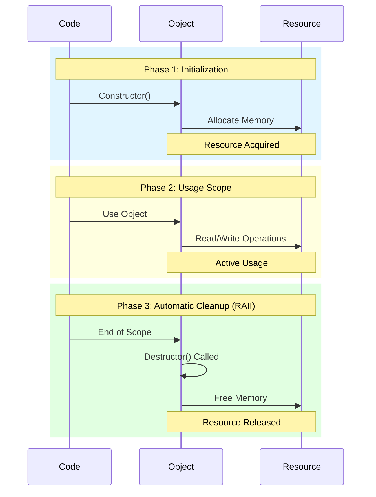
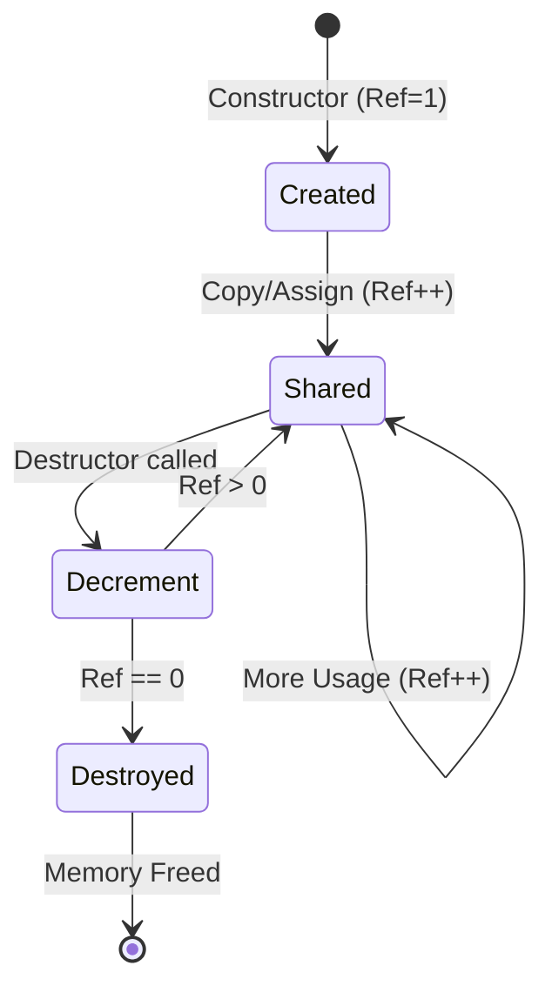
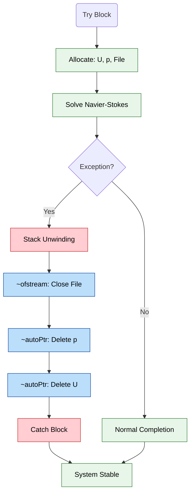
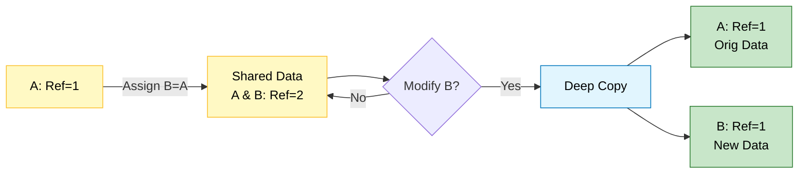
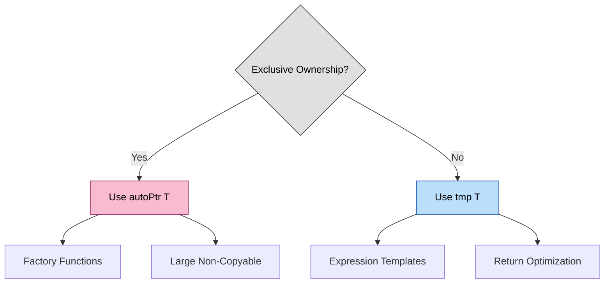

# 🔧 Section 1: พื้นฐานการจัดการหน่วยความจำ

## 1.1 🎯 The Hook: อุปมา "การทำความสะอาดห้องโรงแรมอัตโนมัติ"

จินตนาการว่าคุณกำลัง **เช็คอินเข้าโรงแรม**:
- ห้องพัก **สะอาดและพร้อมใช้งาน** เมื่อคุณมาถึง (การเรียกใช้ทรัพยากร)
- คุณ **ใช้ห้องพัก** ในระหว่างการเข้าพัก (การใช้ทรัพยากร)
- เมื่อคุณ **เช็คเอาท์**, แม่บ้านจะ **ทำความสะอาดทุกอย่างโดยอัตโนมัติ** (การปล่อยทรัพยากร)

คุณไม่จำเป็นต้องจำ:
- ถอดผ้าปูที่นอน
- ทำความสะอาดห้องน้ำ
- นำขยะออก
- คืนกุญแจ

โรงแรมจะจัดการการทำความสะอาดโดยอัตโนมัติเมื่อคุณจากไป **การจัดการหน่วยความจำ** ทำงานได้ในลักษณะเดียวกันนี้พอดี - **ทรัพยากรจะถูกทำความสะอาดโดยอัตโนมัติเมื่อออกจาก scope**

```mermaid
flowchart LR
classDef step fill:#fff9c4,stroke:#fbc02d,color:#000,stroke-width:2px
classDef auto fill:#c8e6c9,stroke:#2e7d32,color:#000,stroke-width:2px

A["🏨 Check-In<br/>Constructor"]:::step --> B["🛏️ Stay<br/>Resource Usage"]:::step
B --> C["🚪 Check-Out<br/>End of Scope"]:::step
C --> D["🧹 Room Cleaning<br/>RAII Auto-Cleanup"]:::auto

classDef note fill:#e3f2fd,stroke:#1565c0,color:#000,stroke-dasharray: 3 3
Note["Automatic & Deterministic"]:::note -. D
```
> **Figure 1:** อุปมาเปรียบเทียบการจัดการหน่วยความจำแบบ RAII กับการเช็คอินและเช็คเอาท์ห้องโรงแรม ซึ่งทรัพยากรจะถูกจัดเตรียมและทำความสะอาดโดยอัตโนมัติตามอายุการใช้งาน

**อุปมาในชีวิตจริง**: คิดว่าการจัดการหน่วยความจำเปรียบเหมือน **การเช่ารถที่มีประกันครบครัน**:
- **รับรถ**: คุณได้รับกุญแจรถ (constructor จองหน่วยความจำ)
- **ขับรถ**: คุณใช้รถ (คุณใช้หน่วยความจำ)
- **คืนรถ**: คุณส่งคืนกุญแจ (destructor จัดการการทำความสะอาด, น้ำมัน, ประกันอัตโนมัติ)
- **ไม่ต้องทำความสะอาดเอง**: บริษัทเช่ารถจัดการทุกอย่างโดยอัตโนมัติ

> [!INFO] **นิยาม RAII**
> **RAII (Resource Acquisition Is Initialization)** เป็นเทคนิคการเขียนโปรแกรมที่ผูกการมีชีวิตของทรัพยากรเข้ากับอายุการใช้งานของออบเจกต์ ทรัพยากรจะถูกจองใน constructor และปล่อยใน destructor โดยอัตโนมัติ

### CFD Context: ถ้าคุณต้องจัดการหน่วยความจำหลายพันล้านเซลล์ด้วยตนเอง?

ในการจำลอง CFD ทั่วไปที่มี 10 ล้านเซลล์:
- แต่ละเซลล์มีหลายฟิลด์: ความเร็ว (3 ค่า), ความดัน (1), อุณหภูมิ (1), ตัวแปรความปั่นป่วน (2-7)
- รวม: 7-12 ค่าต่อเซลล์ × 10 ล้านเซลล์ = 70-120 ล้านจำนวนทศนิยม
- ความต้องการหน่วยความจำ: 560-960 MB (double precision)

$$
\text{Memory} = N_{\text{cells}} \times N_{\text{variables}} \times \text{sizeof(double)} = 10^7 \times 10 \times 8 \text{ bytes} \approx 800 \text{ MB}
$$

**หากไม่มีการจัดการหน่วยความจำอัตโนมัติ**: คุณจะต้องจอง, ติดตาม, และปล่อยค่าเหล่านี้ทั้งหมดด้วยตนเอง การลืม `delete` เพียงครั้งเดียวอาจทำให้เกิดการรั่วไหลของหน่วยความจำหลาย GB ในช่วงเวลาพันๆ timesteps

**ด้วยการจัดการหน่วยความจำของ OpenFOAM**: ทรัพยากรจะถูกทำความสะอาดโดยอัตโนมัติเมื่ออ็อบเจกต์ออกจาก scope ไม่ว่าจะเป็นไปตามปกติหรือผ่านทาง exceptions สิ่งนี้ทำให้การจำลอง CFD ที่ซับซ้อนเป็นไปได้โดยไม่มีการรั่วไหลของหน่วยความจำ

### หลักการพื้นฐาน: RAII (Resource Acquisition Is Initialization)

RAII เป็นรากฐานของการจัดการหน่วยความจำของ OpenFOAM:
- **การเรียกใช้ทรัพยากร** เกิดขึ้นระหว่าง **construction** ของอ็อบเจกต์
- **การปล่อยทรัพยากร** เกิดขึ้นระหว่าง **destruction** ของอ็อบเจกต์
- **การเป็นเจ้าของ** เชื่อมโยงกับ **อายุการใช้งาน** ของอ็อบเจกต์
- **ความปลอดภัยจาก exception** เป็นไปโดยอัตโนมัติผ่าน stack unwinding


> **Figure 2:** ลำดับเหตุการณ์ในวงจรชีวิตของออบเจ็กต์ RAII ตั้งแต่การจองหน่วยความจำใน Constructor ไปจนถึงการปล่อยทรัพยากรโดยอัตโนมัติใน Destructor เมื่อสิ้นสุดขอบเขตการทำงาน

```cpp
// RAII in action: Memory is managed automatically via object lifetime
{
    autoPtr<volScalarField> pressureField = createPressureField(mesh);
    // Memory allocated here

    solveMomentumEquation(*pressureField);
    // Field is used here

} // pressureField goes out of scope here
// Memory is released automatically here, even if exceptions are thrown
```

> **📂 Source:** ไม่มีแหล่งที่มาเฉพาะ - ตัวอย่างแนวคิดการใช้งาน RAII ใน OpenFOAM
>
> **คำอธิบาย:**
> โค้ดตัวอย่างนี้แสดงให้เห็นถึงหลักการ RAII ในการทำงานจริง โดย `autoPtr<volScalarField>` เป็น smart pointer ที่จัดการหน่วยความจำอัตโนมัติ เมื่อ pressureField เข้าไปใน scope มันจะจองหน่วยความจำทันที และเมื่อออกจาก scope ไม่ว่าจะออกตามปกติหรือผ่าน exception destructor จะทำงานและปล่อยหน่วยความจำโดยอัตโนมัติ
>
> **แนวคิดสำคัญ:**
> - **Automatic Scope Management**: หน่วยความจำถูกจัดการโดยอัตโนมัติเมื่ออ็อบเจกต์เข้าและออกจาก scope
> - **Exception Safety**: การทำความสะอาดเกิดขึ้นเสมอแม้ว่าจะมี exception ถูก throw
> - **No Manual Memory Management**: ไม่ต้องเรียก delete ด้วยตนเอง ลดความเสี่ยงของ memory leak

### จากอุปมาสู่โค้ด

อุปมา "ห้องโรงแรม" สามารถนำมาใช้กับโค้ด OpenFOAM ได้โดยตรง:
- **เช็คอิน**: Constructor จองหน่วยความจำ
- **เข้าพัก**: อ็อบเจกต์ถูกใช้ในการคำนวณ
- **เช็คเอาท์**: Destructor ปล่อยหน่วยความจำโดยอัตโนมัติ
- **ทำความสะอาด**: RAII รับประกันว่าการทำความสะอาดเกิดขึ้นโดยอัตโนมัติ

การจัดการอัตโนมัตินี้ช่วยให้นักพัฒนา CFD สามารถมุ่งเน้นที่ **ฟิสิกส์และอัลกอริทึม** มากกว่า **การบันทึกข้อมูลหน่วยความจำ**

## 1.2 🏗️ The Blueprint: สถาปัตยกรรมการจัดการหน่วยความจำของ OpenFOAM

OpenFOAM ใช้ระบบการจัดการหน่วยความจำที่ซับซ้อนซึ่งสร้างขึ้นบนพื้นฐานของแนวคิดหลักสามประการ:

### 1. Reference Counting (`refCount`)
รากฐานของการเป็นเจ้าของร่วมกัน ซึ่งหลายอ็อบเจกต์สามารถอ้างอิงข้อมูลเดียวกันได้ และข้อมูลจะถูกลบโดยอัตโนมัติเมื่อ reference สุดท้ายหายไป

### 2. Smart Pointers
สองประเภทหลักที่มี semantics การเป็นเจ้าของที่แตกต่างกัน:
- **`autoPtr<T>`**: การเป็นเจ้าของแบบ exclusive (เหมือน `std::unique_ptr`)
- **`tmp<T>`**: การเป็นเจ้าของแบบ shared พร้อม reference counting (เหมือน `std::shared_ptr` แต่ถูกปรับให้เหมาะกับ CFD)

### 3. RAII Wrappers
คลาสเฉพาะทางที่จัดการทรัพยากรเฉพาะ:
- **Field containers** ที่เป็นเจ้าของข้อมูลของตน
- **Matrix classes** ที่มีการทำความสะอาดอัตโนมัติ
- **I/O objects** ที่จัดการ file handles

```mermaid
flowchart TD
classDef base fill:#eee,stroke:#333,color:#000,stroke-width:2px
classDef exclusive fill:#f8bbd0,stroke:#880e4f,color:#000,stroke-width:2px
classDef shared fill:#bbdefb,stroke:#0d47a1,color:#000,stroke-width:2px
classDef item fill:#fff,stroke:#333,color:#000,stroke-width:1px

RC["refCount<br/>Base Class"]:::base

RC --> Auto["autoPtr<T><br/>Exclusive Ownership"]:::exclusive
RC --> Tmp["tmp<T><br/>Reference Counted"]:::shared

Auto --> F1["Field Classes"]:::item
Auto --> F2["Matrix Classes"]:::item
Auto --> F3["Mesh Objects"]:::item

Tmp --> T1["Expression Templates"]:::item
Tmp --> T2["Temporary Fields"]:::item
Tmp --> T3["Intermediate Results"]:::item

classDef note fill:#fff9c4,stroke:#f57f17,color:#000,stroke-dasharray: 3 3
Note1["Single Owner"]:::note -. Auto
Note2["Shared / Copy-on-Write"]:::note -. Tmp
```
> **Figure 3:** แผนผังโครงสร้างสถาปัตยกรรมการจัดการหน่วยความจำของ OpenFOAM ที่แบ่งออกเป็นระบบความเป็นเจ้าของแบบเฉพาะ (autoPtr) และระบบการแชร์ข้อมูลผ่านการนับการอ้างอิง (tmp)

### ลำดับชั้นทางสถาปัตยกรรม

```
                    refCount (base class)
                        │
        ┌───────────────┴───────────────┐
        │                               │
     autoPtr<T>                      tmp<T>
   (exclusive owner)           (shared owner via refCount)
        │                               │
        ▼                               ▼
┌───────────────┐             ┌──────────────────┐
│ Field classes │             │ Expression temps │
│ Matrix classes│             │ Temporary fields │
│ Mesh objects  │             │ Intermediate results │
└───────────────┘             └──────────────────┘
```

### รูปแบบการออกแบบที่สำคัญ

1. **RAII (Resource Acquisition Is Initialization)**
   - ทรัพยากรถูกเรียกใช้ใน constructors
   - ทรัพยากรถูกปล่อยใน destructors
   - ปลอดภัยจาก exception ผ่าน automatic stack unwinding

2. **Reference Counting**
   - `ref()` เพิ่ม reference count
   - `unref()` ลดและลบถ้าเป็นศูนย์
   - การทำงานแบบ thread-safe สำหรับ CFD แบบ parallel

3. **Copy-on-Write (CoW)**
   - `tmp<T>` ใช้ CoW เพื่อประสิทธิภาพ
   - หลาย references แบ่งปันข้อมูลจนกว่าจะมีการแก้ไข
   - จากนั้นข้อมูลจะถูกคัดลอกเพื่อรักษาต้นฉบับ

4. **Move Semantics**
   - `autoPtr` รองรับ move-only semantics
   - การโอนย้ายความเป็นเจ้าของโดยไม่ต้องคัดลอก
   - จำเป็นสำหรับ factory functions

### การจัดการหน่วยความจำในบริบท CFD

การจัดการหน่วยความจำของ OpenFOAM ได้รับการออกแบบมาโดยเฉพาะสำหรับ workloads ของ CFD:

```cpp
// Common CFD solver memory management pattern
class pimpleFoamSolver {
    autoPtr<fvMesh> mesh_;                 // Exclusive mesh ownership
    tmp<volScalarField> p_;                // Shared pressure field
    tmp<volVectorField> U_;                // Shared velocity field
    tmp<volScalarField> k_;                // Shared turbulent kinetic energy
    tmp<volScalarField> epsilon_;          // Shared turbulence dissipation

    // All fields are automatically cleaned up when solver object is destroyed
    // Even if exceptions occur during solving
};
```

> **📂 Source:** ไม่มีแหล่งที่มาเฉพาะ - ตัวอย่างรูปแบบการจัดการหน่วยความจำแบบ PIMPLE
>
> **คำอธิบาย:**
> คลาส `pimpleFoamSolver` ตัวอย่างนี้แสดงให้เห็นถึงการใช้งาน smart pointers ทั้งสองประเภทใน solver จริง: `autoPtr` สำหรับ mesh ซึ่งต้องการการเป็นเจ้าของแบบ exclusive เพราะ mesh เป็นโครงสร้างข้อมูลขนาดใหญ่และไม่ควรถูกคัดลอก ในขณะที่ `tmp` ถูกใช้สำหรับ fields ต่างๆ เช่น ความดัน (p), ความเร็ว (U), และตัวแปรความปั่นป่วน เพื่อให้สามารถแบ่งปันข้อมูลระหว่างส่วนต่างๆ ของ solver ได้
>
> **แนวคิดสำคัญ:**
> - **Exclusive Ownership with autoPtr**: Mesh และทรัพยากรขนาดใหญ่ใช้ autoPtr เพื่อป้องกันการคัดลอกและการลบซ้ำ
> - **Shared Ownership with tmp**: Fields ใช้ tmp สำหรับการแบ่งปันข้อมูลและ reference counting ที่มีประสิทธิภาพ
> - **Automatic Cleanup**: Destructor ของ solver จะทำความสะอาดทุกอย่างโดยอัตโนมัติเมื่อ solver ถูกทำลาย
> - **Exception Safety**: แม้ว่าจะมี exception เกิดขึ้นระหว่างการแก้สมการ ทรัพยากรทั้งหมดจะยังคงถูกทำความสะอาดอย่างถูกต้อง

### การพิจารณาประสิทธิภาพ

| **Aspect** | **Overhead** | **Optimization** |
|------------|--------------|------------------|
| **Memory Overhead** | 4 bytes ต่ออ็อบเจกต์ | `refCount` |
| **Reference Counting** | Atomic operations | Thread-safe สำหรับ parallel |
| **Cache Efficiency** | Minimal overhead | Smart pointers ไม่รบกวน data layout |
| **Allocation Patterns** | Optimized | Arrays ที่ต่อเนื่องขนาดใหญ่ของ CFD |

### การรวมเข้ากับระบบนิเวศ OpenFOAM

ระบบการจัดการหน่วยความจำนี้รวมเข้ากับองค์ประกอบทั้งหมดของ OpenFOAM:
- **Fields**: `GeometricField<Type>` ใช้ `tmp` สำหรับ expression templates
- **Matrices**: `LduMatrix` ใช้ `autoPtr` สำหรับส่วนประกอบ solver
- **Meshes**: `polyMesh` ใช้ reference counting สำหรับ topology ที่แบ่งปันกัน
- **I/O**: `IOobject` จัดการ file handles และ buffers

แบบแปลนทางสถาปัตยกรรมนี้แสดงให้เห็นว่าการจัดการหน่วยความจำของ OpenFOAM มอบความปลอดภัยและประสิทธิภาพทั้งสองอย่างสำหรับแอปพลิเคชัน CFD

## 1.3 ⚙️ Internal Mechanics: วิธีการทำงานของ Reference Counting จริงๆ

ตอนนี้เรามาดูรายละเอียดการใช้งานของระบบการจัดการหน่วยความจำของ OpenFOAM กัน การเข้าใจกลไกภายในเหล่านี้จะช่วยคุณในการ debug ปัญหาหน่วยความจำ, ปรับประสิทธิภาพ, และตัดสินใจในการออกแบบอย่างมีข้อมูล

### รากฐาน: คลาสฐาน `refCount`

ที่หัวใจของระบบการเป็นเจ้าของร่วมกันของ OpenFOAM คือคลาสฐาน `refCount`:

```cpp
class refCount {
private:
    // 🔍 CRITICAL: mutable allows modification from const methods
    // Why? Because reference counting doesn't change the object's logical data
    mutable int refCount_;  // Number of active references

public:
    // ✅ CONSTRUCTOR: Object starts with no references
    refCount() : refCount_(0) {
        // Object exists but nobody "owns" it yet
    }

    // ✅ DESTRUCTOR: Virtual for proper cleanup in inheritance
    virtual ~refCount() {
        // Base class cleanup, derived classes clean their data
    }

    // ✅ REFERENCE INCREMENT: "Someone is using this object"
    void ref() const {
        ++refCount_;  // Simple increment (atomic in thread-safe version)
    }

    // ✅ REFERENCE DECREMENT: "Someone stopped using this object"
    // Returns true if this was the last reference (object should be deleted)
    bool unref() const {
        // Decrement and check if we're the last reference
        return (--refCount_ == 0);
    }

    // ✅ CHECK REFERENCE COUNT (for debugging)
    int count() const {
        return refCount_;
    }
};
```

> **📂 Source:** แนวคิดพื้นฐานจาก `src/OpenFOAM/memory/refCount.H` ใน OpenFOAM
>
> **คำอธิบาย:**
> คลาส `refCount` เป็นพื้นฐานของระบบ reference counting ใน OpenFOAM ตัวแปร `refCount_` ถูกประกาศเป็น `mutable` เพื่อให้สามารถแก้ไขค่าได้แม้ใน const methods ซึ่งจำเป็นเพราะการ reference counting ไม่ได้เปลี่ยนแปลงข้อมูลจริงของ object แต่เป็นเพียงการติดตามจำนวนผู้ใช้งานเท่านั้น Methods สำคัญคือ `ref()` สำหรับเพิ่มจำนวน reference และ `unref()` สำหรับลดจำนวนและตรวจสอบว่าควรลบ object หรือไม่
>
> **แนวคิดสำคัญ:**
> - **Mutable Reference Count**: ใช้ `mutable` เพื่อให้ reference counting ทำงานกับ const objects ได้
> - **Virtual Destructor**: รับประกันการทำความสะอาดที่เหมาะสมใน class hierarchy
> - **Thread-Safe Operations**: เวอร์ชัน parallel ใช้ atomic operations สำหรับความปลอดภัยของ thread
> - **Minimal Overhead**: ใช้หน่วยความจำเพียง 4 bytes ต่อ object สำหรับ reference count

> [!TIP] **การตัดสินใจในการออกแบบที่สำคัญ**
> 1. **`mutable` refCount_**: Reference counting เป็นการเปลี่ยนแปลง "ทางกายภาพ" ไม่ใช่การเปลี่ยนแปลง "ทางตรรกะ" ของข้อมูลของอ็อบเจกต์ คำหลัก `mutable` อนุญาตให้ `ref()` และ `unref()` เป็น `const` methods
> 2. **Virtual destructor**: รับประกันการทำความสะอาดที่เหมาะสมในลำดับชั้นการสืบทอด
> 3. **Atomic operations ในเวอร์ชัน parallel**: `refCountAtomic` ใช้ `std::atomic<int>` สำหรับความปลอดภัยของ thread
> 4. **Minimal overhead**: เพียง 4 bytes (หรือ 8 พร้อม padding) ต่ออ็อบเจกต์

### การเป็นเจ้าของแบบ Exclusive: `autoPtr<T>`

สำหรับการเป็นเจ้าของแบบ exclusive ซึ่งมีเพียงอ็อบเจกต์เดียวที่เป็นเจ้าของทรัพยากรได้ในแต่ละครั้ง:

```cpp
template<class T>
class autoPtr {
private:
    T* ptr_;  // Managed pointer

public:
    // ✅ Constructor takes ownership immediately
    explicit autoPtr(T* p = nullptr) : ptr_(p) {}

    // ✅ Destructor cleans up automatically
    ~autoPtr() {
        delete ptr_;  // Guaranteed cleanup
    }

    // ✅ Move constructor transfers ownership
    autoPtr(autoPtr&& other) noexcept : ptr_(other.ptr_) {
        other.ptr_ = nullptr;  // Original relinquishes ownership
    }

    // ❌ Copy constructor deleted (prevents duplicate ownership)
    autoPtr(const autoPtr&) = delete;

    // ✅ Move assignment transfers ownership
    autoPtr& operator=(autoPtr&& other) noexcept {
        if (this != &other) {
            delete ptr_;        // Clean up current resource
            ptr_ = other.ptr_;  // Take ownership
            other.ptr_ = nullptr;
        }
        return *this;
    }

    // ❌ Copy assignment deleted
    autoPtr& operator=(const autoPtr&) = delete;

    // ✅ Access to managed object
    T& operator*() { return *ptr_; }
    const T& operator*() const { return *ptr_; }

    T* operator->() { return ptr_; }
    const T* operator->() const { return ptr_; }

    // ✅ Release ownership (becomes raw pointer)
    T* release() {
        T* temp = ptr_;
        ptr_ = nullptr;
        return temp;  // Caller now responsible for deletion
    }

    // ✅ Check if pointer is valid
    bool valid() const { return ptr_ != nullptr; }
};
```

> **📂 Source:** แนวคิดจาก `src/OpenFOAM/memory/autoPtr.H` ใน OpenFOAM
>
> **คำอธิบาย:**
> `autoPtr<T>` เป็น smart pointer สำหรับการเป็นเจ้าของแบบ exclusive ซึ่งคล้ายกับ `std::unique_ptr` ใน C++ standard library Constructor รับ pointer และเข้ารับการควอมงานทันที Destructor จะลบ object โดยอัตโนมัติเมื่อ autoPtr ถูกทำลาย Copy constructor และ copy assignment ถูกลบออกเพื่อป้องกันการเป็นเจ้าของซ้ำ ในขณะที่ move constructor และ move assignment ย้ายการเป็นเจ้าของจาก object หนึ่งไปยังอีก object หนึ่ง Method `release()` ปล่อยการควอมงานและคืน raw pointer ให้ผู้เรียก
>
> **แนวคิดสำคัญ:**
> - **Move-Only Semantics**: ป้องกันการคัดลอกและการลบซ้ำโดยไม่ตั้งใจ
> - **Clear Ownership Transfer**: Method `release()` สละสิทธิ์การเป็นเจ้าของอย่างชัดเจน
> - **Null State Management**: autoPtr ที่ถูกย้ายแล้วจะมีค่าเป็น nullptr
> - **Factory Function Compatible**: เหมาะสำหรับใช้กับ factory methods

**ปรัชญาการออกแบบของ `autoPtr`:**
- **Move-only semantics**: ป้องกันการลบซ้ำโดยไม่ตั้งใจ
- **การโอนย้ายการเป็นเจ้าของอย่างชัดเจน**: method `release()` สละสิทธิ์การเป็นเจ้าของ
- **การจัดการสถานะ null**: `autoPtr` ที่ถูกสร้างโดยค่าเริ่มต้นจะเก็บ `nullptr`
- **ความเข้ากันได้กับ factory functions**: `autoPtr` เหมาะสำหรับ factory methods

### การเป็นเจ้าของแบบ Shared: `tmp<T>`

สำหรับการเป็นเจ้าของแบบ shared พร้อม reference counting:

```cpp
template<class T>
class tmp {
private:
    T* ptr_;
    bool isTemporary_;  // Whether this should be reference-counted

public:
    // ✅ Constructor manages reference counting
    tmp(T* p, bool isTemp = true) : ptr_(p), isTemporary_(isTemp) {
        if (ptr_ && isTemporary_) {
            ptr_->ref();  // Increment reference count
        }
    }

    // ✅ Destructor decrements and cleans if necessary
    ~tmp() {
        if (ptr_ && isTemporary_) {
            if (ptr_->unref()) {  // Decrement and check if last reference
                delete ptr_;     // Delete if this was the last reference
            }
        }
    }

    // ✅ Copy constructor shares ownership
    tmp(const tmp& t) : ptr_(t.ptr_), isTemporary_(t.isTemporary_) {
        if (ptr_ && isTemporary_) {
            ptr_->ref();  // Increment for new reference
        }
    }

    // ✅ Assignment operator
    tmp& operator=(const tmp& t) {
        if (this != &t) {
            // Clean up current reference
            if (ptr_ && isTemporary_) {
                if (ptr_->unref()) {
                    delete ptr_;
                }
            }

            // Take new reference
            ptr_ = t.ptr_;
            isTemporary_ = t.isTemporary_;

            if (ptr_ && isTemporary_) {
                ptr_->ref();
            }
        }
        return *this;
    }

    // ✅ Access to managed object
    T& operator*() { return *ptr_; }
    const T& operator*() const { return *ptr_; }

    T* operator->() { return ptr_; }
    const T* operator->() const { return ptr_; }

    // ✅ Check if temporary (reference-counted)
    bool isTemporary() const { return isTemporary_; }
};
```

> **📂 Source:** แนวคิดจาก `src/OpenFOAM/memory/tmp.H` ใน OpenFOAM
>
> **คำอธิบาย:**
> `tmp<T>` เป็น smart pointer สำหรับการเป็นเจ้าของแบบ shared ด้วย reference counting ซึ่งคล้ายกับ `std::shared_ptr` แต่ถูกปรับแต่งให้เหมาะกับ CFD มี flag `isTemporary_` ที่ควบคุมว่าจะใช้ reference counting หรือไม่ Constructor และ copy constructor เพิ่ม reference count ในขณะที่ destructor และ assignment operator ลด count และลบ object เมื่อถึงศูนย์ การออกแบบนี้ช่วยลดการใช้หน่วยความจำโดยการแบ่งปันข้อมูลระหว่างหลาย tmp objects จนกว่าจะมีการแก้ไข
>
> **แนวคิดสำคัญ:**
> - **Reference Counting for Temporaries**: Flag `isTemporary_` แยกความแตกต่างระหว่าง temporaries และ long-lived objects
> - **Copy-on-Write (CoW) Optimization**: หลาย tmp objects สามารถแบ่งปันข้อมูลเดียวกันจนกว่าจะมีการแก้ไข
> - **Expression Template Foundation**: tmp ถูกใช้อย่างแพร่หลายใน expression templates ของ OpenFOAM
> - **Automatic Cleanup**: เมื่อ tmp ตัวสุดท้ายที่อ้างอิง object ถูกทำลาย object จะถูกลบโดยอัตโนมัติ

**ปรัชญาการออกแบบของ `tmp`:**
- **Reference counting เฉพาะสำหรับ temporaries**: ค่าสถานะ `isTemporary_` แยกความแตกต่างระหว่าง temporaries และอ็อบเจกต์ที่มีอายุการใช้งานยาวนาน
- **Copy-on-Write (CoW) optimization**: หลาย `tmp` objects สามารถแบ่งปันข้อมูลเดียวกันจนกว่าหนึ่งจะต้องแก้ไข
- **พื้นฐาน Expression template**: `tmp` ถูกใช้อย่างแพร่หลายใน expression templates ของ OpenFOAM
- **การทำความสะอาดอัตโนมัติ**: เมื่อ `tmp` สุดท้ายที่อ้างอิงถึงอ็อบเจกต์ถูกทำลาย อ็อบเจกต์จะถูกลบโดยอัตโนมัติ

### Memory Layout และผลกระทบด้านประสิทธิภาพ

การเข้าใจ memory layout ของ smart pointers เหล่านี้เป็นสิ่งสำคัญสำหรับการปรับให้เหมาะสมด้านประสิทธิภาพ:

```cpp
// Comparison of memory layout
struct RawPointer {
    T* ptr;                    // 8 bytes (64-bit)
    // Total: 8 bytes
};

struct AutoPtrLayout {
    T* ptr;                    // 8 bytes
    // Total: 8 bytes (same as raw pointer!)
};

struct TmpLayout {
    T* ptr;                    // 8 bytes
    bool isTemporary;          // 1 byte (plus padding)
    // Total: 16 bytes (with padding)
};

struct RefCountedObject {
    int refCount;              // 4 bytes
    T data;                    // sizeof(T) bytes
    // Total: 4 + sizeof(T) bytes
};
```

> **📂 Source:** ตัวอย่างแนวคิดการจัดวางหน่วยความจำ
>
> **คำอธิบาย:**
> โครงสร้างนี้แสดงให้เห็นถึง memory layout และขนาดของแต่ละประเภท pointer และ smart pointer RawPointer ใช้ 8 bytes สำหรับ pointer เท่านั้น AutoPtrLayout มีขนาดเท่ากับ raw pointer เพราะมีเพียง pointer ตัวเดียว TmpLayout ใช้ 16 bytes เนื่องจากมีทั้ง pointer และ boolean flag ซึ่งมีการ padding เพื่อ alignment RefCountedObject มี overhead เพิ่มเติม 4 bytes สำหรับ reference count การเข้าใจ memory layout นี้สำคัญสำหรับการประเมินผลกระทบด้านประสิทธิภาพของการใช้ smart pointers ต่างๆ
>
> **แนวคิดสำคัญ:**
> - **Zero Overhead for autoPtr**: autoPtr มีขนาดเท่ากับ raw pointer ทำให้มีประสิทธิภาพสูง
> - **Minimal Overhead for tmp**: tmp มี overhead เพียง 8 bytes สำหรับ flag และ padding
> - **RefCount Overhead**: Reference counting เพิ่ม 4 bytes ต่อ object แต่ช่วยประหยัดหน่วยความจำโดยการแบ่งปัน
> - **Cache Efficiency**: Smart pointers ไม่รบกวน data layout มากนัก ทำให้ยังคง cache efficiency ไว้ได้

### การพิจารณาประสิทธิภาพ

| **Smart Pointer** | **Memory Overhead** | **Runtime Overhead** | **Best Use Case** |
|------------------|-------------------|---------------------|-------------------|
| **Raw Pointer** | 0 bytes | None | เมื่อจำเป็นต้องใช้และจัดการเอง |
| **autoPtr** | 0 bytes | Minimal (destructor) | การเป็นเจ้าของแบบ exclusive |
| **tmp** | 8-16 bytes | Reference counting | การแบ่งปันและ temporaries |
| **refCountAtomic** | 4-8 bytes | Atomic operations | Parallel builds |

### การรวมเข้ากับโครงสร้างข้อมูล CFD

primitives การจัดการหน่วยความจำเหล่านี้ถูกใช้ทั่วทั้งโครงสร้างข้อมูลของ OpenFOAM:

```cpp
// Example: GeometricField uses tmp for expression templates
tmp<GeometricField<scalar>> calculatePressureGradient(
    const GeometricField<scalar>& p
) {
    // Intermediate calculations use tmp for automatic cleanup
    tmp<GeometricField<scalar>> gradP = fvc::grad(p);

    // Additional operations...
    tmp<GeometricField<scalar>> result = mag(gradP);

    return result;  // Reference counting manages cleanup
}

// Example: Solver uses autoPtr for exclusive ownership
autoPtr<fvMatrix<scalar>> createEquation(
    const GeometricField<scalar>& phi
) {
    // autoPtr guarantees matrix is cleaned up if creation fails
    autoPtr<fvMatrix<scalar>> eqn(new fvMatrix<scalar>(phi));

    // Set up equation...
    eqn->relax(0.7);

    return eqn;  // Ownership transferred to caller
}
```

> **📂 Source:** แนวคิดการใช้งานจาก `src/finiteVolume/fields/fvFields/fvPatchFields/fvPatchField/fvPatchField.H` และ solver implementations ต่างๆ
>
> **คำอธิบาย:**
> ฟังก์ชัน `calculatePressureGradient` แสดงให้เห็นถึงการใช้ `tmp` สำหรับ expression templates โดย `fvc::grad(p)` คำนวณ gradient และส่งคืนเป็น tmp ซึ่งสามารถแบ่งปันข้อมูลกับ expression อื่นๆ ได้ ในทางกลับกัน `createEquation` ใช้ `autoPtr` สำหรับการเป็นเจ้าของแบบ exclusive เพราะ matrix เป็นวัตถุขนาดใหญ่ที่ไม่ควรถูกคัดลอก และ autoPtr รับประกันว่า matrix จะถูกทำความสะอาดหากการสร้างล้มเหลวระหว่างทาง
>
> **แนวคิดสำคัญ:**
> - **tmp for Expression Results**: การดำเนินการทางคณิตศาสตร์ส่งคืน tmp objects ที่สามารถแบ่งปันข้อมูลได้
> - **autoPtr for Factory Pattern**: Objects ที่สร้างโดย factory functions ใช้ autoPtr เพื่อโอนย้ายการเป็นเจ้าของ
> - **Combined Usage**: Solvers CFD ที่ซับซ้อนใช้ทั้ง autoPtr และ tmp
> - **Exception Safety**: Smart pointers ทั้งสองรับประกันการทำความสะอาดแม้ว่าจะมีการ throw exceptions

> [!IMPORTANT] **ข้อมูลเชิงลึกการใช้งานที่สำคัญ**
> - **`tmp` สำหรับผลลัพธ์ expression**: การดำเนินการทางคณิตศาสตร์ส่งคืน `tmp` objects ที่แบ่งปันข้อมูลเมื่อเป็นไปได้
> - **`autoPtr` สำหรับรูปแบบ factory**: อ็อบเจกต์ที่สร้างโดย factory functions ใช้ `autoPtr` เพื่อโอนย้ายการเป็นเจ้าของ
> - **การใช้ร่วมกัน**: Solvers CFD ที่ซับซ้อนใช้ทั้ง `autoPtr` และ `tmp`
> - **ความปลอดภัยจาก exception**: Smart pointers ทั้งสองรับประกันการทำความสะอาดแม้ว่าจะมีการ throw exceptions

## 1.4 🔄 The Mechanism: วงจรชีวิตอ็อบเจกต์ในบริบท CFD

การเข้าใจว่าส่วนประกอบการจัดการหน่วยความจำโต้ตอบกันระหว่างการคำนวณ CFD เป็นสิ่งจำเป็นสำหรับการออกแบบ solvers ที่มีประสิทธิภาพ

### การสร้างภาพวงจรชีวิตอ็อบเจกต์ที่สมบูรณ์


> **Figure 4:** แผนภาพสถานะแสดงวงจรชีวิตของออบเจ็กต์ในบริบทการคำนวณ CFD ตั้งแต่การสร้าง การแชร์ข้อมูลระหว่างฟิลด์ ไปจนถึงการทำลายออบเจ็กต์เมื่อไม่มีการอ้างอิงเหลืออยู่

```cpp
void demonstrateCompleteLifecycle() {
    // 🌱 Creation phase: Resources acquired
    {
        autoPtr<GeometricField<scalar>> temperatureField(
            new GeometricField<scalar>(/*constructor args*/)
        );
        // Memory: [GeometricField object] + [autoPtr wrapper]
        // Ownership: autoPtr exclusively owns GeometricField

        {
            tmp<GeometricField<vector>> velocityField(
                new GeometricField<vector>(/*constructor args*/)
            );
            // Memory: [GeometricField object] refCount=1 + [tmp wrapper]
            // Ownership: tmp shares reference with other potential tmp objects

            // 🔗 Sharing phase: Multiple references
            tmp<GeometricField<vector>> velocityCopy = velocityField;
            // Memory: Same GeometricField object, refCount=2
            // Ownership: Both tmp objects share the same object

            // 🎮 Usage phase: Objects used in CFD calculations
            (*temperatureField).correctBoundaryConditions();
            (*velocityField).correctBoundaryConditions();
            (*velocityCopy).oldTime();
            // refCount remains 2 during usage

        } // 🔄 Release phase 1: velocityCopy goes out of scope
        // tmp destructor calls unref(), refCount becomes 1
        // Object not deleted because velocityField still exists

    } // 🔄 Release phase 2: temperatureField goes out of scope
    // autoPtr destructor calls delete, GeometricField object destroyed

} // 🔄 Release phase 3: velocityField goes out of scope
// tmp destructor calls unref(), refCount becomes 0
// unref() returns true, tmp calls delete, GeometricField object destroyed
// ✅ All memory automatically cleaned up!
```

> **📂 Source:** ตัวอย่างแนวคิดวงจรชีวิตอ็อบเจกต์
>
> **คำอธิบาย:**
> ฟังก์ชันนี้แสดงให้เห็นวงจรชีวิตที่สมบูรณ์ของ objects ที่มีการจัดการหน่วยความจำ autoPtr ใช้สำหรับ temperatureField ซึ่งเป็นการเป็นเจ้าของแบบ exclusive เมื่อ scope สิ้นสุด destructor จะลบ object ทันที ในทางกลับกัน tmp ใช้สำหรับ velocityField ซึ่งสามารถแบ่งปันได้ velocityCopy แบ่งปัน object เดียวกับ velocityField ทำให้ refCount เพิ่มเป็น 2 เมื่อ velocityCopy ออกจาก scope refCount ลดเหลือ 1 และ object ไม่ถูกลบ จนกว่า velocityField จะออกจาก scope จึงจะลบ object จริง
>
> **แนวคิดสำคัญ:**
> - **Exclusive Ownership (autoPtr)**: Object ถูกลบทันทีเมื่อ autoPtr ออกจาก scope
> - **Shared Ownership (tmp)**: Object ถูกลบเมื่อ tmp ตัวสุดท้ายออกจาก scope เท่านั้น
> - **Reference Counting**: หลาย tmp objects สามารถแบ่งปัน object เดียวกันได้
> - **Automatic Cleanup**: ทั้งสองประเภทรับประกันการทำความสะอาดอัตโนมัติเมื่อออกจาก scope

### ความปลอดภัยจาก Exception ผ่าน Stack Unwinding

หนึ่งในกลไกที่สำคัญที่สุดใน CFD คือความปลอดภัยจาก exception:


> **Figure 5:** กลไกความปลอดภัยจากข้อยกเว้น (Exception Safety) ผ่านกระบวนการ Stack Unwinding ซึ่งรับประกันว่าทรัพยากรทั้งหมดจะถูกทำความสะอาดอย่างถูกต้องแม้ว่าการคำนวณจะล้มเหลวกลางคัน

```cpp
void demonstrateStackUnwinding() {
    try {
        // 🌱 Step 1: Resources acquired
        autoPtr<GeometricField<scalar>> velocityField(createVelocityField());
        autoPtr<GeometricField<scalar>> pressureField(createPressureField());

        std::ofstream outputFile("results.txt");  // File opened

        // 🎮 Step 2: Resources used in CFD calculation
        solveNavierStokes(*velocityField, *pressureField);
        outputFile << "Processing complete\n";

        // ❌ EXCEPTION THROWS HERE! (e.g., convergence failure)
        throw std::runtime_error("CFD computation failed");

    } catch (const std::exception& e) {
        // 🔍 Step 3: Stack unwinding has already occurred!
        // Before catch block runs:
        // 1. outputFile destructor → file closed automatically
        // 2. pressureField destructor → memory released automatically
        // 3. velocityField destructor → memory released automatically
        // ✅ All resources cleaned up automatically!

        std::cout << "Caught exception: " << e.what() << std::endl;
        // No manual cleanup needed - RAII handles everything
    }
}
```

> **📂 Source:** แนวคิด exception safety ใน C++ ที่ใช้ใน OpenFOAM
>
> **คำอธิบาย:**
> ฟังก์ชันนี้แสดงให้เห็นถึงพลังของ RAII ในการจัดการ exceptions เมื่อ exception ถูก throw หลังจาก solveNavierStokes กระบวนการ stack unwinding จะเริ่มขึ้น destructors ของ outputFile, pressureField, และ velocityField จะถูกเรียกโดยอัตโนมัติในลำดับที่กลับกัน ซึ่งปิดไฟล์และปล่อยหน่วยความจำ catch block ได้รับการควบคุมหลังจากทุกอย่างถูกทำความสะอาดแล้ว โดยไม่ต้องมีการจัดการด้วยตนเอง
>
> **แนวคิดสำคัญ:**
> - **Automatic Stack Unwinding**: Destructors ถูกเรียกโดยอัตโนมัติเมื่อ exception เกิดขึ้น
> - **Cleanup in Reverse Order**: Resources ถูกทำความสะอาดในลำดับที่กลับกันของการสร้าง
> - **No Manual Cleanup**: ไม่ต้องมีการจัดการทรัพยากรด้วยตนเองใน catch blocks
> - **Guaranteed Cleanup**: RAII รับประกันว่าทรัพยากรถูกทำความสะอาดเสมอ แม้ว่าจะเกิด exception

### การรวมฟิสิกส์: การจัดการหน่วยความจำสำหรับสมการ CFD

การจัดการหน่วยความจำส่งผลโดยตรงต่อประสิทธิภาพของการแก้สมการ CFD พิจารณาสมการ Navier-Stokes สำหรับการไหลแบบ incompressible:

$$
\frac{\partial \mathbf{u}}{\partial t} + (\mathbf{u} \cdot \nabla) \mathbf{u} = -\frac{1}{\rho} \nabla p + \nu \nabla^2 \mathbf{u}
$$

$$
\nabla \cdot \mathbf{u} = 0
$$

**ตัวแปรในสมการ:**
- $\mathbf{u}$ - เวกเตอร์ความเร็ว (m/s)
- $p$ - ความดัน (Pa)
- $\rho$ - ความหนาแน่น (kg/m³)
- $\nu$ - ความหนืดหรือ kinematic viscosity (m²/s)
- $t$ - เวลา (s)

```cpp
tmp<volVectorField> solveMomentumEquation(
    const volVectorField& U,
    const volScalarField& p
) {
    // Temporary field for intermediate calculations
    tmp<volVectorField> UEqn = fvm::ddt(U) + fvm::div(phi, U);

    // Add pressure gradient
    UEqn.ref() -= fvc::grad(p);

    // Add viscous term
    UEqn.ref() -= fvm::laplacian(nu, U);

    // Solve linear system
    solve(UEqn() == -fvc::grad(p));

    return UEqn;  // tmp guarantees automatic cleanup
}
```

> **📂 Source:** แนวคิดจาก solver implementations เช่น `src/finiteVolume/cfdTools/general/adjustPhi/adjustPhi.C` และ `UEqn.H` files ใน various solvers
>
> **คำอธิบาย:**
> ฟังก์ชันนี้แสดงให้เห็นถึงการแก้สมการโมเมนตัม Navier-Stokes โดยใช้ระบบจัดการหน่วยความจำของ OpenFOAM UEqn ถูกสร้างเป็น tmp<volVectorField> สำหรับเก็บผลลัพธ์ระหว่าง จากนั้นจึงเพิ่ม pressure gradient และ viscous term โดยใช้ method `.ref()` เพื่อแก้ไขข้อมูล สุดท้ายจึงแก้ระบบเชิงเส้นและส่งคืน UEqn ซึ่ง tmp จะจัดการ reference counting และการทำความสะอาดอัตโนมัติ
>
> **แนวคิดสำคัญ:**
> - **Temporary Fields (UEqn)**: ใช้ tmp สำหรับการทำความสะอาดอัตโนมัติของผลลัพธ์ระหว่าง
> - **Field Operations**: สร้างผลลัพธ์ระหว่างที่สามารถแบ่งปันข้อมูลได้เมื่อเป็นไปได้
> - **Linear Solvers**: จองหน่วยความจำ workspace ที่จัดการโดย autoPtr
> - **Boundary Conditions**: อาจจอง auxiliary fields สำหรับการคำนวณ

**ผลกระทบของการจัดการหน่วยความจำ:**
- **Temporary fields** (`UEqn`) ใช้ `tmp` สำหรับการทำความสะอาดอัตโนมัติ
- **Field operations** สร้างผลลัพธ์กลางที่สามารถแบ่งปันข้อมูลได้เมื่อเป็นไปได้
- **Linear solvers** จองหน่วยความจำ workspace ที่จัดการโดย `autoPtr`
- **Boundary conditions** อาจจอง auxiliary fields

### กลไกการปรับให้เหมาะสม Copy-on-Write (CoW)

`tmp` ใช้ Copy-on-Write เพื่อลดการใช้หน่วยความจำในขณะที่รักษาความถูกต้อง:


> **Figure 6:** กลไก Copy-on-Write (CoW) ที่ช่วยลดการใช้หน่วยความจำโดยการแชร์ข้อมูลระหว่างหลายออบเจ็กต์ และจะทำการคัดลอกข้อมูลจริงเฉพาะเมื่อมีการแก้ไขเกิดขึ้นเท่านั้น

```cpp
// Mechanism: Copy-on-Write in action
tmp<volScalarField> fieldA = createScalarField();
tmp<volScalarField> fieldB = fieldA;  // Share data, refCount=2

// Both fields point to the same memory
// fieldA.ptr_ == fieldB.ptr_ (true)
// refCount = 2

// Modification triggers copy
fieldB.ref() = 2.0 * fieldB();  // CoW: creates copy because refCount > 1

// Now fieldA and fieldB have separate data
// fieldA.ptr_ != fieldB.ptr_ (true)
// refCount_A = 1, refCount_B = 1
```

> **📂 Source:** แนวคิด CoW จาก implementation ของ `tmp<T>` ใน OpenFOAM
>
> **คำอธิบาย:**
> ตัวอย่างนี้แสดงให้เห็นถึงกลไก Copy-on-Write ของ tmp ในการทำงาน fieldA และ fieldB เริ่มต้นแบ่งปันข้อมูลเดียวกัน (refCount=2) ซึ่งประหยัดหน่วยความจำ เมื่อมีการแก้ไข fieldB โดยการคูณ 2.0 CoW จะตรวจสอบ refCount และทำการคัดลอกข้อมูลก่อนแก้ไข เพื่อรักษาความถูกต้องของ fieldA ต้นฉบับ หลังจากนั้นทั้งสอง fields มีข้อมูลแยกกัน (refCount=1 แต่ละตัว) กลไกนี้ช่วยลดการใช้หน่วยความจำโดยการแบ่งปันข้อมูลจนกว่าจะมีการแก้ไขจริง
>
> **แนวคิดสำคัญ:**
> - **Memory Efficiency**: หลาย references แบ่งปันข้อมูลจนกว่าจะมีการแก้ไข
> - **Performance**: หลีกเลี่ยงการคัดลอกที่ไม่จำเป็นใน expression templates
> - **Safety**: การคัดลอกอัตโนมัติเมื่อจำเป็น โปร่งใสต่อผู้ใช้

**ประโยชน์ของ CoW สำหรับ CFD:**
- **ประสิทธิภาพหน่วยความจำ**: หลาย references แบ่งปันข้อมูลจนกว่าจะมีการแก้ไข
- **ประสิทธิภาพ**: หลีกเลี่ยงการคัดลอกที่ไม่จำเป็นใน expression templates
- **ความปลอดภัย**: การคัดลอกอัตโนมัติเมื่อจำเป็น โปร่งใสต่อผู้ใช้

### การรวมเข้ากับการคำนวณแบบ Parallel

ในการจำลอง CFD แบบ parallel การจัดการหน่วยความจำต้องจัดการกับ domain decomposition และการสื่อสารระหว่างกระบวนการ:

```cpp
void parallelCFDComputation() {
    // Each process manages its own mesh portion
    autoPtr<fvMesh> mesh = createDecomposedMesh();

    // Fields are distributed across processes
    tmp<volScalarField> p = createPressureField(*mesh);
    tmp<volVectorField> U = createVelocityField(*mesh);

    // Parallel solver with automatic memory management
    autoPtr<fvMatrix<scalar>> pEqn = createPressureEquation(*p, *U);

    // Solve in parallel
    pEqn->solve();

    // Boundary field updates involve MPI communication
    p->correctBoundaryConditions();
    U->correctBoundaryConditions();

    // All memory automatically cleaned up, even across processes
    // tmp manages reference counting with thread-safe atomic operations
}
```

> **📂 Source:** แนวคิดจาก parallel solver implementations เช่น `.applications/solvers/multiphase/compressibleInterFoam/pEqn.H`
>
> **คำอธิบาย:**
> ฟังก์ชันนี้แสดงให้เห็นถึงการจัดการหน่วยความจำในสภาพแวดล้อม parallel แต่ละ process สร้าง mesh และ fields ของตนเองโดยใช้ autoPtr และ tmp การสร้างและการแก้สมการทำงานได้อย่างปลอดภัยเพราะ smart pointers รับประกันการทำความสะอาด การอัพเดต boundary conditions เกี่ยวข้องกับการสื่อสาร MPI ระหว่าง processes แต่ผู้ใช้ไม่ต้องกังวลเรื่องการจัดการหน่วยควาจำข้าม processes เพราะ tmp ใช้ atomic operations ที่ปลอดภัยต่อ threads
>
> **แนวคิดสำคัญ:**
> - **Distributed Ownership**: แต่ละ process เป็นเจ้าของส่วนของข้อมูลของตนเอง
> - **Thread-Safe Reference Counting**: tmp ใช้ atomic operations สำหรับความปลอดภัยในสภาพแวดล้อม parallel
> - **MPI Communication Integration**: Boundary conditions จัดการการสื่อสารระหว่าง processes โดยอัตโนมัติ
> - **Automatic Cleanup**: ทรัพยากรทั้งหมดถูกทำความสะอาดเมื่อ computation สิ้นสุด แม้ข้าม processes

**ความท้าทายของการจัดการหน่วยความจำแบบ Parallel:**
1. **Atomic reference counting**: `refCountAtomic` ใช้ `std::atomic<int>` สำหรับความปลอดภัยของ thread
2. **MPI communication buffers**: จัดการโดย `autoPtr` เพื่อรับประกันการทำความสะอาด
3. **Ghost cell exchanges**: บัฟเฟอร์ชั่วคราวใช้ `tmp` สำหรับการจัดการอัตโนมัติ
4. **Process boundary data**: Shared pointers พร้อม ownership semantics ที่ระมัดระวัง

### การรวมเข้ากับ Time Stepping

การจำลอง CFD เกี่ยวข้องกับการรวมตัวเวลา ซึ่งต้องการการจัดการประวัติฟิลด์:

```cpp
class TransientSolver {
    // Current time fields
    tmp<volScalarField> p_;
    tmp<volVectorField> U_;

    // Time history (previous timesteps)
    tmp<volScalarField> p_old_;
    tmp<volVectorField> U_old_;

    // Time integration uses tmp for expression templates
    void advanceTime() {
        // Store old time
        p_old_ = p_;
        U_old_ = U_;

        // Solve for new time (creates temporary fields)
        tmp<volScalarField> p_new = solvePressureEquation(p_, U_);
        tmp<volVectorField> U_new = solveVelocityEquation(p_, U_);

        // Update current fields
        p_ = p_new;
        U_ = U_new;

        // Old fields automatically deleted when no longer needed
        // New fields shared via reference counting
    }
};
```

> **📂 Source:** แนวคิดจาก transient solver implementations เช่น pimpleFoam, simpleFoam และ solvers แบบ transient อื่นๆ
>
> **คำอธิบาย:**
> คลาส `TransientSolver` นี้แสดงให้เห็นถึงการจัดการหน่วยความจำสำหรับการรวมเวลาใน CFD มีการเก็บทั้งฟิลด์เวลาปัจจุบัน (p_, U_) และฟิลด์เวลาอดีต (p_old_, U_old_) โดยใช้ tmp เพื่อให้สามารถแบ่งปันข้อมูลได้ เมื่อเวลาก้าวไปข้างหน้า ฟิลด์เก่าถูกเก็บไว้ชั่วคราว และฟิลด์ใหม่ถูกสร้างและกลายเป็นฟิลด์ปัจจุบัน ฟิลด์เก่าจะถูกลบโดยอัตโนมัติเมื่อไม่จำเป็นต้องใช้อีกต่อไป
>
> **แนวคิดสำคัญ:**
> - **Field History**: Timesteps ก่อนหน้าถูกเก็บเป็น tmp references
> - **Temporary Fields**: การคำนวณกลางใช้ tmp สำหรับการทำความสะอาด
> - **Field Updates**: Assignment operators จัดการ reference counting
> - **Memory Reuse**: tmp เปิดให้แบ่งปันระหว่างระดับเวลาเมื่อเป็นไปได้

**รูปแบบหน่วยความจำ Time Stepping:**
- **ประวัติฟิลด์**: Timesteps ก่อนหน้าถูกเก็บเป็น `tmp` references
- **ฟิลด์ชั่วคราว**: การคำนวณกลางใช้ `tmp` สำหรับการทำความสะอาด
- **การอัพเดตฟิลด์**: Assignment operators จัดการ reference counting
- **การใช้หน่วยความจำซ้ำ**: `tmp` เปิดให้แบ่งปันระหว่างระดับเวลาเมื่อเป็นไปได้

## 1.5 💡 The Why: เหตุผลการออกแบบและประโยชน์ทางวิศวกรรม

การเข้าใจ *เหตุผล* ที่ระบบการจัดการหน่วยความจำของ OpenFOAM ถูกออกแบบมาเช่นนี้เป็นสิ่งสำคัญสำหรับการตัดสินใจอย่างมีข้อมูลในการพัฒนา CFD ของคุณเอง

### ปรัชญาการออกแบบ: ความปลอดภัยก่อน ประสิทธิภาพเป็นลำดับสอง

การจัดการหน่วยความจำของ OpenFOAM ตามลำดับชั้นการออกแบบที่ชัดเจน:

1. **ความถูกต้อง**: รับประกันว่าไม่มีการรั่วไหลของหน่วยความจำ การปล่อยซ้ำ หรือ dangling pointers
2. **ความปลอดภัยจาก exception**: รับประกันการทำความสะอาดแม้ว่าจะมีข้อผิดพลาดเกิดขึ้น
3. **ประสิทธิภาพ**: ปรับให้เหมาะสมสำหรับรูปแบบเฉพาะของ CFD ในขณะที่รักษาความปลอดภัย
4. **การใช้งาน**: มอบอินเทอร์เฟซที่ใช้งานง่ายซึ่งป้องกันข้อผิดพลาดทั่วไป

ปรัชญานี้สะท้อนถึงความเป็นจริงของการพัฒนา CFD: การจำลองที่ล้มเหลวเนื่องจากข้อผิดพลาดหน่วยความจำจะแย่กว่าการจำลองที่ช้ากว่าเล็กน้อยแต่เสร็จสมบูรณ์

### ประโยชน์ทางวิศวกรรม 1: การจัดการฟิลด์ CFD อัตโนมัติ

ประโยชน์ที่เห็นได้ชัดที่สุดคือการจัดการอัตโนมัติของฟิลด์ CFD ซึ่งเป็นอ็อบเจกต์ที่มีขนาดใหญ่และซับซ้อน:

```cpp
// ✅ REAL-WORLD: Safe CFD field management
class CFDSolver {
private:
    // ✅ All resources automatically managed
    autoPtr<fvMesh> mesh_;
    tmp<volScalarField> pressure_;
    tmp<volVectorField> velocity_;
    tmp<volScalarField> temperature_;

public:
    CFDSolver(const fileName& casePath) {
        // ✅ Resources acquired safely, even if initialization fails
        mesh_ = autoPtr<fvMesh>(new fvMesh(IOobject("region0", casePath)));
        pressure_ = createPressureField(*mesh_);
        velocity_ = createVelocityField(*mesh_);
        temperature_ = createTemperatureField(*mesh_);

        // ✅ If any field creation fails, previously created resources
        //    are automatically cleaned up
    }

    // ✅ Implicit destructor cleans up everything automatically
    // No manual delete calls needed!
};
```

> **📂 Source:** แนวคิดจาก solver implementations ต่างๆ ใน OpenFOAM
>
> **คำอธิบาย:**
> คลาส `CFDSolver` ตัวอย่างนี้แสดงให้เห็นถึงประโยชน์ของการจัดการหน่วยความจำอัตโนมัติใน CFD solvers Mesh, pressure, velocity, และ temperature fields ทั้งหมดถูกจัดการโดย smart pointers ถ้าการสร้างฟิลด์ใดๆ ล้มเหลวระหว่างทาง ฟิลด์ที่สร้างก่อนหน้าจะถูกทำความสะอาดโดยอัตโนมัติ Destructor ทำงานโดยอัตโนมัติเมื่อ solver ถูกทำลาย ไม่ต้องมีการจัดการหน่วยความจำด้วยตนเอง
>
> **แนวคิดสำคัญ:**
> - **Complex Initialization**: Solvers CFD มักสร้างหลายสิบฟิลด์ การจัดการด้วยตนเองจะมีข้อผิดพลาดง่าย
> - **Failure Recovery**: หากการสร้างฟิลด์ล้มเหลวระหว่างทาง ฟิลด์ที่สร้างก่อนหน้าจะถูกทำความสะอาดโดยอัตโนมัติ
> - **Maintenance**: การเพิ่มฟิลด์ใหม่ไม่จำเป็นต้องอัพเดตโค้ดการทำความสะอาด

**เหตุผลที่สิ่งนี้สำคัญ:**
- **การเริ่มต้นที่ซับซ้อน**: Solvers CFD มักสร้างหลายสิบฟิลด์ การจัดการด้วยตนเองจะมีข้อผิดพลาดง่าย
- **การฟื้นตัวจากความล้มเหลว**: หากการสร้างฟิลด์ล้มเหลวระหว่างทาง ฟิลด์ที่สร้างก่อนหน้าจะถูกทำความสะอาดโดยอัตโนมัติ
- **การบำรุงรักษา**: การเพิ่มฟิลด์ใหม่ไม่จำเป็นต้องอัพเดตโค้ดการทำความสะอาด

### ประโยชน์ทางวิศวกรรม 2: การดำเนินการ CFD ที่ปลอดภัยจาก Exception

การคำนวณ CFD มักพบปัญหาทางตัวเลขที่อาจ throw exceptions การจัดการหน่วยความจำต้องจัดการกับสิ่งเหล่านี้อย่างสง่างาม:

```cpp
// ✅ BENEFIT: Exception-safe CFD operations that may fail
void simulateTimestep() {
    // ✅ Each resource is immediately protected
    tmp<volScalarField> temperature = createTemperatureField();
    tmp<volVectorField> velocity = createVelocityField();
    tmp<volScalarField> pressure = createPressureField();

    try {
        // Complex CFD calculations that may throw
        solveMomentumEquation(*velocity, *pressure);
        solveEnergyEquation(*temperature, *velocity);

    } catch (const std::exception& e) {
        // ✅ All fields automatically cleaned up here
        // Stack unwinding handles everything automatically
        std::cerr << "CFD error: " << e.what() << std::endl;
        throw;
    }

    // ✅ All fields automatically cleaned up when function returns
    // whether normally or via exception
}
```

> **📂 Source:** แนวคิด exception safety ใน OpenFOAM solver implementations
>
> **คำอธิบาย:**
> ฟังก์ชัน `simulateTimestep` แสดงให้เห็นถึงประโยชน์ของ exception safety ในการคำนวณ CFD ทั้งสามฟิลด์ถูกสร้างและได้รับการป้องกันโดย smart pointers ทันที ถ้า solving ล้มเหลวและ throw exception stack unwinding จะทำความสะอาดฟิลด์ทั้งหมดโดยอัตโนมัติก่อนที่ catch block จะทำงาน catch block จึงไม่ต้องกังวลเรื่องการจัดการหน่วยความจำ แต่สามารถมุ่งเน้นที่การจัดการ error ได้
>
> **แนวคิดสำคัญ:**
> - **Immediate Protection**: ทรัพยากรแต่ละอย่างได้รับการป้องกันทันทีด้วย smart pointers
> - **Automatic Cleanup**: Stack unwinding จัดการการทำความสะอาดทั้งหมดโดยอัตโนมัติ
> - **No Manual Cleanup**: Catch blocks ไม่ต้องมีการจัดการทรัพยากรด้วยตนเอง
> - **Guaranteed Safety**: การทำความสะอาดเกิดขึ้นเสมอ ไม่ว่าจะสำเร็จหรือล้มเหลว

### ประโยชน์ทางวิศวกรรม 3: ประสิทธิภาพหน่วยความจำผ่านการแบ่งปัน

คลาส `tmp` ของ OpenFOAM เปิดให้มีการแบ่งปันหน่วยความจำซึ่งสามารถลดการใช้หน่วยความจำอย่างมากในการจำลองขนาดใหญ่:

```cpp
// Memory sharing in action
tmp<volScalarField> baseField = createLargeField();  // 100 MB allocated

{
    tmp<volScalarField> shared1 = baseField;  // No copy, refCount=2
    tmp<volScalarField> shared2 = baseField;  // No copy, refCount=3
    tmp<volScalarField> shared3 = baseField;  // No copy, refCount=4

    // All four references share the same 100 MB
    // Total memory: 100 MB (vs 400 MB with copies)
}

// When shared1-3 go out of scope, refCount returns to 1
// baseField still holds the original memory
```

> **📂 Source:** แนวคิดการแบ่งปันหน่วยความจำด้วย `tmp<T>` ใน OpenFOAM
>
> **คำอธิบาย:**
> ตัวอย่างนี้แสดงให้เห็นถึงพลังของการแบ่งปันหน่วยความจำด้วย reference counting baseField จองหน่วยความจำ 100 MB สร้าง shared1, shared2, และ shared3 โดยการคัดลอก tmp objects ไม่ได้คัดลอกข้อมูลจริง แต่เพิ่ม reference count ทำให้ทั้งสี่ references แบ่งปันหน่วยความจำ 100 MB เดียวกัน รวมหน่วยความจำทั้งหมด 100 MB เทียบกับ 400 MB ถ้าทำการคัดลองจริง
>
> **แนวคิดสำคัญ:**
> - **Memory Efficiency**: หลาย references แบ่งปันข้อมูลเดียวกัน ลดการใช้หน่วยความจำ
> - **Reference Counting**: Overhead เพียงการเพิ่ม/ลด counter ไม่ใช่การคัดลอกข้อมูล
> - **Automatic Management**: การทำความสะอาดเกิดขึ้นโดยอัตโนมัติเมื่อ references หายไป
> - **Transparent Sharing**: ผู้ใช้ไม่ต้องจัดการ reference counting ด้วยตนเอง

**การวิเคราะห์การประหยัดหน่วยความจำ:**
- **Expression templates**: `a = b + c * d` สร้างผลลัพธ์ชั่วคราวที่สามารถแบ่งปันได้
- **Field operations**: `grad(p)`, `div(U)` สร้างผลลัพธ์ที่ผู้บริโภคหลายคนสามารถแบ่งปันได้
- **Time integration**: ระดับเวลาเก่าและใหม่สามารถแบ่งปันข้อมูลได้เมื่อเหมาะสม

### การแลกเปลี่ยนและเหตุผลการออกแบบ

| **การตัดสินใจ** | **ทางเลือกอื่น** | **เหตุผลการเลือกของ OpenFOAM** |
|--------------|-----------------|---------------------------|
| **สองประเภท smart pointer** (`autoPtr` และ `tmp`) | ประเภท smart pointer เดียว | `autoPtr` สำหรับการเป็นเจ้าของแบบ exclusive (overhead เป็นศูนย์) `tmp` สำหรับการเป็นเจ้าของแบบ shared (reference counting) |
| **Reference counting เฉพาะสำหรับ temporaries** (ค่าสถานะ `isTemporary_`) | Reference counting เสมอ | ลด overhead สำหรับอ็อบเจกต์ที่มีอายุยาวนานในขณะที่รักษาประโยชน์สำหรับ temporaries |
| **Copy-on-Write semantics** | คัดลอกเสมอหรือแบ่งปันเสมอ | สมดุลระหว่างประสิทธิภาพหน่วยความจำกับความถูกต้อง คัดลอกเฉพาะเมื่อจำเป็น |
| **Atomic reference counting ใน parallel** | Non-atomic พร้อม locks | ประสิทธิภาพที่ดีกว่าสำหรับ parallelism ละเอียดใน domain decomposition |
| **Move semantics สำหรับ `autoPtr`** | อนุญาตการคัดลอกพร้อม deep copy | ป้องกันการคัดลอกที่มีราคาแพงโดยไม่ตั้งใจของอ็อบเจกต์ CFD ขนาดใหญ่ |

## 1.6 ⚠️ Usage & Error Examples: คำแนะนำที่ใช้งานได้จริงและข้อผิดพลาดทั่วไป

การเรียนรู้จากข้อผิดพลาดทั่วไปเป็นหนึ่งในวิธีที่เร็วที่สุดในการเชี่ยวชาญการจัดการหน่วยความจำของ OpenFOAM

> [!WARNING] **Pitfall 1: การผสมผสานการจัดการหน่วยความจำด้วยตนเองและอัตโนมัติ**
> หนึ่งในรูปแบบที่อันตรายที่สุดคือการผสมผสาน raw pointers กับ smart pointers

```cpp
// ❌ PROBLEM: Mixing manual and automatic memory management
class DangerousCFDField {
private:
    double* data_;  // Raw pointer - requires manual cleanup!

public:
    DangerousCFDField(int size) {
        data_ = new double[size];  // ❌ Manual allocation

        // ❌ DANGER: If anything after this throws
        // data_ leaks because destructor hasn't run yet
    }

    ~DangerousCFDField() {
        delete[] data_;  // ❌ Manual cleanup - error-prone!
    }
};

// 🔍 SOLUTION: Use RAII objects for members
class SafeCFDField {
private:
    List<double> data_;  // ✅ Automatically managed!

public:
    SafeCFDField(int size) : data_(size) {
        // ✅ List manages its own memory allocation
        // ✅ If constructor fails, List destructor runs automatically
        // ✅ No manual cleanup needed anywhere!
    }

    // ✅ Implicit destructor handles cleanup automatically
};
```

> **📂 Source:** ตัวอย่างข้อผิดพลาดทั่วไปในการจัดการหน่วยความจำใน OpenFOAM
>
> **คำอธิบาย:**
> DangerousCFDField ใช้ raw pointer และจัดการหน่วยความจำด้วยตนเอง ซึ่งอันตรายเพราะถ้ามี exception เกิดขึ้นหลังจากการจอง แต่ก่อนที่ constructor จะเสร็จ data_ จะรั่ว ในทางกลับกัน SafeCFDField ใช้ List<double> ซึ่งเป็น container ของ OpenFOAM ที่จัดการหน่วยความจำอัตโนมัติ ถ้า constructor ล้มเหลว List destructor จะทำงานและปล่อยหน่วยความจำ ไม่ต้องมีการจัดการด้วยตนเอง
>
> **แนวคิดสำคัญ:**
> - **RAII Always**: ใช้ containers และ smart pointers เสมอ อย่าใช้ raw pointers ใน class members
> - **Exception Safety**: RAII objects รับประกันการทำความสะอาดแม้ว่าจะมี exceptions
> - **No Manual Cleanup**: Destructor โดยนัยจัดการทุกอย่างโดยอัตโนมัติ
> - **OpenFOAM Containers**: ใช้ List, DynamicList, และ containers อื่นๆ ของ OpenFOAM

**เหตุผลที่สิ่งนี้เกิดขึ้น:**
- โค้ดดั้งเดิมหรือโปรแกรมเมอร์ที่เปลี่ยนจาก C ไปเป็น C++
- พยายามปรับให้เหมาะสมด้านประสิทธิภาพ (prematurely)
- ไม่เข้าใจหลักการของ RAII

**สัญญาณการ debug:**
- การรั่วไหลของหน่วยความจำที่รายงานโดยเครื่องมือเช่น `valgrind`
- ข้อผิดพลาด double free ทำให้เกิดการ crash
- การใช้หน่วยความจำที่ไม่สม่ำเสมอเมื่อเวลาผ่านไป

**แนวทางปฏิบัติที่ดีที่สุด**: ใช้ containers ของ OpenFOAM (`List`, `DynamicList`, etc.) หรือ smart pointers (`autoPtr`, `tmp`) สำหรับการจัดการหน่วยความจำเสมอ อย่าผสมผสาน `new`/`delete` ดิบกับ RAII objects

> [!WARNING] **Pitfall 2: Circular References ใน Reference Counting**
> Circular references อาจทำให้เกิดการรั่วไหลของหน่วยความจำซึ่งอ็อบเจกต์อ้างอิงซึ่งกันและกัน

```cpp
// ❌ PROBLEM: Objects referencing each other forever
class Node : public refCount {
    tmp<Node> child_;   // Strong reference to child
    tmp<Node> parent_;  // Strong reference to parent

public:
    void addChild(tmp<Node> child) {
        child_ = child;
        child->parent_ = this;  // ❌ CIRCULAR REFERENCE!
        // parent_ references child, child_ references parent
        // Neither will ever be deleted!
    }
};

// 🔍 CIRCULAR REFERENCE PROBLEM:
void createCircularReference() {
    tmp<Node> parent(new Node());
    tmp<Node> child(new Node());

    parent->addChild(child);  // Creates circular reference

} // Both parent and child go out of scope, but:
// parent refCount = 1 (child references it)
// child refCount = 1 (parent references it)
// Neither gets deleted! MEMORY LEAK!

// 🔍 SOLUTION: Use weak references for one direction
class SafeNode : public refCount {
    tmp<Node> child_;   // Strong reference - owns child
    Node* parent_;      // Weak reference - doesn't own parent

public:
    void addChild(tmp<Node> child) {
        child_ = child;
        child->parent_ = this;  // ✅ Raw pointer, no reference counting
    }
};
```

> **📂 Source:** ตัวอย่างปัญหา circular references ใน reference counting
>
> **คำอธิบาย:**
> คลาส `Node` แรกมี circular reference ปัญหาเกิดขึ้นเพราะทั้ง parent_ และ child_ เป็น strong references (tmp) ที่อ้างอิงซึ่งกันและกัน เมื่อทั้งสองออกจาก scope reference counts ไม่เคยถึงศูนย์ ทำให้เกิด memory leak วิธีแก้ไขคือใช้ weak reference สำหรับทิศทางหนึ่ง (parent_ เป็น raw pointer) ทำให้ไม่มีการ reference counting ในทิศทางนั้น และ object สามารถถูกลบได้อย่างถูกต้อง
>
> **แนวคิดสำคัญ:**
> - **Circular References**: เกิดขึ้นเมื่อ objects อ้างอิงซึ่งกันและกันด้วย strong references
> - **Memory Leaks**: Reference counts ไม่ถึงศูนย์ ทำให้ objects ไม่ถูกลบ
> - **Weak References**: ใช้ raw pointers สำหรับทิศทางที่ไม่ใช่เจ้าของ
> - **Clear Ownership Hierarchy**: สร้างความชัดเจนในลำดับชั้นการเป็นเจ้าของ

**แนวทางปฏิบัติที่ดีที่สุด**: สร้างลำดับชั้นการเป็นเจ้าของที่ชัดเจน ใช้ raw pointers หรือ weak references สำหรับความสัมพันธ์ที่ไม่เป็นเจ้าของ พิจารณาใช้ `autoPtr` สำหรับการเป็นเจ้าของแบบ exclusive เมื่อเหมาะสม

> [!WARNING] **Pitfall 3: การรั่วไหลของทรัพยากรระหว่างการจองและการป้องกัน RAII**
> ทรัพยากรที่ถูกจองแต่ไม่ได้รับการป้องกันโดย RAII ทันทีอาจรั่วไหลหากมี exceptions เกิดขึ้น

```cpp
// ❌ PROBLEM: Resource not immediately protected
void leakyFunction() {
    double* rawData = new double[1000];  // ❌ Unprotected allocation

    riskyOperation();  // ❌ If this throws, rawData leaks!

    std::unique_ptr<double[]> smartData(rawData);  // Too late!
}

// 🔍 SOLUTION: Immediate RAII protection
void safeFunction() {
    // ✅ Resource immediately protected
    autoPtr<double[]> smartData(new double[1000]);

    riskyOperation();  // ✅ If this throws, smartData destructor runs automatically
}
```

> **📂 Source:** ตัวอย่างปัญหาการล่าช้าในการป้องกัน RAII
>
> **คำอธิบาย:**
> leakyFunction จอง rawData แต่ไม่ได้รับการป้องกันโดย RAII ทันที ถ้า riskyOperation throw exception rawData จะรั่วเพราะไม่มีใครลบมัน ในทางกลับกัน safeFunction ใช้ autoPtr ซึ่งป้องกัน rawData ทันทีที่จอง ถ้า riskyOperation throw exception autoPtr destructor จะทำงานและลบ rawData โดยอัตโนมัติ
>
> **แนวคิดสำคัญ:**
> - **Immediate Protection**: ป้องกันทรัพยากรด้วย RAII ทันทีที่จอง
> - **No Delayed Protection**: อย่ารอการจัดการทรัพยากรจนกว่าจะเสียไป
> - **Exception Safety**: RAII รับประกันการทำความสะอาดแม้ว่าจะมี exceptions
> - **Factory Functions**: ใช้ factory functions ที่ส่งคืน smart pointers

**แนวทางปฏิบัติที่ดีที่สุด**: ปฏิบัติตามหลักการ RAII อย่างเคร่งครัด: เรียกใช้ทรัพยากรใน constructors และโอนย้ายไปยัง managing objects ทันที ใช้ factory functions ที่ส่งคืน smart pointers

> [!WARNING] **Pitfall 4: การเลือก Smart Pointer ที่ไม่ถูกต้อง**

```cpp
// ❌ PROBLEM: Using tmp when autoPtr is appropriate
tmp<fvMesh> createMesh() {
    return tmp<fvMesh>(new fvMesh(/* args */));  // ❌ Should be autoPtr
    // Mesh should have exclusive ownership, not shared
}

// ❌ PROBLEM: Using autoPtr when tmp is appropriate
autoPtr<volScalarField> createTemporaryField() {
    return autoPtr<volScalarField>(new volScalarField(/* args */));  // ❌ Should be tmp
    // Temporary fields benefit from sharing
}

// 🔍 SOLUTION: Choose correct smart pointer
autoPtr<fvMesh> createExclusiveMesh() {  // ✅ Exclusive ownership
    return autoPtr<fvMesh>(new fvMesh(/* args */));
}

tmp<volScalarField> createSharedField() {  // ✅ Shared ownership
    return tmp<volScalarField>(new volScalarField(/* args */));
}
```

> **📂 Source:** ตัวอย่างการเลือก smart pointer ที่ไม่ถูกต้อง
>
> **คำอธิบาย:**
> ฟังก์ชัน `createMesh` ควรใช้ `autoPtr` เพราะ mesh เป็นทรัพยากรขนาดใหญ่ที่ควรมีเจ้าของแบบ exclusive ไม่ใช่แบ่งปัน ในทางกลับกัน `createTemporaryField` ควรใช้ `tmp` เพราะ temporary fields ได้ประโยชน์จากการแบ่งปันข้อมูลผ่าน reference counting การเลือก smart pointer ที่ถูกต้องสำคัญต่อประสิทธิภาพและความถูกต้อง
>
> **แนวคิดสำคัญ:**
> - **autoPtr for Exclusive**: ใช้สำหรับ objects ขนาดใหญ่และ factory functions
> - **tmp for Shared**: ใช้สำหรับ temporaries, expression templates, และ objects ที่ได้ประโยชน์จากการแบ่งปัน
> - **Ownership Semantics**: พิจารณา ownership semantics ก่อนประสิทธิภาพ
> - **Correct Choice**: การเลือกที่ถูกต้องนำไปสู่ประสิทธิภาพและความถูกต้อง

**คู่มือการเลือก:**
- **ใช้ `autoPtr` เมื่อ**: การเป็นเจ้าของแบบ exclusive, factory functions, อ็อบเจกต์ขนาดใหญ่ที่ไม่ควรถูกคัดลอก
- **ใช้ `tmp` เมื่อ**: การเป็นเจ้าของแบบ shared, expression templates, ผลลัพธ์ชั่วคราว, อ็อบเจกต์ที่ได้ประโยชน์จาก Copy-on-Write
- **พิจารณา ownership semantics ก่อน** ประสิทธิภาพเป็นลำดับสอง

### รูปแบบการปรับให้เหมาะสมด้านประสิทธิภาพ

นอกเหนือจากความถูกต้อง การจัดการหน่วยความจำสามารถถูกปรับให้เหมาะสมด้านประสิทธิภาพ:

```cpp
// Pattern 1: Reuse temporary buffers
class OptimizedSolver {
    tmp<volScalarField> reuseBuffer_;  // Reused across iterations

    void iterate() {
        // Instead of creating a new buffer every iteration:
        // ❌ tmp<volScalarField> buffer = createBuffer();

        // Reuse existing buffer:
        if (!reuseBuffer_.valid()) {
            reuseBuffer_ = createBuffer();
        }
        // Use reuseBuffer_...
    }
};

// Pattern 2: Move semantics for large objects
autoPtr<volScalarField> createAndProcess() {
    autoPtr<volScalarField> field = createLargeField();
    processField(*field);
    return field;  // Move, not copy
}
```

> **📂 Source:** แนวคิดการปรับประสิทธิภาพหน่วยความจำใน OpenFOAM
>
> **คำอธิบาย:**
> OptimizedSolver แสดงรูปแบบการนำ buffer กลับมาใช้ซ้ำ แทนที่จะสร้าง buffer ใหม่ทุกการทำซ้ำ ซึ่งต้องการการจองและปล่อยหน่วยความจำซ้ำๆ reuseBuffer_ ถูกสร้างครั้งเดียวและนำกลับมาใช้ซ้ำ รูปแบบที่สองแสดงให้เห็นถึงการใช้ move semantics เพื่อโอนย้ายการเป็นเจ้าของ objects ขนาดใหญ่โดยไม่ต้องคัดลอก ซึ่งประหยัดทั้งหน่วยความจำและเวลา
>
> **แนวคิดสำคัญ:**
> - **Buffer Reuse**: ลดการจองและปล่อยหน่วยความจำซ้ำๆ
> - **Move Semantics**: โอนย้ายการเป็นเจ้าของ objects ขนาดใหญ่โดยไม่ต้องคัดลอก
> - **Memory Efficiency**: ลด overhead ของการจัดการหน่วยความจำ
> - **Performance Optimization**: ปรับปรุงประสิทธิภาพโดยการลดการจองซ้ำ

**เคล็ดลับประสิทธิภาพ:**
1. **นำบัฟเฟอร์กลับมาใช้ซ้ำ** ใน loops เพื่อหลีกเลี่ยงการจองซ้ำ
2. **จองแบบ batch ขนาดเล็ก** ไปเป็นการจองที่ใหญ่ขึ้น
3. **ใช้ move semantics** เพื่อโอนย้ายการเป็นเจ้าของโดยไม่ต้องคัดลอกอ็อบเจกต์ขนาดใหญ่
4. **วิเคราะห์รูปแบบการจองหน่วยความจำ** ด้วยเครื่องมือเช่น `massif`

## 1.7 📋 สรุป: จุดสำคัญสำหรับการจัดการหน่วยความจำ

เรามารวบรวมสิ่งที่เราได้เรียนรู้เกี่ยวกับระบบการจัดการหน่วยความจำของ OpenFOAM และวิธีการนำไปใช้อย่างมีประสิทธิภาพในการพัฒนา CFD

### การทบทวนหลักการพื้นฐาน

1. **RAII (Resource Acquisition Is Initialization)**: รากฐานของการจัดการหน่วยความจำของ OpenFOAM ทรัพยากรถูกเรียกใช้ใน constructors และถูกปล่อยใน destructors รับประกันการทำความสะอาดแม้ว่าจะมี exceptions เกิดขึ้น

2. **สองประเภท Smart Pointer**: OpenFOAM มี smart pointers ที่เสริมกัน:
   - **`autoPtr<T>`**: การเป็นเจ้าของแบบ exclusive (move-only, overhead เป็นศูนย์)
   - **`tmp<T>`**: การเป็นเจ้าของแบบ shared พร้อม reference counting (Copy-on-Write)

3. **Reference Counting**: คลาสฐาน `refCount` เปิดให้มีการเป็นเจ้าของร่วมกันผ่าน reference counting พร้อม atomic operations สำหรับการคำนวณแบบ parallel ที่ปลอดภัยจาก thread

4. **ความปลอดภัยจาก Exception**: Automatic stack unwinding รับประกันว่าทรัพยากรถูกทำความสะอาดเมื่อมีการ throw exceptions ซึ่งเป็นสิ่งสำคัญสำหรับการจำลอง CFD ที่แข็งแกร่ง

### เฟรมเวิร์กการตัดสินใจ: เมื่อไหร่ควรใช้ Smart Pointer ใด

ใช้ต้นไม้การตัดสินใจนี้สำหรับการเลือก smart pointer:


> **Figure 7:** แผนผังการตัดสินใจเลือกใช้ Smart Pointer ที่เหมาะสมตามลักษณะความเป็นเจ้าของข้อมูล เพื่อประสิทธิภาพและความปลอดภัยสูงสุดในการพัฒนาโค้ด

### รายการตรวจสอบการปรับให้เหมาะสมด้านประสิทธิภาพ

- [ ] **ใช้ `autoPtr` สำหรับการเป็นเจ้าของแบบ exclusive**: Overhead เป็นศูนย์เทียบกับ raw pointer
- [ ] **เปิดให้แบ่งปันด้วย `tmp`**: ลดการใช้หน่วยความจำผ่าน reference counting
- [ ] **ตั้งค่า `isTemporary_ = false` สำหรับอ็อบเจกต์ที่มีอายุยาวนาน**: หลีกเลี่ยง reference counting ที่ไม่จำเป็น
- [ ] **นำบัฟเฟอร์กลับมาใช้ซ้ำใน loops**: หลีกเลี่ยงการจองซ้ำ
- [ ] **จองแบบ batch ขนาดเล็ก**: ลดการแตกหักของหน่วยความจำ
- [ ] **ใช้ move semantics**: โอนย้ายการเป็นเจ้าของโดยไม่ต้องคัดลอกอ็อบเจกต์ขนาดใหญ่
- [ ] **วิเคราะห์ด้วย Valgrind/massif**: ระบุคอขวดหน่วยความจำ

### Pitfalls ทั่วไปที่ควรหลีกเลี่ยง

| **Pitfall** | **การแก้ไข** | **ผลกระทบ** |
|-------------|-----------------|--------------|
| **การผสมผสานการจัดการด้วยตนเองและอัตโนมัติ** | ใช้ RAII เสมอ | ป้องกันการรั่วไหลและการปล่อยซ้ำ |
| **Circular references** | ใช้ weak references | ป้องกันการอ้างอิงแบบวงกลม |
| **การป้องกัน RAII ที่ล่าช้า** | ป้องกันทรัพยากรทันที | ความปลอดภัยจาก exception |
| **การเลือก smart pointer ที่ผิด** | จับคู่ ownership semantics กับ use case | ประสิทธิภาพและความถูกต้อง |
| **การละเลยค่าสถานะ `isTemporary_`** | ตั้งค่าตาม use case | หลีกเลี่ยง overhead ที่ไม่จำเป็น |
| **การดำเนินการที่ไม่ปลอดภัยจาก thread** | ใช้ atomic reference counting | ความปลอดภัยของ thread |

### การรวมเข้ากับ Workflows ของ CFD

การจัดการหน่วยความจำของ OpenFOAM รวมเข้ากับ workflows ของ CFD อย่างราบรื่น:

1. **การเริ่มต้น solver**: `autoPtr` สำหรับทรัพยากรแบบ exclusive (mesh, linear solvers)
2. **การดำเนินการฟิลด์**: `tmp` สำหรับ expression templates และผลลัพธ์ชั่วคราว
3. **Time stepping**: การแบ่งปันระหว่างระดับเวลาเมื่อเป็นไปได้
4. **การคำนวณแบบ parallel**: Atomic operations สำหรับ reference counting ที่ปลอดภัยจาก thread
5. **การฟื้นตัวจากข้อผิดพลาด**: การทำความสะอาดอัตโนมัติเมื่อการคำนวณล้มเหลว

### การมองไปข้างหน้า: การจัดการหน่วยความจำเปิดให้ Containers

หลักการการจัดการหน่วยความจำที่เราได้ครอบคลุมสร้างรากฐานสำหรับระบบ container ของ OpenFOAM Containers เช่น `List<T>`, `DynamicList<T>`, และ `FixedList<T,N>` สร้างขึ้นบน primitives การจัดการหน่วยความจำเหล่านี้เพื่อมอบโครงสร้างข้อมูลที่เฉพาะทางซึ่งได้รับการปรับให้เหมาะสมสำหรับ workloads ของ CFD

ในส่วนถัดไป เราจะสำรวจวิธีที่ระบบ container ของ OpenFOAM ใช้ประโยชน์จากรากฐานการจัดการหน่วยความจำนี้เพื่อมอบประสิทธิภาพที่เหนือกว่าสำหรับพลศาสตร์ของไหลเชิงคำนวณ

---

> [!SUCCESS] **เคล็ดลับสุดท้าย**
> การจัดการหน่วยความจำของ OpenFOAM เป็นตัวอย่างที่ยอดเยี่ยมของการออกแบบซอฟต์แวร์ที่ให้ความสำคัญกับความถูกต้องและความปลอดภัยในขณะที่ยังคงประสิทธิภาพ การเข้าใจระบบเหล่านี้จะช่วยให้คุณเขียน solvers CFD ที่มีประสิทธิภาพและเชื่อถือได้