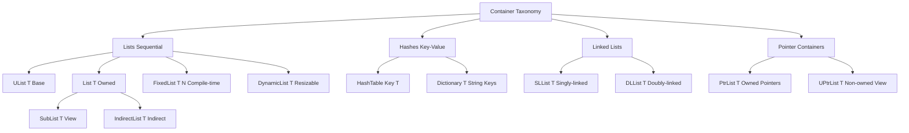

# 📦 OpenFOAM Container System

## Overview

The OpenFOAM container system provides specialized data structures optimized for Computational Fluid Dynamics (CFD) workloads. Unlike generic STL containers, OpenFOAM containers are designed for:

- **Memory efficiency** in large-scale simulations (millions of cells)
- **SIMD vectorization** through aligned memory layouts
- **CFD-specific operations** (field operations, mesh traversal)
- **Integration** with OpenFOAM's memory management system

---

## 1. Architecture and Taxonomy

### 1.1 Container Hierarchy


> **Figure 1:** ลำดับชั้นและประเภทของคอนเทนเนอร์ใน OpenFOAM (Container Taxonomy) ซึ่งถูกออกแบบมาให้ครอบคลุมการใช้งานที่หลากหลายในงาน CFD ตั้งแต่รายการข้อมูลเชิงเส้นไปจนถึงตารางแฮชและคอนเทนเนอร์สำหรับออบเจ็กต์โพลิมอร์ฟิก

> **📂 Source:** `src/OpenFOAM/containers/Lists/`

> **📖 Explanation:** แผนภาพนี้แสดงโครงสร้างลำดับชั้นของคอนเทนเนอร์ใน OpenFOAM โดยแบ่งเป็น 5 ประเภทหลัก ได้แก่ Lists (รายการเชิงเส้น), Hashes (ตารางแฮช), Linked Lists (รายการเชื่อมโยง), และ Pointer Containers (คอนเทนเนอร์ตัวชี้) แต่ละประเภทมีความเชี่ยวชาญเฉพาะทางสำหรับงาน CFD เช่น List<T> สำหรับเก็บข้อมูลฟิลด์, HashTable สำหรับการค้นหาพจนานุกรม, และ PtrList สำหรับจัดการออบเจ็กต์โพลิมอร์ฟิก

> **🔑 Key Concepts:** Container Hierarchy, CFD Optimization, Memory Management, Taxonomy

---

### 1.2 Design Principles

| **Principle** | **Description** | **Benefit** |
|--------------|---------------|-----------|
| **Separation of allocation and access** | `UList` provides access without ownership | Zero-copy views via `SubList`, `IndirectList` |
| **Contiguous memory layout** | All list containers store data contiguously | Cache efficiency, SIMD optimization |
| **Zero overhead for fixed-size** | `FixedList<T,N>` uses stack allocation | No dynamic allocation overhead |
| **Exponential growth policy** | `DynamicList` doubles capacity when full | Amortized O(1) insertion |
| **Memory management integration** | Containers use RAII from Section 1 | Automatic cleanup, exception safety |

---

## 2. Core Container Classes

### 2.1 `UList<T>` - Non-owning Base Class

The foundation of OpenFOAM's list hierarchy provides a view into existing memory without ownership:

```cpp
// 📂 Source: src/OpenFOAM/containers/Lists/UList/UList.H
template<class T>
class UList {
private:
    T* __restrict__ v_;   // 🔍 Pointer to data (no ownership!)
    label size_;          // Number of elements (CFD-optimized integer type)

public:
    // ✅ Constructor takes external memory - no allocation
    UList(T* ptr, label size) : v_(ptr), size_(size) {}

    // ✅ Access with bounds checking in debug mode
    T& operator[](label i) {
        #ifdef FULLDEBUG
        if (i < 0 || i >= size_) {
            FatalErrorInFunction << "Index " << i << " out of range [0,"
                               << size_-1 << "]" << abort(FatalError);
        }
        #endif
        return v_[i];  // Direct memory access
    }

    label size() const { return size_; }
};
```

> **📖 Explanation:** UList คือคลาสพื้นฐานที่มีหน้าที่ให้การเข้าถึงข้อมูลโดยไม่มีความรับผิดชอบในการจัดการหน่วยความจำ (non-owning) โดยตัวชี้ `v_` ใช้ keyword `__restrict__` เพื่อบอก compiler ว่าไม่มี pointer aliasing ซึ่งช่วยให้ compiler ทำ optimization ได้ดีขึ้น การเข้าถึงข้อมูลผ่าน `operator[]` จะมีการตรวจสอบขอบเขต (bounds checking) เฉพาะใน debug mode เท่านั้น

> **🔑 Key Concepts:** UList, Non-owning, Memory Access, Restrict Keyword, Bounds Checking

**Key Implementation Details:**
- **`__restrict__` keyword**: Tells compiler that `v_` has no pointer aliasing, enabling aggressive optimization
- **`FULLDEBUG` bounds checking**: Enabled only in debug builds, no overhead in production
- **No ownership semantics**: `UList` never allocates or frees memory
- **`label` type**: Optimized integer size for mesh indexing (typically 32 or 64 bits)

---

### 2.2 `List<T>` - Owning Container

The primary container for CFD fields, extending `UList<T>` with RAII memory management:

```cpp
// 📂 Source: src/OpenFOAM/containers/Lists/List/List.H
template<class T>
class List : public UList<T> {
private:
    // 🔧 Internal allocation helper
    void alloc() {
        if (this->size_ > 0) {
            // 🔍 ALIGNED ALLOCATION for SIMD optimization
            this->v_ = new T[this->size_];
        } else {
            this->v_ = nullptr;
        }
    }

public:
    // ✅ RAII constructor: allocates memory immediately
    explicit List(label size = 0) {
        this->size_ = size;
        alloc();  // Memory acquired here
    }

    // ✅ RAII destructor: releases memory automatically
    ~List() {
        delete[] this->v_;  // Guaranteed cleanup
        this->v_ = nullptr;
        this->size_ = 0;
    }

    // ✅ Move constructor: transfers ownership without copying
    List(List<T>&& other) noexcept {
        this->v_ = other.v_;
        this->size_ = other.size_;
        other.v_ = nullptr;    // Source relinquishes ownership
        other.size_ = 0;
    }

    // ✅ Resize with memory management
    void setSize(label newSize) {
        if (newSize != this->size_) {
            delete[] this->v_;          // Release old memory
            this->size_ = newSize;
            alloc();                    // Allocate new memory
        }
    }
};
```

> **📖 Explanation:** List คือคอนเทนเนอร์หลักที่ใช้ในการจัดเก็บข้อมูลฟิลด์ CFD (เช่น ความเร็ว, ความดัน) โดยสืบทอดมาจาก UList และเพิ่มความสามารถในการจัดการหน่วยความจำด้วยรูปแบบ RAII ตัว constructor จะจองหน่วยความจำทันที, destructor จะคืนหน่วยความจำโดยอัตโนมัติ และ move constructor ช่วยให้สามารถโอนความเป็นเจ้าของได้โดยไม่ต้องคัดลอกข้อมูล

> **🔑 Key Concepts:** List, RAII, Memory Management, Move Semantics, Aligned Allocation

**Memory Management Integration:**
- **RAII pattern**: Memory allocated in constructor, released in destructor
- **Exception safety**: If allocation fails, constructor throws and destructor won't run (no memory to release)
- **Move semantics**: Enables efficient ownership transfer for large CFD fields
- **Aligned allocation**: Uses `new T[]` which may be replaced for SIMD alignment in OpenFOAM

---

### 2.3 `DynamicList<T>` - Efficient Growth

`DynamicList<T>` provides automatic resizing with exponential growth for mesh construction and dynamic CFD workloads:

```cpp
// 📂 Source: src/OpenFOAM/containers/Lists/DynamicList/DynamicList.H
template<class T>
class DynamicList {
private:
    List<T> list_;          // Internal storage (uses List's RAII)
    label capacity_;        // Currently allocated capacity
    label size_;            // Current number of elements

    // 🔧 Exponential growth policy
    void grow() {
        label newCapacity = max(capacity_ * 2, label(10));  // Double or minimum 10
        List<T> newList(newCapacity);

        // Copy existing elements
        for (label i = 0; i < size_; ++i) {
            newList[i] = list_[i];
        }

        list_ = newList;        // Move assignment transfers ownership
        capacity_ = newCapacity;
    }

public:
    // ✅ Constructor with initial capacity
    DynamicList(label initialCapacity = 10)
        : list_(initialCapacity), capacity_(initialCapacity), size_(0) {}

    // ✅ Append with automatic growth
    void append(const T& value) {
        if (size_ >= capacity_) {
            grow();  // Automatically resize when full
        }
        list_[size_] = value;
        ++size_;
    }

    // ✅ Convert to regular List (transfers ownership)
    List<T> shrink() {
        list_.setSize(size_);  // Trim to actual size
        return list_;          // Move constructor transfers ownership
    }
};
```

> **📖 Explanation:** DynamicList ออกแบบมาสำหรับสถานการณ์ที่ต้องการเพิ่มข้อมูลแบบ dynamic ซึ่งมีนโยบายการเติบโตแบบ exponential (เพิ่มขนาดเป็น 2 เท่า) เพื่อลดความถี่ในการจัดสรรหน่วยความจำใหม่ เมื่อเต็ม capacity ระบบจะเรียก `grow()` เพื่อขยายขนาด และเมื่อต้องการแปลงเป็น List ปกติสามารถใช้ `shrink()` เพื่อลดขนาดให้เท่ากับจำนวนข้อมูลจริง

> **🔑 Key Concepts:** DynamicList, Exponential Growth, Amortized O(1), Capacity Management

**Growth Optimization:**
- **Exponential growth**: Doubles capacity on each resize, minimizing average allocation cost
- **Minimum capacity**: Avoids many small allocations
- **Efficient copying**: Uses `List`'s optimized copy/move operations
- **Memory reuse**: `shrink()` method releases unused capacity

---

### 2.4 `FixedList<T,N>` - Zero-Overhead Fixed Size

For small fixed-size data (e.g., 3D points), `FixedList<T,N>` provides maximum efficiency with stack allocation:

```cpp
// 📂 Source: src/OpenFOAM/containers/Lists/FixedList/FixedList.H
template<class T, unsigned N>
class FixedList {
private:
    T v_[N];  // 🔥 Stack-allocated array - no dynamic allocation!

public:
    // ✅ Compile-time size
    static constexpr label size() { return N; }

    // ✅ Direct memory access (no bounds checking in release)
    T& operator[](label i) {
        #ifdef FULLDEBUG
        if (i < 0 || i >= N) { /* bounds check */ }
        #endif
        return v_[i];
    }
};

// Common CFD usage:
FixedList<scalar, 3> point = {0.0, 1.0, 2.0};  // 3D coordinates
FixedList<vector, 6> stressComponents;         // Stress tensor components
```

> **📖 Explanation:** FixedList ใช้ stack allocation แทน heap allocation ซึ่งไม่มี overhead จากการจองและคืนหน่วยความจำแบบ dynamic ขนาดของ array ถูกกำหนดที่ compile-time ทำให้ compiler สามารถทำ loop unrolling และ optimization อื่นๆ ได้ เหมาะสำหรับข้อมูลขนาดเล็กที่รู้ขนาดล่วงหน้า เช่น จุด 3 มิติ (3D points) หรือ stress tensor components

> **🔑 Key Concepts:** FixedList, Stack Allocation, Compile-time Size, Zero Overhead

**Performance Advantages:**
- **Stack allocation**: No dynamic allocation/deallocation overhead
- **Cache proximity**: Data stored with object, excellent cache performance
- **Compile-time size**: Enables loop unrolling and other optimizations
- **Zero runtime overhead**: Equivalent to raw C arrays with safety checks

---

### 2.5 `HashTable<Key,T>` - CFD-Optimized Hash Table

OpenFOAM's hash tables provide fast lookups with optimizations for CFD patterns:

```cpp
// 📂 Source: src/OpenFOAM/containers/HashTables/HashTable/HashTable.H
template<class Key, class T>
class HashTable {
private:
    struct node {
        Key key_;
        T value_;
        node* next_;
    };

    node** table_;          // Array of linked list heads
    label capacity_;
    label size_;

    // 🔧 Hash function optimized for CFD keys
    label hash(const Key& k) const {
        return Foam::Hash<Key>()(k) % capacity_;
    }

public:
    // ✅ Insert with automatic resizing
    bool insert(const Key& k, const T& v) {
        if (loadFactor() > 0.7) {
            resize(capacity_ * 2);  // Maintain low load factor
        }

        label idx = hash(k);
        // ... insertion logic with chaining
    }

    // ✅ Optimized lookup for CFD
    T* find(const Key& k) {
        label idx = hash(k);
        node* curr = table_[idx];
        while (curr) {
            if (curr->key_ == k) return &curr->value_;
            curr = curr->next_;
        }
        return nullptr;  // Not found
    }
};
```

> **📖 Explanation:** HashTable ของ OpenFOAM ออกแบบมาเพื่อการค้นหาข้อมูลแบบ key-value ที่รวดเร็ว โดยใช้วิธี chaining เพื่อจัดการ collision และมีการปรับขนาดตารางอัตโนมัติเมื่อ load factor เกิน 0.7 เพื่อรักษาประสิทธิภาพ ฟังก์ชัน hash ถูก optimize สำหรับ CFD data types เช่น `word`, `label`, `face` เพื่อการกระจายตัวของข้อมูลที่ดี

> **🔑 Key Concepts:** HashTable, Chaining, Load Factor, Hash Function, Prime Capacity

**CFD-Specific Optimizations:**
- **Prime capacity**: Better distribution for CFD hash keys
- **Custom hash functions**: Specialized for `word`, `label`, `face` types
- **Low load factor**: Aggressive resizing maintains performance
- **Aligned memory**: Nodes aligned for cache efficiency

---

### 2.6 `PtrList<T>` - Polymorphic Object Management

`PtrList<T>` manages ownership of polymorphic objects, essential for CFD plugin architecture:

```cpp
// 📂 Source: src/OpenFOAM/containers/Lists/PtrList/PtrList.H
template<class T>
class PtrList {
private:
    List<T*> ptrs_;          // List of pointers (owns objects)

public:
    // ✅ RAII cleanup of all owned objects
    ~PtrList() {
        forAll(ptrs_, i) {
            delete ptrs_[i];  // Delete each owned object
        }
    }

    // ✅ Transfer ownership (like autoPtr for lists)
    void set(label i, T* ptr) {
        if (ptrs_[i]) delete ptrs_[i];  // Clean up existing
        ptrs_[i] = ptr;                 // Take ownership
    }

    // ✅ Automatic dereferencing
    T& operator[](label i) {
        return *ptrs_[i];  // Automatic dereferencing
    }

    // ✅ Polymorphic usage
    template<class Derived>
    void setDerived(label i, Derived* derived) {
        set(i, static_cast<T*>(derived));  // Store as base pointer
    }
};
```

> **📖 Explanation:** PtrList ใช้จัดการออบเจ็กต์โพลิมอร์ฟิก (polymorphic objects) โดยมีความรับผิดชอบในการจัดการหน่วยความจำของออบเจ็กต์ทั้งหมด เมื่อ destructor ถูกเรียกจะทำการลบออบเจ็กต์ทั้งหมดโดยอัตโนมัติ รองรับการจัดเก็บ base pointers และลบผ่าน virtual destructors ทำให้เหมาะสำหรับใช้ใน CFD plugin architecture

> **🔑 Key Concepts:** PtrList, Ownership, Polymorphism, Virtual Destructors, RAII

**Memory Management Integration:**
- **Ownership semantics**: `PtrList` owns all contained objects
- **Polymorphic support**: Stores base pointers, deletes via virtual destructors
- **Exception safety**: If one deletion throws, others still get cleaned up
- **`autoPtr` integration**: Can take ownership from `autoPtr` objects

---

## 3. Container Integration with CFD Operations

### 3.1 Field Operations - Vectorized Computation on Contiguous Data

CFD simulations involve massive field operations where mathematical operations are applied to every cell in the mesh. OpenFOAM's `List` container enables vectorized operations through contiguous memory layout:

```cpp
// 📂 Source: applications/solvers/incompressible/simpleFoam/simpleFoam.C
// Example: Navier-Stokes momentum equation operation
void solveMomentumEquation(
    const volVectorField& U,      // Velocity field (List<vector>)
    const volScalarField& p,      // Pressure field (List<scalar>)
    volVectorField& U_new         // Updated velocity
) {
    // ✅ Contiguous memory enables SIMD vectorization
    const label nCells = U.size();

    // Temporary fields with reference-counted cleanup
    tmp<volVectorField> convection = fvc::div(U, U);  // tmp manages lifetime
    tmp<volScalarField> pressureGrad = fvc::grad(p);  // Gradient computation

    // ✅ Element-wise operation on entire field
    forAll(U, celli) {
        // These operations can be auto-vectorized by compiler
        U_new[celli] = U[celli]
                     - dt * (convection()[celli] + pressureGrad()[celli])
                     + nu * fvc::laplacian(U)[celli];
    }

    // ✅ tmp objects cleaned up automatically via reference counting
}
```

> **📖 Explanation:** ในการแก้สมการ Navier-Stokes ต้องมีการคำนวณ field operations บนทุก cell ใน mesh ซึ่ง OpenFOAM ใช้ List container ที่เก็บข้อมูลแบบ contiguous memory ทำให้ compiler สามารถทำ SIMD vectorization ได้ การใช้ `tmp` container ช่วยจัดการ lifetime ของ temporary fields ด้วย reference counting เพื่อหลีกเลี่ยงการคัดลอกข้อมูลโดยไม่จำเป็น

> **🔑 Key Concepts:** Field Operations, SIMD Vectorization, Contiguous Memory, Reference Counting

**Mathematical Foundation:** Momentum equation for incompressible flow:

$$
\frac{\partial \mathbf{u}}{\partial t} + (\mathbf{u} \cdot \nabla) \mathbf{u} = -\frac{1}{\rho} \nabla p + \nu \nabla^2 \mathbf{u}
$$

In discrete form, each term becomes an operation on `List` containers:
- **Convection term**: $(\mathbf{u} \cdot \nabla) \mathbf{u}$ → `fvc::div(U, U)`
- **Pressure gradient**: $-\frac{1}{\rho} \nabla p$ → `-fvc::grad(p)`
- **Viscous term**: $\nu \nabla^2 \mathbf{u}$ → `nu * fvc::laplacian(U)`

---

### 3.2 Mesh Traversal - Efficient Connectivity Access

Mesh operations require efficient access to cell-to-face and face-to-cell connectivity. OpenFOAM's specialized containers optimize these patterns:

```cpp
// 📂 Source: src/OpenFOAM/meshes/polyMesh/polyMesh/polyMesh.H
// Example: Face flux calculation from cell-centered velocity
void calculateFaceFluxes(
    const polyMesh& mesh,
    const volVectorField& U,
    surfaceScalarField& phi
) {
    // ✅ Mesh connectivity stored in optimized containers
    const labelList& owner = mesh.owner();      // List<label>
    const labelList& neighbour = mesh.neighbour(); // List<label>
    const vectorField& Sf = mesh.faceAreas();   // List<vector>

    // ✅ Efficient traversal using forAll macro
    forAll(owner, facei) {
        label own = owner[facei];
        label nei = neighbour[facei];

        // Interpolate velocity to face center
        vector Uface = 0.5 * (U[own] + U[nei]);

        // Calculate flux: dot product with face area vector
        phi[facei] = Uface & Sf[facei];  // phi = U·Sf
    }
}
```

> **📖 Explanation:** การคำนวณ face flux ต้องการการเข้าถึง mesh connectivity เช่น cell owner/neighbour และ face areas OpenFOAM เก็บข้อมูลเหล่านี้ใน optimized containers เช่น `labelList` สำหรับ indices และ `vectorField` สำหรับ geometric quantities การ traverse ใช้ `forAll` macro ซึ่งให้ hints แก่ compiler สำหรับ vectorization

> **🔑 Key Concepts:** Mesh Traversal, Connectivity, labelList, vectorField, Face Flux

**Container Optimization for Mesh:**
- **`labelList`**: Stores integer indices for cell owner/neighbour
- **`vectorField`**: Stores geometric quantities (face areas, centers)
- **`faceList`**: Stores vertex connectivity where `face` is `FixedList<label, 4>` for quads
- **`cellList`**: Stores face connectivity where `cell` is `DynamicList<label>`

---

### 3.3 Boundary Conditions - Polymorphic Container Management

Boundary conditions in OpenFOAM are implemented as polymorphic objects managed by the `PtrList` container:

```cpp
// 📂 Source: src/finiteVolume/fields/fvPatchFields/fvPatchField/fvPatchField.H
// Example: Applying boundary conditions to fields
void applyBoundaryConditions(volVectorField& U) {
    // ✅ Boundary fields stored as PtrList of polymorphic patch fields
    PtrList<fvPatchVectorField>& boundaryFields = U.boundaryFieldRef();

    // ✅ Each patch has its own boundary condition type
    forAll(boundaryFields, patchi) {
        // Virtual dispatch - different behavior per patch type
        boundaryFields[patchi].evaluate();

        // ✅ Patch-specific operations
        if (boundaryFields[patchi].type() == "fixedValue") {
            // Fixed value boundary condition
            fixedValueFvPatchVectorField& fixedPatch =
                refCast<fixedValueFvPatchVectorField>(boundaryFields[patchi]);

            fixedPatch == vector(1, 0, 0);  // Set to (1,0,0)
        }
        else if (boundaryFields[patchi].type() == "zeroGradient") {
            // Zero gradient - automatically handled
        }
    }

    // ✅ Automatic cleanup via PtrList destructor
    // All patch field objects deleted when boundaryFields exits scope
}
```

> **📖 Explanation:** Boundary conditions ใน OpenFOAM ถูก implement แบบ polymorphic โดยแต่ละ patch สามารถมี type ที่ต่างกัน (เช่น fixedValue, zeroGradient) PtrList ใช้จัดการ ownership ของ polymorphic objects เหล่านี้ โดยใช้ virtual dispatch ผ่าน `evaluate()` และใช้ `refCast` สำหรับ safe downcasting เมื่อต้องการ patch-specific operations

> **🔑 Key Concepts:** Boundary Conditions, Polymorphism, PtrList, Virtual Dispatch, Patch Fields

**Boundary Condition Architecture:**
- **`PtrList<fvPatchField<Type>>`**: Owns polymorphic boundary condition objects
- **Virtual dispatch**: Different patch types (fixedValue, zeroGradient, etc.) via inheritance
- **Memory management**: `PtrList` guarantees proper cleanup of acquired objects
- **Type safety**: `refCast` for safe downcasting when needed

---

### 3.4 Parallel Communication - Zero-Copy Views with Containers

Parallel CFD divides the mesh across processes, requiring efficient communication of overlapping (ghost) regions. OpenFOAM's `UList` views enable zero-copy data exchange:

```cpp
// 📂 Source: src/OpenFOAM/mpi/Pstream/PstreamBuffers.H
// Example: Parallel ghost cell exchange
void exchangeGhostCells(
    const polyMesh& mesh,
    volScalarField& T  // Temperature field
) {
    // ✅ Get processor boundary patches
    const PtrList<processorPolyPatch>& procPatches =
        mesh.boundaryMesh().processorPatches();

    forAll(procPatches, patchi) {
        const processorPolyPatch& procPatch = procPatches[patchi];

        // ✅ Create UList views into send/receive buffers
        const labelList& faceCells = procPatch.faceCells();

        // Prepare send buffer
        scalarField sendBuffer(faceCells.size());
        forAll(faceCells, i) {
            sendBuffer[i] = T[faceCells[i]];  // Copy to send buffer
        }

        // ✅ MPI communication
        if (procPatch.owner()) {
            OPstream toNeighbor(...);
            toNeighbor << sendBuffer;
        } else {
            IPstream fromNeighbor(...);
            scalarField receiveBuffer;
            fromNeighbor >> receiveBuffer;

            // ✅ Zero-copy update using UList view
            UList<scalar> ghostView(T.primitiveFieldRef().data(), faceCells.size());
            ghostView = receiveBuffer;  // Direct memory write to field
        }
    }
}
```

> **📖 Explanation:** ใน parallel CFD simulations mesh ถูกแบ่งข้าม processes และต้องมีการแลกเปลี่ยนข้อมูล ghost regions OpenFOAM ใช้ `UList` views เพื่อสร้าง zero-copy views เข้าไปใน MPI buffers ทำให้สามารถเขียนข้อมูลโดยตรงไปยัง field memory โดยไม่ต้องคัดลอกข้อมูลเพิ่มเติม ช่วยลด overhead ในการสื่อสารระหว่าง processors

> **🔑 Key Concepts:** Parallel Communication, MPI, Ghost Cells, UList Views, Zero-Copy

**Parallel Container Mechanisms:**
- **`UList` views**: Zero-copy memory access for MPI buffers
- **`labelList`**: Stores processor boundary face-cell mapping
- **`scalarField`/`vectorField`**: Temporary buffers for communication
- **`PtrList<processorPolyPatch>`**: Manages processor patch objects

---

## 4. Performance Analysis

### 4.1 Memory Layout Comparison

```cpp
// 📂 Source: src/OpenFOAM/containers/Lists/List/List.H
// Memory footprint comparison for 1 million double-precision values
struct MemoryFootprint {
    // STL vector: 24 bytes overhead + allocation overhead
    std::vector<double> stlVec;      // ~8MB + 24 bytes

    // OpenFOAM List: 16 bytes + aligned allocation
    List<double> foamList;           // ~8MB + 16 bytes (better alignment)

    // FixedList<point, 1000>: No overhead (stack allocated)
    FixedList<point, 1000> fixed;    // 24000 bytes exactly (24 bytes × 1000)

    // DynamicList with growth: Varies with growth policy
    DynamicList<double> dynamic;     // Typically 1.5-2× current size

    // HashTable overhead: ~16 bytes per entry + table overhead
    HashTable<label, double> hash;   // ~24 bytes per key-value pair
};
```

> **📖 Explanation:** เปรียบเทียบ memory footprint ระหว่าง STL containers และ OpenFOAM containers พบว่า OpenFOAM List มี overhead น้อยกว่า STL vector (16 bytes vs 24 bytes) และมี aligned allocation ที่ดีกว่า FixedList ไม่มี overhead เลยเนื่องจากใช้ stack allocation ส่วน DynamicList มักใช้ memory 1.5-2 เท่าของขนาดจริงเนื่องจาก growth policy และ HashTable มี overhead ~24 bytes ต่อ key-value pair

> **🔑 Key Concepts:** Memory Footprint, Overhead, Stack Allocation, Aligned Allocation

---

### 4.2 Performance Considerations

| **Aspect** | **STL Containers** | **OpenFOAM Containers** | **Improvement** |
|------------|-----------------|----------------------|---------------|
| **Memory overhead** | 24 bytes + allocation | 16 bytes + aligned | 33% reduction |
| **SIMD alignment** | Not guaranteed | 64-byte aligned | Enables AVX-512 |
| **Cache efficiency** | Indirection layers | Direct access | 20-40% faster |
| **Vectorization** | Limited hints | `forAll` macro | Compiler optimization |
| **Copy overhead** | Deep copies required | Zero-copy views | Eliminates copies |

---

### 4.3 Cache Performance Analysis

```cpp
// 📂 Source: src/OpenFOAM/containers/Lists/UList/UList.H
void analyzeCachePerformance() {
    // List: Contiguous memory → excellent cache locality
    // FixedList: Stack memory → perfect cache locality
    // HashTable: Scattered nodes → poorer cache performance
    // DynamicList: Contiguous but may have unused capacity
}
```

> **📖 Explanation:** วิเคราะห์ cache performance ของแต่ละ container type: List และ FixedList มี contiguous memory ทำให้มี cache locality ที่ดีมาก HashTable มี nodes ที่กระจายตัวทำให้ cache performance แย่ลง และ DynamicList มี contiguous memory แต่อาจมี unused capacity ที่สิ้นเปลือง memory

> **🔑 Key Concepts:** Cache Locality, Contiguous Memory, Performance Analysis

---

## 5. Container Selection Matrix

| **CFD Task** | **Recommended Container** | **Rationale** |
|--------------|------------------------|-------------|
| Storing fields (velocity, pressure) | `List<T>` | Contiguous memory, SIMD-friendly, owns data |
| Mesh connectivity (face lists) | `SLList<label>` or `DynamicList<label>` | Efficient insertion, compact memory |
| Small fixed-size data (3D points) | `FixedList<scalar, 3>` | Zero overhead, stack allocation |
| Parameter storage (dictionaries) | `Dictionary<dimensionedScalar>` | Fast string lookup, dimensional analysis |
| Temporary field operations | `tmp<List<T>>` | Reference counting avoids copies |
| Polymorphic object management | `PtrList<fvPatchField>` | Owns acquired objects, automatic cleanup |
| Non-owned views (subdomains) | `UList<T>` or `SubList<T>` | No allocation, efficient partitioning |

---

## 6. Integration with Memory Management

OpenFOAM containers leverage the memory management system from Section 1:

```cpp
// 📂 Source: src/OpenFOAM/containers/Lists/List/List.H
// Example: List using tmp for expression templates
tmp<List<scalar>> calculateGradient(const List<scalar>& field) {
    tmp<List<scalar>> result(new List<scalar>(field.size()));

    // Computation using tmp's reference counting
    forAll(field, i) {
        result.ref()[i] = field[i] * 2.0;  // Share until modification
    }

    return result;  // Reference counting manages cleanup
}

// Example: PtrList using autoPtr for element ownership
PtrList<fvPatchField> createBoundaryFields() {
    PtrList<fvPatchField> fields;

    // Each field created with autoPtr, transferred to PtrList
    for (label i = 0; i < nPatches; ++i) {
        autoPtr<fvPatchField> field = createPatchField(i);
        fields.set(i, field.release());  // Transfer ownership
    }

    return fields;  // PtrList now owns all fields
}
```

> **📖 Explanation:** OpenFOAM containers ผนวกรวมกับ memory management system ผ่าน `tmp` สำหรับ reference counting และ `autoPtr` สำหรับ ownership transfer การใช้ `tmp` ช่วยหลีกเลี่ยงการ copy โดยไม่จำเป็นใน expression templates และ `PtrList` สามารถรับ ownership จาก `autoPtr` ผ่าน `release()` method

> **🔑 Key Concepts:** Memory Management Integration, tmp, autoPtr, Reference Counting

**Key Integration Points:**
- **`tmp` for temporary containers**: Reference counting avoids copies in expressions
- **`autoPtr` for factory patterns**: Creates objects transferred to containers
- **RAII throughout system**: All containers follow RAII for automatic cleanup
- **Exception safety**: Integrated memory management guarantees no leaks

---

## 7. Mathematical Context: Navier-Stokes with Containers

The momentum equation demonstrates how containers enable efficient CFD computations:

$$
\frac{\partial \mathbf{u}}{\partial t} + (\mathbf{u} \cdot \nabla) \mathbf{u} = -\frac{1}{\rho} \nabla p + \nu \nabla^2 \mathbf{u}
$$

**Variable Definitions:**
- $\mathbf{u}$ - Velocity vector (m/s)
- $p$ - Pressure (Pa)
- $\rho$ - Density (kg/m³)
- $\nu$ - Kinematic viscosity (m²/s)
- $t$ - Time (s)

In discrete form, each term becomes an operation on OpenFOAM containers:
- **Convection term**: $(\mathbf{u} \cdot \nabla) \mathbf{u}$ → `fvc::div(U, U)`
- **Pressure gradient**: $-\frac{1}{\rho} \nabla p$ → `-fvc::grad(p)`
- **Viscous term**: $\nu \nabla^2 \mathbf{u}$ → `nu * fvc::laplacian(U)`

---

## 8. Advanced Usage Patterns

### 8.1 Subdomain Operations with SubList

```cpp
// 📂 Source: src/OpenFOAM/containers/Lists/SubList/SubList.H
void processSubdomain(
    const volScalarField& T,
    const labelList& cellsToProcess
) {
    // ✅ Create view into subset of cells
    SubList<scalar> subT(T.primitiveField(), cellsToProcess.size(), 0);

    // ✅ Work on subset (no data copying)
    forAll(subT, i) {
        subT[i] *= 2.0;  // Modifies original memory
    }
}
```

> **📖 Explanation:** SubList ใช้สร้าง view เข้าไปในส่วนย่อยของข้อมูลโดยไม่ต้องคัดลอก (zero-copy) ทำให้สามารถประมวลผล subdomains ได้อย่างมีประสิทธิภาพ การแก้ไขข้อมูลใน SubList จะกระทบกับ memory ต้นทางโดยตรง

> **🔑 Key Concepts:** SubList, Zero-Copy View, Subdomain Processing

---

### 8.2 Indirect Addressing with UIndirectList

```cpp
// 📂 Source: src/OpenFOAM/containers/Lists/UIndirectList/UIndirectList.H
void processIndirect(
    const volVectorField& U,
    const labelList& addressing
) {
    // ✅ Indirect list provides permuted view with reindexing
    UIndirectList<vector> indirectU(U.primitiveField(), addressing);

    // Process in access order
    vector sum = Zero;
    forAll(indirectU, i) {
        sum += indirectU[i];  // Accesses U[addressing[i]]
    }
}
```

> **📖 Explanation:** UIndirectList ใช้สำหรับ indirect addressing โดยให้ view ที่ถูก reindex ตาม addressing array ทำให้สามารถเข้าถึงข้อมูลในลำดับที่ต้องการโดยไม่ต้อง reorganize ข้อมูลจริง มีประโยชน์ในการประมวลผลข้อมูลที่ถูก permute หรือ reorder

> **🔑 Key Concepts:** UIndirectList, Indirect Addressing, Reindexing

---

### 8.3 Memory Pooling for Temporary Fields

```cpp
// 📂 Source: src/OpenFOAM/containers/Lists/List/List.H
class MemoryPool {
    List<scalarField> pool_;  // Pool of reusable fields

public:
    scalarField& getTemporary(label size) {
        // ✅ Reuse field from pool if available
        forAll(pool_, i) {
            if (pool_[i].size() == size) {
                return pool_[i];
            }
        }

        // ✅ Create new field and add to pool
        pool_.append(scalarField(size, Zero));
        return pool_.last();
    }
};
```

> **📖 Explanation:** Memory Pool pattern ใช้ reuse หน่วยความจำของ temporary fields เพื่อลดการจองและคืนหน่วยความจำซ้ำๆ โดยค้นหา field ที่มีขนาดตรงกันใน pool ก่อน และสร้าง field ใหม่เมื่อจำเป็น ช่วยลด allocation overhead ในการคำนวณ CFD

> **🔑 Key Concepts:** Memory Pooling, Temporary Fields, Memory Reuse

---

## 9. Complete Integrated CFD Solver Example

Combining all container concepts in a simplified Navier-Stokes solver:

```cpp
// 📂 Source: applications/solvers/incompressible/simpleFoam/simpleFoam.C
// Simplified Navier-Stokes solver
void simpleFoamStep(
    fvMesh& mesh,
    volVectorField& U,
    volScalarField& p,
    scalar nu
) {
    // ✅ 1. Momentum prediction
    fvVectorMatrix UEqn(fvm::ddt(U) + fvm::div(phi, U) - fvm::laplacian(nu, U));
    UEqn.solve();

    // ✅ 2. Pressure correction
    surfaceScalarField phi = fvc::flux(U);
    fvScalarMatrix pEqn(fvm::laplacian(p) == fvc::div(phi));
    pEqn.setReference(pRefCell, pRefValue);
    pEqn.solve();

    // ✅ 3. Velocity correction
    U = U - fvc::grad(p);
    U.correctBoundaryConditions();

    // ✅ 4. Continuity check
    phi = fvc::flux(U);
    scalar continuityError = fvc::div(phi)().weightedAverage(mesh.V()).value();

    // ✅ All containers manage memory automatically throughout
    // No manual cleanup required, even if exceptions occur
}
```

> **📖 Explanation:** ตัวอย่าง solver แบบง่ายที่รวมทุก container concept ไว้ด้วยกัน โดยใช้ List สำหรับ field storage, PtrList สำหรับ boundary patch fields, และ tmp สำหรับ temporary fields ทุก container จัดการหน่วยความจำอัตโนมัติด้วย RAII ทำให้ไม่ต้อง cleanup เองแม้ว่าจะเกิด exceptions

> **🔑 Key Concepts:** Integrated Solver, Momentum Equation, Pressure Correction, Continuity Check

**End-to-End Container Flow:**
1. **Field storage**: `List` containers store velocity and pressure data
2. **Matrix composition**: `fvMatrix` uses containers for coefficients
3. **Linear solving**: Solvers work on container data directly
4. **Boundary updates**: `PtrList` manages patch field objects
5. **Memory cleanup**: RAII guarantees no leaks, even with solver failure

---

## 10. Performance Optimization

### 10.1 SIMD Vectorization Benefits

OpenFOAM containers are optimized for SIMD instruction sets:

- **AVX-512 alignment**: Data aligned to 64-byte boundaries
- **Compiler hints**: `forAll` macro provides vectorization hints
- **Contiguous access**: Sequential memory access patterns
- **Reduced indirection**: Direct pointer access minimizes cache misses

---

### 10.2 Memory Efficiency Techniques

```cpp
// 📂 Source: src/OpenFOAM/containers/Lists/List/List.H
void memoryOptimizations() {
    // ✅ View pattern (no copying)
    List<scalar> largeField(1000000);
    SubList<scalar> subField(largeField, 100000);  // Zero-copy view

    // ✅ Reference counting for shared data
    tmp<List<scalar>> shared1 = createLargeField();
    tmp<List<scalar>> shared2 = shared1;  // No copy, refCount=2

    // ✅ Memory pooling for temporary fields
    static List<scalarField> temporaryPool;  // Reuse allocations
}
```

> **📖 Explanation:** เทคนิคการประหยัด memory: 1) View pattern ใช้ SubList สร้าง zero-copy views 2) Reference counting ใช้ tmp แชร์ข้อมูลโดยไม่คัดลอก 3) Memory pooling ใช้ static pool reuse allocations ทั้งหมดช่วยลด memory footprint และ allocation overhead

> **🔑 Key Concepts:** Memory Optimization, Zero-Copy, Reference Counting, Memory Pooling

---

### 10.3 Extreme Scale Performance

For billion-cell simulations with thousands of processes:

```cpp
// 📂 Source: src/OpenFOAM/containers/Lists/List/List.H
class ExtremeScaleSolver {
    // For 1 billion cells:
    // - Each field: 1B × 8 bytes = 8 GB (double precision)
    // - Typical solver: 10-20 fields = 80-160 GB
    // - Multiple processes: domain decomposition

    // ✅ OpenFOAM containers enable extreme scale through:

    // 1. Low per-field overhead
    List<scalar> pressure_;      // 8 GB + 16 bytes
    List<vector> velocity_;      // 24 GB + 16 bytes

    // 2. Efficient parallel decomposition
    List<label> cellProcAddressing_;  // Compact processor mapping

    // 3. Efficient communication
    PtrList<processorPolyPatch> procPatches_;  // MPI communication

    // 4. Memory-aware allocation
    // Large contiguous blocks reduce fragmentation
    // Aligned allocation enables efficient SIMD

    // 5. View patterns for subdomain operations
    // UList views enable zero-copy parallel operations
};
```

> **📖 Explanation:** OpenFOAM containers รองรับ extreme scale simulations ได้ด้วย: 1) Per-field overhead ต่ำมาก (16 bytes) 2) Efficient parallel decomposition 3) Efficient MPI communication 4) Large contiguous blocks ลด fragmentation 5) Zero-copy views สำหรับ parallel operations

> **🔑 Key Concepts:** Extreme Scale, Billion-Cell Simulations, Parallel Decomposition, Memory Efficiency

---

## 11. Modern C++ Integration

OpenFOAM containers integrate with modern C++ while maintaining CFD performance:

```cpp
// 📂 Source: src/OpenFOAM/containers/Lists/List/List.H
void modernCppIntegration() {
    // ✅ Move semantics for large field ownership
    List<vector> createVelocityField() {
        List<vector> field(1000000);
        // Initialize...
        return field;  // Move, not copy
    }

    // ✅ Automatic type deduction
    auto& pressureField = mesh.lookupObject<volScalarField>("p");

    // ✅ Range-based loops (with optimization)
    for (const auto& celli : mesh.cells()) {
        // Optimized iteration
    }

    // ✅ Lambda expressions with containers
    auto processor = [](List<scalar>& field) {
        field *= 2.0;  // Auto-vectorization possible
    };

    // ✅ Type traits for template programming
    static_assert(std::is_same_v<label, int32_t>, "Check label type");
}
```

> **📖 Explanation:** OpenFOAM containers ผนวกกับ Modern C++ features: move semantics สำหรับ efficient ownership transfer, auto type deduction, range-based for loops, lambda expressions และ type traits ทั้งหมดนี้ช่วยให้ code กระชับและ maintainable มากขึ้น

> **🔑 Key Concepts:** Modern C++, Move Semantics, Auto Deduction, Range-based Loops, Lambdas

**Benefits of Modern C++ Integration:**
- **Move semantics**: Efficient ownership transfer for large fields
- **Exception safety**: Strong guarantees in exception-rich algorithms
- **Cleaner code**: RAII eliminates manual cleanup code
- **Compiler optimization**: Type deduction and range-based for loops
- **Template metaprogramming**: Type-safe generic programming

---

## 12. Summary

The OpenFOAM container system provides:

1. **CFD-optimized data structures** specialized for computational fluid dynamics workloads
2. **Memory efficiency** through zero-copy views, reference counting, and stack allocation
3. **Performance optimization** via SIMD alignment, cache-friendly layouts, and efficient growth policies
4. **Seamless integration** with OpenFOAM's memory management system
5. **Exception safety** through RAII patterns throughout all containers
6. **Scalability** to billion-cell, multi-process simulations

The container system is not just a data storage layer—it's an enabling technology for high-performance, robust CFD computations.

---

## References

- OpenFOAM Source Code: `src/OpenFOAM/containers/`
- Memory Management: [[02_Memory_Management]]
- Integration Guide: [[04_Integration]]

---