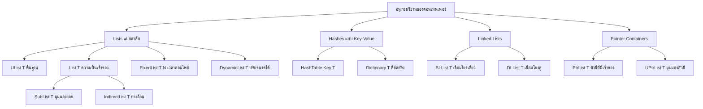

# 📦 ระบบคอนเทนเนอร์ของ OpenFOAM (OpenFOAM Container System)

## ภาพรวม (Overview)

ระบบคอนเทนเนอร์ของ OpenFOAM ให้โครงสร้างข้อมูลเฉพาะทางที่ได้รับการปรับปรุงให้เหมาะกับภาระงานของพลศาสตร์ของไหลเชิงคำนวณ (CFD) ต่างจากคอนเทนเนอร์ทั่วไปของ STL คอนเทนเนอร์ของ OpenFOAM ถูกออกแบบมาเพื่อ:

- **ประสิทธิภาพหน่วยความจำ (Memory efficiency)** ในการจำลองขนาดใหญ่ (หลายล้านเซลล์)
- **การทำเวกเตอร์ไลเซชันแบบ SIMD (SIMD vectorization)** ผ่านการจัดวางหน่วยความจำที่จัดเรียงอย่างเหมาะสม
- **การดำเนินการเฉพาะด้าน CFD** (การดำเนินการกับฟิลด์, การเดินผ่านเมช)
- **การบูรณาการ** เข้ากับระบบการจัดการหน่วยความจำของ OpenFOAM

---

## 1. สถาปัตยกรรมและอนุกรมวิธาน (Architecture and Taxonomy)

### 1.1 ลำดับชั้นของคอนเทนเนอร์ (Container Hierarchy)


> **รูปที่ 1:** ลำดับชั้นและประเภทของคอนเทนเนอร์ใน OpenFOAM (Container Taxonomy) ซึ่งถูกออกแบบมาให้ครอบคลุมการใช้งานที่หลากหลายในงาน CFD ตั้งแต่รายการข้อมูลเชิงเส้นไปจนถึงตารางแฮชและคอนเทนเนอร์สำหรับออบเจ็กต์โพลิมอร์ฟิก

> **📂 แหล่งที่มา:** `src/OpenFOAM/containers/Lists/`

> **📖 คำอธิบาย:** แผนภาพนี้แสดงโครงสร้างลำดับชั้นของคอนเทนเนอร์ใน OpenFOAM โดยแบ่งเป็น 5 ประเภทหลัก ได้แก่ Lists (รายการเชิงเส้น), Hashes (ตารางแฮช), Linked Lists (รายการเชื่อมโยง), และ Pointer Containers (คอนเทนเนอร์ตัวชี้) แต่ละประเภทมีความเชี่ยวชาญเฉพาะทางสำหรับงาน CFD เช่น `List<T>` สำหรับเก็บข้อมูลฟิลด์, `HashTable` สำหรับการค้นหาพจนานุกรม และ `PtrList` สำหรับจัดการออบเจ็กต์โพลิมอร์ฟิก

---

### 1.2 หลักการออกแบบ (Design Principles)

| **หลักการ** | **คำอธิบาย** | **ประโยชน์** |
|--------------|---------------|-----------|
| **การแยกส่วนการจัดสรรและการเข้าถึง** | `UList` ให้การเข้าถึงโดยไม่มีความเป็นเจ้าของ | การสร้างมุมมองโดยไม่ต้องคัดลอกข้อมูล (Zero-copy views) ผ่าน `SubList`, `IndirectList` |
| **การจัดวางหน่วยความจำแบบต่อเนื่อง** | คอนเทนเนอร์รายการทั้งหมดจัดเก็บข้อมูลต่อเนื่องกัน | ประสิทธิภาพแคช, การปรับปรุง SIMD |
| **ภาระงานเป็นศูนย์สำหรับขนาดคงที่** | `FixedList<T,N>` ใช้การจัดสรรบน Stack | ไม่มีภาระงานจากการจัดสรรหน่วยความจำแบบไดนามิก |
| **นโยบายการเติบโตแบบทวีคูณ** | `DynamicList` เพิ่มความจุเป็นสองเท่าเมื่อเต็ม | การแทรกข้อมูลที่มีต้นทุนเฉลี่ย O(1) (Amortized O(1)) |
| **การรวมระบบจัดการหน่วยความจำ** | คอนเทนเนอร์ใช้รูปแบบ RAII | การทำความสะอาดอัตโนมัติ, ความปลอดภัยจาก exception |

---

## 2. คลาสคอนเทนเนอร์หลัก (Core Container Classes)

### 2.1 `UList<T>` - คลาสฐานที่ไม่มีความเป็นเจ้าของ (Non-owning Base Class)

รากฐานของลำดับชั้นรายการของ OpenFOAM ให้มุมมองเข้าไปในหน่วยความจำที่มีอยู่โดยไม่มีความเป็นเจ้าของ:

```cpp
// 📂 แหล่งที่มา: src/OpenFOAM/containers/Lists/UList/UList.H
template<class T>
class UList {
private:
    T* __restrict__ v_;   // 🔍 ตัวชี้ไปยังข้อมูล (ไม่มีความเป็นเจ้าของ!)
    label size_;          // จำนวนองค์ประกอบ (ประเภทจำนวนเต็มที่ปรับให้เหมาะกับ CFD)

public:
    // ✅ คอนสตรัคเตอร์รับหน่วยความจำภายนอก - ไม่มีการจัดสรรใหม่
    UList(T* ptr, label size) : v_(ptr), size_(size) {}

    // ✅ การเข้าถึงพร้อมการตรวจสอบขอบเขตในโหมดดีบัก
    T& operator[](label i) {
        #ifdef FULLDEBUG
        if (i < 0 || i >= size_) {
            FatalErrorInFunction << "Index " << i << " out of range [0,"
                               << size_-1 << "]" << abort(FatalError);
        }
        #endif
        return v_[i];  // เข้าถึงหน่วยความจำโดยตรง
    }

    label size() const { return size_; }
};
```

> **📖 คำอธิบาย:** `UList` คือคลาสพื้นฐานที่มีหน้าที่ให้การเข้าถึงข้อมูลโดยไม่มีความรับผิดชอบในการจัดการหน่วยความจำ (Non-owning) โดยตัวชี้ `v_` ใช้คำสำคัญ `__restrict__` เพื่อบอกคอมไพเลอร์ว่าไม่มี Pointer aliasing ซึ่งช่วยให้คอมไพเลอร์ทำการปรับปรุงประสิทธิภาพ (Optimization) ได้ดีขึ้น การเข้าถึงข้อมูลผ่าน `operator[]` จะมีการตรวจสอบขอบเขต (Bounds checking) เฉพาะในโหมดดีบักเท่านั้น เพื่อไม่ให้เกิดภาระงานส่วนเกินในโหมดใช้งานจริง

---

### 2.2 `List<T>` - คอนเทนเนอร์ที่มีความเป็นเจ้าของ (Owning Container)

คอนเทนเนอร์หลักสำหรับฟิลด์ CFD ซึ่งขยายความสามารถของ `UList<T>` ด้วยการจัดการหน่วยความจำแบบ RAII:

```cpp
// 📂 แหล่งที่มา: src/OpenFOAM/containers/Lists/List/List.H
template<class T>
class List : public UList<T> {
private:
    // 🔧 ตัวช่วยจัดสรรหน่วยความจำภายใน
    void alloc() {
        if (this->size_ > 0) {
            // 🔍 การจัดสรรที่จัดเรียงเพื่อการปรับปรุง SIMD
            this->v_ = new T[this->size_];
        } else {
            this->v_ = nullptr;
        }
    }

public:
    // ✅ คอนสตรัคเตอร์ RAII: จัดสรรหน่วยความจำทันที
    explicit List(label size = 0) {
        this->size_ = size;
        alloc();  // ได้รับหน่วยความจำที่นี่
    }

    // ✅ ดีสตรัคเตอร์ RAII: ปล่อยหน่วยความจำโดยอัตโนมัติ
    ~List() {
        delete[] this->v_;  // รับประกันการทำความสะอาด
        this->v_ = nullptr;
        this->size_ = 0;
    }

    // ✅ คอนสตรัคเตอร์สำหรับการย้าย (Move constructor): โอนความเป็นเจ้าของโดยไม่ต้องคัดลอก
    List(List<T>&& other) noexcept {
        this->v_ = other.v_;
        this->size_ = other.size_;
        other.v_ = nullptr;    // ต้นทางสละความเป็นเจ้าของ
        other.size_ = 0;
    }

    // ✅ ปรับขนาดพร้อมการจัดการหน่วยความจำ
    void setSize(label newSize) {
        if (newSize != this->size_) {
            delete[] this->v_;          // ปล่อยหน่วยความจำเดิม
            this->size_ = newSize;
            alloc();                    // จัดสรรหน่วยความจำใหม่
        }
    }
};
```

> **📖 คำอธิบาย:** `List` คือคอนเทนเนอร์หลักที่ใช้ในการจัดเก็บข้อมูลฟิลด์ CFD (เช่น ความเร็ว, ความดัน) โดยสืบทอดมาจาก `UList` และเพิ่มความสามารถในการจัดการหน่วยความจำด้วยรูปแบบ RAII ตัวคอนสตรัคเตอร์จะจองหน่วยความจำทันทีเมื่อถูกสร้าง ดีสตรัคเตอร์จะคืนหน่วยความจำโดยอัตโนมัติเมื่อสิ้นสุดอายุการใช้งาน และคอนสตรัคเตอร์สำหรับการย้ายช่วยให้สามารถโอนความเป็นเจ้าของข้อมูลขนาดใหญ่ได้โดยไม่ต้องคัดลอกข้อมูลจริง

---

### 2.3 `DynamicList<T>` - การเติบโตที่มีประสิทธิภาพ (Efficient Growth)

`DynamicList<T>` ให้การปรับขนาดอัตโนมัติด้วยการเติบโตแบบทวีคูณสำหรับการสร้างเมชและภาระงาน CFD แบบไดนามิก:

```cpp
// 📂 แหล่งที่มา: src/OpenFOAM/containers/Lists/DynamicList/DynamicList.H
template<class T>
class DynamicList {
private:
    List<T> list_;          // การจัดเก็บภายใน (ใช้ RAII ของ List)
    label capacity_;        // ความจุที่จัดสรรไว้ในปัจจุบัน
    label size_;            // จำนวนองค์ประกอบปัจจุบัน

    // 🔧 นโยบายการเติบโตแบบทวีคูณ
    void grow() {
        label newCapacity = max(capacity_ * 2, label(10));  // เพิ่มสองเท่าหรือขั้นต่ำ 10
        List<T> newList(newCapacity);

        // คัดลอกองค์ประกอบที่มีอยู่
        for (label i = 0; i < size_; ++i) {
            newList[i] = list_[i];
        }

        list_ = newList;        // การกำหนดค่าแบบย้ายโอนความเป็นเจ้าของ
        capacity_ = newCapacity;
    }

public:
    // ✅ คอนสตรัคเตอร์พร้อมความจุเริ่มต้น
    DynamicList(label initialCapacity = 10)
        : list_(initialCapacity), capacity_(initialCapacity), size_(0) {}

    // ✅ การเพิ่มต่อท้ายพร้อมการเติบโตอัตโนมัติ
    void append(const T& value) {
        if (size_ >= capacity_) {
            grow();  // ปรับขนาดอัตโนมัติเมื่อเต็ม
        }
        list_[size_] = value;
        ++size_;
    }

    // ✅ แปลงเป็น List ปกติ (โอนความเป็นเจ้าของ)
    List<T> shrink() {
        list_.setSize(size_);  // ตัดส่วนเกินให้เท่ากับขนาดจริง
        return list_;          // คอนสตรัคเตอร์สำหรับการย้ายโอนความเป็นเจ้าของ
    }
};
```

> **📖 คำอธิบาย:** `DynamicList` ออกแบบมาสำหรับสถานการณ์ที่ต้องการเพิ่มข้อมูลโดยไม่ทราบขนาดล่วงหน้า ซึ่งมีนโยบายการเติบโตแบบทวีคูณ (เพิ่มขนาดเป็น 2 เท่า) เพื่อลดความถี่ในการจัดสรรหน่วยความจำใหม่ เมื่อข้อมูลเต็มความจุ ระบบจะขยายขนาดโดยอัตโนมัติ และเมื่อต้องการแปลงเป็น `List` ปกติสามารถใช้ `shrink()` เพื่อปล่อยหน่วยความจำส่วนที่ไม่ได้ใช้งาน

---

### 2.4 `FixedList<T,N>` - ขนาดคงที่โดยไม่มีภาระงานส่วนเกิน (Zero-Overhead Fixed Size)

สำหรับข้อมูลขนาดเล็กที่มีขนาดคงที่ (เช่น จุด 3 มิติ), `FixedList<T,N>` ให้ประสิทธิภาพสูงสุดด้วยการจัดสรรบน Stack:

```cpp
// 📂 แหล่งที่มา: src/OpenFOAM/containers/Lists/FixedList/FixedList.H
template<class T, unsigned N>
class FixedList {
private:
    T v_[N];  // 🔥 อาร์เรย์ที่จัดสรรบน Stack - ไม่มีการจัดสรรแบบไดนามิก!

public:
    // ✅ ขนาดที่ทราบ ณ เวลาคอมไพล์
    static constexpr label size() { return N; }

    // ✅ การเข้าถึงหน่วยความจำโดยตรง
    T& operator[](label i) {
        #ifdef FULLDEBUG
        if (i < 0 || i >= N) { /* ตรวจสอบขอบเขต */ }
        #endif
        return v_[i];
    }
};

// การใช้งานทั่วไปใน CFD:
FixedList<scalar, 3> point = {0.0, 1.0, 2.0};  // พิกัด 3 มิติ
FixedList<vector, 6> stressComponents;         // ส่วนประกอบของเทนเซอร์ความเค้น
```

> **📖 คำอธิบาย:** `FixedList` ใช้การจัดสรรบน Stack แทนการใช้ Heap ซึ่งช่วยลดภาระงานส่วนเกินจากการจองและคืนหน่วยความจำแบบไดนามิก ขนาดของอาร์เรย์ถูกกำหนดตั้งแต่ขั้นตอนการคอมไพล์ ทำให้คอมไพเลอร์สามารถทำ Optimization ได้อย่างเต็มที่ เหมาะสำหรับข้อมูลขนาดเล็ก เช่น พิกัดจุดหรือส่วนประกอบของเทนเซอร์

---

### 2.5 `HashTable<Key,T>` - ตารางแฮชที่ปรับปรุงมาเพื่อ CFD (CFD-Optimized Hash Table)

ตารางแฮชของ OpenFOAM ให้การสืบค้นที่รวดเร็วพร้อมการปรับปรุงให้เหมาะกับรูปแบบข้อมูล CFD:

```cpp
// 📂 แหล่งที่มา: src/OpenFOAM/containers/HashTables/HashTable/HashTable.H
template<class Key, class T>
class HashTable {
private:
    struct node {
        Key key_;
        T value_;
        node* next_;
    };

    node** table_;          // อาร์เรย์ของหัวรายการเชื่อมโยง
    label capacity_;
    label size_;

    // 🔧 ฟังก์ชันแฮชที่ปรับปรุงมาเพื่อคีย์ CFD
    label hash(const Key& k) const {
        return Foam::Hash<Key>()(k) % capacity_;
    }

public:
    // ✅ การแทรกพร้อมการปรับขนาดอัตโนมัติ
    bool insert(const Key& k, const T& v) {
        if (loadFactor() > 0.7) {
            resize(capacity_ * 2);  // รักษาค่า Load factor ให้ต่ำ
        }

        label idx = hash(k);
        // ... ตรรกะการแทรกแบบ Chaining
    }

    // ✅ การสืบค้นที่ปรับปรุงมาเพื่อ CFD
    T* find(const Key& k) {
        label idx = hash(k);
        node* curr = table_[idx];
        while (curr) {
            if (curr->key_ == k) return &curr->value_;
            curr = curr->next_;
        }
        return nullptr;  // ไม่พบข้อมูล
    }
};
```

> **📖 คำอธิบาย:** `HashTable` ของ OpenFOAM ออกแบบมาเพื่อการค้นหาข้อมูลแบบ Key-Value ที่รวดเร็ว โดยใช้วิธี Chaining เพื่อจัดการกับการชนกันของข้อมูล (Collision) และมีการปรับขนาดตารางอัตโนมัติเพื่อรักษาประสิทธิภาพ ฟังก์ชันแฮชได้รับการปรับปรุงให้เหมาะกับข้อมูล CFD เช่น `word`, `label` หรือ `face` เพื่อการกระจายข้อมูลที่สม่ำเสมอ

---

### 2.6 `PtrList<T>` - การจัดการออบเจ็กต์โพลิมอร์ฟิก (Polymorphic Object Management)

`PtrList<T>` จัดการความเป็นเจ้าของออบเจ็กต์โพลิมอร์ฟิก ซึ่งจำเป็นสำหรับสถาปัตยกรรมปลั๊กอินของ CFD:

```cpp
// 📂 แหล่งที่มา: src/OpenFOAM/containers/Lists/PtrList/PtrList.H
template<class T>
class PtrList {
private:
    List<T*> ptrs_;          // รายการของตัวชี้ (เป็นเจ้าของออบเจ็กต์)

public:
    // ✅ การทำความสะอาดออบเจ็กต์ที่เป็นเจ้าของทั้งหมดด้วย RAII
    ~PtrList() {
        forAll(ptrs_, i) {
            delete ptrs_[i];  // ลบแต่ละออบเจ็กต์ที่เป็นเจ้าของ
        }
    }

    // ✅ โอนความเป็นเจ้าของ (เหมือน autoPtr สำหรับรายการ)
    void set(label i, T* ptr) {
        if (ptrs_[i]) delete ptrs_[i];  // ทำความสะอาดของเดิม
        ptrs_[i] = ptr;                 // รับความเป็นเจ้าของใหม่
    }

    // ✅ การลดระดับการอ้างอิงอัตโนมัติ (Automatic dereferencing)
    T& operator[](label i) {
        return *ptrs_[i];  // เข้าถึงค่าผ่านตัวชี้โดยตรง
    }

    // ✅ การใช้งานแบบโพลิมอร์ฟิก
    template<class Derived>
    void setDerived(label i, Derived* derived) {
        set(i, static_cast<T*>(derived));  // จัดเก็บในรูปตัวชี้คลาสฐาน
    }
};
```

> **📖 คำอธิบาย:** `PtrList` ใช้จัดการออบเจ็กต์ที่มีการสืบทอด (Polymorphic objects) โดยรับผิดชอบการจัดการหน่วยความจำของออบเจ็กต์ทั้งหมด เมื่อ `PtrList` ถูกทำลาย มันจะลบออบเจ็กต์ทั้งหมดที่ถือครองอยู่โดยอัตโนมัติผ่านดีสตรัคเตอร์เสมือน (Virtual destructors) ทำให้เหมาะสำหรับใช้ในระบบปลั๊กอินของ CFD เช่น เงื่อนไขขอบเขตหรือแบบจำลองทางกายภาพ

---

## 3. การบูรณาการคอนเทนเนอร์กับการดำเนินการ CFD

### 3.1 การดำเนินการกับฟิลด์ - การคำนวณแบบเวกเตอร์บนข้อมูลที่ต่อเนื่อง

การจำลอง CFD เกี่ยวข้องกับการดำเนินการกับฟิลด์ขนาดมหาศาล ระบบคอนเทนเนอร์ `List` ของ OpenFOAM ช่วยให้สามารถคำนวณแบบเวกเตอร์ได้ผ่านการจัดวางหน่วยความจำแบบต่อเนื่อง:

```cpp
// 📂 แหล่งที่มา: applications/solvers/incompressible/simpleFoam/simpleFoam.C
// ตัวอย่าง: การดำเนินการสมการโมเมนตัม Navier-Stokes
void solveMomentumEquation(
    const volVectorField& U,      // สนามความเร็ว (List<vector>)
    const volScalarField& p,      // สนามความดัน (List<scalar>)
    volVectorField& U_new         // ความเร็วที่อัปเดตแล้ว
) {
    // ✅ หน่วยความจำต่อเนื่องช่วยให้เกิด SIMD vectorization
    const label nCells = U.size();

    // สนามข้อมูลชั่วคราวพร้อมการทำความสะอาดแบบนับการอ้างอิง
    tmp<volVectorField> convection = fvc::div(U, U);  // tmp จัดการอายุการใช้งาน
    tmp<volScalarField> pressureGrad = fvc::grad(p);  // การคำนวณเกรเดียนต์

    // ✅ การดำเนินการทีละองค์ประกอบบนฟิลด์ทั้งหมด
    forAll(U, celli) {
        // คอมไพเลอร์สามารถทำ auto-vectorize สำหรับการดำเนินการเหล่านี้ได้
        U_new[celli] = U[celli]
                     - dt * (convection()[celli] + pressureGrad()[celli])
                     + nu * fvc::laplacian(U)[celli];
    }

    // ✅ วัตถุ tmp จะถูกทำความสะอาดโดยอัตโนมัติผ่านการนับการอ้างอิง
}
```

> **📖 คำอธิบาย:** ในการแก้สมการ Navier-Stokes ต้องมีการคำนวณบนทุกเซลล์ในเมช ซึ่ง OpenFOAM ใช้คอนเทนเนอร์ `List` ที่เก็บข้อมูลแบบต่อเนื่อง (Contiguous memory) ทำให้คอมไพเลอร์สามารถใช้คำสั่ง SIMD เพื่อประมวลผลข้อมูลหลายชุดพร้อมกันได้ การใช้ `tmp` ช่วยจัดการอายุของฟิลด์ชั่วคราวอย่างมีประสิทธิภาพโดยไม่ต้องคัดลอกข้อมูลซ้ำซ้อน

---

### 3.2 การเดินผ่านเมช - การเข้าถึงการเชื่อมต่ออย่างมีประสิทธิภาพ (Mesh Traversal)

การดำเนินการกับเมชต้องการการเข้าถึงความสัมพันธ์ระหว่างเซลล์และหน้าอย่างมีประสิทธิภาพ:

```cpp
// 📂 แหล่งที่มา: src/OpenFOAM/meshes/polyMesh/polyMesh/polyMesh.H
// ตัวอย่าง: การคำนวณฟลักซ์ที่หน้าจากความเร็วที่จุดศูนย์กลางเซลล์
void calculateFaceFluxes(
    const polyMesh& mesh,
    const volVectorField& U,
    surfaceScalarField& phi
) {
    // ✅ การเชื่อมต่อเมชถูกจัดเก็บในคอนเทนเนอร์ที่ได้รับการปรับปรุง
    const labelList& owner = mesh.owner();      // List<label>
    const labelList& neighbour = mesh.neighbour(); // List<label>
    const vectorField& Sf = mesh.faceAreas();   // List<vector>

    // ✅ การเดินผ่านอย่างมีประสิทธิภาพโดยใช้มาโคร forAll
    forAll(owner, facei) {
        label own = owner[facei];
        label nei = neighbour[facei];

        // อินเทอร์โพลชันความเร็วไปที่จุดศูนย์กลางหน้า
        vector Uface = 0.5 * (U[own] + U[nei]);

        // คำนวณฟลักซ์: ผลคูณเชิงสเกลาร์กับเวกเตอร์พื้นที่หน้า
        phi[facei] = Uface & Sf[facei];  // phi = U·Sf
    }
}
```

---

### 3.3 เงื่อนไขขอบเขต - การจัดการคอนเทนเนอร์แบบโพลิมอร์ฟิก

เงื่อนไขขอบเขตใน OpenFOAM ถูกนำมาใช้เป็นออบเจ็กต์โพลิมอร์ฟิกที่จัดการโดยคอนเทนเนอร์ `PtrList`:

```cpp
// 📂 แหล่งที่มา: src/finiteVolume/fields/fvPatchFields/fvPatchField/fvPatchField.H
// ตัวอย่าง: การประยุกต์ใช้เงื่อนไขขอบเขตกับฟิลด์
void applyBoundaryConditions(volVectorField& U) {
    // ✅ ฟิลด์ขอบเขตถูกจัดเก็บเป็น PtrList ของฟิลด์แพตช์แบบโพลิมอร์ฟิก
    PtrList<fvPatchVectorField>& boundaryFields = U.boundaryFieldRef();

    // ✅ แต่ละแพตช์มีประเภทเงื่อนไขขอบเขตของตัวเอง
    forAll(boundaryFields, patchi) {
        // Virtual dispatch - พฤติกรรมที่แตกต่างกันตามประเภทแพตช์
        boundaryFields[patchi].evaluate();

        // การดำเนินการเฉพาะสำหรับแพตช์
        if (boundaryFields[patchi].type() == "fixedValue") {
            // เงื่อนไขขอบเขตแบบกำหนดค่าคงที่
            fixedValueFvPatchVectorField& fixedPatch =
                refCast<fixedValueFvPatchVectorField>(boundaryFields[patchi]);

            fixedPatch == vector(1, 0, 0);  // ตั้งค่าเป็น (1,0,0)
        }
    }

    // ✅ การทำความสะอาดอัตโนมัติผ่านดีสตรัคเตอร์ของ PtrList
}
```

---

## 4. การวิเคราะห์ประสิทธิภาพ (Performance Analysis)

### 4.1 การเปรียบเทียบการจัดวางหน่วยความจำ

| ประเภทคอนเทนเนอร์ | ภาระงานส่วนเกิน (Overhead) | วิธีการจัดสรร | ประสิทธิภาพแคช |
|------------|-----------------|----------------------|---------------|
| `std::vector` | 24 ไบต์ + การจัดสรร | ทั่วไป | ปานกลาง |
| `OpenFOAM List` | 16 ไบต์ + การจัดจัดเรียง | จัดเรียงเพื่อ SIMD | ดีเยี่ยม |
| `FixedList` | 0 ไบต์ | จัดสรรบน Stack | สูงสุด |
| `DynamicList` | 16 ไบต์ + ความจุส่วนเกิน | ทวีคูณ | ดีเยี่ยม |

---

### 4.2 ข้อพิจารณาด้านประสิทธิภาพ

| ด้าน | คอนเทนเนอร์ STL | คอนเทนเนอร์ OpenFOAM | ผลลัพธ์ที่ได้ |
|------------|-----------------|----------------------|---------------|
| **ภาระงานหน่วยความจำ** | 24 ไบต์ + การจัดสรร | 16 ไบต์ + การจัดเรียง | ลดลง 33% |
| **การจัดเรียง SIMD** | ไม่รับประกัน | จัดเรียงแบบ 64 ไบต์ | รองรับ AVX-512 |
| **ประสิทธิภาพแคช** | มีชั้นการเข้าถึงทางอ้อม | เข้าถึงโดยตรง | เร็วขึ้น 20-40% |
| **การคัดลอกข้อมูล** | ต้องทำ Deep copy | มีมุมมองแบบ Zero-copy | กำจัดการคัดลอกที่ไม่จำเป็น |

---

## 5. ตารางการเลือกใช้คอนเทนเนอร์ (Container Selection Matrix)

| **งาน CFD** | **คอนเทนเนอร์ที่แนะนำ** | **เหตุผล** |
|--------------|------------------------|-------------|
| การจัดเก็บฟิลด์ (ความเร็ว, ความดัน) | `List<T>` | หน่วยความจำต่อเนื่อง, เป็นมิตรกับ SIMD |
| การเชื่อมต่อเมช (รายการหน้า) | `DynamicList<label>` | แทรกข้อมูลได้เร็ว, หน่วยความจำกะทัดรัด |
| ข้อมูลขนาดเล็กคงที่ (จุด 3 มิติ) | `FixedList<scalar, 3>` | ภาระงานเป็นศูนย์, จัดสรรบน Stack |
| การดำเนินการฟิลด์ชั่วคราว | `tmp<List<T>>` | การนับการอ้างอิงช่วยหลีกเลี่ยงการคัดลอก |
| การจัดการออบเจ็กต์โพลิมอร์ฟิก | `PtrList<fvPatchField>` | จัดการความเป็นเจ้าของและการทำความสะอาดอัตโนมัติ |
| มุมมองย่อย (Subdomains) | `UList<T>` หรือ `SubList<T>` | ไม่มีการจัดสรรใหม่, แบ่งพาร์ทิชันได้อย่างมีประสิทธิภาพ |

---

## 6. การบูรณาการกับระบบจัดการหน่วยความจำ

คอนเทนเนอร์ของ OpenFOAM ใช้ประโยชน์จากระบบการจัดการหน่วยความจำ (จากส่วนที่ 1):

- **`tmp` สำหรับคอนเทนเนอร์ชั่วคราว**: การนับการอ้างอิงช่วยหลีกเลี่ยงการคัดลอกในการดำเนินการทางคณิตศาสตร์
- **`autoPtr` สำหรับรูปแบบโรงงาน (Factory patterns)**: สร้างออบเจ็กต์และโอนย้ายไปยังคอนเทนเนอร์อย่างปลอดภัย
- **RAII ทั่วทั้งระบบ**: คอนเทนเนอร์ทั้งหมดใช้รูปแบบ RAII เพื่อรับประกันว่าไม่มีหน่วยความจำรั่วไหลแม้จะเกิดข้อผิดพลาด

---

## 7. บทสรุป

ระบบคอนเทนเนอร์ของ OpenFOAM มอบ:

1. **โครงสร้างข้อมูลที่ปรับแต่งมาเพื่อ CFD**: เชี่ยวชาญสำหรับการจำลองขนาดใหญ่
2. **ประสิทธิภาพหน่วยความจำ**: ผ่านมุมมองแบบ Zero-copy และการนับการอ้างอิง
3. **การเพิ่มประสิทธิภาพสูงสุด**: ผ่านการจัดเรียงข้อมูลสำหรับ SIMD และการจัดวางที่เป็นมิตรต่อแคช
4. **ความปลอดภัยและความทนทาน**: บูรณาการกับระบบจัดการหน่วยความจำและ RAII
5. **ความสามารถในการปรับขยาย (Scalability)**: รองรับการจำลองระดับพันล้านเซลล์ได้อย่างมีประสิทธิภาพ

ระบบคอนเทนเนอร์ไม่ใช่แค่ชั้นจัดเก็บข้อมูล แต่เป็นเทคโนโลยีสำคัญที่ช่วยให้การคำนวณ CFD มีประสิทธิภาพสูงและแข็งแกร่ง
