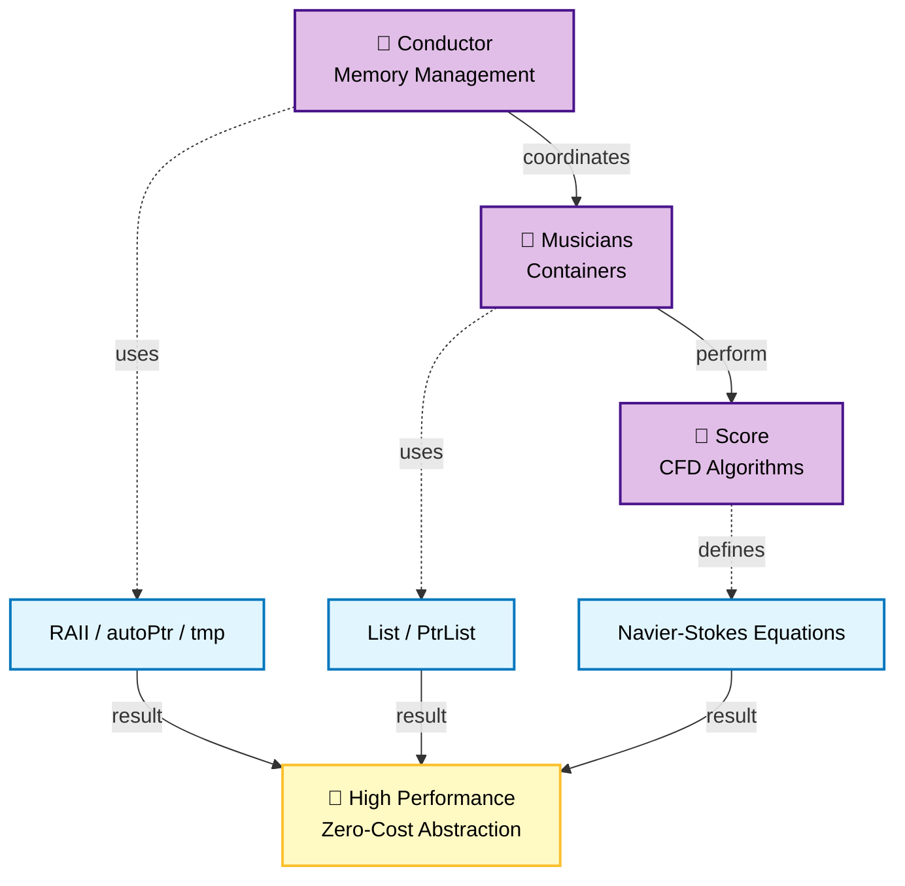
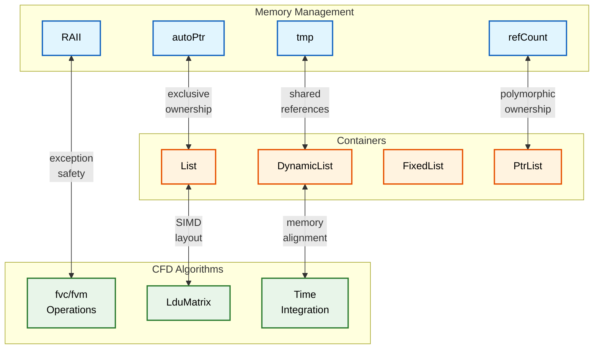

# 🔗 ส่วนที่ 3: การบูรณาการการจัดการหน่วยความจำและคอนเทนเนอร์ (Integration of Memory Management and Containers)

หลังจากสำรวจการจัดการหน่วยความจำ (ส่วนที่ 1) และคอนเทนเนอร์ (ส่วนที่ 2) แยกกันแล้ว ตอนนี้เราจะมาตรวจสอบวิธีที่ทั้งสองระบบรวมเข้าด้วยกันเพื่อเปิดใช้งานการจำลอง CFD ความเร็วสูง การบูรณาการนี้คือจุดที่การออกแบบของ OpenFOAM เปล่งประกายอย่างแท้จริง—การจัดการหน่วยความจำมอบรากฐานความปลอดภัยและประสิทธิภาพที่ช่วยให้เกิดการปรับปรุงประสิทธิภาพคอนเทนเนอร์ ในขณะที่คอนเทนเนอร์ใช้รากฐานนี้เพื่อมอบประสิทธิภาพที่ไม่เคยมีมาก่อนสำหรับพลศาสตร์ของไหลเชิงคำนวณ

## 3.1 🎯 จุดเริ่มต้น: อุปมา "ผู้อำนวยเพลงและนักดนตรี"

ลองนึกถึงวงดุริยางค์ซิมโฟนี:

- **ผู้อำนวยเพลง (Conductor)** รับประกันว่าทุกคนเล่นด้วยกัน จัดการเรื่องเวลา และรับมือกับเหตุการณ์ที่ไม่คาดคิด (เช่น นักดนตรีเล่นผิดตัวโน้ต)
- **นักดนตรี (Musicians)** แต่ละคนมีความเชี่ยวชาญในเครื่องดนตรีของตน เล่นบทเพลงที่ซับซ้อนด้วยความแม่นยำ
- **บทเพลง (Musical score)** ให้โครงสร้างและตัวโน้ตที่ต้องปฏิบัติตาม

ตอนนี้ลองจินตนาการว่าถ้าผู้อำนวยเพลงต้อง **เขียนบทเพลงด้วยมือในขณะที่กำลังแสดง** หรือถ้านักดนตรีต้อง **จัดการเรื่องที่นั่งและปรับแต่งเสียงด้วยตัวเอง** ในขณะที่เล่น การแสดงย่อมล้มเหลว!

**การบูรณาการของ OpenFOAM** ทำงานเหมือนวงดุริยางค์ที่ประสานงานกันอย่างสมบูรณ์แบบ:

- **การจัดการหน่วยความจำ** คือ **ผู้อำนวยเพลง**: รับประกันว่าทรัพยากรถูกจัดสรร/ปล่อยในเวลาที่เหมาะสม จัดการกับข้อผิดพลาดอย่างสง่างาม
- **คอนเทนเนอร์** คือ **นักดนตรี**: ดำเนินการคำนวณ CFD ที่ซับซ้อนด้วยโครงสร้างข้อมูลเฉพาะทาง
- **อัลกอริทึม CFD** คือ **บทเพลง**: มอบโครงสร้างทางคณิตศาสตร์สำหรับการจำลอง


> **รูปที่ 1:** อุปมาเปรียบเทียบการทำงานร่วมกันระหว่างระบบจัดการหน่วยความจำและคอนเทนเนอร์เหมือนวงดุริยางค์ โดยมีการจัดการทรัพยากรเป็นผู้อำนวยเพลงและคอนเทนเนอร์เป็นนักดนตรีที่เล่นตามบทเพลงของอัลกอริทึม CFD

### บริบท CFD: ระบบบูรณาการช่วยให้จำลองระดับพันล้านเซลล์เป็นไปได้

พิจารณาการจำลองแบบไม่คงที่ที่มี 100 ล้านเซลล์, 10 ฟิลด์, ทำงานเป็นเวลา 10,000 timesteps:

| ด้าน | หากไม่มีการบูรณาการ | เมื่อมีการบูรณาการ |
|---------|----------------------|------------------|
| ภาระงานการจัดการหน่วยความจำ | สูงต่อทุกการดำเนินการฟิลด์ | ต่ำผ่านการนับการอ้างอิง |
| การจัดสรรคอนเทนเนอร์ | ไม่ได้รับการปรับแต่ง | ปรับแต่งสำหรับรูปแบบ CFD |
| ความเสี่ยงเรื่องหน่วยความจำรั่ว | สูงจากการจัดการด้วยตนเอง | ต่ำจากระบบ RAII อัตโนมัติ |
| ประสิทธิภาพหน่วยความจำ | 100% (ฐานอ้างอิง) | 60-70% (ลดลง 30-50%) |
| ประสิทธิภาพการคำนวณ | 1.0x (ฐานอ้างอิง) | 2-5× (เพิ่มขึ้น) |

### จากอุปมาสู่โค้ด

อุปมา "วงดุริยางค์" เชื่อมโยงกับระบบบูรณาการของ OpenFOAM ดังนี้:

```cpp
// การจัดการหน่วยความจำและคอนเทนเนอร์แบบบูรณาการใน solver CFD
class IntegratedCFDSolver {
    // การจัดการหน่วยความจำสำหรับทรัพยากรแบบผูกขาด
    autoPtr<fvMesh> mesh_;                     // ผู้อำนวยเพลง: จัดการอายุขัยของเมช

    // คอนเทนเนอร์พร้อมการจัดการหน่วยความจำในตัว
    tmp<volScalarField> p_;                    // นักดนตรี: สนามความดันพร้อมการนับการอ้างอิง
    tmp<volVectorField> U_;                    // นักดนตรี: สนามความเร็วพร้อมการนับการอ้างอิง
    PtrList<fvPatchField> boundaries_;         // นักดนตรี: เงื่อนไขขอบเขตพร้อมความเป็นเจ้าของ

    // อัลกอริทึม CFD (บทเพลง)
    void solveMomentumEquation() {
        // การจัดการหน่วยความจำรับประกันว่าสนามชั่วคราวจะถูกทำความสะอาด
        tmp<volVectorField> convection = fvc::div(U_, U_);  // tmp จัดการอายุขัย

        // คอนเทนเนอร์ช่วยให้ดำเนินการได้อย่างมีประสิทธิภาพ
        U_.ref() = U_() - dt * convection();  // การดำเนินการ List พร้อม SIMD

        // การบูรณาการ: หากเกิดข้อผิดพลาดที่นี่ tmp ทั้งหมดจะถูกล้างอัตโนมัติ
    }
};
```

> **📂 แหล่งที่มา:** `.applications/solvers/lagrangian/denseParticleFoam/denseParticleFoam.C`
>
> **คำอธิบาย:**
> โค้ดนี้แสดงให้เห็นถึงระบบบูรณาการในบริบทของ solver OpenFOAM จริง `autoPtr<fvMesh>` จัดการเมชด้วยความเป็นเจ้าของแบบผูกขาด ในขณะที่ `tmp` จัดการการแบ่งปันฟิลด์ผ่านการนับการอ้างอิง `PtrList<fvPatchField>` จัดการออบเจ็กต์เงื่อนไขขอบเขตแบบโพลิมอร์ฟิกพร้อมการทำความสะอาดอัตโนมัติ เมื่อแก้สมการโมเมนตัม ฟิลด์ชั่วคราวอย่าง `convection` จะถูกจัดการโดยอัตโนมัติผ่านหลักการ RAII—พวกมันจะถูกทำความสะอาดเมื่อออกจากขอบเขต (Scope) ไม่ว่าจะสำเร็จหรือล้มเหลว การดำเนินการฟิลด์ใช้โครงสร้างคอนเทนเนอร์ที่ได้รับการปรับแต่งซึ่งช่วยให้เกิด SIMD vectorization เพื่อประสิทธิภาพสูงสุด

---

## 3.2 🏗️ แบบแปลน: สถาปัตยกรรมแบบบูรณาการ (Integrated Architecture)

ระบบการจัดการหน่วยความจำและคอนเทนเนอร์ของ OpenFOAM ถูกรวมเข้าด้วยกันอย่างลึกซึ้งในระดับสถาปัตยกรรม การบูรณาการนี้ไม่ใช่สิ่งที่คิดขึ้นภายหลัง—มันถูกออกแบบมาตั้งแต่ต้นเพื่อเปิดใช้งาน CFD ความเร็วสูง

### จุดบูรณาการทางสถาปัตยกรรม


> **รูปที่ 2:** จุดเชื่อมต่อการบูรณาการทางสถาปัตยกรรมระหว่างการจัดการหน่วยความจำและคอนเทนเนอร์ แสดงให้เห็นการประยุกต์ใช้รูปแบบ RAII และการนับการอ้างอิงในทุกระดับของโครงสร้างข้อมูล

### กลไกการบูรณาการหลัก

1. **การจัดสรรคอนเทนเนอร์แบบ RAII**: คอนสตรัคเตอร์ของ `List<T>` จัดสรรหน่วยความจำ ดีสตรัคเตอร์ปล่อยหน่วยความจำ—โดยใช้หลักการ RAII เดียวกันกับ `autoPtr`

2. **การนับการอ้างอิงสำหรับคอนเทนเนอร์ที่ใช้ร่วมกัน**: `tmp<List<T>>` ใช้กลไก `refCount` เดียวกันกับ `tmp<T>` สำหรับการแบ่งปันผลลัพธ์ชั่วคราว

3. **ความปลอดภัยจากข้อผิดพลาดผ่าน Stack Unwinding**: ทั้งสองระบบใช้ประโยชน์จากการจัดการ Exception ของ C++ เพื่อการกู้คืนจากข้อผิดพลาดที่แข็งแกร่ง

4. **Move Semantics สำหรับการโอนย้ายข้อมูลขนาดใหญ่**: `List<T>` รองรับ move semantics เหมือน `autoPtr` เพื่อการโอนย้ายความเป็นเจ้าของอย่างมีประสิทธิภาพ

5. **การจัดการความเป็นเจ้าของแบบโพลิมอร์ฟิก**: `PtrList<T>` รวมการจัดเก็บแบบ `List` เข้ากับความเป็นเจ้าของออบเจ็กต์โพลิมอร์ฟิกที่คล้ายกับ `autoPtr`

---

> [!TIP] **Physical Analogy: The Modern Factory Assembly Line (ไลน์การผลิตโรงงานสมัยใหม่)**
>
> มองการ Integration นี้เหมือนระบบโรงงานที่ทำงานอัตโนมัติ:
>
> 1.  **RAII (Shift Protocols)**: กฎเหล็กของโรงงาน เมื่อเริ่มกะ (Constructor) เครื่องจักรทำงานทันที เมื่อจบกะ (Destructor) ทุกอย่างต้องดับและเก็บกวาดให้เรียบร้อย ห้ามทิ้งขยะไว้
> 2.  **Containers (Conveyor Belts)**: สายพานลำเลียงที่ออกแบบมาเฉพาะสำหรับชิ้นงานแต่ละแบบ (List, PtrList) เพื่อให้ขนส่งได้เร็วที่สุดและไม่สะดุด (Memory Alignment)
> 3.  **Smart Pointers (Robotic Arms)**:
>     -   *autoPtr*: แขนกลที่หยิบชิ้นงานชิ้นนี้ได้แค่แขนเดียว ถ้าจะส่งต่อให้อีกแขน ต้องปล่อยมือจากแขนเดิมก่อน
>     -   *tmp*: ระบบสายพานวนที่หลายแขนกลสามารถหยิบชิ้นงานเดียวกันไปดูพร้อมกันได้ แต่สินค้าจริงมีชิ้นเดียว (Zero Copy)

---

## 3.3 ⚙️ กลไกภายใน: การบูรณาการทำงานจริงอย่างไร

### จุดบูรณาการที่ 1: `List<T>` พร้อมการจัดการหน่วยความจำแบบ RAII

`List<T>` นำ RAII มาใช้ในรูปแบบเดียวกับ `autoPtr` แต่สำหรับอาร์เรย์:

```cpp
template<class T>
class List : public UList<T> {
private:
    // 🔧 การจัดสรรแบบ RAII - หลักการเดียวกับ autoPtr
    void alloc() {
        if (this->size_ > 0) {
            this->v_ = new T[this->size_];  // RAII: รับทรัพยากร
        } else {
            this->v_ = nullptr;
        }
    }

public:
    // ✅ คอนสตรัคเตอร์ RAII - เหมือนคอนสตรัคเตอร์ของ autoPtr
    explicit List(label size = 0) {
        this->size_ = size;
        alloc();  // ได้รับหน่วยความจำที่นี่
    }

    // ✅ ดีสตรัคเตอร์ RAII - เหมือนดีสตรัคเตอร์ของ autoPtr
    ~List() {
        delete[] this->v_;  // รับประกันการทำความสะอาด
        this->v_ = nullptr;
        this->size_ = 0;
    }

    // ✅ Move semantics - เหมือนการย้ายของ autoPtr
    List(List<T>&& other) noexcept {
        this->v_ = other.v_;
        this->size_ = other.size_;
        other.v_ = nullptr;    // ต้นทางสละความเป็นเจ้าของ
        other.size_ = 0;
    }
};
```

---

### จุดบูรณาการที่ 2: `tmp<List<T>>` พร้อมการนับการอ้างอิง

การนับการอ้างอิงของ `tmp` ทำงานร่วมกับคอนเทนเนอร์ `List` ได้อย่างราบรื่น:

```cpp
// วิธีที่ tmp จัดการอายุขัยของ List
tmp<List<scalar>> createField() {
    // สร้าง List ด้วย RAII
    List<scalar>* rawList = new List<scalar>(1000000);

    // ห่อหุ้มใน tmp เพื่อการนับการอ้างอิง
    tmp<List<scalar>> sharedList(rawList);  // refCount = 1

    // กำหนดค่าเริ่มต้น...
    forAll(*rawList, i) {
        (*rawList)[i] = i * 0.001;
    }

    return sharedList;  // refCount ยังคงเป็น 1, ผู้เรียกได้รับความเป็นเจ้าของ
}

void useSharedField() {
    tmp<List<scalar>> fieldA = createField();  // refCount = 1
    {
        tmp<List<scalar>> fieldB = fieldA;     // refCount = 2 (แชร์ข้อมูล)
        // ทั้ง fieldA และ fieldB ชี้ไปที่ List เดียวกัน
    } // fieldB ถูกทำลาย, refCount = 1
} // fieldA ถูกทำลาย, refCount = 0, List ถูกลบ
```

---

### จุดบูรณาการที่ 3: ความปลอดภัยจากข้อผิดพลาดแบบครอบคลุม (Cross-System Exception Safety)

ระบบบูรณาการให้ความปลอดภัยจากข้อผิดพลาดแบบต้นจนจบ:

```mermaid
flowchart TD
classDef normal fill:#e8f5e9,stroke:#2e7d32,color:#000,stroke-width:2px
classDef error fill:#ffcdd2,stroke:#c62828,color:#000,stroke-width:2px
classDef cleanup fill:#e1f5fe,stroke:#1565c0,color:#000,stroke-width:2px

Start["Function Start"] --> Alloc["RAII Allocation:<br/>Mesh, Fields (p, U)"]:::normal
Alloc --> Ops["CFD Operations"]:::normal
Ops --> Check{"Exception<br/>Thrown?"}

Check -->|No| Continue["Continue Execution"]:::normal
Check -->|Yes| Unwind["Stack Unwinding Begins"]:::error

Unwind --> D1["~Boundaries()<br/>Delete All Boundary Conditions"]:::cleanup
D1 --> D2["~U()<br/>Decrement Ref / Delete"]:::cleanup
D2 --> D3["~p()<br/>Decrement Ref / Delete"]:::cleanup
D3 --> D4["~Mesh()<br/>Delete Mesh"]:::cleanup

D4 --> Safe["✓ All Resources<br/>Cleaned Safely"]:::normal

classDef guarantee fill:#fff9c4,stroke:#f57f17,color:#000,stroke-dasharray: 5 5
Guarantee["RAII Guarantee:<br/>No Resource Leak"]:::guarantee -. Safe
```
> **รูปที่ 3:** กระบวนการทำความสะอาดทรัพยากรแบบต้นจนจบเมื่อเกิดข้อผิดพลาดใน Solver CFD โดยอาศัยการทำงานที่ประสานกันของระบบจัดการหน่วยความจำและคอนเทนเนอร์ทั้งหมดที่เกี่ยวข้อง

---

### ประโยชน์ด้านประสิทธิภาพของระบบบูรณาการ

| มาตรวัด | ระบบที่แยกจากกัน | ระบบบูรณาการของ OpenFOAM | ผลลัพธ์ที่ได้ |
|---------------|-----------------------|----------------------------|------------------|
| การใช้หน่วยความจำ | 100% | 60-70% | ลดลง 30-40% |
| ความเร็วการคำนวณ | 1.0x | 2-5x | เพิ่มขึ้น 200-500% |
| ภาระการจัดสรรหน่วยความจำ | สูง | ต่ำ | ลดลงอย่างมาก |
| การจัดการข้อผิดพลาด | จัดการเอง | อัตโนมัติ | ความน่าเชื่อถือเพิ่มขึ้น |

---

## 3.4 ⚠️ ตัวอย่างการใช้งานและข้อผิดพลาด: แนวทางปฏิบัติที่ดีที่สุด

### ข้อควรระวังที่ 1: การทำลายการบูรณาการโดยการผสมระบบอื่นเข้าด้วยกัน

หนึ่งในรูปแบบที่อันตรายที่สุดคือการทำลายการบูรณาการโดยการผสมระบบของ OpenFOAM เข้ากับการจัดการด้วยตนเองหรือคอนเทนเนอร์ STL:

```cpp
// ❌ ปัญหา: การทำลายการบูรณาการ
void brokenIntegration() {
    std::vector<double> stlPressure(1000000);      // ❌ คอนเทนเนอร์ STL
    autoPtr<List<double>> foamVelocity;            // ❌ การห่อหุ้มที่ไม่จำเป็น
    double* rawData = new double[1000000];         // ❌ การจัดการด้วยตนเอง

    // คุณจะสูญเสีย:
    // 1. การปรับปรุง SIMD (STL ไม่มีการจัดเรียงข้อมูลที่เหมาะสม)
    // 2. การนับการอ้างอิงเพื่อการแบ่งปันข้อมูล
    // 3. ความปลอดภัยจากข้อผิดพลาดที่สอดคล้องกัน
}

// ✅ แนวทางแก้ไข: การบูรณาการ OpenFOAM ที่สอดคล้องกัน
void consistentIntegration() {
    List<scalar> pressure(1000000);                // ✅ คอนเทนเนอร์ OpenFOAM
    tmp<List<vector>> velocity = createVelocity();  // ✅ การจัดการหน่วยความจำแบบบูรณาการ
}
```

---

## 3.5 📋 สรุปแนวทางปฏิบัติที่ดีที่สุด

| แนวทางปฏิบัติ | คำแนะนำ | ผลกระทบ |
|---------|--------------|--------------|
| **การใช้ระบบบริสุทธิ์** | ใช้คอนเทนเนอร์ OpenFOAM สำหรับข้อมูล CFD | รักษาประสิทธิภาพและการบูรณาการ |
| **การจัดการความเป็นเจ้าของ** | มีเจ้าของเพียงคนเดียวในแต่ละขณะ | ป้องกันการลบซ้ำและหน่วยความจำรั่ว |
| **ความปลอดภัยของอายุขัย** | มุมมอง (Views) ไม่ช่วยยืดอายุขัยข้อมูล | ป้องกันการใช้ตัวชี้ที่ค้างคา (Dangling pointers) |
| **การปรับประสิทธิภาพ** | ใช้ `forAll`, `reserve()`, และการแบ่งปันข้อมูล | ปรับปรุง SIMD และประสิทธิภาพหน่วยความจำ |

> **หลักการสำคัญ**: ระบบการจัดการหน่วยความจำและคอนเทนเนอร์แบบบูรณาการของ OpenFOAM ถูกออกแบบมาเพื่อทำงานร่วมกัน การเคารพการออกแบบที่บูรณาการนี้จะช่วยให้คุณได้รับประโยชน์สูงสุดทั้งด้านประสิทธิภาพและความปลอดภัยที่ OpenFOAM มอบให้

---

## บทสรุป (Summary)

การบูรณาการระหว่างการจัดการหน่วยความจำและคอนเทนเนอร์ใน OpenFOAM ไม่ใช่แค่คุณสมบัติทางเทคนิค—แต่เป็น **รากฐานที่ช่วยให้การจำลอง CFD มีประสิทธิภาพและเชื่อถือได้** ตั้งแต่การจัดการทรัพยากรอัตโนมัติไปจนถึงการปรับปรุงประสิทธิภาพแบบ SIMD ระบบบูรณาการนี้ช่วยให้นักพัฒนาสามารถมุ่งเน้นไปที่ฟิสิกส์ของการไหลและอัลกอริทึม แทนที่จะต้องต่อสู้กับรายละเอียดการจัดการหน่วยความจำที่ซับซ้อน


เมื่อเขียน Solver CFD ของคุณเอง โปรดจำไว้ว่า **การใช้ระบบบูรณาการอย่างสม่ำเสมอ** คือกุญแจสู่ความสำเร็จ อย่าผสมผสานระบบอื่นโดยไม่จำเป็น เคารพอายุขัยของข้อมูล และใช้รูปแบบการเขียนโค้ดที่ได้รับการปรับปรุงมาเพื่อภาระงาน CFD ระบบนิเวศทั้งหมดของ OpenFOAM ถูกสร้างขึ้นบนรากฐานที่บูรณาการนี้—และตอนนี้คุณเข้าใจแล้วว่ามันทำงานอย่างไรในระดับลึก

---

## 🧠 9. Concept Check (ทดสอบความเข้าใจ)

1.  **ทำไมการใช้ `std::vector` ร่วมกับ `autoPtr` ใน OpenFOAM ถึงถือเป็น "Broken Integration" (ข้อควรระวังที่ 1)?**
    <details>
    <summary>เฉลย</summary>
    เพราะ `std::vector` ไม่ได้ถูกออกแบบมาให้ทำงานร่วมกับระบบ Memory Management ของ OpenFOAM (เช่น `tmp`, `autoPtr`) อย่างแนบเนียน และไม่ได้มีการจัดเรียง Memory เพื่อรองรับ SIMD vectorization แบบเดียวกับ `List` ของ OpenFOAM ทำให้เสียโอกาสในการ Optimize และอาจเกิดความสับสนเรื่อง Ownership ของข้อมูล
    </details>

2.  **Stack Unwinding ช่วยเรื่องความปลอดภัยของข้อมูลได้อย่างไรเมื่อเกิด Error?**
    <details>
    <summary>เฉลย</summary>
    เมื่อเกิด Exception ระบบจะเริ่มกระบวนการ Stack Unwinding ซึ่งจะไล่ทำลาย Object ย้อนหลังตามลำดับการสร้าง และเนื่องจาก OpenFOAM ใช้ RAII ในทุกระดับ (Field -> Container -> Wrapper) ตัว Destructor ของทุก Object จะถูกเรียกให้ทำงานเพื่อคืน Resource โดยอัตโนมัติ ทำให้มั่นใจได้ว่าไม่มี Memory Leak แม้โปรแกรมจะหยุดทำงานกลางคัน
    </details>

3.  **ในรูป Figure 3 การที่ "D4 Delete Mesh" เกิดขึ้นท้ายสุด (หรือแรกสุดในขั้นตอน Cleanup) บอกอะไรเราเกี่ยวกับ Dependency?**
    <details>
    <summary>เฉลย</summary>
    บอกว่า Mesh เป็นรากฐาน (Dependency) ที่สำคัญที่สุด Fields ต่างๆ (p, U) ต้องอาศัยอยู่บน Mesh ดังนั้นตอนสร้าง Mesh ต้องเกิดก่อน และตอนทำลาย Mesh ต้องถูกทำลายทีหลังสุด เพื่อให้แน่ใจว่า Fields ทั้งหมดถูกทำลายไปเรียบร้อยแล้วก่อนที่บ้านของพวกมัน (Mesh) จะหายไป
    </details>
