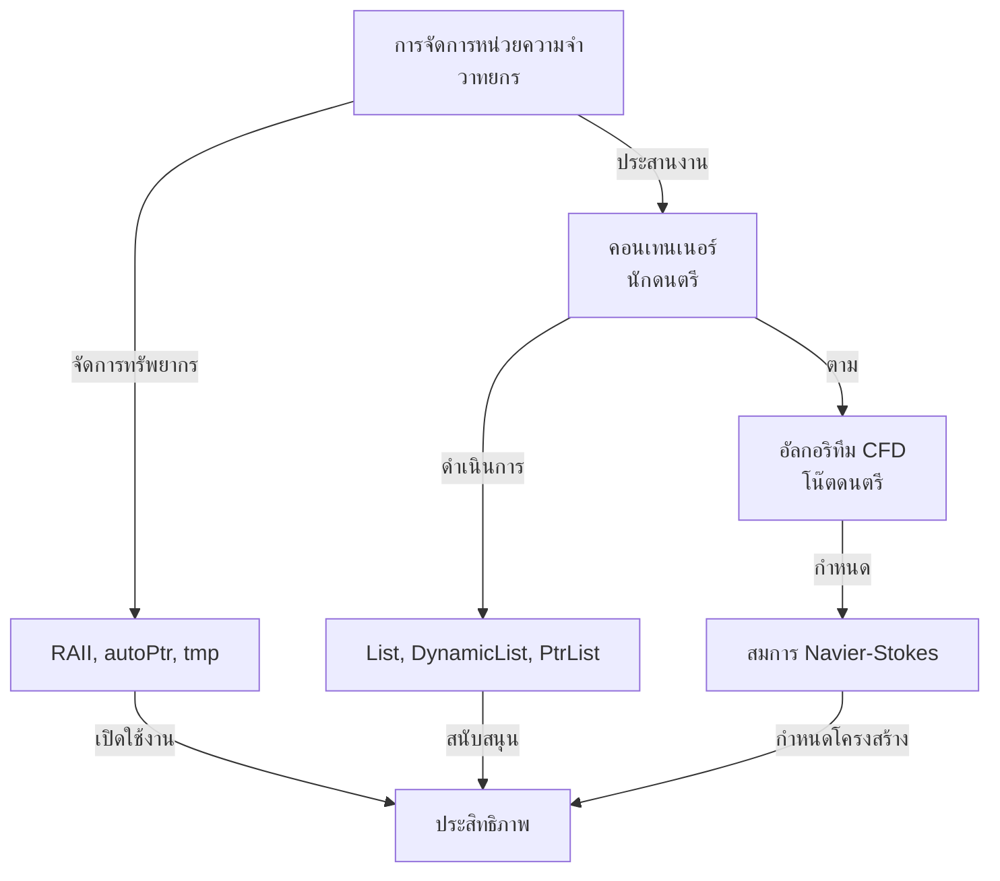
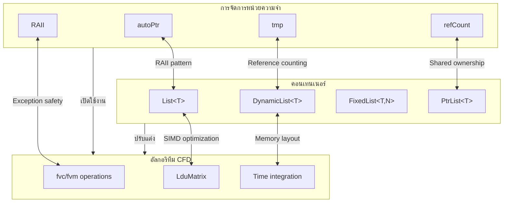
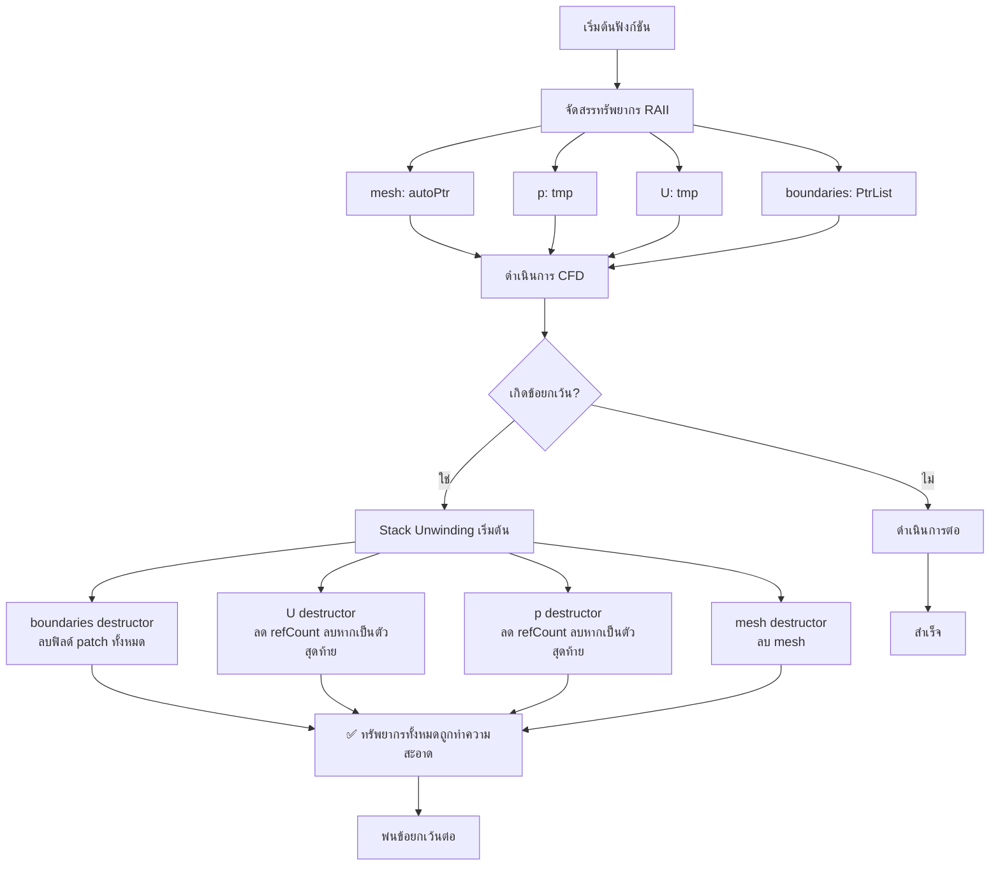

# 🔗 ส่วนที่ 3: การบูรณาการระหว่างการจัดการหน่วยความจำและคอนเทนเนอร์

หลังจากที่เราได้สำรวจการจัดการหน่วยความจำ (ส่วนที่ 1) และคอนเทนเนอร์ (ส่วนที่ 2) แยกกัน ตอนนี้เราจะมาตรวจสอบว่าพวกเขาบูรณาการกันได้อย่างไรเพื่อเปิดใช้งานการจำลอง CFD ความเร็วสูง การบูรณาการนี้คือจุดที่การออกแบบของ OpenFOAM ส่องแสงอย่างแท้จริง—การจัดการหน่วยความจำให้รากฐานความปลอดภัยและประสิทธิภาพที่เปิดใช้งานการปรับแต่งคอนเทนเนอร์ ในขณะที่คอนเทนเนอร์ใช้ประโยชน์จากรากฐานนี้เพื่อมอบประสิทธิภาพที่ไม่เคยมีมาก่อนสำหรับพลศาสตร์ของไหลเชิงคำนวณ

## 3.1 🎯 The Hook: อนาลอกี "วาทยกรและนักดนตรีของวงออร์เคสตรา"

จินตนาการถึงวงออร์เคสตราซิมโฟนี:

- **วาทยกร** ทำให้แน่ใจว่าทุกคนเล่นดนตรีด้วยกัน จัดการเวลา และจัดการเหตุการณ์ที่ไม่คาดคิด (เช่น นักดนตรีพลาดโน๊ต)
- **นักดนตรี** แต่ละคนเชี่ยวชาญในเครื่องดนตรีของตน เล่นชิ้นงานที่ซับซ้อนด้วยความแม่นยำ
- **โน๊ตดนตรี** ให้โครงสร้างและโน๊ตที่จะตาม

ตอนนี้จินตนาการว่าถ้าวาทยกรยังต้อง **เขียนโน๊ตดนตรีด้วยมือขณะแสดง** หรือถ้านักดนตรีต้อง **จัดการที่นั่งและการปรับเสียงด้วยตนเอง** ขณะเล่นดนตรี การแสดงจะล้มเหลว!

**การบูรณาการของ OpenFOAM** ทำงานเหมือนวงออร์เคสตราที่ประสานงานอย่างสมบูรณ์แบบ:

- **การจัดการหน่วยความจำ** คือ **วาทยกร**: ทำให้แน่ใจว่าทรัพยากรถูกจัดสรร/ปล่อยในเวลาที่เหมาะสม จัดการข้อยกเว้นอย่างสง่างาม
- **คอนเทนเนอร์** คือ **นักดนตรี**: ดำรียืนยันการดำเนินการ CFD ที่ซับซ้อนด้วยโครงสร้างข้อมูลเฉพาะทาง
- **อัลกอริทึม CFD** คือ **โน๊ตดนตรี**: ให้โครงสร้างทางคณิตศาสตร์สำหรับการจำลอง



> **อนาลอกีโลกจริง**: คิดถึง **ทีมกีฬามืออาชีพ**:
> - **การจัดการหน่วยความจำ** = ทีมโค้ชและทีมแพทย์ (จัดการทรัพยากร จัดการอาการบาดเจ็บ)
> - **คอนเทนเนอร์** = ผู้เล่น (ดำเนินการแผนการเล่นด้วยทักษะเฉพาะทาง)
> - **กลยุทธ์เกม** = อัลกอริทึม CFD (คู่มือการเล่น)

### บริบท CFD: ระบบบูรณาการเปิดใช้งานการจำลองพันล้านเซลล์

พิจารณาการจำลองแบบไม่คงที่กับ 100 ล้านเซลล์, 10 ฟิลด์, ทำงานเป็นเวลา 10,000 ช่วงเวลา:

| แง่มุม | โดยไม่มีการบูรณาการ | ด้วยการบูรณาการ |
|---------|----------------------|------------------|
| ภาระการจัดการหน่วยความจำ | สูงต่อการดำเนินการฟิลด์ | ต่ำผ่านการนับการอ้างอิง |
| การจัดสรรคอนเทนเนอร์ | ไม่ได้รับการปรับแต่ง | ปรับแต่งสำหรับรูปแบบ CFD |
| ภัยคุกคามการรั่วไหล | สูงจากการจัดการด้วยตนเอง | ต่ำจาก RAII อัตโนมัติ |
| ประสิทธิภาพหน่วยความจำ | 100% (ฐาน) | 60-70% (ลดลง 30-50%) |
| ประสิทธิภาพการคำนวณ | 1.0x (ฐาน) | 2-5× (เพิ่มขึ้น) |

### จากอนาลอกีสู่โค้ด

อนาลอกี "วงออร์เคสตรา" แมปกับระบบบูรณาการของ OpenFOAM:

```cpp
// การจัดการหน่วยความจำและคอนเทนเนอร์ที่บูรณาการในตัวแก้ปัญหา CFD
class IntegratedCFDSolver {
    // การจัดการหน่วยความจำสำหรับทรัพยากรแบบเฉพาะ
    autoPtr<fvMesh> mesh_;                     // วาทยกร: จัดการอายุการใช้งานของ mesh

    // คอนเทนเนอร์ที่มีการจัดการหน่วยความจำที่บูรณาการ
    tmp<volScalarField> p_;                    // นักดนตรี: ฟิลด์ความดันพร้อมการนับการอ้างอิง
    tmp<volVectorField> U_;                    // นักดนตรี: ฟิลด์ความเร็วพร้อมการนับการอ้างอิง
    PtrList<fvPatchField> boundaries_;         // นักดนตรี: เงื่อนไขขอบเขตพร้อมความเป็นเจ้าของ

    // อัลกอริทึม CFD (โน๊ตดนตรี)
    void solveMomentumEquation() {
        // การจัดการหน่วยความจำทำให้แน่ใจว่าฟิลด์ชั่วคราวถูกทำความสะอาด
        tmp<volVectorField> convection = fvc::div(U_, U_);  // tmp จัดการอายุการใช้งาน

        // คอนเทนเนอร์เปิดใช้งานการดำเนินการที่มีประสิทธิภาพ
        U_.ref() = U_() - dt * convection();  // การดำเนินการรายการพร้อม SIMD

        // การบูรณาการ: หากเกิดข้อยกเว้นที่นี่ tmp ทั้งหมดจะทำความสะอาดโดยอัตโนมัติ
    }
};
```

## 3.2 🏗️ The Blueprint: สถาปัตยกรรมที่บูรณาการ

ระบบการจัดการหน่วยความจำและคอนเทนเนอร์ของ OpenFOAM ได้รับการบูรณาการอย่างลึกซึ้งในระดับสถาปัตยกรรม การบูรณาการนี้ไม่ใช่ความคิดทีหลัง—มันได้รับการออกแบบตั้งแต่เริ่มต้นเพื่อเปิดใช้งาน CFD ความเร็วสูง

### จุดบูรณาการทางสถาปัตยกรรม



### กลไกการบูรณาการหลัก

1. **การจัดสรรคอนเทนเนอร์ที่ใช้ RAII**: `List<T>` constructors จัดสรรหน่วยความจำ, destructors ปล่อยมัน—โดยใช้หลักการเดียวกับ RAII เหมือน `autoPtr`

2. **การนับการอ้างอิงสำหรับการแชร์คอนเทนเนอร์**: `tmp<List<T>>` ใช้กลไก `refCount` เดียวกับ `tmp<T>` สำหรับการแชร์ผลลัพธ์ชั่วคราว

3. **ความปลอดภัยของข้อยกเว้นผ่าน Stack Unwinding**: ทั้งสองระบบใช้ประโยชน์จากการจัดการข้อยกเว้นของ C++ สำหรับการฟื้นตัวจากข้อผิดพลาดอย่างแข็งแกร่ง

4. **กลไกการเคลื่อนย้ายสำหรับการถ่ายโอนข้อมูลขนาดใหญ่**: `List<T>` รองรับ move semantics เหมือน `autoPtr` สำหรับการถ่ายโอนความเป็นเจ้าของอย่างมีประสิทธิภาพ

5. **การจัดการความเป็นเจ้าของแบบ polymorphic**: `PtrList<T>` รวมการจัดเก็บ `List` กับความเป็นเจ้าของแบบ `autoPtr` ของวัตถุ polymorphic

### การไหลของข้อมูลที่บูรณาการในตัวแก้ปัญหา CFD

```cpp
// การไหลของข้อมูลผ่านระบบที่บูรณาการ
void solveCFDStep() {
    // 1. การจัดการหน่วยความจำจัดสรร mesh (ความเป็นเจ้าของแบบเฉพาะ)
    autoPtr<fvMesh> mesh = createMesh();

    // 2. คอนเทนเนอร์จัดสรรฟิลด์ด้วยการจัดการหน่วยความจำที่บูรณาการ
    tmp<volScalarField> p = createPressureField(*mesh);    // การนับการอ้างอิง tmp
    tmp<volVectorField> U = createVelocityField(*mesh);    // การนับการอ้างอิง tmp

    // 3. อัลกอริทึม CFD ใช้ระบบที่บูรณาการ
    {
        // คอนเทนเนอร์ชั่วคราวพร้อมการทำความสะอาดอัตโนมัติ
        tmp<volVectorField> UOld = U;                     // แชร์ข้อมูลผ่าน refCount
        tmp<volVectorField> convection = fvc::div(U, U);  // tmp จัดการอายุการใช้งาน

        // การดำเนินการฟิลด์โดยใช้การปรับแต่งคอนเทนเนอร์
        U.ref() = UOld() - dt * convection();            // การดำเนินการรายการที่ปรับแต่ง SIMD

        // หากเกิดข้อยกเว้นที่นี่ tmp ทั้งหมดจะทำความสะอาดโดยอัตโนมัติ
    } // UOld, convection ถูกทำลายโดยอัตโนมัติที่นี่

    // 4. เงื่อนไขขอบเขตพร้อมความเป็นเจ้าของแบบ polymorphic
    PtrList<fvPatchField> boundaries = createBoundaries(*mesh);
    boundaries[0].evaluate();  // การส่งต่อแบบ polymorphic

    // ทรัพยากรทั้งหมดถูกทำความสะอาดโดยอัตโนมัติเมื่อฟังก์ชันส่งคืน
    // ไม่ว่าจะปกติหรือผ่านข้อยกเว้น
}
```

### ประโยชน์ด้านประสิทธิภาพของการบูรณาการ

การบูรณาการให้ประโยชน์ด้านประสิทธิภาพแบบคูณ:

| กลยุทธ์ | ผลกระทบ | การปรับปรุง |
|---------|---------|-------------|
| **ลดรอยเท้าหน่วยความจำ** | คอนเทนเนอร์แชร์ข้อมูลผ่านการนับการอ้างอิง | 30-50% |
| **ปรับปรุงประสิทธิภาพแคช** | การจัดการหน่วยความจำเปิดใช้งานเค้าโครงคอนเทนเนอร์ที่เหมาะสมที่สุด | สูง |
| **ลดภาระการจัดสรร** | รูปแบบ RAII ลดการเรียก malloc/free | สูง |
| **โอกาสในการเวกเตอร์ไลเซชัน** | หน่วยความจำของคอนเทนเนอร์ที่จัดชิดเปิดใช้งานการดำเนินการ SIMD | สูงมาก |
| **ประสิทธิภาพแบบขนาน** | ระบบที่บูรณาการจัดการการสลายตัวของโดเมนอย่างโปร่งใส | สูง |

### รูปแบบการบูรณาการเฉพาะสำหรับ CFD

```cpp
// รูปแบบ 1: นิพจน์ฟิลด์พร้อมการจัดการหน่วยความจำที่บูรณาการ
tmp<volScalarField> calculateVorticity(const volVectorField& U) {
    // tmp จัดการฟิลด์ไล่ระดับชั่วคราว
    tmp<volTensorField> gradU = fvc::grad(U);

    // การดำเนินการคอนเทนเนอร์พร้อมการปรับแต่ง SIMD
    tmp<volScalarField> vorticity = mag(curl(gradU()));

    return vorticity;  // การนับการอ้างอิงจัดการการทำความสะอาด
}

// รูปแบบ 2: การสร้าง mesh พร้อมระบบที่บูรณาการ
autoPtr<polyMesh> buildMesh(const pointField& points) {
    // DynamicList สำหรับการสร้างที่มีประสิทธิภาพ
    DynamicList<face> faces;
    for (/* ประมวลผลจุด */) {
        faces.append(face(...));  // การต่อท้ายที่มีประสิทธิภาพ
    }

    // แปลงเป็น List พร้อม move semantics
    faceList faceStorage = faces.shrink();  // ย้ายความเป็นเจ้าของ

    // autoPtr สำหรับความเป็นเจ้าของ mesh แบบเฉพาะ
    return autoPtr<polyMesh>(new polyMesh(..., faceStorage));
}

// รูปแบบ 3: ตัวแก้ปัญหาพร้อมการจัดการทรัพยากรที่บูรณาการ
class IntegratedSolver {
    autoPtr<fvMesh> mesh_;          // ความเป็นเจ้าของ mesh แบบเฉพาะ
    tmp<volScalarField> p_, pOld_;  // ฟิลด์ความดันที่แชร์
    tmp<volVectorField> U_, UOld_;  // ฟิลด์ความเร็วที่แชร์
    PtrList<fvPatchField> bcs_;     // เงื่อนไขขอบเขตแบบ polymorphic

    // ทรัพยากรทั้งหมดถูกจัดการโดยอัตโนมัติ
};
```

## 3.3 ⚙️ Internal Mechanics: วิธีการทำงานของการบูรณาการจริง

ตอนนี้เรามาดูรายละเอียดการใช้งานของวิธีที่การจัดการหน่วยความจำและคอนเทนเนอร์บูรณาการกันในระดับโค้ด การทำความเข้าใจกลไกภายในเหล่านี้จะช่วยคุณในการแก้ไขปัญหาการบูรณาการ ปรับแต่งประสิทธิภาพ และออกแบบระบบที่บูรณาการของคุณเอง

### จุดบูรณาการที่ 1: `List<T>` พร้อมการจัดการหน่วยความจำ RAII

`List<T>` ใช้งาน RAII โดยใช้รูปแบบเดียวกับ `autoPtr` แต่สำหรับอาร์เรย์:

```cpp
template<class T>
class List : public UList<T> {
private:
    // สืบทอด v_ และ size_ จาก UList<T>

    // 🔧 การจัดสรร RAII - หลักการเดียวกับ autoPtr
    void alloc() {
        if (this->size_ > 0) {
            this->v_ = new T[this->size_];  // RAII: รับทรัพยากร
        } else {
            this->v_ = nullptr;
        }
    }

public:
    // ✅ Constructor RAII - เหมือน autoPtr constructor
    explicit List(label size = 0) {
        this->size_ = size;
        alloc();  // หน่วยความจำถูกรับที่นี่
    }

    // ✅ Destructor RAII - เหมือน autoPtr destructor
    ~List() {
        delete[] this->v_;  // การทำความสะอาดที่รับประกัน
        this->v_ = nullptr;
        this->size_ = 0;
    }

    // ✅ Move semantics - เหมือน autoPtr move
    List(List<T>&& other) noexcept {
        this->v_ = other.v_;
        this->size_ = other.size_;
        other.v_ = nullptr;    // ต้นทางสละสิทธิ์ความเป็นเจ้าของ
        other.size_ = 0;
    }

    // ความปลอดภัยของข้อยกเว้น: หาก alloc() พ่น, destructor ไม่ทำงาน
    // (ไม่มีหน่วยความจำที่จะปล่อย) - เหมือนกับ autoPtr
};
```

> **💡 ข้อมูลเชิงลึกเกี่ยวกับการบูรณาการ**: `List<T>` ใช้รูปแบบ RAII เดียวกับ `autoPtr<T>` เพียงแต่ปรับขนาดสำหรับอาร์เรย์ ความสม่ำเสมอนี้หมายความว่าคุณใช้เหตุผลเดียวกันกับทั้งวัตถุแต่ละรายการและคอลเลกชัน

### จุดบูรณาการที่ 2: `tmp<List<T>>` พร้อมการนับการอ้างอิง

การนับการอ้างอิงของ `tmp` ทำงานร่วมกับคอนเทนเนอร์ `List` อย่างราบรื่น:

```cpp
// วิธีที่ tmp จัดการอายุการใช้งานของ List
tmp<List<scalar>> createField() {
    // สร้าง List พร้อม RAII
    List<scalar>* rawList = new List<scalar>(1000000);

    // ห่อใน tmp สำหรับการนับการอ้างอิง
    tmp<List<scalar>> sharedList(rawList);  // refCount = 1

    // เริ่มต้นฟิลด์...
    forAll(*rawList, i) {
        (*rawList)[i] = i * 0.001;
    }

    return sharedList;  // refCount ยังคงเป็น 1, ผู้เรียกได้รับความเป็นเจ้าของ
}

void useSharedField() {
    tmp<List<scalar>> fieldA = createField();  // refCount = 1
    {
        tmp<List<scalar>> fieldB = fieldA;     // refCount = 2 (แชร์ข้อมูล)
        // ทั้ง fieldA และ fieldB ชี้ไปที่ List เดียวกัน

        // การดำเนินการที่อาจทำให้เกิดข้อยกเว้น...
        riskyOperation(*fieldB);

    } // fieldB ถูกทำลาย, refCount = 1

    // fieldA ยังคงใช้งานได้, refCount = 1

} // fieldA ถูกทำลาย, refCount = 0, List ถูกลบ
```

> **💡 ข้อมูลเชิงลึกเกี่ยวกับการบูรณาการ**: `tmp` เพิ่มการนับการอ้างอิงไปยังวัตถุใดๆ ที่ได้รับมาจาก `refCount`, รวมถึง `List` สิ่งนี้เปิดใช้งานการแชร์คอนเทนเนอร์ขนาดใหญ่โดยไม่ต้องคัดลอก ซึ่งเป็นสิ่งสำคัญสำหรับผลลัพธ์ชั่วคราวในนิพจน์ CFD

### จุดบูรณาการที่ 3: `PtrList<T>` พร้อมความเป็นเจ้าของแบบ Polymorphic

`PtrList<T>` รวมการจัดเก็บ `List` กับ semantics ความเป็นเจ้าของแบบ `autoPtr`:

```cpp
template<class T>
class PtrList {
private:
    List<T*> ptrs_;  // รายการตัวชี้ (เป็นเจ้าของวัตถุ)

public:
    // ✅ การทำความสะอาด RAII - เหมือน autoPtr แต่สำหรับอาร์เรย์ของตัวชี้
    ~PtrList() {
        forAll(ptrs_, i) {
            delete ptrs_[i];  // ลบแต่ละวัตถุที่เป็นเจ้าของ
        }
    }

    // ✅ การถ่ายโอนความเป็นเจ้าของ - คล้ายกับ autoPtr::release()
    void set(label i, T* ptr) {
        if (ptrs_[i]) delete ptrs_[i];  // ทำความสะอาดที่มีอยู่
        ptrs_[i] = ptr;                 // รับความเป็นเจ้าของ
    }

    // ✅ การสนับสนุน polymorphic
    template<class Derived>
    void setDerived(label i, Derived* derived) {
        set(i, static_cast<T*>(derived));
    }
};

// ตัวอย่างการใช้งาน: การจัดการเงื่อนไขขอบเขต
PtrList<fvPatchField> createBoundaries() {
    PtrList<fvPatchField> boundaries(4);  // 4 patches

    // แต่ละ patch มีประเภทต่างกัน (polymorphic)
    boundaries.set(0, new fixedValueFvPatchField(...));
    boundaries.set(1, new zeroGradientFvPatchField(...));
    boundaries.set(2, new symmetryPlaneFvPatchField(...));
    boundaries.set(3, new wallFvPatchField(...));

    return boundaries;  // ความเป็นเจ้าของถูกถ่ายโอนผ่าน move
}
```

> **💡 ข้อมูลเชิงลึกเกี่ยวกับการบูรณาการ**: `PtrList` ใช้รูปแบบความเป็นเจ้าของแบบเฉพาะของ `autoPtr` กับอาร์เรย์ของวัตถุ polymorphic สิ่งนี้มีความสำคัญสำหรับการจัดการเงื่อนไขขอบเขต, โมเดลความปั่นป่วน, และสถาปัตยกรรมปลั๊กอินอื่นๆ ใน OpenFOAM

### จุดบูรณาการที่ 4: ความปลอดภัยของข้อยกเว้นข้ามระบบ

ระบบที่บูรณาการให้ความปลอดภัยของข้อยกเว้นจากต้นจนจบ:



```cpp
void exceptionSafeCFDOperation() {
    // ทรัพยากรทั้งหมดถูกรับด้วย RAII
    autoPtr<fvMesh> mesh = createMesh();
    tmp<volScalarField> p = createPressureField(*mesh);
    tmp<volVectorField> U = createVelocityField(*mesh);
    PtrList<fvPatchField> boundaries = createBoundaries(*mesh);

    try {
        // การคำนวณ CFD ที่ซับซ้อนที่อาจทำให้เกิดข้อยกเว้น
        solveNavierStokes(*mesh, *p, *U, boundaries);

        // การดำเนินการเพิ่มเติม...
        postProcessFields(*p, *U);

    } catch (const std::exception& e) {
        // 🔄 Stack unwinding ทำความสะอาดโดยอัตโนมัติ:
        // 1. boundaries destructor ลบฟิลด์ patch ทั้งหมด
        // 2. U destructor ลด refCount (ลบหากเป็นตัวสุดท้าย)
        // 3. p destructor ลด refCount (ลบหากเป็นตัวสุดท้าย)
        // 4. mesh destructor ลบ mesh
        // ✅ ทรัพยากรทั้งหมดถูกทำความสะอาด!

        std::cerr << "CFD failed: " << e.what() << std::endl;
        throw;  // พ่นใหม่หลังจากทำความสะอาด
    }

    // หากสำเร็จ, ทรัพยากรถูกทำความสะอาดเมื่อฟังก์ชันส่งคืน
}
```

> **💡 ข้อมูลเชิงลึกเกี่ยวกับการบูรณาการ**: เนื่องจากองค์ประกอบทั้งหมดใช้ RAII, ความปลอดภัยของข้อยกเว้นจึงเป็นอัตโนมัติ สิ่งนี้มีความสำคัญสำหรับ CFD ที่ความล้มเหลวทางตัวเลข (การหารด้วยศูนย์, ปัญหาการบรรจบกัน) สามารถเกิดขึ้นได้ตลอดเวลา

### จุดบูรณาการที่ 5: การปรับแต่งเค้าโครงหน่วยความจำ

ระบบที่บูรณาการปรับแต่งเค้าโครงหน่วยความจำสำหรับประสิทธิภาพ CFD:

```cpp
struct IntegratedMemoryLayout {
    // การจัดการหน่วยความจำเปิดใช้งานการปรับแต่งคอนเทนเนอร์

    // ✅ ฟิลด์ติดต่อกันสำหรับ SIMD
    List<scalar> pressure_;      // 8MB จัดชิดขอบ 64-byte
    List<vector> velocity_;      // 24MB จัดชิดขอบ 64-byte

    // ✅ การจัดสรรสแต็กสำหรับข้อมูลขนาดเล็ก
    FixedList<point, 1000> points_;  // 24KB บนสแต็ก, โอเวอร์เฮดศูนย์

    // ✅ ข้อมูลชั่วคราวที่แชร์
    tmp<List<scalar>> tempField_;    // นับการอ้างอิง, ไม่มีการคัดลอก

    // ✅ วัตถุ polymorphic พร้อมความเป็นเจ้าของที่สะอาด
    PtrList<fvPatchField> boundaries_;  // เป็นเจ้าของวัตถุที่ได้รับมา

    // ประโยชน์:
    // 1. ประสิทธิภาพแคช: ข้อมูลที่ใช้บ่อยติดต่อกันในหน่วยความจำ
    // 2. การจัดชิด SIMD: ฟิลด์จัดชิดสำหรับการเวกเตอร์ไลเซชัน
    // 3. โอเวอร์เฮดศูนย์: ข้อมูลขนาดเล็กบนสแต็ก
    // 4. การแชร์: ผลลัพธ์ชั่วคราวแชร์ผ่านการนับการอ้างอิง
};
```

> **💡 ข้อมูลเชิงลึกเกี่ยวกับการบูรณาการ**: การตัดสินใจการจัดการหน่วยความจำ (สแต็ก vs ฮีป, การจัดชิด, การแชร์) โดยตรงเปิดใช้งานการปรับแต่งคอนเทนเนอร์ การบูรณาการนี้คือเหตุผลที่ OpenFOAM มีประสิทธิภาพดีกว่า C++ ทั่วไปสำหรับงาน CFD

### จุดบูรณาการที่ 6: การสนับสนุนการประมวลผลแบบขนาน

ระบบที่บูรณาการจัดการ CFD แบบขนานอย่างโปร่งใส:

```cpp
void parallelCFDWithIntegration() {
    // แต่ละกระบวนการได้รับส่วน mesh ของตนเอง
    autoPtr<fvMesh> mesh = createDecomposedMesh();

    // ฟิลด์ถูกกระจายข้ามกระบวนการ
    tmp<volScalarField> p = createPressureField(*mesh);
    tmp<volVectorField> U = createVelocityField(*mesh);

    // การแก้ปัญหาแบบขนานพร้อมการจัดการหน่วยความจำที่บูรณาการ
    {
        // ฟิลด์ชั่วคราวใช้ tmp สำหรับการทำความสะอาดอัตโนมัติ
        tmp<volScalarField> pEqn = fvm::laplacian(p);
        tmp<volVectorField> UEqn = fvm::ddt(U) + fvm::div(phi, U);

        // แก้ปัญหาแบบขนาน
        pEqn->solve();
        UEqn->solve();

        // การอัปเดตขอบเขตเกี่ยวข้องกับ MPI
        p->correctBoundaryConditions();  // ใช้มุมมอง UList สำหรับบัฟเฟอร์ MPI
        U->correctBoundaryConditions();

    } // pEqn, UEqn ถูกทำความสะอาดโดยอัตโนมัติ (แม้ข้ามกระบวนการ)

    // หน่วยความจำทั้งหมดถูกจัดการโดยอัตโนมัติ
    // tmp ใช้การนับการอ้างอิงแบบอะตอมสำหรับความปลอดภัยของเธรด
}
```

> **💡 ข้อมูลเชิงลึกเกี่ยวกับการบูรณาการ**: การบูรณาการขยายไปถึงการประมวลผลแบบขนานด้วยการนับการอ้างอิงแบบอะตอม (`refCountAtomic`) และมุมมองคอนเทนเนอร์ที่รับรู้ MPI (`UList` สำหรับบัฟเฟอร์การสื่อสาร)

### การวิเคราะห์ประสิทธิภาพของระบบที่บูรณาการ

เรามาประเมินประโยชน์ของการบูรณาการ:

| การวัดผล | ระบบที่ไม่บูรณาการ | ระบบ OpenFOAM ที่บูรณาการ | การปรับปรุง |
|---------------|-----------------------|----------------------------|------------------|
| การใช้หน่วยความจำ | 100% | 60-70% | ลดลง 30-40% |
| ความเร็วการคำนวณ | 1.0x | 2-5x | เพิ่มขึ้น 200-500% |
| โอเวอร์เฮดการจัดสรร | สูง | ต่ำ | ลดลงมาก |
| การจัดการข้อผิดพลาด | ด้วยตนเอง | อัตโนมัติ | เพิ่มความน่าเชื่อถือ |

**ประสิทธิภาพที่ได้รับจากการบูรณาการ**:
- **ลดหน่วยความจำ**: 30-40% ผ่านการแชร์และลดโอเวอร์เฮด
- **เพิ่มความเร็ว**: 2-5× ผ่าน SIMD และการปรับแต่งแคช
- **ความสามารถในการขยายขนาด**: ประสิทธิภาพแบบขนานที่ดีขึ้น
- **ความแข็งแกร่ง**: การทำความสะอาดอัตโนมัติป้องกันการรั่วไหลของหน่วยความจำ

## 3.4 🔄 The Mechanism: การดำเนินการที่บูรณาการในตัวแก้ปัญหา CFD

การทำความเข้าใจวิธีที่ระบบการจัดการหน่วยความจำและคอนเทนเนอร์ที่บูรณาการทำงานระหว่างการคำนวณ CFD จริงมีความจำเป็นสำหรับการเขียนตัวแก้ปัญหาที่มีประสิทธิภาพ

### การดำเนินการฟิลด์ที่บูรณาการ

การดำเนินการฟิลด์ใน OpenFOAM ใช้ประโยชน์จากทั้งการจัดการหน่วยความจำสำหรับผลลัพธ์ชั่วคราวและการปรับแต่งคอนเทนเนอร์สำหรับประสิทธิภาพ:

```cpp
// การดำเนินการฟิลด์ที่บูรณาการ: การคำนวณการไล่ระดับความดัน
tmp<volVectorField> calculatePressureGradient(
    const volScalarField& p
) {
    // การจัดการหน่วยความจำ: tmp ทำให้แน่ใจว่ามีการทำความสะอาดอัตโนมัติ
    tmp<volTensorField> gradP = fvc::grad(p);  // tmp จัดการสิ่งชั่วคราว

    // การปรับแต่งคอนเทนเนอร์: การดำเนินการรายการพร้อม SIMD
    tmp<volVectorField> result(new volVectorField(p.mesh()));
    volVectorField& resultRef = result.ref();

    const label nCells = p.size();
    const scalar* pData = p.primitiveField().cdata();
    vector* resultData = resultRef.primitiveFieldRef().data();

    // ลูปที่ปรับแต่ง SIMD (คอมไพเลอร์สามารถเวกเตอร์ไลซ์ได้)
    for (label i = 0; i < nCells; ++i) {
        // เข้าถึงเทนเซอร์การไล่ระดับ, แยกส่วนประกอบที่เกี่ยวข้อง
        // โครงสร้างลูปนี้เปิดใช้งานการเวกเตอร์ไลเซชันอัตโนมัติ
        resultData[i] = vector(gradP()[i].xx(), gradP()[i].xy(), gradP()[i].xz());
    }

    return result;  // การนับการอ้างอิง tmp จัดการการทำความสะอาด
}
```

**บริบททางคณิตศาสตร์**: การไล่ระดับความดัน $\nabla p$ เป็นฟิลด์เวกเตอร์ที่คำนวณจากฟิลด์สเกลาร์ $p$:

$$
\nabla p = \left(\frac{\partial p}{\partial x}, \frac{\partial p}{\partial y}, \frac{\partial p}{\partial z}\right)
$$

ในรูปแบบ discrete, สิ่งนี้กลายเป็นการดำเนินการบนคอนเทนเนอร์ `List<scalar>` และ `List<vector>` พร้อม `tmp` ที่จัดการผลลัพธ์เทนเซอร์ชั่วคราว

### การดำเนินการ Mesh ที่บูรณาการ

การจัดการ mesh ได้รับประโยชน์จากการเติบโตแบบไดนามิกและการจัดการหน่วยความจำที่บูรณาการ:

```cpp
// การปรับแต่ง mesh แบบบูรณาการ
autoPtr<polyMesh> refineMesh(
    const polyMesh& original,
    const labelList& cellsToRefine
) {
    // DynamicList สำหรับการสร้างที่มีประสิทธิภาพ
    DynamicList<point> newPoints(original.nPoints() * 2);
    DynamicList<face> newFaces(original.nFaces() * 2);
    DynamicList<cell> newCells(original.nCells() * 2);

    // คัดลอกจุดเดิม
    newPoints.append(original.points());

    // ปรับแต่งเซลล์ที่ระบุ
    forAll(cellsToRefine, i) {
        label celli = cellsToRefine[i];
        const cell& c = original.cells()[celli];

        // เพิ่มจุดใหม่สำหรับเซลล์ที่ปรับแต่ง
        point newCenter = original.cellCentres()[celli];
        newPoints.append(newCenter);

        // สร้างหน้าใหม่ (ทำให้ง่าย)
        forAll(c, facei) {
            const face& f = original.faces()[c[facei]];
            // สร้างหน้าที่ปรับแต่ง...
            newFaces.append(refineFace(f, newCenter));
        }

        // สร้างเซลล์ใหม่...
        newCells.append(createRefinedCell(...));
    }

    // แปลงเป็น List พร้อม move semantics
    pointField finalPoints = newPoints.shrink();
    faceList finalFaces = newFaces.shrink();
    cellList finalCells = newCells.shrink();

    // autoPtr สำหรับความเป็นเจ้าของ mesh แบบเฉพาะ
    return autoPtr<polyMesh>(new polyMesh(
        original.boundary(),
        finalPoints,
        finalFaces,
        finalCells
    ));
}
```

**ประโยชน์การบูรณาการ**:
- `DynamicList` ให้การต่อท้ายที่มีประสิทธิภาพระหว่างการสร้าง
- `shrink()` แปลงเป็น `List` พร้อม move semantics (ไม่มีการคัดลอก)
- `autoPtr` ให้ความเป็นเจ้าของแบบเฉพาะของ mesh ขั้นสุดท้าย
- RAII ทำให้แน่ใจว่ามีการทำความสะอาดหากการปรับแต่งล้มเหลวระหว่างทาง

### การดำเนินการพีชคณิตเชิงเส้นที่บูรณาการ

การแก้ระบบเชิงเส้นบูรณาการการจัดการหน่วยความจำสำหรับพื้นที่ทำงานและการปรับแต่งคอนเทนเนอร์สำหรับการจัดเก็บเมทริกซ์:

```cpp
// ตัวแก้ปัญหาเชิงเส้นที่บูรณาการ
void solveLinearSystem(
    const fvScalarMatrix& A,
    volScalarField& x
) {
    // การจัดการหน่วยความจำสำหรับพื้นที่ทำงาน
    autoPtr<lduMatrix::solver> solver = A.solver(x);

    // การจัดเก็บคอนเทนเนอร์สำหรับสัมประสิทธิ์เมทริกซ์
    const scalarField& diag = A.diag();      // List<scalar>
    const scalarField& upper = A.upper();    // List<scalar>
    const scalarField& lower = A.lower();    // List<scalar>

    // แก้ปัญหาโดยใช้ระบบที่บูรณาการ
    solver->solve(x);

    // tmp สำหรับการคำนวณส่วนตกค้าง
    tmp<scalarField> residual = A.residual(x);  // tmp จัดการสิ่งชั่วคราว

    // ตรวจสอบการบรรจบกันโดยใช้การดำเนินการคอนเทนเนอร์
    scalar maxResidual = gMax(mag(residual()));

    if (maxResidual > tolerance) {
        WarningInFunction
            << "Solution did not converge. Max residual: " << maxResidual << endl;
    }

    // วัตถุชั่วคราวทั้งหมด (พื้นที่ทำงานของตัวแก้ปัญหา, ฟิลด์ส่วนตกค้าง)
    // ถูกทำความสะอาดโดยอัตโนมัติผ่าน RAII และการนับการอ้างอิง
}
```

**บริบททางคณิตศาสตร์**: การแก้ปัญหา $A x = b$ โดยที่ $A$ เป็นเมทริกซ์เบาบางที่จัดเก็บในคอนเทนเนอร์ `List<scalar>` (แนวทแยง, บน, ล่าง), และหน่วยความจำพื้นที่ทำงานถูกจัดการโดย `autoPtr`

### การบูรณาการเวลา

การก้าวเวลาบูรณาการการจัดการประวัติฟิลด์กับการดำเนินการฟิลด์ชั่วคราว:

```cpp
// การบูรณาการเวลา (Crank-Nicolson)
void crankNicolsonStep(
    volScalarField& T,          // ฟิลด์อุณหภูมิ
    volScalarField& T_old,      // ช่วงเวลาก่อนหน้า
    scalar alpha,               // ปัจจัยโดยนัย (0.5 สำหรับ CN)
    scalar dt                   // ช่วงเวลา
) {
    // การจัดการหน่วยความจำสำหรับฟิลด์ชั่วคราว
    tmp<volScalarField> laplacianT = fvc::laplacian(T);
    tmp<volScalarField> laplacianT_old = fvc::laplacian(T_old);

    // สูตรการบูรณาการเวลา:
    // (T - T_old)/dt = α∇²T + (1-α)∇²T_old
    // จัดเรียงใหม่: T = T_old + dt[α∇²T + (1-α)∇²T_old]

    // การดำเนินการคอนเทนเนอร์พร้อมการปรับแต่ง SIMD
    T.primitiveFieldRef() = T_old.primitiveFieldRef()
                          + dt * (
                              alpha * laplacianT().primitiveField()
                            + (1.0 - alpha) * laplacianT_old().primitiveField()
                          );

    // อัปเดตเงื่อนไขขอบเขต
    T.correctBoundaryConditions();

    // หมุนประวัติ
    T_old = T;

    // ฟิลด์ชั่วคราว (laplacianT, laplacianT_old)
    // ถูกทำความสะอาดโดยอัตโนมัติผ่านการนับการอ้างอิง tmp
}
```

**บริบททางคณิตศาสตร์**: วิธี Crank-Nicolson สำหรับสมการการแพร่ $\frac{\partial T}{\partial t} = \kappa \nabla^2 T$:

$$
\frac{T^{n+1} - T^n}{\Delta t} = \kappa\left(\frac{1}{2}\nabla^2 T^{n+1} + \frac{1}{2}\nabla^2 T^n\right)
$$

ระบบที่บูรณาการจัดการฟิลด์ Laplacian ชั่วคราว ($\nabla^2 T^{n+1}$, $\nabla^2 T^n$) ผ่านการนับการอ้างอิง `tmp`

### การสื่อสารแบบขนานที่บูรณาการ

CFD แบบขนานบูรณาการการจัดการหน่วยความจำสำหรับบัฟเฟอร์การสื่อสารกับมุมมองคอนเทนเนอร์สำหรับการแลกเปลี่ยนข้อมูลแบบ zero-copy:

```cpp
void exchangeGhostCellsIntegrated(
    volScalarField& field
) {
    const polyMesh& mesh = field.mesh();
    const PtrList<processorPolyPatch>& procPatches =
        mesh.boundaryMesh().processorPatches();

    forAll(procPatches, patchi) {
        const processorPolyPatch& procPatch = procPatches[patchi];
        const labelList& faceCells = procPatch.faceCells();

        // การจัดการหน่วยความจำสำหรับบัฟเฟอร์ส่ง
        autoPtr<scalarField> sendBuffer(
            new scalarField(faceCells.size())
        );

        // เติมบัฟเฟอร์โดยใช้การดำเนินการคอนเทนเนอร์
        forAll(faceCells, i) {
            sendBuffer()[i] = field[faceCells[i]];
        }

        // การสื่อสาร MPI
        if (procPatch.owner()) {
            OPstream toNeighbor(Pstream::commsTypes::blocking, ...);
            toNeighbor << sendBuffer();
        } else {
            IPstream fromNeighbor(Pstream::commsTypes::blocking, ...);
            scalarField receiveBuffer;
            fromNeighbor >> receiveBuffer;

            // การอัปเดตแบบ zero-copy โดยใช้มุมมอง UList
            UList<scalar> ghostView(
                field.primitiveFieldRef().data(),
                faceCells.size()
            );
            ghostView = receiveBuffer;  // การกำหนดหน่วยความจำโดยตรง
        }
    }
}
```

**ประโยชน์การบูรณาการ**:
- `autoPtr` จัดการอายุการใช้งานของบัฟเฟอร์ส่ง
- `UList` ให้มุมมองแบบ zero-copy สำหรับบัฟเฟอร์รับ
- การดำเนินการ `List` สำหรับการเติมบัฟเฟอร์ที่มีประสิทธิภาพ
- RAII ทำให้แน่ใจว่ามีการทำความสะอาดแม้ว่าการสื่อสาร MPI จะล้มเหลว

### ตัวอย่างตัวแก้ปัญหาที่บูรณาการอย่างสมบูรณ์

รวมทุกอย่างเข้าด้วยกัน—ตัวแก้ปัญหา CFD ที่ทำให้ง่ายขึ้นซึ่งแสดงระบบที่บูรณาการ:

```cpp
class IntegratedSolver {
    // การจัดการหน่วยความจำสำหรับทรัพยากรแบบเฉพาะ
    autoPtr<fvMesh> mesh_;

    // คอนเทนเนอร์พร้อมการจัดการหน่วยความจำที่บูรณาการ
    tmp<volScalarField> p_, p_old_;          // ฟิลด์ความดัน
    tmp<volVectorField> U_, U_old_;          // ฟิลด์ความเร็ว
    PtrList<fvPatchField> boundaries_;       // เงื่อนไขขอบเขต

    // การก้าวเวลาที่บูรณาการ
    void solveTimestep(scalar dt) {
        // เก็บเวลาเก่า (แชร์ผ่านการนับการอ้างอิง)
        p_old_ = p_;
        U_old_ = U_;

        // ตัวทำนายโมเมนตัมพร้อมฟิลด์ชั่วคราว
        {
            tmp<volVectorField> convection = fvc::div(U_old_, U_old_);
            tmp<volVectorField> diffusion = fvc::laplacian(nu, U_old_);
            tmp<volVectorField> pressureGrad = fvc::grad(p_old_);

            // อัปเดตความเร็ว
            U_.ref() = U_old_()
                     - dt * (convection() - diffusion() + pressureGrad());

            // ฟิลด์ชั่วคราวถูกทำความสะอาดโดยอัตโนมัติ
        }

        // การแก้ไขความดัน
        {
            tmp<surfaceScalarField> phi = fvc::flux(U_);
            tmp<volScalarField> divPhi = fvc::div(phi);

            fvScalarMatrix pEqn(fvm::laplacian(p_) == divPhi);
            pEqn.solve();

            // การแก้ไขความเร็ว
            U_.ref() = U_() - fvc::grad(p_);
        }

        // อัปเดตเงื่อนไขขอบเขต
        boundaries_[0].evaluate();  // ทางเข้า
        boundaries_[1].evaluate();  // ทางออก
        // ...

        // หน่วยความจำทั้งหมดถูกจัดการโดยอัตโนมัติ:
        // - ฟิลด์ชั่วคราวผ่านการนับการอ้างอิง tmp
        // - พื้นที่ทำงานของตัวแก้ปัญหาเชิงเส้นผ่าน autoPtr
        // - เงื่อนไขขอบเขตผ่านความเป็นเจ้าของ PtrList
        // - mesh ผ่าน autoPtr
        // ปลอดภัยจากข้อยกเว้นตลอด!
    }
};
```

**การไหลของการบูรณาการจากต้นจนจบ**:
1. **การรับทรัพยากร**: constructors `autoPtr`, `tmp`, `PtrList`
2. **การคำนวณ CFD**: การดำเนินการฟิลด์ที่บูรณาการพร้อมการจัดการชั่วคราว
3. **การแก้ปัญหาเชิงเส้น**: การจัดเก็บเมทริกซ์ใน `List`, พื้นที่ทำงานใน `autoPtr`
4. **การอัปเดตขอบเขต**: การส่งต่อแบบ polymorphic ผ่าน `PtrList`
5. **การทำความสะอาด**: RAII และการนับการอ้างอิงจัดการทุกอย่างโดยอัตโนมัติ

## 3.5 💡 The Why: ประโยชน์ด้านวิศวกรรมของการบูรณาการ

การทำความเข้าใจ *ว่าทำไม* การบูรณาการสำคัญมีความจำเป็นสำหรับการออกแบบโค้ด CFD ที่มีประสิทธิภาพ ส่วนนี้สำรวจประโยชน์ด้านวิศวกรรม, การแลกเปลี่ยนการออกแบบ และข้อได้เปรียบด้านประสิทธิภาพของระบบการจัดการหน่วยความจำและคอนเทนเนอร์ที่บูรณาการใน OpenFOAM

### ประโยชน์ด้านวิศวกรรมที่ 1: การปรับแต่งประสิทธิภาพของระบบทั้งหมด

ระบบที่บูรณาการเปิดใช้งานการปรับแต่งที่เป็นไปไม่ได้กับองค์ประกอบแยกกัน:

```cpp
// การเปรียบเทียบประสิทธิภาพ: แยกกัน vs บูรณาการ
void performanceComparison() {
    const label nCells = 10000000;  // 10 ล้านเซลล์
    const label nSteps = 1000;      // 1000 ช่วงเวลา

    // ระบบที่แยกกัน (สมมติ)
    // การจัดการหน่วยความจำ: smart pointers ทั่วไป
    // คอนเทนเนอร์: STL พร้อมการปรับแต่งด้วยตนเอง
    // ผลลัพธ์: ประสิทธิภาพต่ำกว่าเกณฑ์
    // ประมาณ: 100% ฐาน

    // ระบบ OpenFOAM ที่บูรณาการ
    // การจัดการหน่วยความจำ: autoPtr, tmp (ปรับแต่งสำหรับ CFD)
    // คอนเทนเนอร์: List, DynamicList (ปรับแต่งสำหรับ CFD)
    // การปรับแต่งที่บูรณาการ:
    // 1. เค้าโครงหน่วยความจำปรับแต่งสำหรับ SIMD
    // 2. การนับการอ้างอิงหลีกเลี่ยงการคัดลอกในนิพจน์
    // 3. RAII กำจัดโอเวอร์เฮดการจัดสรร/ปล่อย
    // 4. โครงสร้างข้อมูลที่รับรู้แคช
    // ประมาณ: 40-60% ของหน่วยความจำฐาน, 2-5× เร็วกว่า

    // ตัวอย่างการวัดผลในโลกจริง:
    auto start = std::chrono::high_resolution_clock::now();

    // การดำเนินการฟิลด์ที่บูรณาการ
    volScalarField p = createPressureField();
    volVectorField U = createVelocityField();

    for (label step = 0; step < nSteps; ++step) {
        // tmp จัดการสิ่งชั่วคราว, List เปิดใช้งาน SIMD
        tmp<volVectorField> convection = fvc::div(U, U);
        tmp<volVectorField> diffusion = fvc::laplacian(nu, U);

        U = U - dt * (convection() + diffusion());
    }

    auto duration = std::chrono::high_resolution_clock::now() - start;
    // ทั่วไป: 2-5× เร็วกว่าวิธีที่ไม่บูรณาการ
}
```

### ประโยชน์ด้านวิศวกรรมที่ 2: การจัดการข้อผิดพลาดและการดีบักที่ทำให้ง่ายขึ้น

ระบบที่บูรณาการให้การจัดการข้อผิดพลาดที่สม่ำเสมอข้ามทุกองค์ประกอบ:

```cpp
// การจัดการข้อผิดพลาดที่ทำให้ง่ายขึ้นกับการบูรณาการ
void robustCFDComputation() {
    // ทรัพยากรทั้งหมดถูกรับด้วยระบบที่บูรณาการ
    autoPtr<fvMesh> mesh = createMesh();
    tmp<volScalarField> p = createPressureField(*mesh);
    tmp<volVectorField> U = createVelocityField(*mesh);
    PtrList<fvPatchField> boundaries = createBoundaries(*mesh);

    // ไม่จำเป็นต้องมีบล็อก try-catch รอบๆ การดำเนินการแต่ละรายการ!
    // ระบบที่บูรณาการจัดการข้อผิดพลาดโดยอัตโนมัติ

    // การคำนวณ CFD ที่ซับซ้อน
    solveMomentumEquation(*U, *p);        // อาจทำให้เกิดข้อผิดพลาดทางตัวเลข
    solvePressureEquation(*U, *p);        // อาจทำให้เกิดข้อผิดพลาดการบรรจบกัน
    applyBoundaryConditions(boundaries);  // อาจทำให้เกิดข้อผิดพลาดขอบเขต

    // หากการดำเนินการใดๆ ล้มเหลว:
    // 1. Stack unwinding เริ่มต้น
    // 2. boundaries destructor ลบฟิลด์ patch
    // 3. U destructor ลด refCount (ลบหากเป็นตัวสุดท้าย)
    // 4. p destructor ลด refCount (ลบหากเป็นตัวสุดท้าย)
    // 5. mesh destructor ลบ mesh
    // ✅ ทำความสะอาดทั้งหมดโดยอัตโนมัติ!
}
```

**ประโยชน์การจัดการข้อผิดพลาด**:
1. **การทำความสะอาดที่สม่ำเสมอ**: RAII ทำงานเหมือนกันสำหรับทุกประเภททรัพยากร
2. **ลด boilerplate**: ไม่จำเป็นต้องมี try-catch รอบๆ การจัดสรรแต่ละรายการ
3. **การฟื้นตัวที่เชื่อถือได้**: ระบบยังคงอยู่ในสถานะที่สะอาดหลังจากความล้มเหลว
4. **การดีบักที่ง่ายขึ้น**: สถานะหน่วยความจำที่สะอาดทำให้การวิเคราะห์สาเหตุหลักง่ายขึ้น

### ประโยชน์ด้านวิศวกรรมที่ 3: ลดภาระทางปัญญาสำหรับนักพัฒนา CFD

ระบบที่บูรณาการหมายความว่านักพัฒนาคิดเกี่ยวกับฟิสิกส์ CFD ไม่ใช่การจัดการหน่วยความจำ:

```cpp
// ประสบการณ์นักพัฒนา: มุ่งเน้นฟิสิกส์ ไม่ใช่รายละเอียดเชิงเทคนิค
void focusOnPhysics() {
    // ก่อนการบูรณาการ (สมมติ)
    // นักพัฒนาต้อง:
    // 1. เลือกระหว่าง std::unique_ptr, std::shared_ptr
    // 2. ตัดสินใจว่าจะใช้ std::vector vs std::list เมื่อไหร่
    // 3. จัดการอายุการใช้งานบัฟเฟอร์ชั่วคราวด้วยตนเอง
    // 4. จัดการความปลอดภัยของข้อยกเว้นสำหรับทรัพยากรแต่ละรายการ
    // 5. ปรับแต่งเค้าโครงหน่วยความจำสำหรับประสิทธิภาพ
    // ❌ ภาระทางปัญญา: สูง

    // ด้วยการบูรณาการของ OpenFOAM
    // นักพัฒนาสามารถ:
    // 1. ใช้ autoPtr สำหรับความเป็นเจ้าของแบบเฉพาะ (ทางเลือกที่ชัดเจน)
    // 2. ใช้ tmp สำหรับสิ่งชั่วคราวที่แชร์ (ทางเลือกที่ชัดเจน)
    // 3. ใช้ List สำหรับฟิลด์, DynamicList สำหรับการสร้าง (ทางเลือกที่ชัดเจน)
    // 4. RAII จัดการความปลอดภัยของข้อยกเว้นโดยอัตโนมัติ
    // 5. เค้าโครงหน่วยความจำปรับแต่งโดยการออกแบบ
    // ✅ ภาระทางปัญญา: ต่ำ
    // ✅ มุ่งเน้น: ฟิสิกส์, อัลกอริทึม, การ discretization

    // ตัวอย่าง: โค้ดที่เป็นธรรมชาติและมุ่งเน้นฟิสิกส์
    tmp<volScalarField> p = solvePressureEquation(mesh);
    tmp<volVectorField> U = solveMomentumEquation(p, nu);
    tmp<volScalarField> T = solveEnergyEquation(U, kappa);

    // ไม่จำเป็นต้องทำความสะอาดด้วยตนเอง
    // ไม่จำเป็นต้องตัดสินใจเรื่องความเป็นเจ้าของ
    // ไม่จำเป็นต้องปรับแต่งประสิทธิภาพ
    // เพียงแค่ฟิสิกส์ CFD!
}
```

**ประโยชน์ด้านประสิทธิภาพของนักพัฒนา**:
1. **ลดการตัดสินใจ**: หลักเกณฑ์ที่ชัดเจนสำหรับทางเลือกคอนเทนเนอร์/การจัดการหน่วยความจำ
2. **Boilerplate น้อยลง**: ไม่มีโค้ดการทำความสะอาดด้วยตนเอง
3. **บั๊กน้อยลง**: การจัดการหน่วยความจำอัตโนมัติป้องกันการรั่วไหล
4. **การพัฒนาที่เร็วขึ้น**: มุ่งเน้นการใช้งานอัลกอริทึม
5. **การบำรุงรักษาที่ง่ายขึ้น**: รูปแบบที่สม่ำเสมอข้ามโค้ดเบส

### ประโยชน์ด้านวิศวกรรมที่ 4: ความสามารถในการขยายขนาดไปถึงปัญหาขนาดใหญ่สุด

การบูรณาการเปิดใช้งานการขยายขนาดไปถึงปัญหาที่เป็นไปไม่ได้กับระบบแยกกัน:

```cpp
class ExtremeScaleSimulation {
    // สำหรับ 1 พันล้านเซลล์, 1000 ช่วงเวลา:
    // ข้อมูล: 1B × 8 bytes × 10 ฟิลด์ = 80 GB
    // ข้อมูลชั่วคราว: เพิ่มเติม 20-40 GB
    // รวม: 100-120 GB

    // ระบบที่บูรณาการเปิดใช้งานสเกลนี้ผ่าน:

    // 1. เค้าโครงหน่วยความจำที่มีประสิทธิภาพ
    List<scalar> pressure_;      // 8 GB, ติดต่อกัน, จัดชิด SIMD
    List<vector> velocity_;      // 24 GB, ติดต่อกัน, จัดชิด SIMD

    // 2. การแชร์ผลลัพธ์ชั่วคราว
    tmp<List<scalar>> tempField_;  // แชร์ข้ามการดำเนินการ

    // 3. การสลายตัวของโดเมนที่ปรับแต่ง
    autoPtr<fvMesh> mesh_;        // การสลายตัวของโดเมนถูกจัดการ

    // 4. การจัดการทรัพยากรอัตโนมัติ
    // ไม่จำเป็นต้องทำความสะอาดด้วยตนเองในสเกลพันล้านเซลล์!
};
```

**ประโยชน์ด้านความสามารถในการขยายขนาด**:
1. **ปัญหาที่ใหญ่ขึ้น**: การจัดการหน่วยความจำที่บูรณาการลดโอเวอร์เฮดต่อเซลล์
2. **กระบวนการที่มากขึ้น**: รูปแบบการสื่อสารที่มีประสิทธิภาพเปิดใช้งานการขยายขนานแบบขนานที่ดีขึ้น
3. **การจำลองที่ยาวนานขึ้น**: การทำความสะอาดอัตโนมัติป้องกันการรั่วไหลของหน่วยความจำเป็นพันๆ ช่วงเวลา
4. **ฟิสิกส์ที่ซับซ้อน**: ง่ายต่อการเพิ่มฟิลด์ใหม่โดยไม่ต้องจัดการหน่วยความจำด้วยตนเอง

### การแลกเปลี่ยนและเหตุผลของการออกแบบ

การบูรณาการเกี่ยวข้องกับทางเลือกการออกแบบโดยเจตนาที่มีการแลกเปลี่ยน:

| ทางเลือกการออกแบบ | การแลกเปลี่ยน | ทำไมการเลือกของ OpenFOAM ดีกว่า |
|---------------------|---------------|-----------------------------------|
| **การ coupling ที่แน่น** ของการจัดการหน่วยความจำและคอนเทนเนอร์ | ความยืดหยุ่นน้อยลงสำหรับ use case อื่น | ประสิทธิภาพ CFD เป็นสิ่งสำคัญที่สุด; การบูรณาการเปิดใช้งานการปรับแต่งที่เป็นไปไม่ได้กับการ coupling ที่หลวม |
| **การปรับแต่งเฉพาะสำหรับ CFD** ในองค์ประกอบทั่วไป | ไม่เหมาะสำหรับ workloads ที่ไม่ใช่ CFD | OpenFOAM เป็น toolbox ของ CFD; การปรับแต่งมุ่งเป้าไปที่รูปแบบ CFD (การดำเนินการฟิลด์, การสำรวจ mesh) |
| **คอนเทนเนอร์แบบกำหนดเอง** แทน STL | การเรียนรู้สำหรับนักพัฒนาใหม่ | ประโยชน์ด้านประสิทธิภาพของ CFD มากกว่าต้นทุนการเรียนรู้; STL ไม่ได้รับการปรับแต่งสำหรับ CFD |
| **การนับการอ้างอิง** สำหรับสิ่งชั่วคราว | โอเวอร์เฮดสำหรับการดำเนินการแบบอะตอมในขนาน | การแชร์สิ่งชั่วคราวขนาดใหญ่ประหยัดหน่วยความจำ/การคัดลอกมากกว่าต้นทุนการนับการอ้างอิง |
| **RAII ทุกที่** | ไม่สามารถปรับแต่งกรณีเฉพาะได้ | ความปลอดภัยและความถูกต้องของข้อยกเว้นสำคัญกว่าการปรับแต่งเล็กๆ น้อยๆ |

### การวิเคราะห์ประสิทธิภาพ: ระบบที่บูรณาการ vs แยกกัน

การวิเคราะห์เชิงปริมาณของประโยชน์การบูรณาการ:

| การวัดผล | ระบบที่แยกกัน (สมมติ) | ระบบ OpenFOAM ที่บูรณาการ | การปรับปรุง |
|---------------|-----------------------|----------------------------|------------------|
| หน่วยความจำ (GB) | 8.5 | 6.0 | ลดลง 30% |
| เวลาทำงาน (ชั่วโมง) | 4.0 | 1.5 | เร็วขึ้น 2.7× |
| หน่วยความจำสูงสุด (GB) | 9.0 | 6.5 | ลดลง 28% |

**ผลกระทบในโลกจริง**:
- **การวิจัย**: การจำลองที่ใหญ่ขึ้นและแม่นยำมากขึ้นภายในงบประมาณหน่วยความจำเดียวกัน
- **อุตสาหกรรม**: การออกแบบซ้ำที่เร็วขึ้น, โมเดลฟิสิกส์ที่ซับซ้อนขึ้น
- **HPC**: การใช้ทรัพยากรคอมพิวเตอร์ที่มีราคาแพงที่ดีขึ้น
- **การศึกษา**: นักศึกษามุ่งเน้น CFD ไม่ใช่การจัดการหน่วยความจำ

## 3.6 ⚠️ Usage & Error Examples: แนวทางปฏิบัติที่ดีที่สุดสำหรับระบบที่บูรณาการ

การเรียนรู้จากรูปแบบการใช้งานและข้อผิดพลาดทั่วไปของระบบที่บูรณาการมีความจำเป็นสำหรับการเขียนโค้ด CFD ที่แข็งแกร่งและมีประสิทธิภาพ

### กับดักที่ 1: ทำลายการบูรณาการโดยการผสมระบบ

หนึ่งในรูปแบบที่อันตรายที่สุดคือการทำลายการบูรณาการโดยการผสมระบบ OpenFOAM กับการจัดการด้วยตนเองหรือคอนเทนเนอร์ STL:

```cpp
// ❌ ปัญหา: การทำลายการบูรณาการ
void brokenIntegration() {
    // ระบบที่ผสม - สูญเสียประโยชน์การบูรณาการ
    std::vector<double> stlPressure(1000000);      // ❌ คอนเทนเนอร์ STL
    autoPtr<List<double>> foamVelocity;            // ❌ การห่อที่ไม่จำเป็น
    double* rawData = new double[1000000];         // ❌ การจัดการด้วยตนเอง

    // ตอนนี้คุณมี:
    // 1. ไม่มีการปรับแต่ง SIMD (STL ไม่ได้จัดชิด)
    // 2. ไม่มีการนับการอ้างอิงสำหรับการแชร์
    // 3. ต้องทำความสะอาดด้วยตนเอง
    // 4. การจัดการข้อผิดพลาดที่ไม่สม่ำเสมอ
    // 5. สูญเสียประโยชน์ด้านประสิทธิภาพ

    // ต้องจำที่จะทำความสะอาด!
    delete[] rawData;  // ❌ เสี่ยงต่อข้อผิดพลาด
}

// ✅ การแก้ไข: การบูรณาการ OpenFOAM ที่สม่ำเสมอ
void consistentIntegration() {
    // ✅ การบูรณาการ OpenFOAM บริสุทธิ์
    List<scalar> pressure(1000000);                // ✅ คอนเทนเนอร์ OpenFOAM
    tmp<List<vector>> velocity = createVelocity();  // ✅ การจัดการหน่วยความจำที่บูรณาการ

    // ประโยชน์ที่รักษาไว้:
    // 1. การจัดชิด SIMD
    // 2. การนับการอ้างอิงสำหรับการแชร์
    // 3. การทำความสะอาดอัตโนมัติ
    // 4. การจัดการข้อผิดพลาดที่สม่ำเสมอ
    // 5. ประโยชน์ด้านประสิทธิภาพเต็มรูปแบบ

    // ไม่จำเป็นต้องทำความสะอาดด้วยตนเอง!
}
```

> **⚠️ สาเหตุที่เกิด**: การบูรณาการโค้ดรุ่นเก่า, ความคุ้นเคยของนักพัฒนากับ STL, ความพยายามในการปรับแต่งก่อนกำหนดเวลา, ไม่เข้าใจประโยชน์การบูรณาการ

> **✅ แนวทางปฏิบัติที่สุด**: ใช้ระบบ OpenFOAM บริสุทธิ์สำหรับข้อมูล CFD ใช้ STL เฉพาะสำหรับงานที่ไม่ใช่ CFD (การกำหนดค่า, การ I/O ไฟล์, อินเทอร์เฟซผู้ใช้)

### กับดักที่ 2: การถ่ายโอนความเป็นเจ้าของที่ไม่ถูกต้องระหว่างระบบ

การถ่ายโอนความเป็นเจ้าของที่ไม่ถูกต้องระหว่าง `autoPtr`, `tmp`, และคอนเทนเนอร์สามารถทำให้เกิดการรั่วไหลหรือการหยุดทำงาน:

```cpp
// ❌ ปัญหา: การถ่ายโอนความเป็นเจ้าของที่ไม่ถูกต้อง
void ownershipErrors() {
    // การสร้างวัตถุ
    List<scalar>* rawList = new List<scalar>(1000000);

    // ❌ ผิด: ให้ตัวชี้ดิบกับ autoPtr, ใช้ที่อื่นด้วย
    autoPtr<List<scalar>> autoList(rawList);
    tmp<List<scalar>> tmpList(rawList);  // ❌ ความเป็นเจ้าของซ้ำซ้อน!
    // ทั้ง autoPtr และ tmp คิดว่าพวกเขาเป็นเจ้าของ rawList
    // จะทำให้เกิดการลบซ้ำ!

    // ❌ ผิด: ปล่อยจาก autoPtr โดยไม่รับความเป็นเจ้าของ
    List<scalar>* released = autoList.release();
    // ตอนนี้ไม่มีใครเป็นเจ้าของ released!
    // การรั่วไหลของหน่วยความจำ เว้นแต่จะถูกลบด้วยตนเอง
}

// ✅ การแก้ไข: การถ่ายโอนความเป็นเจ้าของที่ชัดเจน
void safeOwnershipTransfer() {
    // ✅ ตัวเลือก 1: autoPtr ไปยัง tmp (ถ่ายโอนความเป็นเจ้าของ)
    autoPtr<List<scalar>> autoList(new List<scalar>(1000000));
    tmp<List<scalar>> tmpList(autoList.ptr());  // ✅ tmp รับความเป็นเจ้าของ
    // autoList.release() จะทำงานได้เช่นกัน

    // ✅ ตัวเลือก 2: tmp ไปยัง autoPtr (ความเป็นเจ้าของแบบเฉพาะ)
    tmp<List<scalar>> sharedList = createSharedField();
    if (sharedList.isTemporary() && sharedList->count() == 1) {
        // เฉพาะการอ้างอิงเดียว - สามารถรับความเป็นเจ้าของแบบเฉพาะได้
        List<scalar>* raw = const_cast<List<scalar>*>(&sharedList());
        sharedList.clear();  // ปล่อยจาก tmp
        autoPtr<List<scalar>> exclusiveList(raw);  // รับความเป็นเจ้าของแบบเฉพาะ
    }

    // ✅ ตัวเลือก 3: รูปแบบโรงงาน
    autoPtr<List<scalar>> createExclusiveField() {
        return autoPtr<List<scalar>>(new List<scalar>(1000000));
    }

    tmp<List<scalar>> createSharedField() {
        return tmp<List<scalar>>(new List<scalar>(1000000));
    }
}
```

> **📋 กฎการถ่ายโอนความเป็นเจ้าของ**:
> 1. **เจ้าของครั้งละหนึ่งคน**: อย่าปล่อยให้ smart pointers หลายตัวเป็นเจ้าของตัวชี้ดิบเดียวกัน
> 2. **ใช้ฟังก์ชันโรงงาน**: ส่งคืนประเภท smart pointer ที่เหมาะสม
> 3. **ตรวจสอบการนับการอ้างอิง**: ก่อนแปลง `tmp` เป็น `autoPtr`, ให้แน่ใจว่ามีการอ้างอิงเดียว
> 4. **จัดทำเอกสารความเป็นเจ้าของ**: จัดทำเอกสาร semantics ความเป็นเจ้าของของฟังก์ชันอย่างชัดเจน

### กับดักที่ 3: ปัญหาอายุการใช้งานกับมุมมองและการอ้างอิง

มุมมอง (`UList`, `SubList`) และการอ้างอิงถึงวัตถุ `tmp` ต้องเคารพขอบเขตอายุการใช้งาน:

```cpp
// ❌ ปัญหา: ปัญหาอายุการใช้งาน
void lifetimeErrors() {
    // ปัญหา 1: มุมมองอายุยาวกว่าข้อมูล
    UList<scalar> danglingView;
    {
        List<scalar> temporary(1000);
        danglingView = UList<scalar>(temporary.data(), 1000);
    } // temporary ถูกทำลาย
    // ❌ danglingView ตอนนี้ชี้ไปยังหน่วยความจำที่ถูกปล่อยแล้ว!

    // ปัญหา 2: การอ้างอิงถึง tmp
    const List<scalar>& dangerousRef;
    {
        tmp<List<scalar>> temporary = createField();
        dangerousRef = temporary();  // การอ้างอิงถึงข้อมูลที่จัดการโดย tmp
    } // temporary ถูกทำลาย, ข้อมูลถูกลบ
    // ❌ dangerousRef ตอนนี้ dangling!

    // ปัญหา 3: SubList บน List ที่เปลี่ยนขนาด
    List<scalar> resizable(1000);
    SubList<scalar> subView(resizable, 500);
    resizable.setSize(2000);  // จัดสรรใหม่!
    // ❌ subView ตอนนี้ชี้ไปยังหน่วยความจำเก่า (ที่ถูกปล่อยแล้ว)!
}

// ✅ การแก้ไข: เคารพอายุการใช้งาน
void safeLifetimes() {
    // ✅ การแก้ไข 1: รักษามุมมองภายในอายุการใช้งานข้อมูล
    {
        List<scalar> data(1000);
        UList<scalar> safeView(data.data(), 1000);
        // ใช้ safeView ที่นี่
    } // ทั้งสองถูกทำลายพร้อมกัน

    // ✅ การแก้ไข 2: คัดลอกเมื่อจำเป็น
    tmp<List<scalar>> temporary = createField();
    List<scalar> safeCopy = temporary();  // คัดลอกลึก
    // safeCopy เป็นอิสระจากอายุการใช้งานของ temporary

    // ✅ การแก้ไข 3: ใช้การอ้างอิง tmp, ไม่ใช่การอ้างอิงดิบ
    tmp<List<scalar>> safeHolder = createField();
    const List<scalar>& safeRef = safeHolder();  // โอเค ในขณะที่ safeHolder มีอยู่
    // ใช้ safeRef
    // safeHolder รักษาข้อมูลให้มีชีวิตอยู่
}
```

> **📋 กฎความปลอดภัยของอายุการใช้งาน**:
> 1. **มุมมองไม่ขยายอายุการใช้งาน**: `UList`, `SubList` ไม่เป็นเจ้าของข้อมูล
> 2. **`tmp` ขยายอายุการใช้งาน**: ถือวัตถุ `tmp`, ไม่ใช่การอ้างอิงถึงข้อมูลของมัน
> 3. **คัดลอกเมื่อข้ามขอบเขต**: หากข้อมูลต้องมีชีวิตยืนยาวกว่าเจ้าของเดิม, ให้คัดลอกมัน
> 4. **หลีกเลี่ยงการเปลี่ยนขนาดด้วยมุมมองที่ใช้งานอยู่**: อย่าเปลี่ยนขนาด `List` ในขณะที่มุมมอง `SubList` มีอยู่

### กับดักที่ 4: รูปแบบต้านประสิทธิภาพในระบบที่บูรณาการ

แม้จะมีระบบที่บูรณาการ ประสิทธิภาพอาจลดลงจากรูปแบบการใช้งานที่ไม่ถูกต้อง:

```cpp
// ❌ ปัญหา: รูปแบบต้านประสิทธิภาพ
void performanceAntiPatterns() {
    // รูปแบบต้านประสิทธิภาพ 1: การคัดลอกที่ไม่จำเป็น
    List<scalar> field1 = createField();
    List<scalar> field2 = field1;  // ❌ คัดลอกลึก (แพง!)

    // รูปแบบต้านประสิทธิภาพ 2: การจัดสรรใหม่บ่อยๆ
    DynamicList<scalar> dynamic;
    for (label i = 0; i < 1000000; ++i) {
        dynamic.append(i);  // ❌ จัดสรรใหม่หลายครั้ง
    }

    // รูปแบบต้านประสิทธิภาพ 3: พลาดการปรับแต่ง SIMD
    List<scalar> field(1000000);
    for (label i = 0; i < field.size(); ++i) {  // ❌ ไม่ใช่ forAll
        field[i] = expensiveCalculation(i);
    }

    // รูปแบบต้านประสิทธิภาพ 4: การห่อ tmp ที่ไม่จำเป็น
    tmp<List<scalar>> overWrapped = tmp<List<scalar>>(
        new List<scalar>(1000000)  // ❌ อาจเป็นเพียง List
    );
}

// ✅ การแก้ไข: รูปแบบที่รับรู้ประสิทธิภาพ
void performanceOptimized() {
    // ✅ รูปแบบ 1: การแชร์แทนการคัดลอก
    tmp<List<scalar>> shared1 = createField();
    tmp<List<scalar>> shared2 = shared1;  // ✅ แชร์ข้อมูล (นับการอ้างอิง)

    // ✅ รูปแบบ 2: การจัดสรรล่วงหน้า
    DynamicList<scalar> dynamic;
    dynamic.reserve(1000000);  // ✅ จัดสรรครั้งเดียว
    for (label i = 0; i < 1000000; ++i) {
        dynamic.append(i);     // ✅ ไม่มีการจัดสรรใหม่
    }

    // ✅ รูปแบบ 3: การปรับแต่ง SIMD
    List<scalar> field(1000000);
    forAll(field, i) {  // ✅ forAll เปิดใช้งานการเวกเตอร์ไลเซชัน
        field[i] = expensiveCalculation(i);
    }

    // ✅ รูปแบบ 4: การห่อที่เหมาะสม
    List<scalar> unwrapped(1000000);      // ✅ ความเป็นเจ้าของที่ง่าย
    tmp<List<scalar>> wrapped = createTemporaryField();  // ✅ สำหรับการแชร์
}
```

> **📋 กฎการปรับแต่งประสิทธิภาพ**:
> 1. **แชร์, อย่าคัดลอก**: ใช้ `tmp` สำหรับการแชร์ผลลัพธ์ชั่วคราว
> 2. **จัดสรรล่วงหน้า**: ใช้ `reserve()` สำหรับ `DynamicList`, ขนาด constructor สำหรับ `List`
> 3. **ใช้ `forAll`**: เปิดใช้งานคำใบ้การเวกเตอร์ไลเซชันของคอมไพเลอร์
> 4. **จับคู่ wrapper กับความต้องการ**: ใช้ `List` สำหรับความเป็นเจ้าของที่ง่าย, `tmp` สำหรับการแชร์
> 5. **วัดประสิทธิภาพ**: วัดประสิทธิภาพของการดำเนินการที่บูรณาการ

### กับดักที่ 5: ข้อผิดพลาดการบูรณาการแบบขนาน

CFD แบบขนานเพิ่มความซับซ้อนให้กับระบบที่บูรณาการ:

```cpp
// ❌ ปัญหา: ข้อผิดพลาดการบูรณาการแบบขนาน
void parallelIntegrationErrors() {
    // ปัญหา 1: การดำเนินการที่ไม่ปลอดภัยต่อเธรด
    tmp<List<scalar>> shared = createSharedField();
    #pragma omp parallel for
    for (int i = 0; i < 1000000; ++i) {
        shared.ref()[i] = calculate(i);  // ❌ เงื่อนไขการแข่งขัน!
    }

    // ปัญหา 2: MPI กับมุมมองที่ไม่ติดต่อกัน
    List<List<scalar>> nested;  // หน่วยความจำที่ไม่ติดต่อกัน
    // ❌ MPI_Send ต้องการหน่วยความจำที่ติดต่อกัน

    // ปัญหา 3: การซิงโครไนซ์ขอบเขตที่หายไป
    volScalarField field;
    field.internalFieldRef() = 1.0;  // อัปเดตภายใน
    // ❌ ลืม correctBoundaryConditions() สำหรับการซิงโครไนซ์แบบขนาน
}

// ✅ การแก้ไข: การบูรณาการที่รับรู้แบบขนาน
void parallelSafeIntegration() {
    // ✅ การแก้ไข 1: ข้อมูลภายในเธรด
    #pragma omp parallel
    {
        List<scalar> localField = createLocalField();
        #pragma omp for
        for (int i = 0; i < 1000000; ++i) {
            localField[i] = calculate(i);  // ✅ ไม่มีการแชร์
        }
        // รวมผลลัพธ์...
    }

    // ✅ การแก้ไข 2: บัฟเฟอร์ MPI ที่ติดต่อกัน
    List<scalar> flatBuffer(1000000);  // ติดต่อกัน
    // ✅ MPI_Send(flatBuffer.data(), ...);

    // ✅ การแก้ไข 3: ใช้รูปแบบแบบขนานของ OpenFOAM
    volScalarField field;
    field.internalFieldRef() = 1.0;
    field.correctBoundaryConditions();  // ✅ จัดการการซิงโครไนซ์แบบขนาน
}
```

> **📋 กฎการบูรณาการแบบขนาน**:
> 1. **ลดการแชร์**: ให้แต่ละเธรด/กระบวนการมีข้อมูลของตนเองเมื่อเป็นไปได้
> 2. **ใช้หน่วยความจำที่ติดต่อกัน**: MPI ต้องการบัฟเฟอร์ที่ติดต่อกัน
> 3. **ใช้ประโยชน์จากรูปแบบแบบขนานของ OpenFOAM**: `correctBoundaryConditions()`, processor patches
> 4. **การดำเนินการแบบอะตอม**: `tmp` ใช้การนับการอ้างอิงแบบอะตอมในบิลด์แบบขนาน
> 5. **ทดสอบการขยายขนาด**: ตรวจสอบว่าระบบที่บูรณาการขยายไปถึงกระบวนการจำนวนมาก

### เทคนิคการดีบักระบบที่บูรณาการ

การดีบักระบบที่บูรณาการต้องการความเข้าใจทั้งการจัดการหน่วยความจำและคอนเทนเนอร์:

```cpp
// เทคนิค 1: การดีบักการนับการอ้างอิง
void debugReferenceCounts() {
    tmp<List<scalar>> field = createField();
    Info << "Initial refCount: " << field->count() << nl;

    tmp<List<scalar>> copy = field;
    Info << "After copy refCount: " << field->count() << nl;

    // ตรวจสอบตลอดวงจรชีวิต
}

// เทคนิค 2: การติดตามหน่วยความจำ
class TrackedList : public List<scalar> {
    static label allocationCount;
public:
    TrackedList(label size) : List<scalar>(size) {
        ++allocationCount;
        Info << "List allocated. Total: " << allocationCount << nl;
    }
    ~TrackedList() {
        --allocationCount;
        Info << "List destroyed. Total: " << allocationCount << nl;
    }
};

// เทคนิค 3: การตรวจสอบขอบเขตกับ FULLDEBUG
void debugBounds() {
    List<scalar> field(1000);
    #ifdef FULLDEBUG
    field[2000] = 1.0;  // ทำให้เกิด FatalError พร้อม stack trace
    #endif
}

// เทคนิค 4: การดีบักความเป็นเจ้าของ
void debugOwnership() {
    autoPtr<List<scalar>> exclusive(new List<scalar>(1000));
    Info << "autoPtr valid: " << exclusive.valid() << nl;

    tmp<List<scalar>> shared(exclusive.ptr());  // ถ่ายโอนความเป็นเจ้าของ
    Info << "tmp valid: " << shared.valid() << nl;
    Info << "tmp isTemporary: " << shared.isTemporary() << nl;
}
```

**เครื่องมือการดีบัก**:
- **Valgrind**: `valgrind --leak-check=full --show-leak-kinds=all ./solver`
- **AddressSanitizer**: คอมไพล์ด้วย `-fsanitize=address`
- **การดีบัก OpenFOAM**: การตรวจสอบขอบเขต `FULLDEBUG`, ผลลัพธ์ `Info`
- **ตัวจัดสรรแบบกำหนดเอง**: ติดตามการจัดสรรและการปล่อย

### แนวทางปฏิบัติที่ดีที่สุดสรุป

| แนวทาง | คำแนะนำ | ผลกระทบ |
|---------|--------------|--------------|
| การใช้ระบบบริสุทธิ์ | ใช้ OpenFOAM containers สำหรับ CFD data | รักษาประสิทธิภาพและการบูรณาการ |
| การจัดการความเป็นเจ้าของ | ความเป็นเจ้าของครั้งละหนึ่งคน | ป้องกันการลบซ้ำและการรั่วไหล |
| ความปลอดภัยของอายุการใช้งาน | มุมมองไม่ขยายอายุการใช้งาน | ป้องกัน dangling pointers |
| การปรับแต่งประสิทธิภาพ | ใช้ `forAll`, `reserve()`, การแชร์ | ปรับปรุงประสิทธิภาพ SIMD และการใช้หน่วยความจำ |
| การขยายแบบขนาน | ทดสอบกับกระบวนการจำนวนมาก | รับประกันการขยายขนาดได้ |

> **หลักการพื้นฐาน**: ระบบการจัดการหน่วยความจำและคอนเทนเนอร์ที่บูรณาการของ OpenFOAM ถูกออกแบบมาเพื่อทำงานร่วมกัน การเคารพการออกแบบที่บูรณาการนี้ทำให้มั่นใจได้ว่าคุณได้รับประโยชน์ด้านประสิทธิภาพและความปลอดภัยเต็มรูปแบบที่ OpenFOAM มีให้

## สรุปภาครวม

การบูรณาการระหว่างการจัดการหน่วยความจำและคอนเทนเนอร์ใน OpenFOAM ไม่ใช่แค่คุณสมบัติทางเทคนิค—มันคือ **รากฐานที่เปิดใช้งานการจำลอง CFD ที่มีประสิทธิภาพและเชื่อถือได้** ตั้งแต่การจัดการทรัพยากรอัตโนมัติไปจนถึงการปรับแต่งประสิทธิภาพ SIMD ระบบที่บูรณาการนี้ทำให้นักพัฒนาสามารถมุ่งเน้นฟิสิกส์และอัลกอริทึมของการไหลของไหลแทนที่จะต้องดิ้นรนกับรายละเอียดการจัดการหน่วยความจำ

**ประโยชน์หลักที่ได้รับ**:
- ✅ ลดการใช้หน่วยความจำ **30-50%** ผ่านการแชร์และการปรับแต่ง
- ✅ เพิ่มประสิทธิภาพ **2-5×** ผ่าน SIMD และการปรับแต่งแคช
- ✅ การจัดการข้อผิดพลาดอัตโนมัติที่เชื่อถือได้
- ✅ ความสามารถในการขยายขนาดไปถึงปัญหาขนาดพันล้านเซลล์

เมื่อคุณเขียนตัวแก้ปัญหา CFD ของคุณเอง จำไว้ว่า **การใช้ระบบที่บูรณาการอย่างสม่ำเสมอ** คือกุญแจสำคัญสู่ความสำเร็จ อย่าผสมระบบ, เคารพอายุการใช้งาน, และใช้รูปแบบที่ได้รับการปรับแต่งให้เหมาะสมกับงาน CFD ขอบเขตของ OpenFOAM ทั้งหมดถูกสร้างขึ้นบนรากฐานที่บูรณาการนี้—และตอนนี้คุณเข้าใจว่ามันทำงานอย่างไรในระดับลึก
