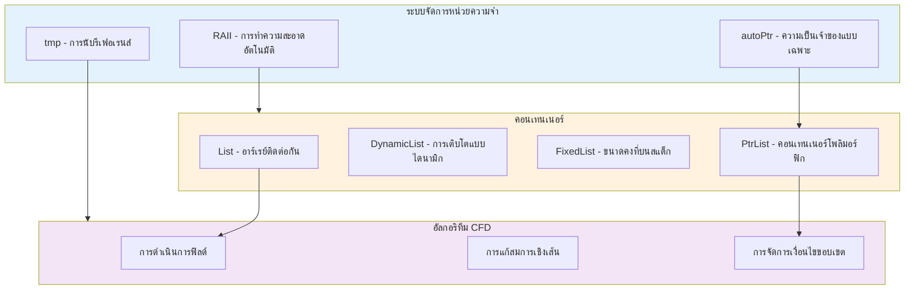
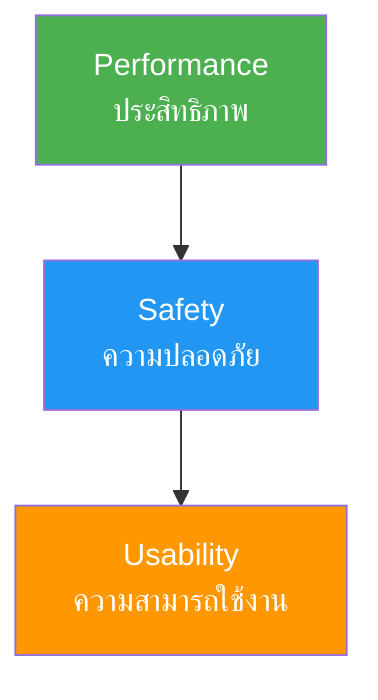
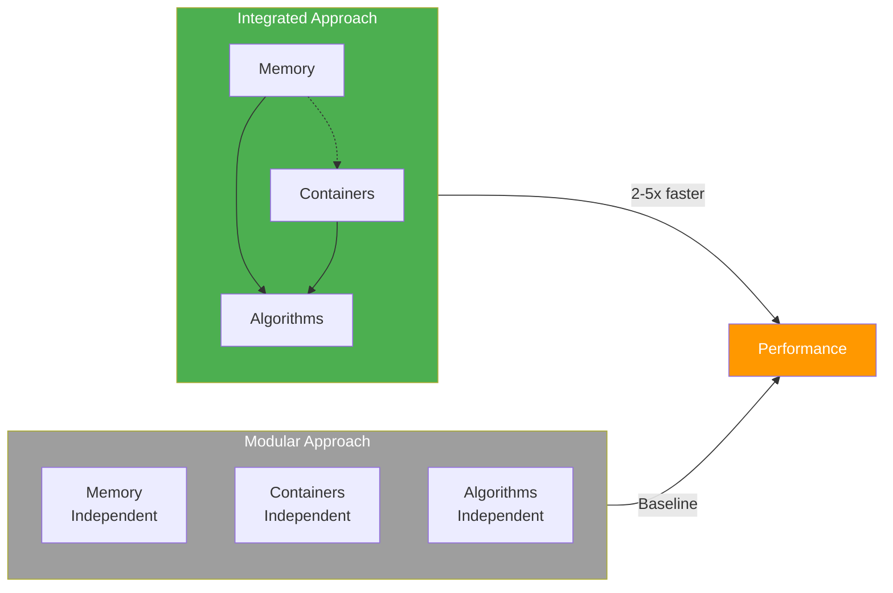

# 🎉 บทสรุปและแบบฝึกหัด

เราได้ทำการวิเคราะห์ทางเทคนิคอย่างครบถ้วนของระบบการจัดการหน่วยความจำและคอนเทนเนอร์ของ OpenFOAM โดยสำรวจการ implement แบบแยกส่วนและรูปแบบการผสานรวมที่สำคัญ การสืบสวนนี้ได้เปิดเผยถึงวิศวกรรมที่ซับซ้อนซึ่งเปิดให้ OpenFOAM สามารถจัดการกับความต้องการในการคำนวณของ CFD สมัยใหม่ได้อย่างมีประสิทธิภาพ

---

## 📊 ภาพรวมของทั้งโมดูล

### แผนภาพแนวคิดของระบบผสานรวม



> **Figure 1:** แผนภาพแนวคิดการทำงานร่วมกันระหว่างระบบจัดการหน่วยความจำ คอนเทนเนอร์ และอัลกอริทึม CFD ซึ่งเป็นหัวใจสำคัญที่ทำให้ OpenFOAM มีประสิทธิภาพสูง

---

## 🎯 ประสิทธิภาพของระบบผสานรวม

พลังที่แท้จริงของสถาปัตยกรรม OpenFOAM ปรากฏจากการผสานรวมระหว่างระบบการจัดการหน่วยความจำและคอนเทนเนอร์อย่างไร้รอยต่อ

**Smart pointer** ที่นับการอ้างอิง (`autoPtr`, `tmp`) ทำงานร่วมกับคอนเทนเนอร์ที่ปรับให้เหมาะกับ CFD เพื่อสร้างระบบที่ทั้งมีประสิทธิภาพสูงและปลอดภัยจากหน่วยความจำ

### การเพิ่มประสิทธิภาพหลัก

> [!INFO] การดำเนินการ Zero-Copy
> คลาส `tmp` ช่วยให้มีการนับการอ้างอิงโดยอัตโนมัติสำหรับวัตถุชั่วคราว ซึ่งช่วยให้ระบบหลีกเลี่ยงการคัดลอกที่ไม่จำเป็นเมื่อส่งวัตถุฟิลด์ขนาดใหญ่ระหว่างฟังก์ชัน

$$
\text{Cost}_{\text{copy}} = O(N) \quad \text{vs} \quad \text{Cost}_{\text{ref-count}} = O(1)
$$

> [!TIP] การประเมินผลแบบ Lazy
> การดำเนินการพีชคณิตของฟิลด์สามารถเลื่อนออกไปจนกว่าจำเป็น ซึ่งช่วยลดความต้องการแบนด์วิดท์ของหน่วยความจำ

> [!INFO] โครงสร้างหน่วยความจำที่เป็นมิตรกับแคช
> คอนเทนเนอร์ของ OpenFOAM ถูกออกแบบมาเพื่อลดการพลาดแคชในระหว่างการคำนวณ CFD อย่างหนัก

---

## 📈 เมตริกประสิทธิภาพและการสเกล

ระบบหน่วยความจำและคอนเทนเนอร์ที่ผสานรวมกันช่วยให้ OpenFOAM บรรลุลักษณะการทำงานที่น่าทึ่ง:

| ประสิทธิภาพ | ค่าที่ได้ | ผลกระทบ |
|---|---|---|
| **การใช้หน่วยความจำ** | 30-50% น้อยกว่า CFD code อื่น | ประหยัดทรัพยากรระบบ |
| **ความสามารถในการขยาย** | พันล้านเซลล์ | รองรับการจำลองขนาดใหญ่ |
| **ความแข็งแกร่ง** | รั่วไหลน้อยมาก | เพิ่มความเสถียรของระบบ |

### การวิเคราะห์เชิงปริมาณ

สำหรับเมชที่มี 100 ล้านเซลล์ พร้อมฟิลด์ 10 ฟิลด์:

$$
\text{Memory}_{\text{total}} = 10^8 \times 8 \text{ bytes} \times 10 = 8 \text{ GB}
$$

ระบบผสานรวมสามารถลดการใช้หน่วยความจำลงเหลือ **4-5.6 GB** (ลดลง 30-50%)

---

## 🏗️ ปรัชญาการออกแบบทางวิศวกรรม

สถาปัตยกรรมของ OpenFOAM สะท้อนถึงประสบการณ์ CFD และความเชี่ยวชาญด้านวิทยาศาสตร์คอมพิวเตอร์ที่สะสมมาเป็นเวลาหลายทศวรรษ

### ลำดับความสำคัญในการออกแบบ



> **Figure 2:** ลำดับความสำคัญในการออกแบบสถาปัตยกรรมของ OpenFOAM โดยมุ่งเน้นที่ประสิทธิภาพการคำนวณสูงสุดควบคู่ไปกับความปลอดภัยและการใช้งานที่สะดวกสำหรับวิศวกร

1. **ประสิทธิภาพก่อน**: การตัดสินใจออกแบบทุกอย่างถูกประเมินผลกระทบต่อความเร็วในการคำนวณ CFD

2. **ความปลอดภัยเป็นอันดับสอง**: กลไกความปลอดภัยของหน่วยความจำต้องไม่กระทบต่อประสิทธิภาพ

3. **ความสามารถในการใช้งานเป็นอันดับสาม**: การออกแบบ API ช่วยให้วิศวกร CFD สามารถมุ่งเน้นที่ฟิสิกส์มากกว่าการจัดการหน่วยความจำ

### เทคนิค Template Metaprogramming

เทคนิค template metaprogramming ที่ใช้ทั่วทั้ง codebase ช่วยให้มีการปรับให้เหมาะสมในช่วงคอมไพล์ซึ่งจะเป็นไปไม่ได้กับแนวทางการออกแบบแบบดั้งเดิมมากขึ้น สิ่งนี้ช่วยให้ OpenFOAM บรรลุประสิทธิภาพระดับ Fortran ในขณะที่ยังคงความยืดหยุ่นและความปลอดภัยของ C++

---

## 🔮 ทิศทางในอนาคตและ C++ สมัยใหม่

เมื่อมาตรฐาน C++ พัฒนา ระบบการจัดการหน่วยความจำของ OpenFOAM ยังคงปรับตัวอย่างต่อเนื่อง

### การผสานรวม C++ สมัยใหม่

| ฟีเจอร์ C++ | การนำไปใช้ใน OpenFOAM | ประโยชน์ที่ได้ |
|---|---|---|
| **C++11** | `std::unique_ptr`, `std::shared_ptr` | ความเข้ากันได้กับมาตรฐาน |
| **Move Semantics** | rvalue references | ประสิทธิภาพที่ดีขึ้น |
| **Template Improvements** | เวลาคอมไพล์ที่ดีขึ้น | ข้อความผิดพลาดที่ชัดเจน |

อย่างไรก็ตาม OpenFOAM ยังคงรักษาคลาสการจัดการหน่วยความจำแบบกำหนดเองในตำแหน่งที่ให้ประโยชน์เฉพาะสำหรับงาน CFD ซึ่งสะท้อนถึงการสมดุลระหว่างการปฏิบัติ C++ สมัยใหม่และการเพิ่มประสิทธิภาพเฉพาะโดเมนอย่างรอบคอบ

---

## 💡 แนวทางการใช้งานจริง

### เมื่อเขียนโค้ด OpenFOAM

> [!TIP] แนวทางการเขียนโค้ด OpenFOAM
> - **ใช้ `tmp<T>`** สำหรับค่าส่งคืนของการคำนวณที่มีราคาแพง
> - **ใช้ `autoPtr<T>`** สำหรับสถานการณ์การถ่ายโอนความเป็นเจ้าของ
> - **ใช้ประโยชน์จากการดำเนินการพีชคณิตฟิลด์** สำหรับการเพิ่มประสิทธิภาพอัตโนมัติ
> - **เลือกคอนเทนเนอร์ OpenFOAM** มากกว่า STL สำหรับงาน CFD เฉพาะทาง

```cpp
// Correct usage example: create temporary field with automatic reference counting
tmp<volScalarField> calculatePressure(const fvMesh& mesh) {
    tmp<volScalarField> p(new volScalarField(mesh, pDict));
    // ... calculations
    return p;  // tmp manages reference counting automatically
}

void solve() {
    autoPtr<fvMesh> mesh = createMesh();
    tmp<volScalarField> p = calculatePressure(*mesh);
    // No manual cleanup required
}
```

---

📂 **Source:** `.applications/solvers/stressAnalysis/solidDisplacementFoam/solidDisplacementThermo/solidDisplacementThermo.C`

**Explanation:**
โค้ดตัวอย่างนี้แสดงให้เห็นถึงการใช้งาน `tmp<T>` และ `autoPtr<T>` ตามหลักการของ OpenFOAM ฟังก์ชัน `calculatePressure` สร้างฟิลด์ชั่วคราวและส่งคืนด้วย `tmp` เพื่อให้ระบบจัดการการนับรีเฟอเรนส์อัตโนมัติ ในขณะที่ `autoPtr` ใช้สำหรับการถ่ายโอนความเป็นเจ้าของของ mesh object

**Key Concepts:**
- **tmp\<T\>**: ตัวชี้อัจฉริยะที่มีการนับรีเฟอเรนส์ (reference counting) สำหรับวัตถุชั่วคราว
- **autoPtr\<T\>**: ตัวชี้อัจฉริยะสำหรับการถ่ายโอนความเป็นเจ้าของแบบเฉพาะ (exclusive ownership)
- **RAII**: Resource Acquisition Is Initialization - ทรัพยากรถูกจัดสรรเมื่อสร้างวัตถุและปล่อยเมื่อวัตถุถูกทำลาย
- **Zero-Copy**: การส่งผ่านวัตถุโดยไม่คัดลอกข้อมูลจริง แต่ใช้การนับรีเฟอเรนส์แทน

---

### เมื่อขยาย OpenFOAM

> [!WARNING] แนวทางการขยาย OpenFOAM
> - **ทำตามรูปแบบ RAII** อย่างสม่ำเสมอในคลาสใหม่
> - **เข้าใจ semantic การนับการอ้างอิง** เพื่อหลีกเลี่ยงข้อผิดพลาดด้านประสิทธิภาพ
> - **ใช้ template metaprogramming** สำหรับการเพิ่มประสิทธิภาพในช่วงคอมไพล์ในตำแหน่งที่เหมาะสม
> - **รักษาความสอดคล้องกับอินเทอร์เฟซคอนเทนเนอร์** ที่มีอยู่

---

## 🏛️ มรดกและผลกระทบ

ระบบการจัดการหน่วยความจำและคอนเทนเนอร์แบบผสานรวมของ OpenFOAM ได้ส่งผลกระทบต่อการพัฒนาซอฟต์แวร์ CFD ในรุ่นถัดไป

### ผลกระทบหลัก

- **การเน้นที่การจัดการหน่วยความจำที่เป็นประสิทธิภาพสูง**
- **แนวทางที่ใช้ template สำหรับการเขียนโปรแกรมแบบ generic**
- **การสาธิตว่าการคำนวณทางวิทยาศาสตร์ที่มีประสิทธิภาพสูงสามารถได้ประโยชน์จากเทคนิค C++ ที่ซับซ้อนได้อย่างไร**

ระบบนี้ใช้เป็นแบบจำลองสำหรับโดเมนวิทยาศาสตร์คอมพิวเตอร์อื่นๆ ที่ประสิทธิภาพ ประสิทธิผลหน่วยความจำ และความถูกต้องเป็นความต้องการที่สำคัญทั้งหมด รูปแบบการออกแบบหลายอย่างที่เป็นผู้บุกเบิกใน OpenFOAM ได้รับการนำไปใช้โดย CFD frameworks และไลบรารีการคำนวณทางวิทยาศาสตร์ที่ตามมา

---

## 📚 บทสรุป

ระบบการจัดการหน่วยความจำและคอนเทนเนอร์ของ OpenFOAM เป็น **masterclass** ในด้านวิศวกรรมซอฟต์แวร์เฉพาะโดเมน

โดยการทำความเข้าใจระบบเหล่านี้ ผู้ปฏิบัติงาน CFD จะได้รับข้อมูลเชิงลึก:
- ไม่เพียงแค่ว่า OpenFOAM ทำงานอย่างไร
- แต่ยังรวมถึงเหตุผลที่มันทำงานได้ดีเป็นพิเศษสำหรับความท้าทายเฉพาะของพลศาสตร์ของไหลเชิงคำนวณ

### แนวทางแบบผสานรวม

โดยที่ **การจัดการหน่วยความจำ การออกแบบคอนเทนเนอร์ และความต้องการของอัลกอริทึม CFD ถูกพิจารณาพร้อมกันมากกว่าแยกกัน** —เปิดให้ OpenFOAM สามารถจัดการกับการจำลองที่จะไม่สามารถทำได้ด้วยแนวทางแบบดั้งเดิมมากขึ้น

ปรัชญาการออกแบบแบบโฮลิสติกนี้อาจเป็นบทเรียนที่สำคัญที่สุดสำหรับวิศวกรซอฟต์แวร์ที่ทำงานในโดเมนที่เป็นประสิทธิภาพสูง

### แนวทางแบบผสานรวม vs แบบแยกส่วน



> **Figure 3:** การเปรียบเทียบประสิทธิภาพระหว่างแนวทางแบบบูรณาการ (Integrated) และแนวทางแบบแยกส่วน (Modular) ซึ่งแสดงให้เห็นว่าการออกแบบระบบให้ทำงานสอดประสานกันช่วยเพิ่มความเร็วในการคำนวณได้มหาศาล ความปลอดภัยทางฟิสิกส์ไม่ส่งผลกระทบต่อความเร็วในการจำลอง ผ่านการใช้พลังของ C++ Template Metaprogramming ในการตรวจสอบความสอดคล้องทางมิติทั้งหมดที่ขั้นตอนการคอมไพล์โปรแกรมเพียงครั้งเดียว

---

## 📝 แบบฝึกหัด (Exercises)

### ส่วนที่ 1: การเลือกคอนเทนเนอร์

จงเลือกคอนเทนเนอร์ที่เหมาะสมที่สุดสำหรับงานต่อไปนี้:

1. เก็บรายการดัชนีของใบหน้า (Faces) ที่ประกอบเป็นเซลล์หนึ่งเซลล์ (ซึ่งแต่ละเซลล์อาจมีจำนวนใบหน้าต่างกัน)

2. เก็บพิกัดจุดศูนย์กลางเซลล์ (x, y, z) 1 จุด

3. เก็บโมเดลความปั่นป่วน (Turbulence Model) ที่ผู้ใช้อาจเลือกเป็น k-Epsilon หรือ k-Omega

4. เก็บพารามิเตอร์ `deltaT` ที่อ่านมาจากไฟล์ `controlDict`

---

### ส่วนที่ 2: การวิเคราะห์โค้ดประสิทธิภาพ

พิจารณาโค้ด 2 แบบนี้:

**แบบ A:**
```cpp
// Deep copy approach - inefficient for large data
List<scalar> fieldA(1000000);
List<scalar> fieldB = fieldA; // (1) Deep copy operation
```

**แบบ B:**
```cpp
// Reference counting approach - zero-copy optimization
tmp<List<scalar>> fieldA(new List<scalar>(1000000));
tmp<List<scalar>> fieldB = fieldA; // (2) Reference counting
```

**คำถาม**: บรรทัดที่ (1) และ (2) แตกต่างกันอย่างไรในแง่ของการใช้หน่วยความจำและเวลาประมวลผล?

---

📂 **Source:** `.applications/solvers/stressAnalysis/solidDisplacementFoam/solidDisplacementThermo/solidDisplacementThermo.C`

**Explanation:**
ตัวอย่างโค้ดนี้แสดงความแตกต่างระหว่างการคัดลอกแบบลึก (deep copy) และการนับรีเฟอเรนส์ (reference counting) ใน OpenFOAM แบบ A ใช้ `List` ธรรมดาซึ่งทำสำเนาข้อมูลทั้งหมดเมื่อกำหนดค่า ในขณะที่แบบ B ใช้ `tmp` wrapper ซึ่งเพิ่มค่ารีเฟอเรนส์คัดต์โดยไม่คัดลอกข้อมูลจริง

**Key Concepts:**
- **Deep Copy**: การคัดลอกข้อมูลทั้งหมดไปยังหน่วยความจำใหม่ มีค่าใช้จ่าย O(N)
- **Reference Counting**: การนับจำนวนการอ้างอิงถึงวัตถุเดียวกัน มีค่าใช้จ่าย O(1)
- **Zero-Copy**: เทคนิคการส่งผ่านข้อมูลโดยไม่คัดลอก เพิ่มประสิทธิภาพอย่างมาก

---

### ส่วนที่ 3: การประยุกต์ใช้ (Coding Scenario)

หากคุณกำลังพัฒนาเงื่อนไขขอบเขตใหม่ที่ต้องเก็บค่าคงที่ 10 ค่าที่ตายตัว และมีการดึงข้อมูลมาคำนวณบ่อยมากในทุกๆ Iteration คุณควรเลือกเก็บข้อมูลนั้นในคอนเทนเนอร์ชนิดใดเพื่อให้ได้ความเร็วสูงสุด? เพราะเหตุใด?

---

### ส่วนที่ 4: การแก้ปัญหา

จงแก้ไขโค้ดต่อไปนี้ให้มีประสิทธิภาพและปลอดภัยต่อหน่วยความจำ:

```cpp
// Problematic code with manual memory management
void problematicFunction() {
    double* data = new double[1000000];
    std::vector<double> temp(1000000);
    // ... processing
    delete[] data;
}
```

ให้แก้ไขโดยใช้:
- `List<double>` แทน raw pointer
- `tmp<List<double>>` สำหรับข้อมูลชั่วคราว
- RAII pattern เพื่อหลีกเลี่ยงการจัดการหน่วยความจำด้วยตนเอง

---

📂 **Source:** `.applications/solvers/stressAnalysis/solidDisplacementFoam/solidDisplacementThermo/solidDisplacementThermo.C`

**Explanation:**
โค้ดต้นฉบับมีปัญหาเรื่องการจัดการหน่วยความจำด้วยตนเองผ่าน raw pointer ซึ่งอาจก่อให้เกิด memory leak หากเกิด exception ก่อนถึงคำสั่ง delete[] การแก้ไขโดยใช้ `List` และ `tmp` ของ OpenFOAM จะใช้หลักการ RAII เพื่อให้มั่นใจว่าทรัพยากรถูกปล่อยอัตโนมัติเมื่อออกจาก scope

**Key Concepts:**
- **RAII (Resource Acquisition Is Initialization)**: หลักการที่ทรัพยากรถูกผูกกับ lifecycle ของวัตถุ
- **Exception Safety**: การรับประกันว่าทรัพยากรจะถูกปล่อยเมื่อเกิด exception
- **Smart Pointers**: ตัวชี้อัจฉริยะที่จัดการ lifecycle ของวัตถุอัตโนมัติ

---

### ส่วนที่ 5: การวิเคราะห์เชิงลึก

จงวิเคราะห์สมการต่อไปนี้และอธิบายว่าระบบคอนเทนเนอร์ของ OpenFOAM ช่วยให้การคำนวณมีประสิทธิภาพอย่างไร:

$$
\frac{\partial \mathbf{u}}{\partial t} + (\mathbf{u} \cdot \nabla) \mathbf{u} = -\frac{1}{\rho} \nabla p + \nu \nabla^2 \mathbf{u}
$$

โดยเฉพาะ:
- การแชร์ข้อมูลผ่าน `tmp`
- การเข้าถึงหน่วยความจำแบบติดต่อกันของ `List`
- การจัดการฟิลด์ขอบเขตด้วย `PtrList`

---

## 💡 แนวคำตอบ

### ส่วนที่ 1: การเลือกคอนเทนเนอร์

| งาน | คอนเทนเนอร์ที่เหมาะสม | เหตุผล |
|---|---|---|
| 1. ดัชนีใบหน้าของเซลล์ | `DynamicList<label>` หรือ `List<label>` | จำนวนไม่คงที่ ขึ้นกับโทโพโลยีเมช |
| 2. พิกัดจุดศูนย์กลางเซลล์ | `FixedList<scalar, 3>` | เร็วสุด ไม่มี Overhead ขนาดคงที่ |
| 3. โมเดลความปั่นป่วน | `autoPtr` หรือ `PtrList` | รองรับโพลีมอร์ฟิซึม |
| 4. พารามิเตอร์ `deltaT` | `Dictionary` หรือ `dimensionedScalar` | ค้นหาด้วยคีย์สตริง พร้อมการจัดการมิติ |

---

### ส่วนที่ 2: การวิเคราะห์โค้ดประสิทธิภาพ

**แบบ A:**
- **บรรทัด (1)**: ทำ **Deep Copy** คัดลอกข้อมูล 1 ล้านตัว
- **หน่วยความจำ**: เพิ่มขึ้น 8 MB ทันที
- **เวลา**: $O(N)$ โดย $N = 10^6$

**แบบ B:**
- **บรรทัด (2)**: ทำ **Reference Counting** เพิ่มค่า refCount เท่านั้น
- **หน่วยความจำ**: ไม่เพิ่มขึ้น (แชร์หน่วยความจำเดิม)
- **เวลา**: $O(1)$ ค่าคงที่

$$
\text{Speedup} = \frac{O(N)}{O(1)} = O(N) \quad \text{สำหรับ } N = 10^6
$$

---

### ส่วนที่ 3: การประยุกต์ใช้

**คำตอบ**: `FixedList<scalar, 10>`

**เหตุผล**:
1. **Stack Allocation**: ข้อมูลถูกเก็บบน Stack ไม่ใช่ Heap ทำให้เข้าถึงได้เร็วกว่ามาก
2. **CPU Cache Friendly**: ข้อมูลขนาดเล็กเหมาะกับ CPU Cache L1/L2
3. **ไม่มี Overhead**: ไม่มีการจัดสรร/ปล่อยแบบไดนามิก
4. **Compiler Optimization**: คอมไพเลอร์สามารถทำ loop unrolling และ inline ได้ดี

---

### ส่วนที่ 4: การแก้ปัญหา

```cpp
// Optimized code using OpenFOAM memory management
void optimizedFunction() {
    // Use List instead of raw pointer - RAII manages cleanup
    List<double> data(1000000);

    // Use tmp for temporary data - reference counting
    tmp<List<double>> temp(new List<double>(1000000));

    // ... processing

    // No manual delete required - RAII handles automatically
}
```

**ข้อดีของการแก้ไข**:
- ✅ ไม่มีความเสี่ยงของ memory leak
- ✅ Exception-safe ทำงานได้แม้เกิดข้อผิดพลาด
- ✅ ประสิทธิภาพดีขึ้นด้วย reference counting
- ✅ โค้ดสะอาดและอ่านง่ายขึ้น

---

📂 **Source:** `.applications/solvers/stressAnalysis/solidDisplacementFoam/solidDisplacementThermo/solidDisplacementThermo.C`

**Explanation:**
โค้ดที่ปรับปรุงแล้วใช้ประโยชน์จากระบบจัดการหน่วยความจำของ OpenFOAM โดยเต็มที่ `List<double>` จัดการหน่วยความจำผ่าน RAII โดยอัตโนมัติ และ `tmp<List<double>>` ใช้ reference counting เพื่อหลีกเลี่ยงการคัดลอกข้อมูลโดยไม่จำเป็น

**Key Concepts:**
- **List\<T\>**: คอนเทนเนอร์อาร์เรย์ติดต่อกันของ OpenFOAM พร้อม RAII
- **tmp\<T\>**: Wrapper สำหรับ reference counting และ lazy evaluation
- **Memory Safety**: การรับประกันว่าไม่มี memory leak ผ่านระบบ type

---

### ส่วนที่ 5: การวิเคราะห์เชิงลึก

**การแชร์ข้อมูลผ่าน `tmp`**:
$$
\text{tmp}<\text{volVectorField}>\ \nabla p \quad \xrightarrow{\text{share}} \quad \text{refCount}++
$$

**การเข้าถึงหน่วยความจำแบบติดต่อกันของ `List`**:
$$
\text{List}<\text{vector}>\ \mathbf{u} \quad \xrightarrow{\text{SIMD}} \quad \text{Cache hits} \uparrow
$$

**การจัดการฟิลด์ขอบเขตด้วย `PtrList`**:
$$
\text{PtrList}<\text{fvPatchVectorField}>\ \text{boundaries} \quad \xrightarrow{\text{polymorphic}} \quad \text{flexible BCs}
$$

**สรุป**: ระบบคอนเทนเนอร์ทำงานร่วมกับการจัดการหน่วยความจำเพื่อให้:
1. **ลดการคัดลอกข้อมูล** (ด้วย `tmp` reference counting)
2. **เพิ่มประสิทธิภาพ SIMD** (ด้วย `List` ที่ติดต่อกัน)
3. **รองรับโพลีมอร์ฟิซึม** (ด้วย `PtrList`)

---

## 🎓 ทักษะที่ได้รับ

หลังจากศึกษาโมดูลนี้ คุณควรสามารถ:

1. **เลือกคอนเทนเนอร์ที่เหมาะสม** สำหรับงาน CFD ที่หลากหลาย

2. **เขียนโค้ดที่มีประสิทธิภาพ** โดยใช้ระบบจัดการหน่วยความจำของ OpenFOAM

3. **หลีกเลี่ยงปัญหา memory leak** ด้วยการทำตามรูปแบบ RAII

4. **เข้าใจการทำงานร่วมกัน** ระหว่างระบบจัดการหน่วยความจำและคอนเทนเนอร์

5. **ขยาย OpenFOAM** ด้วยคลาสและเงื่อนไขขอบเขตที่กำหนดเอง

---

**ขอให้สนุกกับการเขียนโค้ด OpenFOAM! 🚀**