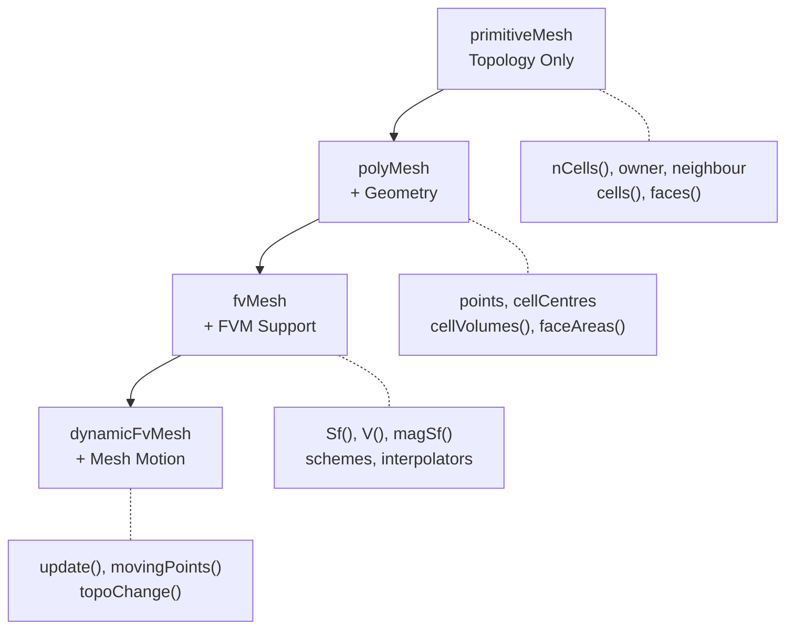

# Mesh Classes - Overview

Overview of Mesh Classes in OpenFOAM — The Heart of Every Simulation

---

## 🎯 Learning Objectives

By the end of this module, you will:
- Understand the **four-layer mesh class hierarchy** and when to use each
- Know the **difference between topology and geometry** in mesh representation
- Be able to **navigate mesh connectivity** (owner, neighbour, cell-face relationships)
- Learn **essential mesh APIs** for common programming tasks
- Avoid **common pitfalls** in mesh access patterns

---

## 📋 Prerequisites

Before studying this module, you should be familiar with:
- **Basic C++** concepts (classes, inheritance, pointers, references)
- **Template fundamentals** (covered in Module 02: Dimensioned Types)
- **Container classes** (List, Field, etc. from Module 01-03)
- **Finite Volume Method basics** (control volumes, face fluxes, boundary conditions)

**Recommended Background:**
- Mesh fundamentals from **Module 02: Meshing and Case Setup**
- Boundary conditions from **Module 01: CFD Fundamentals**

---

## 📌 Why Mesh Classes Matter

> **💡 No Mesh, No CFD** — Every field exists on a mesh

Mesh classes are the **foundation of OpenFOAM programming**:

| Aspect | Why It Matters |
|--------|----------------|
| **Understanding** = Know which methods live in which classes |
| **Performance** = Correct API selection = faster code |
| **Debugging** = Wrong mesh access = mysterious bugs |
| **Extensibility** = Inheritance hierarchy enables customization |

---

## 🏗️ What is the Mesh Hierarchy?

The mesh hierarchy represents **layers of abstraction** from raw connectivity to full FVM support:



### The 3W Breakdown

**What?** A four-class inheritance hierarchy where each layer adds functionality

**Why?** Separation of concerns enables:
- **Efficiency**: Use minimal capabilities needed
- **Flexibility**: Different solvers need different features
- **Maintainability**: Clear organization of mesh operations

**How?** Through inheritance:
```cpp
primitiveMesh  // Base class: connectivity
    ↑
polyMesh       // Adds geometry
    ↑
fvMesh         // Adds FVM-specific methods
    ↑
dynamicFvMesh  // Adds motion capabilities
```

---

## 📦 Class Hierarchy Reference

| Class | Purpose | Typical Usage | Return Type |
|-------|---------|---------------|-------------|
| `primitiveMesh` | Topology only (connectivity) | Low-level mesh algorithms | `label`, `labelList` |
| `polyMesh` | + Geometry (coordinates) | Mesh manipulation, preprocessing | `vectorField`, `pointField` |
| `fvMesh` | + FV methods (fields on mesh) | Solver development, BCs | `volScalarField`, `surfaceVectorField` |
| `dynamicFvMesh` | + Mesh motion | Moving mesh simulations | `bool` (update status) |

---

## 🔑 Key Concepts by Layer

### Layer 1: Topology (primitiveMesh)

**What?** Pure connectivity — how cells connect to faces, faces to points

**Why?** Many algorithms need only topology, not coordinates

**How?** Access via mesh object:

```cpp
// Get basic topology counts
label nCells = mesh.nCells();              // Returns: label
label nFaces = mesh.nFaces();              // Returns: label
label nPoints = mesh.nPoints();            // Returns: label
label nInternalFaces = mesh.nInternalFaces(); // Returns: label

// Access connectivity
const labelList& owner = mesh.faceOwner();       // Returns: const labelList&
const labelList& neighbour = mesh.faceNeighbour(); // Returns: const labelList&
const cellList& cells = mesh.cells();             // Returns: const cellList&
```

### Layer 2: Geometry (polyMesh)

**What?** Adds spatial coordinates to topology

**Why?** Need positions for calculations, visualization, mesh quality

**How?** Geometry access methods:

```cpp
// Cell geometry
const vectorField& C = mesh.cellCentres();   // Returns: const vectorField&
const scalarField& V = mesh.cellVolumes();   // Returns: const scalarField&

// Face geometry
const vectorField& Cf = mesh.faceCentres();  // Returns: const vectorField&
const vectorField& Sf = mesh.faceAreas();    // Returns: const vectorField&

// Point geometry
const pointField& points = mesh.points();    // Returns: const pointField&
```

### Layer 3: Finite Volume (fvMesh)

**What?** Adds GeometricFields for FVM calculations

**Why?** Solvers work with fields (boundary-aware, dimension-aware)

**How?** Field-based access:

```cpp
// Finite volume geometric fields
const surfaceVectorField& Sf = mesh.Sf();     // Returns: const surfaceVectorField&
const surfaceScalarField& magSf = mesh.magSf(); // Returns: const surfaceScalarField&
const volScalarField& V = mesh.V();           // Returns: const volScalarField&
const volVectorField& C = mesh.C();           // Returns: const volVectorField&

// Access schemes and interpolators
const fvSchemes& schemes = mesh.schemes();    // Returns: const fvSchemes&
const surfaceInterpolation& interp = mesh.interpolation(); // Returns: const surfaceInterpolation&
```

---

## 🔗 Mesh Connectivity

### Face → Cells (Owner/Neighbour)

```cpp
const labelList& owner = mesh.faceOwner();
const labelList& neighbour = mesh.faceNeighbour();

// For a specific face
label faceI = 12345;
label ownerCell = owner[faceI];           // Owner cell index

// Neighbour only exists for internal faces
if (faceI < mesh.nInternalFaces())
{
    label neighbourCell = neighbour[faceI];
    Info << "Face " << faceI << " between cells " 
         << ownerCell << " and " << neighbourCell << endl;
}
```

### Cell → Faces

```cpp
const cellList& cells = mesh.cells();
const cell& c = cells[cellI];

// Iterate over faces of a cell
label cellI = 100;
const cell& c = mesh.cells()[cellI];

forAll(c, i)
{
    label faceI = c[i];
    
    // Determine if this is an internal or boundary face
    if (faceI < mesh.nInternalFaces())
    {
        // Internal face
        label nbr = mesh.faceNeighbour()[faceI];
    }
    else
    {
        // Boundary face — find which patch
        label patchI = mesh.boundaryMesh().whichPatch(faceI);
    }
}
```

---

## 🎯 Boundary Mesh Access

```cpp
const fvBoundaryMesh& boundary = mesh.boundary();  // Returns: const fvBoundaryMesh&

// Iterate over all boundary patches
forAll(boundary, patchI)
{
    const fvPatch& patch = boundary[patchI];
    word patchName = patch.name();                    // Returns: word
    label nPatchFaces = patch.size();                 // Returns: label
    label startFace = patch.start();                  // Returns: label
    
    Info << "Patch " << patchName << ": " << nPatchFaces 
         << " faces, starting at face " << startFace << endl;
}

// Access specific patch by name
word patchName = "inlet";
label patchI = mesh.boundary().findPatchID(patchName); // Returns: label

if (patchI != -1)
{
    const fvPatch& patch = mesh.boundary()[patchI];
    // ... work with patch
}
```

---

## 📁 Mesh File Structure

```
constant/polyMesh/
├── points          # Vertex coordinates (List<vector>)
├── faces           # Face definitions (List<face>)
├── owner           # Face owner cell indices (List<label>)
├── neighbour       # Face neighbour indices (List<label>)
├── boundary        # Boundary patch definitions (List<polyEntry>)
└── cellZones       # Optional: Cell groupings
```

**What's What:**
- **points**: `[x y z]` coordinates for each vertex
- **faces**: List of point indices forming each face
- **owner**: Cell index owning each face
- **neighbour**: Neighbour cell for internal faces only
- **boundary**: Patch names, types, and face ranges

---

## 📚 Module Contents

| File | Topic | Key Focus |
|------|-------|-----------|
| `01_Introduction` | Basics & Motivation | Why mesh classes matter |
| `02_Mesh_Hierarchy` | Class Structure | Inheritance, capabilities |
| `03_primitiveMesh` | Topology Layer | Connectivity, algorithms |
| `04_polyMesh` | Geometry Layer | Coordinates, volumes |
| `05_fvMesh` | FVM Layer | Fields, schemes, solvers |
| `06_Common_Pitfalls` | Error Prevention | Debugging tips |
| `07_Summary` | Exercises | Practice problems |

---

## ⚡ Quick Reference

### Common Mesh Operations

| Need | Method | Return Type | Notes |
|------|--------|-------------|-------|
| **Counts** | | | |
| Cell count | `mesh.nCells()` | `label` | Total cells in mesh |
| Face count | `mesh.nFaces()` | `label` | Internal + boundary |
| Internal faces | `mesh.nInternalFaces()` | `label` | Faces between cells |
| Point count | `mesh.nPoints()` | `label` | Vertices |
| Patch count | `mesh.boundary().size()` | `label` | Boundary patches |
| **Cell Data** | | | |
| Cell centers | `mesh.C()` | `const volVectorField&` | FVM field, boundary-aware |
| Cell centers | `mesh.cellCentres()` | `const vectorField&` | Raw field, no boundary |
| Cell volumes | `mesh.V()` | `const volScalarField&` | FVM field |
| Cell volumes | `mesh.cellVolumes()` | `const scalarField&` | Raw field |
| **Face Data** | | | |
| Face areas | `mesh.Sf()` | `const surfaceVectorField&` | FVM field, vector |
| Face areas | `mesh.faceAreas()` | `const vectorField&` | Raw field |
| Face magnitudes | `mesh.magSf()` | `const surfaceScalarField&` | Scalar area |
| Face centers | `mesh.Cf()` | `const surfaceVectorField&` | FVM field |
| **Connectivity** | | | |
| Face owner | `mesh.faceOwner()` | `const labelList&` | Owner cell for each face |
| Face neighbour | `mesh.faceNeighbour()` | `const labelList&` | Internal faces only |
| Cell faces | `mesh.cells()` | `const cellList&` | Faces for each cell |
| **Boundary** | | | |
| Boundary mesh | `mesh.boundary()` | `const fvBoundaryMesh&` | All patches |
| Find patch | `mesh.boundary().findPatchID(name)` | `label` | Returns -1 if not found |
| Points | `mesh.points()` | `const pointField&` | All mesh vertices |

---

## 🧠 Concept Check

<details>
<summary><b>1. What's the difference between primitiveMesh and polyMesh?</b></summary>

**Answer:**
- **primitiveMesh**: Provides topology only (connectivity relationships between cells, faces, points)
- **polyMesh**: Extends primitiveMesh to add geometry (actual coordinates in space)

Use primitiveMesh when you only need to know *how things connect*. Use polyMesh when you need *where things are located*.
</details>

<details>
<summary><b>2. What are owner and neighbour faces?</b></summary>

**Answer:**
- **owner**: The cell on one side of a face (always exists for every face)
- **neighbour**: The cell on the opposite side (only exists for internal faces)

OpenFOAM uses a convention where each face has exactly one owner, but may have zero or one neighbour depending on whether it's an internal or boundary face.
</details>

<details>
<summary><b>3. Where are boundary faces located in the face indexing?</b></summary>

**Answer:**

Boundary faces occupy indices from `nInternalFaces()` to `nFaces()-1`.

For example:
- Internal faces: `0` to `nInternalFaces()-1`
- Boundary faces: `nInternalFaces()` to `nFaces()-1`
</details>

<details>
<summary><b>4. Why does fvMesh return GeometricFields instead of raw Fields?</b></summary>

**Answer:**

GeometricFields (like `volScalarField`) are:
- **Boundary-aware**: Automatically handle boundary conditions
- **Dimension-aware**: Track physical units
- **Mesh-aware**: Know their relationship to the mesh
- **Interpolation-ready**: Can interpolate to faces, points

Use GeometricFields in solver development. Use raw Fields for low-level algorithms where boundary handling isn't needed.
</details>

---

## 🎯 Key Takeaways

- ✅ **Mesh hierarchy = layers of capability**: primitiveMesh → polyMesh → fvMesh → dynamicFvMesh
- ✅ **Topology ≠ Geometry**: primitiveMesh knows connections, polyMesh knows positions
- ✅ **Use the right layer**: Don't pay for capabilities you don't need
- ✅ **FVM uses GeometricFields**: `mesh.Sf()` returns a field, not an array
- ✅ **Owner/Neighbour is key**: Understanding face-cell connectivity is essential
- ✅ **Boundary faces come last**: Indices `nInternalFaces()` to `nFaces()-1`
- ✅ **Know your return types**: `label` vs `labelList&` vs `volScalarField&`

---

## 🔗 Navigation

### Previous Topics
- **Module 03: Containers & Memory** - Memory management fundamentals
- **Module 02: Dimensioned Types** - Physics-aware type system
- **Module 01: Foundation Primitives** - Basic OpenFOAM types

### Current Module: Mesh Classes
- **Next: 01_Introduction** - Deep dive into mesh basics and motivation
- **02_Mesh_Hierarchy** - Detailed class architecture
- **03_primitiveMesh** - Topology algorithms
- **04_polyMesh** - Geometry operations
- **05_fvMesh** - FVM-specific methods

### Related Topics
- **Module 02: Meshing & Case Setup** - Practical mesh generation
- **Boundary Conditions** - How BCs interact with mesh patches
- **Solver Development** - Building custom solvers with mesh classes
- **Field Classes** - GeometricFields and their relationship to mesh

### External Resources
- **OpenFOAM Code:** `src/meshes/` - Source code for all mesh classes
- **Doxygen:** [Mesh Class Hierarchy](https://www.openfoam.com/documentation/guide/)
- **CFD Online:** [Mesh Programming Forum](https://www.cfd-online.com/Forums/openfoam-programming-develop/)