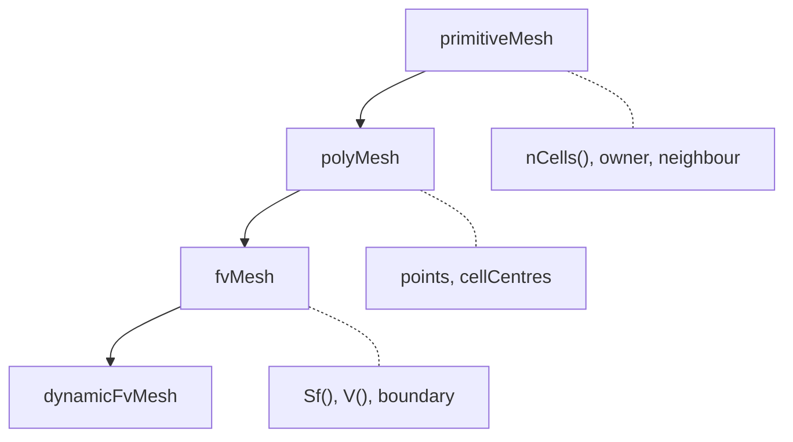

# Mesh Classes - Overview

ภาพรวม Mesh Classes ใน OpenFOAM — หัวใจของทุก simulation

> **ทำไม Mesh Classes สำคัญที่สุด?**
> - **ไม่มี mesh ไม่มี CFD** — ทุก field อยู่บน mesh
> - เข้าใจ hierarchy = รู้ว่า method ไหนอยู่ class ไหน
> - ใช้ mesh APIs ผิด = bugs + performance ย่ำแย่

---

## Overview

> **💡 Mesh Hierarchy = Layers of Abstraction**
>
> - `primitiveMesh`: **Topology** (connections only)
> - `polyMesh`: + **Geometry** (coordinates)
> - `fvMesh`: + **FVM support** (Sf, V, schemes)



---

## 1. Class Hierarchy

| Class | Purpose |
|-------|---------|
| `primitiveMesh` | Topology only |
| `polyMesh` | + Geometry |
| `fvMesh` | + FV methods |
| `dynamicFvMesh` | + Mesh motion |

---

## 2. Key Concepts

### Topology (primitiveMesh)

```cpp
label nCells = mesh.nCells();
label nFaces = mesh.nFaces();
label nPoints = mesh.nPoints();
label nInternalFaces = mesh.nInternalFaces();
```

### Geometry (polyMesh)

```cpp
const vectorField& C = mesh.cellCentres();
const scalarField& V = mesh.cellVolumes();
const vectorField& Sf = mesh.faceAreas();
```

### Finite Volume (fvMesh)

```cpp
const surfaceVectorField& Sf = mesh.Sf();
const surfaceScalarField& magSf = mesh.magSf();
const volScalarField& V = mesh.V();
```

---

## 3. Connectivity

### Face → Cells

```cpp
const labelList& owner = mesh.faceOwner();
const labelList& neighbour = mesh.faceNeighbour();

label ownerCell = owner[faceI];
label neighbourCell = neighbour[faceI];  // Internal only
```

### Cell → Faces

```cpp
const cellList& cells = mesh.cells();
const cell& c = cells[cellI];
forAll(c, i)
{
    label faceI = c[i];
}
```

---

## 4. Boundary

```cpp
const fvBoundaryMesh& boundary = mesh.boundary();

forAll(boundary, patchI)
{
    const fvPatch& patch = boundary[patchI];
    word name = patch.name();
    label nFaces = patch.size();
}
```

---

## 5. Mesh Files

```
constant/polyMesh/
├── points      # Vertex coordinates
├── faces       # Face definitions
├── owner       # Face owners
├── neighbour   # Face neighbours
└── boundary    # Patch definitions
```

---

## 6. Module Contents

| File | Topic |
|------|-------|
| 01_Introduction | Basics |
| 02_Mesh_Hierarchy | Class structure |
| 03_primitiveMesh | Topology |
| 04_polyMesh | Geometry |
| 05_fvMesh | FV methods |
| 06_Common_Pitfalls | Errors |
| 07_Summary | Exercises |

---

## Quick Reference

| Need | Method |
|------|--------|
| Cell count | `mesh.nCells()` |
| Face count | `mesh.nFaces()` |
| Cell centers | `mesh.C()` |
| Cell volumes | `mesh.V()` |
| Face areas | `mesh.Sf()` |
| Patches | `mesh.boundary()` |

---

## 🧠 Concept Check

<details>
<summary><b>1. primitiveMesh vs polyMesh ต่างกันอย่างไร?</b></summary>

- **primitiveMesh**: Topology (connectivity) only
- **polyMesh**: + Geometry (coordinates)
</details>

<details>
<summary><b>2. owner vs neighbour คืออะไร?</b></summary>

- **owner**: Cell ที่เป็นเจ้าของ face
- **neighbour**: Cell อีกด้าน (internal faces only)
</details>

<details>
<summary><b>3. boundary face อยู่ตรงไหน?</b></summary>

Face indices `nInternalFaces()` ถึง `nFaces()-1`
</details>

---

## 📖 เอกสารที่เกี่ยวข้อง

- **Introduction:** [01_Introduction.md](01_Introduction.md)
- **fvMesh:** [05_fvMesh.md](05_fvMesh.md)